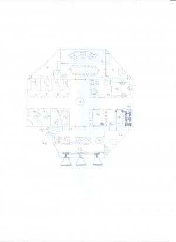

Tento modul sloužil svojí posádce velmi dobře do doby, než se střetl s meteorickým rojem, při jehož průletu byl velmi vážně poškozen, a posádka se musela urychleně evakuovat. Od té doby bloudí vesmírem v úsporném režimu…

### 1 Vstup

__Kruhový poklop v podlaze__ – Standardní vstup na loď. Při jeho otevření se dole vysunou schůdky.

### 2 Konferenční místnost

__Dlouhý stůl s mnoha křesly__ – Opravdu mnoha. Tolik lidí se tu ani nikdy nesešlo.

__Holografický projektor__ – Nainstalovaný ve stropu. Veškeré informace a prezentace se z něj promítaly nad stůl doprostřed místnosti.

__Stromek v rohu__ – Uschlý. Sloužil jako dekorace.

__Znaky galaktické republiky na stěnách__

### 3 Palubní můstek

__Řídící panel s centrálním počítačem__ – Odtud se ovládala celá loď. Počítač hlásí selhání všeho možného.

__Čelní skla__ – Dvě obrovská okna do vesmíru. Současně sloužila jako displeje. Levé schytalo velkou ránu a je popraskané.

__Tři křesla__

### 4 Luxusní kabina

Občas se na lodi vyskytla i nějaká velmi důležitá persona, která zde byla ubytována.

__Červený koberec se zlatými ornamenty__

__Pohodlné lůžko__ – Matrace, polštář, přikrývka. Vše v elegantním designu a ergonomických tvarech.

__Noční stolek v rohu__ – Je na něm postavený trojrozměrný elektronický globus galaxie.

__Stůl__ – Je na něm počítač – LCD monitor a klávesnice.

__Luxusní pozlacené křeslo__

__Bar v rohu__ – Obsahuje i takové pálenky, jaké lidské hrdlo nedokáže vypít.

__Knihovna u zdi__ – Obsahuje staré dobré knihy. Převážně beletrii, encyklopedie, cestopisy a mapy.

__Klícka s opičkou__ – Klícka je převržená a opička utekla. Může pobíhat kdekoli po lodi.

__Holografický projektor__ – Nainstalovaný ve stropu.

__Obrazy na stěnách__ – Scenérie z planet Varuna a Sanyata.

### 5 Kapitánova kabina

__Dveře__ – Jsou zaheslované biometrickým kódem a dostat se dovnitř nebude snadné. Buď se musí hacknout centrální počítač na palubním můstku, nebo to spraví nějaká věcička z technické místnosti či zbrojnice.

__Tmavě zelený koberec__

__Lůžko__ – Matrace, polštář, přikrývka. Vše v jednoduchém designu a ergonomických tvarech.

__Noční stolek v rohu__ – Je na něm postaveno kapitánské ocenění.

__Skříň__ – Vesměs nošené uniformy. Obzvláště pěkná je ta bílá.

__Pracovní stůl s židlí a počítačem__ – LCD monitor a klávesnice. Počítač je zaheslovaný.

__Stolek s akváriem__ – Akvárium se rozbilo. Střepy a mrtvé rybky se válejí po podlaze.

__Šuplíky ve stolku__ – Obsahují osobní kapitánovy věci. Kontaktní čočky, tablet, pohyblivé fotky nějaké dívky, nabitá pistole a … (doplň cokoliv, co uznáš za zajímavé)

Velký LCD monitor na zdi

Holografický projektor ve stropu

### 6–8 Osobní místnosti

Místnosti jednotlivých členů posádky. Všechny jsou navržené stejně.

__Lůžko__ – Matrace, polštář, přikrývka. Vše v jednoduchém designu a ergonomických tvarech.

__Stůl__ – V různých místnostech lze najít ve stolech různé věci – knihu „Cesta ke hvězdám“, v jiném sponky do vlasů, v dalším tablet a v posledním průkaz do tetovacího salónu.

__Počítač__ – LCD monitor s klávesnicí. Počítače nejsou zaheslovány a lze se tak dočíst víc o jednotlivých členech posádky.

__Židle__

__Činky a běhací pás__ – V místnosti s oním průkazem.

### 9 Pánská koupelna

__Sprcha__ – Zničená mohutným nárazem.

__Umyvadlo__ – Prasklé.

__Skříňka nad umyvadlem__ – Poničená. Holící a hygienické prostředky se válí na podlaze. Zrcadlo na skříňce je rozbité.

__Toaleta__ – Klasický odsávací mechanismus.

__Koš__ – Převržený na podlaze.

__Osušky a ručníky__ – Nelibě páchnou.

### 10 Dámská koupelna

__Sprcha__ – Vychýlená mohutným nárazem.

__Umyvadlo__

__Skříňka nad umyvadlem__ – Holící a hygienické prostředky jsou v ní rozsypané. Zrcadlo je v pořádku.

__Toaleta__ – Klasický odsávací mechanismus.

__Koš__ – Převržený na podlaze.

__Osušky a ručníky__ – Nevoní.

### 11 Ošetřovna

__Lůžko__ – Matrace, polštář, přikrývka. Vše v jednoduchém designu a ergonomických tvarech. Lůžko je napojené na přístroje okolo.

__Stůl se židlí__

__Počítač__ – LCD monitor s klávesnicí. Vyhodnocuje údaje o pacientovi.

__Přístroje__ – Vede z nich mnoho drátků všude kolem. EKG, ECG, CT, …

### 12 Sklad léků

__Prosklené regály__ – Je v nich prakticky celá lékárna. Injekční stříkačky, léky, séra, antiviry, sedativa, … Snad na každou známou nemoc v galaxii se tu najde lék. Kdyby ovšem časem mírně nezmutovaly…

### 13 Relaxační místnost

__Tmavě modrý koberec__

__Pohodlná pohovka__

__Interaktivní stolek__ – V nabídce je mnoho titulů 2D i 3D filmů a počítačových her.

__Velká televize na zdi__

__Holografický projektor__ – Nainstalovaný před televizí ve stropu.

__Rohová sedačka se stolem a dvěma židlemi__ – Na stole svítí nějaká rozehraná desková hra.

__Plakáty na stěnách__ – Slavní herci, herečky, zpěváci a zpěvačky. Navozují atmosféru staré dobré Země.

### 14 „Jídelna“

__Tři křesla s mnoha vývody__ – Veškerá potrava byla doplňována nitrožilně.

__Regály po stěnách__ – Obsahují zásoby uhlíku, dusíku, vody, glukózy, sacharidů, tuků… I po delší době to je ideální „restroom“.

### 15 Sklad zbraní

__Stojan se zbraněmi__ – Ostřelovací pušky, kulovnice, laserové pistole.

__Bojové brnění__ – Pěkné, naleštěné. I RoboCop by záviděl.

__Bojový robot__ – Používán při nebezpečných misích. Při evakuaci byl přeprogramován na hlídacího. Při vstupu postav střílí hlava nehlava.

__Police a boxy__ – Obsahují další zbraně. Nože, dýky, náboje, granáty, slzný plyn a sonické bomby.

__Věšáky na zdi__ – Visí na nich pět neprůstřelných vest.

### 16 Skafandry

__Pět skafandrů__ – Zajišťují všechny základní životní funkce při pohybu mimo loď. Jeden z nich je mírně poškozený (náhodně urči který).

### 17 Technická místnost

__Stůl se židlí__ – Na stole je záložní počítač pro dodatečnou kontrolu stavu lodi. Po zapnutí bude hlásit selhání všeho možného.

__Uklízecí robůtci__ – Po vstupu postav se zapnou a budou čekat na pokyny. Budou dotěrní.

__Kovové regály__ – Obsahují všechno možné i nemožné praktické vybavení. Kladiva, šroubováky, náhradní součástky, dráty, vyřazenou elektroniku, oblečení a 3D tiskárnu.

### 18 Generátory štítů

Meteorický roj byl nad jejich síly. Všechny generátory hlásí nouzový stav.

### 19 Poškození lodi

__Promáčklina__ – Největší z meteoritů způsobil tento velmi vážný zásah. Oprava rozhodně nebude snadná ani levná.

### 20 Sklady

Nákladní modul měl zrovna naloženo poměrně hodně nákladu. Po nárazu meteoritu utrpěly kovové bedny větší či menší poškození.

__Tma__ – Občas problikne nějaká zářivka, ale světla ve skladech vyhořela.

__Bedny__ – Různě rozházené. Obsahují mnoho různých komodit. Vzácné koření, látky, alkohol, zbraně, zlato, metallum, … Cokoliv, co uznáš za vhodné. Jedna z poškozených beden obsahovala i radioaktivní materiál, takže raději ať mají postavy s sebou dozimetr.

__Nakládací jeřáb__

### 21 Evakuační komory

V podstatě prázdná místnost. Všech pět evakuačních komor bylo úspěšně použito.

__Bomby s kyslíkem__

### 22 Palivo

__Nádrž s palivem__ – Ještě ho tam něco málo zbývá. Při srážce se nádrž naštěstí neprotrhla.

### 23 Motory

Motory v levé části jsou poškozeny, ale zbylé by nastartovat šly.

### 24 Plášť lodi

__Údery po meteoritech__ – Některé větší, jiné menší. Je jimi poseta hlavně levá strana pláště.

__Vesmírný mech__ – Na plášť se uchytily drobné formy života a biologický vesmírný odpad a našly v sobě symbiózu.
