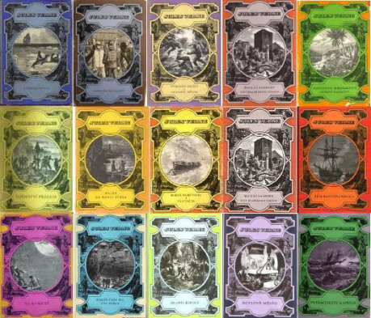

## I.

Pokud čekáte, že na tomto místě poznamenám, že sci-fi vymyslel Edgar Allan Poe, tak se nemýlíte. Tento Koperník – či snad rovnou Cimrman – lehkých literárních žánrů samozřejmě pomyslel i na vědeckotechnické zápletky. Ostatně, čím jiným je taková _Jáma a kyvadlo_ než úplně vydestilovanou hardcore sci-fi, kde technické rekvizity naprosto ovládají scénu. Nebo _Pád do Maelströmu_, kde je pointou aplikace fyzikální poučky. Nebo takové _Na slovíčko s mumií_, což je skoro futurologie. _Muž, který se rozpadl_ a _Fakta v případu pana Valdemara_, což je zase prvotní cyberpunk. Poe jako obvykle předběhl kdekoho a kdeco, ale po pár pokusech ho to přestalo bavit a šel vynalézat něco jiného.

V tomto případě ale ti zdatní Fordové, kteří vynález zpopularizovali, dorazili daleko dříve, než tomu bylo třeba u detektivky. Už v polovině 19. století se objevuje [Jules Verne](http://cs.wikipedia.org/wiki/Jules_Verne), který vyhlásil heslo, že „_udělá totéž pro geografii co Dumas nebo Hugo pro historii.“_ A udělal; sepsal plných dvaašedesát románů svých _Podivuhodných cest_.

Pokud se ptáte, kde je v jeho nápadu psát o geografii sci-fi, pak je dobře si uvědomit, že v polovině 19. století na obloze nic nelétalo, lidské tělo se nemohlo pohybovat více než sedmdesátikilometrovou rychlostí, neb by to bylo pro něj smrtelné, a síť železnic připomínala oblečení striptýzové tanečnice. I cestování po Evropě na větší dálku bylo nesamozřejmé, když si vzpomeneme na úžas všech nad příjezdem _Hraběte Monte Christa_, když dorazil kočárem z Říma do Paříže na minutu přesně. Cestovat do exotických míst potom bylo už samo o sobě dobrodružství, připomínající dnešní cesty do vesmíru.

První mistrův román _Pět neděl v balónu_ z roku 1863 představuje dobrodružnou cestu přes Afriku balónem, nic více a nic méně. Ta vědeckofantastická fikce spočívá v podstatném detailu, že cestovatelé umí s balónem stoupat a klesat pomocí plynového hořáku; a protože v každé výšce – údajně – vane vítr jiným směrem, stačí si vybrat tu příslušnou výšku a jedete, kam chcete.

Tady zaražme. Případ této prvotní sci-fi je totiž ve své jednoduchosti pozoruhodně názorný. _Vědecky podložený vynález umožňuje vyprávět něco, co by důsledně realisticky vyprávět vůbec nešlo._ Tedy – autor není žádný šarlatán, _nevymýšlí si, nýbrž využívá vědu_. Což je docela zásadní důvod pro _uvěřitelnost příběhu_. V roce 1863 každý věděl, že výprava napříč Afrikou je kolosální akce na hranicích proveditelnosti, se spoustou lidí, ozbrojenců, slonů a tak podobně. Vernův výlet tří badatelů, trvající pouhých pět neděl (považte!), je naprosto fantastický; projedete všechny atrakce Afriky ve zrychleném tempu a vyzobáte si jen to nejzajímavější. Ale přesto zůstává vědecky podložený.

Stav věcí se během Vernova života začal postupně proměňovat. Železnic prudce přibývalo, parníky byly větší a spolehlivější, technici si stále více pohrávali s myšlenkou létajících strojů. To se později stalo obecně jakousi konstantou dějin sci-fi; _technický pokrok pronásleduje literaturu a staví před ni stále smělejší výzvy._

Verne takto hozenou rukavici přijal a v dalších knihách přitvrdil. Cestuje se taky _Do středu Země_, a to stále v souladu s tehdy rýsujícími se poznatky [vědy](http://cs.wikipedia.org/wiki/Dutozemě) o dutosvětosti. Nebo _Ze Země na Měsíc_, kdy se opět použije hypermoderní technika, totiž obrovské dělo. U pozdního Verna vedlo stupňování těchto myšlenek k naprostým šílenostem, například k cestě v románu _Na kometě_, kde gravitační pole komety přitáhne různé části Středozemního moře i s náhodně vybranou partou lidí – krajina je kupodivu vcelku a nedotčená – a takto přestěhovaní lidé na kometě procestují celou Sluneční soustavu. Takový román uzná jako fantastický asi každý i dnes.

Na Verna a jeho psaní se lze dívat celou řadou způsobů. Kdysi dávno, v době sci-fi, převládal zejména jásot nad tím, _jak skvěle Verne předvídal technické vynálezy_. Je k diskusi, jak moc se mistr trefil v cestování pomocí gravitačního pole komety, případně, proč se nepoužívá jeho ekologicky geniální cestování balónem z prvního románu, nebo kde k čertu zůstal viset vynález automobilu. Spíše jsem měl odedávna problém s tím nápadem, že by úlohou beletrie vůbec mělo být nějaké vědecké předvídání budoucnosti.

Jiný pohled chápal Verna prostě jako _dobrodružnou literaturu pro kluky;_ něco jako Karla Maye nebo Foglara. I tady se obávám, že v soutěži s novější, mnohonásobně rychlejší, napínavější a všeobecně zdařilejší konkurencí Verne poněkud ztrácel dech už v době, kdy nad ním jásala Neffova kniha. Dnes je to ctihodná muzeální veteš.

Ale v době zcela současné postmoderny se zjevil ještě jeden moment, ve kterém je Verne neodolatelný i dnes a se kterým on sám zaručeně nepočítal. Je to totiž _ukázkový steampunk._ Právě to, co mu připadalo oslnivě ultramoderní, ty mocné kovové nýty, parní válce, elektrické Bunsenovy články, dělo, co vystřelí maníky na Měsíc, ponorka, kde je okno jako z obýváku, a létající koráb s lesem vrtulí, to by mohl ocenit lecjaký náš současník. Už filmy Karla Zemana z let padesátých si toho přesně všimly. A asi nejkouzelnější patinu a styl má jeho vlastně málem realistická _Cesta kolem světa za osmdesát dní,_ kde posledního dne, poslední hodiny a minuty, kdy ručička hodin ještě neodbila osmou, vejde na scénu Phileas Fogg a se svým klidným úsměvem praví: „Zde jsem, pánové.“

## II.

Povinné putování trasou muzea sci-fi pokračuje zastávkou u [H. G. Wellse](http://cs.wikipedia.org/wiki/Herbert_George_Wells). Abychom ocenili jeho přínos, je třeba si povšimnout znovu toho pokroku vědy v zákulisí. Wells žil o trochu později než Verne, technika v jeho době už byla úměrně mocnější. A co více, vylepšení rotačky panem Williamem Bullockem r. 1865 a používání laciného dřevitého papíru, zvaného v Americe nikoli náhodou _pulp_, vyvolal na přelomu století lavinu levného čtení z časopisů. Přibylo čtenářů, přibylo autorů, všechno se změnilo v průmysl a bylo to všude k mání. I v českých zemích. Propuklo to, čemu dnes říkáme _space opera_, kde neznámé obludy z vesmíru věznily mimozemské princezny podezřele lidského vzhledu. S Marsem se roztrhl pytel zejména po údajném objevu [kanálů na Marsu](http://www.fext.cz/cokoliv/opravnik_10.htm) v roce 1877. Nejméně do třicátých let dvacátého století se zcela vážně uvažovalo o tom, že Mars je obydlen Marťany. Symetricky k tomu si samozřejmě všimli autoři i Venuše a postupně došlo i na další tělesa sluneční soustavy. [Edgar Rice Bur­roughs](http://cs.wikipedia.org/wiki/Edgar_Rice_Burroughs), vynálezce Cartera na Marsu a Tarzana, byl asi nejslavnější a nejdůležitější z těchto autorů. S nějakými vědeckými vysvětleními si vážně hlavu nelámal; chtěl, aby to bylo napínavé, dobrodružné a zábavné. Což bylo.

V tomto směru je Wells podstatně blíže k Vernovi. Nějaké vědecké vysvětlení u něho najdeme vždy, třebas chatrné. Když cestování časem, tak _Stroj času_. Když _První lidé na Měsíci_, tak koulí s řízenou gravitací. Když _Neviditelný,_ tak změnou buněčné struktury. Wellsova invence byla při tom značná a rozpracoval vzorce pro sci-fi nejrůznějšími směry.

A co je obzvláště důležité, Wells byl daleko lepší spisovatel než většina jeho konkurentů široko daleko, včetně Verna. Měl cit pro kompozici, pro uměřenost, pro jazyk. A velice přesně si uvědomoval, na rozdíl od Verna, že v té vědě vždycky zbude malinko fikce; není to úplně čisté užití vědy, ale té _vědě je třeba vždycky malinko dopomáhat_ nejrůznějšími kouzelnickými triky. Radí například _velmi rychle rozvíjet příběh, dokud fikce trvá_. Čili přesně totéž, co výrobci filmových triků; snáze projde trik, který se mihne na plátně pár sekund a divák nemá moc šanci ho studovat. Jinak by mu totiž možná došlo, že v té balonové Vernově zápletce vítr v různých výškách _nevane_ všemi směry a _nemůžeme_ si ho proto vybírat jako v jízdním řádu. Stejně tak je sice fyzikálně možné udělat tak veliké dělo, že jím dostřelíte až na Měsíc, ale rozhodně nepočítejte s tím, že to nějaký cestovatel uvnitř projektilu přežije. No a s dalšími zde popsanými zápletkami je to zjevně ještě daleko horší. V zásadě tedy lze zobecnit, že _vědecká fantastika byla od začátku malinko iluze a trik;_ nikdy neexistovalo nic důsledně vědeckého. Jinak by to přestala být fantastika a byl by to realismus. Wells si toto uvědomil zřejmě jako první a nadlouho jediný.

Mezitím totiž sci-fi literatura vytvořila zvláštní typ inženýrských maniaků, kteří tvrdě vyžadují, aby bylo všechno _vědecké_. Ježto mám toto školení z dávných dob rovněž, musím přiznat, že mne vždycky štvaly _Hvězdné války_ s neodpovědným kraválem motorů ve vakuu nebo s absurdním šermováním laserovými paprsky. Měl jsem i značné problémy vydýchat _Vetřelce_, kde členové posádky porušují snad veškeré rozumné zásady karantény. To, že tam někde na dně vyprávění vždycky nějaká ta fikce musí zůstat, to jsem slyšel velmi nerad. A stejně tak by se mi tehdy nelíbilo zjištění, že ten údajně zásadní rozdíl mezi sci-fi a fantasy a vydělení space opery z tohoto „meziprostoru“ je vlastně hodně nejasné a iluzorní, pokud jdeme do detailů.

Ale zpět k Wellsovi. Ve směsi jeho románů a povídek všeho druhu, tedy pravých sci-fi, nebo spíše fantasy, najdeme opravdové perly. Oceňuji například geniální _Zemi slepců_, která je zrovna málem realistická a k tomu jakožto literatura naprosto skvělá. Podobně fascinující záležitost je _Válka světů_, nedávno zfilmovaná Spielbergem jako docela běžná dnešní sci-fi, ovšem s tím podstatným detailem, že byla napsána 1898 a Spielbergův film se od předlohy odchyluje velmi nepatrně. Celý pozdější kolosální podžánr _invazní sci-fi_, kdy Zemi napadají nejrůznější mimozemské příšery, vychází z této zakladatelské knihy. [Den trifidů](http://cs.wikipedia.org/wiki/Den_trifidů), jedna z nejslavnějších sci-fi tohoto druhu, se leckde blíží k plagiátu _Války světů_, aniž by to kdy komu vadilo.

## III.

Asi nemá smysl příliš rozebírat ještě docela rozsáhlý prostor, který se rozevírá mezi Zlatým věkem a Wellsem. Je plno autorů, kteří by stáli za povšimnutí. Zmíním jen letmo jakéhosi Karla Čapka z Československa, u kterého se díky divadelní hře R.U.R. často zdůrazňuje vynález slova _robot_ (které mu ovšem poradil bratr Josef). Nebo nějakého Lovecrafta z Providence, který sepsal dost vzorovou invazní sci-fi jménem _Barva z vesmíru_, později hojně opisovanou. Bylo toho daleko a daleko víc; sci-fi představovala rostoucí příval, nejasně promíchaný s horou daleko nezodpovědnějších pulpových šíleností, detektivek, hororů a kdovíčeho ještě.

Pravý _zlatý věk sci-fi_ je často odvozovaný od působení [Johna W. Campbella](http://cs.wikipedia.org/wiki/John_Wood_Campbell) coby šéfredaktora časopisu _Astounding Stories_. Nastoupil do tohoto ctihodného úřadu roku 1937. Kromě fenoménu Astounding samozřejmě existovala i nejrůznější zdatná konkurence, často s trochu odlišným zaměřením. _Weird Tales_ s partou lovecraftiánů. _Amazing Stories_ s Hugem Gernsbackem, oboje o pár let starší než _Astounding_. Nemá ale cenu popírat, že Campbell byl mezi všemi propagátory sci-fi inspirující osobnost. Především uměl sám dobře psát; za všechno zejména slavný hit _Who goes there?_, později vícekrát zfilmovaný jakožto _Věc_. Campbell dost důsledně trval na tom, aby otištěné povídky měly jisté literární kvality. Pozvedl pulpový časopis _Astounding_ už tím prostým trikem, že platil za povídky mnohem víc než konkurence a stal se tak jakýmsi exkluzivním hájemstvím a elitní značkou. Také měl _Astounding_ podstatně vyšší náklad, přes 100 000 výtisků. Za to Campbell vyžadoval kvalitu a také určitý styl myšlení. Definoval žánr sci-fi prostě tím, že pokud by něco opravdu nevyhovovalo jeho přísným nárokům, tak to neotiskl. Právě od něho se stalo hlavním pravidlem, že zápletka může být třeba hodně šílená, ale přesto musí mít věrohodné _vědecké_ vysvětlení. Při tom odlišoval míru té vědeckosti; přísnější byl ve fyzice, neb to je věda tvrdá a jasná, benevolentnější u věd tehdy začínajících, což byla prý třeba sociologie nebo parapsychologie. Pokud to autor opravdu dobře napsal, prošlo ledacos z hlediska vědy dost nepřijatelného.

Pokud jsem měl možnost číst typické povídky z _Astounding_, byly opravdu hodně technické. Campbell ovšem už tehdy prosazoval příběhy, kde základem příběhu nejsou vynálezy a stroje, ale lidé a kde věda nutí postavy k typicky lidským reakcím. To se uvádí neprávem jako charakteristické pro mnohem pozdější proud ve sci-fi.

Campbell měl přitom opravdu výtečný čich na odhalování literárních talentů. Seznam velikánů, kteří psali do _Astounding_, se velmi podstatně kryje se seznamem velmistrů sci-fi, jak byli ex post jmenováni v sedmdesátých letech.

## IV.

Ve skutečnosti to nebylo jen tak, že nějaký pan redaktor sezval partu lidí a vytvořil žánr. Bylo za tím daleko víc. Technický pokrok celou dobu autorům sci-fi tiše přitakával v tom, že nový moderní věk je opravdu jiný než ten starý. Technooptimistická vyprávění o cestování létajícími stroji přes oceán se stávala po Lindbergově přeletu realitou. Automobil už nebyla žádná sci-fi. Pračku nebo myčku nádobí si mohl leckdo koupit do bytu a zeměkouli rozsvítila elektrická síť. Věčný boj realistické literatury, posmívající se pulpovým příšerám s vykulenýma očima, čili _Bug-eyed monsters_, narážel na častý fakt, že údajně fantastická vyprávění sci-fistů se stále více blížila všední realitě. A to i v těch nepříjemných proroctvích. Chmurná vize Wellsovy _Války světů_ došla dost děsivého naplnění hned dvakrát.

No a pak přišel ten _vesmír_. O vesmíru psával občas i praotec Verne a praotec Wells. Bylo to celkem logické pokračování toho cestování po zeměkouli, jak již bylo předvedeno. Oba praotcové takto dospěli na Měsíc. Tohle všechno ale bylo ničím proti poprasku, který strhly první pokusy s raketami v letech dvacátých a vize cest do vesmíru, kterými se vážně začali zabývat vědci za druhé světové války. V čele vývoje byli v tomto směru Němci, za nimi Američané a postupně se přidávaly i další země. Ukazovalo se, že vesmír je mnohem blíž a je dostupnější, než se zdálo. A tento trend stále sílil, úměrně k dalším pokusům.

Podle Asimova skončil Zlatý věk spolu s _Astounding_ v původní podobě někdy kolem roku 1950. Já jsem proti tomu přesvědčen, že duch _Astounding_ žil nejméně do roku 1970; v tomto smyslu je čas do roku 1950 spíše předehra. Vypuštění Sputniku v roce 1957 Rusy, Gagarin v roce 1961 a cesta Američanů na Měsíc v roce 1969 zvrtla postupně rostoucí zájem o sci-fi v úplné šílenství. Pravověrný sci-fista, kterého měli někdy v roce 1930 za blázna, musel v době Apolla zažít naprostý triumf. Podotýkám, že z té zlaté generace se toho dožili prakticky všichni. Málokdy se stane, že se dostane nějaké intelektuální skupině tak dramatické satisfakce. Všechny ty rakety, kosmolety, atomové bomby, lasery a jiné divy se nejenže dařilo realizovat, ale dokonce se staly tím úplně nejdůležitějším pro přežití civilizace. V tomto paradigmatu viděno, Hitlera porazil radar a ruské raketomety, Japonce porazily atomovky a křehkou rovnováhu světa v šedesátých letech držely rovněž atomovky a rakety. Kennedyho patetické prohlášení o cestě na Měsíc, že _„neexistuje nic důležitějšího“_ dává v tomto světle úplně jiný smysl. Západu i Východu bylo jasné, že když se na cestě technického úprku zastaví, ten druhý je předežene a smete do zapomnění. Takže v „kosmické košíkové“ rozhodně nešlo jen o nějakou „předraženou turistiku,“ jak se tomu posmívali zlí novináři, ale o něco, co považovala celá epocha za úplné jádro svého přežití. Mimochodem, zajímavě tohle téma oživil současný Nolanův film _Interstellar._

## V.

Přesto je třeba zdůraznit, že mezi realistickou čili vážnou literaturou na straně jedné a mezi fantastickou, kde sci-fi uchopila vládu a stala se nadlouho synonymem pro fantazii všeho druhu, ležela železná a hodně vysoká zeď.

Nobelova cena pro autory sci-fi byla nemyslitelná věc. Ostatně, nebyla udělena za sci-fi dodnes. Oscara pro nejlepší film dostal až _Pán prstenů_ v roce 2003 a to nebyla sci-fi. Kritik, který se vážně zabýval sci-fi literaturou někdy ve třicátých letech, si kopal hrob pro svoji odbornou pověst. Věci došly dokonce tak daleko, že školy, církve a jiné mocné instituce organizovaly občas likvidování „brakové“ literatury z knihoven, a to jak v Americe, tak v Evropě. Před začátkem války došlo i na občasné pálení knih. Dnes máme spojeno podobné barbarství s Hitlerem a Stalinem, ale ono se tiše zapomnělo na to, že ani ty nejsvobodnější země v tomhle nebyly tak úplně bez viny.

V jádru sci-fi byl tedy také určitý odboj a protest. Za záchranu fantazie jako takové, kterou moderní věk prohlásil za méněcennou. Za cíle, které si „vysoká literatura“ úplně přestala klást; totiž například napínavost a zábavnost. V tomto směru stála sci-fi na společné frontě s detektivkou nebo s hororem.

Fenomén, který pracovně nazývám _Bradburyho válka_, propukl už ve čtyřicátých letech, v padesátých začal nést jisté výsledky a v letech šedesátých, právě v rámci vrcholu kosmického šílenství, už bylo na západní straně pomalu dobojováno. Kritici začali váhavě uznávat, že literatura, která oblibou a prodejností drtí už léta tu oficiální, má v sobě také i jisté kvality. Sci-fisté byli z fantastických žánrů ti první, co byli postupně vzati na milost, jejich knihy začaly vycházet v pevné vazbě a bylo o nich možno psát bez nebezpečí, že se recenzent znemožní.

Asi nejdramatičtější projev tohoto „objevení“ sci-fi na naší straně barikády je kniha [Labyrint](http://www.legie.info/kniha/3395-labyrint). Vyšla v neuvěřitelném roce 1954, v době, kdy nesmělo vycházet prakticky nic rozumného. Příčinou bylo samozřejmě to, že i Rusové měli rakety a zájem o vesmír; a občas nějaký ten soudruh napsal sci-fi a zřejmě se někde v zákulisí diskutovalo o tom, zda to náhodou není naopak téma velice socialistické a žádoucí. Kniha působila jako naprostá bomba ještě o dvacet let později, kdy jsem ji rukou nedospělou lovil z naší knihovny a četl. Pozoruhodná je na ní i Hoff­meisterova předmluva a pozoruhodné je i výtvarné provedení, nikdy později neopakované.

Po Labyrintu ovšem u nás zavládlo ticho na dalších mnoho let. V tom tichu se okrajově mihly již zmíněné filmy Karla Zemana, vydával se Jules Verne a občas nějaký ten sci-fi autor, který měl kdovíproč výjimku. K tomu osamělý film [Ikarie XB1](http://cs.wikipedia.org/wiki/Ikarie_XB_1), který se mnohem později stal názvem pro slavný český sci-fi časopis. Na reprezentativní výbor povídek číslo dvě se čekalo až do roku 1967, kdy vyšel Tunel do pozítří. Ale to už, jak jsem naznačil, byl jiný věk; věk Apolla, věk, kdy se Stanley Kubrick stal s _2001: Vesmírnou Odyseou_ ikonou a kdy byla _Bradburyho válka_ věc prakticky vyřešená na západě i na východě. V sedmdesátých letech se i u nás kapající pramínky sci-fi pomalu změnily v povodeň, právě jako se to stalo v Americe v letech padesátých. Už se to prostě smělo a sci-fi psal kdejaký jouda. I já sám.

Na západě mezitím zlatý věk skončil, sci-fi se začala drasticky měnit a na nebi zablikaly nové hvězdičky, Tolkien, fantasy a tak podobně. Ale to už do tohoto příběhu nepatří.

## VI.

Fenomén jménem [Star Trek](http://cs.wikipedia.org/wiki/Star_Trek) patří do této úvahy částečně, zejména prvními třemi sériemi, odstartovanými z roku 1966. To ostatní je vesměs daleko pozdější a projevuje více či méně výrazné znaky reforem sci-fi. Bez ohledu na to, že seriál vznikl spíše na konci zlatého věku, nebo ještě spíše po něm, je přímo bytostnou esencí stylu té nejpravověrnější možné sci-fi, se všemi výhodami i špatnostmi.

1. _1._ Je to ve _vesmíru a v budoucnosti_. V té době viděli autoři budoucnost jasně – bude se imrvére cestovat odněkud někam, na palubě kosmických lodí.
1. _2._ Když chce autor radikálně změnit prostředí a ukázat svět, kde je to úplně jinak, pak je to na _nějaké jiné planetě._ A jsou tam _mimozemšťani._ Vesmír bez obydlených planet a mimozemšťanů není pro závěr zlatého věku myslitelný. V té době se už ani neřešilo, zda budou mimozemšťani objeveni, ale jen to, kdy a kde k tomu dojde.
1. _3._ Příběh je budován jaksi _shora_. Řeší se _lidstvo jako druh_. Centrem příběhu nebývá hrdina jakožto individuum, ale kolektiv, společenstvo. I když je na palubě Enterprise jen pár maníků, je nám jasné, že jsou to reprezentanti _celého lidstva._ Pokud selžou oni, pravděpodobně vymře celá civilizace. Hrdina je při tom nejčastěji technický typ, vědec, inženýr, kosmonaut, ale také často obyčejný člověk. Rozhodně žádný superhrdina. Jde o dobrodružství rozumu, ve kterém je třeba utáhnout někde nějaký důležitý šroubek; rozhodně ne o nějaký projev síly nebo válečného umění. Tento pohled na věc se, mimochodem, nakonec úplně kryje s názory té „vážné“ moderní literatury, jak se utvářela od třicátých let do let šedesátých. Je zvláštní paradox v tom, že ve snaze o uznání a závažnost se sci-fi postupně začala v lecčem podobat svému protivníkovi.
1. _4._ Příběhy jsou přímo _apologií tolerance, nenásilí, míru_ a podobně. Zlí mimozemšťani jsou v zásadě nepřijatelní; většinou jde o nějaké nedorozumění. Latentní strach ze studené války se tu skrytě vyjevuje na celé čáře; je tam to, co bychom chtěli slyšet; že ti bolševici to vlastně nemyslí tak zle a je to jen nedorozumění. _Make love, not war._ Prostě: šedesátá léta ve vší dětské naivitě.
1. _5._ Současného diváka přímo fascinuje zvláštní _statičnost_ příběhů. Ona se vůbec, počínaje tím úplně prvním Vernem, docela podstatná část všech sci-fi děje v jakémsi dopravním prostředku, kde vám nezbývá než sedět v křesle a očekávat, co se stane. Může probíhat jakési technické drama, kdy je v dopravním prostředku bomba, někdo po vesmírné lodi střílí, je povolený někde ten šroubek, který v realitě sedmdesátých let vystihuje legendární hláška [Houstone, máme problém](http://cs.wikipedia.org/wiki/Apollo_13). Přesto ve všech těchto případech sedí posádka pevně v křeslech a o věci pouze konverzuje. Občas se povídá s nějakými mimozemšťany jakýmsi videotelefonem, případně se někdo teleportuje někam a tam se pro změnu stojí a tlachá dál. Celé by to fungovalo daleko přesvědčivěji jako rozhlasová hra; vizuální dojem je vlastně dost zbytečný a rušivý. Naprosto to není náhoda, protože _2001: Vesmírná Odyssea_ vypadala úplně stejně a _Ikarie XB-1_ také. Vypadala by tak i většina zfilmovaných Clarků a Asimovů.
1. _6._ A pokud, zcela výjimečně, postavy z křesel vstanou a jdou do akce, je z toho často [komedie](https://www.youtube.com/watch?v=Z1eFdUSnaQM).
1. _7._ _Věda v tom není žádná._ Jako fakt ne. Je až úžasné, jakou trajektorii urazila původní Vernova technická zápletka, založená na nějakém docela pravděpodobně vypadajícím vynálezu, ke zvláštní sebeparodii Star Treku, kde se létá pomocí neznámých technologií, vykřikují nesmyslné technické pokyny a vystupují mimozemšťané, kteří se v principu moc neliší od těch pulpových krásných princezen. Z vědy zbyla jen dojemná víra, že někde ve vesmíru musí být tutově nějací mimozemšťani a že když umístíme bizarní jiný svět na jinou planetu, je vědeckost zápletky zachráněna. Možná si užije psycholog, zkoumající duši autorů díla a fanoušků.

## VII.

Zatím jsem popisoval fenomén zlatého věku a klasické sci-fi jako poměrně homogenní masu autorů s podobnými nápady a podobným myšlením. Skutečnost byla samozřejmě o dost složitější. Chrlit v této souvislosti závěje jmen, která se proslavila v té nejslavnější generaci zlatého věku, asi nedává smysl. Nakonec jich ale pár připomenu; jakýsi pomyslný světový sci-fi top ten. A pokud se chce někdo hádat, že jsem zapomněl někoho dalšího a důležitého, pak má pravdu.

__Isaac Asimov__. Nějak jsem nepochopil, proč se právě on stal největší hvězdou. Mám podezření, že je to trošku případ Dana Browna; byl v pravý čas na správném místě. Respekt mu vydobylo asi už to, že má vědecké vzdělání. Stal se nejvyšším guru přes člověku podobné roboty čili androidy a jeho vynález „zákonů robotiky“ tomu dodal šťávu. Pokud si přečtete jeho knihu _Já robot_, víte vše. _Nadaci_, údajně nejlepší sci-fi všech dob a všech věků, snad už ani číst nemusíte.

__Arthur C. Clarke.__ Pokud ne Asimov, tak Clarke je tím největším bohem sci-fi. Umí psát o kus lépe než Asimov, což se projevilo v některých slavných povídkách jako _Devět miliard božích jmen_. Mnoho z nich je opravdu skvělých. S romány to už tak slavné není; v delší ploše vás čeká modernizovaný Wells nebo Verne, případně Star Trek. Zajímavé bývaly vizionářštější věci, jako nejslavnější _2001: Vesmírná Odyssea_, ale ty zase trpí určitou ukecaností a dost pomalým dějem.

__Robert Heinlein.__ Další obrovský kult. Autor takových věcí, jako _Starship troopers_, tedy akčnějších a ironických drsňáren, i mírumilovnějších, jako _The Door into Summer._ Hrdinové jsou méně mátožní a tím sympatičtější. Není to špatné, ale nějak mne to nikdy nesrazilo ze židle.

__Clifford D. Simak.__ Je zajímavý tím, že je českého původu. Pohodové, často i dost poetické věci, cvičení v toleranci všeho druhu. Nic pro drsňáky. Kniha _Když ještě žili lidé_, co u nás vyšla v nejhlubším komunismu, je hodně dobrá.

[Phillip K. Dick.](http://www.fazole.cz/platek/art.asp?id=250) Jeden z těch, které má snad ještě cenu číst. Jeho světy jsou těžce paranoidní a pochmurné a zfilmování jeho předlohy se ukazuje být patent na nejdůležitější sci-fi filmy, vzniklé ovšem v daleko novodobější úpravě, zlatému věku bytostně cizí – _Blade Runner, Total Recall, Minority Report, Impostor, Screamers, Next_. Časem ovšem i tady odhalíte modus operandi a začne vás to zmáhat.

__Brian W. Aldiss.__ Považuje se za jakéhosi dědice celé té slavné generace velmistrů. Ve skutečnosti psal nejlepší věci na začátku, jako _Nonstop_, který jsem zařadil do svého absolutního osobního top ten, na konci spíš opisoval sám sebe.

__Alfred Bester.__ Kdyby nic jiného ze sci-fi, román _Demolished man_ byste vynechat neměli. V tom se shoduji s Ondřejem Neffem; ohromující kniha, jakýsi pravzor pozdějšího cyberpunku.

[Ray Bradbury.](http://cs.wikipedia.org/wiki/Ray_Bradbury) Čekali jste to a muselo to přijít. Tento člověk při tom do seznamu patří nejméně ze všech. Sci-fi psal jen v tom smyslu, že mu to pan Campbell z nějakého důvodu na začátku uznal. Ve skutečnosti je to většinou fantasy a zatraceně často také realismus. A občas čistý horor. Technicky úplně jiná liga než všichni ostatní; a také si ho odedávna všímali spisovatelé vážné literatury. _Marťanská kronika_ a _451 stupňů Fahrenheita_ jsou jeho nejslavnější delší věci, oboje cvičení na téma _Bradburyho válka_. Také si asi všimnete, že podobně jako jeho učitel Poe měl s větším rozměrem problémy a jen stěží mu to drží pohromadě. Jednotlivé dílky těchto skládaček jsou ovšem jako povídky výborné. Povídek stvořil za veledlouhý život mnoho stovek. Hlavní jeho problém je, že z té laviny výtvorů je těch geniálních jasná menšina. Ovšem pokud jsou geniální, tak potom jsou opravdu bez konkurence.

__Kurt Vonnegut.__ Trochu podobný případ. Také ho uznávala vysoká literatura dřív než všechny ostatní. Pravý opak Bradburyho – cynický, drsný, sarkastický. Takové věci jako _Sirény z Titanu_ nebo _Jatka číslo 5_ určitě stojí za čtení i dnes.

__Stanisław Lem.__ Říkalo se, že ve východním bloku se dělí sci-fi na Stanisłava Lema a na to ostatní. Dodávalo se, že Lem je ta zajímavější polovina. Půjdu ještě dál; možná by to šlo tvrdit i o úplně celé světové sci-fi s podobným výsledkem. Lemovi roboti jsou mnohem lepší, než Asimovovi, vize mnohem smělejší a chytřejší než Clarkovy, paranoia umí být stejně šílená jako u Dicka a tak dále. Jen porazit Bradburyho v poezii, to by asi Lem nedokázal.
