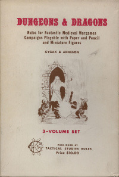

Sloveso _to align_ znamená v angličtině „přihlášení se nebo podpora nějaké osoby, organizace nebo pohnutky“, _alignment_ v původním významu tak mnohem víc než _přesvědčení_ (ve smyslu psychologie postavy a jejího světonázoru) znamená „příslušnost k nějaké straně“.

Gary Gygax byl při tvorbě systému _align­ment_ inspirován knihami Michaela Moorcocka a Poula Andersona. Poprvé se objevil ve hře Chainmail, která předcházela Dungeons and Dragons a ve stejné podobě se pak nacházel i v původním krabicovém vydání první edice DnD z roku 1974. Byly zde „Law“ („Řád“), „Neutrality“ („Neutralita“) a „Chaos“ (česky taktéž „Chaos“). Představovaly kosmické síly, které spolu zápolí a do jejichž zápasu jsou zapojeny rasy a postavy ve světě, ve kterém se hrálo. Řád představoval „princip, že vše má následovat zákon a že poslouchání pravidel je přirozeným způsobem života“. Naproti tomu stál Chaos jako „princip, že život je náhodný a štěstí s náhodou vládnou světu“. Bytosti Řádu staví zájmy skupiny nad zájmy jednotlivce a usilují o to být čestnými a řídit se spravedlivými zákony, zatímco bytosti Chaosu považovaly jednotlivce za nadřazeného skupině a pokládaly zákony a čest za nedůležité. Přestože Řád byl většinou považován za „dobrou a heroickou stranu“ a Chaos za „anarchii a zlo“, dobro a zlo ve skutečnosti nebyly v rámci těchto stran konfliktu obsaženy. V rámci prvních pravidel byli kupříkladu trpaslíci jako rasa Řádu, zatímco elfové a skřeti jako strana Chaosu a lidé se mohli stát příslušníky všech tří stran.

### Kdo to byli guelfovéa ghibellinové?

Šlo o dvě frakce stojící proti sobě v severní a střední Itálii během renesance, které podporovaly papeže a císaře. Když Fridrich Barbarossa vedl výpravy do severní Itálie, aby zde upevnil svou moc, jeho podporovatelé začali být známí jako __ghibellinové__ (italsky Ghibellini). Občas se jim také říkalo „císařská strana“. Příslušníci Lombardské ligy a zastánci nezávislosti italských městských států se začali nazývat __guelfové__ (italsky Guelfi). Ty v jejich boji podpořil papež (který ovládal papežský stát ve střední Itálii a rozšiřování německého císařství mu nebylo po chuti) a postupně se tato strana přetvořila ve „stranu církve/papeže“. Obecně vzato se většina guelfů rekrutovala z řad bohatých obchodnických rodin a měšťanů, zatímco ghibellinové patřili většinou mezi šlechtu a velké vlastníky půdy.

Guelfská města se většinou nacházela v místech, kde byl císař větší hrozbou než vzdálený papež a naopak ghibellinská města byla většinou ta, která se cítila ohrožována rostoucí papežskou mocí a rozšiřováním papežského státu. Rozdělení do obou stran si ale vytvořilo vlastní dynamiku a jejich spory pokračovaly dlouho poté, co přímé spory mezi císařem a papežem skončily. Pokud velké město v okolí bylo guelfské, menší města, která se jím cítila ohrožena, byla nezřídka ghibellinská – příkladem může být guelfská Florencie a ghibbelinská Siena nebo tvrdý ghibbelinský postoj Pisy proti jejím největším rivalům, guelfskému Janovu a Florencii. V rámci měst se stranická příslušnost lišila cech od cechu, čtvrť od čtvrti a rodinu od rodiny, přičemž příslušnost města k některé straně se mohla snadno změnit vnitřním převratem nebo zradou. Některá tradičně ghibellinské města navíc byla spojencem papeže, zatímco některá guelfská města papež trestal interdiktem.

Stranická příslušnost se stala záležitostí rodin a jejich rivalit často více než soupeření německého a papežského vlivu. Ve Florencii a dalších městech proti sobě obě strany často vedly povstání a plánovaly spiknutí s cílem dostat se k moci. Během dvanáctého a třináctého století přijaly ghibbelinské armády za svou tzv. Reichssturmfahne (císařskou válečnou vlajku) v podobě bílého kříže na červeném pozadí, zatímco guelfové používali prapory s obrácenými barvami – rudý kříž sv. Jiří na bílé. Tyto emblémy se promítly i do erbů jednotlivých rodin a měst. Tradičně ghibellinská města jako Pavie, Novara, Como, Trevisto a Asti mají dodnes v městském znaku ghibellinský kříž, stejně jako tradičně guelfský Milán, Padova, Vercelli, Alessandria, Regio nebo Boloňa mají ve znaku kříž guelfský.

Poté, co byli guelfové definitivně poraženi v roce 1289 v bitvách u Campaldina a Caprona, začali bojovat mezi sebou. Kolem roku 1300 se florentinští guelfové rozdělili na Černé guelfy a Bílé guelfy. Zatímco Černí dál podporovali papeže, bílí guelfové byli proti papežskému vlivu a zejména proti vlivu papeže Bonifáce VIII. (dostali se tak vlastně na pozice ghibellinů). Kupříkladu Dante Alighieri patřil mezi podporovatele Bílých guelfů a v roce 1302 musel z města odejít do exilu, když se Černým guelfům podařilo získat kontrolu nad městem. Během italských válek mezi lety 1494 až 1559 se situace natolik změnila (a vztahy byly natolik komplikované), že se toto staré „stranické“ označení přestalo používat. Je to evidentní kupříkladu na zvolení papeže Pavla V., který měl ve znaku ghibellinského císařského orla.

Chainmail byla wargame, a tak sloužilo toto zařazení v zásadě k tomu, aby odlišilo dvě bojující armády – byly to dvě strany, které spolu válčily. Žádná z nich nebyla dobrá, žádná z nich nebyla zlá. To dělení trochu připomínalo základní konflikt v Conanovi – tedy civilizace proti barbarství – protože vojáci Řádu byli většinou rytíři a formace vojáků, zatímco vojska Chaosu tvořily divoké a neuspořádané hordy skřetů a kmeny horalů. „Přesvědčení“ pak v zásadě určovalo, ke které armádě se postava přidá. Nic neříkalo o tom, jak se postava chová v osobním životě a jestli je na potkání štědrá a milosrdná, nebo sobecká a krutá. Na obou stranách konfliktu bylo „zlých“ a „dobrých“ plno.

„Alignment“ v této podobě značně formoval svět, ve kterém se hrálo. Musel totiž onen základní konflikt obou kosmických sil obsahovat. V zásadě šlo o světy, kde občas šampion Chaosu pozvedl meč a vedl divoké hordy goblinů do bitev a obléhání hradů rytířů Řádu. Divocí válečníci tančili kolem ohňů a vykládali sny z kostí nepřátel vyhrabaných z popela. Neutrální knížectví tu zároveň mizí pod útoky legií, nad kterými vlají prapory Řádu. Bylo ideální pro heroické hry, kde se hrálo o osudy celých světů, přičemž postavy zpustošily bitvami s protivníky celé říše i astrální roviny.

Verze DnD Basic Setu z roku 1977 přinesla poprvé kromě osy Řád/Chaos ještě druhou – Dobro/Zlo. Postava se tak mohla stát zároveň „Zákonnou“ (příslušníkem Řádu) a „Zlou“ v podobě nějakého tyrana, nebo třeba „Chaotickou“, ale „Dobrou“, jako kupříkladu Robin Hood. Kombinací obou os vznikla klasická mřížka přesvědčení o devíti položkách, která byla typická pro pozdější knihy DnD první edice, ADnD a třetí edici DnD (DnD Basic set z roku 1981 se naproti tomu vrátil k jedné ose Řád/Chaos). Tehdy se z „příslušnosti ke straně kosmického konfliktu“ stalo „přesvědčení“, které definovalo určitý světonázor postavy – mělo sloužit k usnadnění hraní postavy. Hráč se rozhodl, jak by se jeho postava měla chovat (její „přesvědčení“) a pak postavu hrát podle tohoto světonázoru.

Čtvrtá edice DnD udělala krok zpět směrem k původní ose a obsahovala pět stupňů „přesvědčení“ – Zákonné dobro (Civilizace a řád), Dobro (Svoboda a laskavost), Nezařazení (nemají žádné přesvědčení, nepřihlásili se k žádné skupině), Zlo (tyranie a nenávist) a Chaotické Zlo (destrukce a entropie). V zásadě tak jde o jedinou osu – Řád/Dobro/Nezařazení/Zlo/Chaos. Pátá edice DnD se následně zase vrátila k tradiční kombinaci os Řád/Chaos a Dobro/Zlo v podobě mřížky, kterou používaly ADnD a DnD první a třetí edice.

Dračí doupě (respektive jeho tvůrci) vychází už z klasické mřížky a v jeho pojetí „přesvědčení“ vždy má význam světonázoru a niterného postoje postavy, nikdy pak „příslušnosti“.

## Krátká úvaha nad využitím „alignment“ ve hře

V našem prostředí se přesvědčení v podobě osy dobro–zlo objevilo v Dračím doupěti (první české RPG) a stanovilo normu pro další hry v českém prostředí. Ty nezřídka od Dračího doupěte tuto osu přebíraly jako věc, „která tam prostě patří“, aniž by se zamýšlely nad obsahem. To byl jinak podle všeho příklad i právě Dračího doupěte, které vznikalo původně jako překlad DnD. Díky chaosu ve vydavatelské firmě ale na žádosti o možnost překlad udělat nikdo neodpovídal, proto se rozhodli udělat na základě DnD vlastní hru. Přesvědčení v podobě mřížky dle mého názoru prostě přebrali jako něco, co prostě je součástí hraní … a asi by to tam být mělo. V době, kdy se u nás o hraní RPG nevědělo vůbec nic (a nota bene v kontextu doby, kdy šlo o standard i na Západě), je to samozřejmě plně pochopitelné.

Během hraní ale „přesvědčení“ v podobě mřížky nebo osy dobro–zlo způsobuje hromadu problémů. De facto totiž existence takového světonázoru („jsem zlý“ / „jsem zmateně dobrý“) z hraní eliminuje motivace postav a hru deformuje tím, že zjednodušuje postavy a jejich charaktery nezřídka až na úroveň karikatur. Lidé (a ve fantasy elfové, trpaslíci, etc.) jsou příliš komplikované bytosti, aby se daly snadno zaškatulkovat do kolonek. Pokud taková osa ve světě existuje (a přesvědčení se dá třeba odhalit pomocí kouzla), pak rytíř, který přepadá pohraniční vesnice, nepotřebuje žádnou motivaci. Je prostě „zlý“ a basta fidli. V reálném světě ale může jít o rytíře, jehož manželku někdo v okolí přepadl a zabil… načež se zoufalý a pološílený žalem mstí. V prvním případě se s rytířem nedá vyjednávat, ve druhém mu lze vydat pachatele zločinu a zastavit tak jeho nájezdy tím, že dosáhnete spravedlnosti pro jeho mrtvou manželku. Motivace postav jsou to, co činí hru zajímavou a ženou ji kupředu… a pokud ji přesvědčením přebijeme, tak se sype uvěřitelnost hry jako takové.

### Optimáti a populárové

Dvě velké frakce, které soutěžily o moc v římské republice. Optimáti (optimates, sg. optimas), tedy v překladu „nejlepší z mužů“, byli frakcí tradicionalistickou. Zastupovali především zájmy šlechty a Jezdců, snažili se omezit moc lidových shromáždění a tribunů lidu a naopak posílit moc Senátu, který viděli jako záruku trvání republiky. Proti nim stáli populárové (populares, sg. popularis), kteří se opírali o lidová shromáždění, tribuny lidu a masy plebejců, aby získali moc a politickou sílu. Obě strany spolu na nejvyšších úrovních politiky bojovaly, aby ovládly směřování republiky.

Vrcholu moci optimáti dosáhli během diktátorství Lucia Cornelia Sully. Lidová shromáždění byla zbavena takřka všech pravomocí, počet senátorů byl zdvojnásoben a množství populárů bylo popraveno na základě proskripčních listů. Po Sullově rezignaci byla ale většina jeho zákonů nakonec zrušena. Mezi nejvýznamnější optimáty patřili kromě Sully také Lucullus, Cato, Bibulus a Brutus. Známí populárové pak byli bratři Gracchové, Crassus, Pompeius (během prvního triumvirátu, nakonec skončil v řadách optimátů) a nejslavnější z nich, Julius Caesar. Zápas mezi oběma skupinami nakonec vyhráli populárové v čele s Juliem Caesarem, který (přesně jak se optimáti báli) s podporou plebejců shromáždil ve svých rukách tolik osobní moci, že republiku zrušil a nahradil ji císařstvím.

Stejně dobře tak ale může jít o několik frakcí v rámci občanské války, boje centrální vlády proti povstalcům z Alfa Centauri a podobně. Je nutné mít ve světě dostatečně silný základní konflikt, který nějakým způsobem ovlivňuje velkou část světa, v němž se postavy pohybují. Dalším předpokladem je to, že ani jedna ze stran by neměla být „dobrá“ a další „záporná“. Strany také nemusí být jen dvě, může jich být samozřejmě více. Obě strany by měly mít svůj kus pravdy, aby měly postavy možnost se přidat k oběma a také o svém rozhodnutí pochybovat. Nic není černé a bílé, na obou stranách jsou lidé dobří a špatní, krutí a milosrdní, hamižní a nesobečtí.

Pro hrdinské výpravy rytířů v zářivé zbroji (kde jsme se potkávali jen se zlými nepřáteli a hrálo se jen v kobkách bez kontaktu se světem) ještě hraní s přesvědčením stačilo, ale pokud člověk stál o trochu hlubší zážitek a uvěřitelnější postavy s uvěřitelnými motivacemi... pak „přesvědčení“ prostě stálo v cestě. Byla to jedna z prvních věcí, kterou jsme z pravidel Dračího doupěte vyhodili a nehráli podle ní.

Myšlenka „alignmentu“ jako „příslušnosti ke straně“, která se v českém prostředí v této „strukturované podobě“ prakticky neobjevila, mi ale připadá docela zajímavá na vyzkoušení. Je to dost specifická věc, která se využije jen při určitém stylu hraní, ale ta myšlenka není vůbec špatná. Umím si to velmi dobře představit třeba při hraní nějaké renesanční hry, kde by ony strany zápasu představovali guelfové a ghibbelinové. Postavy by zpočátku nemusely být do jejich zápasu o moc zavlečeny (byly by v něm neutrální, nezařazené, nepatřily by k žádné ze stran) a později by se zapletly do zápasu o moc, povstání, převratů, spiknutí a k některé ze stran by se mohly přihlásit.

Dalším příkladem může být zápas o moc v rámci římské republiky mezi optimáty a populáry.

## Závěr

Ne vždy musí „alignment“ znamenat „přesvědčení“ (zvláště pokud je řeč o prvních verzích DnD) a oba principy nemusí být vzájemně zaměnitelné. RPG se u nás objevily v době, kdy již toto rovnítko lze položit, a tak se o vývoji a posunu tohoto významu příliš neví. Tento článek vám tak nabízí zamyšlení nad využitím obou pojmů ve vašich hrách.
