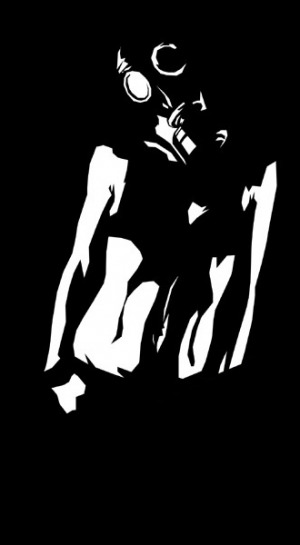
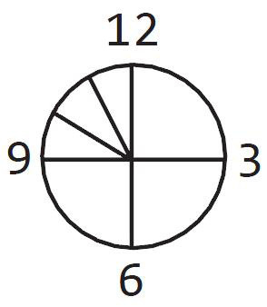
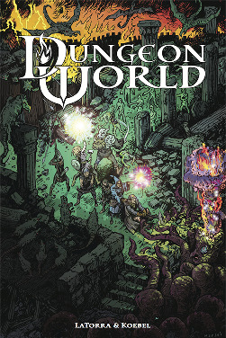
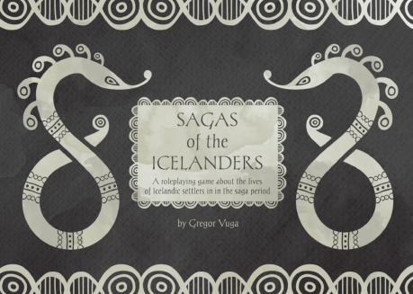

## Obecně o Apocalypse Engine

V mé osobní historii hraní RPG byly tři hlavní zlomové body: když jsem RPG začal hrát, když jsem je začal vést a když jsem poprvé viděl Apocalypse World. Samotný Apocalypse World (AW) je postapokalyptické RPG s poměrně jasně vymezenými rolemi pro hráčské postavy a jeho mechanické jádro a filozofie (_apocalypse engine_) se ale stalo základem mnoha odvozených her (_hacků_) umístěných v jiných prostředích. Hlavní cíl tohoto článku je shrnout pravidla samotného AW, která s relativně malými změnami platí i pro většinu odvozenin, například fantasy Dungeon World.

## Systém

Základní premisa systému Apocalypse World je ta, že RPG jsou konverzace v rámci fikčního světa a tato konverzace vyžaduje pravidla. Základní stavební jednotkou těchto pravidel je _move_, pravidlo, které se používá, pokud jsou ve fikci splněny určité podmínky. _Move_ nabízí mechanické vyhodnocení situace a zároveň možnosti, jak dále v příběhu pokračovat.

Při spouštění _move_ se uplatňují dva principy: __„když to děláš, tak to děláš“__ a __„abys to udělal, tak to dělej“__. První princip říká, že pokud se ve fikci objeví něco, co se může vyhodnotit nějakým move, tak se to pomocí _move_ vyhodnotit musí. Druhý princip říká, že pokud někdo chce spustit nějaký _move_, musí začít dělat to, čím se move spouští. Pokud chce tedy postava pomocí _move_ __seize by force__ (_získání něčeho silou_, viz příklad) získat kontrolu nad strategickým místem, nemůže říct: „tak na ně útočím, můžu si to hodit?“, ale musí (relativně barvitě) popsat, jakým způsobem jedná. Z druhé strany – pokud hráč popisuje, jak ve svém bojovém brnění kráčí bojištěm a ostřeluje nepřátelskou pozici, na vyhodnocení této fikční situace se použije právě __seize by force__.

### Prostředí

Nikdo už neví, jak k tomu došlo nebo proč. Možná to ani nikdo nikdy nevěděl. Ti nejstarší stále mají vzpomínky z dětství: města v plamenech, hroutící se společnost a pak její pád, rodiny zoufale se snažící prchnout a podivné noci, za kterých žhnoucí obloha svým krvavým svitem měnila noc v den.

Svět už není jako býval. Rozhlédni se kolem sebe: nedá se přehlédnout, že už není jako býval. Rozhodně ne. A pak zavřeš své oči a otevřeš svou mysl: něco je špatně. Na hranicích vnímání je cosi kvílícího, všudypřítomného, plného nenávisti a hrůzy. A nikdo před tím, před tímto psychickým maelströmem, nenajde úniku.

Díky těmto dvěma hlavním principům je zajištěno, že _move_ začíná a končí ve fikci a všechna používaná pravidla jsou velmi úzce provázaná s tím, co ve fikci děje nebo k čemu se schyluje. Vzhledem k tomu, že _move_ v Apocalypse Worldu jsou psány tak, aby se „nemohlo nestát nic“, a že statisticky nejčastějším hodem je úspěch, který ale přináší komplikace, stále se něco dramatického děje.

Pravidla při čtení budí dojem přílišné naskriptovanosti, tedy omezeného výběru toho, co může hráč ve své akci dělat, ve skutečnosti jsou ale _move_ sepsané dostatečně vágně, aby neomezovaly tvůrčí rozlet, a naopak vytvářejí zajímavé komplikace posunující děj (viz příklady).

Při vyhodnocování _move_ se hodí dvěma šestistěnnými kostkami, sečte se jejich výsledek a přičte příslušný atribut (typicky o hodnotě −1 až +2) a podle výsledku se určí míra úspěchu. Při součtu sedm až devět se jedná o úspěch částečný, 10+ je úspěch úplný – co se stane při úspěchu, je zapsáno v pravidle _move_. Součet šest a méně je neúspěch, který vyhodnocuje vypravěč. _Move_ jsou jednak obecné (těch je osm), jednak specifické pro dané postavy (každá jich má několik); zvláštní kapitolou jsou _move_ vypravěče, které fungují trochu jinak – vypravěč například nikdy nehází kostkami. Příkladem obecného _move_ společného pro všechny postavy je __seize by force__ využívající atribut hard (jak je postava „drsná“):

> Když se snažíš __získat něco silou__, nebo získat něco silou pod svou kontrolu, hoď +hard. Při úspěchu si vyber z následujících možností, při 10+ vyber tři, při 7–9 vyber dvě:

- _získáš jasnou kontrolu nad tím, co jsi chtěl získat,_
- _utrpíš malé zranění,_
- _způsobíš strašlivé zranění,_
- _vystrašíš své nepřátele nebo na ně uděláš dojem._

Podle hodu má hráč možnost si vybrat z nabízených možností podle svého uvážení, ať už získat to, kvůli čemu se do boje pustil, změnit do budoucna přístup nepřátel k jeho postavě, nebo vyváznout z tohoto konfliktu se zdravou kůži. V tomto _move_ je důležité, že se používá tehdy, když jsou obě strany konfliktu připraveny bojovat. Pokud postava na někoho bezbranného vytáhne brokovnici se slovy: „pusť mě dovnitř, nebo ti ustřelím palici“, tak je to jiný z obecných _move_, __go aggro__:

> Když někomu __vyhrožuješ násilím__, hoď +hard, na 10+ si oponent vybere: nedá si říct a vyžere si to, nebo ustoupí a udělá, co chceš. Na 7–9 si namísto toho může vybrat i z:

- _co nejrychleji vypadne tak daleko, jak jen to půjde,_
- _bezpečně se zabarikáduje někde, kam na něj nemůžeš,_
- _dá ti to, co si myslí, že chceš,_
- _pomalu ustoupí, s rukama nad hlavou,_
- _řekne ti, co chceš vědět (nebo to, co si myslí, že chceš slyšet)._

V tomto případě si vybírá ten na špatné straně brokovnice, často vypravěčova nehráčská postava. Tento _move_ je použitelný pouze tehdy, pokud je postava spouštící tento _move_ ochotná násilí vykonat (jinak to není _move_, ale pouhý vypjatý rozhovor) a pokud se druhá strana není schopna aktivně bránit (to by bylo zmíněné __seize by force__). Kromě toho musí hráčská postava po své oběti něco chtít: pokud se jenom snaží prásknout bezbranného, pak to není tento _move_, ale „prásk – podíval se překvapeně na díru ve svém hrudníku, a padl mrtev k zemi“ a není důvod házet. V méně vypjatých situacích by snad šlo použít jiný _move_ – __seduce or manipulate__. Když ale někdo na někoho vytáhne zbraň, už to nemůže zahrát do autu, protože vytáhnout na někoho zbraň je velká věc a musí mít fikční důsledky. Z pohledu rozdělení pravomocí je AW poměrně klasická hra (na poměry indie her) a arbitrem toho, který _move_ se má použít, je vypravěč.

### Postavy a jejich vlastnosti

V AW je úkol hráčů ztvárnit zajímavé charaktery a předvést je jako uvěřitelné lidi. V základní knize AW je k tomu pro hráče na výběr celkem jedenáct tematických postav (existují i oficiální rozšíření s dalšími postavami a řada neoficiálních), které výrazně ovlivňují obsah hry tím, jaká témata s sebou do hry přináší. Zajímavým rysem jejich vykreslení v mechanické rovině je to, že mají relativně pevně dané místo ve společnosti: ať už, že se starají o skupinu NPC, nebo jsou na společnosti nezávislí a mají způsoby, jak si to udržet, ale některé z postav mohou být pro společnost i užitečné. Pro některé platí, že pro ně místo ve společnosti není – a musí si jej vybojovat. Postavy jsou definovány jenom v hrubých rysech a dávají velký prostor hráčské invenci. Při začátku hry nesmějí mít dva hráči stejný typ postavy.

__Oficiální postavy jsou:__

> __Angel__: Doktor
>
> __BattleBabe__: Hrdina akčního filmu
>
> __Brainer__: Osoba schopná číst myšlenky a ovládat cizí mysl
>
> __Chopper__: Šéf motorkářského gangu
>
> __Driver__: Řidič stylového/drsného vozidla
>
> __Gunlugger__: Někdo, kdo má moc zbraní. Moc zbraní.
>
> __Hardholder__: Šéf stálé osady/pevnosti
>
> __Hocus__: Šéf kultu
>
> __Operator__: Ať už chcete cokoli, on to zařídí – od přepravy zásilky k vraždě.
>
> __Savvyhead__: Mechanik se silným napojením na to „divné“ ve světě
>
> __Skinner__: Umělec/děvka, jak se to vezme.

Postavy jsou definovány pomocí svých vlastních _move_ uvedených v deníku postavy a svých atributů. Deníky postav jsou dostupné na [oficiálních stránkách AW](http://apocalypse-world.com/). Velmi důležité je, že hráč svou postavu netvoří dopředu, ale popíše její jméno, vzhled, výbavu a schopnosti (u všecho může zaškrtnout z nabízených možností), zbytek se definuje vztahy k ostatním hráčským postavám a odpovídáním na otázky vypravěče.

__Atributy postav jsou:__

> __Cool__: zvládání stresových situací
>
> __Hard__: agresivita a neoblomnost
>
> __Hot__: atraktivita a manipulace s lidmi
>
> __Sharp__: chytrost a všímavost
>
> __Weird__: podivnost postavy a vnímání psychického maelströmu
>
> __Hx (history)__: míra porozumění dané hráčské postavě (jiná hodnota pro každou)

Hodnoty teoreticky nabývají rozsah −3 až +3, většinou −1 až +2 a po většinu hry zůstávají stálé; výjimkou je Hx, které se určí vůči každé další hráčské podle toho, jak ji zná, a Hx se v průběhu hry často mění.

Některé _move_ dávají ve výsledku (často navázáno na podmínku ve fikci) tzv. __+1 forward__ nebo __+1 ongoing__, což je +1 na následující hod respektive +1, dokud bonus dává smysl.

## Soubojový systém

Apocalypse World neobsahuje soubojový systém jako takový, všechny situace zahrnující násilí na postavách se řeší stejně, jako je to je tomu u ostatních _move_. Nejsou tedy zavedeny kola, iniciativa a podobně, hráči se dostávají na řadu podle toho, co má smysl ve fikci. Na rozdíl od většiny her¹ jsou souboje značně _odzoomované_ a celá bitva se často dá vyřešit jediným hodem, který určí výsledek. Díky tomu jsou souboje významným prvkem v budování napětí, ale zabírají většinou jenom relativně malou část herního času.

{:.sidebar}
¹ Mezi ně patří například i významný hack Dungeon World, který má souboje mnohem detailnější, což je způsobeno nastavením základního „útočného move“, kterým se z potvor „jenom“ osekávají životy.

Pro určení zranění postavy se používá odpočítání pomocí __dooms­day clock__, tedy kolik času postavě zbývá do půlnoci – smrti. Postava má tedy celkem šest životů, první dvě zranění se léčí samy v čase (většinou mezi herními sezeními) a do deváté hodiny se časem nezhoršují, od deváté hodiny dál je potřeba zařídit pomoc. Od deváté hodiny dál si hráč může vybrat trvalý postih k některému atributu namísto zranění a nese si tak svou historii ve šrámech na těle či na duši. Pokud postava přijde o šestý život, je mrtvá, ale jde oživit, pokud dostane další zranění, je definitivně po ní.

Samotné zranění je pevné a odvíjí se od zbraně (různé postavy mají různě efektivní zbraně na výběr ve svém deníku, s typickým zraněním 1–4) a brnění, které zranění snižuje (0–2), i když výsledek může být modifikován efekty některých move, většinou o +/−1. Další vlastnosti zbraní jsou určeny pomocí klíčových slov, například __reload__ (musí se „přebíjet“, „přebití“ není dále definováno, pouze vyžaduje akci ve fikci; příkladem je brokovnice, ale ne automatická zbraň), __messy__ (všude je spousta krve, např. motorová pila), __loud__ (hlasité, někdy kvůli zbrani, typicky u psychických schopností je to křik oběti) a podobně.

Podle pravidel se do nehráčské postavy „vleze“ až šest bodů zranění, ale už první nebo druhé je většinou smrtelné.

## Vypravěč

I když má Apocalypse World zajímavé prostředí a postavy, jeho hlavní síla jsou pravidla pro GM, mimo jiné proto, že umí člověka naučit vést hru bez přípravy a pracovat s motivacemi hráčských postav. V Apocalypse World se vypravěč nazývá __Master of Ceremonies__² (MC) a kniha nenabízí návod, jak vést hru, ale striktní pravidla, kterých se má pevně držet. Zatímco hráč dostane svůj deník postavy, vypravěč má list připomínající mu jeho agendu a principy, na kterém jsou také přehledně rozepsané _move_ specifické pro vypravěče, dále list na udržování přehledu o problémech (AW totiž nejlépe funguje v sandboxovém stylu hraní) a speciálními pokyny na první sezení.

{:.sidebar}
² Nabízí se „pán obřadů“, ale většina textu AW je prakticky nepřeložitelná a lidé se Vincenta často ptají, na čem jel, když jej psal. Tento výraz se může vztahovat k uvaděčům uměleckého vystoupení a odvozeně je to slangový výraz pro rappera, který baví publikum svou improvizací; často na téma navrhovaná publikem. A jak oni sami říkají: „Master of ceremonies, ze kterého pochází zkratka MC, znamená udržovat párty naživu.“

__Vypravěč má agendu:__

- _zajistit, aby se svět zdál reálný,_
- _zajistit, aby životy hráčských postav nebyly nudné,_
- _hrát, aby zjistil, co se stane._

Toto jsou základní pravidla, kterým je potřeba podřídit všechno ostatní. Poslední bod vypravěče osvobozuje od povinnosti vymýšlet složitý příběh a zápletky (tomu nicméně pomáhají další nástroje) a vynucuje rozvíjení hráčských nápadů. I když může mít vypravěč vlastní představu o světě, hráč má právo podílet se na tvorbě světa.

__Vypravěč se se řídí:__

- _principy hry (viz dále),_
- _pravidly,_
- _svou přípravou,_
- _upřímností._

Poměrně neobvyklé je pravidlo, že vypravěč má být upřímný. Nemá s pravdou šetřit, ba naopak, měl by jí hýřit a rozhazovat plnými hrstmi. AW staví na otevřené hře, a čím víc informací hráči dostanou, tím lepší hra vznikne. Stran přípravy – vypravěč nemusí vypracovávat složitý scénář, měl by se ale podívat na pár apokalyptických filmů, přemýšlet o takovém prostředí a oddat se troše denního snění.

__Vypravěč se drží tzv. principů:__

- _popisuj apokalyptický svět,_
- _mluv k postavám, ne k hráčům,_
- _používej svoje move, ale nepřímo (tzn. aby se move nespouštěl kvůli neúspěchu na kostkách, ale kvůli problémům ve fikci),_
- _použij move, ale nikdy neříkej jaký,_
- _na všechno se dívej přes zaměřovač (a buď připravený to odstřelit, včetně svých oblíbených NPC),_
- _každého pojmenuj, každého vykresli jako živého člověka,_
- _ptej se na provokativní otázky a stav na odpovědích,_
- _na všem zanech krvavé otisky svých prstů, ale také dávej odměnu,_
- _buď fanoušek hráčských postav,_
- _nezapomeň myslet na to, co se děje mimo záběr,_
- _čas od času přenechej rozhodování někomu jinému._

Některé z principů jsou užitečné pro všechna RPG, některé jsou specifické pro Apocalypse World. Kdybych měl vybrat nejdůležitější, tak je to _buď fanoušek hráčských postav_, protože vypravěč není nepřítel postav (od toho jsou _move_) a měl by se radovat z každého jejich vítězství a oplakat každou jejich prohru; a _ptej se na provokativní otázky a stav na odpovědích_, čímž se do tvorby světa bezbolestně zapojí hráči; obzvlášť na první sezení hry dává Vincent radu: „Ptej se jako šílený.“

### Vypravěčovy move a fronty.

Zatímco hráči mají při hře list se svou postavou, vypravěč dostane bohatý seznam _move_, které může použít; mezi nejužitečnější patří __oznam blížící se hrozbu__ a __oznam hrozbu, která je mimo záběr__, mezi klasičtější patří například __rozděl je__ nebo __zadrž někoho__ (zatímco jste leželi v posteli, objala tě a řekla: „Já tě nepustím.“). A po každém svém _move_ se vypravěč ptá: „Co děláš?“

__Tyto move se používají:__

- _pokud se na tebe všichni dívají a čekají, co se stane,_
- _pokud někdo neuspěje ve svém hodu,_
- _pokud ti dají příležitost, kterou nemůžeš odmítnout._

I když platí, že vypravěč by neměl plánovat věci moc dopředu, vytváří takzvané __fronty__ (jako v „sakra, bojujeme na třech frontách!“), což jsou problémy, které se hrnou na hráče. Nemají striktně mechanické vyhodnocení, ale existuje návod, jak je vytvořit.

Nejdříve se z nabídnutého seznamu vybere abstraktní společný jmenovatel všech problému (strach, hlad,…) a následně se vybere několik souvisejících hrozeb a impulzů, kterými se hrozby řídí (například typ hrozby: prostředí – pevnost, má motivaci „zabraň přístupu“). Každá hrozba dává vypravěči řadu _move_ k použití, v tomto příkladu se nabízí například _„vyjev všem něco k vidění, uzavři cestu, nabídni jinou cestu, představ strážce…“_ Výhoda tohoto způsobu zápisu je v tom, že nabízí vypravěči nepřeberné možnosti komplikací situace a zároveň velmi stručným a výstižným způsobem problém popisuje.

Následně se stručně zadefinuje __temná budoucnost__, tedy co se stane, pokud se problémy nebudou řešit, a klíčové otázky, na které by vypravěč chtěl znát odpověď. K určení toho, jak dalece fronta postoupila, se často používá stejný mechanismus jako pro životy: __doomsday clock.__

## Čím vás Apocalypse World možná překvapí

První šok při setkání s Apocalypse Worldem bývá většinou kombinace pevně naskriptovaných _move_ a předdefinovaných postav. Samotné skriptování ale většinou není na překážku, protože pouze dává na výběr z několika obecných možností, kam může scéna směřovat. Podobně funguje i výběr postavy, která svazuje svým „povoláním“, místem ve společnosti a často i tématem, ale stále nechává volný prostor pro vlastní charakterizaci. Nevýhodou AW je tedy jeho úzké tématické zaměření, které herní skupině musí „sednout“.

I když AW na první pohled upoutá především díky zajímavým postavám a zápisu pravidel do podoby _move_, hlavní vlastností, kvůli které má cenu AW vyzkoušet, je jím představený styl vedení hry. Ne, že by Vincent objevil nový způsob, jak vést hru, ale dokázal podat nástroje a rady v ucelené podobě ([dostupné mezi deníky postav](http://apocalypse-world.com/)) tak, že má cenu si stranu o vedení hry v AW nosit i na jiné hry.

Jedna z hlavních výhod AW je rychlý start – pokud se hráči nepřehrabují v postavách, je možné začít hrát bez přípravy do 30 minut, a to proto, že tvorba světa probíhá ve spolupráci s hráči. Přitom ze settingu AW jsou důležité jen dvě informace: apokalypsa byla před padesáti lety a existuje cosi jménem psychický maelström. Nevýhodou tohoto sandboxového přístupu ovšem je, že svého plného potenciálu dosáhne až po několika hrách.

### Důležité odkazy

- <a href="http://apocalypse-world.com/">Oficiální stránky</a>
- <a href="http://apocalypse-world.com/forums/">Oficiální fórum</a>
- <a href="https://docs.google.com/spreadsheets/d/1whsN3C5e31CZfo8hqlJbiKTPBX9kkCDSEG_An9FlP5s">Seznam neoficiálních hacků</a>
- <a href="http://rpgforum.cz/forum/viewtopic.php?f=89&amp;t=10058">Téma na RPGF</a>
- <a href="http://www.d20.cz/diskuze/pravidla-diskuze/51571.1.html">Téma na d20.cz</a>
- <a href="http://rpgforum.cz/forum/viewtopic.php?f=115&amp;t=12166">Zápis Feniksovy dlouhodobé kampaně</a>
- <a href="http://www.d20.cz/diskuze/stripky-diskuze/51598.1.html">Jersonův zápis</a> a <a href="http://rpgforum.cz/forum/viewtopic.php?p=426520#p426520">komentáře k němu</a>

Z pohledu stylu vytváří AW dramatické akce a extrémně kompetentní postavy, což vychází z toho, že když už se hráči povede spustit move, nejpravděpodobnější výsledek je – postava uspěje a budou z toho komplikace. Při používání move se tedy spouští lavina problémů: i když se vyřeší aktuální problém, jeho řešením se nadefinují další, které ženou hru dopředu. Je také zajímavé, že AW nepracuje s obtížnosti z hlediska hodů, ale pouze v rámci fikce. Takže rozeběhnout se (po předchozím varování ve fikci) proti střílejícímu kulometnému hnízdu není „to bude jen za čtyři životy, to mě ještě nezabije“, ale krvavý konec postavy. Z pohledu GM je zajímavé, že vypravěč vůbec nepoužívá kostky – určování úspěchů a komplikací zajišťuje systém a on má volné ruce v ovlivňování dynamiky hry, děje a zajišťování __principů__.

## Závěr

Apocalypse World nasbíral spoustu ocenění, ale co je důležitější, spoustu oddaných hráčů. Zároveň inspiroval tvůrce her k vytvoření vlastních _hacků_; nespočetné množství jich leží v šuplících, několik jich už ale bylo oficiálně vydáno (aktuální seznam na [Vincentových stránkách](http://apocalypse-world.com)). Za zmínku stojí především volně dostupný [Dungeon World](http://book.dwgazetteer.com), fantasy předělávka snažící se vytvořit DnD v systému _apocalypse engine_, vikinská [Sagas of the Icelanders](http://redmoosegames.tumblr.com/soti) a lovecraftovský [Tremulus](http://realityblurs.com/shop/index.php?main_page=index&cPath=24).

_Psáno pro Drakkar a d20.cz_
