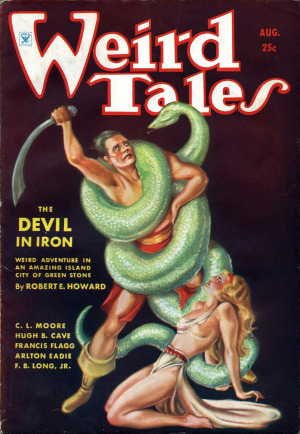
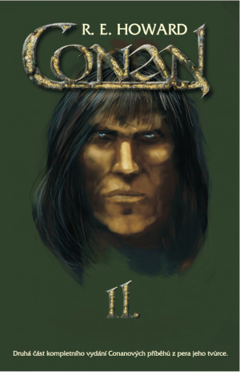
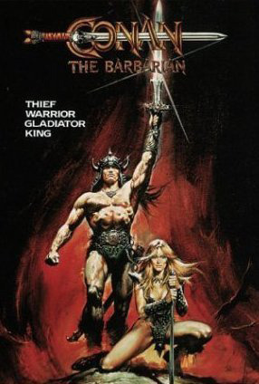
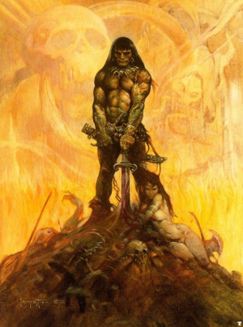
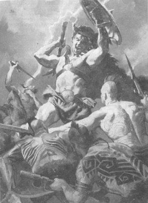
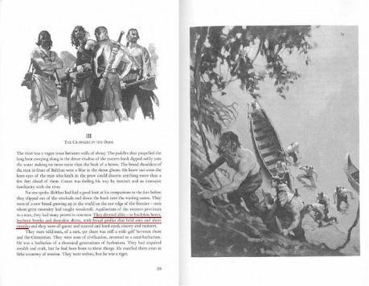
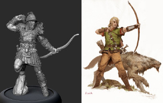
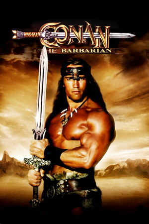

> Chvěje se Lev, a padá soumrak,
>
> posedají ho démoni.
>
> Šarlatová křídla rozpíná Drak,
>
> větrem černým nesený.
>
> Rytíři dlí už ve věčných snách,
>
> znaveni lítým bojem
>
> a z hloubi Hor prokletých, ach,
>
> Satané vzlétají rojem.
>
> Hodina Draka!
>
> Mrtvolný chlad,
>
> strach jeví se v krhavém oku.
>
> Hodina Draka!
>
> ...a lid má hlad,
>
> kdo vzepře se krutému Draku.

R. E. Howard – _Hodina draka_

(preklad Jan Kantůrek)

Toto je esej o barbarstve. Preto je nevyhnutne aj esejou o civilizácii. Budem hovoriť o pokrivených atribútoch barbarstva, ktoré sú civilizáciou barbarom pripisované – medzi aké patria strach z mágie, tuposť či nahé osvalované torzá – ale aj o rovnako pomýlenom ideále vznešeného divocha. Zasadím toto pripisovanie do kontextu širšieho vzťahu medzi barbarstvom a civilizáciou, ktorý sa z hľadiska kritickej teórie dá chápať ako nezmieriteľný politicko-ekonomický konflikt, ale pohľadom filozofie ako pevné a nerozlučiteľné spojenie medzi zrozumiteľným a tým Druhým. Najdôležitejšia na tomto vzťahu je pre nás pohyblivá hranica medzi civilizáciou a barbarstvom, keďže na hranici sa tento vzťah stáva viditeľným. Zároveň je táto esej aj esejou o Conanovi: o divochovi v službách civilizácie, o vlkovi v ovčom rúne – proste o hranici. Budem medziiným argumentovať, že Conan je symbol, ktorý sa neustále vzďaľuje za hranicu a preto sa stáva neuchopiteľným (toto pútnik Wild West nazval „fenoménom papierovej lodičky“) a je nami, civilizovanými ľuďmi, neustále skresľovaný. Zároveň je vďaka svojej nedostupnosti aj fantasticky príťažlivý.

Najčastejšie vysvetlenie obľúbenosti Conana literárnymi kritikmi spočíva na téze, že u čitateľov ide o chlapčenské pobláznenie a (dnes už nie úplne politicky korektnú) túžbu po dobrodružstve. Väčšina fanúšikov celého _sword and sorcery_ žánru je ostatne pravdepodobne mužského pohlavia. Odtiaľ je už len krôčik ku skrytému útoku nadhodením, že aj tak ide o 13-ročných chlapcov, resp. mužov, ktorí mentálne zaostali na tej úrovni, a ktorým imponuje Conanova sila, svalovina či úspech u žien. Takýto manéver patrí k dobrému bontónu kritika a signalizuje jeho dospelosť a sofistikovanosť. Ďalšie, súvisiace vysvetlenie spočíva na téze eskapizmu. Ten je poňatý či už ako výsledok nejakého psychického problému jednotlivcov (napríklad komplexu menejcennosti), alebo ako masová, spoločenská reakcia na komplexnosť a ambivalentnosť súčasného sveta. Uzatvoriť celú otázku Conanovej príťažlivosť takto šmahom ruky mi však príde podozrivo ľahké. Conana okrem čitateľov zbožňujú desiatky vedľajších postáv, miluje ho aj samotný Howard. A kým by sa mohlo zdať, že vlastne už nie je čo vysvetľovať, ja tvrdím, že tu sa analýza iba začína. Preto táto esej.

Ako okno do Conanovho sveta (so skvelým výhľadom na Conana samotného) nám poslúži poviedka _Za čiernou riekou_. Pôvodne bola vydaná v časopise Weird Tales (1935, májovo-júnové číslo) a v češtine sa dočkala v preklade Jana Kantůrka niekoľkých vydaní (napr. v zborníkoch _Conan Barbar_, AFSF 1991; _Conan I_, AFSF 1994; _Conan Dobyvatel_, AFSF 1997; či _Conan II_, Aurora 2008). České citácie v nasledujúcom texte pochádzajú práve z týchto vydaní. Publikovanie českého prekladu poviedky žiaľ presahuje možnosti Drakkaru, aj keď po internete koluje množstvo pirátskych verzií tejto poviedky či celých zborníkov (v angličtine je poviedka legálne dostupná napríklad na [Projekte Guttenberg](http://www.gutenberg.org/ebooks/42254)). Keďže je však poviedka pre túto esej centrálnym textom, odporúčam si niektoré z vydaní zohnať.

Z posunutia jednej poviedky do stredu môjho záujmu tiež vyplýva, že toto nie je „definitívna“ esej. Mojím cieľom nie je pustiť sa do masívnej genealógie Conana ako kultúrneho fenoménu či celej tvorby Howarda. (Potrebné je pritom, ako v úvode zborníka _Conan Meets the Academy_ vysvetľuje Jonas Prida, rozlišovať medzi Howardovým Conanom – pozostávajúcim len zo 17 poviedok – a Conanom ako kolosálnym kultúrnym produktom. Táto esej je len malým pokusom o rozpletanie tohto obrovského mätúceho klbka.) A nechcem ani vysledovať spisovateľské techniky či motívy u Howarda v priebehu jeho tvorby, či ho ako autora nebodaj „pochopiť“. Písanie nie je len sprítomňovaním predmetu, ale zároveň aj sprítomňovaním pisateľa. Tento text teda nie je len o Conanovi, je aj o mne – a čítaním bude aj o vás.

## Howard a zvyšky americkej divočiny

> „Divošství je přirozeným stavem lidstva,“ řekl nakonec za­chmuřeně zálesák, s očima stále upřenýma do Conanovy tváře. „Civilizace je nepřirozená. Je to jen momentální shoda okolností a souhra náhod. Divošství a divochům však bude patřit konečné vítězství.“

R. E. Howard – _Za černou řekou_

> For all the works of cultured man
>
> Must fare and fade and fall.
>
> I am the Dark Barbarian
>
> That towers over all

R. E. Howard – _Collected Poems 452_

Michael Moorcock usudzuje, že Conan je v mnohých aspektoch skutočne americkým produktom. Je jedincom bez koreňov a môže byť, čím chce. Zároveň má „frontier mentality“, teda mentalitu hranice, pud pioniera, ktorý pokoruje akre divočiny, klčuje lesy, bojuje s domorodcami, kolonizuje a samozrejme neustále posúva hranicu civilizácie. Tento motív je naozaj hlboko vpísaný do americkej kultúrnej pamäte, aj vďaka relatívne nedávnemu obdobiu, v ktorom sa dobývanie Divokého západu odohrávalo – napríklad protiklad medzi usadením sa a riskantným životom človeka na hranici zachytáva folklorista J. Frank Dobie, ktorý mal na Howarda významný vplyv, ale samozrejme aj generácie ďalších autorov.

Ale Howard mal ešte bezprostrednejší zdroj. Písal v čase, keď ešte žili priami účastníci krvavých bojov medzi Indiánmi a belochmi. Vyrastal v Texase, ktorý je známy svojím „pionierskym pudom“ a kde „ve všetko väčšie“ – a kde zároveň zažil kolotoč ropných vzostupov a bankrotov. Je zdokumentované, že stretal súčasníkov nechvalne známych pištoľníkov, náčelníkov a prieskumníkov a cez ústne rozprávačstvo boli pre neho skutoční dobrodruhovia veľmi prítomnou súčasťou života už od detstva. Títo sa podľa jeho slov premietli do postavy Conana: „nejaký mechanizmus v mojom podvedomí vzal dominantné črty rôznych zápasníkov, pištoľníkov, pašerákov, násilníkov z ropných polí, hazardných hráčov a poctivých robotníkov, s ktorými som prišiel do styku, a skombinovaním ich všetkých vytvoril amalgám, ktorý volám Conan Kimeriánec.“

Hraničné miesta, napríklad výbušný Texas na začiatku 20. storočia, sa môžu zdať veľmi nestabilné, permanentne na hranici ekonomického úpadku a rozpadu vlády zákona. Zároveň ale môžu byť veľmi živé, nepredvídateľné a plné možností. Ľudia na hranici – pašeráci, pištoľníci, či poctiví robotníci – sú suroví a úprimní, jednoduchí a životaschopní, nútení spoliehať sa na vlastný um a paže. Zároveň ich život na hranici tvaruje. Vlastne už nevedia a nemôžu žiť inde. Len tu, kde život prýšti neočakávanými zákrutami, kde sa smrť javí krištáľovo jasná, kde si môžeš dovoliť nepridržiavať sa konvencií a zažívať skutočnú slobodu, kde aj jednotlivec urobí veľký rozdiel, len tu ešte, na hranici. A potom sa pohnúť ďalej, lebo hranica nestojí.

Howard túto svoju živú, ale samozrejme aj idealizovanú skúsenosť preniesol do postavy Conana. Conan nevie prežiť v spoločnosti, v ktorej je miesto jednotlivca prísne vymedzené zákonmi či tradíciami. Howard nám hovorí, že civilizované spoločnosti, aj keď poskytujú jednotlivcom mier, bezpečie a relatívnu slobodu, smerujú k autokracii a rigidným kastovým systémom. Smerujú k poriadku. To je protiklad toho, čo leží za hranicou. Conan je „ten Druhý“ na amorfných okrajoch racionálnej spoločnosti, je na hranici – a pohybuje sa s ňou súčasne s tým, ako sa civilizované impérium rozširuje smerom von.

Howardova kozmológia je, podobne ako aj Lovecraftova, pre civilizovaného človeka nutne veľmi pesimistická. U Lovecrafta dominuje idea, že náš, ľudský a zrozumiteľný svet je tvárou v tvár nepochopiteľným a obrovským kozmickým silám len ilúziou, krehkou vaječnou škrupinkou na vlnách rozbúreného oceánu, ktorá môže kedykoľvek zaniknúť. Vznik a pretrvávanie človeka je otázkou náhody: kozmos je k naším túžbam, požiadavkám či samotnej kolektívnej existencii absolútne indiferentný. Howard sa naproti tomu pri chápaní osudu ľudstva inšpiruje dejinami. Historické skúsenosti ľudstva, akou je napríklad pád Rímskej ríše, ho nechávajú formulovať tézu, že civilizácia neposkytuje útočisko pred vplyvom divošstva. Práve naopak: civilizácia svojím falošným pocitom bezpečia zaháša v ľuďoch schopnosť spoliehať sa na vlastné schopnosti, či vidieť to, čo je skutočne dôležité. Prebyrokratizovanosť, disciplína vymazávajúca schopnosť nezávislého úsudku, kumulácia vojenských a ekonomických zdrojov, ktoré vyvolávajú šialené mocenské vízie v osobách na vrchole hierarchie, ale aj záhaľčivosť a život v prepychu, to všetko sú nevyhnutné slabiny civilizácie. Avšak spoza hranice raz dorazia sily Tieňa – divosi s ich šamanmi, bytosti vzpierajúce sa pochopeniu – a vyspelý svet, svet Svetla a Rozumu, skončí v plameňoch. Knižnice vyhoria, paláce budú vyplienené a umelecké diela zničené, zbytky civilizovaného obyvateľstva zotročené, chrámy pohltí divočina. Tak bude nastolený pôvodný, prirodzený stav vecí. Ako český preklad mrazivou formuláciou predpovedá, divošstvo dosiahne konečné víťazstvo.

V porovnaní s Lovecraftovými prastarými hrôzami sú u Howarda tieto hroziace sily bezprostredne materiálne. Ako Conan hovorí, „vo vesmíre nie je nič, čo by studená oceľ neporazila“. Avšak u oboch autorov náš osud určujú sily za hranicou nášho poznania a kontroly. V tom spočíva pesimistickosť spoločná obom víziám: snaha ľudstva o centralizáciu, technologický pokrok či ovládnutie prírody je zbytočná. Bez ohľadu na to, akú veľkú moc ľudstvo získa, nikdy nebude dostatočne veľká na to, aby raz bolo schopné ovládať svoj vlastný osud. Sily, ktoré určujú jeho eventuálne zničenie, ležia za hranicou jeho kontroly.

Toto je dobre vidieť na osude Piktov, rasy, ktorá Howarda fascinovala ešte predtým, než sa zrodila postava Conana. Šaman v poviedke _Muži tieňov_ opisuje Piktov ako prvú civilizovanú ľudskú rasu, žijúcu na ostrovoch západne od Atlantídy. Priniesli svetlo civilizácie na západný kontinent, no, ako sa dozvedáme od Yag-Koshu vo _Veži slona_, v priebehu vekov upadli do divošstva. V dielach známych historikov a antropológov konca 19. a začiatku 20. storočia (ako napríklad Thomas Huxley, Paul Topinard, William Ripley, G.F. Scott Elliott či Lewis Spence) sa objavuje tzv. „stredozemná“ rasa čiernovlasých Kaukazanov, ktorí v Európu pred dobou bronzovou rozšírili neolitickú kultúru až na sever na britské ostrovy. Howard túto rasu identifikuje s Piktami a zároveň ich históriu predlžuje do (dnes fantasticky znejúcej) prehistórie. Robí tak, ako popisuje Jeffrey Shanks v eseji _Hyborian Age Archeology_, preberaním v jeho dobe ešte legitímnych ideí o ľudskej histórii. Medzi ne napríklad patria dnes už neplatné teórie rasovej typológie a migrácií, rýchlej kultúrnej evolúcie a úpadku či kataklyzmickej geológie. Z teozofie Heleny Blavatskej a Williama Scott-Elliotta zas preberá metafyzickú ideu postupnosti vzostupu a úpadku rôznych ľudských rás – Piktov na vrchole nahradili Lemurania, tých Atlanťania a tých nakoniec naši Kelti. Howard tak tvorí, ako sám hovorí, „pridržiavaním sa historických „faktov“ a ducha dejín“, nielen konzistentný svet pre svoje poviedky. Píše aj uveriteľnú prehistóriu Západu.

Kozmologické projekty boli pre Howarda a Lovecrafta autorov veľmi osobné. Howard píše: „Po dobu celého svojho života som žil na Juhozápade. Napriek tomu väčšina mojich snov sa odohráva v studených, obrích krajoch ľadových pustín a ťaživých nebies, divých, vetrom bičovaných močarísk a divočiny zmietanou veľkými morskými vetrami, v krajoch obývanými rozstrapatenými divochmi s priezračnými, urputnými očami. S výnimkou jediného sna nikdy nie som v týchto snoch o dávnych časoch civilizovaným človekom. Vždy som barbarom odeným do koží, strapatým divochom s jasnými očami a ozbrojeným surovou sekerou alebo mečom, bojujúcim s prírodnými živlami a divými šelmami. (...) Toto sa tiež odráža v mojom písaní, pretože keď načínam príbeh o starých časoch, vždy sa inštinktívne ocitnem na strane barbara, proti silám organizovanej civilizácie.“

Howardove kozmologické idey sú živé dodnes. Horeuvedený citát sa napríklad objavuje v nedávnom videu nechvalne známej osobnosti krajnej pravice a blackmetalovej scény Christiana „Varga“ Vikernesa (Burzum), ktorý ho číta ako predpoveď konca západnej civilizácie. Názor, že „neprirodzená“ komplexnosť modernej spoločnosti, jej „liberálna“ dekadencia, opúšťanie „tradičných“ hodnôt, miešanie rás či domestikovanie „skutočného človeka“ povedú k zániku západnej spoločnosti je jedným zo základných mýtov súčasnej extrémnej pravice. (Rozdiel oproti Howardovi spočíva v tom, že krajná pravica verí, že prijatím „správnych“ opatrení spoločnosť vie týmto tendenciám zabrániť.) Pre nás je ale v tomto kontexte obzvlášť významné prepojenie Howardových ideí na jeden súčasný prúd širokej pravicovej scény, krajne konzervatívne hnutie survivalistov (v USA tiež známych ako _doomsday preppers_). Jadrom ich čoraz populárnejšieho životného štýlu je príprava na bližšie nešpecifikovanú katastrofu. Trénujú zručnosti prežitia v divočine, streľbu a boj nablízko a prevádzku technológií malej mierky (generátorov, malých čističiek pitnej vody a pod.) a budujú dobre zásobené a vyzbrojené kryty. Kým Howard namiesto riešenia ponúka len cynizmus, survivalisti veria, že dobre pripravení jednotlivci vedia zabezpečiť prežitie svojej rodiny a tak položiť základ novej, „čistejšej“ civilizácie. Možno práve Conan, extrémne schopná postava snúbiaca hodnotovú čistotu divocha s modernými zručnosťami, je tak jedným zo vzorov tohto hnutia.

## Kritika kolonializmu a buržoáznej spoločnosti: Conan ako politická ekonómia

> „Tahle kolonizace je v každém případě šílenství. Východně od Bossonianského pohraničí je spousta dobré půdy. Kdyby Aquiloňané zmenšili honitby někte­rých svých baronů a nasázeli obilí tam, kde se teď loví jen jeleni, nemuseli by překračovat hranice tady a brát Piktům zem, která jim odedávna patří.“

R. E. Howard – _Za černou řekou_

> „Ktorý muž z Thandary by mohol zabudnúť Conana?“ riekol som. „V čase Conajohary som bol síce len dieťa, ale pamätám si ho ako lesného bežca a zálesáka. Keď jeho posol dorazil do Thandary so správou, že Conan sa chopil trónu a žiada o našu podporu – nežiadal však dobrovoľníkov, vediac, že všetci naši muži sú potrební na ochranu hranice – poslali sme mu späť len jednu vetu: „Povedzte Conanovi, že na Conajoharu sme nezabudli.“ Neskôr barón Attalius prekročil močiare s cieľom nás rozdrviť, no v Malej Divočine sme mu prichystali pascu a rozsekali jeho vojsko na kusy. Bosoniánske dlhé luky mu boli zbytočné; trýznili sme ich spoza stromov a kríkov a, keď sa nakoniec dostali na vzdialenosť muža proti mužovi, vpadli sme na nich sekerou a tesákom a rezali sme ich na kúsky. Zvyšok sme zahnali za hranicu a nemyslím si, že sa niekto ešte odváži napadnúť Thandaru.“

R. E. Howard – _Vlci za hranicou_ (Koncept A)

Častá kritika Howardových diel je, že spadajú do druhu literatúry, ktorý plní funkciu púheho eskapizmu. Odhliadnuc od možných politických rozmerov eskapizmu sa však Howard dá čítať aj ako protest proti buržoáznej stredostavovskej spoločnosti, pilieru Spojených štátov. Pri porovnaní Lovecraft síce udiera nemilosrdnejšie, ale aj Howard poukazuje na nestabilitu, neistotu a brutalitu života nižších vrstiev. A tí zlí sú prekvapivo často z vyšších vrstiev, pričom hrdinovia často práve z marginalizovaných častí spoločnosti.

Michael Moorcock bol jedným zo študentov Howardovho diela, ktorí spozorovali, že v Howardovi – a v postave Conana – rezonuje nedôvera k peniazom, ku kňazom a k politikom. Howard potrebuje ukázať súčasnú príťažlivosť a odpudivosť moci, či už svetskej, magickej alebo náboženskej. V poviedke _Za čiernou riekou_ vystupuje kupec Tiberias, predstaviteľ pokroku (ktorý hneď na začiatku poviedky „mimo kameru“ zomiera hrôzostrašnou smrťou), ale tiež radcovia jeho veličenstva a ďalšie postavy, pre ktoré udržanie a upevnenie moci súvisí s rozširovaním civilizovaného územia. Takáto vojenská a ekonomická politika utláča pôvodných obyvateľov, oberá ich o životný a spirituálny priestor a vyvoláva a vyostruje vojenský konflikt, ktorého následky znášajú nakoniec okrem divochov aj relatívne nevinní kolonisti – ženy, deti, či muži, ktorí ledva prežívajú v už tak tvrdých podmienkach. Súčasťou tejto dynamiky je aj to, že držitelia moci v centre nemajú predstavu o živote na hranici a životy sú pre nich len jednoduché počty, súmeriteľné s peniazmi. O tom napríklad svedčí, že vláda nechcela postaviť pevnosť, ktorá by nevinných ochránila. Mocní vidia len mapy a figúrky – a na mapách civilizované (podrobené), zrozumiteľné oblasti zapojené do ekonomických a politických sietí, ktoré zabezpečujú ich vlastné mocenské postavenie, potom neistú hranicu a nakoniec bielu plochu za hranicou. Veľmocenská logika centralizácie je zo samotnej podstaty násilná a nutne plodí utrpenie. Vyžaduje tiež vojenskú disciplínu a dril, ktorý je „autentickým“ ľuďom na hranici, neskazenými mestskými predstavami o hierarchii, morálke a prepychu, odpudivý.

Fanúšik a amatérsky literárny vedec Al Harron upozorňuje, že práve poviedka _Za čiernou riekou_ je súčasťou veľkej americkej tradície literárnej reflexie na koloniálne obdobie amerických dejín. Svojím symbolickým rozmerom však prekračuje rámec utrpenia amerických osadníkov či vzťahov kolonistov a Indiánov. Dá sa tiež čítať vo svetle expanzie rímskeho impéria do keltských a germánskych lesov alebo dobývania Mexika Španielskom – ba dokonca hegemonistických intervencií USA vo Vietname či Latinskej Amerike. Poviedka zobrazuje univerzálny rozmer kolonizujúcej moci a stáva sa tak hlbokým žriedlom spoločenskej kritiky.

Akú rolu hrá v týchto veľkých rozprávaniach Conan? Podobne ako Sudca Holden v McCarthyho _Krvavom poludníku_, Conanova rola je voči kolonializmu a ním spôsobenými vraždami a masakrami ambivalentná. Zrádza Piktov (s ktorými Howard aj Conan otvorene sympatizujú; ostatne Conan s nimi zdieľa divošskú identitu), aby zachránil vinných Aquiloňanov. Zároveň je ale Conan je symbolickým a archetypálnym svedkom, ktorý sledujúc nejasnú vlastnú agendu čitateľovi predstavuje mocenské procesy aj s ich historickou nevyhnutnosťou. Nesnaží sa preto zvrátiť samotnú kolonizáciu. Chce zachrániť aspoň niekoľko rodín kolonistov, teda tých, ktorí nenesú priamu vinu na súčasnej eskalácii a len sa stávajú obeťou následkov politických a vojenských rozhodnutí mocenských elít. Je tu cítiť istý zmysel pre spravodlivosť, ale aj ďalší motív, ktorý sa v beletrii o kolonizácii často objavuje. Tým je fascinácia vznešeným divošstvom a obdiv ku kultúre, ktorá je komplexnejšia, než sú „vyššie miesta“ ochotné prispustiť, pričom je táto kultúra pomaly likvidovaná. Táto téma sa objavuje u socialistu Jacka Londona, v _Poslednom Mohykánovi_ J. F. Coopera, vo westernoch z 50.–60. rokoch, či dokonca aj v nedávnejšej SF/F literatúre, ako napr. _Železná rada_ China Miévilla.

Avšak nedajme sa zmiasť – Howard má veľmi ďaleko od sentimentálneho romantizovania divošstva. Ako v liste Lovecraftovi 2. novembra 1932 píše: „Nikdy som nepovedal, že divošstvo je nadradené civilizácii. (...) Civilizácia, aj v rozkladajúcej sa podobe, je neodškriepiteľne lepšia pre ľudstvo ako celok. Nemám žiadny idylický pohľad na barbarstvo – je to, ako to najlepšie viem posúdiť, chmúrny, krvavý, divoký a neradostný stav. Nesúhlasím so zobrazovaním barbara akejkoľvek rasy ako vznešeného, božského dieťaťa prírody, obdareného zvláštnou múdrosťou a hovoriaceho odmeranými a zvučnými frázami.“ Ako v známej eseji _The Dark Barbarian_ upozorňuje Don Herron, nie je náhoda, že rieka sa v poviedke volá čiernou.

## Podivuhodný prípad farby piktskej a kimeriánskej pokožky

> Piktové byli ve skutečnosti bílou rasou jako Hybořané, i když tmavší pleti, ale většina hraničářů jim to odmítala přiznat.

R. E. Howard – _Za černou řekou_

> (Kimeriánci) boli dolichocefalickí a tmavej pokožky, aj keď nie tak tmaví ako Zingarania, Zamorania či Pikti.

R. E. Howard – _Poznámky o rôznych národoch_

V odbornej aj fanúšikovskej literatúre sa dá nájsť veľa kritiky Howardovho zobrazovania ľudí inej farby pleti ako bielej, predovšetkým černošských postáv. Toto ostatne nie je téma, ktorá by sa týkala výhradne Howarda. Aj ďalší autori z jeho krúžku, ako napr. Lovecraft, vyvolávajú svojím explicitným či domnelým postojom k ne-bielym rasám vášne dodnes. A samozrejme ide o širší fenomén – Jack London videl prisťahovalectvo z Ázie ako „žltú hrozbu“ a L. Frank Baum dokonca obhajoval úplné vyhladenie Indiánov. Verejnému diskurzu či vede (histórii či akademickej antropológii) dominovali v 30. rokoch dnes už zdiskreditované rasové teórie. Systematické vyhladzovanie iných rás sa v modernej západnej kultúre síce izolovane uskutočňovalo (napr. britské koncentračné tábory v Južnej Afrike), ale svet ešte neprešiel stigmatizujúcou skúsenosťou systematického uvedenia teórií rasovej čistoty do praxe.

Je zrejmé, že ako Lovecraft, tak aj Howard využíval rasové stereotypy s cieľom manipulovať s čitateľovými emóciami. Dalo by sa argumentovať, že takáto taktika je práve pri literatúre, ktorej cieľom je vyvolať strach či pocit ohrozenia, asi najskôr ospravedlniteľná. To je však tenký ľad. Samozrejme nie je ospravedlniteľné, ak sa naplnenie autorského zámeru vezie na ohnutých chbtoch znevýhodnených častí populácie. Slovo tvorí skutočnosť a reprodukovanie verbálnych stereotypov je aj reprodukovaním štruktúrnych spoločenských nerovností. Spoločenská kritika musí smerovať nahor – nie nadol.

Jedna z možností, ako sa Howard dá čítať ako spoločenský kritik, je, že vťahuje publikum do rasistických vzorcov ako komplicov. Vyvolanie emočnej odozvy u čitateľa nie je totiž výsadnou zodpovednosťou autora. Je to čitateľ, ktorý dielo interpretuje prostredníctvom svojich kultúrnych vzorcov. Čitateľ je spolutvorcom výsledného efektu. Keď príslušník americkej stredostavovskej spoločnosti dostáva zimomriavky z černochov, dielo môže byť rafinovane vnímané ako nastavenie obviňujúceho zrkadla.

Natíska sa samozrejme otázka, nakoľko Howard sledoval cieľ spoločenskej kritiky rasových vzťahov a nakoľko dával priechod svojím nereflektovaným postojom a predsudkom. Táto téma si musí v českom a slovenskom literárnokritickom priestore počkať na hlbšiu analýzu. V tomto texte ako okno pre vstup do Conanovho sveta využívam poviedku _Za čiernou riekou_ a preto sa možnému rasistickému postoju u Howarda a zobrazeniu rás v jeho diele venujem len veľmi skratkovito. Dúfam ale, že aj toto krátke pojednanie dáva najavo, že téma rasových vzťahov je komplikovanejšia, ako niektorí kritici odmietajú pripustiť. Viacerí akademici študujúci Howardove dielo sprostredkujú obraz, ktorý zďaleka nie je čiernobiely. (Aby bolo jasné, týmto samozrejme nechcem šmahom ruky spochybniť či zavrhnúť všetky obvinenia Howarda z rasizmu.)

V poviedke Howard ukazuje, že mocenská centralizácia a kolonizácia sa neprejavuje jednoducho len rozširovaním územia či fyzickým násilím proti jeho obyvateľom. Sprevádzaná je aj kultúrnymi vzorcami preznačenia a vylúčenia. Delenie ľudí na kategórie a stráženie hraníc medzi nimi je prakticky univerzálny princíp fungovania autokratickej moci. Takto zažívame v Howardovej poviedke preznačenie a vylúčenie Piktov zo strany predstaviteľov hegemonickej Aquilónie: Pikti boli biela rasa, aj keď počerní – ale muži na hranici o nich ako o bielych nikdy nehovorili. Nie je to len exemplárny príklad inštitucionálneho rasizmu. Nie je to len bolestivá reflexia na pre Howarda ešte čerstvú kolonizáciu Divokého západu alebo priznanie spoluviny „autentickým“ ľuďom na hranici. Je to zároveň aj mrazivá predzvesť toho, čo v rukách režimu nacistického Nemecka mali v extrémnej podobe zažiť Židia.

Niektoré diela, ktoré vizuálne zobrazujú Piktov, ich pre mňa šokujúco zobrazujú ako tmavých – výtvarník sa stavia do pozície Aquiloňanov na hranici a sám sa preznačenia a vylúčenia dopúšťa. (Mimochodom, väčšina diel ostatnej doby Piktov zobrazuje ako Indiánov, čím Howardovmu dielu priznáva rozmer kritiky amerického kolonializmu.)

Potom je tu Conan Kimeriánec, posledný predstaviteľ vymierajúceho etnika. Ešte v 60. rokoch 20. storočia ho Frazetta na svojej ikonickej maľbe zobrazuje v súlade s predlohou ako zachmúreného a tmavého bojovníka. (Nakoľko Frazetta, známy tým, že nečítal knihy, ktoré ilustroval, do Conana premietal iné zdroje, nechám teraz bokom.) Odtieň Conanovej pokožky pritom ostro kontrastuje so svetlosťou pleti ženy, ktorá sa mu s neprítomným pohľadom v geste oddanosti ovíja okolo nohy. (Táto ilustrácia má mnoho ďalších rozmerov, ktoré treba obozretne a kriticky rozobrať.) Avšak od 70. rokov na mnohých obálkach vydaní vplyvných komiksov _Conan the Barbarian_ a _The Savage Sword of Conan_ (Marvel Comics, editor Roy Thomas) Conan začína byť podozrivo biely. Tento trend stvrdil režisér John Milius, ktorý pre rolu Conana do svojho filmu _Conan Barbar_ (1982) vybral Rakúšana Arnolda Schwarzeneggera.

Tvrdím, že sa tak skrýva etnická blízkosť Conana ku Piktom. Conan sa stáva belším, aby sa s ním mohlo stotožniť biele americké publikum; Pikti sa stávajú tmavšími, aby bolo jasné, že oni sú tí Druhí, odlišní. Z morálne komplexnej a problematickej situácie tak vytvárame jednoduché čiernobiele videnie sveta: Conan je biely a preto je na strane Aquilónie.

## Ešte podivuhodnejší prípad Conanovho nahého torza¹

¹ V tejto eseji sa žiaľ nevenujem veľmi dôležitej téme obrazu žien u Howarda alebo u výtvarníkov ilustrujúcich Conanov svet. Väčšina týchto verbálnych aj grafických zobrazení žien má enormne sexistické rysy – ak vôbec ženy zobrazené sú! V poviedke _Za čiernou riekou_, ktorá je uhlovým kameňom tejto eseje, ženy vystupujú len poskromne a nenašiel som žiadne zodpovedajúce grafické vyobrazenie. Nechcel som túto veľmi dôležitú tému príliš zjednodušiť – nezaslúži si to. Pre záujemcov zatiaľ niekoľko odkazov:

- [http://ferretbrain.com/articles/article-839](http://ferretbrain.com/articles/article-839&#xd;)
- [http://skullsinthestars.com/2011/03/28/what-did-robert-e-howard-think-of-women/](http://skullsinthestars.com/2011/03/28/what-did-robert-e-howard-think-of-women/&#xd;)
- [http://www.theguardian.com/books/booksblog/2010/may/27/world-fantasy-conan-barbarian](http://www.theguardian.com/books/booksblog/2010/may/27/world-fantasy-conan-barbarian)

Zadajte do vyhľadávača heslo „Conan“. Porovnajte pomer obrázkov, na ktorých je Conan primerane oblečený alebo má navlečenú zbroj, a obrázkov, na ktorých je do pol pása vyzlečený či prípadne má len bedernú rúšku. Znalejší čitateľ pritom vie, že v Howardových predlohách je Conan vyzlečený len zriedka. Táto tendencia sa samozrejme vyskytuje aj v dielach, akými sú ilustrované vydania Howardových poviedok, filmy alebo komiksy. Stačí sa pozrieť na Frazettovu archetypálnu ilustráciu.

Vezmime si ďalší príklad, ilustrované vydanie od Del Rey (_The Conquering Sword of Conan_, 2005), obsahujúce aj poviedku _Za čiernou riekou_. Conan je takmer na každom obrázku nahý, napriek tomu, že text opakovane upozorňuje na to, že nosí zbroj. Vieme, že nosí krúžkovú zbroj („dobře naolejované kroužky jeho zbroje nevy­dávaly nejmenší zvuk“; „čepel nože narazila na kroužkovou zbroj a praskla“) a dokonca je jasné, že nosí helmu. Nie, namiesto toho dostávame bizarné kožené popruhy a bedernú rúšku s masívnym opaskom. Conan tak pripomína BDSM Vikinga navlečeného v konskom popruhu – resp. v homoerotickom „gay gear“, ako argumentuje James Kelley.

Tento efekt sa dokonca niekedy prelieva aj na postavy okolo Conana. Pátrači, ktorí sa s Conanom vydávajú na nočnú výpravu, tiež v predlohe neboli polonahí. „Stejně se oblékali – vysoké boty z jelenice, kožené kalhoty a kabátce, široké opasky, na nichž visely sekyry a krátké meče“ (s. 34). Pritom vo vydaní Del Rey je len 5 centimetrov od tejto vety kresba, na ktorej pátrači ukazujú na obdiv nahé torzá, stehná, či lýtka. O dve strany ďalej už sú do pol pása vyzlečení svorne všetci. A to napriek tomu, že Howard ďalej v texte zdôrazňuje, že ak by viac hraničiarov nosilo brnenia, na oltárnych chyžiach Piktov by viselo menej lebiek!

Iným príkladom je návrh figúrky Balthusa do pripravovanej stolovej hry _Conan_ od Frédérica Henryho a Adriana Smitha (Monolith Board Games). Tvorcovia sa pýšia howardovským purizmom, ale pôvodný návrh Balthusa neskromne zobrazoval ako ťažko obrneného lučištníka vo vyzývavo muskulatúrnej póze. Vidíme tu „nabúšenie“ postavy prostredníctvom ťažších a masívnejších zbraní a zbroje, pričom zbroj paradoxne odhaľuje viac nahého tela. To odhaľované telo je tiež telom vypracovaného atléta. Až na naliehanie predplatiteľov Smith figúrku prehodnotil s prihliadnutím k predlohe.

Čo sa to tu deje? Prečo sú na ilustráciách skoro všetci muži muskulatúrni a polonahí? Vysvetliť tento fenomén tým, že ilustrátori radi kreslia svaly, je príliš krátkozraké. Dokonca ani argument, že naolejované a vypracované mužské telá predávajú – a že homoeroticizmus je potichu prítomný v mnohých mužských praktikách od športu cez rôzne military skupiny až po kozmetiku a wellness – sa mi ako vysvetlenie nepozdáva.

Keď si to rozoberieme, vidíme tri súbežné diskurzívno-vizuálne tendencie či stratégie. Prvá stratégia sa realizuje redukciou Conana na čisto fyzické atribúty, druhá odhalením jeho tela a tretia hyperbolizovaním jeho muskulatúry niekam ku kulturistom s najmasívnejšími prípadmi svalovej hypertrofie. Poďme k prvej. Conan je často chápaný a zobrazovaný ako obdarený len (alebo prevažne len) fyzicky. To sa dialo napríklad aj v [debate na RPGfóre](http://rpgforum.cz/forum/viewtopic.php?f=108&t=4867) (ktorá inšpirovala túto esej), kde bol Conan po dobu niekoľkých stránok diskusie bez pozastavenia redukovaný na „pletence svalů a leopardí krok“. Je to veľmi zvláštne, predovšetkým ak prihliadneme k tomu, aké mnohé ďalšie atribúty (často so zásadným príbehovým významom) Howard Conanovi pripisuje: je vynikajúci zálesák, hovorí mnohými jazykmi, dokonale pozná Piktov a rozumie ich bubnovým signálom, pozná lesnú mágiu, je schopný súčasnú situáciu zasadiť do širších politicko-mocenských súvislostí, je skvelý stratég atď. V iných poviedkach ukazuje nepreberné množstvo ďalších znalostí a zručností, vrátane vynikajúceho postrehu, rozvážnosti, šikovnosti, charizmy atď. Napriek tomu nás niečo núti ku skratke Conan = svaly (a preto tupý barbar).

Druhú tendenciu som popísal vyššie. Tá tretia je o čosi komplikovanejšia. Vo vzťahu ku Conanovi a aj všeobecne k žánru meč a mágia Ron Edwards popisuje 60. a 70. roky ako „dumbing down“, teda obdobie, v ktorom sa presadil okrem iného aj ideál kulturistického nahého torza. Myslím si, že sa týmto posunom stojí niekoľko vzájomne prepojených udalostí. Dôležitú rolu hrajú posilňovacie stroje Nautilus, ktoré stoja za rozvoj kalifornských posilňovní a následnou posadnutosťou americkej spoločnosti ideálom tela. Kľúčovou spojkou bol ale Frank Frazetta, blízky priateľ viacerých kulturistov tzv. zlatej éry bodybuildingu (akými boli napríklad Frank Zane, Dave Draper, Ken Waller či Danny Padilla a neskôr Arnold Schwarzenegger), ktorí kulturisti trénovali v dnes legendárnej posilňovni Gold’s Gym Joea Weidera. Frazetta prechovával k tomuto novému životnému štýlu obdiv a sám sa snažil o dosiahnutie atletickej postavy. (Ostatne aj Howard už bol napriek svojmu knihomoľstvu už od mladosti nakazený ideálom mužskej zdatnosti – medziiným posilňoval a boxoval.) Dôležitejšie však je, že Frazetta bol enormne nadaný komiksový kresliar a maliar a kulturistov si bral ako modely. Oproti tomu, ako bol Conan zobrazovaný na obálkach časopisu Weird Tales vo 20. a 30. rokoch, je preto vidieť zásadný rozdiel. Možno aj vtedy bol Conan zobrazovaný ako fyzickým rozvojom na hranici ľudských schopností – akurát že hranice možného sa kultom posilňovní výrazne posunuli. Čo na tom, že svalová hypertrofia vôbec nie je samozrejmá a Conan určite netrávil niekoľko hodín denne v posilke a pózovaním pred zrkadlom. Čo na tom, že v Hyborii neexistujú moderné posilňovacie stroje či špecializovaná výživa. Čo na tom, že kulturisti trénujú pre vzhľad a nie funkčnosť, ba dokonca na úkor takých aspektov funkčnosti, akými sú rýchlosť, výdrž, ohybnosť či mrštnosť. Frazetta to proste vedel hypnoticky zobraziť a spojenie Conan = kulturistika následne prevzatím roly Conana spečatil ten, kto kulturistiku preslávil po celom svete: Arnold Schwarzenegger.

Vysvetlenie ale asi stále nie je úplné. Skúsim ho dotiahnuť: Conan má ohromnú príťažlivosť. Conan má _gravitas_, ktorá nás natoľko priťahuje, že prestávame vidieť jasne. Conan je projekčné plátno, na ktoré civilizovaní muži premietajú svoje vízie hyperbolizovaného a idealizovaného mužstva a nepokoriteľného a nadľudského barbarstva. Conan z nás vyťahuje hlboko potláčané, niekedy detské a naivné, no inokedy nebezpečné a asociálne sny o mužstve – pričom tie sny viac hovoria o nás a našej spoločnosti, ako o Conanovi samotnom. Conan nie je úplne reálny – je to ideál, symbol. A s tým, ako ten ideál muži milujú, zároveň ho kvôli jeho nedosiahnuteľnosti nenávidia, redukujú a pokrivujú. A Howard bol jedným z mužov, ktorí Conanovi podľahli.

## Conana do štvorcovej siete nechytíš

Keď som bol tak šiestak-siedmak na základnej škole (okolo roku 1992), spravil som, súc inšpirovaný stolovou hrou Bitka na poliach Pelennoru, moju vlastnú „conanovku“. Témou bola vojna o Hyboriu. Hru sme mastili so spolužiakmi cez veľkú prestávku, aj keď len zriedka sme ju stihli dohrať. Hráči si na začiatku rozdelili mocnosti (Aquilonia, Stygia, Cimmeria, Tauran...) a dostali podľa toho pridelené jednotky. Základná jednotka sa hýbala o 1 pole, mala 1 život a útok aj obranu 1k6, ale podľa typu (kopijník, lučištník, ťažká pechota alebo obrnená jazda) bol jej profil modifikovaný (napr. kopijníci mohli útočiť šikmo a mali +1 na obranu, jazda sa pohybovala o dve polia a mala +1 na útok). Hracia plocha bola ručne prekreslená mapa Hyborie so štvorcovou sieťou a jednotky povystrihované štvorčeky z tvrdého hnedého kartónu s čiernym perom nakresleným symbolom zbrane. Táto bezmenná hra bola, ako môj stručný opis pravidiel naznačuje, prísne logická; možno by sa dala prirovnať k rozvinutejšiemu šachu (ktorý som, ostatne, na základnej škole niekoľko rokov aktívne hrával). Hra každej strany je uväznená do identických pravidiel. Každý hráčsky ťah je zároveň pokusom s ostatnými zrozumiteľne komunikovať. Túto zrozumiteľnosť zabezpečuje predvídateľná štruktúra pravidiel, ktorou musí byť ťah vyjadrený.

Conana a jeho svet však robí zaujímavým niečo úplne iné: neustála hrozba divočiny, zablysknutie čepele v tmavých uličkách Zamory, zabudnuté chrámy v džungli skrývajúce umierajúcich prastarých bohov, ktorí prišli z hviezd, čierne stygijské lode mŕtvych, večným ľadom pokryté pláne severu, za ktorými sa skrývajú nepochopiteľné tajomstvá, kedysi vyspelé rasy dnes degenerované na posledných jednotlivcov zaslepených zúfalým šialenstvom, na hady sa meniace palice kitájskych kňazov, či nesmrteľní mágovia meditujúci v oblakoch dymu z čierneho lotosu. A samozrejme Conan, pohyblivá šošovka, cez ktorú nahliadame do Hyborie, pričom sa pod jej ostrým a prísnym svetlom vynárajú a rozplývajú fantaskné tiene. Tiene však nikdy nemiznú úplne: ustúpia a znapokojivo sa za hranicou nášho zorného poľa vracajú a zapĺňajú vyprázdnené miesta.

Dajú sa takýto tematický obsah a spôsob nahliadania zobraziť ako sada pravidiel, ako predvídateľná štruktúra a priehľadná komunikácia? Hra bola pokusom spútať Conanov svet do karteziánskych súradníc a sady symetricky usporiadaných prvkov s malou variabilitou. Ten svet sa tým vyprázdnil, vyfučal, zovšednel – zredukoval sa na figúrky pohybujúce sa po šachovnici. Conan v hre nebol.

## Tretí podivuhodný prípad: miesto mágie v Conanovi

> „Kdysi ho prý uctívali všichni živoucí tvorové. To bylo velice dávno, když ještě lidé a zvířata mluvili společným jazykem. Lidé, a dokonce většina zvířat na něj už zapomněli. Jen některá zvířata si pamatují jeho jméno. Lidé, kteří uctívají Jhebbal-Saga, a zvířata, jež jej pamatují, jsou bratry a hovoří společným jazykem. ... Civilizovaní lidé se posmívají,“ pokračoval Conan, „ale ani je­den z nich nedokáže vysvětlit, jak a proč je Zogar-Sag schopný vy­volat z divočiny tygry, hady a leopardy a přinutit je, aby plnili jeho rozkazy. Kdyby se nebáli, řekli by, že je to lež. Tak se totiž chovají ci­vilizovaní lidé. Když nevědí, jak pomocí své vychvalované vědy něco vysvětlit, odmítnou tomu prostě věřit!“

R. E. Howard – _Za černou řekou_

Zosobnením zla v poviedke _Za čiernou riekou_ je piktský šaman Zogar-Sag. „Vypadal jako ďábel a tím také byl.“ Pôsobil by komicky (teda iracionálne!), nebyť jeho moci, budiacej hrôzu. Žriedlo jeho moci leží v oblastiach, ktoré sú pre civilizovaného človeka nedostupné a nepochopiteľné: Zogar-Sagova mágia spočíva v mýtoch, ktoré racionálne uvažujúci človek musí zamietnuť, lebo ich nevie vedecky vysvetliť. Zogar-Sag je primárnym držiteľom mágie v poviedke práve preto, že je zároveň bránou šialenstva a teda protivník racionality (ako poznamenáva sám Conan, len šialenec by také sily povolal do nášho sveta).

K tomu je možno nutné prehodiť pár slov o mágii v Conanovom svete. Mágia je v Howardovi vždy stará a spred civilizovaných dôb, keď ešte existovali primordiálne prepojenia (ako napríklad že ľudia a zvieratá hovorili tým istým jazykom). V procese civilizácie dôjde k rozrôzneniu, rozumovému rozdeleniu vecí na oddelené a jasne definované časti, čím dôjde k pretrhaniu týchto spojení. Howardovo poňatie mágie je omnoho viac antropologické než matematicko-fyzikálne. Mágia nie je aplikovaná veda ako v hermetickom, renesančnom poňatí. Nie je to súbor alchymistických princípov alebo systém skrytých mien vecí, ktoré treba odkryť a ovládnuť; mágovia u Howarda nie sú ekvivalentom učencov. Mágia nie je súbežná s civilizáciou, je jej protikladom. Je protivníkom Rozumu – je o povolávaní predhistorických a bezmenných prízrakov, tieňov z úsvitu času, síl, ktoré sú „sofistikovaným rasám“ odporné a mali by radšej ostať zabudnuté.

V nepochopení podstaty howardovskej mágie spočíva aj pokrivené a povýšené zobrazovanie vzťahu Conana (či divochov všeobecne) k mágii. Ak mágiu chápeme ako vedu, ako metodické využívanie súboru jasne usporiadaných princípov, tak sa nám nutne mágia musí javiť ako predĺženie technologickej prevahy civilizácie nad barbarmi. Výsledkom je, že divoch mágii nerozumie (čo možno súvisí aj s redukovaním barbarstva na fyzické atribúty a teda implikovanou kultúrnou a kognitívnou zaostalosťou) a bojí sa jej. Takto je Conan Howardovými následníkmi, fanúšikmi a kritikmi typicky chápaný. Možno je to pre nás jednoduchšie – zasmiať na na primitívovi, ktorý to, čomu nerozumie, potrebuje inštiktívne zničiť. Ale nie je to skôr bolestným svedectvom o tom, ako odmietame chápať komplexnosť iných kultúr?

V poviedke _Za čiernou riekou_ Conan ukazuje nielen prekvapivé teoretické, ale aj aplikované znalosti mágie. Kdeže iracionálny strach, však zaútočí na bažinného démona! Nielenže lepšie ako civilizovaný človek rozumie, aké sily mágia dáva do pohybu, on dokonca sám mágiu používa. Najvýznamnejším okamihom je nakreslenie symbolu Jhebbal-Saga; v _Sorcerer & Sword_ Edwards uvádza celý zoznam rôznych magických schopností, manifestovaných Kimeriáncom v rôznych poviedkach, a dokonca uzatvára, že Conan je technicky čarodej. Jeho mágia je samozrejme menej spektakulárna alebo mocná ako mágia Zogar-Saga. Vždy je totiž v príbehu niekto na tej ešte primitívnejšej strane, kto mágiou vládne mocnejšie a Conan sa takpovediac len bráni a aj to nie veľmi účinne – ale mágiu predsalen používa, čím nám dáva najavo, že sa svojho divošstva, ktoré je zdrojom mágie, ešte úplne nezbavil. Ak si Zogar-Saga predstavíme ako jeden koniec reťaze, pričom na jej druhom konci by bol niekto, kto zosobňuje vrchol civilizácie, povedzme mocenská elita Aquilónie, tak v tejto poviedke je Conan niekde v strede. Pohybom po reťazi sa vzďaľujeme od prapodstaty divošstva s jeho pregnantnou mytológiou a primordiálnym potenciálom a namiesto toho sa približujeme do miest, kde existuje len to, čo je vysvetliteľné vedou. Conan je prechodom, práve na hranici. Dokáže civilizovanému človeku (napríklad Balthusovi) priblížiť, ba dokonca ukázať, čo leží za hranicou.

## Piktské bubny v temnote lesa

Na okamih sa mi zatají dych a zastrie zrak. Je noc, hlboká a nepriestupná. Stromy stíchli, akoby čakali. Tmou, v ktorej nerozhodne bliká niekoľko mihotavých svetielok ohnísk, začnú znieť piktské bubny. _Dum dum dum._ Osadníci okolo ohňov sa chúlia k sebe a tíšia vydesené deti. Som jedným z nich, napnutý ako struna, s búšiacim srdcom povstanem a vyhliadam do tmy. _Dum dum dum._ Som ale aj jedným z tých druhých, prikrčený v tme, s pachom cudzincov v nozdrách a nedočkavými iskrami v žilách. Pevnejšie zovriem pazúrkovú sekeru. Jeden z bielych osadníkov vstal, čierna silueta na pozadí zvíjajúceho sa ohňa. Hľadí mojím smerom. _Dum dum dum._ Vidím v tej tme nejasný obrys človeka a lesk divých očí. Prestávam počuť stenanie mojich detí či praskanie plameňov. Ten pár očí ma priťahuje, rozoznávam v nich – je to vôbec možné? – tanec ohnivých hadov okolo tmavej postavy. _Dum dum dum._ Les dýcha sťažka; niečo sa deje. Neviem od osadníka odtrhnúť pohľad. Táto hranicu svetla a tmy má váhu celých vekov. Pátram po jeho očiach. _Dum dum dum._ Vidím sám seba v jeho, svojich, očiach, kým on, ja, ma vidí tiež a tiež vidí seba v mojich očiach. Okamih priblíženia, hranica sa zužuje, až je tenunká ako rybí mechúr, ako vlákno zo skla. V tom okamihu rozumiem – rozumiem ale nie tomu, čo leží za hranicou, nie, nenastal kontakt či porozumenie. Naopak, rozumiem nezmieriteľnosti našich rozdielov, chápem, že most, prechod, či prepojenie nie sú možné. Hranica je neprekročiteľná. Ostáva len zápas. Tma ostane tmou vyhranením sa voči svetlu a snahou o jeho udusenie. Svetlo sa vždy bude pokúšať rozjasniť temnotu. Každý nový vrhnutý lúč svetla ale vyvolá nové tiene. Hranica tu bude vždy, aj keď sa bude pohybovať sem a tam. _Dum dum dum._ Z tranzu ma vytrhlo divošské jačanie, okamih pominul. Pomedzi stromy zasvišťali šípy, rozlieha sa kvílenie a plač, ryk priviazaných koní. _Dum dum dum._

## Conan a hranica

> Svým způsobem to byli muži divočiny, ale mezi nimi a Cimmeřa­nem byla nesmírná propast. Oni byli synové civilizace, kteří se naučili žít jako poloviční divoši. On byl divoch a pocházel ze stovek generací divochů. Oni se naučili lstivosti, opatrnosti a životu v divočině, jemu byly tyto věci vrozeny. O kolik je překonával v úspornosti a využití energie pohybu bylo očividné. Jestliže oni byli vlky, on byl tygrem.

R. E. Howard – _Za černou řekou_

> Bylo zřejmé, že Conan strávil mezi civilizo­vanými lidmi dlouhý čas, i když bylo vidět, že jej tento styk nezjem­nil a ani nezeslabil žádný z jeho primitivních instinktů.

R. E. Howard – _Za černou řekou_

Vráťme sa k metafore reťaze a skúsme ju celú zrekonštruovať. Od divošstva smerom k civilizovanosti: Zogar-Sag a jeho beštie → Pikti → Conan → Balthus a Sekáč, pátrači → vojaci, kolonisti → Valannus → guvernéri Velitria → ústredná vláda Aquilónie. Conan je kvôli svojej ambivalencii veľmi dôležitým prvkom na tejto reťazi. Conan sám nie je v príbehu zdrojom divošstva, nie je úplne autentickým divochom. Nie je ani úplne divoch a nie je ani úplne civilizovaný. Je prechodom medzi týmito dvoma stavmi, sám je hranicou. Rozumie obom stranám: načúva piktským bubnom, ale zároveň hovorí pre Aquiloňanov zrozumiteľne, v termínoch ich racionality. Má jedinečnú pozíciu pochopiť pohraničný či kozmologický konflikt v celej jeho šírke; „prenikol hlbšie ako ktokoľvek iný“. Zároveň sa pokúša o ten nezmieriteľný prechod, o nemožný skutok: má byť miestom, na ktorom je hranica tenšia a (takmer!) je umožnené pochopenie toho, čo leží na druhej strane. Conan sa takto pokúša o preklad: z divošstva do civilizovanosti a prípadne naspäť. Conan je navrstveninou divošských a civilizovaných foriem, ktoré sú v permanentnom konflikte – a samozrejme z tohto pohľadu je najkomplexnejšou postavou v deji.

Zadefinovať ale Conana ako stabilný bod na (geograficky pohyblivej) hranici by však bolo chybou, to by ho príliš „určilo“. Čo ho robí nestabilným? Zaprvé, nesie v sebe permanentný konflikt. Je to konflikt plynúci z dvoch rozdielnych videní sveta, z dvoch protikladných spôsobov konania. Conan je v tomto konflikte v mnohých poviedkach, pričom katartickým vyústením tejto dilemy je často práve momentálne odvrhnutie civilizovanej normy a spoľahnutie sa na barbarské inštinkty. Toto mu zaručí prežitie – a je to opakovanie Howardovej kozmológie v malom: konečné víťazstvo patrí divošstvu. Zadruhé, tento konflikt sa manifestuje v Conanovom okolí a vedie k explozívnemu vyriešeniu. Conanovo rušivé pôsobenie je veľmi často to, čo produkuje zmenu a konflikt – presnejšie konflikt vzniká z potreby vyriešiť tenziu medzi civilizáciou a divošstvom, pričom táto je vyvolaná a vyriešená cez Conanovu prítomnosť.

Zatretie, a tu sa dostávame k jednému z hlavných bodov tejto eseje, Conan je symbol, nereálny a preto neuchopiteľný. Conan zahanbí každého muža – je väčší, silnejší, rýchlejší, životaschopnejší, atraktívnejší, praktickejší, bystrejší. Má ostrejšie zmysly, vidí potme. Lepšie sa orientuje, lepšie rozumie dynamike konfliktu. Všade bol („roamed far and wide“) a často na miestach, ktoré sú pre civilizovaného človeka za hranicou. Je _príťažlivý_, pohľadu jeho ľadovomodrých očí sa nedá vzdorovať. Ostatné postavy mu dôverujú a potrebujú jeho pomoc a uznanie. Conan má až nereálnu _gravitas_. Aká posadnutosť zmyslov ovláda mužov a ženy v Conanovej prítomnosti? Je _přepíčenou_ Mary Sue? Alebo je karikatúrou hyperbolizovanej a misogýnnej maskulinity a Howard si z nás po južansky strieľa?

Conan, ako píše Moorcock, nie je skutočný. Je ideálom, je „symbolom istého druhu dokonalosti“. To je odpoveď, jeho archetypálna forma ho robí neuchopiteľným a neustále unikajúcim ako papierová lodička nesená horskou bystrinou. Conan je v tomto zmysle „ten Druhý“, je to vlk za hranicou, ktorý sa k tej hranici raz za čas priblíži, aby nás provokoval a strhol nejakú tú ovcu. Síce ho možno zahliadneme, ale rozumieme len tomu, čo leží vnútri hranice, vnútri našej sféry organizovaného poznania. Primálne divošstvo sa civilizovanému človeku neustále vzďaľuje. Keď sa hranica posunie, Conan sa posunie s ňou. Alebo naopak: keď príde, vždy so sebou prinesie narušenie. Keďže je kľúčom k divošstvu, mostom či prechodom, priblíži hranicu a to, čo za ňou leží. A tam „niet láskavosti, priateľskosti, či ďalších drobností, ktoré tvoria toľko z nášho civilizovaného života“. Conan je príťažlivý a fascinujúci, ako čierna diera, v ktorej sa stráca význam, ale z ktorej možno všetko na začiatku času vzišlo.

Súčasťou tejto stratégie odcudzovania je v tejto poviedke podľa mňa aj to, že rozprávačom je niekto iný než Conan. Conana vidíme očami Balthusa, ktorý je pre civilizovaného človeka posledným článkom, ktorý je plne pochopiteľný. Conan je príliš konfliktný – vieme z neho pochopiť len tú civilizovanú časť, keďže, ako sme ukázali, tá divošská sa vzpiera Rozumu. Až v úplne poslednej časti záber cestuje s Conanom, čím forma odráža vyhrotenie konfliktu.

Druhý dôležitý moment je pes Sekáč. Je Conanovi analógom a zároveň jeho dôležitou protiváhou. Kým Conan je divoch, ktorý prekračuje hranicu a stáva sa civilizovaným, Sekáč je pôvodne civilizovaný a naopak sa stáva divošským. Je vyhnancom, odvrhnutým prvkom ľudskej kultúry pred hranicou, ktorý následne hranicu prekročil a zdivočel. (Porovnaj so psom Buckom z _Volania divočiny_, ktorý sa spriatelil s vlkmi, aby nakoniec prekročením hranice medzi životom a smrťou zároveň prekročil hranicu medzi západnou a indiánskou kozmológiou. Tento motív sa opakuje aj v _Bielom tesáku_, kde psí hrdina je bastardom, z troch štvrtín vlkom. Užitočné by mohlo byť aj preskúmanie paralel s vlkodlakom.) Keď sa Sekáč na záver pridáva ku Conanovi, dochádza k zúplneniu, uzatvoreniu divošstva a civilizácie do jedného symetrického celku, ako jin a jang.

Malá úvaha na okraj. Toto nie je samozrejme jediný príklad zúplnenia v Howardovej tvorbe. Ultimátnym prípadom je keď sa Conan stane kráľom Aquilónie. Dochádza k čomusi ako zjednoteniu protikladov, k finálnej transformácii, k ukončeniu cesty. V jednej osobe sa spojí divošstvo a najvyspelejšia forma civilizácie. Je to ale veľmi nestabilné spojenie nielen pre Conana osobne, ale aj z hľadiska stability ríše: je to zasiatie semienka Chaosu do srdca Poriadku.

## Záver: optikou Conana

> „Jsme chytří v mezích našeho civilizo­vaného vědění, ale naše vědění sahá právě jen sem, k západnímu břehu této prastaré řeky. Kdo ví, jaká podivná pozemská i nepozem­ská stvoření se plíží v hluboké temnotě, mimo ten malý kroužek světla, který vrhá naše vědění?“

R. E. Howard – _Za černou řekou_

> „Ne. Aquilonie už Conajoharu ztratila. Hranice byla posunuta zpět. Novou hranici teď vytvoří Hromová řeka.“

R. E. Howard – _Za černou řekou_

Conan je pohyblivá šošovka, cez ktorú nahliadame do Hyborie, pričom pod jej ostrým svetlom sa vynárajú a sú rozháňané fantaskné tiene. Avšak na okrajoch nášho pohybujúceho sa zorného poľa sa znepokojivé tiene neprestávajú zhmotňovať a zvíjať. Pootočíš hlavu, tiene pod tvojím upreným pohľadom so syčaním zmiznú – ale tušíš, že práve to miesto, ktoré tvoj zrak pred okamihom opustil, sa znova zapĺňa niečím iracionálnym. Akosi začíname chápať, že šošovka nie je úplne priezračná. Že slúži ako most medzi letmo tušeným tieňom a nami, pozorovateľom. Možno šošovka zároveň sprítomňuje pozorovateľa a neuchopiteľné tiene. A pozorovateľ v tom nie je nevinne: tieň je s ním previazaný. Tieň je odrazom tých stránok pozorovateľa, o ktorých radšej nechceme vedieť. Šošovka je zároveň sprítomňujúcim ohniskom pohľadu, mostom a zrkadlom.

Conan je však aj projekčné plátno. Pokus Conana popísať produkuje len pokrivené odrazy, ktoré hovoria viac o samotnej civilizácii (jej sublimáciách, projekciách, zlyhaniach) než o divošstve. Tie odrazy sú nutne domestikované, lebo civilizácia nevie žiť s tým Druhým ako významovou čiernou dierou v sebe samej. Podobne boli domestikovaní trollovia, goblini, besi, či v nedávnej dobe Cthulhu. Preto obraz, ktorý vidíme, už nie je Conan. Je výsledkom premietania našich strachov, subliminálnych túžob, spoločenských konfliktov a koloniálnych ideálov. Zobrazovanie Conana ako tupého barbara so strachom z pokročilej technológie je pokusom odľudštiť a zosmiešniť pôvodné kultúry, vzdorujúce západnej macdonaldizácii odkazom na vlastné tradície. Tiež ideál vznešeného divocha je len pokrivený obraz, kombinácia viny, snahy o vykúpenie a snahy o útek zo situácie, ktorú sme sami vyrobili – alebo, ako v prípade Burroughsovho Tarzana, pokusom o ospravedlnenie statusu quo a našej koloniálnej nadvlády. Takýchto re-prezentácií je ale viac. Černosi a čiastočne aj Indiáni boli po stáročia zobrazovaní ako chlípni, živočíšni, nespútateľní a nadmerne sexuálne aktívni a teda ohrozením pre stredostavovský poriadok a upätú rodinu (vzorce, ktoré sa dnes v Čechách uplatňujú napríklad aj na Rómov) – akoby sme potrebovali toho Druhého, vonkajšieho nepriateľa, na ktorého okrem iného premietame frustráciu z toho, že sme sa sami vzdali slobôd a radosti zo života. Nakoniec tiež re-prezentácia Conana ako neustále víťaziaceho – a na základe toho ho zosmiešňovať ako chlapčenskú fantáziu moci či príbehy bez napätia – je efektom tohto „skreslenia“, ktorému podliehajú ako fanúšikovia, tak aj kritici, ba dokonca nie zriedka aj sám Howard. _Za čiernou riekou_ ukazuje síce víťazstvo pri bitke o Velitrium a porazenie Zogar Saga, ale toto víťazstvo je vykúpené stratou Conajohary, smrťou veľkého počtu osadníkov a v neposlednom rade aj obetovaním Balthusa a Sekáča.

Najdôležitejšou lekciou z čítania Conana je teda otázka, ktorá je dnes nanajvýš relevantná. Ako môžeme žiť s tým Druhým? Kedy pochopíme a priznáme náš podiel na podobách, ktoré ten Druhý nadobúda, a na konfliktoch, ktoré sme preznačovaním, vylučovaním a snahou o organizovanú likvidáciu Iného, sami vyvolali?
