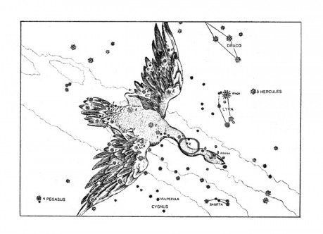

SEBRANÉ DOPISY

z dědictví po __Janu Matouši Wackerovi z Wackenfelsu__, císařském radovi, dvorním astronomovi, matematikovi,jakož i ze zaniklého zámku Stvolíneckého a taktéž ze zaniklé knihovny při faře kostelasvatého Štěpána na Novém Městě pražském,

sepsané různými osobami, zejména

Janem Václavem Berkou z Bělé

Eliškou Kateřinou Křineckou z Ronova

Janem Matoušem Wackerem z Wackenfelsu

Jakubem Rybnovským, šafářem pana

Zikmunda Zvířetického z Vartemberka a na Stvolínkách

Janem Hycšperkem, farářem u svatého Štěpána

_pojednávající o hvězdách, ohni, prapodivných proměnách,o Lapisu Philosophorum, Království nebeském a taktéž_

__O Myši,__

_stejně jako o jiných neobyčejných věcech ve zlých časech za vládyJeho Milosti císaře a pána pana_

__RUDOLFA II. Habsburského__

_v letech Páně 1599 až po rok 1611,_

vše nově sepsáno a v nový jazyk převedeno v době zcela současné v Praze roku 1992

---

__Paní Eliška Kateřina Křinecká z Ronova__

__Dětenice__

__Dáno na Stvolínkách, 11. listopadu A. D. 1604__

Drahá paní,

omluvte, prosím, má neuhlazená slova. Nikdy jsem dosud žádné ženě dopis nepsal a nikdy jsem ani takto psát nepotřeboval. Tu skrovnou hrstku dopisů, která je mým dílem, jsem většinou posílal svému příteli Wackerovi. Jsem zvyklý mluvit pouze s muži a o věcech, které obvykle zajímají pouze nás, učence. Obávám se proto, že můj dopis příliš zajímavý pro Vás nebude.

Vidíte – hned zpočátku jsem se měl představit. Nemám důvod předpokládat, že víte, kdo a proč Vám píše. Není také vyloučeno, že si na mne nepamatujete.

Mé jméno je Jan Václav z Bělé; alespoň tak jsem vám byl představen. O svém pravém jménu se zmíním později. Jsem zaměstnán jako učitel matematiky a astronomie u pana Zikmunda z Vartemberka, abych učil jeho syna Abraháma Jana.

Setkali jsme se ve Stvolíneckém zámku jednoho říjnového večera asi před měsícem. Byla jste tam tehdy kromě pana Zikmunda, jeho ženy Alžběty, jeho bratra Jana a mladého pana Abraháma pozvána i Vy s Vaším strýcem Oldřichem.

Večer byl slavnostní, pan Zikmund pozval na Stvolínky polovinu svého služebnictva. Původně Vás chtěli zvát do honosnějších Zvířetic, ale nakonec rozhodli pro menší a příjemnější Stvolínky, které má pan Abrahám dostat jako své sídlo.

Odpusťte mi moji přímost – celý večer nikdo neřekl, proč Vás vlastně zvali. Zřejmě ale víte, že si Vartemberkové přejí, abyste se stala ženou mladého pana Jana Abraháma.

Větší část večera se hovořilo o sporech mezi katolíky a protestanty. Říkám hovořilo, ale jistě si pamatujete, co tím myslím. Hovořil hlavně pan Jan, bratr pana Zikmunda. Horlil proti katolíkům, Lobkovicům, papeži, císaři a vůbec – proti polovině světa. Plamenně hájil stoupence Husa, luterány i Vašeho příbuzného, pana Viléma Křineckého z Ronova, který kdysi vedl protestantské spiknutí proti císaři. To, co jste vyslechla poprvé, jsme my ostatní slyšeli od pana Jana již mnohokrát. Pan Jan má asi pravdu; císař Rudolf asi opravdu pozbyl rozumu a je to špatný císař. Katolíci jsou opravdu falešní a hrabiví. Jenomže se bojím, že pan Jan se svým Husovým stoupencům podobá stejně málo, jako panu Vilému Křineckému. Neumím si představit, že by něco z toho všeho řekl veřejně, natožpak aby proti císaři opravdu povstal. On je právě vysvětlením toho, proč má v této zemi katolická strana stále navrch.

Pan Zikmund, mnohem důstojnější, dle svého zvyku mlčel. Občas se snažil nenápadně chválit svého syna a Vaše příbuzné.

Obávám se, že ten večer udělal mnohem větší dojem na sloužící, na pana Oldřicha i na samotné Vartemberky než na Vás. Myslím, že se nemýlím, že Váš zájem vzbudil až další hovor, kdy jsem měl předvést panu Zikmundovi – a také Vám – jakých úspěchů dosáhl pan Abrahám v astronomii a v matematice. Ne snad proto, že by byl mladý pán tak výtečný.

Celá moje práce je spíše rozmarem pana Zikmunda, který ví, jak císař opravdu miluje učenost, a chce pana Abraháma dostat do jeho přízně. Pan Abrahám – jak jistě tušíte – o hvězdy ani o matematiku zájem nemá. Je pilný, pozorný, chápavý, ale mnohem více jej zajímá lov, zábava, hostiny a snad i správa panství.

Věřím, že to víte. Nemohl jsem si nevšimnout, že znamenitá Bayerova Uranometria zaujala mnohem více Vás a také Vy jste se ptala na mnohem více věcí než kdokoli jiný. Při tom jste zmínila tak důležité věci a prozradila tak velkou vědomost o hvězdách, že to vzbudilo moji pozornost a zájem. Aniž jsem to měl původně v úmyslu, musel jsem vysvětlovat nejnovější objevy Johanna Keplera či Matouše Wackera, které zná jen málo zasvěcených. Mluvil jsem dokonce o učení Giordana Bruna, které by každého katolického kněze vyděsilo mnohem více než řeči pana Jana.

Hovořil jsem mnohem déle, než jsem chtěl. Pana Abraháma, který se během řeči poněkud vytratil, jsem trochu urazil, Jana z Vartemberka a Oldřicha Křineckého znudil a pana Zikmunda zneklidněl. Kdybyste nenavrhla večerní procházku na Ronovský hrad, možná, že bych celou slavnost vážně pokazil. Ale tou cestou se vše zachránilo. Pan Zikmund se mohl pochlubit nedávno získaným hradem a cestou do kopce napětí všech zmizelo. A to, že jsme ještě stále hovořili o hvězdách, vypadalo docela přirozeně. Z hradního vrchu zářily znamenitě. Nová hvězda v Hadonoši, jasná jako planeta, byla nepřehlédnutelná. Většinou v ní všichni hledali dobré znamení – buď pro sebe, pro zemi nebo i pro Vás a pana Abraháma. Ale to se nikdo vyslovit neodvážil.

Pro mne samotného tato hvězda znamenala důkaz, že mé hledání jde správnou cestou. Že vesmír není uvězněn v křišťálových sférách, ale žije. Je řízen mocnou vůlí, která v něm sídlí.

Po návratu jsme již nehovořili. Většina hostů odešla spát. Ale já jsem vyšel ven ještě jednou. A během této cesty jsem o Vás zjistil něco tak zvláštního, že mne to přimělo napsat tento dopis.

Ještě než prozradím, co jsem viděl, musím se trochu vrátit. Ten večer jsem Vám řadu věcí říci nemohl. Neřekl jsem Vám také nic o sobě. Možná, že to trochu omluví moji zvědavost a smělost.

Ta lepší část pravdy o mně se skrývá v mém pravém jménu. Jsem Jan Václav Berka z Dubé a na Bělé. Mám tedy stejně dobrý původ jako Abrahám Jan z Vartemberka nebo vy sama. Berkové jsou mocným rodem v Čechách po celá staletí a mají stejné znamení jako Křinečtí z Ronova. Kdysi dávno, za krále Václava I. jsme měli společné předky. To snad vysvětluje a ospravedlňuje, že jsem se při hovoru s Vámi nechoval jako služebník svého pána a také mne opravňuje k tomu, abych Vám psal tento dopis.

Horší část pravdy přiznám, když řeknu, že neznám jméno své matky. V tom je můj původ mnohem méně slavný. A jméno mého otce je Aleš Berka z Dubé a Bělé. Nejste starší než já a zřejmě nejste znalkyní rodinného rodokmenu. Asi ve Vás to jméno nevzbudí takový odpor jako u těch, kteří mého otce znali.

Otec byl stejný nepřítel katolíků jako pan Jan. Bohužel, nezůstalo jen u řečí. Trpěl chorobným strachem z jezuitů, Španělů, Lobkoviců i svých katolických příbuzných, především pak pana arcibiskupa Zbyňka. Občas dostával záchvaty zuřivosti, před kterými se třásli jak všichni služebníci, tak i my, členové rodiny. Rozbíjel věci, křičel, proklínal a každý se mu klidil z cesty. Nebohou paní Kateřinu, moji nevlastní matku, obviňoval ze smilstva s Lobkovicem, urážel ji a dokonce ji i bil. Někdy jsme jen stěží zabránili tomu, aby nevpadl do Bělského kostela s taseným mečem uprostřed svaté mše.

V roce 1599, kdy mi bylo šestnáct let, pozbyl rozumu docela. Už jen střídavě zuřil a naříkal, zdálo se mu neustále o hrozném mučení a o španělských botách.

Nejhorší ze všech dní, jaké si pamatuji, byl jeho poslední. Bylo to po jednom ze záchvatů, kdy jsem seděl proti němu sám v největší síni. Nikdo jiný v zámku nebyl – všichni uprchli. Kolem se válely poházené zbraně, trosky nábytku a věcí. Otec upadl do zvláštní strnulosti. Seděl v křesle proti oknu a upíral oči na mne. Cosi mne přinutilo, abych si sedl naproti němu, k oknu zády. Seděli jsme dlouho. Nikdo z nás neměl co říci. Pouze jsem se bál, abych jeho zlost znovu neprobudil.

Po chvíli jsem měl dojem, že jsem zahlédl za jeho zády, tam, kde měla být zeď, večerní oblohu. Nejprve jsem si myslel, že mne zmátlo soumračné světlo, smísené se září jediné dosud nerozbité lampy. Potom jsem ale pochopil, že jsem se zřejmě zmýlil – já sedím čelem k oknu a otec je přede mnou, k oknu zády. Ještě podivnější bylo, že otec, kterému bylo teď velmi špatně vidět do očí, se sobě vůbec nepodobal. Byl mnohem mladší a uvolněnější. V jeho tváři nebyl ani strach, ani zuřivost. Spíše smutek.

Nebyl to můj otec.

Byl jsem to já sám.

S hrůzou jsem pochopil, že moje mysl je v jeho těle. Nebyl jsem schopen pohnout ani prstem. Moje mysl neovládala tělo, ve kterém jsem byl.

Potom jsem ucítil přítomnost otce. Byli jsem tu oba. Zaplavil mne strašný děs z jeho duše; ucítil jsem a pochopil to všechno, co nám nikdy nemohl vysvětlit. Všechno to, co jej léta trýznilo a čemu jsme nerozuměli.

Temný mrak se snášel na celou zemi, na lidi, kteří nic netušili, nevěděli a necítili. Plamenné postavy se znamením kříže sestoupily z nebes a spalovaly vše živé. Vesnice, města, lidé, zvířata – vše hynulo. A nikdo se nebránil. Ve tvářích umírajících bylo znát jen jakýsi údiv.

Viděl jsem, že celý svět, který známe a který je okolo nás, bude zničen. Dojde k nesmírnému boji sil, které jsou mimo nás, a které nedokážeme ovládnout – a dokonce je ani neznáme. A středem těch největších hrůz bude naše země.

Bezmoc je nejhorší ze všech zoufalství.

Přicházel Věk Ohně – a otec byl jediný, komu bylo dáno pravdu vidět. Trpěl za tisíce těch, kteří teprve trpět budou. Mně bylo na těch několik okamžiků dáno trpět s ním, být vydán bezmoci tak úplné, že ji nelze ani vyslovit. Byla na nás snesena odpovědnost za celý svět, břemeno větší, než může kdokoli snést.

Marně jsem se snažil uprchnout. Tělo, poslušno plamenného anděla, vzalo jeden z mečů na podlaze a pečlivě si rozřezávalo krk. Byl jsem ochromen strachem a bolestí. Ještě zoufaleji jsem se snažil uniknout z těla, ze kterého se valila krev, které se dusilo a umíralo. Druhé tělo sedělo naproti, tiché, mlčenlivé, tak, jak jsem jej opustil. Nemohl jsem se do něj vrátit.

Kdesi zdáli jsem zaslechl dvě slova, nesrozumitelná, slabá. Snad mi je chtěl říci umírající otec. Snad to byl někdo třetí. Když jsem porozuměl, řekl jsem chraptivě:

„Gienah a Albireo.“

Potom jsem byl najednou zpět. Ležel jsem na zemi, s pekelnou bolestí v hlavě a kolem mne se rozlévala kaluž krve z těla mého otce.

Nevím, kdy mne našli. Byl jsem nemocen řadu dní a snad týdnů. Obával jsem se, že mne rozum úplně opustí, stejně jako mého otce.

Bělský zámek dostali příbuzní. Všichni se rychle snažili na otce zapomenout. Mne, kterého považovali za slabomyslného, nikdo nechtěl ani vidět. V době mé nemoci a bezvědomí mne převezli do špitálu v Praze.

Když jsem se trochu uzdravil, našel mne tu pan arcibiskup Zbyněk Berka. Katolík, kterého se otec bál, který ale měl dobré srdce. Dal mne do klášterní školy ke kapucínům na Hradčanech. Měl jsem od mládí zájem o matematiku. Zde jsem objevil i astronomii, které jsem tu věnoval mnoho času. Můj život u kapucínů však netrval ani rok.

Jednoho zimního dne jsem si vyšel na Petřín. Teď, s odstupem a v klidu jsem chtěl pochopit, co se vlastně stalo v den smrti mého otce. Vybavil jsem si tu chvíli, jak jsem pocítil, že se moje mysl přenesla do jiného těla. A jak jsem úplně a naráz poznal to, co si myslel můj otec. Znovu jsem spatřil plamenné obry, sestupující z nebes.

A najednou jsem viděl nový výjev.Veliké náměstí v neznámém městě, plné lidí. Uprostřed dřevěná hranice s kůlem. U kůlu uvázaný muž.

Ti okolo něj, v černém, jej měli v příští chvíli upálit.

Muž byl poměrně mladý, ale ve tváři, předčasně zestárlé týráním, byla jakási klidná vznešenost.

Kněz se jej tázal, zda odvolá své rouhání proti Bohu, zda nalezne alespoň nyní smír a pokoj.

Ten muž odpověděl – pokud mu bylo dobře rozumět – že umírá zcela smířen s Bohem, ale že své učení neodvolá, vždyť jej vytvořil pro větší slávu Pána. Chléb nikdy tělem nebude, stejně jako není žádných křišťálových sfér v kosmu – svět je nekonečný, stejně jako lidský rozum.

To bylo poslední, co řekl. Potom mu sevřeli jazyk do kleští na znamení věčného rouhání. A rychle, snad z obavy, aby ten muž přece jenom něco neřekl, hranici zapálili.

Tak přišel Věk Ohně mezi nás.

Viděl jsem zblízka do tváře toho muže, viděl jsem oči plné utrpení, hořící vlasy a vousy, jazyk, uvězněný v kleštích. Cítil jsem soucit a bezmoc zároveň. Věděl jsem, že chce něco říci. Že o mně ví. Chce říci něco, co by jej zbavilo utrpení – něco, co vím i já. Tvář se na mne prosebně upírala.

„Gienah a Albireo,“ zkusil jsem.

Muž se usmál a zemřel.

„Co jste to řekl?“

Vzpamatoval jsem se. Byl jsem zpět pod petřínskými stromy. Přicházel večer. Přede mnou stál osamělý chodec, bohatý a vznešený. To bylo vidět na první pohled. A jeho tvář vyjadřovala naléhavost a překvapení.

„Prosím, pane, co jste to řekl?“

Mlčel jsem. Muž přede mnou nevypadal zle. Chtěl bych mu důvěřovat. Bylo vidět, že je to pro něj důležitá věc. Ale nevěděl jsem, jak mu vysvětlit to, čemu jsem sám nerozuměl.

Cizinec mi pomohl z nesnází.

„Deneb a Sadir.“

Rázem jsem věděl, že on může vysvětlit všechna tajemství. Byl jsem si jist, že všechna čtyři jména patří k sobě. Gienah, Albireo, Deneb, Sadir. Řekl jsem mu, co jsem viděl na vzdáleném náměstí. Vylíčil jsem stručně popravu neznámého a řekl, že on zřejmě také ví, co ona slova znamenají.

Jeho zájem se během mého vyprávění měnil ve zděšení.

„To nemůže být pravda! Přece není možné...“

Otočil se a odcházel, jako by na mne docela zapomněl.

„Počkejte, prosím!“ vykřikl jsem za ním zoufale.

On se ohlédl a dal se na útěk.

To se stalo dne 18. února 1600.

Za týden potom jsem se dozvěděl, že onoho dne byl v Římě na Náměstí Květů upálen jistý Giordano Bruno z Noly. Kázal prý, že vesmír je nekonečný a plný tisíců sluncí s planetami. Za to mu před smrtí sevřeli jazyk do kleští.

Zjistil jsem také, že jména Gienah, Albireo, Deneb a Sadir jsou jmény hvězd v souhvězdí Labutě.

A nedlouho potom mne pozval bohatý a významný císařův učenec Jan Matouš Wacker z Wackenfelsu do svého domu na Hradčanech. Ukázalo se, že je to můj neznámý z Petřína.

Tak jsem se seznámil se svým největším a jediným přítelem, jakého na světě mám. Již během mé prvé návštěvy mi – oplátkou za můj příběh – otevřel brány ke skutečnému vědění, které je dáno jen málokomu. On sám přišel do Prahy k Rudolfovu dvoru jen proto, že zde bylo několik jemu podobných. Všichni nositelé nejúžasnějších vědomostí o světě se navzájem znali – a pokud se někde objevil jeden z nich, za chvíli tu byli všichni, jako včely, které se slétají ke květům. To, že u dvora působil Tadeáš Hájek z Hájku, způsobilo, že s za ním přestěhoval do Prahy sám Tycho Brahe, král všech astronomů. A za ním pak přijel Johann Kepler. A po něm Wacker. A řada dalších.

Tvořili uzavřený svět. To, že je zeměkoule kulatá, jim bylo něčím všedním. Diskutovali o tom, zda Země obíhá okolo Slunce, či naopak, během svých diskusí stěhovali v mysli celé planety sem a tam, při řeči můj nový přítel tvořil vesmíry stejně snadno, jako je potom rozmetával. Pouhé týdny hovorů s Wackerem byly pro mne víc než všechny mé předchozí školy. Stal se ze mne stejně přesvědčený vyznavač Koperníka, jako je Wacker sám a jako je Kepler, se kterým jsem se také několikrát setkal. Krátce před jeho smrtí jsem se setkal i s Tychonem a byl u jeho pozorování, o kterých se vyprávějí divy.

Wacker mne zasvětil i do dalších objevů; Tychonových důkazů, že planety nejsou upevněny v křišťálových sférách, Keplerových výkladů skutečných rozměrů a tvaru vesmíru a konečně i do učení Giordana Bruna, který neuznával ani vnější sféru stálic a tvrdil, že každá z hvězd je Sluncem s rodinou planet. Podle něj tedy ani Slunce není středem vesmíru...

Klášterní život mne brzy znudil. Wacker mi obstaral místo meteoroscopa čili pozorovatele oblohy u císaře. Měl jsem za úkol celý den a hlavně velikou část noci pozorovat jevy v ovzduší. Střídal jsem se s dalšími, většinou studenty. Práce to byla těžká, ale pro mne znamenala, že jsem se naučil dokonale znát nebe a všechny hvězdy Almagestu. Rozumím tomu, co hledá na nebi Kepler a ostatní. Nic menšího než řád světa, odpověď na to, jak vesmír vypadá, a odpověď na to, čím řídí hvězdy a planety naše kroky.

Nemohu vynechat ani další, drobnou, ale důležitou příhodu. Byla to veřejná pitva, provedená doktorem Jesseniem. Pohled na lidský mozek, pouhé dvě hrsti krvavé hmoty, pro mne znamenal mnoho. Jak je možné, že celá lidská duše se skrývá uvnitř lebky, že se celý náš vnitřní život odehrává v tak malém prostoru, že by v něm trvale nevydržela ani myš?

„Veškeré spojení duše se světem se děje očima, ušima, hmatem, ústy a nosem,“ říkal tehdy doktor Jessenius. „Kdyby těchto smyslů nebylo, naše duše by byla vězněm těla až do smrti. Neznala by svět o nic více než netopýr v nejhlubší jeskyni.“

Pronásledovaly mne sny, že jsem uzavřen ve vlastní hlavě a nemohu se dostat ven, na svobodu.

Jindy se mi lebkou zdála být Země a tím světem venku vesmír okolo.

Pochopil jsem, že vesmír je tím, co nás skutečně ovládá, co ale vidíme jenom nejasně, svými otvory v lebce; čemu nerozumíme. Najít cestu, kterou se dostane mysl ven, je současně cestou ke hvězdám. Vím, že možné to je. Již dvakrát jsem to zažil, vinou mně neznámých hvězdných sil. Byl jsem jako myš, vynesená na nejvyšší vrchol ve spárech orla. Nechápal jsem, co se se mnou děje, a neviděl jsem, co jsem vidět měl. Místo triumfu jsem poznal jen nekonečnou hrůzu.

Pochopit sílu hvězd – to je stát se orlem, stát se pánem toho, co činíme.

Nic dalšího již není důležité. To, že jsem přišel na Stvolínky a na Ronov, ze kterého jsou tak dobře vidět hvězdy, že jsem chtěl na chvíli uniknout z věčného ruchu v Praze, že jsem se stal soukromým učitelem ve službách Vartemberků, že jsem se setkali – to již víte.

Budu tedy pokračovat tam, kde jsem přestal – okamžikem, kdy jsem toho večera vyšel podruhé ze zámku.

Ve Vašem okně se svítilo.

Potom se okno otevřelo a přinutilo mne k tomu, že jsem si všiml, že v okně je žena. Zdola nebylo dobře vidět – ale bylo vidět natolik, abych si všiml, že žena je nahá. Tím více mne překvapilo, že potom vystoupila na okno.

A potom se začala před mýma očima měnit. Vztažené ruce se nadmíru prodloužily a narostla jim blanitá křídla, ze kterých trčely ohyzdné drápy. Tělo se měnilo v tělo plazí s dlouhým ocasem. Hlava se prodloužila v lysou, nestvůrnou lebku s prázdnými dutinami po stranách a spoustou obrovitých zubů.

Tvor vyrazil skokem vpřed. Nečekaně obratně se zachytil na velikém stromě, několik sáhů od okna. Potom znovu roztáhl křídla a vzlétl k nebi jako obrovský netopýr. Jen otevřené okno zůstalo zářit do tmy a přesvědčilo mne, že tentokrát nešlo o vidění a s mojí myslí se nic nestalo.

Při další cestě jsem se přesvědčil, že té noci byla moc hvězd opravdu výjimečná. Kromě toho, že se setkaly planety Jupiter, Saturn a Mars velmi těsně, zářila stále mohutná nová hvězda v Hadonoši. Byla jasná skoro jako Jupiter a znamená to, že musela být několiktisíckrát jasnější než Slunce – pouze nesmírná vzdálenost nám ji zmenšovala.

Pochopil jsem, že síla hvězd Vás některé noci mění v toho ohyzdného tvora, podobného draku a netopýru.

Možná, že jsem Vás urazil, či rozzlobil. Snad se obáváte, že prozradím Vaše tajemství. Ve světě, kde není dovoleno hlásat Brunovy či Koperníkovy ideje, by Vám hrozilo největší nebezpečí. Proto Vám vyprávím svůj příběh – i ten by vzbudil podezření Svaté inkvizice. Věřím, že máme oba dost dobrých důvodů mlčet, jako ostatně mlčí o podobných věcech řada těch, jichž si vážím.

Píši Vám proto, abych zjistil, zda víte o vlivu hvězd na Vaše proměny – a také, abych se otázal, zda snad znáte tento vliv a ovládáte tato tajemství?

Znáte snad to, co i ti největší mudrci světa v tuto chvíli hledají?

Pokud ano, je ode mne jistě opovážlivé Vás žádat, abyste se mnou takové tajemství sdílela.

Ale mohu se o to alespoň pokusit.

S největší úctou

Jan Václav Berka z Dubé

__Jan Václav z Bělé__

__Stvolínky__

Vážený pane,

Váš dopis mi udělal možná větší radost, nežli jste očekával. Říkáte, že nejste zvyklý dopisy psát. Já pak velmi málo dopisů dostávám s výjimkou dopisů Jana Abraháma z Vartemberka, které mi přicházejí stejně pravidelně jako dopisy mého poručníka Oldřicha a jsou stejně málo zajímavé. Ovšem i kdybych byla krásná jako Helena a dopisů měla tolik, že bych je stěží stačila číst, těžko bych Váš dopis označila jako nezajímavý.

Musím tedy přiznat, že jste jeden z mála mužů, kteří cítili potřebu mi napsat dopis. A k tomu mne potěšilo, že tento Váš dopis zcela postrádá jakékoli předstírání citů a prázdné řeči, které obvykle muži ženám do dopisů píší. Když jsem došla až k poslední řádce, mým prvým pocitem bylo zděšení, s jakým klidem jste přijal zprávu, že nemám vždy lidskou podobu. Léta jsem se tohoto odhalení obávala a očekávala jsem, že to bude okamžik plný křiku, urážek a zděšení, po kterém mne zřejmě moji bližní odvrhnou. Nedovedla jsem si představit někoho jako Vy, pro kterého znamenám stejnou zvláštnost vesmíru jako nová hvězda v Hadonoši či nepravidelnost planetární dráhy. Nejprve mne to zarazilo, potom snad i pobouřilo – a nakonec si myslím, že jste ten nejlepší, koho jsem mohla potkat.

Jste tím koho jsem si vždy přála – spojencem a snad i přítelem. Některá tajemství jsou příliš těžká na jednoho člověka – a nemusí to být ani odpovědnost za celou zemi a celý svět, o které jste psal. Však sám asi víte, proč jste se svěřil Matouši Wackerovi!

Chci k Vám být stejně upřímná jako Vy ke mně. Důvěřuji Vám zcela. A obávám se, že moje upřímnost Vám přinese veliké zklamání.

Tajemství, na které se ptáte, neznám. Po přečtení Vašeho dopisu mám pocit, že o mých proměnách víte možná více nežli já sama. Svoji schopnost jsem získala podivnou hrou náhod a Vaše podobenství o myši a orlu mé postavení vystihuje až příliš dobře.

Budu postupovat jako Vy – začnu sama sebou.

Mé jméno je Kateřina Eliška Křinecká z Ronova. Na tom jménu není nic tajemného, ale ani nic zajímavého. Naše rodina je odnoží proslulého rodu se znamením Ostrví – stejně jako Vaše. Erb a panský původ je to, čeho si na nás cenili nejvíce. Obávám se ale, že sláva Ostrví zajisté není způsobena zásluhami naší větve. Zatímco jiné rodiny – a Berkové z Dubé obzvláště – nikdy nechyběli při žádné slavné události, moji příbuzní, počínaje pradědem Čeňkem, který za vlády Přemysla Otakara II. přišel o hrad Frýdlant, nic skvělého nedokázali. Bylo jich mnoho, rodili se, ženili a umírali – a kdyby nebylo toho slavného znamení, zřejmě by si je nikdo nepamatoval.

Můj vzdálený strýc Vilém, který vedl kdysi povstání proti císaři, byl úplná výjimka. A myslím, že není náhoda, že toto povstání neuspělo. Navíc jeho příbuzní byli postiženi nemilostí císařovou – a byli ještě bezvýznamnější než ostatní.

Měla jsem vždy spousty příbuzných, kteří se o mne mohli starat i v době, kdy mi zemřeli oba rodiče. Strýc Oldřich je můj poručník. Většinou se ale stěhuji od jednoho příbuzného ke druhému a každý hledí na to, jak se mne co nejdříve zbavit a předat mne někomu jinému. Nakonec se proto rozhodli mne provdat.

To ale předbíhám. Musím se ještě zmínit o strýci Bohuslavovi, který zemřel před šesti lety.

Nepamatuji ho jinak než velmi starého. Narozdíl od jiných příbuzných byl vždy bohatý. S nikým se nepřátelil a s rodinou trochu pohrdal. Oni se jej za to báli. Za život měl tři ženy a s žádnou z nich neměl děti. Byl to ale velký milovník života, umění a krásných věcí. Za život prošel více zemí nežli ostatní příbuzní dohromady, přečetl více knih, vyslechl více hudby, ale také vypil více vína, snědl více a miloval více žen. Kromě svých podivných přátel, jako například pana Bavora Rodovského z Hustířan, měl nejraději mne.

„Když nejsi hezká, jako tvé sestry, budeš alespoň chytřejší než ony,“ říkal mi. „Uvidíš, že svět bude pro tebe mnohem zajímavější než pro ně.“

Dlouho mne tato slova trápila – ale nakonec jsem si je asi vzala k srdci, soudě podle toho, že se žádné z mých sester nikdy tolik nevěnoval. Obávám se, že jeho žena Beatrix na mne dost žárlila. Ale brzy jsem pochopila, že si ji strýc vzal pouze pro peníze a přestala jsem si jí všímat.

Pokud mluvím o strýci, nemohu se nezmínit o jeho skříni. Její záhada mne provázela celé dětství. Do této skříně nesměl vůbec nikdo, ani jeho přátelé, milenky, ženy – ani já. Služebnictvo se jí muselo vyhýbat uctivým obloukem. Byla to mohutná, dubová skříň, zdobená tajemnými ornamenty, která stála v jeho komnatě. Měla jsem právo nahlédnout do všech strýcových knih a odpověděl mi na všechno, co jsem chtěla vědět – a byly to věci, které mnohdy nebyly určeny pro mé mladé uši – ale o tom, co je ve skříni, mi nikdy neřekl nic.

Bylo mi právě čtrnáct let – krátce před strýcovou smrtí – když jsem se zařekla, že tuto záhadu zdolám. Ve strýcově komnatě bylo více kusů nábytku. Jeden z nich byl vysoký, vyřezávaný sekretář. Dosahoval hodně nad hlavu každému – a díky vyřezávaným figurám nebylo vidět, co na něm je. Napadlo mne schovat se právě tam.

Můj nápad usnadňovalo to, že byla zima, v pokoji se topilo a oheň bezpečně přehlušil můj dech. Přesto jsem na sekretáři musela vydržet hodně dlouho, než strýc přišel.

Potom jsem se dočkala.

Strýc vešel. Nejprve se rozhlédl, zda v místnosti nikdo není. Byl už večer, ale přesto zatáhl husté závěsy a rozsvítil světla. Potom pečlivě zamkl.

Skulinou mezi dvěma anděly, srdce v krku napětím, jsem viděla, jak strýc otevírá skříň. Můj první pocit bylo zklamání.

Spatřila jsem roztodivnou směs knih, kusů kamení, skla a různých kovů. To, že se strýc zabývá alchymickým kuchtěním, se všeobecně vědělo a také na mnoha jiných místech domu se válely podobné věci.

Strýc ale vytáhl několik kamenů ze dna skříně, znovu se rozhlédl a pak odklopil na dně tajná dvířka.

Když potom strýc odtud vyjmul kazetu ze slonoviny, postavil ji na stůl a otevřel v jejím boku další tajný úkryt, mé vzrušení vzrostlo.

Z této nejtajnější skrýše vyprostil malou lahvičku se širokým hrdlem.

Potom si připravil misku z kameniny a nalil do ní živé stříbro, argentum vivum, jestli víte, co tím myslím. Měl je připraveno ve veliké lahvi ve skříni.

Na to opatrně vsypal do misky něco z oné tajemné lahvičky. Vypadalo to jako červený vosk nebo červený cukr – malé, purpurové krystalky.

A potom – těžko mohu říci, co bylo potom. Z misky vystoupil dým, hmota se vařila. Vyšlo mohutné světlo, tak jasné a mocné, že do něj nešlo pohlédnout – neznámý oheň prolétl kolem – a pojednou jsem ucítila, že na okamžik vidím to, co je za zdmi domu, to, co je nad námi i pod námi. Těžko hledám slova pro to, co jsem spatřila. Mohu mluvit o jednotlivých obrazech. Viděla jsem ve vedlejším pokoji Beatrix, ženu mého strýce, takovou, jaká byla ve skutečnosti – tvář zkroucenou chtivostí a zvědavostí, zmítající se v pochybách, co dělá strýc nyní, co před ní skrývá za poklad, jak se kroutí vzteky z obavy, že bych ten neznámý poklad mohla získat já. Bylo mi jí líto té Beatrix – nic jiného než chtivost v ní nebylo. Neviděla jsem strýci do tváře – ale i jeho jsem viděla, těžkého věděním a vzpomínkami, unaveného, ale stále nejistého, protože na jeho otázku mu dosud nikdo neodpověděl, stál tu před velkým divem, který chápal stejně málo jako já, byl to cizí div, který mu nepatřil, a on cítil, že mu nikdy patřit nebude. Vypadal jako člověk, který postavil hrad z písku a bezmocně hledí na to, jak voda hrad odplavuje pryč, beznadějně, nelítostně, div se ztrácel, jako vždy předtím a jako tomu bude napořád.

To vše jsem viděla najednou. Zmizelo to a bylo pryč. Bylo to krásné – moc krásné. Tak nějak jsem si představovala tehdy chvíli s někým, koho budu milovat. Ale cítila jsem stejný žal jako strýc – nerozuměla jsem tomu, když to procházelo okolo mne, a teď to bylo nadobro pryč. Oheň mne nezahřál, protože jsem neuměla zachytit jeho teplo. Orel mne vynesl na nebesa, ale můj pocit byl jen smutek a strach. Nenalézám lepší slova. Snad mi porozumíte.

V misce ležel důkaz, že to nebyl jenom sen – horký kus ryzího zlata, který strýc držel před očima, jako by chtěl zachytit alespoň tuto záři, odlesk něčeho, co ho právě minulo.

Neprozradila jsem se tehdy. Již jsem se nebála strýcova hněvu – spíše jsem nechtěla rušit jeho žal. Snad se nemýlím, že tehdy jsem měla podobné pocity jako Vy v den smrti otce – najednou jsem úplně pochopila, co v sobě nesl. A bylo to víc než skutečnost, že dovedl vyrábět zlato – víc než to, že jsem odhalila původ jeho bohatství a zvítězila nad záhadou skříně.

Ale dlouho jsem mlčet nevydržela. Řekla jsem mu, že vím, co je ve skříni, již po třech dnech, když jsme spolu seděli na břehu Labe.

Nejprve neřekl nic. Vypadalo to, jako by to nebylo nic důležitého. Potom teprve promluvil.

„Tušil jsem, že na to jednou přijdeš. Doufal jsem, že jednou převezmeš toto podivné dědictví, které nám bylo svěřeno, ale kterému nerozumíme.

Pokud jsi viděla projekci – tak se ten div jmenuje – pak nemusím vysvětlovat tolik. Nemusím snad říkat, že podobné vidění bylo dáno nemnohým od počátku světa a že ti, kdo viděli, mají mnoho důvodů skrýt toto tajemství před druhými, kteří nejsou připraveni. Zlato, které jsi spatřila, je jen důkazem úplnosti divu, je jen odleskem onoho mocného světla, které je více než zlato samo. Běda tomu, kdo by sloužil zlatu, a ne onomu světlu! První z mocných knížat a králů, který by jej odhalil, by jej navždy zavřel do klece jako husu, která rodí zlatá vejce. Závistivý dav by jej umořil prosbami, sprostí by jej okradli a nepřející zamordovali. A což teprve kněží, poddaní papežovi, ti černí mrchožrouti – co teprve by učinili oni, kdyby shledali, že někdo, kdo není pod jejich mocí a neklaní se papeži, dokáže opravdu proměnit tělo v krev a činit divy evangelií!

Mezi námi dědici se říká, že to byl Anselm z Ronova, který za vlády krále Václava dostal Kámen od neznámého muže z Prahy. Dostal tato ponaučení, která právě říkám a o kterých se snadno každý přesvědčí, jak jsou pravdivá – ale nedostal vysvětlení. „Pomohl jsi mi z dobrého srdce, Anselme, neváhal jsi nasadit mnohé, abys mne ochránil – a proto dostáváš tento nejcennější Kámen. Ale vysvětlení nemohu říci. Neposloužil bych ti dobře. Pravý majitel Kamene jej zná a umí připravit – a umí užít jeho služeb. Ale k této nejvyšší moudrosti vůbec si musí nalézt cestu sám. Není nikdo, kdo může takovou moudrost sdělit a vyslovit. Proto je mojí odměnou Kámen a mlčení. Pamatuj ale na slova Písma, kdy Pán řekl – zelenou bylinu dám vám za potravu, ale červené maso nejezte! A také – uchovej v tajemství, co řeklo sedm hromů, a nic nepiš!“

A tak prochází kámen časem a naší rodinou. Anselm dožil, aniž pochopil Tajemství, užívaje zlata, které vyrobil. Jeho synovec Janek zemřel, aniž Kamene použil, zabit za husitských válek. Jan Křinecký Kámen znovu nalezl za krále Jiřího – ale věděl o něm méně než druzí a z jeho moci nalezl pouze zlato a přepych. Viktorín si ze zlata postavil dům v Praze – a celý život se trápil otázkami. Ani on nebyl povolán. Jeho synové Kámen ztratili, pohodili mezi různými cetkami v jeho domě a celý život projekci neviděli. Ale já jsem Kámen opět nalezl podle jednoho zápisu v dědově deníku. Nevím však o nic více než ti přede mnou. Ptal jsem se učenců, četl jsem knihy, pálil v peci všechny materie, které jsem si vůbec mohl představit – ale stále stojím před stejnou záhadou jako na počátku. Neumím číst slova Písma, Mojžíše a Jana Evangelisty – vím, že mluví o tom, co mám v ruce, ale souvislost jsem nenalezl.

V mém testamentu ti odkazuji onu skříň. Není v ní nic důležitého – kromě Kamene, který je nejdražší věcí, jakou kdo může mít. Uschovej v tajnosti to, co jsem ti řekl. A věz, že břemeno, které dostaneš, je těžší než užitek z něj, pokud neporozumíš.“

Za dalších několik dnů strýc zemřel. Tiše, bez varování, bez dlouhé nemoci. Byla to pro mne rána větší než smrt rodičů. A přesto jsem již několik dnů věděla, že smrt přijde. I to mi bylo dáno vidět v okamžiku projekce zlata.

Den smrti mého strýce byl dusný a strašný. Nerada na něj vzpomínám.

Všude se míhalo služebnictvo, poděšené smrtí pána, nejisté tím, co mělo přijít. A nade vším visel stín strýcovy ženy Beatrix, černého supa, který nečekal ani na pohřeb a již začal prohledávat dům a schraňovat všechen majetek. Závěť byla taková, jak strýc řekl – Beatrix dostala téměř vše, jenom na některé přátele a věrné služebníky bylo pamatováno drobnými odkazy. Mezi jinými tu byla i zmínka o tom, že mi byla odkázána ona skříň. Ale díky Beatrix se mnoho dědiců nesetkalo ani se svým poměrně malým odkazem – věc prostě nebyla o několik dní později v pozůstalosti nalezena. A tak mi nezbylo než vejít již prvého dne do strýcovy komnaty a odnést a ukrýt onu lahvičku s Kamenem jen o několik okamžiků dříve, než sem dorazila teta Beatrix a skříň byla odnesena neznámo kam. Své dědictví jsem již nikdy neviděla, i když vím, že skříň musela znamenat pro tetu zklamání, protože v ní vůbec nic zajímavého nezbylo.

Hned po pohřbu mi bylo naznačeno, že v domě již nejsem vítána. Odešla jsem bez lítosti, protože strýc už nežil. Nikdy jsem se tam nevrátila.

Zbyl mi Kámen, Lapis philosophorum, nejhledanější věc na světě. Ale já jsem nevěděla, co s ním počít.

V mých rukou byl jako v rukou dítěte. Prohlížela jsem si podivné, červené krystalky jako hračku. Když jsem některý z nich rozdrtila v ruce – šlo to snadno, jako by byl z cukru nebo vosku – rozbil se na bělavý prášek, ale do rána se potom opět spojil v krystal.

Chodila jsem od příbuzných k příbuzným a s sebou vždy onu lahvičku, se kterou jsem si v nestřežených chvílích hrála.

Jednou muselo dojít k tomu, k čemu došlo. Byla jsem zrovna sama v zahradě jednoho z rodinných sídel – už si přesně nepamatuji, kde to bylo – když jsem v zamyšlení jeden krystalek okusila. Rozplynul se v ústech jako med. Zaujata tímto objevem jsem potom okusila druhý. A pak třetí. Najednou jsem věděla, že to je to, co jedl svatý Jan – to je ta Kniha, jenž je na jazyku sladká. A s hrůzou jsem se probrala ze zamyšlení. Protože jsem viděla, že jsem snědla všechno, že nic nezbylo, vůbec nic – strýcovo dědictví, slavný Lapis, snědla jedna pošetilá dívka jako cukrový pamlsek. A s úzkostí jsem si uvědomovala, že Kniha ze Zjevení potom zhořkla v žaludku. A ještě potom mi zazněla jako hrom slova neznámého muže z Prahy, jak je řekl Anselmovi – „červené maso však nejezte!“

Snad to bylo mými pocity úzkosti, snad to bylo doopravdy – ale pocítila jsem vskutku palčivost v žaludku. Bylo mi stále hůře. Běžela jsem ke kraji zahrady, s pocitem štvané zvěře. Byla jsem si jista, že mne čeká smrt za to, co jsem učinila. Chtěla jsem se skrýt před světem, přede všemi. Vím, že jsem vlezla do jakéhosi křoví, že se mi smyly zatemňovaly, že jsem viděla stále hůře, že palčivost v žaludku rostla, že jsem měla strach, hrozný strach z bolesti, která přicházela. A bolest rostla, po celém těle, cítila jsem strašný jed v krvi, který pálil jako oheň. Bolest pomalu zatlačila všechny ostatní pocity. Svět zmizel, zůstávala jenom bolest a můj křik.

Když jsem se probrala, byla tma, ležela jsem stále v onom křoví a kolem mne byly rozervané moje šaty. Vypadala jsem tak, jak jste mne viděl onoho večera – blanitá křídla, dlouhá hlava se strašnými zuby. Napůl drak a napůl netopýr. Ohyzdné, pekelné stvoření. Věděla jsem, že je to můj trest – ale přesto mi připadal jako milost a jako vysvobození z předchozí bolesti. A když jsem zkusila své nové, silné tělo, poznala jsem i novou radost. Byla jsem volná jako nikdy předtím. Mohla jsem neslyšně přeskakovat ze stromu na strom, mohla jsem létat do závratné výše. Mohla jsem jít, kam jsem chtěla a činit cokoli. Byla jsem královnou noci. Zažila jsem opojný pocit dravého lovce, když jsem hnala po kraji zbloudilou ovci, roztrhala ji na kusy a hltala kusy krvavého masa. Děsila jsem osamělé poutníky, kteří přede mnou prchali. Létala jsem, vysoko a daleko, pod večerními hvězdami. Byl to můj nejšťastnější večer v životě.

A ráno – ráno jsem se probrala nahá v zahradě, ztuhlá zimou, zděšená hanbou. Pochopila jsem, že v noci můj rozum chápe jen omezeně, skoro jako u zvířete. Že pocity odpovědnosti jsou mi dány až v lidské podobě. Že za zvrhlou radost v noci budu platit větším zoufalstvím ráno.

A to je můj život od té doby. Jsem nehezká a nebohatá, ale z dobrého rodu. Jsem obtížné břemeno pro své příbuzné. Ale když vyjdou hvězdy, ty pravé hvězdy, změním se v tvora, který je svobodný. O to více mne ale ta svoboda tíží ve dne. Můj život je životem opilce, který večer uniká do opojného snu, aby si připravil o to horší probuzení. A i kdybych mohla zůstat oním stvořením natrvalo, zaplatila bych omezeným rozumem, ztrátou odpovědnosti. Změnila bych člověka na zvíře – a to by byl jen další hřích.

Pokud hledáte v mém psaní odpověď na tajemství jako učenec, pak já hledala ve Vašem odpověď na to, jak mám uniknout z toho čarovného kruhu. Lze najít úplnou moc a svobodu, jakou mám ve svém převtělení, aniž by se ztrácel rozum? Nebo mám jenom volbu mezi dvěma zly a dvěma bídami?

Vaše

Eliška Kateřina Křinecká z Ronova

__Pan Zikmund z Vartemberka a na Stvolínkách__

__dáno na Stvolínkách dne 27. 6. A. D. 1605__

Drahý pane,

je mojí nemilou povinností Vám říci pravdu o tom, co Vás jistě zarmoutilo a na co byste zajisté co nejraději zapomněl. Asi nezískám Vaši lásku tím, co Vám nyní povím. Ale dobrý služebník a šafář řekne i zlé zprávy, i když ví, že za to pochvalu od pána nesklidí. O věci se totiž začíná hovořit po vsi, nejsem asi jediný, kdo si povšiml a vytušil pravdu, a proto bude lépe, když ji budete znát ode mne dříve, než byste ji poznal od cizích.

Smrt Vašeho milovaného syna byla bolestná pro nás všechny, nemusím lhát, když říkám, že jej měli rádi všichni ve Vašem panství. Tím hůře zarmucuje zpráva o tom, jak tato smrt byla zlá a strašlivá. Skončit v drápech medvěda je věru bědný konec pro tak skvělého lovce, jakým Váš syn byl. Ale – pravda je ještě horší, než Vám řekli. Bůh mne netrestej – já jsem jeho konec viděl a modlím se, abych na ten obraz mohl zapomenout.

Ten večer jsem šel prohlédnout vrata od stavení. Špatně se zavírají a několikrát předtím se stalo, že se nám tam vniklo něco dravého a odneslo ovci.

Prošel jsem tedy dozadu a vidím, že kus dál v poli je jakési tmavé zvíře. Nebylo možno jej rozeznat. Šel jsem blíže, abych si je prohlédl. Když jsem byl asi sto kroků od něj, dostal jsem pomalu strach, protože to vypadalo jako obrovský pták, nebo snad ještěr s křídly. Bylo to veliké jako muž, možná o něco delší. A když jsem přišel ještě blíže, najednou to vzlétlo proti mne. Zahlédl jsem pekelnou hlavu, holou jako umrlčí lebka, strašlivé zuby a dlouhé drápy. Prchal jsem, co mi síly stačily, až jsem pár kroků od chléva jsem upadl tváří k zemi. Zaslechl jsem zasyčení křídel nad sebou. A když jsem se odvážil vzhlédnout, netvor byl pryč. Přísahám při všech svatých, že to je pravda a nic než pravda. Viděl jsem na panství draka.

Abych se přesvědčil, že to nebylo jenom šálení smyslů, vyšel jsem ještě jednou k lesu. A tam jsem potkal Vašeho syna Jana Abraháma.

„Viděl jsi ho, Jakube? Čekám tu na něho již několik dní! Budu prvním, kdo uloví draka! Věřím, že takový úlovek ocení i panna Eliška!“

Smál se, jako by nepochyboval, že zařadí tuto podivnou trofej do své sbírky. Trochu jsem se zastyděl za svoji bázeň před několika okamžiky, ale přesto mne obavy neopustily. Radil jsem mu, aby vyčkal do rána, protože ten netvor je tuze nebezpečný. Ale nedal si říci. „Přinesu jeho hlavu své nastávající, aby nikdo nemohl říci, že je nějaké zvíře na světě, které bych nedokázal přemoci.“

Měl jsem na něj počkat na rozcestí pod Ronovem. Tak se také stalo. Bylo již těsně před úsvitem, několik hodin potom, kdy mne opustil a kdy vyrazil nahoru. Zaslechl jsem šumění křídel. Potom výstřel ručnice. A potom padající kameny, jako když někdo běží – nebo padá – z kopce dolů ke mně. Vyrazil jsem na svah. A tam jsem viděl Vašeho syna, jak prchá – ručnici někde odhodil – po svahu dolů, a za ním ten netvor jako vojsko pekel. Jediným skokem jej drak dostihl, zaťal mu drápy zezadu do krku a strašnými zuby rozsekl hlavu. Rozsápal mu záda, převrátil jej a potom – nevím, jak si to mám vysvětlit, ale potom najednou zanechal svého běsnění a odletěl pryč.

Váš syn a můj pán ale již byl mrtev, nadobro mrtev, zůstal tu přede mnou ležet.

Ráno jsem řekl, že jej zabil medvěd. Ale možná tu byl někdo, kdo draka zahlédl již dříve. Povídají se divné věci. Nevím, zda tuto pravdu mohu pohřbít navěky. Ale musel jsem ji říci alespoň Vám. Snad jsem dostal alespoň naději, že zapomenu, když se bude o pravdu dělit se mnou někdo jiný.

Váš oddaný

Jakub Rybnovský

__Pan Matouš Wacker z Wackenfelsu__

__Praha__

__dáno na Ronově 24. 10. 1608__

Milý příteli,

je to již delší čas, kdy jsme se neviděli, ale doufám, že jsi úplně nezapomněl na svého věrného žáka a obdivovatele Jana Václava Berku z Dubé. Ano, je to asi tři roky, kdy jsme se viděli naposledy (pamatuješ?), kdy jsme se bavili o tom, že Kepler nalezl skutečnou dráhu planet, které se podle něj pohybují po elipsách. Musel jsem tehdy odjet na sever, za panem z Vartemberka, protože zemřel jeho jediný syn, kterého jsem vyučoval.

Co jsem dělal po celou dobu, co jsme se neviděli, není ani tak zajímavé – Vartemberk, zdrcený smrtí syna, mne nechal ve svých službách vlastně až dosud s tím, že za mírný plat mu budu sestavovat horoskopy a jinak si mohu na Ronově dělat, co chci. Po pravdě řečeno, po smrti syna na Stvolínky a Ronov už nikdy nepřijel. Dokonce ani nenamítal, když jsem rok potom začal žít jako se ženou s Eliškou Křineckou, která měla patřit jeho synovi.

Nepíši Ti ale proto, abych vyprávěl svůj poměrně nudný příběh – jde mi o velká tajemství, která jsem nalezl na nebi.

Keplerův spis o dvou hvězdách z roku 1606 přivedl moji pozornost na souhvězdí Labutě, o kterém se zde také hovoří. Kepler shledal podivuhodnou věc – že těsně vedle krku Labutě vznikla nová hvězda, která potom opět zmizela. Nevím, jestli si všichni uvědomili, co to znamená. Je to důkaz, že i v nejvyšším nebi, tedy ve sféře stálic, dochází ke změnám. Že tam vznikají hvězdy a opět se ztrácejí. To samo o sobě dokazuje, že hvězd nemůže být tolik, kolik je uvedeno v Almagestu.

Že se velký Aristoteles znovu mýlil a že musí mít pravdu Giordano Bruno z Noly – že každá z hvězd je vlastně Sluncem, které je nesmírně daleko a je neuvěřitelně obrovité. Že tedy střed vesmíru, kde sídlí Bůh, není ani nad Zemí, jak si myslí papež, ale ani u Slunce, jak si myslíš ty a Kepler. Boží vesmír je mnohem, mnohem větší, než jsme si mysleli všichni.

Povím ti o několika pozorováních, která jsem provedl. Říkám provedl, ale tím bych umenšil podíl své ženy, která řadu pozorování provedla se mnou a mnoho objevů je její zásluhou, protože její zrak se zdá mnohdy být lepší nežli zrak jiných lidí.

Nejprve jsme tedy prohlédli důkladně souhvězdí Labutě, které bylo středem naší pozornosti. A spatřili jsme, že kromě hlavních hvězd ve tvaru kříže a několika vedlejších, dokreslujících tvar ptačího těla, letícího někam k jihu, kde Deneb je ocasem, Albireo hlavou, Gienah a Delta křídly a Sadir středem těla, je tu ještě řada hvězd menších, o kterých se zatím nikdo nezmiňoval. Celkem jsme jich napočítali sedmapadesát, tedy o mnoho více, než je jich běžně uváděno. Kromě toho je tu ona Keplerova hvězda, nyní zcela neviditelná. Tyto nové hvězdy jsou zřejmě stejně velké jako ty sousední. Domnívám se, že kdyby bylo Slunce v souhvězdí Labutě, nebylo by nijak větší než ony drobné hvězdičky.

Pokud se zahledíš na celou oblohu, shledáš, že právě takovýchto drobných hvězdiček je nejvíce v místech, kde souhvězdími prochází Mléčná dráha. Souhvězdí, která jsou od ní vzdálena, mají hvězd méně a větších. Domnívám se tedy, že některá souhvězdí jsou nám bližší, neb mají málo jasných hvězd a lze to vysvětlit tím, že celé souhvězdí je nám poměrně blízko. Jiná souhvězdí jsou naopak vzdálená, protože mnoho hvězd se jeví být drobných, a při tom nelze předpokládat, že by byly výrazně menší než Země.

Rozdělil jsem tedy nebeská souhvězdí na tři řády podle jejich vzdálenosti a shledal jsem, že vesmír má tvar obrovského disku nebo kotouče, protože souhvězdí třetího řádu se sdružují právě na Mléčné dráze, kdežto souhvězdí prvého řádu – ta nejbližší – jsou od ní velmi vzdálena.

Z toho plyne závěr, že hvězda, nacházející se v souhvězdí třetího řádu, a je stejně jasná jako hvězda v řádu prvém, musí být ve skutečnosti mnohonásobně větší než hvězda v prvém řádu. A snad vůbec největší hvězdou je proto Deneb v souhvězdí Labutě, protože sousedí s hvězdami sotva viditelnými, ale přesto patří mezi nejjasnější hvězdy. Při prvém letmém výpočtu jsem shledal, že musí být tisíckrát větší nežli Slunce. Považ jen – tisíckrát větší!

Jeden z našich objevů to potvrdil. Při sčítání hvězd jsem jednou napočítal o jednu hvězdu více. Zjistil jsem, že je to hvězda v krku Labutě, v té době poměrně jasná. Když jsem na ni pohlédl o několik měsíců později, zjistil jsem, že je slabší než předtím. Potom byla sotva viditelná a nakonec zmizela úplně na mnoho měsíců. Ale letos – jak se můžeš přesvědčit – se opět objevuje! Říkáme jí Proteus – a tak ji také můžeš vidět označenu na našem plánku.

Nyní se objevuje dokonce podruhé na tomtéž místě a nedivil bych se, kdyby se takto objevoval a mizel neustále, do skonání věků!

Domnívám se, že i při svém zmizení nemizí tato hvězda ve skutečnosti úplně, ale musí být alespoň tak veliká jako planety. Je ale tak daleko, že ji v té době nevidíme. Je to proto, že Labuť – a s ní i Proteus – jsou ještě stomilionkrát dále než nejvzdálenější planeta.

Druhý objev mi tuto domněnku potvrdil. Byla to Eliška, kdo si všimla, že Albireo, Hlava Labutě, jsou ve skutečnosti dvě hvězdy, neobyčejně těsně u sebe. Po mnoha marných pokusech jsem se přesvědčil, že tomu tak skutečně je. Musíš mít ale opravdu ostrý zrak, abys takovou věc spatřil.

Souhlasím plně s tím, co tvrdí Kepler o drahách planet – že se pohybují tím pomaleji, čím jsou vzdálenější od Slunce. U dvou hvězd by tento zákon měl být podobný. A jaké bylo mé ohromení, když jsem zjistil, že za celou dobu, kdy pozoruji Albireo, tedy již skoro tři roky, se obě hvězdy nepohnuly z místa a jsou stále ve stejném postavení jako na počátku! Znamená to, že ty dvě hvězdy, které lze sotva od sebe rozeznat, jsou ve skutečnosti nejméně tak daleko, jako je od Slunce Saturn, nejvzdálenější planeta! Z takového údaje jsem opět spočítal rozměry vesmíru a znovu se přesvědčuji, že čísla, která předkládám k věření, jsou přinejmenším správná. Kdybych přirovnal cestu k Saturnu k cestě po těle mouchy, od jednoho konce k druhému, pak cesta k nejbližšímu hvězdnému nebi by byla dlouhá jako cesta do Říma. A cesta k souhvězdí Labutě by byla dlouhá jako cesta kolem světa.

Shledal jsem tedy vesmír takový, že sestává z tisíců hvězd, z nichž každá je hvězdou jako Slunce a které mají své vlastní soustavy druhého řádu, sestávající z planet. A těch hvězd je mnohem více, než se odvažuji hádat, protože pouhým okem jich lze spatřit nejméně dvakrát tolik, jako je uvedeno v Almagestu, a lze tušit, že ty nejvzdálenější se nám slévají do nerozlišitelné záře, jako je tomu v Mléčné dráze.

Tyto hvězdy mají několik barev, červenou, žlutou, bílou a modrou, z nichž každá barva vládne jednomu ze živlů, z nichž jest vesmír utvořen. A žluté Slunce je proto hvězdou vzduchu, jako je červený Antares hvězdou ohně, modrý Rigel hvězdou vody nebo bílá Vega hvězdou země. Čím je hvězda větší, tím je její moc nad vesmírem větší, tím silněji nás ovlivňuje a řídí naše kroky. To je tajemství, které hledali všichni astrologové od počátku věků.

Tam, kde se Mléčná dráha rozšiřuje a rozděluje, kde tvoří svatozář kolem tmavého prostoru, tam leží Střed světa, který hledáme. Je tam ono souhvězdí Labutě, které má ale také tvar Ukřižovaného, protože zde nám je dáno jasné znamení, kam se mají naše oči obracet. Nevěřící zde viděli Labuť, letící k jihu – já se domnívám, že jde o Tělo Pána, s hlavou mířící k severu. Což jsem právě neukázal, že Albireo jsou ve skutečnosti dvě hvězdy těsně vedle sebe – právě jako Jeho nohy na kříži?

Nyní obrať pozornost k Jeho Hlavě – neboť tou je právě Deneb, jak ji nazvali staří. Není náhoda, proč právě tato hvězda je nejmocnější a největší, jakou se mi podařilo nalézt. Dělí nás od ní propast, nesmírná propast – a přece odtud vychází největší a nejmocnější síla, odtud se vládne všemu.

Povím Ti o jednom snu, ve kterém žena spatřila nesmírný strom, na kterém žijí ptáci. A někteří z těch ptáků odlétali pryč na jiné stromy a už se nikdy nevraceli. A jen někteří znali tu pravou cestu, při které se proměnili jako Fénixové v plamen, který vyšlehl nesmírnou silou ke stromu ze všech nejvzdálenějšímu, nesmírnému a největšímu.

Potom spatřila, že ty stromy jsou vlastně planety v Kosmu a že ptáci jsou vlastně lidské duše, které po konci svých dnů odlétají a opouštějí naši zemi.

To místo, kam se dostal jen jeden z tisíce, leží nesmírně daleko, mnohem dále, než si umíme představit, a je velké jako všechny ostatní světy dohromady. Ta země je bílá a pustá, jsou tam jen skály a písek. Slunce nad hlavou je nesmírné a bílé. Každé zrnko písku je velké jako skála a kámen jako hora. Každá vteřina je jako den a hodina jako rok. A tím pískem se pohybují bytosti podobné plamenům, tančí jako písečné víry, létají, mizí, objevují se.

A každý z nich svojí mocí a vůlí tvoří to, co právě potřebuje – může mít tělo, může mít paláce a zámky, může mít zahrady, může mít jakékoli bohatství. Zde jsou ti, kdo nalezli svobodu a sílu – ale také tvoří tak, aby mohli skládat počet z toho, co vytvořili.

Cesta je však dlouhá, nesmírně dlouhá. Duše ji nikdy nemůže projít, dokud není proměněna v plamen a dokud není úplná.

Poznal jsi správně – stále mne pronásleduje myšlenka, jak nebýt uvězněn ve své vlastní hlavě, ve svém těle a na této zemi. Nyní už vím, že cesta existuje, že jsou i ti, kdo se na ni vydali. Vím, jak na cestu vykročit. Jsou směšní ti, kdo tvrdí, že znají poselství, které nám bylo zanecháno v Evangeliu.

Nemáme padat v prach, nemáme trýznit tělo, ale ani nemáme dbát na spory o vládu nad církví, protože se mýlí shodně Luther i papež.

Máme pohlédnout vzhůru, na nebesa. Tam je pravý Kříž, ke kterému ten pozemský ukazoval. A je třeba odvahu k tomu, abychom na tento kříž vystoupili jako náš Pán, abychom se proměnili v plamen jako Giordano Bruno.

Možná to dlouho nepotrvá a budu na cestě.

Tvůj věrný Jan Václav Berka z Dubé

__Jan Václav Berka z Dubé__

__Stvolínky__

__Dáno v Praze, dne 21. 11. 1608__

Drahý příteli,

oceňuji tvé práce a tvoji moudrost, byl jsi vždy mým nejlepším žákem. Ale obávám se, že Tě tvoje věčná snaha o odpověď na největší tajemství zavedla na scestí.

Ve tvých slovech cítím temné síly, které Tvého ubohého otce dovedly až ke zkáze. Cítím tu podobné bludy, které obcházejí mezi učenými, kteří hledají různé Velké Cesty a Kameny mudrců, poblouzněni touhou po moci, moudrosti, slávě, a nebo jen četbou spisů Baconových a jiných bludařů. Žel, je v naší době mnoho sporů mezi věřícími – ale nikdo nemůže vážně tvrdit, že žádný z našich moudrých otců neporozuměl slovům evangelia! Může se mýlit Luther, nebo se může mýlit papež – ale není možné, aby se mýlili oba, i v tom, v čem nalézají naprosté shody.

Tedy – vesmír byl stvořen pro člověka. To je pravdivé a jisté. Chceš snad tvrdit, že Bůh stvořil tisíce světů a člověka uzavřel jenom na jediném z nich? Chceš snad tvrdit, že člověk, obraz Boží, jak je psáno, je pouhým vězněm okraje vesmíru jako žebrák, kterého nepustí do hradeb města? Chceš tvrdit, že Slunce, tolikrát přirovnané ke Kristovi, je pouhou tísícinou světa, že je jednou z nejobyčejnějších hvězd? Vážně se domníváš, že Pán by si vybral za příbytek jednu z hvězd, o kterých je psáno, že byly stvořeny až po Zemi?

Povím ti, co tě zavedlo na scestí. Byla to žena, o které se zmiňuješ. Žena, se kterou žiješ, jak pravíš, a která zřejmě není tvojí ženou před lidmi. Obávám se, že je spojena se zlými mocnostmi mnohem více, než by ses odvážil hádat. A musím říci, že od Tvého dobrodince, Zikmunda z Vartemberka, jsem zaslechl ještě temnější narážky, které se zde stydím opakovat. Její blouznění, které daleko překonává ty nejhorší věci, které kdy řekl Giordano Bruno, ti docela zatemnilo hlavu. Což je možno dosáhnout svobody na Boží vůli? Uvědomuješ si, jak hříšné to je? Víš, kdo jsou ty její plamenné bytosti, o kterých sní? Giordano Bruno řekl několik odvážných a moudrých myšlenek, ale v jiném se mýlil. Hvězdy nejsou živé a nemají vlastní vůli. Pán nás řídí přímo, ne prostřednictvím hvězd. Vrať se, prosím, na cestu pokory. Nehledej cesty, které Ti nenáleží, jinak Tvůj konec bude horší nežli konec muže z Noly.

Tvůj přítel

Jan Matouš Wacker z Wackenfelsu

__Jeho Excelence__

__císařský rada Jan Matouš Wacker z Wackenfelsu__

__dáno na Novém Městě pražském 12. 7. 1610__

Vaše Excelence,

jako věrný služebník Pána a církve apoštolské Vás jako muže moudrého a proslulého oddaností Svatému Otci žádám o radu ve věci nanejvýše podivné. Chci Vás proto zpravovati o všem, co se událo v mojí farnosti, zejména v onom zlořečeném domě na rohu Dobytčího trhu, o který Vaše Excelence kdysi projevila zájem.

Nuže, tento dům, který obýval někdy za Maxmiliána císaře podivný cizinec, který se prý zapletl s nečistými silami, tento dům je nyní znovu obydlen. Nastěhoval se tam jakýsi vandrák se svojí nevěstkou. Nebylo by na tom nic divného, kdyby však lidé z okolí několikrát neviděli, že ten vandrák sedí v noci na střeše a hledí na nebe kovovou rourkou. A ta ženština jej následuje, jako by se chtěli v kočky proměnit. I v jiném se zdá, že nejde o obyčejného nuzáka. Když mu řekli sousedé v dobrém úmyslu, jak zlou pověst má ten dům, jenom se smál, že má pro strach uděláno. Jindy jej viděli platit stříbrnými penězi. Kupoval na trhu podivné věci – nějaké byliny, různé lektvary a mazání. A také se prý vyptával po Argentum vivum. Jindy nacházeli před domem úlomky červených kamenů.

Sumou řečeno, takto se žádný vandrák nechová. Ten muž je nadmíru podivný, zřejmě má peníze a skrývá před světem jakési temné věci. Velmi se bojím, že nic pro Slávu Pána to nebude. Stín těchto věcí by mohl padnout na celou obec, která mi byla zde na zemi svěřena. Také by mohl mne i všechny v obci stihnout veliký trest od pana arcibiskupa.

Prosím proto Vaši Excelenci, aby ráčila tuto věc co nejpřísněji vyšetřit, a také prosím ještě dříve v této věci o radu a moudré rozhodnutí stran této věci.

Jan Hycšperk,

farář od svatého Štěpána

__bez oslovení__

__bez adresy__

__Dáno v Praze, 6. 9. 1610__

Drahý příteli,

nevím, jak jenom odčinit svá ukvapená slova z doby před dvěma lety. Byla to asi moje vlažnost ve věcech víry, ano, i zbabělost a strach, že jsem se neodvážil pohlédnout Pravdě do tváře. Ale váháním a vlažností si nesmrtelnost nikdo nevybudoval. A štěstí nenalezne ten, kdo se bojí pohlédnout do tváře Pravdy, i kdyby to nebyla Pravda tak vznešená, o jaké jsi mluvil.

Nuže, jistě jsi slyšel o znamenité věci, kterou vynalezl jistý Galileo Galilei. Je to sklo, složené ze dvou broušených čoček, které jsou zasazeny v trubici a které umožňují vidět vzdálené věci, jako by byly mnohem bližší. A tuto znamenitou věc máme nyní na Hradě pražském, u císaře, a jí můžeme skoro denně hledět na oblohu.

Galileo psal již dříve ve svém traktátu o tom, že spatřil čtyři měsíce Jupitera a že Mléčná dráha je složena z nesčíslného množství hvězd. Mohu tyto věci potvrdit, protože jsem je nyní viděl sám a na vlastní oči. A ty, ač jsi podobné věci nemohl vidět, mluvil jsi o nich již před dvěma lety!

Znovu prosím za prominutí. Jsi velký muž, drahý příteli. Mléčná dráha skutečně je tisícem hvězd, vzdálenějším, než je možno spatřit. Hvězd opravdu je mnohem více, než psali staří mudrci. Vesmír je větší, než kdokoli z nás jenom mohl pomyslit. Slunce je jednou z hvězd, jak říkal Bruno. I v tom dalším jsi měl pravdu.

Sotva jsem začal zkoumat tvého Protea – který se skutečně objevuje a mizí právě tak, jak jsi řekl, ohlásil nám Jan Fabricius z Vlámska, že nalezl již dříve podobnou hvězdu, která se objevuje a mizí v souhvězdí Velryby. A dvojitost hvězdy Albireo také není ojedinělá – dvojitou hvězdu jsem spatřil i v souhvězdí Lyry, blízko Vegy. I tato dvojice hvězd nemění svoji polohu, a zdá se proto, že je nesmírně vzdálená.

Jiný důvod pro nesmírnou rozlehlost vesmíru, který jsi neuvedl, již naznačil kdysi Tycho. Země, pokud se pohybuje po elipse kolem Slunce – a nyní jsem si jist, že tomu tak je – by měla vyvolávat zdánlivý pohyb hvězd po obloze, které by měly během roku měnit polohu, a to tím více, čím jsou blíže. Že se tak neděje, lze vysvětlit pouze tím, že pohyb Země po její nesmírné dráze je ničím ve srovnání se vzdáleností i těch nejbližších hvězd.

Co se týče jiných věcí... nechci soudit rychle. Snad je Trůn Pána skutečně v místech, která nazýváme Labutí. Snad je právě zde Království nebeské, které máme všichni nalézt. Nespěchám s odsouzením odvážných slov – již jednou jsem se mýlil. Ale je třeba, abys věděl, že pro klid na tomto světě, vlastní bezpečí a pohodlí jsem konvertoval ke katolictví. Jsem stále císařův rada, pravá ruka jednoho z mocných tohoto světa, jsem rameno veliké moci, která zanedlouho ovládne celý svět a srazí v prach všechny, kdo se jí postaví. Ach, znovu si vzpomínám na tvoje slova – přichází věk Ohně. Skutečně, přichází. A obávám se, že je nutno být na straně Ohně, ne dřevem, které mu bude za potravu.

Buď opatrný, prosím. Slyšel jsem, že opouštíš Ronov, protože jej Zikmund z Vartemberka prodal Hrzánovi. Slyšel jsem i jiné věci – kde žiješ a co děláš.

Buď opatrný, znovu Tě prosím. Ve věku Ohně nejsou šetřeni ani géniové. Jeden snaživec už denuncioval všechno Tvé počínání, naštěstí se obrátil rovnou na mne, jinak by se o Tebe již zajímaly síly mocnější a hroznější než já. Skrývej se, příteli. Nemohu a nesmím Tě navštívit. Tento dopis posílám po dobrém poslovi, který umí mlčet. Vím, co hledáš, a přeji Ti štěstí. Ale věz, že nyní jsi na cestě už jenom sám – tady vládne Oheň.

bez podpisu

__bez oslovení__

__bez adresy__

__dáno v Praze, 18. 2. 1611__

Drahý příteli,

jsi zřejmě poslední, komu mohu beztrestně napsat, aniž bych byl podezírán z nějakého temného úmyslu. I to činím s obavou, že Ti mé psaní způsobí určité nepříjemnosti. Je velmi pravděpodobné, že tento můj dopis bude dopisem posledním. Ale přesto nechci, abys nikdy nepoznal konec toho všeho, abys nepochopil, že cesta, po níž jsem se vydal, má cíl a není slepá.

Krátce – jsme na konci – a zároveň je konec, protože Věk Ohně je zde.

Nejprve musím říci, že veliké tajemství, které je skryto v Evangeliích a které přinesl Kristus, tajemství Skutečné Proměny a Svatého Grálu, o kterém se dnes tolik hovoří, je nalezeno. Existuje způsob, který otvírá zrak, který osvobozuje duši z těla. Je plachta, kterou lze zachytit bouřlivý vítr okolo nás. Jinými slovy – lze využít sílu hvězd, které nerozumíme, k tomu, abychom viděli, co je skryté.

Má slova znějí asi zmateně a nesrozumitelně – ale otevřeným jazykem nesmím hovořit. Ale hlavní víra, kterou jsi ode mne slyšel již mnohokrát, že není vězení, aby k němu nebyl stvořen i klíč, tedy, že existuje klíč k našemu tělu a i k vesmíru, je zcela správná.

Právě v době, kdy mi dorazil Tvůj dopis, podařilo se nám dokončit poslední práci Díla a po té, co jsme pojedli chleba a napili se ze Svatého Grálu, ucítil jsem, jak má duše potřetí v životě opouští tělo, tentokráte z vlastní vůle a vlastní mocí jako orel, a ne jako myš, nesená orlem.

Naše těla se změnila v plamen, v jednu větu, v jeden výkřik, který zazněl vzhůru k nebi. A spatřil jsem nesmírný prostor, Chrám Páně, ve kterém byla Země jenom jednou z tisíce ozdob, pouhý ornament na okně. A Chrám neměl podlahu, stěny ani strop, jen prostor, nesmírný prostor se zářícími světly. Byl jsem malý, nepatrně malý, menší než prach, menší než moucha na okně. Znovu jsem cítil, že jsem jenom myš, vhozená do moře, do hory ledu. A pocítil jsem tak velký strach, jako nikdy předtím.

Když jsem se rozhlédl, uviděl jsem Ji, stejně nepatrnou a vyděšenou, ztracenou v bezbřehém prostoru. Tiskli jsme se k sobě a přáli si být zpět, v malém světě, ze kterého jsme unikli. Protože ten velký svět Venku nám dosud nebyl určen.

Probrali jsme se, ztuhlí děsem a nočním chladem v zahradě domu, kde žijeme. Někde se stala chyba. Něco jsme opomněli. Nečekali jsme, že Venku je to TAK VELIKÉ.

Mlčky jsem sbírali své věci, připravovali znovu Dílo, jako by se nic nestalo. Potom, jako bychom se domluvili, jsme otevřeli Knihu (tu nejmagičtější a nejčarovnější ze všech, Víš?) – a ihned jsme spatřili tato slova:

__Nedotýkejž se mne, nebo jsem ještě nevstoupil k Otci svému.__

Ani On tedy nevystoupil vzhůru ihned poté, co vstal z mrtvých. Čekal ještě několik dní. Na co čekal?

A ještě jedna věta tu je: __Chci ho tu nechati, dokudž nepřijdu.__

Když jsme potom pohlédli na oblohu, tajemství bylo rozřešeno. Brána byla zavřena, protože jedna z hvězd v Jeho Trůnu chyběla. Už Víš která a proč. __Musíme zde zůstat, dokud nepřijde. Když tu je, můžeme odejít.__

Kdykoli můžeš vidět tajemství Proměny. Ale jenom někdy mohou Proměnění odejít.

Doba čekání však byla mnohem horší, než jsme předpokládali. Příchod Ohně byl stále zřejmější. Soused se začal bát souseda, přítel přítele a bratr bratra. Nenávist kvete na každém kroku. Země je ohrožena temnou silou. Museli jsme odcházet některé dny z domu, zničit všechny poznámky a náčiní a nechat jenom to nejnutnější. Bohužel ale byla zima a stále venku jsme zůstat nemohli.

Jedné únorové noci jsme zůstali na malostranském břehu, v jednom domě, který nechci jmenovat. Té noci nás probudil hluk ohně. Probrali jsme se a zjistili, že dům hoří. Vyšplhali jsme ven po řetězu na svádění vody jenom v poslední chvíli. Po ulicích se míhali cizí jezdci a vojáci, kteří vraždili každého, koho potkali. Prchali jsme k řece, která byla nejblíže ze všeho. Cestou jsme míjeli hořící domy, rozsekaná těla. Byl to obraz, který jsem viděl kdysi, když zemřel otec. Mrtví měli v očích údiv – byli zabiti, aniž věděli kým a proč.

Za námi vyrazili dva jezdci. Vrhli jsme do řeky, kde byl led velice slabý a báli jsme se, zda nás unese. Byli jsme beze zbraně, zcela bezmocní. Jeden z těch dvou vyrazil za námi. Ani nebezpečí jej nezastrašilo. Prchali jsme, jak jsme nejrychleji mohli, ale jezdec nás nebezpečně doháněl. A když jsme byli skoro na staroměstské straně a jezdec mne zasáhl mečem do ruky a rozpřahoval se k druhé ráně, vyrazil ze staroměstské strany bojovník na koni jako bůh pomsty. Několika mistrnými ranami srazil a probodl jezdce, který nás ohrožoval, prolétl kolem a byl pryč. A já jsem poznal pana Jana z Vartemberka.

Prchali jsme dál k dobytčímu trhu. Tam jsme Jana nalezli opět. Stál v čele urozených, v rukou zkrvavený meč, a vedl je proti neznámým jezdcům na protějším břehu.

Později jsme se dozvěděli, že císař Rudolf ve svém šílenství povolal vojsko z Pasova proti vlastnímu městu. A jenom zásahem pana Jana a několika jiných odvážných se jim nepodařilo město dobýt.

V příštích dnech chtěl pan Jan vést povstání proti císaři a všem Habsburkům bez rozdílu. Byl stejně skvělý jako boží bojovníci Žižkovi. Nebylo na něm nic směšného. Byl rozvážný, statečný a mluvil moudře. Brojil proti císaři, který se zbláznil. Brojil proti Matyášovi, který chtěl jenom urvat korunu, ale vládnout neuměl. Brojil proti papežově církvi, která pomalu rdousí zemi. Měl pravdu v tom, že jeho nepřátelé byli v tu chvíli v úplném zmatku a velmi slabí. Stačilo jenom trochu síly, snad šlo všechno zachránit.

Ale bylo málo Janů. Lidé měli v očích údiv. Chudí neslyšeli a nevěřili. Bohatí se nebáli. Nikdo nerozuměl. Kráčeli do lví tlamy, klidně a spořádaně.

Za těch několik dní jsem pochopil, že jsme všichni měli Jana poslouchat, že mluvil moudře. Ale už bylo na všechno pozdě. Žalář se uzavírá, milý příteli. Od těchto časů už nebude smět nikdo hledat žádné cesty, protože všechny budou uzavřeny. Že ses přidal na stranu Ohně – to Tě neochrání. Uvnitř zůstanou pochyby a lítost. A pokud někdo Tvé pochyby odhalí, stejně Ohni neunikneš. Radím Ti – odejdi ze země. Ať bude vládnout Císař Blázen nebo jeho bratr Hlupák – nic dobrého Tě tu nečeká.

Svět se zbláznil. Nikdo nevěří nikomu, každý se zavírá před každým. Nemáme jídlo. Už týden jsme nejedli. Čekáme už jenom na příchod našeho přítele, abychom mohli odejít.

Tady už není místo ani pro myši.

bez podpisu

__Jeho Excelence__

__císařský rada Jan Matouš Wacker z Wackenfelsu__

__dáno na Novém Městě pražském 28. 4. 1611__

Vaše Excelence,

připomínám se jako věrný sluha Páně a také Vaší císařské Milosti. Politováníhodné události, ke kterým došlo, mi zabránily konat povinnost stran podivného cizince, o kterém jsem Vás zpravil již minule. Unikal mé pozornosti a nedařilo se mi jej přistihnout při jeho kejklích.

Uniknout moci jeho zlořečeného pána se mu však nepodařilo. Včerejší noci zaslechli sousedé domu na Dobytčím trhu mohutný rachot, jako od hromu, ač žádné bouře nebylo. Ve velikém strachu vyběhli z domovů vprostřed noci a spatřili, jak ze střechy domu vyráží mocný sloup ohně k nebi. A když vešli do toho domu, už tam nikoho nenalezli. A nebyl tu jediný kus šatstva, jídla ani jiných věcí, jako kdyby dům byl odedávna pustý. Jen ve velké světnici zbyla ohořelá díra ve stropě, kterou běs zřejmě svého sluhu odnesl.

Celý den trávím na modlitbách, abychom byli ochráněni před zlobou zlých. Poprvé ve svém životě jsem viděl na vlastní oči strašnou moc Antikristovu – budiž zlořečeno jeho jméno! – a jak strašný konec vezmou všichni, kdo sejdou z pravé cesty. Před jeho zlobou neunikne nikdo, ani kdyby byl malý jako myš.

Jan Hycšperk,

farář od svatého Štěpána
