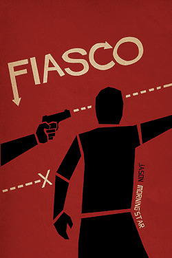

## Prečo by ma malo zaujímať?

Fiasco je pomerne malá GMless hra– kniha formátu A5 by sa dala zosumarizovať na 4 nabité strany a hra trvá najviac tri hodinky. Napriek tomu po vydaní prevalcovala rebríčky RPGGeek.com a dodnes sa drží na prvých miestach.

Hra si berie to najlepšie z RPG a Larpov a mieša ich spôsobom, ktorý sa môže zdať dlhoročnému hráčovi zvláštny. No funguje dokonale. Je to práve potreba prepólovať z klasického družinového hrania reagujúceho na Pána hry, prečo sa Fiasco teší najväčšej obľube pri indie hráčoch a nováčikoch. Práve na rôznych otvorených hraniach s úplnými nováčikmi prináša najlepšie výsledky. Obrovský kontrast medzi väčšinou zdieľanou predstavou o „divnej zábave pre divných ľudí“ a sviežou, rýchlou, dejom nabitou hrou je to, čo Fiasco stavia takmer až na úroveň doskových hier a ponúka isté možnosti masovejšieho hrania.

## Ako to funguje?

### Fiasco + Fiasco Companion

Jason Morningstar, Bully Pulpit Games

- [Stránka hry](http://www.bullypulpitgames.com/games/fiasco/)

Na začiatok vám hra nageneruje kostru príbehu. Za pomoci poolu kociek si z playsetu – konkrétneho herného prostredia – navyberáte vzťahy medzi postavami, nadstavíte ich motivácie a určité pár detailov v prostredí. Hráči si striedajú scény, v ktorých vytvárajú konflikt a posúvajú ním hru dopredu. Hra nestojí na vyhodnocovaní situácií. Po vytvorení schémy hry sa hráči striedajú v odohrávaní scén. Môžu sa rozhodnúť, či budú mať kontrolu nad vytvorením scény, alebo určením jej výsledku – druhé z dvojice obstarajú hráči okolo stola. Keď sa scéna logicky blíži ku koncu, vyhodnotí sa, či pre postavu skončila dobre. Po polovici hry prichádza zvrat a na konci hra vyhodnotí, ako sa komu darilo a ako teda skončil. Dôležité na tomto prístupe je, že každá scéna je poháňaná konfliktom. Bez konfliktu sa nedá vyhodnotiť, ako scéna dopadla a holé rozprávanie by tiež bola dosť nuda.

## Prečo to funguje?

- __Postavy sú definované sieťou vzťahov.__ Postava nestojí vo svojom svete izolovaná s vlastnou históriou. Naopak, jediná história postáv vyplýva z kontextu vzťahov, ktoré sa jej dotýkajú. Každý má definované dva vzťahy, vďaka ktorým má páky na ostatné postavy.
- __Postavy si idú po krku.__ Na sieť vzťahov sa nalepia ciele postáv, ktoré dávajú hráčom agendu. Veľké ciele. Nikdy ale nejdú rovnakým smerom a skôr či neskôr urýchľujú konflikt medzi postavami. Nejde o žiadne zákernosti, konflikt je prítomný od začiatku otvorene a základná herná mechanika stojí práve na konfrontácíi.
- Mnoho postáv so zložitými vzťahmi a odporujúcimi si potrebami vytvára skvelú ponorku a s každým vyriešeným problémom pribudnú tri nové. Fiasco nie je určené na kampane, takže strata postáv nie je problém. __Od začiatku je jasné, že postavy budú trpieť.__ Možno umrú. Navyše je skvelý pocit môcť beztrestne zavariť vlastnej postave a baviť sa na tom, ako sa jej všetko vymyká z rúk.

__Toto všetko znamená obrovskú plasticitu.__ Každý niekoho pozná a každý niečo chce. V porovnaní s neuveriteľnou skupinkou dobrodruhov sa takýto štýl hry omnoho viac blíži bežnému životu či seriálom. Spolu s jasne definovaným smerovaním hry je potom pre hráčov omnoho ľahšie uchopiť hru. Pri jej prvom opise je ostatne najjednoduchšie prirovnať ju k niektorému z filmov bratov Cohenovcov – veľa postáv s komplikovanými osobnými vzťahmi, obrovskými ambíciami, ktoré všetko pokazia a ak sú na konci hry v base, sú na tom vlastne ešte dobre.

## Ako hrať lepšie?

Počas mnohých otvorených hier sa mi priebežne menil pohľad na hru, videl som mnoho iných hier zvonka a postupne som vydestiloval pár rád, ako mať z Fiasca lepší zážitok. Môj pohľad sa samozrejme môže znova zmeniť, ale tieto princípy už používam viac-menej stále. Pri predvádzaní hry je dobré na ne myslieť, väčšinou zlepšia hráčom prvý kontakt s hrou.

- Ak idete hru predsstavovať ostatným, určite si __prečítajte pravidlá__. A hneď po nich rozširujúci Companion. A potom znova. Áno, hra sa dá odovzdávať ústne, playsety sú voľne stiahnuteľné z oficiálnych stránok, ale... Ale knihy sú písané veľmi obsiahlo a vysvetľujú nie ani tak ako vyzerajú mechaniky, ale prečo tak vyzerajú. Prvá kniha vysvetlí princípy, Companion priblíži, prečo mechaniky vyzerajú práve takto. Šťavnaté čítanie.
- __Nechajte všetko na náhodu.__ Nie je vôbec treba zasahovať do výroby schémy, náhodný generátor si s tým poradí. Vyžeňte to do ďalšieho extrému a vzťahy rozdávajte okolo stola tiež skôr náhodne. Hre to prospieva a vždy to nakoniec dáva zmysel.
- __Dialóg.__ Možno najdôležitejší princíp zo všetkých. Hra stojí na konflikte a najlepší spôsob, ako ho vytvoriť je použiť dialóg. Ak si začne každý monológom rozprávať, čo robí, hru to pomerne rýchlo zabije. Radšej vytvorte konflikt medzi postavami a ustite ich do konfrontácie. Hádajte sa, snažte sa jeden druhého o niečom presvedčiť, niečo od neho záskať. Je to predsa hra vzťahov a ambícií.
- __Hrajte na ponorke.__ Polárna základňa či zaoceánsky parník sú skvelé prostredia. Nedovolia hráčom zbytočne sa rozťahovať do šírky, ohraničený priestor a možnosti znamenajú, že sa budú dostávať viac a viac do konfliktov.
- __Berte si bezvýznamné postavy.__ Ak to môžete ovplivniť, je dobré, ak si ako facilitátor vezmete menej významné postavy – bezdomovec čierny pasažier na parníku, podržtaška významného vedca na polárnej stanici a tak podobne. Nechávate tak viac rozhodnutí a spotligtu na ostatných hráčoch, príbeh sa bude točiť okolo nováčikov a budú mať z hry lepší dojem, keď budú mať pocit, že ich postava je vo svojom svete dôležitá.
- __Nevarte z vody.__ Veľký problém Fiasca je väčšinou prvá scéna. Vytvoríte schému, viete, čo chcete hrať, ale neviete, ako začať, trochu to stojí na vode. Pomôžte si s mechanikou z Penny for my thoughts: pre prvú scénu vezmite vygenerovaný objekt a správajte sa k nemu ako k triggeru. Jeden hráč si vezme objekt a každý ďalší sa ho spýta nejakú otázku. Jeho úlohou je odpovedať „áno, a...“

> Prostredie: nočný klub – „mám násilné: pištoľ s jediným nábojom“
>
> „ten náboj si šetríš pre niekoho konkrétneho?“ – „áno, prisahal som pomstu vrahovi mojej matky“
>
> „našiel si ho?“ – „áno, je stále na slobode, zistil som, že je to niekto z vedenia tohto klubu“
>
> „prišiel si ho dnes v noci konfrontovať?“ – „áno, vchádzam do baru s pištoľou ukrytou v kabáte a idem dozadu za majiteľom“ (otočí sa na hráča majiteľa a začne s ním viesť dialóg, v ktorom sú konfliktom informácie vedúce k spoľahlivej identifikácii vraha)

## Otvorené hrania

Je mnoho hier, ktoré si rád zahrám, ale zatiaľ len jedna, ktorú predkladám začiatočníkom, ktorí nikdy nič nehrali. Obrovská prístupnosť Fiasca z neho robí perfektného kandidáta na prelomenie stigiem okolo hrania RPG. Keď nemáte čo dve hodinky robiť s partou známych, vytiahnite kocky a vyrobte si vlastný cohenovský film.
