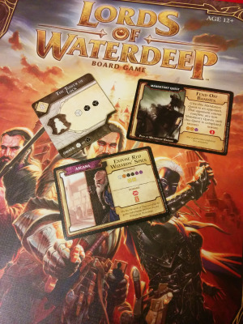
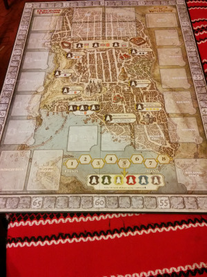
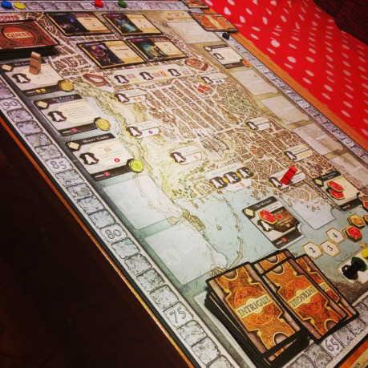

Pamätáte si intro k [Eye of Beholder I](https://www.youtube.com/watch?v=sQ46vwRXTtY)? (Ani ja nie.) Maskovaní _Páni hlbočiny_ (ktorí si neželajú byť menovaní) sedia kdesi vo veži a cez prostredníkov regrútujú hrdinov mesta Waterdeep, najväčšieho a naslávnejšieho klenotu Forgotten Realms, aby riešili veci, s ktorými sa im nechce zapodievať. A samozrejme, keďže ide nielen o dobro mesta, ale aj o súťaživosť a prestíž, z času na čas sa hodí medzi sebou intrigovať či riešiť problémy neobvyklými spôsobmi.

Práve takýmito Pánmi sa môžu stať hráči stolovej hry od Wizards of the Coast.

A úprimne je treba povedať, že tento kúsok sa im naozaj podaril.

## Ako sa to hrá?

Wizards of the Coast sa so značkou Dungeons and Dragons už dávnejšie odpútala od rolových hier a sveta miniatúr. Stolových hier pod touto vlajkou je [dnes už osem](http://dnd.wizards.com/products/tabletop-games/board-games/).

LoW je určená pre dvoch až piatich hráčov (zhruba od 12 rokov) a zabaví vás na približne dve hodiny.

V krabici nájdete toho pomerne dosť: dostanete predovšetkým veľký plán mesta (je to Waterdeep ako ho poznáte), pätice figúrok v piatich farbách, priehrštia kociek v iných pestrých farbách, dva druhy peňazí, tri druhy kariet a rozsiahly návod. Napriek tomu, že prvé rozkladanie bude trvať možno aj päť minút, je hra je omnoho jednoduchšia.

Hra, napriek očakávaniam, nie je spoločný boj proti mape a la Arkham Horror. Každý hráč hrá sám za seba a cieľom nahonobiť čo najväčší počet bodov.

Ako získavate body? Tým, že plníte questy! Ale, keďže ste naozaj zvrchovaní Páni mesta, nerobíte to sami (za mladých liet ste sa predsa namakali už dosť), ale máte svojich agentov, ktorých rozosielate po prístavoch, krčmách či iných budovách mesta, aby vám na to zohnali hrdinov. Multi-level dungeoneering v praxi! Ak zoženiete dostatok hrdinov a peňazí, quest sa splní za čo dostanete bodíky a cyklus sa opakuje.

Samozrejme, nie je to až také priamočiare (to by bolo nudné, však?).

Na získavanie bodov existuje viacero možností a odporúčanú cestu vám určí vyžrebovaný Lord zo začiatku hry. Každý quest má svoj typ, ktorý zodpovedá klasickým štyrom povolaniam: áno, sú to bojovnícke, kúzelnícke, kňazské a zlodejské. Každý Lord má svoje obľúbené typy, za ktoré získate na konci hry extra dávku bodov.

Plnenie questov je podobne priamočiare: karta questu má popisnú úlohu pre pobavenie D&Dčkarov („Špionáž v dome svetla!“), požiadavky („Najmi troch bojovníkov, dvoch zlodejov a dva peniaze“) a výslednú odmenu („Dostaneš 6 bodov a 6 peňazí ako bonus“).

## Waterdeep žije, Waterdeep rastie

Samozrejme, netreba zabúdať na spoločný cieľ rozvíjania mesta, pretože čím väčšie mesto, tým viac miest na zháňanie hrdinov a peňazí a odhaľovanie questov! Počiatočné budovy vám vychrlia jedného či dvoch hrdinov (napríklad dvoch bojovníkov alebo jedného kňaza), ktorí sú reprezentovaní kockami príslušnej farby; pridelia kartu questu, poskytnú peniaze, umožňujú stavať ďalšie budovy, či umožňujú intrigovať.

Stavať budovy je naozaj dôležité a to hlavne v hre pre viacerých hráčov: v jednej budove môže byť v jednom kole len jeden regrútujúci agent a teda sa môže stať, že pri malom počte budov vo vašom kole už nebudete môcť získať napríklad mágov a tým nesplniť quest a ... ostatní vás predbehnú.

Popri tom nesú budovy v sebe vlastnosti podobné hre Monopoly: ak do vašej budovy príde agent cudzieho Lorda, dostanete za to drobnú výhodu.

### Intrigovať?

Intrigy sú polovica zábavy v Lordoch, koniec koncov, nedávali by to do podnadpisu hry len tak pre nič-za nič. Najväčším semenišťom intríg je samozrejme prístav. Ak doň pošlete agenta, zahráte jednu z intrigových kariet a môžete robiť veci poza bučky: typicky získavať nečakaných hrdinov alebo peniaze, či dávať protihráčom povinné questy. LoW však nie sú úplne demoralizujúca hra: v jadre sa drží filozofie eurohier a tak temer neexistuje intriga, ktorá by priamo obrala protihráča o zdroje a tým vyvolala jeho frustráciu.

## Tempo hry a balans

Hra sa deje v rýchlych ťahoch a kolách: vždy, keď ste na ťahu, pošlete agenta, naženiete k sebe questuchtivých hrdinov, alebo zhrabnete peniaze, či postavíte budovu a ak splníte požiadavky, váš quest je hotový. I pri dlhšom rozmýšľaní to nezaberie viac než pol minúty.

Už po dvoch-troch hrách sa odhalia elegantné a priamočiare zákonitosti v hre, ktoré však stále umožňujú v každej hre kombinovať a taktizovať a zameriavať sa na rozličné spôsoby získavania bodov. Môžete ich zbierať cez obľúbené questy vášho Lorda, môžete spustiť mód bratislavského developera, ktorý ostošesť stavia budovy a ryžuje na cudzích agentoch prichádzajúcich doň, môžete skúsiť vyhrať cez peniaze, alebo sa môžete spoľahnúť na to, že získate quest, ktorý vám poskytne dramatickú výhodu v budúcnosti hry. I napriek širokej palete questov, budov a intríg, je hra vybalansovaná a je dosť možné, že ak narazíte na nejakú logickú dieru, je už zrejme vychytaná v oficiálnom FAQ.

Poteší aj fakt, že dobra hrania sa s počtom hráčov nepredlžuje. Čím viac hráčov, tým menej agentov môže každý z nich vyslať v každom kole, a desaťkolový limit hrania dáva pomerne jasnú predstavu, ako dlho hra ešte potrvá.

## Prostredie a setting

Veľkou výhodou je zameranie sa na rokmi overené prostredie D&D a najznámejšieho sveta Waterdeepu. Harcovníkov prilákate na mapu, Harperov, fotku beholdera, či na motivačné texty na kartičkách. Je však faktom, že hra je hodinový stroj, ktorý Wizardi obalili vlastnou frančízou. Áno, je to podobné ako súboje v starých edíciách D&D: ak odnímete akékoľvek opisy, hrdinov, či príchuť sveta, matematický systém a princíp hry bude fungovať i pri rýdzom hádzaní kociek. To, čo je u D&D vysoko diskutabilné, je v LoW prakticky výhodou: nováčikovia si vystačia s tým, že obsadzovaním budov získavajú pestré kocky a peniaze, za ktoré získavajú víťazné body, a zvyšok je príjemným bonusom.

Ďalšia podobná „disociácia“ platí aj pri interakcii medzi hráčmi: LoW sa dajú hrať takmer autisticky, pretože medzihráčske debaty či interakcie takmer neexistujú: každý si ide svojou cestou, hromadí svoje zdroje. Pri dvoch hráčoch je to myšlienkovou náročnosťou až „casual“ hra, ak opomeniete nutnosť veľkého stola a 5 minút na vybaľovanie a rozbaľovanie.

## Záver

Lords of Waterdeep sa Wizardom naozaj podarili. Skvelý ťah, kde dobre postavené jadro hry v hábe D&D, primeraná doba hrania a rozumná náročnosť hry, tomu dáva skvelú alternatívnu náplň nielen pre situácie, keď sa vám náhodou nebude chcieť vyťahovať denníky postáv, alebo pre situácie, keď chcete podvratným spôsobom nalákať ľudí zo sveta stoloviek do sveta D&D.

K negatívam azda patrí zbytočná zdanlivá úvodná prekomplikovanosť: niektoré komponenty by fungovali aj v menšom počte a deväť farieb komponentov s dvoma odlišnými významami na úvod pochopiteľnosti nepomáhajú: ešteže na poslednej strane pravidiel je rýchly štart. Je to nevýhoda vybalansovaná vonkajším prevedením: za 40€ / 1200 Kč dostanete množstvo „cingrlátiek“, ale pri znovuhrateľosti sa to vynahradí.
