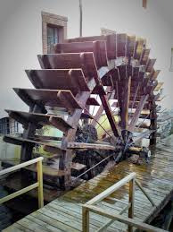
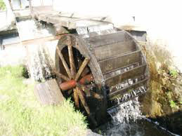
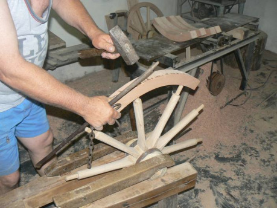
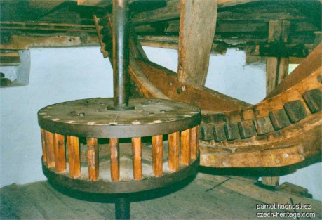
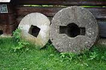
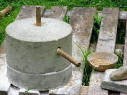
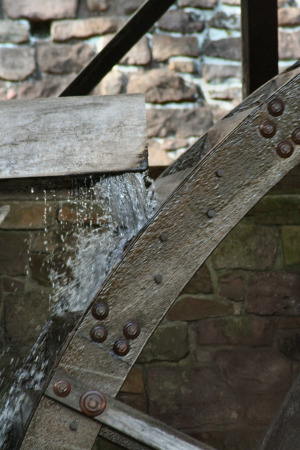
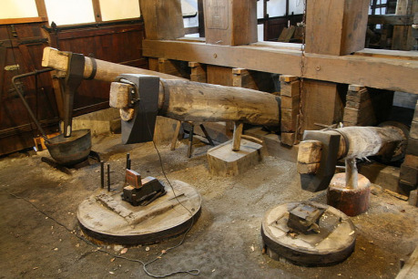
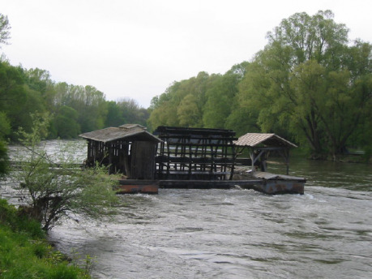

## I. Technický vynález

Vodní mlýn je dnes chápán jako starožitná rekvizita a oblíbená ozdoba mnoha pohádek. Ve skutečnosti patří k nejmocnějším vynálezům v dějinách. Je to jeden z prvních opravdových strojů, kde sloužilo něco jiného než lidská síla, případně síla zvířat.

Představovat ten úplně základní prvek, vodní kolo, asi není příliš třeba. Známější jsou asi kola na „spodní“ vodu, používaná na velkých řekách:

Ve skutečnosti byla asi častější varianta na „horní“ vodu, používaná na menších potocích, kde se kolo točí přesně obráceně:

Kolo na horní vodu má z fyzikálního hlediska podstatně lepší účinnost, ale protože na velké řece je energie přebytek, bylo to nakonec pro účely mlýna dost jedno a užívalo se oboje podle situace.

Jisté je, že takové vodní kolo není vynález středověký, nýbrž starověký. Už někdy okolo 3000 let před Kristem užívali podobné stroje Egypťané a Sumerové jako pumpy k odvodňování, či naopak zavlažování polí. Vypadalo jako kolo s připojenými kbelíky a poháněno bylo samotnou tekoucí vodou. V mnohých filmech je taková věc stále k vidění.

Antika mlýn vylepšila o další zásadní prvek – převod palečnými koly, která mění směr horizontální osy stroje na vertikální. Tady se zastavme, protože stroj se tímto stává opravdu strojem; nejenže má na lidské síle nezávislý motor, ale navíc má uvnitř nějaká ta kolečka. Pravé ozubené kolo je velmi složitý technický tvar, který vyžaduje perfektní zvládnutí mnoha technologií, a utkala se s tím až pozdní renesance. Středověké řešení je mnohem primitivnější, ale funguje taky. Zřejmě úzce souvisí s jiným soudobým technickým prvkem, vozem s loukoťovými koly.

Pokud na kole není obruč, lze prostě vytvořit prvotní převod dvěma koly kolmo na sebe, která se do sebe zakusují krátkými loukotěmi, čili „palci“ – odtud název palečné kolo. Vyspělejší technický model podobného a donedávna užívaného převodu s kombinací klecového a palečného kola vidíme na obrázku.

No a konečně, třetí a poslední základní částí jsou mlýnská kola čili žernovy:

Převod síly do svislého směru v předchozím palečném soukolí je velmi důležitý nejen kvůli pohodlí, ale i proto, že žernovy na sobě spočívají prostě díky gravitaci. Dnes bychom ten horní – s unášecím klíčovým nebo hranatým výřezem – asi nazvali rotor a spodní stator, ale tehdy se jim říkalo běhoun a spodek. Na svislé ose postupně vznikala řada dalších detailů, sloužících co nejsnadnějšímu zvedání běhounu, případně přesné regulaci jemnosti mletí.

Obdivuhodné je zejména to, že všechny podstatné součásti lze vyrobit ze dřeva a kamene a vše zvládne šikovný středověký řemeslník s poměrně minimálním vybavením – pilou, sekerou, dlátem, hoblíkem, kladivem a sekáčem na kamení.

Výsledný vodní mlýn má zhruba stonásobný výkon proti ručnímu mlýnku, který se užíval někdy od pravěku až hluboko do středověku.

Ohromný rozdíl výkonu není dán jen velikostí žernovů a množstvím současně mletého zrní, ale hlavně vodním pohonem – vodní mlýn se nikdy neunaví. Důsledek je zřejmý; vodní mlýn má jasnou souvislost s rozsahem zemědělství v daném místě, se spotřebou obilí a konečně i s množstvím obyvatel.

## II. Exkurs – nástup vodních mlýnů ve středověku u nás

O mlýnech v antice se lze spíš jen dohadovat; zachovaly se v písemných zmínkách. Je skoro jisté, že s rozpadem římské infrastruktury se na mnoha místech vytratily i mlýny. Zřejmě ne úplně; podle všeho se mohly nějaké dochovat v některých hodně vyspělých místech, třeba v severní Itálii nebo jižní Francii. Zprvu nenápadný návrat mlýnů začal někdy v době Karla Velikého.

Pro ilustraci, použitelnou i pro jiné země nebo města, s příslušným časovým posunem vpřed nebo vzad a i pro vaše zcela vymyšlené světy, tu uvedu podrobnější přehled nástupu mlýnů v Praze.

První doložený mlýn v našich zemích byl v Úněticích u Prahy, kde kanovník Zbyhněv založil mezi lety 1125–1140 kostel a při té příležitosti se tu zmiňuje mlýn. Spojitost vzdělaných mnichů a mlýnů je zpočátku zjevná. Lze tvrdit, že mají na zavádění nové technologie drtivý podíl. V Úněticích šlo velmi praděpodobně o malý potoční mlýn zvaný drnčák na horní vodu. Zdá se, že podobné potoční mlýny byly zřejmě zpočátku početnější. Může to souviset buď se složitější a dražší stavbou náhonů, nebo také s respektem k povodním na velkých řekách.

Roku 1140 měli mlýn mniši na Sázavě. To už mohl být mlýn větší.

Ve 12. století měli mlýn také mniši na Břevnově. A i zde je pravděpodobné, že nebyl na Vltavě, ale jen na Brusnici, nejspíš někde v místě dnešních Chotkových sadů.

Podobný prastarý exemplář se objevil možná ještě ve stejném století na opačné straně Na Struze, kde tekl menší přítok Vltavy, dnes ukrytý v kanalizaci.

Johanité, kteří se u nás zjevili u vzniku kamenného mostu okolo roku 1164, jsou rovněž podezřelí z užívání mlýnu. Bylo by s podivem, kdyby jejich komenda nevyužila řeku, kterou měla přímo u nosu. S jistou dávkou odvahy můžeme ztotožnit pozdější mlýn „Štěpánovský“, viditelný dodnes z Karlova mostu, s místem, kde mohl stát mlýn už od 12. století. O přirozený náhon se tu postarala příroda vznikem ostrova Kampy. Z logiky věci musí jít od začátku o mlýn na spodní vodu.

Stejný případ, o něco pozdější, ale zato doložený, je mlýn, který náležel Chotěšovskému klášteru. Ten vlastnil na malostranském břehu řeky pozemky a prokazatelně mu patřil mlýn „Huť“ už ve 13. století. Tento mlýn na Kampě tedy opět stojí dodnes na původním místě, i když určitě ne v původní podobě.

Mlýny na Čertovce dostaly více energie se vznikem jezů na druhé straně ostrova, zřejmě někdy v polovině 13. století, po vzniku hradeb. Středověké jezy byly zřejmě zpočátku podstatně nižší než dnešní a těžko hádat, zda byly již tehdy dva, nebo napřed jenom jeden. Rozhodně byl jejich vznik klíčový předpoklad pro mlýny v hlavním korytě. Na opačné straně Kampy mohly po vytvoření dalšího náhonu začít vznikat další stavby v místech, kde jsou dnes „Sovovy“ mlýny, a také proti proudu, kde jsou u vodárenské věže pozdější „Jezuitské“ mlýny, poblíž malého kláštera u kostela sv. Filipa a Jakuba na dnešním Arbesově náměstí.

Přejdeme přesně na opačnou stranu Vltavy. Křížovníci Božího hrobu na Zderaze jsou další nadějný případ. Blízkost „Šítkovských“ mlýnů, čili dnešního Mánesa, je tak evidentní, že ji nelze přehlédnout. Písemné zprávy mluví o mlýnech až 1434, ale to je už složitý systém s lázněmi a 4 koly. Jedna mapa dějin ukazuje mlýn na tomto místě před rokem 1250 a lze to mít za důvodné. I zde to souvisí jasně se vznikem jezů. A podobně jako na Kampě, náhon mohl vzniknout zprvu stejně přirozeně. Jeho zárodkem byl dnešní ostrov Žofín.

O něco málo níže po proudu ležely „Šerlinkovské“ mlýny. Uváděny jsou již 1434 a v té době patřily také Zderazu. Ze zprávy z r. 1340 o mírách a cejchování víme, že existovaly parametry sloužící k tomu, aby horní mlýn nebral vodu dolnímu: byla to zřejmě dost častá situace, kdy jsou mlýny v řadě za sebou. To by potvrzovalo teorii o náhonu a jezu, společném pro oba mlýny, nejméně v této době.

Dominikáni, templáři, křížovníci; směsice klášterů ze 13. století se usadila přímo u mostu a trochu výš, u sv. Jana na Zábradlí. I zde jsou mlýny zmíněny již 1347 („Šejdovna“, „Bouda“) a nejspíš budou ještě starší. Kromě toho je v těchto místech druhý jez, dost možná také ze 13. století. To umožňovalo ve zdejší oblasti asi úplně největší soustavu mlýnů. K roku 1376 se mluví dokonce o „10 mlýnech u sv. Jana“. Pozůstatkem této soustavy je dnes velikánská stavba Novotného lávky.

Do této skupiny lze zahrnout i mlýn, uváděný před rokem 1250 v místech nad sv. Janem, což dává spojitost s Boršovem rodu Hrabišiců. Bohatý investor využil prodloužení náhonu k předchozím velkým mlýnům.

Konečně není vyloučeno, že v nějaké další fázi vývoje – asi až po roce 1400 – byl náhon od Zderazu a prvního jezu protažen souvisle až ke kamennému mostu, takže všechny mlýny od dnešního Šítkovského jezu až kus za kamenný most byly nakonec jediným systémem.

Vedle zmnožování mlýnů do řetězců na stejném náhonu se již ve 13. století zjevují i mlýny s více koly. Zpráva z r. 1276 uvádí v Hranicích na Moravě mlýn se 4 koly, zpráva z Řečic z roku 1295 dokonce 7 kol. V Praze lze očekávat to samé, zejména právě u svatého Jana.

Další veliký hrozen mlýnů vznikal dál po proudu, na Poříčí. První příčinou byla zřejmě prastará německá osada. Poblíž se nacházela složitá soustava ostrovů a brodů. Prokázané jsou (sice až v době baroka) „Helmovy“ mlýny, ale nejspíš budou také podstatně starší. Dalšími vlastníky mlýna byli také klarisky a minorité Na Františku; v souvislosti s nimi máme jasně doložené takzvané „Nové“ mlýny. Název nese nábřežní ulice dodnes.

Suma sumárum – ve 12. století lze předpokládat v Praze do pěti mlýnů, s jasnou převahou těch potočních, za Přemysla Otakara okolo 10 mlýnů a v lucemburské době prý měla Praha 20 mlýnů. V té době už existovaly zmíněné „vícekolové“ systémy, což podporuje závěr o velkém počtu kol. A v době husitské bude ještě nutno podstatně přidat.

K tomu ještě nepočítáme takzvané „škrtnice“ na zakotvených člunech, kterých byly v Praze desítky, obvykle v místech vedle velkých pobřežních mlýnů.

## III. Průmyslová revoluce mlýnů

Podrobný popis Prahy jakožto velkého středověkého města doslova nacpaného mlýny a technickými zařízeními dává pro mnoho lidí docela překvapující obraz. Rozhodně to není nic moc poklidně zemědělského. Postupem času tu začíná řádit opravdový průmysl, soustředěný těsně kolem řeky.

Je dokonce pravděpodobné, že právě mlýny jsou jedním z důvodů vzniku středověkých měst. V místech, kde se přirozeně soustřeďovala všechna vyrobená mouka a další produkty, kde se s nimi také obchodovalo a kde bylo nutno překračovat řeku, bylo také ideální místo ke zpracování suroviny ve velkém. Mlýn je přirozené místo, kde se lidé musí sejít, postavit se do řady a při tom spolu mluví, vyprávějí a obchodují. Nikoli náhodou se sem také stahovaly prostitutky (což vedlo svatého Bernarda k výzvám, aby prý místní mlýny v Burgundsku mniši zbořili). A snadno také najdeme souvislost s další vedlejší činností mlýna – s lázněmi, které také potřebují vodu a vodní stavby. V Praze máme dva takové jasné případy už ve středověku.

Rozsah této technické revoluce je třeba dokreslit tím, že mlýn je prototyp celé řady strojů dalších. Zdaleka ne všechny mlýny vyráběly mouku. Jednou nalezený princip vodního kola a palečného převodu fungoval univerzálně. Stačilo pouze vymyslet, jak namísto převodu palečným kolem s ním nadzdvihovat velké kladivo, a tak vznikl hamr. Stalo se tak již ve 13. století a proměnilo to výrobu železa stejně drasticky, jako obilný mlýn potravinářství. Železo tím pomalu přestávalo být vzácnou surovinou, kterou bylo nutno pracně a ručně vykovávat z rudy. Hamr měl účinnost stejně drasticky vyšší, jako mlýn proti ručnímu mlýnku. Výroba železa se pomalu měnila v průmysl. A také bylo možné železo ve velkém zpracovat do polotovarů, například na plechy. Je otázka, zda by celoplátový rytíř, pro laiky symbol středověku, vůbec vznikl bez tohoto podstatného technického vylepšení.

Drtit silou vodního mlýna šlo také již vykopanou rudu jakéhokoli kovu. Le Goff mluví o drcení železné rudy až okolo roku 1300. O něco dříve byly železné mlýny v Katalánsku a Švédsku, první švédský je již z r. 1197.

Podobný převod síly má strojní pila, kterou nakreslil Villard de Honnecourt ve slavném skicáři v roce r. 1240. Ta se týká bezesporu i našich zemí a zřejmě také 13. století. Spotřeba technického dřeva na stavby všeho druhu zřejmě v té době vyletěla vzhůru stejně výrazně jako spotřeba železa. Do té doby se dřevo muselo otesávat sekerou, ruční pila byla vhodná jenom ke krácení dřeva. Obyčejné prkno, které dnes vnímáme jako úplně základní podobu dřevěné suroviny, bylo do příchodu vodní pily také dost nesamozřejmá věc, kterou bylo dost pracné vytvořit. Opět je k zamyšlení, do jaké míry vděčí ohromné krovy a lešení kaderál za svůj vznik mlýnům.

Na stejném principu je založena také valcha na vlněné sukno, o které mluví Le Goff taktéž ve 13. století. Ve Francii se moc nerozšířila, v Německu byla zjištěna poprvé 1223 ve Špýru, ale zato v Anglii jich byla brzy záplava a měla neméně revoluční důsledky pro místní textilní průmysl.

Další podobný soudobý stroj je holendr na trhání hadrů pro výrobu papíru. Máme doklady o papírnách v Jativě ve Španělsku r. 1238, Fabrianu v Itálii r. 1268, Troyes 1338 a Norimberku 1390. Důsledky výrazného zlevnění papíru jsou doslova nedozírné; možná tato nenápadná změna měla na svědomí značnou část toho, co se přisuzuje až pozdějšímu knihtisku.

Z Holandska je známa vodní pumpa, která byla vlastně mnohem starší než mlýn, ale do Evropy se vrátila teprve ve vrcholném středověku. S ohledem na místní terén tu ovšem jasně vyhrávaly větrné stroje.

Le Goff mluví též o brusírnách a Crichton zmiňuje míchání malty, lisování oleje a kroucení provazů – k tomu jsem již nikde doklady nenašel, ale není důvod tomu nevěřit. Když se nad tím zamyslíme, napadne nás ještě řada dalších využití – například měchy (kovářské nebo sklářské), čerpadla prvotních vodáren, drcení střelného prachu atd.

## IV. Právní a ekonomický systém.

Mlýn měl vliv i na proměnu ekonomiky a práva. Od samého začátku to byla drahá, složitá a přitom výnosná investice. O složitých vícekolových stavbách a soustavách náhonů a plavebních komor to pochopitelně platí ještě výrazněji. V naprosté většině případů bohatý investor (klášter, šlechtic, král, město) postavil mlýn a mlynáře zaměstnal, což mělo různé formy:

Jiná klasifikace mlynářů je podle významu a velikosti jejich mlýna:

Konečně si větší mlýn vytvořil celou soustavu zaměstnanců, jako jakýsi pravzor továrny. V čele stál mlynář, jak již řečeno – zřejmě mlynář poříční či alespoň podrybní. Poznamenejme, že mlynářství bylo z povahy věci velmi výnosné řemeslo díky svojí poloprůmyslové povaze. Není náhoda, že mlynář bývá v pohádkách obvykle bohatý a také i vzdělaný, protože měl na podobné věci čas a měl k nim možnost.

Podřízenými mlynáře byli tovaryši. V jejich čele byl stárek, služebně nejstarší, a pod ním případně další mládci. Stárek zastupoval mlynáře. Lze předpokládat, že v takovém Šítkovském mlýně se čtyřmi koly v době husitské se už mlynář práce téměř nedotkl. Stejně tak mlynář, majitel mlýna, posunul stárka vlastně do role náchlebního mlynáře.

Také existovali tovaryši, označovaní podle speciální práce, zřejmě také ve větším mlýně. Důležitý byl ten, který pracoval v šejdovně a rozděloval mouku – šejdíř. Jak na jeho práci hleděli farmáři, ukazuje fakt, že se stal synonymem pro podvodníka a čachráře. Podobný specialista byl pilař, který rozděloval dřevo. Mleči mleli místo mouky slad, což souvisí s rozvojem pivovarů. Taktéž lze najít krupaře. Sekerník byl člověk udržující technická zařízení mlýna v chodu (jinak to musel dělat mlynář sám).

Pod tovaryši – tedy řádnými dělníky – lze najít ještě učedníky, čili takzvané prášky.

## V. Mlýn jako začátek konce středověku

„Sarumanovi to myslí v kovu a v kolečkách. O věci, které rostou, se stará jen tehdy, když je může k něčemu využít,“ říká otráveně Stromovous v Pánovi prstenů. Tato myšlenka shrnuje dokonale nejen to, co měl Stromovous proti Sarumanovi, ale hlavně to, co měl Tolkien proti modernímu průmyslu. A zcela správně tušil, že podobné nápady jsou daleko staršího původu, nejméně renesančního. Z mnoha Tolkienových děl prosvítá vědomí, že ta ozubená kolečka nakonec jeho barevné a heroické světy semelou a rozdrtí na prach.

Je dost zřejmé, že vodní mlýn jakožto archetypální stroj je právě prvním krokem tímto směrem. Má jasnou podobu s mnoha pozdějšími stroji z doby průmyslové revoluce – jsou tu kola a hřídele, převody, „motor“ a „pracovní část“. Určitě to není náhoda.

Přesně podobné myšlenky mne vedly kdysi k napsání Temného rytíře, povídky, která stojí časově na úplném konci mých středověkých vyprávění, někdy v roce 1240. Archetypání strašidlo je poraženo v souboji s dávným průmyslem mlýnů, hrdinu vzdělance nahrazuje mazaný podnikatel, který v tom umí chodit, a i udatný rytíř se tak nějak přizpůsobuje tomu novému světu, kde jde hlavně o majetek, právníky, soudy, úvěry a podobné moderní věci.

Pro mnoho lidí v roce 1240 středověk zdaleka nekončí, nýbrž spíše vrcholí. Lze s tím souhlasit, ale začátek konce se tu podle mne už začíná zřetelně rýsovat. Argonantův svět, kde je vznikající civilizace ještě zábavným vynálezem, tady někde pomalu končí. Nadále už civilizace měst funguje samostatně, má svoji vlastní sílu a nikdo to nezastaví. Podobně jako se romantika dávných mýtů a rytířských písní postupně mění v zábavná vyprávění světa Dekameronu.

Myslete na to, pokud nějaká ta kolečka do svého světa vpustíte. V několika málo exemplářích působí roztomile a zábavně, ale mají nečekanou sílu a umí se také se řetězově množit a měnit svět okolo v nečekaných směrech.
