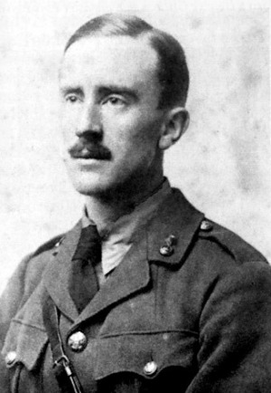

Před rokem jsme začali připravovat hru ze Středozemě a to mě donutilo, abych si přečetl znovu všechny knihy a zamyslel se nad tématy, které se v Tolkienově díle nacházejí, abych se pokusil vystavět svět a příběh s podobnou atmosférou. Stálým a výrazným tématem, jež se v knihách o Středozemi objevuje a na které jsem narážel znovu a znovu, je „odvaha tváří v tvář neodvratné porážce“. Hrdinové nemají šanci uspět nebo je jejich naděje naprosto mizivá.

„Vracíme se tedy znovu ke zničení Prstenu,“ pronesl Erestor, „a přece nejsme o nic blíž. Máme sílu nalézt Oheň, v němž byl vyroben? To je cesta zoufalství. Nebo bláznovství, řekl bych, kdyby mi to Elrondova věkovitá moudrost nezakazovala.“

_J. R. R. Tolkien, Společenstvo prstenu, knihadruhá, kapitola druhá – Elrondova rada_

Jak bylo zmíněno výše, Tolkien sám se války zúčastnil a měl možnost zažít její hrůzy na vlastní kůži. Právě tato válečná zkušenost je v knihách cítit tou syrovostí prožitku. Na rozdíl od jiných autorů Tolkien nikdy nepopisuje v bitvách kaskády krve, usekané údy a hlavy…, přestože a právě protože tyto scény měl během zákopových bitev první světové války, zuřivých bojů muže proti muži a bodák na bodák, před sebou a mohl by je popsat jako málokdo jiný. Tolkien se místo toho soustředí na to, co je v těchto scénách důležité – co _doopravdy_ znamená boj, který vypadá beznadějně (vlastně všechny bitvy v Pánovi prstenů i jinde), co znamená smrt krále a otce pro lidi okolo (smrt krále Theodéna), co to znamená být vojákem (Samova úvaha nad mrtvým Jižanem), co to je si uvědomit tu neuvěřitelnou skutečnost, že to kolem se opravdu děje (Samova úvaha pod schody Cirith Ungol; už v tomto místě uvažuje o tom, jaká bude jednou Píseň o Frodovi a zda vůbec vznikne).

Vlastně celý jeho vyjadřovací jazyk je velice prostý a až lakonický. Jakkoli výsledek působí velice „výpravně“ a „majestátně“, tak je tohoto efektu dosaženo obsahem, nikoli formou.

„Musíme Saurona dohnat k poslednímu útoku. Musíme vylákat jeho utajené síly, aby vyprázdnil svou zem. Musíme proti němu okamžitě vypochodovat. Musíme ze sebe udělat vnadidlo, i kdyby nás měl sevřít svými čelistmi. (…) Musíme do té léčky vejít s otevřenýma očima a odvahou, ale nedělat si pro sebe velkou naději. Může se totiž snadno stát, že sami zahyneme v kruté bitvě daleko od zemí živých, takže i tehdy, bude-li Barad-dûr svržena, nedožijeme se nového věku. Ale to pokládám za naši povinnost. A lépe tak, než zahynout stejně – jako určitě zahyneme, když zůstaneme sedět – a při umírání vědět, že žádný nový věk nebude.“

_J. R. R. Tolkien, Návrat krále, kniha pátá, kapitola devátá – Poslední rozmluva_

Vlastně všechny příběhy ze Starých časů o elfím a lidském odporu proti Morgothovi jsou příběhy o hrdinské porážce – elfí králové i prostí vojíni konají skutky neuvěřitelné zručnosti a odvahy, ale nemohou zvítězit. Za jednoho zabitého skřeta vyjde z bran Angbandu deset dalších a hrdinové nemají dost síly padlého Valu porazit. Každé jejich vítězství jen oddaluje jejich konečnou porážku.

Tváří v tvář této porážce ale projeví hrdinové odvahu a postaví se osudu. Obětují se pro ostatní, přestože pro ně žádná naděje nezbývá. Taková neohrožená vůle nemožným šancím navzdory je v Tolkienově díle nejvyšším a nejvznešenějším vyjádřením hrdinství. Kromě ovlivnění křesťanskou vírou – J. R. R. Tolkien byl věřící katolík a sebeobětování je v křesťanském učení výrazné téma – čerpal inspiraci i ze starší předkřesťanské, severské a anglosaské literatury. Jak sám píše v knize Netvoři a kritikové, velmi dobrým příkladem je kupříkladu severská legenda o Ragnaröku, konci světa. V ní severští bohové ví, že zahynou v poslední bitvě proti obrům o osud světa, ale přesto se, když zazní roh a nadejde čas, připraví k boji, o kterém vědí, že jej nemohou vyhrát. Tolkien zde cituje Kera: „Bohové jsou na správné straně, přestože to není ta strana, která zvítězí. Vítěznou stranou je Chaos a Nerozum.“

Tom Shippey (autor životopisu o J. R. R. Tolkienovi) zahájil jednou přednášku, ve které řešil právě toto téma odvahy a porážky, zpěvem hymny školy krále Edwarda (kterou on i Tolkien jako děti navštěvovali), kde vyzdvihl slova: „Mnohokrát vítězství je velkolepé! Vítězství stále může být zahanbující.“ Tato slova možná nejlépe vystihují Tolkienovu filozofii, která se promítá v jeho dílech. Tolkien totiž věřil, že „vítězství a porážka nemají co dělat s tím, co je správné a co špatné“ (Tom Shippey: _J. R. R. Tolkien_, str. 150). Hrdinové ze starých dob ví, že stojí na správné straně, a i když nezvítězí, bojují za správnou věc. Ilustruje to pak pěkně i velmi důležitá věta „už i dávných věků / hrdinové pod nebem / vytrvali a bojovali až do konce“ (J. R. R.Tolkien: _Beowulf; nestvůry a kritikové_).

Člověk z těchto vět cítí význam, jaký Tolkien přikládal cti a odvaze. Je v nich obsažena povinnost, která oněm dávným mužům bránila odejít a vzdát se, i když se věc nevyvíjela dobře. _Vytrvání_ je zde chápáno jako největší ctnost. Nejde o to se vrhnout se do beznadějného útoku. To je jistě odvaha, ale často je silně podpořena tím, že takový muž nedokáže příliš odhadnout, co ho čeká. Ale když už to ví, protože v tom boji dostává rány a je to stále horší, tam se teprve objevuje hrdinství. Hrdina je ten, kdo vytrvá až do konce, ať už je jakýkoli. Hrdina je ten, kdo ví, jak špatné to bude, a přesto jde.

„Pak se proti nim vyrojila všechna angbandská vojska, přemostila tok svými mrtvými a obklíčila hithlumský ostatek jako stoupající příliv skálu (…) padl tam Huor zasažen do oka otráveným šípem a všichni udatní muži Hadorovi byli kolem něho zbiti na hromadu. (…) Poslední ze všech stál Húrin sám. Pak odhodil štít a vzal sekeru do obou rukou. Zpívá se, že sekera kouřila černou krví Gothmogovy obří gardy, až ji to spálilo, a pokaždé, když zabil, Húrin zvolal: »Aurë entuluva! Den zase přijde!« Sedmdesátkrát takto vykřikl; nakonec ho však na Morgothův příkaz zajali živého“

_J. R. R. Tolkien, Silmarillion, Quenta Silmarillion,O bitvě páté: Nirnaeth Arnoediad_

Zlatovlasý Huor ví, že zemře v bažině Serech, aby umožnil Turgonovi uniknout z bitvy, ale nezoufá si a hledí smrti vstříc beze strachu. Ne nadarmo píše Tolkien, že „ze všech válečných činů, které Otcové lidí vykonali pro Eldar, je poslední boj dor-lóminských mužů nejslavnější.“ Pokud kdy byla porážka velkolepá, pak to byla právě tato.

## Dva druhy odvahy

Tolkien také spatřoval rozdíl mezi odvahou zrozenou z pokory a pouhou touhou po slávě. Příkladem prvního druhu odvahy může být kromě Huora (který se obětoval, aby nezahynula naděje pro elfy a lidi) třeba i Sam, který věrně doprovází svého pána a z lásky k němu je ochoten pro něj zemřít, pokud bude třeba. Druhý druh odvahy, zrozený z pýchy, vede lidi, aby riskovali životy ostatních pro svou osobní slávu.

Oba druhy rozebral Tolkien v eseji o staroanglické básni „Bitvě u Maldonu“, jež odkazuje ke skutečné bitvě v roce 991, ve které bylo anglosaské vojsko poraženo vylodivšími se Vikingy. Seveřané se vylodili na poloostrově odděleném od pevniny úzkým přechodem, který mohou Anglosasové snadno bránit.

Vikingové nechtějí vést nevýhodnou bitvu a vyčkávají. Mnozí z nich už se chtěli nalodit a vrátit do vlasti, ale anglosaský velitel Byrhtnoth z pýchy dovolil Vikingům, aby přešli na pevninu a svedli rovnocennou bitvu. V ní byli Anglosasové vikinskou přesilou na hlavu poraženi a pobiti. Báseň jeho pýchu nazývá _ofermōde_, což lze doslova přeložit jako „přílišná sebedůvěra“, ale častěji se používá ve významu „pýcha“. Glenn i Alexander slovo překládají jako „arogance“ a Bradley jako „marnotratného ducha“. To je příklad Tolkienovy odvahy zrozené z pýchy – Byrhtnoth v touze po osobní slávě a obavě, že by Vikingové mohli odplout bez bitvy, dovolil Vikingům, aby vyšli z obklíčení a uplatnili svoji přesilu. Dal přednost vlastní slávě před dobrem země a svých mužů a v bitvě padl.

Zároveň lze v básni nalézt i příklad prvního druhu odvahy, zrozeného z lásky k bližnímu a pokory. Když byl Byrhtnoth a s ním velká část vojska zabita, zůstalo z anglosaského vojska jen několik válečníků, kteří stále drželi své pozice: „Promluvil Byorthwold; popadl štít; byl to starý družiník; potěžkal jasanové kopí; odvážně oslovil válečníky: ‚Myšlenky mají být jasnější, srdce horlivější a odvaha větší, jak naše moc slábne. Zde leží náš velitel posekán, odvážný muž v prachu; nechť navždy běduje, kdo pomýšlí nyní na útěk z bitvy. Jsem stár; neselžu proto, ale zamýšlím ulehnout po boku svého pána, jehož jsem draze miloval.‘“ To jsou hrdinská slova neutuchajícího odhodlání a loajality, stará více než tisíc let. Tolkien takové hrdinství nazval „severským duchem“, který se objevuje i v jeho díle.

## Závěr

V Tolkienově díle je často tato odvaha vskutku obětováním – mnozí obětují svůj život doslova, ale i Frodo, který uspěl a přežil, je zraněn a zlomen. Zachránil svůj domov, ale ne pro sebe. Pro něj byl tento domov ztracen ve chvíli, kdy vyšel ze dveří. Hrdinové jsou ve Středozemi konfrontováni z protivníky, těžkostmi a utrpením… a tehdy se buď zlomí, nebo vysvitne na povrch jejich „severský duch“ a odvaha.
