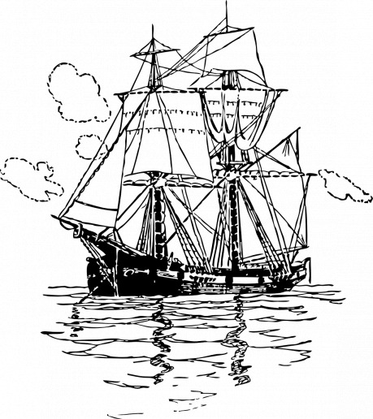

Ďalší deň. Zaujímalo by ma, čo ma núti ráno vstať z postele. Už prešli skoro štyri roky, odkedy som sem prišiel. Z neustáleho kolísania mi bolo nevoľno a nechcelo sa mi vstať z postele. Čo sa mojej postele týka... Ak by som aspoň nejakú mal. Bolo prekvapivé, ako rýchlo som si zvykol na tú hŕbu handier na zemi. Počas svojej prvej noci som ich nemohol vystáť a teraz? Pozrime sa, buvám si tu ako dieťatko v kolíske. Konečne som sa vyteperil z postele a pohľadal som svoju fľašu. Bola to jediná vec, ktorá mi pomáhala so žalúdkom. Sladký grog! Vypotácal som sa hore schodmi. Ostré slnko ma prinútilo zakryť si tvár dlaňou. Vstal som neskoro. Niektorí muži už boli hore, niektorí ešte ani nešli spať.

Všetci boli zaneprázdnení a pripravovali sa na zakotvenie. Čoskoro na mňa jeden z nich zakričal „Zase sa vyvaľuješ až do obeda, flákač?“ Správali sa ku mne ako ku psovi, nikdy ma nebrali ako jedného z nich. Ale čo som mal čakať? Prehltol som všetky nadávky, čo mi prišli na jazyk a dal som sa do práce. Drhnutie paluby, jediné na čo som bol dobrý. Všetci mnou pohŕdali a ja som to vedel. Jeden z mužov o mňa „omylom“ zakopol. Bývali časy, kedy by som to bol nechal tak. Toto nebol ten prípad. Moja päsť zasiahla jeho tvár skôr, ako si uvedomil, čo sa vlastne stalo, ale na uzemnenie muža stvrdeného rokmi na mori to nestačilo. Čo som si myslel? Udrel ma späť a ja som bol príliš opitý na to, aby som sa mohol ubrániť jeho úderom. Jeho päste na mňa dorážali znova a znova. Myslel som, že stratím vedomie keď, neviem či našťastie a či nanešťastie, prišiel kapitán. „Prestaň ty somár! Chceš ho zabiť? Nevidíš že už mu stačilo?“ Neurobil to z ľútosti. Ak by ma ten chlap zabil, kapitán by musel zaplatiť pokutu za vraždu na jeho lodi, možno by dokonca prišiel o jedného z námorníkov. Jednoducho to za to nestálo. Nič viac, nič menej.

Keď loď zakotvila, pomáhal som s vykladaním a nakladaním. Moje ruky slabli zo dňa na deň, a tak som musel položiť bedňu, čo som práve niesol, a nachvíľu si odpočinúť. Práve vtedy som ho stretol prvý raz. So zúfalým pohľadom a niekoľkými taškami na chrbte behal od námorníka k námorníkovi, až kým nenašiel kapitána. Problémy z neho boli cítiť už z diaľky. Tak veľmi to pripomínalo môj prvý deň, až som začal pochybovať či som naozaj hore. Mohlo to byť ranami do hlavy, mohlo to byť chľastom, pomyslel som si. No nebol to žiadny sen, a už vôbec nie klam, len náhoda. Keď sa konečne dostal ku kapitánovi, ten starý hajzel vedel tak dobre ako ja, čo sa dialo. Zaškeril sa na toho mladíka a pozval ho do kajuty. Ako som sa len mohol vtedy nechať oklamať tým falošným úsmevom? Keby som len bol vedel, čo ma vtedy čakalo.

Ako som čakal, stráže prišli chvíľu nato a hľadali mladého muža. Nemali šťastie. Kapitán vedel, ako na nich. Skoro som počul, čo im povie „Toto je súkromný majetok! Nemáte právo mi tu snoriť!“ Určite by pridal frázu s tým, ako je jeho loď ‚čistá ako kajuta pod ich nohami,‘ keby nebola zakrvavená z predchádzajúceho konfliktu. Vsadím sa, že si to všimli, no poznali kapitána a vedeli, že bolo zbytočné sa s ním naťahovať. Ešte chvíľu sa potĺkali popri lodi a dúfali že zahliadnu toho chalana, no po chvíli to vzdali a išli prezrieť ďalšie lode.

To, že mladík podpísal papier, nebolo žiadnym prekvapením. V jeho situácii mu tá ponuka pripadala ako spása. O tom som vedel svoje. Človek má pocit, že urobil hroznú chybu a že už nemá žiadne východisko. Rodina ho odmieta a priatelia s ním nechcú mať nič spoločné. Všetci v ňom vidia zlodeja, vraha či násilníka. Je úplne jedno, čo to je. A potom, z ničoho nič, mu v hlave skrsne nápad začať odznova. Na chvíľu sa skryť na lodi a založiť si rodinu niekde inde. Všetko, čo pre to treba urobiť, je podpísať papier. Kto by odmietol takú ponuku?

Spomínam si, ako som ho prvý raz videl tvárou v tvár. Naťahoval som sa s mechom pšenice a znova som si všimol ten zvláštny pocit. Bolo to, akoby som sa pozeral na svoj odraz z minulosti, aj keď naše výrazy boli dosť rozdielne. Ja som mal výraz muža, ktorý už nemá čo stratiť, on mal tvár mladíka očakávajúceho nový, dobrodružný život na mori. Ako veľmi sa mýlil. V jeho pohľade som cítil ľútosť. Keby len vedel, že si práve zaistil podobný osud.

V noci mu ukázali, kde bude spať. Dali ho do izby so mnou. Najskôr bol sklamaný, no po chvíli sa „oťukal“ a konečne sa predstavil. Nemohol sa dočkať, ako mi vyrozpráva celý svoj životný príbeh, keďže už mu môj vzhľad nepripadal taký odpudivý a nepotreboval na to nikoho špeciálneho. Jednoducho to zo seba potrebovl dostať. Vypytoval sa ma na mnohé veci, ja som sa ho nepýtal na nič. Veľmi rýchlo pochopil, že nemám záujem o rozhovor. Len som mu pošepkal takým strašným hlasom, aký som len vedel napodobniť: „Uteč odtiaťo!“ Neviem, prečo som to povedal. Možno mi ho bolo ľúto, možno som dúfal, že tým zmením svoju minulosť, aj keď som vedel, že to bol niekto iný. Ak nič iné, aspoň odvtedy držal hubu. Celú noc bolo počuť šuchot. Zase som mal pocit, akoby to znova bol môj prvý deň. Začínal som toho pocitu mať plné zuby. Myslím že francúzi to volajú déjà vu. Toho som si užil dosť, odkedy prišiel. Bolo mi ho ľúto, a tak som mu dal zopár plachiet, čo som za tie roky nahromadil. Slušne mi poďakoval a chvíľu na to zaspal.

Zobudil ma vŕzgot pántov. Chalan bol celý žhavý do roboty. Povedal som mu aby si ešte zdriemol, kým mal príležitosť. Jeden z námorníkov to započul, vbehol do izby a kopal do mňa, zatiaľ čo som bol ešte stále na zemi. „Už ho učíš zlé maniere, ty tchor?“ Tchor, moja nová prezývka. Zvyknem si na ňu, rovako ako som si zvykol na tie ostatné. „Poď mladý muž! Tuto tchor ti ukáže, čo budeš robiť.“ A tak som išiel. Povodil som ho po celej lodi, ukázal som mu, čo zvyčajne robievam a čo bude on pravdepodobne robievať tiež. Pozorne vnímal každé moje slovo, ako keby to bolo niečo dôležité.

Dal som sa do práce. Musel som ešte odrhnúť palubu z predchádzajúceho dňa. Námorníci vyzvali mladíka, aby im pomohol zdvihnúť kotvu. Všetci boli ešte pripití z predchádzajúceho dňa, pobyt v prístave si vždy užili do sýtosti, a tak potrebovali pomocnú ruku. Horlivo k ním pribehol. Konečne sa cítil byť užitočný. Pomaly vyťahovali kotvu, keď sa zrazu niečo pokašľalo. Nie som si istý, čo sa stalo, no zrazu letelo lano s kotvou späť do vody. Keďže boli všetci ešte pripití, zabudli mu povedať, že by pri lane nemal stáť. Dovtedy som si myslel, že to bola len povera, no naozaj sa to stalo! Ako lano letelo späť do vody, omotalo sa mladíkovi o nohu, ktorý vystrelil z lode a chvíľu na to zmizol pod hladinou. Jeden z námorníkov sa pokúšal zadržať lano, no jediné, čo tým dosiahol, bola spálená koža na jeho dlaniach. Mladíkovi už nebolo pomoci. Kotva dopadla na dno a ochvíľu prišli ďalší, triezvejší muži. Rýchlo zdvihli kotvu, tento raz úspešne, a zaistili ju. Nehybné telo mladíka sa hompáľalo na boku lode. Vytiahli ho na palubu a niekoľkí sa ho pokúsili oživiť, no bolo už po ňom. V prístave bolo rušno a mnoho ľudí videlo, čo sa stalo. Hneď na to prišli stráže a teraz bol kapitán bezmocný. Verím že zbytok príbehu poznáte.

„Toto ste povedali polícii?“

„Áno a presne takto to aj bolo. Nemám dôvod klamať.“

„Ste si istý, že kapitán v tom nehral žiadnu úlohu?“

„Okrem toho, že vášho snúbenca najal? Nie. Bola to nehoda. Viem, že by vám prišlo vhod mať niekoho, koho by ste mohla obviniť, niekoho, koho by ste mohla nenávidieť a vyliať si na ňom žlč, no bezohľadu na to, aký je ten muž hrozný, a to ja viem najlepšie, jeho vina to nebola. Kapitán nebol zodpovedný za smrť vášho snúbenca.“

„Verím vám. No aj tak to bol on, kto ma pripravil o môjho drahého.“

„To nemôžem poprieť. Tak, ak je to všetko, obávam sa, že sa budem musieť vrátiť na loď.“

„Po všetkom, čo sa vám stalo? Čo vám títo ľudia urobili? Prečo sa tam chcete napriek tomu všetkému vrátiť?“

„Pretože pre mňa už inde niet miesta.“
