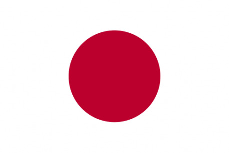
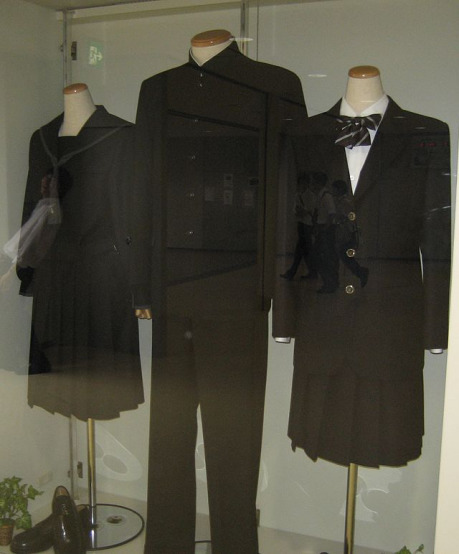
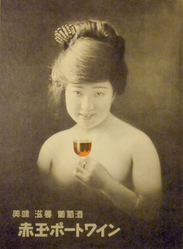

## Úvod

Japonsko jako země je velice jiná.

_„Duuuuuh, to by blbej neuhodl…“_

Ne, jako myslím FAKT jiná! Člověk si často nedokáže uvědomit, kolik věcí bere za přirozené, samozřejmé, dokud se někam nepřestěhuje, a v Japonsku to na vás spadne z nebe už v prvních 30 minutách. V mém případě to byly tyto věci:

- Vzduch smrdí jako rýžový čaj.
- V eskalátoru se stojí nalevo a chodí napravo.
- U zavazadlového pásu stojí člověk, jenž upravuje zavazadla, aby mezi nimi bylo dost prostoru, a zpomaluje skluz nových příchozích.

A mnoho dalších banálnějších věcí. A to jsem ještě prosím pěkně nevyšel z letiště.

Kdybych se tu snažil popsat, v čem všem se Japonsko od Čech liší, tak to nebude na článek, ale na knížku (a možná se taková knížka už vyskytuje). Proto se budu snažit omezit na několik oblastí (ty se které jsem nejlíp obeznámený) a u nich vycházet pokud možno co nejvíc z vlastní zkušenosti.

V obecném měřítku jako základ pro pochopení Japonska (a jako jedny z nejodlišnějších věcí, než na co jsme zvyklí) bych uvedl následující body:

- Rozdíl mezi tím, jak se Japonsko jeví být a jakým ve skutečnosti je.
- Obrovsky kladený důraz na skupinu.

Pojďme se na ně jednotlivě podívat.

## Podoba vs. Esence

Snad každý má nějakou představu o Japonsku. Ať už ale vaše představa je formovaná filmy, mangou, samurajskými příběhy, urban legendami, nebo něčím jiným, můžu vás ujistit, že je mylná. Kamarádka popsala Japonsko jako „stará paní, která schovává obličej pod tlustou vrstvou make-upu“. Vzdělaný člověk by vám začal povídat o tom, jak je Japonsko _shame_ kultura, na rozdíl od naší evropské _guilt_ kultury, kde se to vzalo a jaké to má implikace. Jelikož já nejsem vzdělaný, tak vám akorát řeknu, že si tu všichni hrají na něco, co nejsou.

*Vskutku nepřeháním. A přílivu nových cestujících se těžko ubráníte. Když se na mě lidi mačkali poprvé tak mě popadl záchvat paniky. Jedna kamarádka zase zažila, že jak se nechala unést proudem lidí, tak se jí deštník vpůli ohnul. Podobně to pak vypadá, když lidi chtějí vystupovat – žádné omluvy, prostě se přes vás protlačí. V RPG hráč, který drží batoh nebo něco těžšího v ruce, by si měl hodit, zdali to udrží, nebo to zmizí s davem.

Toto často bývá velice matoucí pro cizince. Klasicky případ: Japonci jsou nesmírně zdvořilí (až moc). Dokážou se pětkrát omluvit za něco, co je ve skutečnosti vaší chybou (např. přinesete pozdě večer důležitý papír, protože jste ho během dne zapomněli a museli se pro něj vracet domů, tak se vám omlouvají za to, že jste museli absolvovat takovou dlouhou cestu). Tato zdvořilost ale zmizí jako zamáváním kouzelné hůlky během dopravní špičky v MHD. Zatímco Plzeňák by před plným autobusem poprosil, zdali by se nemohli cestující posunout hlouběji dovnitř, stresovaný Japonec zcela zapomene na zdvořilost a protlačí se dovnitř za pomocí loktů, brašny, nebo zadku*.

Rozdíl mezi podobou a esencí Japonska se projevuje i v jiných sférách. Japonsko je například známé jako vysoce technologicky vyspělá země. Projděte se v technologickém centru Tokya v Akihabaře a spadne vám čelist z vystavených vynálezů. A přesto ve společnostech fungují často strašně staromódně. Pracoval jsem jako soukromý učitel a považte, ve věku počítačů, smartphonů a internetu mi rozvrh na nový měsíc vždy posílali _poštou_.

Rozdíl mezi podobou a esencí znamená taky, že si Japonci strašně váží vlastní reputace. A tohle má docela nepříjemné dopady například na mezinárodní politiku, kde na rozdíl od Německa nejsou ochotni uznat zrůdnosti napáchané během Druhé světové. Dle jejich mentality uznat něco takového by nesmírně poškodilo jejich pověst, a i když současné Japonsko nemá moc společného s tím minulým, tak vláda raději volí strategií zatloukání a vyčkávání na to, až pamětníci umřou, aby pak mohla tvrdit, že žádné věrohodné zdroje se nedochovaly.

Navenek se tedy Japonsko jeví jako vyspělá země Západního typu. Ale při hlubším zkoumání se vynoří věci, nad kterými nám Evropanům zůstává rozum stát. Na mnoho příkladů narazíte v tomto článku (a kdyby nebyly, tak bych neměl o čem psát), ale už jeden z hlavních bodů rozdílu mezi Evropu a Japonskem je následující bod, a to obrovsky kladený důraz na skupinu.

## Důraz na skupinu

V japonském společenském narativu se traduje, že společnost je dědicem tradičních sběračů rýže. A jelikož sbírání rýže je životně důležitá, ale přitom namáhavá činnost, museli se přitom stoprocentně spoléhat jeden na druhého. Odtud pochází japonská posedlost skupinou.

Zatímco z Ameriky jsme zvyklí na kulturu jedinečnosti, vynikat nad ostatními, být cool, tak v Japonsku je to o tom nevyčnívat z řady. Jasně, existují výjimky, které jdou proti proudu a nebojí se vyjádřit svou polo-šílenou stránku, ale v drtivé většině případů převládá snaha zapadnout. Toto se pak projevuje v řadě oblastí, ale asi nejvíce v tom, jak Japonci myslí. V tomto případě nejčastější myšlenku, co uslyšíte, bude: „Ale co si o tom budou ostatní myslet?“ Spěcháte do práce, nestihli jste se nasnídat a chcete si dát bagetu po cestě? V žádném případě, protože v Japonsku je to neslušné, a pokud by Vás někdo viděl, tak „co si budou o Vás ostatní myslet?“ Chcete přejít na červenou? „Co si budou o Vás ostatní myslet?“ Dokončili jste v pátek práci dřív než obvykle a rádi byste domů? To přece nemůžete, protože „co si budou o Vás kolegové myslet?“ A takto bychom mohli pokračovat do aleluja.

Důraz na skupinu se projevuje i v tom, jak se Japonci oblékají. Je všeobecně známé, jak všechny střední školy a školy druhého stupně ZŠ (někdy i prvního) nutí studenty nosit školní uniformy, ale projděte se někdy kolem kancelářských čtvrtí a uvidíte podobný obraz: legie mužů ostříhaných nakrátko, v tmavém saku (nejčastěji černém), s decentní kravatou a košilí v jedné z následujících barev – bílá, světlé modrá nebo šedá. Vážně, už jenom najít někoho, kdo by měl košili jiné barvy, je téměř nadlidský úkol. A pak se diví, proč si myslíme, že všichni vypadají stejně…

Když se teda všichni snaží chovat stejně, jak dochází ke změnám v momentě, kdy jsou skutečně potřeba? Většinou je to intervencí seshora, v konečné instanci ze strany vlády. Viz tento případ:

Japonské léto je horké a velice dusné. Přesto chodí japonští zaměstnanci do práce v těch tmavých sakách a v nich pracují v kanceláři. Kvůli tomu musí běžet klimatizace na plné obrátky. Je to strašné plýtvání penězi a životním prostředím, ale odhodlali byste se nařídit zaměstnancům, aby přišli do práce jen v košili? Co by si ostatní mysleli o tom, že ve Vaši společnosti se hůře oblékají?

Nakonec tento začarovaný kruh rozmotala vláda, která sponzorovala kampaň pro Cool Biz a nařídila státním zaměstnancům během léta přijít do práce v košili s krátkým rukávem a bez kravaty. Nutno ale dodat, že zezačátku se ubozí zaměstnanci cítili strašně nesví, když museli v takovém oblečení cestovat v MHD obklopeni zaměstnanci ze soukromého sektoru, kteří se tímto nařízením ještě neřídili (a trvalo několik let, než se toho chytli), a tak si raději brali s sebou sako a kravatu a sundali až v práci.

## Vztah k cizincům

*Kamarádka černoška povídala, že jednou seděla v restauraci, jedla si svůj _ramen_, a najednou jí starý pán vedle ní vzal ruku a snažil se ji olíznout. Když se od něj zděšeně vzdálila a zeptala se, co to sakra dělá, tak odpověděl, že chtěl zjistit, zda její kůže opravdu chutná jako čokoláda…

Na začátku tedy asi nejrelevantnější téma – jaký je vztah Japonců k cizincům? Nejlépe bych to dokázal shrnout takto: Japonci nás vidí jako děti. Tohle ale není tak špatné, jak by se na první pohled mohlo zdát. Za prvé všichni Japonci zbožňují _kawaii_ (rozkošné) věci. A děti jsou pro ně strašně _kawaii_. Za druhé, jelikož nás vidí jako děti, tak jsou mnohem trpělivější a chápavější k naším přestupkům vůči společenským konvencím (kdy často můžeme někoho urazit nebo pohoršit, aniž bychom si to uvědomili). Nemůže se stát, že vám někdo řekne: „Jsi tady v Japonsku, tak mluv japonsky a chovej se jako Japonec!“ jako se vám naopak snadno přihodí v ČR. Naopak, Japonci chápou, že jejich jazyk a kultura jsou příliš složité pro samotné Japonce, natož pro nebohé cizince.

Tenhle přístup je nesmírně užitečný pro nově příchozí, nebo pro cizince, kteří obecně mají problém se adaptovat na zdejší prostředí (ať už jazykově nebo kulturně). Je to ale horší pro cizince, kteří se chtějí aktivně integrovat, neboť jen těžko budou přijati do bližšího kruhu mezi Japonce. Už jen je dostat k tomu, aby s vámi začali mluvit o „dospěláckých“ tématech je poměrně složité (pamatujte, pro ně jste děti). Často „cizinci“, kteří v Japonsku strávili přes půlku svého života, mluví Japonsky tak perfektně, že po telefonu nepoznáte, že mají jinou barvu pleti, se musí pořád potýkat s obrovskou zdí. A příběhy polo-Japonců připomínají klišé půl-elfů: na hraně mezi dvěma světy, ale nejsou přijati ani do jednoho.

V každém případě tento vztah k cizincům není stejný vůči všem a hodně záleží na tom, odkud pocházíte. Pro nás bělochy to funguje v podstatě, jak jsem popsal, ale lidi s pletí jiné barvy to nemají tak jednoduché. Částečně je důvodem i všeobecně vnímané společenské postavení, které se odvíjí od „typické“ práce národnostního příslušníka. Zatímco typický běloch pracuje buď ve firmě, nebo jako učitel angličtiny (což je vnímané dost prestižně, viz kapitola o školách), imigrant z Indického poloostrova často končí jako obyčejný kuchař, číšník nebo sociální pracovník. Nejhůře na tom jsou imigrantky z Filipín, protože v minulém století často přicházely do Japonska jako prostitutky a této nálepky se dnes jen těžko zbavují. Byla doba, kdy vztah vůči nim byl tak vyhrocený, že se je někteří lidi snažili strčit nenápadně pod přicházející vlak (jedna známá zažila) – dnes se ale situace podstatně zklidnila. Kupodivu, i když pro to nejsou historické důvody, tak ani černoši se netěší takové oblibě jako běloši a musí čelit větší míře nepochopení a podivným historkám.*

## Alkohol

Japonci, podobně jako Češi, milují pivo. V životě jsem nepotkal tolik žen, které by mi s hrdosti sdělily, jak strašně rády pijí pivo. Přesto však má pivo v Japonsku velice krátkou historii: první pivovar byl otevřen až v roce 1869. Kvůli tomu mají Japonci poměrně nízkou toleranci vůči alkoholu, a jeden půllitr už se často na nich projeví.

Japonská piva se podobají těm českým: světlá piva („pils“) s 5% množstvím alkoholu. Jestli jsou podobná i chuťově, to však nemohu posoudit.

Zajímavější je situace u zákonů okolo alkoholu. Stejně jako v ČR tu platí prakticky nulová tolerance k řízení pod vlivem (s pokutami až 200 000 korun a trestem odnětí svobody až na pět let za porušení), jenže na rozdíl od ČR tento zákaz platí i pro řízení kola. Ba co hůř, trest odnětí svobody hrozí i v jiných podivných případech. Pokud například jedete v autě s opilým řidičem, jste spoluzodpovědní za jeho stav a jdete do vězení. Pokud jste s ním chlastali, tak jste taky spoluzodpovědní, i když třeba s ním nejedete (takže se musíme ujistit, že kolega Sato se nevrátí domů vlastním autem nebo na kole, jinak máme průser). Toto je pro nás zcela nepochopitelné, ale pamatujte: v Japonsku je obrovsky kladený důraz na skupinu. To se obyvatelům tluče do hlavy už od malička, takže jim to divné nepřijde.

Třešnička na dortu je ale tento důvod pro spoluodpovědnost: pokud jste viníkovi nalili alkohol. Když vám tedy přijde domů návštěva, tak to není takový problém si to uhlídat, ale co když pracujete v hospodě? Jak tam můžete vědět, že klient vám nekecá o dopravním prostředku, který použije? Naštěstí existuje pro ně klička: jakmile si objednáte alkohol, číšník se vás zeptá, jestli budete chtít pak objednat i taxíka. Pokud odpovíte ne, tak je tímto zbavený odpovědnosti.

Takže shrnuto: když jdu někam chlastat, tak se domu můžu vrátit je MHDčkem, taxíkem, nebo s kamarádem v autě. Vláda ale naštěstí myslí i na lidi, co bydlí v nějakém zapadákově a všude musí autem. Pro ně vyvinula systém „náhradního řidiče“ (_Unten-daiko_). Unten-daiko funguje tak, že taxíkem přijedou dva lidi, jeden vás taxíkem odveze domů a druhému dáte klíče od auta, aby s ním jel za taxíkem a dovezl vám ho tak domů. A jelikož je tento program dotován od státu, tak vám to nakonec vyjde levněji než taxi. :-)

Jak vidno, první zkušenost s pravidly okolo alkoholu v Japonsku by vydala na malý zajímavý skill challenge o kulturním šoku.
