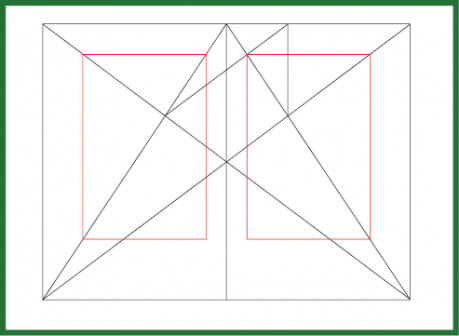
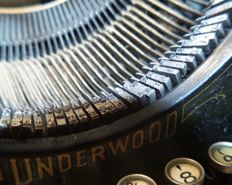
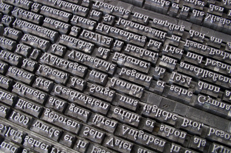
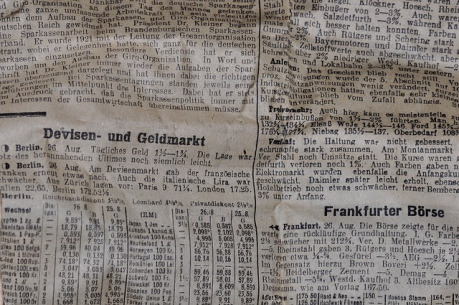
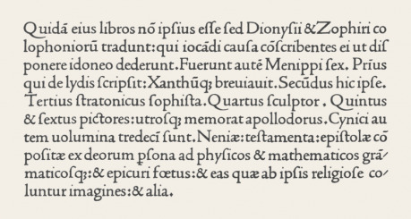
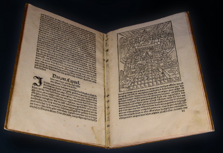
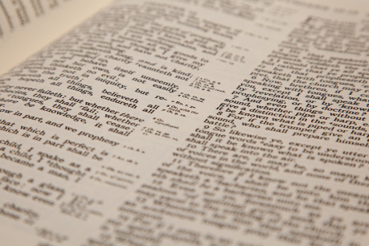
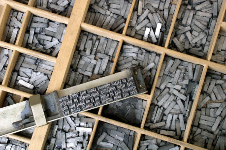

Rád bych na začátek osvětlil příčinu toho, že jsem se rozhodl tento článek sepsat. Do _RPG Kuchyně 2014_ jsem odevzdal soutěžní příspěvek, který se setkal s velmi pochvalnými reakcemi ohledně grafické úpravy. Použil jsem sice k tvorbě profesionální program pro sazbu, ale vlastně jsem jen využil téměř archetypálního knižního rozvržení stránky, vybral dobré písmo a rozhodl se, jak budu formátovat nadpisy. A kdybych nepoužil program přímo určený k sazbě dokumentů, ale jen běžný textový editor, uměl bych dosáhnout prakticky totožného výsledku, aniž by mě to stálo znatelně větší úsilí.

{:.sidebar}
V tomto článku představuji základ klasické sazby, která se používá už několik staletí pro tisk knih. Není to samozřejmě formát, který se dokonale hodí k prezentaci každého textu, ale jako základ pro souvislý text delší než dvě strany vyhoví téměř kdykoli. Doporučuji nejprve se „naučit“ a na několika různých textech prozkoumat tuto podobu, než se pustíte do dalších experimentů.

Pokud tedy lze v MS Wordu či LibreOffice dosáhnout výsledku, který čtenáře nejen nebude obtěžovat, ale ještě vám ho pochválí, v čem vlastně spočívá problém?

Výchozí nastavení textových editorů běžně vypadá takto: stránka formátu A4 na výšku, jeden sloupec písmem Times New Roman nebo Calibri velikosti 11 až 12 typografických bodů a na všech stranách 2cm okraje. Pokud chcete dosáhnout výsledku, který bude vypadat k světu, je potřeba skoro vše v tomto nastavení změnit.

## Stránka

Formát A4 se ukázal už dávno jako velmi praktický v kancelářském použití, zejména pak v době psacích strojů. U fyzického (vytištěného) dokumentu je pak jeho orientace na výšku logická, a proto i editory určené především pro úpravu textu k tisku v kancelářských podmínkách takovéto nastavení nabízejí jako výchozí. Podívejte se teď ale do své knihovny – kolik knih má formát A4, a kolik nějaký menší? (A kolik z těch velkých jsou dětské knihy s velkými písmeny? Dobrá, a teď kolik z těch vašich A-čtyřkových RPGček je vysázených v jednom sloupci?) Pokud navíc počítáte s tím, že váš text bude nejčastěji někdo číst na běžném počítači nebo čtečce, pak je A4 na výšku snad nejméně vhodný formát.

Pro začátek doporučuji používat formát A5 (na výšku). Pro tisk fyzické knihy nebo pro větší obrazovky může být dobrou variantou o trochu větší B5, pro čtečky a mobilní telefony bych pak vyzkoušel naopak o něco menší B6. Na obrazovkách počítačů bude také dobře fungovat A4 na šířku se dvěma nebo třemi sloupci. Tento formát, který může vypadat jako dvojstránka z knihy, má zároveň výhodu možnosti domácího tisku bez nut­nosti jakýchkoli úprav. (Jak jste si jistě všimli, ve třech sloupcích na A4 je vysázená také PDF verze časopisu Drakkar, který právě čtete.)

Menší formát doporučuji ne proto, že tak vypadá většina knih, ale kvůli šířce řádku. Vezměte si do ruky nějakou běžnou knihu s prozaickým beletristickým textem, vydanou zavedeným nakladatelstvím, vyberte jeden plný řádek zprostřed textu (ne první nebo poslední řádek odstavce) a takový, který nebude viditelně hustší nebo řidší než ostatní řádky – a sečtěte znaky včetně mezer a interpunkce. Vsadím se s vámi, že vám vyjde číslo mezi 55 a 65. Trefil jsem se?

Jako vhodný kompromis mezi snahou šetřit papírem a čtenářským zážitkem se totiž ustálila hodnota zhruba 60 znaků na řádek. A teď výchozí nastavení Wordu – schválně, kolik? Pro ty, kterým se to nechce počítat, vychází to kolem 90, i víc. Proč nabízí Word tak široký řádek? Změňte si písmo na Courier ve velikosti 12 b. – teď vám vyjde... zhruba 60. Někdo prostě kdysi okopíroval formát, který dával smysl na psacím stroji, nacpal ho do počítače, vyměnil písmo se všemi písmeny stejně širokými za písmo tiskové, a nikdo už se nezabýval nějakými korekcemi.

Pokud bychom se ovšem chtěli přidržet formátu A4 na výšku, máme dvě možnosti: buď výrazně zvětšit okraje, nebo rozdělit text do dvou sloupců. Z praktických, estetických i ergonomických důvodů doporučuji první mož­nost. Případně kombinaci obojího s tím, že použijeme desetibodovou velikost písma. Proč? Zaprvé – průměrná šířka plného řádku v sloupci by se měla pohybovat na nějaké hodnotě v rozmezí 45 a 70 znaků.

Zadruhé – velké okraje jsou to, co ve vás jako první vyvolá pocit, že čtete příjemně upravený text. Opravdu se nebojte nastavit velmi široké okraje. Pokud si můžu dovolit trochu zapřehánět, tak vám doporučím, abyste potom, co nastavíte okraje tak široké, že už se vám to bude zdát trochu příliš, ještě centimetr na každé straně přidali (jen trocha přehánění je to proto, že chci, abyste tenhle postup opravdu alespoň vyzkoušeli). Text potřebuje prostor, musí dýchat, bílá plocha okolo něj uklidňuje a zpříjemňuje čtení. Navíc do širokých okrajů máte možnost vpisovat poznámky – ať už jste autor, nebo čtenář. To je zejména praktické, pokud je vaše hra ještě ve vývoji.

Pokud počítáte s nejjednodušším typem sazby (tedy zřejmě pro zobrazení na počítači, čtečce či mobilním telefonu), levý a pravý okraj nastavte stejně široké (pro formát A4 a velikost písma 12 alespoň 3 cm, ale klidně i 4 cm) horní okraj může být o něco užší, spodní okraj by měl být naopak o trochu širší. Do něj pak můžete dva nebo tři řádky pod text vložit číslo stránky.

Při pokročilejší sazbě budete už dopředu počítat s dvojstránkami, a proto nastavíte vnitřní okraje užší než vnější. (Ale nesmíte to přehnat, aby vám text případně nezmizel v záhybu knižní vazby, zejména u brožovaných výtisků.) Důvodem je estetické působení rozevřené knihy. Ptáte se, jestli to myslím váž­ně? Ano, myslím, vždyť o to nám přece jde. Jen si to vyzkoušejte, nastavte si stránku A4 na šířku, nastavte dva sloupce (jako ekvivalent dvou A5) a mezi nimi mezeru tak širokou jako pravý a levý okraj dohromady. A pak mezeru zužte na jen zhruba na dvě třetiny nebo polovinu součtu okrajů. Nevěřím, že se vám bude prv­ní možnost líbit víc. A když už jsme u sloupců...

## Sloupce

Dobrá, neposlechli jste mě, nechcete formát A5, chcete si to doma vytisknout a pak to rozdávat kamarádům. A zároveň ve vás jeden úzký blok textu s širokými okraji vyvolává existenciální tíseň. Nebo strach o budouc­nost amazonských pralesů. Může být, ale varoval jsem vás.

Ať už máte sloupec jeden nebo je jich víc, pořád potřebují okraje. Všechny sloupce musí být stejně široké (alespoň pokud obsahují stejný typ textu, tedy na sebe navazují) a společně by měly tvořit na stránce stejně harmonický obrazec, jaký by vytvořil text jen v jednom sloupci.

Větší počet sloupců navíc potřebuje nějakou tu mezírku mezi sebou. Dopřejte i té­to mezeře trochu životního prostoru a nezužujte ji na nezbytné minimum. Samozřejmě všeho s mírou. Čím užší tato mezera je, tím víc sloupce splývají, ruší to při čtení a čtenář se musí víc soustředit. Užší mezera může být v případě, že máte nezarovnaný text, ale ani pak by až ke kraji nemělo zasahovat příliš mnoho řádků. Někdy se dá více sloupcům namačkaným na sebe těžko vyhnout, a proto se používá pro oddělení vertikální linka. Ale pokud náhodou zrovna nesázíte prvorepublikové noviny, doporučuji vám vyhnout se tomuto řešení velikým obloukem.

Každý sloupec by pak měl mít rozumnou šířku řádku. V tomto případě je myslím vhodné dostat se pod 60 znaků, ale přitom se držet nad 40. Důrazně vás odrazuji od sloupců užších než 30 znaků, zejména pokud v nich má být text delší než krátký odstavec. Hlavní výhoda sloupců je, že trochu zrychlují čtení (krátký řádek se rychle přeletí očima a není potřeba takové soustředění na to, aby člověk nepřeskočil řádek), a pokud nejsou mezery mezi nimi nastaveny až příliš velkoryse, šetří místem (téměř prázdné řádky na konci odstavců nejsou tak dlouhé jako u širokých sloupců), což je nejlépe vidět na textech s krátkými replikami přímé řeči. Příliš úzký sloupec ale tyto vlastnosti ztrácí a začínají se v textu objevovat nepříjemně velké mezi­slovní mezery.

Široké sloupce (nebo prostě jen jeden široký sloupec) naopak dodávají na jakési vážnosti a „důvěryhodnosti“ – společně se snahou dostat co nejví­ce textu na jednu stránku je to pak také jeden z důvodů, proč odborné texty mnohdy překračují i mnou maximálních doporučených 70 znaků na řádek. Tedy hned vedle toho, že ve vědě dnes často není dost peněz na pořádného typografa…

Pokud chcete, aby vaše sloupce dobře vypadaly, měli byste popřemýšlet o sazbě tzv. do mřížky. Tzn. nastavit všechny parametry tak, aby za všech okolností seděly řádky základního textu na stejných (neviditelných) linkách. Znamená to, že buď nesmíte používat různé velikosti písma (např. pro nadpisy), nebo si musíte přesně vypočítat mezery nad a pod nadpisem, aby vám vycházely na násobky výšky řádku základního textu. Také to znamená, že byste neměli za či před odstavce vkládat jakoukoli mezeru. Nemluvě o tom, že všechny sloupce by měly být stejně vysoké (na počet řádků i na skutečnou výšku) a že byste se měli vyhnout tzv. parchantům. Ale o těch později. Mimochodem, dva bloky textu na protilehlých stranách by taky měly být stejně vysoké.

Ve chvíli, kdy zvolíte variantu s více sloupci, nastávají také problémy s vkládáním ilustrací do textu. Pokud máte tu možnost, vyhněte se tomu, aby ilustrace zasahovala do více sloupců, aniž by je zabírala celé. Podle typografických zvyklostí by totiž text měl pokračovat ve stejném sloupci pod ilustrací, a pokud tedy zasahuje do dvou nebo více sloupců, pak má text plynout v pořadí: v prvním sloupci nad ilustrací, v prvním sloupci pod ní, v druhém sloupci nad ilustrací, v druhém sloupci pod ní a tak případně dále. Ale pokud mi ilustrace přehradí celou stránku, mám osobně tendenci přeskočit do dalšího sloupce a až potom se přesunout pod obrázek. Takže nejbezpečnější, a vlastně i nejefektněji umístěné jsou ilustrace na samostatných stránkách či na koncích kapitol (nebo na konci oddílu před následujícím nadpisem).

Nedoporučuji ani nechat text ilustrace obtékat. Potřebujete k tomu dostatečně široký sloupec (aby snesl takové zúžení) a vyžaduje to už občas takové zásahy, které běžný textový editor dobře nezvládá a výsledek je pak tristní.

Více sloupců na jedné straně má ještě další nevýhodu: S výjimkou tištěného dokumentu a formátu na šířku čteného na větší obrazovce počítače znamenají sloupce neustálé posouvání nahoru a dolů, na úzkých displejích i doprava a doleva (pokud jste si někdy stáhli příručku k RPG do smartphonu, víte, co čem mluvím).

## Písmo

Písma v textových editorech jsou většinou volena s ohledem na jejich dostupnost, ale samozřejmě i s ohledem na jejich univerzalitu a šíři znaků, které nabízejí. Times New Roman možná není dvakrát pohledné písmo, je nadužívané a trochu nudné, ale je dobře čitelné, obsahuje velkou většinu znaků, které budete v životě potřebovat, a v každých Windows je zadarmo.

Na bezpatkový Arial s ohledem na jeho vzor Helveticu dost lidí dští síru, ale pro běžného člověka je to prašť jako uhoď. Ovšem mně osobně se třeba nelíbí ani Helvetica. Na Calibri, novější volbu tvůrců MS Wordu, si stále dělám názor – nadšený nebude, ale úplně nepěkný také ne. Zato Cambria mi připadá v kon­kurenci patkových písem poměrně slabá.

Jenže jaká tedy používat písma, když ta výchozí jsem nepochválil? Zaprvé: vždy používejte písmo, které je funkční. Vezměte kus textu, zmenšete ho na velikost 8 b. nebo menší, a pokud vám bude čtení dělat obtíže, zvolte jiné písmo, a to i tehdy, když budete chtít použít velikost 12 nebo větší. Na vašem velkém monitoru to zdobné písmo možná vypadá úžasně, ale na mé čtečce „u“ vypadá jako „a“ a k nerozeznání podobná jsou si „c“ a „e“.

Na delší texty, a zvlášť na široké sloupce je lepší patkové písmo, protože lépe vede oko po řádcích a celkově méně unavuje. Bezpatková písma mají zase výhodu, že v malých velikostech bývají čitelnější.

{:.sidebar}
Na internetu lze velmi rychle narazit na silnou averzi k písmu Comic Sans. To je však zároveň velmi oblíbené mezi (typograficky) nezkušenými uživateli internetu a textových editorů. Protože jako jediné z&#160;písem dlouhou dobu dodávaných ve Wordu vyjadřuje jistou neformálnost, stalo se nadužívaným až všudypřítomným. Samo o sobě to není nijak skvělé písmo, přesto má i své výhody – je dobře čitelné a podobné běžně psanému „tiskacímu“ písmu, dokonce prý při čtení velmi vyhovuje dyslektikům. Pro každé použití písma Comic Sans ale existuje nějaké lepší písmo, mnohdy dostupné zdarma – užití Comic Sans pak tedy vlastně říká, že jste nenašli, či spíš nehledali alternativu.

Z patkových písem doporučuji léty, vlastně už staletími ověřené klasiky: Garamond, Jenson, Baskerville, nebo třeba Caslon jako písma přímočaře knižní; snad pro každou příležitost se hodí Minion (ke kterému se ale asi bez pořízení komerčního softwaru od Adobe legálně nedostanete), jako volně dostupnou variantu nabízím Palatino – tomu je ale nutné mírně zúžit řádkování (o kterém píšu níž). Nedostanete-li se k žádnému z těchto písem ani žádnému jinému vhodnému, tj. uměřenému, a přitom pěknému na pohled, použijte Times New Roman – ale připravte se, že vás někdo nařkne z toho, že jste si se sazbou nedali moc práce.

Bezpatková písma nejsou časem tak důkladně prověřená, protože se začala používat až zhruba před jedním a půl až dvěma stoletími. To neznamená, že by mezi nimi nebyla kvalitní písma (ostatně např. patkový Jenson je jedno z úplně nejstarších tiskových písem vůbec), za už klasické jsou třeba považovány Helvetica nebo Futura. Jenže u bezpatkových písem ještě více než u patkových záleží na použití a větší volnost v kresbě znaků také dává větší váhu osobnímu vkusu. Základním požadavkem by tak pro vás jako vždy měla být čitelnost. Písmo, které se na první pohled jeví jako obyčejné, nakonec mnohdy působí v dokumentu nejlépe.

Pokud zrovna potřebujete malé blešky, snad nejčitelnějším běžně dostupným písmem je Verdana – jen je potřeba trochu jí rozšířit řádkování (o tom opět níž). Ve velikosti 10 b. a větší se už ale s velkým pochopením nesetkává.

Máte-li možnost používat písma s označením „Pro“, vždycky je vyzkoušejte – mívají velmi širokou sadu znaků, tvůrce si dal záležet na tom, aby k sobě všechny dobře seděly, a nevyskytují se v nich nedodělky nebo začátečnická pochybení. A hlavně, takto označená písma obsahují celou sadu řezů a variant, takže máte jistotu, že tučné písmo nebo třeba kapitálky vypadají podle představ autora, a nevypočítávají se automaticky v editoru. Ne každé takové písmo se vám samozřejmě musí líbit (nebo pro konkrétní dokument hodit), ale řemeslně se jim dá máloco vytknout.

Měl bych se také zmínit o kombinování písem. Sám v tom nejsem žádný expert, ale držím se zásady, že pokud k tomu není zvláštní důvod, různá písma nekombinuji. V typografii platí téměř bez výjimky, že méně je více, a pro kombinaci písem to platí dokonale. Většina pěkných knih za posledních 500 let si vystačila s nejvíce dvěma písmy, u velké části však bohatě stačilo jedno písmo v různých velikostech (a někdy ani to ne) a různých řezech (obyčejné, kurzíva, případně tučné). Skvělého výsledku se také dá dosáhnout s kapitálkami (velká písmena ve velikosti malých), ale je lepší, když má písmo pro kapitálky vlastní sadu (písma označená za jménem zkratkou SC = small caps).

Než si sazbu dokumentů osaháte, používejte raději jen jedno písmo a kombinace si nechte, až získáte více zkušeností. Až se rozhodnete použít více písem, doporučuje se doplňovat patkové bezpatkovým, ale není to pravidlo. Vhodné je vybírat taková písma, která mají podobnou stavbu tahů – ideální jsou v tomto písma od jednoho tvůrce, často patkové a bezpatkové písmo tvoří jednu rodinu, jmenují se stejně a rozlišená jsou jen označením „serif“ (patkové) a „sans“ (bezpatkové).

## Výška řádku

Pokud už jste si vybrali písmo pro svůj dokument (a opravdu doporučuji začít tím, že použijete pouze jedno písmo), je ještě potřeba nastavit řádkování. Jednoduché řádkování je pro běžné čtení příliš husté. V zásadě je to nastavení nejužšího řádkování, jaké se tvůrci písma zdálo čitelné. Pro dlouhý souvislý text je ale nejvhodnější nastavit řádkování na 1,2 až 1,3 (120–130 %). Jedno z běžných nastavení nabízí řádkování 1,5 – to je však zase zbytečně „řídké“. To totiž opět vychází z dob psacích strojů, kdy takovéto řádkování umožňovalo vpisovat poznámky mezi řádky a tak text upravovat či komentovat. Ze stejného důvodu je řádkování 1,5 vyžadováno pro diplomové práce. Pro text, který však má být čten, a nikoli připomínkován, je to nejen zbytečné plýtvání místem, ale narušuje to plynulý tok textu a nevypadá to ani dvakrát esteticky.

Jednotlivá písma pak vyžadují drobné „korekce“ řádkování. Tak jako obecně většině patkových písem vyhovuje řádkování 125–130 %, bezpatková pís­ma působí nejlépe při řádkování 130 % nebo i o trošku větším. Už zmíněné patkové Palatino má velkoryse nastavené bílé plochy, takže snese řádkování 120 %, naopak Verdana vytvořená za účelem co největší čitelnosti na co nejmenší ploše (v malých velikostech) je sama o sobě poměrně „hustá“, a proto jí sedí řádkování i přes 135 %.

## Textový blok

Zatímco výběr písma a nastavení řádkování by měly splňovat především nároky na funkčnost, následující rady se týkají opět spíše grafické harmonie textu. Pro každý blok textu (každý sloupec zvlášť i všechny dohromady), platí, že čím pravidelnější a vyrovnanější je, tím ladněji působí. Není to však jen ladnost pro ladnost (i když i to samo by mohl být mnohdy dostatečný důvod), pravidelnost a ladnost se pozitivně promítá zase zpět do funkčnosti.

Cílem sazby je vyrovnaný sazební obrazec, toho se dosahuje několika způsoby: Většina lidí považuje za příjemnější zarovnání textu do bloku. Samozřejmě s výjimkou poezie. Avšak občas může působit lépe i zarovnání doleva (tzv. na praporek), zejména u krátkých blokových citací, nebo když kapitolu uvádí motto; zarovnání doprava pak dobře vypadá, když pod blokovou citací uvádíme jejího autora. Zarovnání do bloku naopak v textových editorech způsobuje nepěkné mezislovní mezery – čím užší sloupec, tím horší.

Řešení tohoto problému spočívá v rozdělování slov. Jenže, říkáte si, bez profesionálního programu to asi bude šílená otrava, co? A když se pak rozhodnete někde změnit text, tak se vám posunou slova na řádcích a pak někde v textu zapomenete rozdělovník a bude to vypadat hloupě, viďte?

Mám pro vás dvě zprávy, obě dobré: První je, že existuje tzv. diskrétní rozdělovník (vložíte ho klávesami Ctrl+-). Tedy rozdělovník, který editoru řekne, že dané slovo může rozdělit v daném místě, ale pokud se slovo neobjeví na konci řádku, tak se tento znak nezobrazí. Druhá dobrá zpráva je, že současné textové editory umí rozdělovat slova na koncích řádků automaticky. V LibreOffice si označte všechen text, který zarovnáváte do bloku, v nabídce vyberte _Formát > Odstavec_ a v záložce _Tok textu_ zaškrtněte u _Dělení slov_ položku _Automaticky_ (příp. nastavte 3 znaky na konci řádku, 2 znaky na začátku řádku, počet spojovníků za sebou max. 3). Nebojte se, program je dost chytrý, aby používal k dělení slovník a nepostupoval mechanicky podle počtu znaků. Pokud se vám zdá, že by někde mohlo být rozdělené slovo, které editor nerozdělil, pomozte mu diskrétním rozdělovníkem. Avšak uvědomte si, že jste nastavili počet řádků nad sebou, které mohou obsahovat rozdělené slovo, na 3 – víc raději opravdu nenastavujte. Ono „správně“ se do počtu tří povolených rozdělovníků pod sebou počítají i interpunkční znaménka (tečka, čárka), ale to už za vás editor nepohlídá – na druhou stranu i s profesionálním programem je leckdy problém toto dodržet.

V různých, zejména novějších verzích MS Wordu lze dosáhnout stejného výsledku, avšak postup si už musíte zjistit sami. Nové verze Wordu mají pro mě tak neintuitivní ovládání, že se v nich jakýmkoli pokročilým úpra­vám raději vyhýbám.

Rovnoměrný okraj textového bloku pak narušují zleva odsazení prvního řádku a zprava neúplné poslední řádky odstavců. To není na škodu, naopak grafické členění textu umožňuje čtenáři lépe se orientovat v textu a případně si oddechnout na místech, kde jedna myšlenka (vyjádřená odstavcem) končí a další začíná. Odsazení prvního řádku však musí být pravidelné, a aby nepůsobilo jako chyba, nebo naopak nenarušovalo tok textu příliš, mělo by být v poměru k výšce řádku od hodnoty 1 : 1 do trojnásobku této hodnoty. Záleží na šířce sloupce i vašem citu, ale pro 12bodové písmo je ideální odsazení 0,75–1 cm. Je také vhodné zařídit, aby poslední řádek odstavce nebyl kratší než odsazení prvního řádku a zároveň nezasahoval až k pravému okraji. Ovšem toho už se v běžném textovém editoru nedosahuje tak snadno.

Zde se dostáváme k již slibovaným „par­chantům“, tj. neúplným řádkům na začátku či konci textového bloku (sloupce), tedy tzv. sirotkům a vdovám. Vlastně tvoří problém pouze případy, kdy poslední řádek odstavce skončí na nové stránce (v novém sloupci) nebo první řádek odstavce uzavírá stránku (sloupec). Textové editory tyto případy umí řešit automaticky, ale většinou pak nadělají víc neplechy než užitku, takže vám teď velice nesystémově poradím pohlídat si to ručně, a to až ve chvíli, kdy víte, že zpracová­váte finální podobu dokumentu. Občas vám pomůže vhodně umístěný obrázek, jindy pár slov v odstavci navíc, občas nějaký prázdný řádek navíc (to je ale řešení, kterému je radno se pokud možno vyhnout). V případě, že se nedokážete rozumně parchantům vyhnout, můžete nějaký nechat – mějte ale na paměti, že to je dobře viditelný prohřešek a někdo vám ho téměř určitě vyčte.

Dávejte si také pozor na jednopísmenná slova na koncích řádků (předložky _v, k, s, o, u,_ spojka _i_ a velké _A_). Podle typografických pravidel by se zde neměla objevovat, výjimku má pouze malé „a“, ovšem jen pokud nenásleduje po interpunkci (nebo závorce). Řádkový zlom by se také neměl dostat mezi iniciálu a bezprostředně následující jméno nebo další iniciálu (např. dělení _T. G. \| Masaryk_ je správně, _T. \| G. Masaryk_ či _E. \| Beneš_ nesprávně). K tomuto účelu slouží tzv. pevná či nedělitelná mezera – editory ji někdy vkládají za jed­nopísmenné předložky samy, ručně ji můžete vložit pomocí kláves Ctrl+Shift+mezerník. Pevnou mezeru také vkládejte mezi číselné hodnoty a jednotky, ke kterým se vztahují (např. 2_cm).

Vyrovnaný blok textu také znamená, že by text měl být ve sloupci umístěný rovno­měrně, tedy žádný řádek by neměl být řidší nebo hustší. Zcela se toho nedá dosáhnout nikdy, ale pokud se podíváte na text z větší dálky nebo přimhouříte oči, žádná oblast by neměla vystupovat z textu jako příliš výrazná nebo naopak působit upozaděně. A to včetně vyznačovacích stylů, tedy kurzívy a tučného písma. Kurzíva je u dobrých písem tvořená s tím, aby měla stejnou „barvu“, tedy hustotu tahů na ploše jako základní řez, tučné písmo naopak bude vystupovat vždy. Proto s ním šetřete a používejte ho opravu jen v případě, že chcete něco zdůraznit nebo na to přímo upozornit (např. v učebním textu se hodí zvýraznit důležité pojmy). Pokud ale máte k dispozici polotučný řez písma, upřednostněte jej před tučným. Nebije tolik do očí, a zvýraznit umí stejně dobře.

Další možností, jak zvýraznit pojem či část textu, jsou kapitálky – pokud nemáte k dispozici přímo sadu kapitálek, editor vám dokáže vypočítat kapitálky z verzálek (velkých písmen), ale není to úplně ono. V takovém případě je vhodné lehce rozšířit mezery mezi písmeny (LibreOffice: _Formát > Písmo_ > záložka _Umístění > Rozšířené:_ 0,1pt). I tak je ale nevýhodou to, že budou takovéto kapitálky „světlejší“ než okolní text a budou se tedy nejspíš do textu propadat. Změna na tučný řez pak většinou nepomůže, protože pak jsou kapitálky naopak příliš tmavé.

Podtržené písmo raději nepoužívejte vůbec, to je výsada psacích strojů, kde se jinak zvýrazňovat prakticky nedalo. Stejně tak nekombinujte tučné písmo a kurzívu – tedy pokud to není nezbytné (a většinou není), nepoužívejte tučnou kurzívu.

## Členění textu

Poslední věc, které se bude tento článek věnovat, je reprezentace hierarchické stavby textu v sazbě. Už jsem zmiňoval odstavce a odsazení prvního řádku. Tuto vzdálenost je vhodné určovat také s ohledem na to, zda a jak často se ve vašem textu budou objevovat seznamy s odrážkami, blokové citace či podobným způsobem zvýrazněné příklady. Nejlépe působí, pokud všechny tyto elementy užívají stejného odsazení, a pokud odsazujete blokově, pak je dobré text o stejnou vzdálenost odsadit i zprava.

Co se týče seznamů, pak jen nastavte vzdálenost odrážky (nebo čísla) a další odsazení nepřidávejte, všechny řádky pak budou vlevo začínat se stejným odsazením, ideálně s takovým, jaké odpovídá odsazení prvního řádku základního textu. Samotná odrážka odkazuje na nový „odstavec“ dostatečně, navíc působí dost hloupě, pokud další řádky zasahují pod odrážku.

Blokové citace, pokud jsou skutečnými citacemi, se pak neoznačují uvozovkami, ale pod i nad citací se přidává mezera a mnohdy jsou navíc odlišeny od okolního textu menší velikostí písma (o 1–2 b.), případně jiným písmem. Zdroj či autor citace se pak uvádí nejčastěji do závorky za text nebo zarovnán doprava na samostatném řádku pod citací.

K členění textu patří také nadpisy. Mělo by být na první pohled zřejmé, jaké úrovně daný nadpis je, často přehlednější než změna velikosti písma je změna zarovnání (na střed zarovnávejte nadpisy vyšší úrovně, pokud vůbec) anebo lépe využití kapitálek či verzálek, případně číslování nadpisů, zejména v odborných textech – za číslicí pak dobře působí tzv. čtverčíková mezera, která má délku zhruba tří běžných mezer. Pak by ale případný druhý řádek nadpisu neměl začínat pod číslicí, ale až pod písmeny. Nadpisy nikdy nezarovnávejte do bloku, nerozdělujte v nich slova (snad s výjimkou velmi dlouhých složenin) a nenechávejte na konci řádku ani malé „a“. Pod nadpisem nemusí být mezera, ale pokud ji uděláte, nesmí být větší, než mezera nad nadpisem, jinak nadpis nebude vypadat jako nadpis.

Pod nadpisem, a vůbec kdekoli, kde je jasné, že začíná nový odstavec – tedy po jakékoli mezeře (někdy i po obrázcích či tabulkách, ale to příliš nedoporučuji), pak první řádek neodsazujte. A samozřejmě neodsazujte nadpisy.

## Na závěr

Představil jsem základní, archetypální podobu knižní sazby a doporučuji začít několikrát s ní, než se pustíte do pokusů o něco méně obvyklého. Důležité při sazbě jsou zejména dvě věci: funkčnost, která čtenáři zjednoduší čtení a orientaci v textu, a snahu o vizuální harmonii, která přispívá funkčnosti zejména právě v ohledu na orientaci v textu. Vždy myslete primárně na čtenáře, který bude váš dokument číst. Klaďte si otázky, na jakém médiu bude váš dokument čten a v jakém zvětšení, ptejte se, jestli je vaše písmo dobře čitelné, řádky příliš husté nebo řídké, anebo zda čtení neruší něco dalšího.

Začněte nejprve s jednoduššími texty (co se týče hierarchie prvků), a pokud můžete do textu zasahovat – ideálně proto, že jste jeho autorem –, snažte se jeho hierarchii co nejvíce zjednodušit. Tři úrovně nadpisů jsou až až, jedno písmo v základním řezu, s kurzívou a k tomu tučné písmo nebo kapitálky na nadpisy by měly bohatě stačit.

Než naberete vlastní zkušenosti, koukejte do pěkných knih a dokumentů a kopír... inspirujte se. A hlavně sami se snažte tvořit pěkné a funkční dokumenty, ať máte zkušenosti jak nabrat. Já se pak na oplátku budu snažit napsat v budoucnu další článek, který by navázal na tento a osvětlil některé další aspekty sazby, které se už však věnují (po)drobnostem nebo mají mnohem méně obecnou platnost než rady podané v tomto článku.
