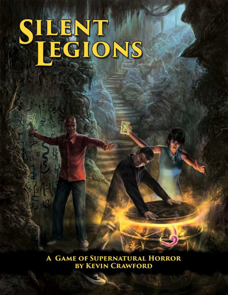

Knihu mám v mäkkom veľmi peknom farebnom obale. Má 185 strán a je rozdelená do 8 kapitol. Na vnútorných ilustráciách sa podielala skupina šiestich autorov. Sú čiernobiele a podľa mňa veľmi pekne dopĺňajú autmosféru knihy. Jedna z mála vecí, čo mi na knihe vadila pri prvom čítaní, je malý font. Písmená sú skutočne malé a tak, i keď sa zdá, že kniha má len 185 strán, číta sa, ako by bola aspoň dvakrát taká veľká. Pri druhom čítaní, keď sa preskakujúú odstavce, ktoré si človek pamätá, tak som si malé písmená začal vážiť. Bola to dobrá voľba. A najlepšie je to vidno pri treťom a hocijakom ďalšom čítaní, keď sú najpodstatnejšie jednotlivé tabuľky. A tých je tam celkom dosť.

Ale porade. Prvé dve kapitoly sú o samotnom systéme. Je veľmi podobný systému Stars Without Number. Má dokopy asi 30 strán a dve kapitoly. Vytvorenie postavy a samotný systém. Systém má pri tom len 10 strán, ktoré sú na jednej strane zhrunuté. Je to old-school systém, ktorý mne osobne moc nesedí. Ale táto kniha nie je o ponúkanom systéme. Je práve o tých ďalších kapitolách.

O čo teda autorovi pri jej písaní išlo? Vytvoriť pomôcku pre GMa na generovanie dobrodružstiev typu sandbox. V jednoduchosti, vytvorenie priestoru a osadenie ho jedinečnými entitami a kultmi.

Či už sa GM rozhodne hrať podľa pravidiel Silent Legions alebo použije nejaké, ktoré sú mu bližie, od nasledujúcej kapitoly sú preň samé užitočné informácie. Tretia kapitola sa venuje mágií. Tú síce rozdeľujú na sivú a čiernu, pričom pre potreby systému Silent Legions sivú môžu používať hrdinovia. Čierna je však tá zábavnejšia. Tá, ktorá je prístupná len tým, ktorí sú ochotní pre moc spraviť toľko, že prestávajú byť hratelné postavy. A tu, v tomto okamihu začína krása obsiahnutá v knihe – tabulky. Hodom k8 sa určí základný efekt a ďalším hodom k8 sa určí špecializácia efektu. Ako príklad uvediem (2) _It summons a desired entity_ a ďalším hodom (2) _Conjures a minor supernatural slave_. Ďalšími hodmi k4, k6, k8, k10 a k12 sa určí sila kúzla, potrebné komponenty, miesto i nejaká forma slov, ktoré by mohli pomôcť pri pomenovaní kúzla.

Keď som sa dočítal do tejto časti knihu, mal som na jazyku otázku – „Prečo sa to tak zozložiťuje?“ Nejak som nevedel pochopiť, prečo by som mal stráviť polhodinu nad generovaním 2–3 kúziel. Ale čítal som ďalej a ... však uvidíte.

Záverom kapitoly o kúzlach sú okultné schopnosti ako napríklad telekinézia, čarodejníctvo, predvídanie a podobne. Je ich osem a každá ma silu od 0–4. Je to zaujímava možnosť pre niektoré družiny alebo pre NPC.

Ďalšia kapitola sa venuje vytvoreniu Mýtickej bytosti a začína krásnou úvahou nad možnými témami – kozmicizmus, násilie, šialenosť, zlomyselnosť, gnosticizmus – a ako pomocou nich navodiť správnu atmosféru. Mne osobne sa veľmi páčilo, ako boli tieto témy popísané. Ak si GM vyberie nejakú tému, nasleduje generovanie panteónu bohov, ktorý vplývajú na sand­box. Niekoľkými hodmi vygenerovaní bohovia zo svojimi cielmi, vzťahmi medzi sebou, portfóliom, módmi sú veľmi solídny základ pre dotvorenie prostredia kultistov, ak to bude treba. Autor sa ale nezastavuje pri bohoch. Nie predsa každý ich tam chce mať. A pokračuje mimozemšťanmi, ktorí by tajne mohli ťahať za nitky diania sandboxu. Zas sa hodí kockami a zodpovedajú sa otázky ako „Prečo sú tu?“, „Prečo o nich svet nevie?“, „Aká je ich najväčšia robota, ktorú na zemi odviedli?“, „Aký je ich zámer?“ a podobne. Jedna tabuľka na každú kocku :-). Ak si GM poznačí odpovede na tieto otázky, znova si hodí všetkými kockami (4, 6, 8, 10, 12, 12, 20) a dostane odpovede na otázky typu „Čoho sa boja?“, „Čo si najviac cenia?“ a ďalšie z pozadia mimozemskej rasy. Na dokončenie sa odpovedá na otázky fyzického výzoru, dorozumievania, pohybu i špeciálnych schopností.

Kapitola generovania bytostí končí generovaním domovského sveta, respektíve nejakého sveta z inej dimenzie alebo snového sveta. Záleží na rozhodnutí GMa. Tabuľky rýchlo generujú veci ako prostredie, faunu, flóru, nebezpečenstvo populáciu, technológiu, ako sa spoločnosť správa, aké má hodnoty a podobne.

Generovanie aktérov príbehu by nebolo kompletné, ak by kniha neobsahovala tabuľky na generovanie kultistov. Ďalšie a ďalšie tabulky. Celkovo 18, ktoré sú podľa mňa veľmi vhodne zvolené pre to, aby mal GM dobrú predstavu o ich organizácii, moci, vplyve, zámeroch, čo dokázali, ako sa prejavujú a podobne.

Prvá polovička knihy je zakončená tabuľkami na generovanie a popisom použitia pokladov, artefaktov, magických zbraní, ochranných artefaktov, okultných grimoárov a náhodných efektov. Každá z týchto tém má 5–6 tabuliek. Ako je veľmi dobrým zvykom v knihe, GM zoberie sadu kociek, väčšinou k4, k6, k8, k10, k12 a k20, a na základe jedného hodu (každá kocka iná tabuľka) rozhodne o danom predmete. Ako je tušiť z hororového podtónu knihy, všetky tieto veci budú mať nejaké nevýhody. Alebo len môžu mať :-). To je asi škoda prezrádzať vopred.

Nasledujúcich približne 40 strán boli pre mňa najzaujímavejšie. Je v nich popísané tvorenie dobrodružstva. Vytvorenia sandbox lokácií, alebo lepšie asi povedané regiónu a osadenie ho zaujímavými popismi. Popisy sú v pravidlách zložené s priateľov, nepriateľov, schémy, čo je potrebné spraviť, neznámych problémov a komplikácii a miest, kde sa udalosti budú odohrávať. Samozrejme sú v knihe uvedené príklady. 60! A ak by ani to, čo sa dalo doteraz prečítať v knihe, nestačilo na niekoľko desiatok dobrodružstiev, autor pokračuje popisom tvorenia scén dobrodružstva. Každá zo scén je popísaná a je uvedená tabluľka s náhodným výberom k12. Majoritné scény majú dve tabuľky k12 rozlíšené podľa toho, či GM chce časovo obmedzené scény, či ide o vyšetrovanie objektov alebo ľudí a podobne. Ale k tým scénam (napíšem to po anglicky, ak ma ospravedlníte), Hook, Introduction, Investigation, Resolution ako hlavné scény pribehu. Vedlajšie sú potom – Ambush, Conflict, Escape a Respite.

Nikde nie je povedané, že si GM musí všetko hádzať a ani že musí všetko, čo je v knihe použiť. Skôr naopak. Naviac množstvo možností a výber je tak veľký, že sa asi všetko v jednej príprave ani nedá použiť. A aby toho náhodou nebolo málo, autor sa venuje i výzvam pre povolania dané pravidlami. Sú to scény, kde by mala zažiariť tá konkrétna postava. Túto kapitolu uzatvárajú dve strany, kde si, ako je to zvykom v knihe, GM hodí 7 kockami a získa buď zločin, alebo protagonistu príbehu.

Do konca knihy ostávajú len tri kapitoly. Beštiáru ani tabuľkám na generovanie mien a podobne sa nebudem venovať. Mňa zaujala kapitola o kultistoch.

Keď som na ňu narazil, divil som sa, čo tam robí. Predsa len, o generovaní kultistov sa toho v knihe píše dosť. Táto kapitola je ale o niečom inom. Je to o súboji okultných organizácií. Ako sa zlepšujú, ako získavajú zdroje, ako si zdroje uchovávajú, čo si za zdroje „nakupujú“, kúzlenie a podobne. Je to len 11stranová kapitola ale veľmi zaujímavé čítanie a pekný zdroj informácií pre špecifické questy.

Na záver by som mal dodať, že i keď je kniha písaná ako pomôcka pre generovanie (a vymýšlanie) moderných sandbox hororových questov, je plná nástrojov a postupov, ktoré sa dajú použiť nie len v širokom množstve pravidiel (možno i všetkých), ale i v rúznych žánroch a dobách. Kniha je skutočný poklad každého GMa.

A tu by som sa chcel vrátiť ku vete, ktorú som spomenul na začiatku. Či stojí za to stráviť nad generovaním 2–3 kúziel polhodinu. Sandbox, podľa návodu knihy, sa generuje ako ... prirovnal by som to k cibule. Najprv sa spraví všeobecný obal – prvá vrstva a náčrt prvého questu. Potom, podľa správania postáv, ich smeru vyšetrovania alebo pohybu v regióne alebo konfliktov s hlavnými aktérmi, GM dopracuje nižšiu a nižšiu vrstvu. V takom prípade je krásne mať nástroje, ktoré pomáhajú ísť do hĺbky príbehu, hrať sa s ním, tvoriť.

Kniha sa predáva cez drivethrurpg vo forme pdf, mobi, epub, v mäkkej i tvrdej väzbe.
