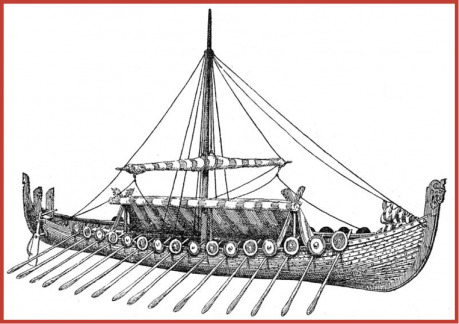
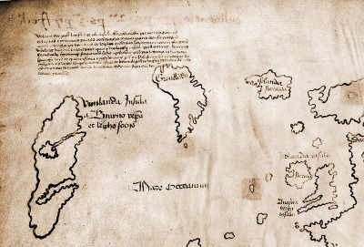

Už v minulých dílech námořního povídání jsem se snažil naznačit, že podoba současné civilizace se formovala na palubách lodí. O významu zámořských objevů snad nikdo nepochybuje, ostatně těžko by se naší civilizaci mohlo říkat (mj.) euroamerická, kdyby nebyla, hned několikráte, objevena Amerika a pojmenována po kom jiném než námořníkovi Amerigovi Vespuccim, který ji (alespoň dle svých vlastních slov) poprvé spatřil. Stejně tak dopad transoceanického obchodu nebo bitev svedených na hladinách moří není možné popřít. Nicméně mi šlo i o vliv na ducha naší civilizace, tedy význam sociálně-psychologický.

### Vikingové

Jméno je snad odvozeno od staroseverského slova vig či vik, znamenajícího fjord nebo zátoku. Označovali se tak ti příslušníci ze severských (severogermánských) kmenů, kteří měli dost odvahy a schopností, aby se obvykle v létě vydávali na náročné daleké plavby za kořistí. Nejednalo se tedy o kmen, ale spíše o kastu nebo třídu námořníků a válečníků. V Byzantské říši a ruských stepích byli nazýváni jako varjagové, ve Francii Normané, v Anglii Dáni a v Německu Ascomané.

Odvažuji se tvrdit, že specifické sociální prostředí lodních posádek napomohlo rozvoji demokracie tak, jak ji chápeme dnes. Ostatně i Řekové, vynálezci lidovlády, byli národem úzce spjatým s mořem, byť jejich námořnictví nedosáhlo proslulosti Féničanů. Ač by se na první pohled mohlo zdát, že autorita kapitánova existenci demokracie vylučuje, je třeba nezapomínat na to, že v lodní posádce má každý své místo, své úkoly, tedy i svou hodnotu, je více či méně nepostradatelný pro ostatní. Proto je třeba k jeho názoru přihlížet a zohlednit jej.

A z hlediska samotného námořnictví má pak obdobně formující postavení drakkar (ve staroseverštině dračí loď) jakožto nejznámější představitel vikinského loďařství. Nicméně není reprezentantem jediným a z hlediska dalšího vývoje loďařství ani tím nejdůležitějším, přestože byl tak říkajíc hlavou rodiny. Jako drakkar totiž byly označovány ty největší z válečných plavidel vikingů obecně zvaných langskip (z výrazu langskippet, pocházejícího z téhož jazyka a majícího význam dlouhá loď), zdobených na vazech dračími ornamenty. Snekkar (též esnecca či snekkja) označuje též langskip nadprůměrné délky, ovšem budovaný na anglické půdě, konkrétně ve Wessexu, loďaři krále Alfréda Velikého (v originále Ælfrēd, v překladu „moudrý elf“), jenž se první nazýval králem Anglie. Lze se domnívat, že k nim patřilo nemálo obyvatel z území zvaného Danelaw. Jak název napovídá, bylo to území, v jehož obyvatelstvu jutského původu se našlo dost vikinské krve na to, aby si uchovali vlastní, dánské právo. Podle některých pramenů za tuto výsadu platili mj. právě stavbou těchto lodí. K válečnému loďstvu pak patřila pomocná plavidla menších velikostí zvaná karve. Nicméně byl to bachratější bratříček elegantních válečných lodí jménem knarr, obchodní plachetnice, z níž se později vyvinula koga (anglicky cog), předchůdce anglických obchodních roundshipů či středomořských hulků.

### Proč se časopis Drakkar jmenuje Drakkar?

To jméno prý kdysi vymyslel Bifi, Jako něco, co se vrací každých pár měsíců „naloupenými“ novinkami a materiály o RPG.

Všechny výše uvedené vikinské lodě měly několik společných prvků, kterými se odlišovaly od svých „současníků“ z jiných koutů světa. Charakteristickým rysem je klinkrová obšívka způsobující zubatý vzhled trupů drakkarů. Klinkrová obšívka vzniká tak, že při zhotovování trupu lodi se klade nová řada planěk s malým přesahem na řadu předchozí (směrem od kýlu výš). Tímto přesahem se pak prožene železný čep. Oproti hojněji užívaným karvelovým obšívkám zhotovovaným bez přesahu, takzvaně na sráz, má sice vyšší spotřebu dřeva a vyžaduje důkladnější údržbu, ale je bytelnější a hlavně pružnější, což jsou vlastnosti, které se v drsnějších severských vodách neztratí.

Z plavebního hlediska neméně významným prvkem plavidel byl kýl. Tato páteř každé lodi je důležitá u všech druhů konstrukcí, ostatně právě maximální délka kmenů použitelných jako lodní kýl ovlivňovala maximální délku lodí až hluboko do devatenáctého století. Nicméně kýl dračích lodí nebyl významný jen konstrukčně. Mimochodem, snad nejdelší z nich, Dlouhý had norského krále Olafa Trygvassona, postavený roku 998, měl délku přes 48 metrů, Nelsonova Victory, možná nejslavnější bitevní loď všech dob, zbudovaná o 767 let později, byla na úrovni dělové paluby (což odpovídá délce vlastního trupu), delší jen o nějakých 7 metrů. A třeba Golden Hind sira Francise Drakea měla jen o málo víc než polovinu této délky (asi 27 m). Protažení kýlu pod úroveň obšívky prospělo i nautickým vlastnostem a rozšířilo možnosti praktického použití lodi.

Drakkary byly vybaveny jedinou příčnou plachtou zavěšenou horním lemem na jediném ráhně kolmém na kýl. Spojení ráhna se stěžněm umožňovalo v případě potřeby jeho natáčení, které se realizovalo vyvázáním dolního lemu plachty. Toto uspořádání právě ve spojení s kýlem umožnilo dokonce stoupat proti větru! Tedy plout tak, že vítr přichází z předoboku, z úhlu kolem 45 stupňů od přední poloosy lodi, pro milovníky létání z (půl) druhé či (půl) jedenácté hodiny. Pro takovou plavbu je pak kýl stejně důležitý jako plachta, neboť bez kýlu zajišťujícího směrovou stabilitu lodi by snos větrem (pohyb lodi ve směru přímého působení větru) převážil nad pracně nastoupanými metry. Plachty byly zhotovovány nejprve z různě barvených pruhů vlny, později pak z vhodnější plachtoviny.

Kýl na dračích lodích pak plnil ještě jednu funkci – chránil trup lodi při nasednutí na dno. To se (spolu s celkově mělkým ponorem) více než hodilo, protože Baltské moře je pro četné mělčiny poměrně zrádné. Stejně tak kýl umožňoval cílené nasedání na břeh při rychlém přistávání, což dalo vzniknout obávané taktice rychlých přepadů, kterou zakusila města nejen v západní Evropě, kde Vikingové plenili kde co, včetně Paříže a Londýna, ale zasáhla i opačnou stranu Starého kontinentu. Proti proudu Daugavy a dalších řek ústících do Baltského moře pronikali hluboko do ruských stepí. A to tak úspěšně, že se stali zakladateli mimo jiné například města Ladoga, ale také dynastie Rurikovců, pánů Kyjevské Rusi. Poněkud paradoxně pak působí skutečnost, že v době, kdy kogy prožívaly svou největší slávu, již z typických znaků vikinských lodí zbývaly jen vyvýšené borty na přídi a zádi. Tato zdánlivě jen estetická záležitost je velmi užitečná na zvlněném moři a zmizela až u hulků, které měly celý trup vysoký.

Přestože výše popsané oplachtění umožňovalo plavbu za téměř každého větru, byl drakkar vybaven vesly, s jejichž pomocí zdolával zejména řeky. Veslaři seděli tak, jak odpovídalo jejich naturelu válečníků, po směru plavby a za lavice jim sloužily jejich vlastní bedny. Loď nenabízela žádné pohodlí, podpalubí neexistovalo, pod podlážkou byla trocha místa na zásoby a to bylo vše. Vikingové tak byli po celou dobu vystaveni živlům na otevřené ploše. Jen nepatrně je chránily vlastní štíty zavěšené na bortech a při nejhorších rozmarech počasí pak i přehnutá plachta, která nad středem lodi tvořila vlastně jakýsi jednoduchý stan. Stejně tak loď neměla kormidelní kolo, ale ovládala se kormidelním veslem, umístěným na pravé straně zadního vazu. U něj stál kapitán, vlastník lodi a náčelník vesnice. Zbytek posádky pak byl tvořen svobodnými muži, kteří dobrovolně za podíl na kořisti vstoupili do kapitánových služeb. Vzhledem k výše zmíněným podmínkám na palubě by cokoliv jiného než dobrovolná služba nebylo možné či efektivní.

Drakkary nesoucí své vikinské posádky dopluly na západě až do Grónska a Severní Ameriky, na jihu dosáhly afrického kontinentu, kde vikingové obchodovali s Maury. Na východě pronikly družiny varjagů až ke Kaspickému moři. Cesty západním směrem, zejména popis Grónska, nazývaného Zelená země, ukazují, že v době rozmachu vikingů byla rozhodně vyšší průměrná teplota, než vládne dnes.

Drakkary nebyly přísně vzato válečnými plavidly, nedisponovaly žádnou palubní výzbrojí. Tou byli samotní vikingové, obávaní a schopní válečníci, vybavení ocelovými čepelemi a sami zocelení drsným severem. Jejich bojová zdatnost byla taková, že si je byzantští císaři najímali jako elitní vojáky tvořící jejich osobní gardu. Tak došlo k tomu, že v italské Apulii se roku 1018 utkali varjagové s Normany, tedy východní, chcete-li švédští, vikingové s vikingy (nebo přesněji řečeno jejich potomky) západními neboli norskými, toho času již usazenými v Normandii. Na konci 11. století pak Normané dobyli (mj.) Maltu z rukou Arabů. Výboje východním směrem byly prováděny spíše menšími plavidly než drakkary, protože cesta z Baltského moře do Černého znamenala přenášet lodě z Daugavy na přítoky Dněpru.

Není podle mého názoru náhodou, že vikingové, ať už se jim říkalo jakkoliv, obsadili nejen Skandinávii, ale i (či spíš zejména) Británii. Zemi, která prostřednictvím svého loďstva vytvořila o zhruba půl tisíce let později největší známé impérium vůbec. Samozřejmě, ve flotile Jejího Veličenstva Alžběty I. se již nenacházely drakkary, ale (především) galeony, jako již zmíněná Golden Hind. Nicméně to byli následnice drakkarů, průkopníků na cestě lidstva přes oceány a vysoká moře. A muži na jejich palubách dokázali, že též podědili mnohé ze síly, bystrosti, a především neskutečné houževnatosti a vytrvalosti, tedy vlastností, bez nichž by nebylo možné dovést otevřenou loď přes severní Atlantik. A muži, příslušníci britského námořnictva, si své vlastnosti naštěstí zachovali i nadále. Ač se lodě proměnily z jednoduchých dřevěných veslic v nejsložitější stroje své doby stvořené z ocele, potřebovali námořníci Jeho Veličenstva Jiřího VI. tytéž vlastnosti, aby navzdory Tirpitzu, Luftwaffe a přehršlím ponorek dopravili v konvojích PQ materiál životně důležitý pro obranu Moskvy a sovětské vojenské úsilí vůbec.

Snad je z předchozího stručného povídání patrné, že drakkary nebyly jen tak ledajaké lodě, a doufejme, že ani tento časopis nebude v příštích mnoha padesátkách vydání ledasjakým plátkem.
