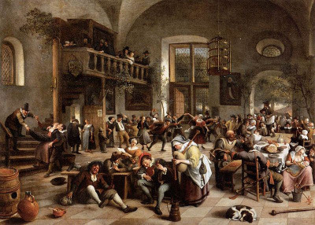

## Hostince (d100)

- 1–2 Kruhová síň. Pod dírou ve střeše je široké ohniště s roštem, kolem něj nízké lavice a stoly. Podél stěn kožesiny k odpočinku. Kde světlo ohně nedosáhne visí lampy z černého kovu.
- 3–4 Nízký strop je skrytý dýmem uzených ryb. Všechno se leskne vrstvou mastnoty. Na každém stole je hora roztátého vosku s jednou jedinou svíčkou na vrcholu.
- 5–6 Zelený mramor, rudý velveton a černý mahagon. Luxusní hostinec pouze pro sofistikované. Pódium pro básníky a herce je dekorované zlatou barvou.
- 7–8 Bývalé dojo/cvičiště. Jednopatrová budova s kruhovým dvorem a písečnou arénou ve středu.
- 9–10 Všechno dřevo je pokryté vyřezávanými dekoracemi. Sloupy jsou protahující se ženy, točité schody závodí s hady a dravými ptáky, židle jsou z peří, chapadel nebo listí, ze stropu visí lucerny, javorové listí a exotické květy.
- 11–12 Podlaha pokrytá vrstvami kůží a kožešin, stěny se schovávají za stovkami loveckých trofejí a sálu dominuje kostra tyranosaura.
- 13–14 Podzemní kaverna. Braziery se žhavými uhlíky a trollím tukem sotva zahánějí chlad a vlhkost okolního kamene.
- 15–16 Proutěný nábytek, solné svíce, vonné tyčinky, gobelíny a lapače snů. Spoře oděná obsluha. Luxusní jídlo a sladké dezerty.
- 17–18 Každá stěna i každý stůl jsou pomalované jinou pestrou barvou a každé okno má jinak barevný závěs. Číšník nosí kašpárský oděv a vřele se usmívá.
- 19–20 Židle mají až nepohodlně měkké čalounění a jednotlivé vysoké stoly jsou od sebe pro větší soukromí odděleny dřevěnými příčkami nebo pomalovanými paravany.
- 21–22 Umělecká kovařina. Židle a stoly z černého kovu, mříže v oknech. Každý kruhový stůl má uprostřed díru, olejový ohřívač a kotlík na fondue.
- 23–24 Vzducholoď držená nad zemí výpary z mon­strózního slizu, který gnómové krmí zbytky z kuchyně. Prostory jsou stísněné, ale v tombole lze vyhrát magické lektvary.
- 25–26 Místo na židlích se sedí na nízkých taburetkách. Všechno ostatní obstarávají lidé. Jídlo se podává na nahých tělech. Každý stůl má po jednom sluhovi na víno, podavači a nosiči.
- 27–28 Granitová věž. Zelený samet, křišťál a stříbro. Mnoho mezipater a připojených věžiček dostupných jen přes balkony a vnější schodiště.
- 29–30 Podél stěn zasazené solné bloky zabraňují slimákům lézt mezi hosty. Zdi jsou jimy a jejich slizkými domečky a cestičkami poseté. Slimáci mají různé barvy, velikosti a někteří jemně fosforeskují. Jsou i v jídelníčku.
- 31–32 Na stropě, mezi trámy i podél stěn je namodralý mech, dlouhonohé houbičky a nepřeberné množství rozmanitých chorošů. Jsou i v jídelníčku.
- 33–34 Dům koček. Malé i velké šelmy polehávají na svých odpočívadlech, žebrají o zbytky nebo se lísají k hostům. Rvačky jsou bestiemi ihned eskalovány v krvavé hody.
- 35–36 Budova vystavená kolem prastarého stromu. Zázemí je pod kořeny, hostinec kolem kmene a pokoje drží ve větvích. Vě větru mírné houpání a táhlé vrzání dřeva.
- 37–38 V prostorné třípatrové galerii tančí duet čínských draků. Světlé dřevo je namísto oražovým světlem svící zalito rudozelenou září jejich šupin.
- 39–40 Podlaha je podlaha a strop je taky podlaha. Jakoby někdo druhé patro otočil směrem dolů. Přechází se mezi nimi zakrouceným schodištěm, které plynule přejde z jedné gravitace do druhé.
- 41–42 Oprýskané stěny, mohutné poškrábané stoly a lavice. Hostinský má zubří hlavu. Kriplové, mutanti a čarodějové jí, pijí a bydlí první den zdarma.
- 43–44 Na stěnách jsou desítky štítů a půlmečů. Vzdej se násilného života, zlom svůj meč, přidej ho na stěnu a budeš týden bydlet zdarma.
- 45–46 Vysoká klenba a zavěšené klece s nahými tanečnicemi. Plameny krbů magickým prachem zbarveny do fialova.
- 47–48 Podlaha sestává z mnoha různé vysokých sloupů bílého mramoru. Čím výše postavený stůl tím prestižnější. Nádobí z broušeného křišťálu.
- 49–50 Lichý počet náhodně rozmístěných sloupů a stolů. Runy na stěnách a ornamenty z šedého kovu vtisknuté do trámů. Pod podlahou je slyšet tekoucí voda. Všechna magie je zde oslabena.
- 51–52 Víc čajovna než nálevna. Soukromé kóje, vodní dýmky, gobelíny, kombinace aromatických svící a zápachu narkotických hub. Jeden z nízkých stolů ukrývá vstup do cechu zlodějů.
- 53–54 Vstup kanalizačním poklopem. Prkenná podlaha nad podzemní řekou, občasný závan splašek. Pokoje rozmístěné v kanalizačních tunelech, krysomuž vás zavede k vašemu.
- 55–56 Ve středu tržiště stojí osamělé magické dveře. Vedou do hlasitého čtyřpatrového hostince s hosty všech ras a povolání. Uvnitř jsou další vchody, vedoucí do jiných měst.
- 57–58 Všechno je z kovu a rzi. Trubky, pára, ozubená kola. Vítejte u skřetích inženýrů a vynálezců. Místní pálenka způsobuje zrychlení a hyperaktivitu a dunivě paralyzující kocovinu.
- 59–60 Spartánsky strohé vybavení. Jediné dekorace na stěnách jsou kulaté štíty a mocný dlouhý luk. Kdo jej dokáže napnout, a sestřelit tři svíce ze tří stolů naráz, může si jej ponechat.
- 61–62 Příliš okatě obyčejný, uklizený a slušný hostinec. Do zvěřinového guláše dávají ve sklepě porcované žebráky.
- 63–64 Extravagantní hipster šlechta v nevkusně vyzdobeném hostinci. Tráví dny obdivováním heroických příběhů a ponižováním skutečných hrdinů.
- 65–66 Hostinský je poslední stařec z rodu létají­cích lidí. Na stěnách potrhaná rogala, ná­k­resy mechanických křídel a obrazy balonů.
- 67–68 Labyrint vinných sklepů. Skupiny gentlemanů se taktně pomlouvají a urážejí navzájem v hádce o to, čí víno je nejlepší.
- 69–70 Rozsáhlý dvůr s krásnou zahradou. Skleníky, slunečníky, pestrobarevné květy. Propletené stromy nesou exotické plody s afrodiziakálními účinky.
- 71–72 Hliněná povápněná podlaha, špalky místo židlí, stoly z fošen. Pivo k nerozeznání od špinavé vody, k jídlu jen žitné placky.
- 73–74 Úzké půlsloupy podél stěn, mezi nimi vysoká zrcadla. Iluze obrovského prostoru. Optickým klamem je za jedním ze zrcadel skryt vchod do sadomaso salonu.
- 75–76 Hosté mohou platit i věcmi a lokál funguje zároveň jako bazar. Mezi vším harampádím je v čestném místě nad dvěřmi zlatý lektvar s cedulí „Vypít v případě konce světa“, který vrátí jednoho člověka o 7 dní zpět v čase.
- 77–78 Došková střecha a stěny z vrstvené kůže vestavené do kostry obrovského draka, který na tomto místě zemřel před mnoha lety.
- 79–80 Kdysi sídlo šlechtického rodu. Vysoké klenuté stropy, zářivé lustry, koberce, portréty, tajné chodby, dekorativní zbroje a erby, prázdný trůn v čele.
- 81–82 Vnější nosná zeď, okna i dveře jsou z kovu a hostinec se každou noc uzamyká v nedobytnou pevnost.
- 83–84 Nedávno vyhořelá hospoda. Zoufalý stav. Hostinský nabízí tomu, kdo přispěje na rekontrukci, pojmenovat lokál po něm.
- 85–86 Poltergeist. Občasný ledový průvan, mizící nebo přemisťující se předměty, několikasekundová posednutí. Hostinský všechno tají a vymýšlí výmluvy.
- 87–88 Dílo iluzionisty. Zlato a diamanty, křišťálové lustry, bronzově lesklé tanečnice. Každé okno jiný dechberoucí výhled.
- 89–90 Titanic. Nikdy nedokončená obří loď sedí v přístavu a namísto plavbou, sbírá slávu divokými mejdany.
- 91–92 V kruhu kovových mříží se tísní chapadlovitá bestie. Platíš jen pití a nocleh, jídlo je zadarmo, smaží tu kusy stále dorůstajících chapadel.
- 93–94 Koberce hustého trávníku, nábytek tvarovaný z živých stromů a keřů. Ze stropu visí všechny druhy ovoce. Obsluhují desítky víl s kolibřími křídly.
- 95–96 Modbidní výzdoba. Železná pana, skřipec, další mučící nástroje, biče, provazy, řetězy, katovská sekyra, nepohodlné židle, rudě žhnoucí braziery.
- 97–98 Postaveno ze zbytků po nedávné katastrofě. Stěny z různých materiálů, kóje pro hosty z polámaných vozů a kočárů. Hrnce a džbery pod děravou střechou.
- 99–00 Nomádský půlelfí hostinec. Cirkusový stan, exotické jídlo a pití, luxusní vybavení, autorská čtení, úžasná kapela.

## Lidé v hospodách (d100)

- 1–2 Žoldnéř hledá práci.
- 3–4 Vědma za pár stříbrňáků věští budoucnost.*
- 5–6 Fešák v barevném kabátu nenápadně nabízí drogy.
- 7–8 Čerstvě proměněný upír hledající svou první oběť.
- 9–10 Stařenka, která pořád dokola opakuje nějakou praktickou informaci jako “Nezapomeň chlapče, na vlkodlaka musíš stříbrem”
- 11–12 Děvka, která postavu svede a platby se dožaduje až po aktu.
- 13–14 Zlomyslný mim čekající na správně ironický moment k brutálnímu masakru.
- 15–16 Cikánská kapela. Po stole se točí bosé dívky s lesklými penízky všitými do dlouhých sukní?.
- 17–18 Skvělý bard vypráví příběh z historie města.
- 19–20 Děsný bard střídá ušidrásající tóny s urážkami vybraných hostů (tlustí, chudí etc.)
- 21–22 Opilý trpaslík přišel o svoji družinu a snaží se z žalu vyvolat bitku.
- 23–24 Alchymista baví hosty chemickými reakcemi. Prodává levné lektvary s vedlejšími účinky.
- 25–26 Nafintěný snob. Dozajista dříve či později urazí někoho, kdo si to nenechá líbit.
- 27–28 Kněz pojídá svou skromnou večeři a snaží se lidem promlouvat do duše.
- 29–30 Malíř nabízí zvěčnění v podobě portrétu.
- 31–32 Mohutný shrbený ork s tupým výrazem tiše přijímá urážky ostatních. Vidíte, že se chystá vybuchnout.
- 33–34 Tajemný bojovník s vysokým kloboukem a mnoha drobnými vynálezy a proprietami k lovu čarodějnic.
- 35–36 Nepříjemný zápach obklopuje muže u osamělého stolu. Byl mrtvý, procházející nekromant jej oživil, a teď tu spí. Když se náhodou probudí, tak místní rychle odchází.
- 37–38 Degustátor a kritik. Hostinský zaplatí za jeho zastrašení.
- 39–40 Král v převlečení trávící čas mezi obyčejnými lidmi.
- 41–42 Extrémně vlezlý sirotek. Vyleští někomu boty a tvrdí, že jste přátelé nadosmrti.
- 43–44 Zoufalá žena se snaží rychle spřátelit se silným mužem. Zuřivý manžel ji tu brzy najde.
- 45–46 Podvodník se skořápkami. Zkušený švindlíř a zloděj. Při kontaktu s družinou přátelský, ale jde mu jen o zisk.
- 47–48 Muž prokletý dokonalou regenerací. Každé zranění se ihned zacelí, i usekaté končetiny rychle dorůstají. Za úplatek si můžete vyzkoušet jaké to je někomu vydloubnout oko nebo zlomit ruku.
- 49–50 Pěstounští rodiče s půlelfí dívenkou, princeznou Azurové pláně, Dítětem osudu a Slzou severu.
- 51–52 Projíždějící obchodník. Prodává se čtvrtinovou slevou 1-oblečení 2-exotické pokrmy 3-zbraně a zbroje 4-okultní potřeby 5-otroky 6-vynálezy
- 53–54 Gnómští a liliputí wrestleři se hádají, kdo je drsnější.
- 55–56 Stařec prodává prameny ze svého zářivě stříbrného plnovousu. Prý nosí štěstí.
- 57–58 Ztracené dvojče jedné z postav sotva družinu uvidí, začne utíkat. Je to zloděj s dobrým srdcem, ale rozhodně se nebude chtít vzdát svého meče, který zdědil po otci.
- 59–60 Temný kněz v přestrojení láká lidi ke kultu.
- 61–62 Morbidně obézní štamgast. Smrdí, šišlá, pořád žere, ale místní ho milují. Má odhad na lidi a vždy dobře poradí.
- 63–64 Ukecaný papoušek nebo havran.
- 65–66 Gentleman v oživlém obrazu.
- 67–68 Skupina utahaných dřevorubců. Stěžují si na nebezpečí v lese a zhoršující se gobliní útoky.
- 69–70 Neviditelný muž.
- 71–72 Hostincem najatý diskutér. Vyhlíží u návštěvníků spory, vstupuje do debaty a pomáhá je vyřešit.
- 73–74 Břichomluvec. Ve skutečnosti je figura živá.
- 75–76 Přibíhá blondýna v kožené zbroji, a snaží se vydražit šíp, který nikdy nemine cíle.
- 77–78 Měšťanka, která se marně snaží dostat do vyšší vrstvy, tu v opilosti popisuje šperky a cennosti svých kamarádek.
- 79–80 Dva básníci se hádají, jestli existuje láska na první pohled.
- 81–82 Holohlavý muž tvrdí, že umí číst myšlenky, a nabízí dvě služby - prozradí tajemství všech hostů nebo bude mlčet. Možnost, na kterou se vybere víc peněz, uskuteční.
- 83–84 Vyhublý kovářský tovaryš nabízí broušení mečů zázračným brouskem.
- 85–86 Královský herold vyhlašuje nový zákon.
- 87–88 Snědá alchymistka vyhlíží schopné cestovatele a pokouší se je najmout na získání vzácných surovin.
- 89–90 Tlustý obchodník v předstírané opilosti rozhlášuje protivládní a rebelská hesla.
- 91–92 V rohu sedí automaton skrytý pod mnišskou kutnou. Jakákoli elektrická nebo magická energie v hostinci by ho mohla nabít a probudit. Bude hledat svého tvůrce, kterého mezitím popravili za zakázanou magii.
- 93–94 Stráže se sem chodí denně najíst a napít. Platí jen výhružnými pohledy.
- 95–96 Dva dobrodruzi se začínají hádat a při následné rvačce mezi sebou roztrhnou mapu pokladu.
- 97–98 Špinavý chlapec flétnou hypnotizuje hada. V potrhaném klobouku má několik měďáků. Flétna umí kontrolovat i lidi.
- 99–00 Trojice rozjařených krásek platí hrstmi zlaťáků. Po nocích pomocí magie vykrádají pokladnice bohatých.

## Hospodské hry (d20)

1 V kostky.

2 Souboj v zírání.

3 Souboj ve zpěvu.

4 Znalostní soutěž.

5 Závody v jídle nebo pití.

6 Pojídání iskandarské bonboniery.

7 Džbery vody a závody v zadržení dechu.

8 Silové soutěže jako páka nebo přetahování.

9 Flaška. Buď řekneš pravdu nebo splníš ponižující úkol.

10 Psí zápasy. Pokud ne přímo v hospodě, tak před, pod nebo za.

11 Sofistikovaný stolní labyrint včetně pastí a otočných částí pro závody myší nebo brouků.

12 Soutěžící holýma rukama staví sloupy z žhnoucích briket. Čas je omezený, pád vyřazuje a nejvyšší vyhrává.

13 Vrhání nožů na terč. Většinou jej drží pomocník nebo služka, aby se odradila účast nezkušených, a hra zůstala napínavá.

14 Poker (Texas hold &apos;em) s obdobou tarotových karet. Věta, která z vítězné ruky vzejde je skutečné a platné proroctví.*

15 Oslepení protivníci jsou před pěstním soubojem dvacetkrát otočeni na místě. První se třemi částmi těla na zemi prohrává.

16 Legendární obchodník ve zlatavém oděvu vyhlašuje závod o truhlu zlata. Rozdá dvanáct map. Jediné pravidlo je, že nejsou žádná pravidla.

17 Nazí protivníci vylezou na velký stůl a každý dostane metr konopného lana. Nesmí se navzájem dotýkat, jen mrskat lanem. Kdo spadne ze stolu, prohrál.

18 Soutěžící se střídají ve společném vyprávění příběhu. Začíná se na jednom a s každou výměnou se věty o slovo prodlužují. Kdo se splete, zakoktá nebo zaváhá, prohrál.

19 Magické šachy. Figurky jsou z oživlého porcelánu a opravdu bojují. Vyřazená figurka lze vrátit do hry jen za pomocí vlastní krve. Šachista, který omdlí nebo ztratí krále, prohrává.

20 Beer Pong s bronzovými poháry, purpurovým vínem a krysíma očima. Víno se pije do dna, včetně oka. Hostinský má pod páskou svraštělé oko, kterým vidí vše, co vidí lidé, kteří pozřeli jeho krysí oči.

---

* Proroctví vymyslete společně – stačí libovolná náhodná věta jako „Klíč je v červené botě“ nebo „Zamiluje se do tebe generál“. Později může proroctví aktivovat jak hráč, tak vypravěč, pokud mu odpovídá herní situace. Hráči se vyplatí vypravěče předbehnout, protože každé proroctví se vyplní jen jednou a od vypravěče může mít zlomyslný twist (např. generál kanibalů nebo červená bota arcimága).

