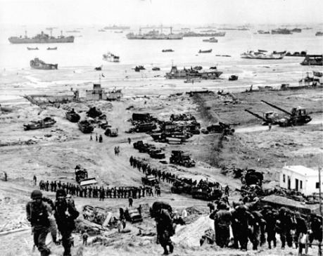
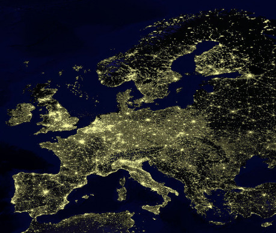
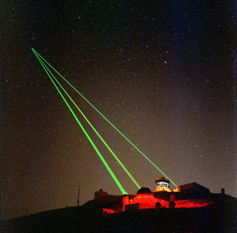
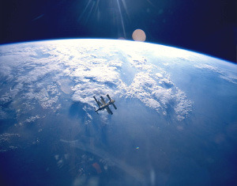
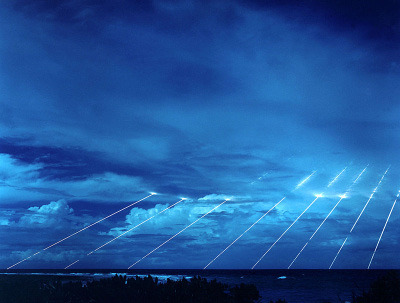
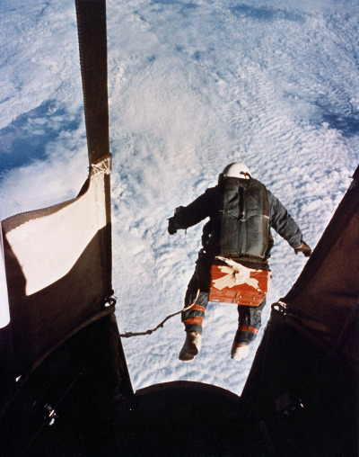
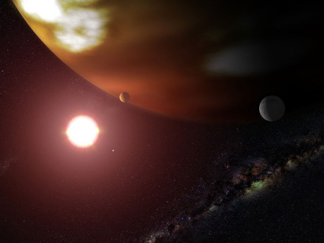

V první části tedy rozeberu spaceoperovou invazi z pohledu „space techna“ a ve druhé části se pokusím složit představu, která by v takovém světě mohla fungovat. Výchozí myšlenka bude stejná jako ve zmíněném článku, tedy útok flotily lodí jedné planety proti druhé planetě, jež je technologicky na podobné úrovni, přičemž útočník má svou armádu připravenou, obránce útok očekává a je na něj připraven, i když jednotlivé aspekty ho mohou překvapit. Útočníkovi jde o obsazení planety, nikoliv o její zničení či způsobení její neobyvatelnosti.

Pro představu o takové invazi se musíme podívat na nějaký reálný vzor. Spaceoperové invaze vychází v zásadě z představy námořních vyloďovacích operací a v tomto případě není lepšího vzoru než operace Overlord, tedy vylodění armád Spojenců ve Francii roku 1944. A zde uvidíme první problém. Overlord zahrnoval pět tisíc lodí a milion mužů, což jsou obrovská čísla. Ostatně, když se podíváte na fotky, opravdu uvidíte moře plné lodí a pláže plné vojáků a techniky. Použít na planetární invazi pět tisíc lodí a dostat na zem milion mužů by byl neuvěřitelně komplikovaný úkol. Jenže… vezměte si dostatečně velký glóbus. Najděte na něm Evropu a následně Francii. Položte na ni prst (možná že ji zakryjete celou). A teď si uvědomte, že někde pod vaším prstem se nachází Normandie, na kterou celá ta tisícovka lodí a milion vojáků mířila. Zbytek světa je nepokrytý. Dále se můžete podívat, jak daleko bylo z pláží Francie do Berlína – tato invazní armáda potřebovala celý rok, aby se dostala tak daleko, a to jen díky tomu, že na východě postupovala mnohem větší Rudá armáda opačným směrem.

Pokud se přidržíme vojenské poučky, že v armádě může sloužit zhruba 10% práceschopného obyvatelstva a že by útočník měl v místě útoku dosáhnout převahy nad obráncem zhruba 3 : 1, aby měl rozumnou šanci na úspěch, vyjde nám, že invazní armáda na současnou Zemi by měla mít zhruba dvě miliardy (!) vojáků a odpovídající techniku počítající se na statisíce. Reálně by šlo o zdroje dalších minimálně tří až pěti obdobných planet. Ani v případě, že byste sci-fi vojáky budoucnosti pro účely invaze pokládali za 10× nebo 100× výkonnější než dnešní vojáky, si nijak nepomůžete, protože počty stále vychází minimálně dvacetinásobné než pro vylodění ve Francii, v případě techniky by mohlo jít o sto tisíc (kosmických) lodí, což vyžaduje neuvěřitelné množství zdrojů.

Pokud chceme uvažovat o skutečně uvěřitelné planetární invazi, je zřejmé, že rozsah obydlené oblasti i počet obyvatel v cíli budeme muset o několik řádů snížit. Technologická úroveň nijak zásadně nesnižuje potřebný počet vojáků – například Napoleon útočil na Moskvu s půl miliónem vojáků a 1300 děly, o 130 let později měl Hitler milión vojáků, 1500 tanků, 500 letadel a 15 000 děl, nicméně ani přes tento početní nárůst a obrovský technologický pokrok nedosáhl o nic lepšího výsledku.

Příprava operace Overlord se počítala na desítky měsíců, nebo spíše na roky. Přitom šlo o oblast vzdálenou jen několik desítek minut od základen útočníka, který mohl provádět fotografický průzkum i vyloďovat speciální týmy zkoumající únosnost terénu. Také šlo o okupovanou oblast, ve které obyvatelé ve velké míře spolupracovali s budoucími útočníky. Byly pořízeny miliony fotografií a sepsány tisíce zpráv o jednotlivých místech vylodění i obranných postaveních. Agenti útočníků pracovali přímo na obranných stavbách a dodávali o nich poměrně přesné informace.

Pokud bychom se opět přenesli na Zemi, očekávající útok z vesmíru, bylo by třeba prozkoumat mnohem větší oblasti vylodění a hlavně zjistit stav planetární obrany. Vzhledem k tomu, že různé základny mohou být snadno umístěny v pustých oblastech Ruska, Číny, USA, Afriky, Austrálie nebo Anktartidy, nikoliv prakticky na obydleném pobřeží, zjišťování informací o obranných postaveních by bylo mnohem náročnější, v řadě případů prakticky nemožné, leda by obyvatelné napadené planety masově spolupracovali s útočníkem. Další možností je předpokládat, že planeta má jedinou vládu, nebo alespoň centrální velitelství planetární obrany, ze kterého by se plány obranných postavení daly získat snáze.

Pro úspěch operace Overlord bylo nezbytné, aby si nejvyšší velení obránce myslelo, že vylodění proběhne jinde, než skutečně proběhlo. Na tuto klamnou operaci bylo vydáno úsilí srovnatelné s prostředky na přípravu vylodění. Bez tohoto klamu by se vylodění nemohlo prakticky povést. V případě planetární invaze není samozřejmě možné tvářit se, že vylodění proběhne na jiné planetě. Útočník by tedy musel předstírat, že se vylodí v jiných oblastech, než které by měl v plánu, a ještě by musel zajistit, že se mu podaří jeho výsadek koncentrovat, zatímco obránce nebude mít na daných místech obranné prostředky ani je nedokáže dostatečně rychle přesunout. Výsledek celé této přípravné fáze je ale mnohem nejistější, protože už samotné získávání informací jasně ukazuje, že probíhá příprava na invazi, a celá planeta se brání mnohem lépe než pobřeží Francie, jak si ukážeme dále.

Dalším, často opomíjeným faktorem je čas. Overlord mohl uspět díky tomu, že přeplout La Manche je otázka několika hodin a dá se to zvládnout za jednu noc. Přesunout invazní armádu z jedné planety na druhou je ale otázka několika měsíců, přičemž startovací a cílová okna jsou definována ještě striktněji než požadavek dobrého počasí s úplňkem a vysokým přílivem. Zformování útočné armády na planetě útočníka bude zřejmé dlouho dopředu, a jakmile se obránci dozví o vyslání útočné flotily, bude naprosto jasné, kdy dosáhne cíle i po jaké trajektorii se bude pohybovat. Vesmírná mechanika neumožňuje žádný velký (vlastně prakticky žádný) výběr cesty. Existuje nejméně energeticky náročná varianta a jakákoliv odchylka od ní znamená nárůst paliva, což omezuje užitečný náklad, už tak malý v porovnání s potřebným palivem. Start flotily by se dal utajit jedině v případě, že obránce nebude mít na planetě útočníka ani jednoho agenta schopného vyslat zprávu. Přitom paradoxně neexistuje šance „letět v noci“. Ačkoliv let útočné flotily bude probíhat v temném vesmíru, flotila se nemá jak ukrýt před pozorovatelem, který ví, kdy a kam se dívat a co má hledat. Stačí tedy jedna zpráva z planety útočníka a obránce je varován měsíce dopředu.

Existuje samozřejmě i jiná varianta – totiž útok nikoliv z planety na planetu, ale z planety na její měsíc nebo z jednoho měsíce větší planety na druhý. Tam už lze dosáhnout doletových časů v řádu dní a v jistém smyslu i překvapení obránce. V případě dvou měsíců na oběžné dráze velké planety může pak tato planeta po část doby blokovat přímé vysílání, případně její nestabilní elektromagnetické pole může rušit meziměsíční vysílání.

Když se útočná flotila „vynoří“ u cílové planety, měla by nastat vesmírná bitva, ale nejspíše nenastane. Útočit na bitevní lodě vlastními loděmi ve stylu námořních bitev 18.–20. století je sice efektní, ale jinak příliš nákladné, nebezpečné a neúčinné. Pro útok ve vesmíru nejsou třeba žádné lasery, paprskomety, railguny nebo atomovky. Na zničení libovolné kosmické lodi stačí dostatečně hmotný kus kompaktního železa, jehož hmotnost může dosahovat třeba desetiny promile hmotnosti svého cíle. Tunový kus kovu, který se několik set kilometrů před cílem rozdělí na tisíc kilogramových šrapnelů, dokáže bez problémů zlikvidovat deset, s trochou štěstí sto, ale třeba i tisíc lodí. Stačí jen, aby byla vzájemná rychlost dostatečně vysoká, protože neexistuje materiál ani konstrukční uspořádání, které by ustálo náraz kilogramového kusu oceli při rychlostech okolo 10 až 30 km/s. Zasažená loď se následně sama stane druhotným zdrojem trosek, které mohou zasáhnout a poškodit další lodě nebo je alespoň přinutí manévrovat. Vzhledem k tomu, že ve vesmíru neexistuje nic jako „drobné poškození“, protože kosmické lodě jsou konstruované prakticky na hranici možností materiálů i spolehlivosti, a manévrování spotřebovává palivo, což sebou nese nutnost další spotřeby paliva na návrat k původnímu kursu, může poškození 10 % lodí rozbít celý útok. Tyto kinetické projektily přitom prakticky není jak zastavit, a to i v případě, že by se je podařilo zjistit včas. Laser je nemá jak zničit, ostřelování jen vytvoří další mračna trosek. Jedinou nevýhodou je nutnost poměrně přesného navedení na kolizní kurs a z toho plynoucí úpravy dráhy nosiče střel. Nicméně jedna raketa dokáže na kolizní dráhu vynést statisíce projektilů různých hmotností, takže šanci na zásah lze značně zvyšovat. Čím blíže k cílové planetě, tím větší šance na zásah. Pokud by snad došlo k použití takové zbraně na oběžné dráze okolo planety, nemají útočníci žádnou šanci – i pokud se projektilům jednou vyhnou, za několik desítek minut jim musí čelit opět – a znovu a znovu a znovu, ať už budou stále naváděné, nebo půjde jen o mrtvé kusy kovu. Předpokladem použití této taktiky je včasná příprava, tedy vyslání nosné rakety s projektily na oběžnou dráhu, aby zde byly připraveny. V principu je to ale stejný způsob přípravy jako vybudování laserových nebo railgunových základen.

Ostatní zbraně způsobující destrukci jsou ve vesmírném boji o řád méně účinné a lze se proti nim i snáze bránit. Alternativou jsou pak nedestruktivní zbraně, různé verze EMP a podobně. I u nich je však jednodušší vyslat je v podobě autonomních naváděných střel než vystřelovat z osádkou ovládaných lodí.

Pro bránící se planetu nebo měsíc je však boj na vlastní oběžné dráze prakticky vždy nevýhodný, ať dopadne jakkoliv. Pokud totiž během boje dojde na ničení jakýchkoliv lodí na oběžné dráze, jejich trosky se rozhodně nerozptýlí neškodně v prostoru, ale právě naopak. V lepším případě dopadnou na povrch planety, kde můžou způsobit značné škody. V tom horším pak budou po následující desetiletí či staletí blokovat různé oběžné dráhy, čímž učiní další kosmické cesty, dlouhodobé fungování satelitů a orbitálních stanic obtížné, nebezpečné nebo nemožné. Pro obránce by tedy bylo nejlepší zaútočit na invazní flotilu dříve, než tato provede parkovací manévr na oběžné dráze, aby trosky v nejhorším případě jen prolétly kolem planety. Jakmile se flotila opravdu dostane na oběžnou dráhu okolo planety, obránci bitvu ze strategického hlediska prohráli, a to i v případě, že útočníky zcela rozdrtili.

Flotila na oběžné dráze nemá moc možností, jak proti planetě zasáhnout. Je třeba uvědomit si jednu zásadní věc – pokud by se nějaká loď chtěla držet nad jedním místem planety, potřebovala by v případě Země udržovat vzdálenost asi 35 tisíc kilometrů. Při „rozumných bojových vzdálenostech“ okolo 50 až 200 kilometrů obletí lodě planetu za několik desítek minut až několik málo hodin. Zastavit v této vzdálenosti na jednom místě (přesněji nad jedním místem) planety je z hlediska potřebné energie stejný rozdíl jako byste letadlovou loď zaparkovali v Perském zálivu nikoliv na hladině moře, ale metr nad hladinou. První věc je jednoduchá. Druhá nemožná. Čím blíže k planetě, tím rychleji ji budete oblétávat.

Orbitální bombardování je možné s přesností několika kilometrů. Vstup do atmosféry musí probíhat v poměrně úzkém rozsahu trajektorií. Při příliš nízkém úhlu hrozí, že se projektil (nebo výsadkový modul) odrazí od atmosféry, při příliš strmém vstupu bude projektil bržděn příliš rychle a shoří dříve, než se dostane na povrch. Každá sekunda zpoždění znamená posunutí bodu dopadu v řádu kilometrů, takže možnost dodatečného manévrování po vstupu do atmosféry bude nezbytností i v případě bombardování plošných cílů. Také atmosférické proudění může mít velký vliv na přednost. Zasahovat bodové cíle jako stanoviště plantární obrany je prakticky nemožné.

Pokud by v bitvě byly použity paprskové nebo projektilové zbraně, tahá invazní flotila za kratší konec. Na povrchu lze rozmístit více obranných zařízení, dodat jim více energie, chránit je účinnějšími materiály, které nemusí být kompromisem mezi hmotností a odolností, planetární obrana má lepší možnosti chlazení a může vést palbu ve větším rozsahu úhlů. Navíc jak flotila bude kroužit okolo planety, mohou na ni vést palbu jednotlivá stanoviště postupně, zatímco flotila se s nimi musí vypořádávat. Lodě na oběžné dráze nelze nijak zamaskovat na rozdíl od obranných postavení na povrchu. Pokud by lodě začaly používat zbraně hromadného ničení, zřejmě by došlo na použití kinetických projektilů proti nim i za cenu „zaneřádění“ vlastní oběžné dráhy. Navíc čím více infrastruktury zničí, tím obtížnější bude její opětovné uvedení do provozu.

Ještě méně šancí na boj mají vesmírné stíhače. Ve vesmíru je malá loď s lidskou osádkou zbytečnější než velká, protože udržení a ochrana životních podmínek pilota zabírá zbytečnou váhu, kterou v případě počítačem řízené stíhačky lze využít na zbraně. Navíc ve vesmíru není co stíhat, naváděné střely poslouží lépe. V atmosféře se pak vesmírné stíhačky nedají použít z jednoho prostého důvodu – musí být zkonstruované tak, aby přežily vstup do atmosféry, pokud planeta nějakou má, což znamená hmotnost navíc. Pokud atmosféru nemá, potřebují palivo na zbrždění – hmotnost navíc. Ve srovnání s atmosférickými stíhačkami budou vždy těžší a méně obratné, aniž by se to projevilo zvýšenou výzbrojí. Jedinou jejich výhodou je rychlost při prvním přiblížení, které se ale budou muset zbavit, aby vůbec mohly manévrovat.

Dostáváme se k samotnému výsadku. Dostat živé lidi z orbity na zem je spojení vědy, techniky a štěstí. Dopadové zóny se měří na kilometry čtvereční, když jde všechno přesně podle plánu – v situaci mimo boj, kdy má sestupující modul veškeré potřebné informace. V případě shození z vesmíru znamená každá sekunda zpoždění a každá odchylka ve směru nebo síle zážehu posun přistávacího místa o celé kilometry. Problémy jsou stejné jako u projektilového bombardování – úhel vstupu do atmosféry a z toho plynoucí přistávací trajektorie jsou striktně limitované. Šance dostat na zem dostatečně velký výsadek pohromadě existuje pouze v podobě dostatečně velkých výsadkových modulů, které pojmou jedno bojeschopné družstvo. Dostat na zem více takových bojeschopných družstev poblíž sebe – tedy v řádu kilometrů – je umění. Dostat jich k sobě dost, aby útočníci dokázali přečíslit obránce, je prakticky nemožné. I v případě, že osádka modulu přežije přistání bez zranění, ještě nemá vyhráno. I v civilizované krajině je dost možností, které jí zabrání opustit výsadkový modul – přistání do řeky, strže nebo rozoraného pole jsou to nejmenší. Manévrovací zařízení snižuje užitečnou hmotnost a obratnost manévrujícího modulu bude stále o řád horší než obratnost atmosférických stíhaček. V člověkem nedotčených oblastech může i úspěšné přistání znamenat ztrátu osádky, která se z dané oblasti nedokáže v rozumném čase dostat. Obránci můžou sestupující kapsle sledovat na radarech a vypočítávat dopadová místa, během zpomalení či po přistání je vyhledávat letouny a ničit běžnými zbraněmi. Výsadkáři, kteří toto přežijí, budou potřebovat orientační a naváděcí sytém. Mapy a plány vytvořené podle satelitních fotografií navzdory běžné představě nejsou pro pohyb v terénu dostačující a bez vlastního navigačního systému se výsadkáři mohou snadno ztratit. Nicméně lze předpokládat, že doba předcházející válečnému konfliktu poskytne útočníkům alespoň dostatečně přesné offline mapy.

Jen krátce se zastavím u oblíbených energetických zbrojí. Detailní rozebírání nefunkčnosti takového konceptu není obsahem tohoto článku, ale stručně lze říct, že pokud voják ve své zbroji nedokáže zalehnout, překonat překážku do výše hrudníku, rozmoklý terén a hlavně projít dveřmi pro běžného člověka, je mrtvý už v okamžiku vysazení. Pokud byli vojáci cvičeni na jiné planetě a nemají zkušenosti s místním prostředím, můžou narazit na zásadní rozdíly v přírodních i umělých krajinných prvcích.Proti místním vojákům jsou pak vždy v nevýhodě.

Dále je nutno podotknout, že výsadkové moduly jsou stylem použití na obdobné úrovni jako druhoválečné výsadkové kluzáky. Jakmile přistanou, jejich použití skončilo a v žádném případě nelze uvažovat, že by z planety dokázaly odstartovat. Jedinou šancí na takový koncept by byl měsíc bez atmosféry, ale i v takovém případě by palivo potřebné pro opětovný start tvořilo zbytečně velkou neužitečnou zátěž. Výsadkáři mají celkem jistotu, že pokud se výsadek nepodaří, zůstanou na cizí planetě bez možnosti návratu a žádný transportní člun se se zraněnými nevrátí zpět na mateřskou loď. Zde je dobré podotknout, že invazní lodě stejně nebudou mít palivo na cestu zpět na domovskou planetu. Jízdenka na planetární invazi je z podstaty věci jednosměrná. Útočníci buď uspějí, nebo budou zajati či zabiti. Není cesty zpět.

Limitní je pro útočníky nutnost zásobování. Operace Overlord byla uskutečnitelná jen díky tomu, že byly na břehu Normandie vytvořeny umělé přístavy, v nichž zásobovací lodě neustále vykládaly další zásoby, a přes kanál bylo nataženo potrubí, kterým se útočníkům dodával benzín. Současné armády stále tomuto omezení podléhají, ale lze předpokládat, že bojová technika budoucnosti může být poháněna miniaturními reaktory se zásobou paliva na několik měsíců fungování a při větším použití energetických zbraní nebo alespoň elektrického vystřelování projektilů se sníží nároky i na zásobování municí. Navigační a komunikační nástroje útočníků budou vyžadovat velkokapacitní akumulátory nebo malé zdroje energie. V případě lidských vojáků zůstává nutnost zásobování vodou a potravinami – voda je v tomto směru důležitější a velmi záleží na možnosti jejího doplnění přímo na povrchu se všemi souvisejícími riziky. Vozit z jiné planety dostatek vody pro zásobování útočících jednotek je z vojenského hlediska neúnosné.

Řadu těchto problémů lze odstranit použitím autonomních nebo propojených robotických bojových strojů různého vzhledu a účelu. Kromě toho, že snesou vyšší teploty při přistávání a větší náraz při dopadu než lidé, nevyžadují žádnou podporu života během dopravy a výsadku, potřebují ke svému fungování pouze energii (a případně munici), mohou bojovat i v případě vážného poškození a jejich bojové výkony nebudou ovlivněny psychologickými aspekty (třeba zničením celé výsadkové flotily). Sice nedokážou oblast skutečně obsadit a může se projevit omezení v umělé inteligenci, ale pro první výsadek budou účinnější než lidští vojáci.

Pokud by se snad pozemní operace protáhly, na rozdíl od spaceoperové invaze by za kratší konec provazu tahali útočníci. Nebudou mít žádné zázemí v podobě nepotopitelné letadlové lodě jménem Británie a obránci budou disponovat řádově mnohem většími zdroji. Tuto nevýhodu lze snížit tím, že útočníci využijí kompatibilní technologii (třeba stejné akumulátory a munici) jako obránci, takže mohou využívat ukořistěné zdroje. Jakýkoliv postup na další větší města na kontinentu bude velmi pomalý – pro představu si opět vezměte glóbus, libovolnou pozemní operaci v posledních sto letech a rychlost postupu. Snadno zjistíte, že ani sto let vývoje techniky často neznamenalo žádné zrychlení pozemních operací, a pro operace v planetárním měřítku jsou současné rychlosti postupu pozemních armád příliš pomalé.

Jak vidíte, prakticky žádný aspekt „klasické sci-fi invaze“ neobstojí proti tomu, jak doopravdy funguje fyzika, technika a armádní operace. Co ale dělat v případě, že chcete hrát uvěřitelnější sci-fi, ale přitom chcete použít téma meziplanetární války a s ní spojené invaze?

Odpověď je překvapivě jednoduchá a naznačená prakticky v každém výše napsaném odstavci. Zmenšete měřítko. Útok nebude veden tisícovkami lodí na planetu s miliardami obyvatel, ale třeba z jednoho velkého měsíce na jiný, méně osídlený měsíc, obíhající okolo téže planety (ideálně na stejné nebo blízké oběžné dráze) s menším výrobním a vojenským potenciálem. Invaze se bude účastnit pouze několik velkých lodí a několik desítek menších, povrch cílového měsíce či planetky může být z velké části neschůdný, nevyužitelný a nezajímavý. Přiblížení proběhne v krátkém čase a samotný výsadek se odehraje během jednoho až dvou obletů. Planetární (či měsíční) obrana bude soustředěná do několika málo oblastí, stejně jako centra osídlení a vojenské posádky, takže úkolem v první fázi nebude obsadit vše, ale třeba pouze jedno nebo dvě města. Počty útočníků se budou pohybovat maximálně v tisících a obránců o málo více, ale účelem bude zmást je v tom, která z oblastí bude napadena jako první (pokud není obyvatelstvo koncentrováno pouze v jedné oblasti). Boje můžou probíhat v prostředí bez atmosféry nebo s nedýchatelnou řídkou atmosférou, takže vojáci budou moct volit mezi silnějším pancířem, ve kterém budou méně pohybliví, nebo naopak lehkými skafandry obepínajícími tělo, ve kterých budou pohybliví a nenápadní. Každý výsadkový modul, který dokáže úspěšně přistát a vysadit vojáky, může být důležitý, každý ztracený specialista na straně útočníků či obránců může být těžko nahraditelný, každé obsazené či zničené stanoviště meteoritické/protilodní obrany a každá vyřazená nebo roztříštěná kosmická loď mohou mít zásadní dopad na průběh i výsledek celé invaze. Na rozdíl od invaze, které by se účastnily statisíce nebo miliony vojáků a tisíce kusů bojové techniky bude v takovéto komorní invazi vliv hráčských postav mnohem větší a jejich přínos, nebo naopak selhání nepřehlédnutelné. Koneckonců i s malou invazí se dá odehrát velké válečné divadlo.
