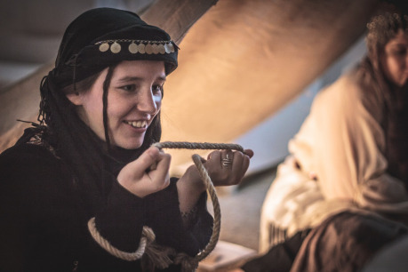
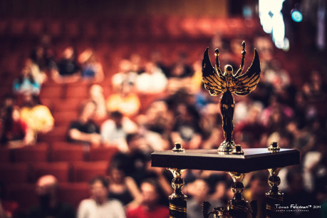
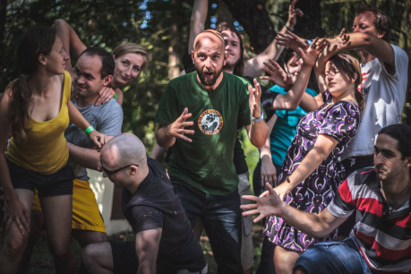

Je to přibližně 10 let zpět, kdy se na něm objevila první otevřená hraní RPG, a od té doby se už sekce RPG jen rozvíjela. Letos je na GameConu možné zahrát si více než 40 otevřených RPG her ve všech klasických i netradičních systémech – od českých Střepů snů či Příběhů Impéria až k zahraničním peckám jako 13th Age, Dread, Fate nebo vtipné a lehké hry Og či Mouse Guard. Nechybí samozřejmě ani klasiky jako Dračí Doupě I a II.

Opravdovou peckou a stále poměrně novinkou jsou pak Legendy Klubu dobrodruhů – návazné hraní (multikampaň) ve hře Příběhy Impéria. Ve druhém kole hry se skupina dobrodruhů vždy přesouvá do prostředí skupiny, která v něm hrála před nimi. Přebírají svět tak příběh i svět ve stavu, v jakém ho zanechali jejich předchůdci. Objevíte-li se v balónu nad hořícím Londýnem, nebuďte překvapeni. Jako ctnostní gentlemani či krásné lady se tak můžete vydat do alternativní minulosti a chránit zájmy britského impéria.

Letošním leitmotivem festivalu je heslo „Hobit: Cesta tam a zase zpátky“ a během celého festivalu probíhají dvě minihry pro kratochvíle mezi jednotlivými aktivitami – soutěž o nejlepšího zloděje a ukrytý skřetí dryák. Chcete-li si oddychnout či prostě jen vyzkoušet jiný typ her, GameCon je právě oním místem, kde se jednotlivé herní komunity propojují. Ať už se jedná o akční hry jako vodní bitva či Famfrpál, wargaming, deskovky, larpy, přednášky, koncerty, improshow a spoustu, spoustu dalšího.

Na GameCon však lidé nejezdí jen hrát: Jeho hlavním lákadlem jsou hlavní skvělí účastníci, kteří nám dodávají energii do organizace dalších ročníků. Hodně z nás na něm našlo spoustu nových kamarádů, kterých si vážíme dodnes. GameCon jsou čtyři dny plné nadupané letní zábavy se skvělými účastníky.

