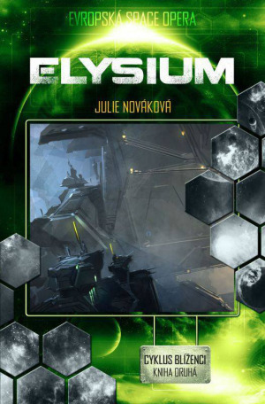
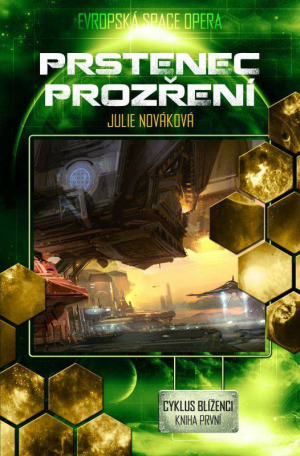
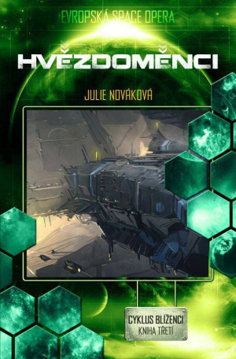
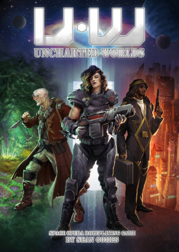

### Úžasná dobrodružství v končinách, kam člověk dosud nevkročil

## Počátky space opery

Samotný termín „space opera“ vznikl počátkem 40. let a měl hanlivý nádech, podobně jako „soap opera“ nebo „horse opera“. Narážel na naivní zápletky, ohraná klišé a melodramatičnost mnoha tehdejších pulpových prací zasazených do vesmíru. Autoři, vydavatelé a fanoušci však termín postupně přijali za vlastní a začali používat jako pozitivně míněné označení subžánru. Antologie _Space Opera_ sestavená Brianem Aldissem a vydaná v roce 1974 brala tento subžánr v zásadě jako „starou dobrou dobrodružnou sci-fi“.

Záhy přišel přelom 70. a 80. let a s ním také _Star Wars_, které opět zpopularizovaly vesmírné SF plné grandiózních hrdinských příběhů odehrávajících se napříč galaxií. Ačkoli v době jeho vzniku, v polovině 60. let, se o _Star Treku_ nemluvilo jako o space opeře, dnes ho vnímáme jako kanonické dílo tohoto subžánru. Podobně do space opery spíše „ex post“ zapadla mnohá díla Roberta A. Heinleina nebo slavná _Duna_ Franka Herberta. Někteří fanoušci jsou schopni se téměř do krve pohádat o to, jestli nějaká kniha/film/seriál/hra je, či není space opera, ale podobné spory postrádají smysl – definice jako u většiny literárních žánrů nemá ostře vymezené hranice a space opera je nálepkou pro určitý typ příběhů, podobně jako military SF nebo hard SF, s nimiž se někdy prolíná. Je seriál _Battlestar Galactica_ nebo knižní sága o Milesi Vorkosiganovi space opera? Nebo jde spíš o military SF?

## Nová vs. klasická space opera

V určité míře už od 80. let, ale především od přelomu tisíciletí se na pultech knihkupectví začala objevovat také „nová space opera“. Její autoři se snažili od klasické space opery odlišit větším důrazem na uvěřitelný vývoj postav, vědu a technologie vycházející z reálného poznání (a ne jej obracející naruby nebo úplně ignorující) a často i méně naivně optimistickým pohledem na lidstvo. U nás patrně nejznámějším autorem nové space opery je britský autor Alastair Reynolds, jehož série _Odhalený vesmír_ se dočkala celosvětové popularity. Dalšími známými příklady jsou Paul McAuley, Iain M. Banks, Stephen Baxter nebo Robert Reed. Právě tito autoři space operu často mísí s hard SF, tedy science fiction více zaměřenou na chytrou extrapolaci skutečného vědeckého poznání.

Klasická i nová space opera pro mě mají své osobité kouzlo; zatímco klasická je často prodchnutá oním naivním optimismem à la původní _Star Trek_, novou space operu mám ráda pro její typicky uvěřitelnější, zajímavější a komplikovanější příběhy, vědecko-technologické nápady a vize a omezení vycházející z reálné fyziky, kterých se drží. Chápu, že při natáčení filmu nebo seriálu se hodí mít za všech okolností umělou gravitaci, zapomenout na fyziku zrychlování a zpomalování ve vesmíru, propojit jakákoli místa příběhu nadsvětelným cestováním nebo ušetřit za masky a triky tím, že mimozemský druh má špičaté uši, zelenou kůži nebo tykadla a jinak vypadá stejně jako my. Ve sféře literatury ovšem podobný omezený rozpočet neexistuje a držet se skutečné fyziky a biologie často znamená dojít k mnohem zajímavějším prvkům příběhu než tam jednoduše vrazit klon _U. S. S. Enterprise_. Právě Reynoldsův _Odhalený vesmír_ mě nadchl tím, že nadsvětelné cesty nepoužívá. Obtížnost cestování vesmírem, komplikované manévry, problémy s přetížením a vliv dilatace času pak představují zásadní součásti příběhu a rozvíjejí jej moc zajímavými směry.

## Space opera dnes – a u nás

A jak je na tom space opera v současnosti? Knižní série jako _Ancillary Justice_ autorky Ann Leckie nebo _Expanze_ autorského tandemu Daniela Abrahama a Ty Francka, vystupujícího pod pseudonymem James S. A. Corey, patří mezi nejoblíbenější nová SF a sbírají řadu ocenění. Televizní kanál SyFy se chystá _Expanzi_ již v letošním roce převést do seriálové podoby a kromě ní chystá i seriál o vesmírných lovcích odměn _Killjoys_. Inspirovali se snad tvůrci atmosférou _Firefly_? Fanouškovská pokračování originální série _Star Treku_ zaplavují YouTube a bývají docela dobrá. J. J. Abrams pro nás chystá nová pokračování _Star Treku_ i _Star Wars_, i když především u prvně jmenované série se řada fanoušků už teď hrozí, co zase vymyslí. Loňský snímek _Jupiter Ascending_ se ukázal spíš jako propadák, ale možná alespoň vyšlapal cestičku pro „znovu a lépe“.

Pak tu samozřejmě máme space operu v naší české kotlině – a ta je rozhodně také na vzestupu! Lví podíl na tom má nakladatelství Brokilon, které předloni zahájilo edici Evropská space opera. Její úvodní svazek _Mráz a hry_ autorské dvojice Jana Hlávky a Jany Vybíralové (počáteční díl série _Algor_) si vysloužil velmi vřelé přijetí, stejně jako druhý díl _Tenký led_. Na mrazivé půdě zůstal i samostatný román Pavla Obluka Kra. Jak _Algor_, tak Kru někteří čtenáři volně přirovnávají k Duně a už teď je mnoho fanoušků netrpělivých, kdy se dočkají třetího dílu _Algoru_, _Pomníků zimy_. Ty by měly vyjít koncem tohoto roku. Samostatný román Světlo pulsaru Aleše Pitzmose je dalším zástupcem klasické space opery a stejně jako předchozí svazky edice se dočkal příznivého přijetí. A potom tu máme mou vlastní trilogii _Blíženci_, jejíž první dvě části _Prstenec prozření_ a _Elysium_ letos již vyšly a závěrečný díl _Hvězdoměnci_ vychází koncem června. Na rozdíl od předešlých svazků edice by _Blíženci_ spadali spíš do nové space opery. Lásku k vědě zkrátka nezapřu a lehce říznout space operu i drobnými prvky hard SF mě baví. A podle ohlasů to baví i čtenáře, což mě samozřejmě moc těší, a doufám, že je zaujme a nadchne celý příběh _Blíženců_. Do budoucna se v edici chystá vydání dalších českých, slovenských a polských prací a uvažuje se i o dalších zajímavých evropských space operách.

## Svět space opery v RPG

Článek se doposud dotkl space opery ve filmech, seriálech i knihách. Zatím jsem ale vynechala počítačové hry a RPG. Počítačové hry nezmiňuji z dobrého důvodu – nemám s nimi zkušenost, a proto se jimi nebudu v článku zabývat. Ovšem s RPG v hávu space opery jsem se loni seznámila, a to konkrétně s Uncharted Worlds Seana Gomese (který na rozvoj hry letos zorganizoval [úspěšnou kickstarterovou kampaň](https://www.kickstarter.com/projects/278368114/uncharted-worlds-a-space-opera-roleplaying-game)). S Faskalem jako gamemasterem a několika skvělými spoluhráči jsme za pomoci herních mechanismů vytvořili svět soupeřících frakcí nelítostné korporace Chang-Li, fanatických teroristů z Čistého světa, komunistické Pravdy, anarchistů „Huxley je mrtev!“, pirátů z Černé ruky či Šestého galaktického impéria. Naše posádka, složená z idealistického (a občas až moc zaslepeného) kapitána, odvážné farmářky s minigunem, zešílevšího bývalého částicového fyzika zbožňujícího exploze a jedné velmi oportunistické technokratky, zažila vskutku nečekaná dobrodružství, od zabití boha mimozemské civilizace přes velký vlakový únos až po vyhození obřího urychlovače do povětří a nasměrování imperiálního letního paláce do černé díry. Faskalovy zápisy jsou k nalezení [na RPG fóru](http://rpgforum.cz/forum/viewtopic.php?f=115&t=12624). Herní mechanismy UW, založené především na principech „Apocalypse World engine“, umožňují rychlou konstrukci zajímavého světa přímo podle nápadů a potřeb hráčů. Postavy nejsou předdefinované, ale spadají do vybraných kategorií původu a profesních dovedností, což opět usnadňuje jejich tvorbu a vytváří rozumná omezení, ale nechává se průchod fantazii hráčů. Moves nejvíce vycházejí z AW a díky častému „částečnému úspěchu“ se hra rychle posouvá kupředu a vytvářejí se nové překážky k překonání.

Osobně se mi víc líbilo hraní v původním AW enginu než v UW, ale také jsem s nimi velmi spokojená a určitě bych se do Uncharted Worlds v budoucnu ráda pustila znovu, kdyby nastala taková příležitost (a pohříchu jsme ještě neuzavřeli předchozí hru!). Zároveň si díky novým herním zkušenostem pohrávám s myšlenkou časem vést RPG vycházející z mých vlastních fiktivních světů – univerzum _Blíženců_ s jeho ilegálními genovými inženýry, Přeměněnými, agenty tajných služeb, kyborgy a urputným závodem o monopol na další kolonizaci vesmíru skýtá zajímavé herní možnosti. Zatím si tedy užívejme space opery ve všech jejích rozmanitých podobách. Jen letos nás čeká záplava nových seriálů a zahraničních i českých knih, a tak se nemusíme bát, že by nám došla nová úžasná vesmírná dobrodružství.
