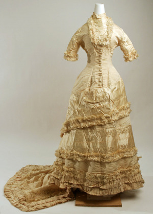

Ten funguje od roku 2013 jako šicí dílna, výrobna bižuterie a jiných doplňků k vašim outfitům, a to jak viktoriánským, tak lolitím, gothickým a mnohým jiným.

Zaměřuji se na šití historických oděvů a klobouků, ale hlavně, a to především, na zakázkovou tvorbu. Sama nosím oděvy inspirované viktoriánskou érou aktivně již šest let a za tu dobu se toho mnoho změnilo. Na základě historických pramenů jsem studovala šití šatů, výrobu klobouků, a vůbec všeho, co k tomu patří. Tento článek se bude zaměřovat na celkovou náladu doby viktoriánské, kdy slovo dáma označovalo éterickou bytost a kdy královna Viktorie hrdě vládla britskému impériu.

Abychom tedy začali od začátku, řekneme si, co to vlastně viktoriánská éra je. Slovem „viktoriánské“ se označuje období, kdy ve Velké Británii a jejích koloniích vládla královna Viktorie (narodila se 24. května 1819, zemřela 22. ledna 1901). Mladičká panovnice nastupuje na trůn 20. června roku 1837, aby po smrti Williama IV. vládla zemím britského impéria. Její vláda trvala až do její smrti, tedy 63 let a 7 měsíců, což je považováno za nejdelší vládu jednoho panovníka v anglické historii.

Jak tedy vypadala tehdejší doba? Londýn v 19. století je velice živé, ale také velice špinavé město. Krysy na každém rohu, Whitechapel přeplněný lehkými ženami, různými pochybnými existencemi a nevěstinci (které jsou však rozesety po celém Londýně), kde za peníze získáte jakékoli služby od kohokoli. Není problém sehnat mladou pannu, či chlapce okolo 8 let, který Vám za poplatek „posvítí na cestu domů“.

Obyvatelstvo lze v zásadě rozdělit do čtyř vrstev. Do té nejvyšší se řadí příslušníci královské rodiny a vysoká šlechta (hrabata, lordi apod.). O něco níže je nižší šlechta a bohaté měšťanské rodiny, poté pracující vrstvy – obchodníci, lidé vydělávající si na obživu, kteří mají své zázemí například ve formě malého bytu propojeného s obchůdkem, popřípadě prodavačky žijící v pokojích patřících k obchodním domům apod. Nejnižší vrstvu tvoří chudina, žebráci a prostitutky.

Jelikož se věnuji hlavně odívání vyšších vrstev, budou následující řádky právě o nich.

Ačkoliv královna Viktorie vládne již od roku 1837, viktoriánskou éru s honzíky a bohatě nařasenou svrchní sukní datujeme až o 33 let později, tedy kolem 70. let 19. století. Hlavní módní vlnu viktoriánské éry dělíme na tři části – Early Bustle (1869–1876), Natural Form (1877 až 1882), Late Bustle (1883–1889). Do češtiny by se toto rozdělení dalo přeložit jako raný honzík, přirozená linie, pozdní honzík.

## Early Bustle („Raný honzík“)

Toto období přichází neprodleně po krinolíně. Můžeme zde tedy najít ještě pozůstatky obručí kolem celého těla. Silueta těla se díky konstrukci v zadní části mění. Zepředu je úzká, vertikální, při bočním pohledu je však dolní polovina postavy dramaticky prodloužena dozadu. Těžké materiály a spousty volánků a plisování zdobí složité šaty s vlečkou, která byla samozřejmostí. Konstrukce pod šaty jsou velice složité a jsou na ně kladeny vysoké nároky vzhledem k tomu, že musí udržet ohromné množství umně nařasené látky.

## Natural Form („Přirozená linie“)

Šaty období Natural Form přicházejí o svou obrovskou zadní část a mění se v přiléhavější šaty/sukně rozšířené od kolen do vlečky, se spoustou volánků, krajek a zdobení. Živůtky se prodlužují až pod kolena a spadají v záplavě drapérií až k vlečce. Honzík sice nevymizí úplně, ale je nahrazen pouze maličkou verzí ve srovnání s předchozím velkým honzíkem.

## Late Bustle („Pozdní honzík“)

Honzík je zpět a ještě větší než dříve! Postupně se rozšiřují ramena, klade se důraz na křivky a celkovou siluetu. Živůtky jsou ještě těsnější a upnuté těsně ke krku, s vysokým límcem. Klobouky jsou vysoké se stuhou pod bradou.

U mužů se objevuje třídílný oblek, norfolské sako (předchůdce dnešního sportovního saka) nebo večerní sako, doplněné o vhodný klobouk. V této době byly nejvíce populární cylindry, buřinky a slaměné klobouky.

***

Ačkoliv takto shrnuté období módy honzíků působí jednoduše, nebylo tomu tak. Obléci se dle poslední módy bylo pro dámy z vyšších tříd velice nákladné a dbalo se na každý detail. Vše muselo být dokonale sladěno, včetně klobouku, rukaviček slunečníku i bot. Nejmódnější kousky od Charlese Wortha byly ukládány a nošeny dle tehdejšího zvyku o několik sezon později. Tento v Paříži žijící a tvořící anglický módní návrhář platil ve své době za guru v oboru a vůbec poprvé na světě použil jako formu prezentace svých šatů módní přehlídku. Stal se dvorním krejčím císařovny Eugenie, manželky Napoleona III.

Celková garderoba mladé dámy byla velmi složitá. Žena se převlékala minimálně šestkrát denně do šatů určených pro různé činnosti. A tak můžeme najít šaty ranní, dopolední, odpolední, na čaj o páté, šaty k večeři, večerní, šaty na bankety, plesové a spoustu dalších.

## Spodní prádlo

Odívání však není jen o krásných šatech, ale také o perfektním spodním prádle, spodničce, honzíku, korzetu, spodních košilkách a dalších zcela nezbytných věcech.

Co se tedy skrývalo pod oděvem? Prvním a nejdůležitějším oděvem byla košilka a spodní kalhoty (ang. pantaloons – „pantaloonky“). Košilka mohla být na širší ramínka, což bylo univerzální pod všechny šaty. Vyskytovaly se však také košilky s krátkým balonkovým rukávkem. Bylo ale nutné zvolit vhodnou košilku pod daný typ šatů, jinak hrozilo, že by mohla v příliš úzkém rukávu tlačit.

Výběr spodních kalhot také nebyl jednoduchý, jelikož se dáma rozhodovala mezi kalhotkami otevřenými (s rozparkem v rozkroku), nebo uzavřenými. Záleželo na úvaze dámy, která musela vědět, zda bude mít možnost zajít si na toaletu v soukromí, a bude mít tedy dostatek času a zázemí na svlékání, nebo ne. V případě, že bylo možné si v klidu dojít na toaletu, mohla zvolit kalhotky uzavřené. Pokud by vykonání potřeby bylo složité, bez možnosti dojít si na toaletu, byla nucena zvolit otevřené kalhoty, které v tu chvíli byly pohodlnější (a odskočit si třeba do křoví). Nutno dodat, že dáma byla považována za éterickou bytost, která na toaletu nepotřebuje…

Po košilce a spodních kalhotách přichází na řadu punčochy a boty. A proč proboha punčochy a boty dříve, než se obleču? Z jednoduchého důvodu. Obout a zavázat si obuv v korzetu je velmi náročný akrobatický výkon vzhledem k počtu ocelových kostic v něm. Punčochy bývaly barevné, zdobené, a ač nebyly vidět, dámy si s jejich výběrem dávaly extra záležet. Boty byly většinou vysoké, šněrovací nebo na knoflíčky, v délce asi do půlky lýtka. Toto jsou ale jen základní dva druhy obuvi. Té bylo nepřeberné množství, boty kočárové, plesové, pantof­líčky, boty typu Balmoral aj.

Když se dáma obula, přišel na řadu korzet. Ve viktoriánské éře bylo zvykem mít korzetů hned několik. Největší důraz však byl na kritéria korzetu a to, aby korzet zvedal poprsí (a nejlépe ho i o něco zvětšoval), zužoval pas a vytvářel prohnutí siluety do esovitého tvaru. Typů korzetů bylo mnoho. Navíc se korzety prodávaly také v lékárnách jakožto léčebná pomůcka. A tak bylo možné si koupit korzet pro srovnání zad, ortopedický, hubnoucí aj. Nebyly výjimkou také korzety těhotenské a kojicí.

Na korzet se upevňuje honzík – vycpávka zadních partií, která má ještě více vyzdvihnout sukně a dopomoci k docílení kýženého efektu. Honzíků existovalo několik druhů. Ty nejlevnější se vyráběly jako jakési podušky vycpané koňskými žíněmi, dražší verze byly z drátu či pletiva. Nejkvalitnější honzíky byly plátěné s ocelovými kosticemi. Korzet mohl být ušit ze saténu, plátna, taftu nebo jiné pevné látky.

Přes honzík se dávala spodnička. Ta sloužila jako ochrana před ušpiněním šatů. Vzhledem k tomu, že se počítalo s tím, že šaty budou mít vlečku a ta se bude „tahat“ po špinavé zemi na ulicích, byla spodnička stejně dlouhá jako šaty, aby se většímu ušpinění zamezilo.

Nahoru přes korzet se oblékala tenká košilka – jakýsi živůtek, chránící před zničením korzetu a svrchního živůtku. Tato košilka byla plátěná, stejně jako spodní košilka a kalhotky.

## Svrchní část oděvu

Nyní se dostáváme k hlavnímu oděvu – šatům. Šaty se mohly skládat ze dvou nebo třech dílů v případě období Early a Late Bustle, v době Natural Form bylo možné mít šaty i jednodílné. Pro představu si řekneme něco o trojdílné verzi šatů.

Začneme tak, jako by se šaty oblékaly, tedy spodní sukní (angl. underskirt) Tato sukně byla většinou v zadní části uzpůsobena na honzík a byla dostatečně široká. Častokrát byla zdobena volány, plisováním nebo stuhami našitými vodorovně po celém obvodu.

Na spodní sukni se oblékala sukně svrchní (angl. overskirt) Svrchní sukně je většinou ještě více zdobena než sukně svrchní, může mít vpředu improvizovanou zástěrku, ale není to podmínkou.

Posledním dílem šatů je živůtek. Živůtek na běžné nošení byl většinou upnutý až ke krku, s dlouhou řadou knoflíčků. Samozřejmostí byl dlouhý, úzký rukáv. Večerní šaty byly naprostým opakem denních. Hluboká dekoltáž a rukáv k loktu či živůtek se spadlými rameny byl velice oblíbený. Ať už byl však živůtek jakýkoliv, musel být upnutý přímo na korzet. Bylo tedy více než jisté, že se tyto šaty dlouhou dobu šily na míru. Až poté, co začaly vznikat první módní domy (např. Selfridges), bylo možné si koupit konfekční šaty a nechat si je případně upravit. K šatům patřilo také mnoho doplňků, jako jsou svrchníky, klobouky, rukavičky a také šperky.

## Šaty pro zvláštní účel

Mimo tento předlouhý seznam jsou také určité typy šatů, které mají jasně dané požadavky na to, jak musí vypadat, a jejichž vzhled se úzkostlivě hlídal. Byly to šaty na dvě nejvýznačnější události v životě viktoriánské ženy – šaty smuteční a svatební. U smutečních šatů etiketa jasně nařizovala jejich celkový vzhled včetně doplňků, po celou dobu tryzny.

Truchlení je ve viktoriánské éře velice složitý a zdlouhavý proces, a to zvláště pro ženu. Její období smutku se dělí na dvě části, z nichž každá trvá určitou dobu.

První, nejdelší období je „velký (hluboký) smutek“. Žena v tomto období nosí šaty celé černé, nejlépe ušité z matného nešustivého materiálu. Šaty nesmí mít výrazné ozdoby, stejně tak žena nesmí mít žádné výrazné šperky. Etiketa vyžaduje, aby žena byla zakryta od hlavy až k patě. Černý matný závoj přes obličej a rukavice byly nutností.

Polosmutek je období navazující po velkém smutku. V polosmutku je již možné vzít si šperky, pokud splňují požadované podmínky – černou barvu a materiál černé sklo nebo gagát (zkamenělá pryskyřice). V období polosmutku může žena obléci také barvu tmavě fialovou a šedou. Žena v tomto období smutku může odložit závoj. Celkově mohl smutek ženy trvat i tři roky, ale např. královna Viktorie jej po smrti svého manžela již nikdy neodložila. Zlé jazyky ovšem tvrdí, že jí vyhovovalo chodit stále v černém, a to nejen kvůli její korpulentní postavě, ale také proto, že neměla vkus a černá je univerzální.

Smutek viktoriánské éry je velice složité a rozvláčné téma. Nyní se přesuneme k něčemu poněkud veselejšímu – svatbě. Nastíníme si alespoň střípek z oděvu svatebního. Svatba je jednou z největších událostí (ne-li vůbec největší) v životě viktoriánské dívky. Jak jsme si již řekli, dívka je v rodině vychovávána tak, aby se co nejdříve vdala a opustila domov, který finančně zatěžuje.

Po zvolení vhodného zámožného manžela, stanovení vhodného data svatby a rozeslání pozvánek se nevěsta dostává k šatům. Abychom se trochu naladili, řekněme si, odkud se vlastně vzal trend bílých svatebních šatů. Bílé šaty mají symbolizovat čistotu a nevinnost. Ve viktoriánské éře bylo u vyšších vrstev zvykem, že svatební šaty byly stříbrné, pošité drahými kameny a perlami. Tuto tradici však přerušila královna Viktorie, která se nehodlala v tomto podřídit a přišlo jí zbytečné investovat tolik peněz do šatů. Zvolila tedy klasické bílé šaty zdobené pomerančovými květy a drahými šperky. Od té doby se bílé svatební šaty staly velice žádanými. Ideální svatební komplet pro nevěstu tvořily šaty zapnuté až těsně ke krku, věneček z pomerančových květů a boty na nízkém podpatku.

Ale nejen šaty dělají ideální svatbu. Člověk viktoriánské éry byl navzdory přísné křesťanské tradici také velmi pověrčivý a častokrát věřil na různé nadpřirozené bytosti. Říkalo se, že svatební závoj má nevěstu ochránit před zlými duchy. Družičky nevěsty mají také přes obličej závoje, aby se případný zlý duch spletl a zaútočil na jednu z nich místo nevěsty. Zvyk zvonění kostelních zvonů či v dnešní době rozšířeného troubení klaksonů pochází právě z viktoriánské Anglie a vznikl nejen proto, aby svolal lid do kostela, ale také aby zastrašil, jak jinak, zlé duchy.

***

Móda viktoriánské éry je velice zdlouhavé téma. A jelikož se říká, že v nejlepším se má přestat, tak se s tebou, můj milý čtenáři v tuto chvíli rozloučím. Doufám, že jsme se spolu na těchto stránkách či v reálném životě nesetkali naposledy a že se tedy znovu potkáme, ať už na Victorian Catherine´s picnic, přednášce či kdekoliv jinde.
