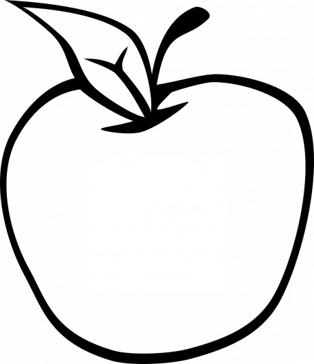

Parní vlak supěl rozlehlou krajinou lesů a luk. O Moravě se říkalo, že skýtá nádheru dávno zašlých dob, kdy země prosperovala. Ženy tam byly krásné jako rajská jablíčka a muži udatní a nebojácní. I přes revoluci, která se prohnala krajem a vytvořila továrny, obludná monstra s komíny plivajícími jedovatý dým, se zde pořád daly najít divoké bystřiny, nezkrocené přehradami a hrázemi. V lesích žili vlci, kteří se za zimních nocí vrhali na stáda ovcí. Pokrok přinesl do měst novou éru. Ulicemi se proháněly nejen parní stroje, ale i drožky, tažené koňmi, avšak na vesnice ještě nedosáhla revoluční ruka těžby a průmyslu.

Vesnice Střední se mohla pyšnit vlastním nádražím, skromným, ale důležitým bodem v jinak zřídka osídlené krajině. Plynové lampy svítily na malém nástupišti, kde John Calder vystoupil. Kolem peronu se valila mlha. Studený a nevlídný soumrak neznámého prostředí ho zastihl nepřipraveného. Zimomřivě si protřel zkřehlé svaly na pažích. Vítr mu málem smetl z hlavy vysoký cylindr. Vlak zapískal a lokomotiva se se supěním rozjela. Průvodčí si ho nepřátelsky měřili a prohlíželi. Na první pohled bylo znatelné, že je cizinec. Zvedl si límec dlouhého kabátu. Svůj kufřík a hůl si bedlivě střežil, aby mu je někdo neukradl. Bez dokumentů by byl ztracený.

Již ve vlaku si znovu předčítal knihu, kterou do Londýna přivezl neznámý cestovatel. Obsahovala sebrané pověsti z českých zemí, kde také nalezl zmínku o zlatých jablkách. Vzhledem k tomu, že britská výzkumná společnost nějakou dobu pátrala po způsobu, jak si zajistit nesmrtelnost, okamžitě provedl bližší zkoumání. V nedávné době podnikl dobrodružnou výpravu do Řecka, kde se pokoušel objevit bájný strom Hesperidek. Bohužel se ani s týmem výborných archeologů a vědců nedostal k očekávanému výsledku. Zlatá jablka se zdála jako pohádka. Jenže ten spisovatel, ten Erben, o nich psal tak poutavě a přesvědčivě, že to Johnovi nakonec nedalo a rozjel se do srdce Evropy.

Potulní psi běhali kolem zchátralé budovy. Na polích rostlo bodláčí a rozbahněné cesty mu ničím nepřipomínaly pohodlí velkých silnic. Drožka nebyla v dohledu, a tak se po několika marných pokusech domluvil s farmáři, že ho svezou na voze s obilím. Drkotal úvozem až do menší vesnice, která se jmenovala Horní. Místní neuměli anglicky, takže s ním neprohodili ani slovo, ale mezi sebou se dohadovali a živě gestikulovali. Často si povšiml, že ho pozorují a ukazují na něj, když se ve chvílích nepozornosti zamyslel.

Jeho domluvený průvodce byl kdysi tlumočníkem, takže cizí jazyk ovládal. Našel ho na doporučení jiných cestovatelů a po výměně korespondence se dohodli na oboustranné spolupráci. Jelikož měl poblíž místa předpokládaného nálezu svůj statek, neměl nic proti. John byl šťastný za každou pomoc v cizím a nepřátelském světě. Doufal, že průvodce bude kultivovaný a sečtělý. Ovšem, když ho starší žena v šátku poslala do stájí, kde našel jen zarostlého sedláka, kydajícího hnůj, zapochyboval, zda udělal správně.

„Vy jste ten dobrodruh?“ zeptal se muž a odplivl si. Smrděl zvířaty a potem. Plátěnou košili měl špinavou a dlouho nepranou.

„John Calder,“ usmál se a podal mu ruku, ale když se nesetkal s potřesením, raději ji stáhnul zpět.

„Josef Máchal,“ odpověděl. „Ale říkejte mi Pepa.“

„Dobrá, pane Pepo. Prý víte, kde je to místo popisované v knihách, které jsme s mými kolegy určili poblíž vaší vesnice.“

„Ano. Tedy ono to není přímo u naší vesnice, ale tady kousek je vesnice Dolní.“

„A vy jste Horní?“ zeptal se rozpačitě. Zvedl cylindr a poškrábal se ve vlasech.

„Přesně tak. Tady je Horní a tam je Dolní.“

Pepa vytáhl ze slámy láhev pálenky, otevřel ji a řádně si přihnul. Nabídl Johnovi, který ostýchavě odmítl.

„Musíte se napít. U nás je to základ přátelství,“ řekl Pepa.

„Ach tak, promiňte,“ odpověděl John a po vzoru hostitele si přihnul. Záhy zalapal po dechu a rozkašlal se. Svíral si hrdlo, dusil se a z očí mu proudem tekly slzy.

„Nejste zvyklý, ale to nevadí. Tady se brzy naučíte pít jako chlap!“

„Děkuji, ale nevím, jestli po tom toužím,“ opáčil John ochraptěle. Svíral si popálené hrdlo po celou dobu, kdy se jeho společník chystal na cestu.

„Vezmu si pušku, kdyby nás přepadli vlci.“

„Vlci?“ polekal se gentleman.

„Jo, ale klid. Ty bestie většinou vycházejí až v noci. Ve dne nemají dost odvahy, pokud nejsou vyhladovělé k smrti. Co vlastně chcete v té strži? Měl jsem vás za hledače pokladů.“

„Hledám jeden velmi vzácný strom.“

„Vy jste botanik?“

„Ano, tak trochu. Jsem především vědec. Hledám strom, který nese zlatá jablka,“ upřesnil.

Pepa se smál, až se popadal za objemné břicho.

„Co je na tom vtipného?“ zamračil se John.

„Na co vám budou jabka?“

„Chci si vzít rouby z té rostliny. Přivézt je do své domoviny a tu rostlinu rozmnožit. Vy jste snad nikdy neslyšel o stromu věčného mládí?“

„Ne,“ zabručel sedlák. „Jedině v pohádkách, co mi vyprávěla babička a co říkáme svým dětem před spaním.“

„Ujišťuji vás, že je vědecky dokázáno, že existují zlatá jablka. Jsou lehce podlouhlá až téměř kuželovitá, ne tak kulatá jako běžné plody. Jejich chuť je vynikající, sladká a zvláštní. Popisují to v mnoha literárních pramenech světoví učenci. A co teprve pověst o Heráklovi? Či mytologické jablko od májové královny, Îðunn, ze skandinávských legend…“

Pepa pokrčil rameny. Jeho nezájem byl zcela běžný. John se s ním setkával často. Lidé nevěřili vysokým cílům a vizím, které měly udělat svět lepším.

„Tady u nás je ovoce hlavní zdroj věčného života,“ pronesl nakonec tajemně pod vousy a znovu si lokl pálenky. Pohlédl na cizince skrz zkreslující sklo láhve a pokýval důležitě hlavou.

„Omluvte mě, ale alkoholu příliš neholduji.“

„Možná myslíte vinné jablko. To je žluté,“ zkusil Pepa.

„Netuším, jak se jmenuje ve vaší řeči,“ odpověděl. „Zprvu jsme se mylně domnívali, že šlo o granátové jablko. Ale ta samozřejmě žádný účinek nemají a navíc rostou na nevábně vypadajícím trniscích.“

„To je jedno, půjdeme se podívat do strže a snad najdete to, co hledáte,“ rozhodl sedlák. John vytáhl mapu s pečlivě zakreslenými body. Nakreslil čáru spojující vesnice Horní a Dolní a označil území divoké přírody.

„Děkuji, že se mnou půjdete. Zcela jistě bych se ztratil. I když jsem si to představoval jinak.“

„Co jinak?“ zajímal se Pepa.

„No, vás. Myslel jsem, že jste spíše… měšťan,“ doplnil, aby ho neurazil.

„Ve městě jsem párkrát byl. Nemyslete si, že chodím v těch nobl věcech rád. Jsem prostý člověk, co měl štěstí, že mu dovolili se naučit cizí řeč. Jednou se můj otec potkal s bohatým obchodníkem a ten mě vzal k sobě jako sluhu. Tam jsem ledasco pochytil. Jenže pořád jsem zemědělec. Mám tady pole a hospodářství. Není to nic extra, ale samo se to neobdělá. Takže jsem se nakonec vrátil zpět ke kořenům. Mám tu ženu. Jsem šťastný.“

„Jistě, chápu,“ pokusil se o úsměv John.

Nad hlavou jim proletěly královské vzducholodě. Vědec sebou škubnul, když začaly bombardovat kopce v dálce. Obzor na pár okamžiků zrudnul.

„Co se děje?“ polekal se cizinec. Pepa jen znuděně mávl rukou: „Královští chytají zběhy a zrádce. Vy snad nevíte, že probíhá rakousko-pruská válka?“

„Něco jsem četl v novinách,“ odpověděl John.

„Prusko se po napoleonských válkách dostalo k moci. Chtěli by nadvládu nad Německem, ale Rakousko by chtělo sjednotit německy mluvící země bývalé Svaté říše římské. Na stranu Rakušáků se přidalo dost spojenců, Bavorsko, Hannoversko, Sasko… všichni lidé nesouhlasí s Bismarkovými názory. Jeho politika je značně krvelačná, řekl bych.“

„Slyšel jsem o konfliktech s Dány.“

„Ano, s těmi se taky bojovalo. Společné armády obou států je tehdy porazily na souši a námořní eskadra Wilhelma von Tegetthoff svedla u Helgolandu úspěšný boj s dánským loďstvem. Jenže pak Prusové začali chtít víc. František Josef I., náš nekorunovaný král, s nimi chtěl vyměnit část Slezska za Holštýnsko, ale nepřistoupili na to. Bismark si dobře spočítal, že by to byl špatný obchod. Tak se od té doby válčí,“ řekl s lhostejným podtónem, jako by se ho to netýkalo.

„Situace asi není jednoduchá. Ale vzducholodě. Není to přílišný nepoměr sil?“

„Tady vidíte pořád nějaké válečné stroje, dělostřelectvo a parní tanky. Občas nám něco spadne do polí a máme poryto, ale my si to spravíme. Co nám taky jiného zbývá? Vojska tudy táhnou pořád, ale naštěstí se dlouho nezastavují. Stahují se do Čech. Pak budou nějakou dobu bombardovat pole jim.“

„A jaký je ten váš monarcha?“

„Celkem v klidu,“ odpověděl Pepa. „Zařídil industrializace do menších měst, začal popularizovat průmyslovou revoluci. Přispívá na stavbu továren a železnic a nejezdí sem z toho doupěte ve Vídni, tak co si můžeme přát víc?“

John nepochopil řečnickou otázku a tázavě zvedl obočí. Nadechoval se k další otázce, ale byl rázně zadržen.

„Radši se napijte,“ řekl Pepa a podal mu láhev.

„Dobrý bože, raději už ne!“

Drobný ale zato vytrvalý déšť jim smáčel pláště. Ušli mnoho mil a John sotva pletl nohama. Netušil, že bude muset zdolávat pěšky takovou trasu. Alespoň si na doporučení průvodce nechal všechny nezbytnosti včetně hole a cylindru ve stavení a vyměnil oblek za pevné kalhoty a boty. Klopýtal blátivou stezkou za svým doprovodem. Nestačil mu a Pepa na něho musel neustále čekat. Nic mu nezkazilo náladu natolik, aby si nezačal prozpěvovat. Pod stromy se pásly krávy a gentleman na ně vyjeveně zíral.

„To jsou ale odporná zvířata!“ prohlásil.

„Jsou to jen krávy,“ namítl Pepa. Prošel cestičkou stoupající ke kopcům.

„Tady nemáme moc rozdílný terén, ale pár vrcholků tu je. Půjdeme stále dál a pak se snad konečně dostaneme ke vstupu do strže.“

„Říká se, že bájné Hesperidky byly dcery obra. A že vchod do zahrady hlídal drak,“ upozornil zmožený a rozbolavělý John.

„Hloupost! Naše holky jsou úplně normální! A draci tu nežijí, povraždil je svatý Jiří.“

„Takže se nemusíme obávat o život?“ oddychl si cizinec.

„Zcela jistě ne. Pokud se ale budete takhle motat jako opilec, můžete spadnout a zlomit si nohu.“

„Promiňte, ale strašlivě mě rozbolela hlava po té pálence, co jste mi dal.“

„Problém s její konzumací může nastat ze dvou důvodů. Buď pijete málo nebo moc. Ve vašem případě je to podle mě první příčina,“ řekl Pepa a donutil Johna, aby si přihnul. Chudák se rozkašlal, ale za chvíli už cítil, jak se mu po pálivém doušku rozlézá teplo i do zbytku těla. Dunění děl v dálce ho přinutilo vstát a zrychlit.

„To nic, to se zas šijou mezi sebou,“ odfrkl si sedlák. „Armádní sbory, to víte. Dejte jim nové hračky a oni se s nima zmydlí!“

„Vůbec vám nerozumím,“ přiznal John, který se obával o život.

„To nic. My jsme zvyklí a navíc je nám jedno, kdo vyhraje.“

„Jak vám to může být jedno?“ divil se.

„Chleba levnější nebude. Vždycky přijdou vojáci, vyplení nám to tu a odejdou. My to postavíme a přijdou další. A udělají úplně to samé. Už jsme si zvykli. Máme své jistoty a nejsme závislí na pohlavárech a státu. Takže nám je úplně jedno, kdo sedí na trůnu. Když nám pošlapou pole, pooráme ho znovu, chápete?“

„Ne,“ přiznal.

„Málo pijete!“

Pepa mu během další cesty vnutil záložní láhev pálenky a on ji pomalu upíjel. S každým lokem rostla chuť, a než se dostali ke skalnaté průrvě, byl zpitý pod obraz. Proto se rozkřičel na celé kolo, když uviděl tlustou Bertu, která u strže sbírala bylinky. Obrovská žena hřmotné konstituce mu zahrozila pěstí macaté ruky, aby zmlkl. Pepa si poklepal na spánky, aby jí naznačil, že s Angličanem to není zcela v pořádku. Když chudáka uklidnil a sestoupili do tmy jeskyně, zažili další překvapení, a to, když na Johna zaútočila kočka, která se snažila ochránit čerstvě porozená koťata. Začal vykřikovat něco o drakovi a byl by utekl, kdyby ho Pepa nedržel za kšandy.

„Nikdy jsem nebyl na tak děsivém místě!“ přiznal John. Ale v zájmu vědy věděl, že je jeho povinností najít strom se zlatými jablky. Hlava mu třeštila vypitým alkoholem, na který nebyl zvyklý.

„To jste asi ještě nic neviděl,“ usoudil Pepa. Svlékl si košili a vymačkal z ní vodu.

„Plahočím se sem přes kontinent do totálního zapadákova, jenom abych zachránil impérium!“ zabědoval.

„Vidíte. Aspoň máte nějaké poslání. Procestoval jste kus světa. Co byste dělal doma? Válel se u krbu?“

„Ano, a víte, jak by mi tam bylo dobře?“

„Ti vědátoři nic nevydrží,“ zabručel pro sebe Pepa a strčil si mezi zuby stéblo trávy.

„Dovolte! Byl jsem členem expedice za polární kruh, v Africe jsem hledal Šalamounovy doly, válčil jsem na Krymu!“

„Já jsem válčil s pluhem na poli, než zavedli tažné parní stroje,“ namítl Pepa. John se nad tím zamyslel a pak jen souhlasně přikývl.

„Na vesnici je dřina. Věřím vám. Nuže dobrá. Na pól jsem nakonec nedošel. Dostal jsem chřipku a zůstal jsem v ležení. A do Afriky jsem nedojel, protože jsem nestihl loď, takže jsem se s expedicí setkal, až se vrátila zpět. Nicméně mé jméno je na seznamu členů týmu. Novináři to spolkli.“

„Posilněte se pálenkou a půjdeme dál. Jestli je tohle vaše první dobrodružná cesta, neměl byste se vrátit s prázdnou,“ přešel vychloubání.

John uposlechl a řádně si lokl. Prošli úzkou proláklinou dále do tmy. Skála se rozevírala sotva na šířku dospělého muže. Pepa se s bručením protáhl jen tak tak. Slabé světlo dopadající shora jen stěží osvětlilo temná zákoutí. John zakopl o natažený provaz a byl by spadl na tvář, kdyby se na poslední chvíli nekryl rukama. Vyjekl, ale někdo ho zachytil. Zůstal viset ve vzduchu nad zemí, zatímco ho Pepa znovu držel za kšandy.

„Opatrně, pane. Můžou tady být pasti,“ upozornil jej.

„No jistě! Že mě to nenapadlo dřív,“ souhlasil. Rozhrnul botou zetlelé listí na zemi a objevila se před ním past z ostře vypadající kůlů. Nad povrch trčely ošklivé špice. Hlasitě polkl. Každý další krok pečlivě vážil. Vyplatilo se to v momentě, kdy se pod nimi propadla podlaha a oni zůstali viset na provaze, který Pepa celou cestu vláčel. Naštěstí ho napadlo, připoutat se před vstupem do podivně volného a klidně vypadajícího prostoru. Vyšplhali se nahoru a pokračovali. Objevilo se padající kamení i hadí hnízdo, jehož obyvatelé byli nepříjemně vyrušeni ze spánku. John viděl klubko ve svých představách mnohem větší a zlověstnější, než ve skutečnosti bylo. Alkohol mu zatemnil mysl a každý problém se mu teď zdál nepřekonatelným.

„Někde to tady musí být!“ bědoval. Zakopl o provázek ve výšce kotníků a svistot šipky, která byla zcela jistě napuštěna smrtícím jedem, ho minula jen o chlup. S křikem couvnul a propadl se. Kus skály se pod ním utrhl a on spadl ze srázu, přičemž Pepu, který na něco podobného nebyl připraven, stáhl sebou. Skutáleli se po suti a na poslední chvíli se naštěstí zachytili výčnělků ve skále.

„Dobrý bože!“ skučel cizinec.

„Šplhejte,“ doporučil mu Pepa s kamenným výrazem. Popostrčil kolegu, aby si pospíšil dříve, než se s nimi převis utrhne. Odpočinuli si na kamenné rampě a John zajásal. Uprostřed strže rostl strom. Stará pokroucená jabloň, bohatě obtěžkána jablky. Zatleskal nadšením, protože byla opravdu žlutá jako slunce.

„To je zcela jistě ono!“ ukázal svůj objev průvodci. Ten si otevřel láhev a zhluboka se napil. Našli schůdnější cestičku a tamtudy se dostali přes rozviklaná skaliska až k ostrůvku zeleně. Strom měl pokroucené svěšené větve, což vypovídalo o jeho stáří. John s téměř posvátnou bázní natáhl ruku a dotkl se posvátného jablka.

„Nádhera!“ zašeptal. Vytáhl nůžky a odstříhal mladé větvičky, které uschoval do vlhkého hadru. Natrhal i několik plodů na ukázku. „Bude to dokonalý genetický materiál. Rozmnožím ho a získáme nesmrtelnost!“ řekl nadšeně. Pepa převrátil oči v sloup. Vyšplhali vzhůru a vydali se zpět strastiplnými chodbami.

„Běžte napřed, dohoním vás!“ řekl Pepa a John šel pomalu napřed. Sedlák se kousek vrátil, sáhl do výklenku a vytáhl odtamtud za uši dva vzpouzející se kluky.

„Co to je zase za hry?! Říkal jsem vám, že nemáte chystat pasti po jeskyních, kdo ví, kdo tamtudy půjde a ublíží si!“

„Ale my to tu chtěli zabezpečit před vojáky,“ odporoval jeden z nich.

„Žádné takové. A alou domů, rošťáci,“ pohrozil jim. Chlapci na něj vyplázli jazyk a zmizeli v jednom z mnoha tunelů vyhloubených vodou.

Pepa dohnal Angličana na polní cestičce. Mnoho toho už nenamluvili a z dálky je neustále rušil zvuk děl. Kolem proletěla vzducholoď s barevnými potisky, což znamenalo, že převáží civilisty, jak vysvětlil sedlák. Drobné postavičky jim mávaly z lodních okýnek. Po posilnění pálenkou a večeří vyprovodil Johna na vlak. Dovezl jej tam na mašině poháněné parním strojem, který jindy používal ke sklizni. Johnovi zůstaly ve vlasech i obleku stébla a zrna, zrovna jako bláto na botách. Lokomotiva, která ho měla odvézt do jeho domoviny, se pomalu vzdalovala. Pepa dopil druhou láhev a poškrábal se na hlavě.

„Zvláštní, tihle lidé. Jedou sem, aby našli strom, který roste všude po Moravě. Kdyby řekl, dal bych mu pár větviček ze svého sadu. A pytel jablek k tomu. Z toho mála, co si natrhal, sotva něco vypálí.“

Už pomalu chápal, jak John myslel ty bláboly s kouzelným věčným mládím a nesmrtelností. Dopídil se, že mluvil v metaforách. Ovšem – jejich vznešená mluva. Vyšší společenská třída. Tihle gentlemani, pomyslel si. Otevřel třetí láhev a přivoněl.

„Dokonalé. Výborně odleželý ročník. Lektvar věčného života,“ usmál se. „Až zjistí, co všechno se s těmi jablky dá dělat, budou tady vysílat celé expedice. Třeba na tom i zbohatneme! Pak si koupím krávy a nový pluh…“ zamumlal s nadějí v hlase a zhluboka se napil štiplavé jablečné pálenky.
