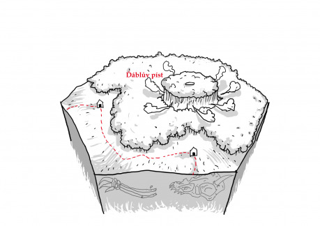
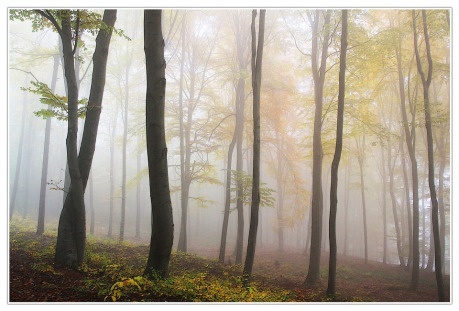

Zvrásněnou krajinu pokrývá z větší části hustý les, z něhož jen nesměle ukrajují obyvatelé okolních vesnic, aby rozšířili svá skromná pole. Nad rozlehlým hvozdem se jako můra vznáší tajemství, které drží zpět pověrčivé masy a láká odvážné jednotlivce. Tam, kde je les nejhlubší, prý stálo kdysi skvostné město, jehož obyvatelé se čímsi strašlivě provinili. Okamžitý trest bohů proměnil životem kypící město v pustinu, muže ve vlky, ženy v lišky a děti v netopýry. Podle některých je středem lesa jáma, z níž lze vstoupit přímo do sedmého kruhu pekla. Těžko soudit, co je pravdy na těchto legendách. Avšak odvážní dobrodruzi, kteří dosáhli středu lesa a přečkali v něm noc, podávají shodné svědectví o zcela neobyčejném úkazu, za jehož vznikem zcela jistě stojí čáry a kouzla.

Hvozdem probíhá někdy patrná, jindy sotva znatelná linie, připomínající terénní zlom či úzkou rokli. Tato linie tvoří uzavřený kruh o rozloze desítek hektarů. Každý člověk s citem pro nadpřirozeno, který na místo vstoupí, rozezná neobyčejnou magickou sílu skrytou v podzemí. Tato síla způsobuje, že po celý den se celá kruhová plocha nepatrnými pohyby zvedá vůči svému okolí, aby se pak při západu slunce zhroutila během okamžiku na své původní místo. Tento jev je doprovázen nesmírným rachotem a na některých místech gejzíry horké vody a smrdutých podzemních plynů, stříkajícími do ovzduší. Jen v několika učených knihách je toto zvláštní místo popsáno a zváno Ďáblovým pístem.

Hluk při zhroucení zemské masy bývá za příhodného větru slyšitelný na míle daleko a působí odstrašujícím způsobem na spořádané lidi v okolí. Najde se však i dost takových, které toto hrůzyplné místo přitahuje jako svíčka můru. Dobrodruhové a psanci, čarodějníci, vyvolavači démonů, alchymisté a bylinkáři, posedlí a blázni nebo jen nerozvážní mladíci toužící zaskvít se neobyčejným činem. Díky tomu není prokletý les tak opuštěným místem, jak se zdá, a lze v něm nečekaně natrefit na všelijakou chásku. Povídačky se vypráví i o počestných sedlácích, kteří propadli neblahému vlivu prokletého místa a po nocích se k němu vydávali jakoby přitahováni neodolatelnou silou. Prý snad i celé vesnice na čas propadly zhoubnému vábení a v hloubi hvozdu se pak odehrávaly děsivé obřady, jakoby přenesené z dob dávno minulých...

## Využití ve hře

V okolí Ďáblova pístu je velká šance potkat se s nejrůznějšími podezřelými osobami, postavy sem mohou být vyslány jako průzkumníci, mohou být pověřeny vyhledáním někoho, kdo v lese zmizel, případně se samy mohou stát oběťmi nadpřirozené přitažlivosti místa.
