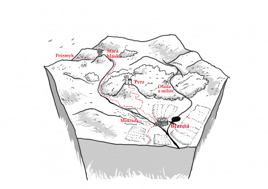

Havraní brána je horské údolí, které se na jihovýchodě otevírá se do nížiny. Na severozápadní straně je průsmyk, po němž je údolí pojmenováno (Havraní brána). V údolí se rozkládá starý les, po jehož západní straně podél řeky, vede cesta z průsmyku k vesnici Branná. Nad průsmykem se tyčí stará, opuštěná hláska, na kterou přes hvozd hledí tvrz. Pod tvrzí se řeka až k horám rozlévá do mokřin, proto vede cesta po pevnějším levém břehu, na několika místech je zpevněna hatěmi a mostky, které už by mnohde zasloužily opravu.

Na jihovýchodě, na soutoku s říčkou, která protéká hvozdem pod svahy hor na východní straně údolí, stojí vesnice Branná, opevněná kolovou hradbou. Z vesnice je možné vyrazit na jih přes most po cestě dál do nížiny, nebo zpět ke tvrzi, anebo na východ přes hráz dřevařské nádrže a proti proudu řeky na sever, k dřevorubecké a lovecké osadě v lese. Okolo vesnice se rozkládají pole, na kterých si vesničané zajišťují obživu, na severu pod lesem jsou jablečné a švestkové sady. Na svazích hor na východě je možné najít několik salaší se stády ovcí

## Proč můžou postavy do Havraní brány přijít

Někam cestují a potřebují projít skrz průsmyk (není tolik používaný, ale je blízko, cesta je špatná a vůz by asi zapadl, ale nalehko postavy snadno projdou).

O Havraní bráně kolují v okolí zvěsti, že místní podlehli pohanským kultům a obětují starým bohům krvavé oběti (v Branné to ale každý odmítne a skoro každý upřímně vysloví vyznání obecným bohům), postavy mohou být pověřeny biskupem či knížetem věc prošetřit.

## Atmosféra

Ať přijdou postavy odkudkoli, první, co by měly potkat, je mršina havrana, kterému silný vichorec lomcuje křídlem a vytrhává peří, které prolétá kolem postav (zřejmě zemřel stářím či nemocí, nezdá se, že by ho někdo ulovil).

Dění v Branné, na tvrzi i v lovecké osadě je poměrně líné, spokojené, vcelku přátelské; všichni jsou v zásadě bezstarostní, nikdo nemá potřebu nic moc měnit.

Komáři, všude sakra samí komáři! A místní to snad ani nevnímají! (V lese a v horách je to ale většinou docela dobré).

## Pověsti o Havraní bráně

Ve starých dobách („za dědů našich dědů“) proběhla bitva s armádou jakéhosi ďábla, ten ale byl poražen a od té doby o něm nikdo neslyšel. Jen málo lidí bude vědět, že ďábel či upír nebyl zcela poražen, ale jen zahnán a od té doby prý údolí chrání havrani, podle nichž se od té doby průsmyk i údolí jmenuje. (Zeman toto neví, a pokud mu to někdo poví, vysměje se tomu.)

Havraní brána bývala kdysi bohatá, protože průsmykem vedla oblíbená kupecká stezka, ale v jiné bitvě před asi třiceti lety zemřel původní zeman i jeho synové a novým zemanem se stal původní strážce hlásky; ten byl ale líný, a protože se příliš nestaral o cesty a neobnovil posádku v hlásce, kupci začali chodit jinými průsmyky (důvodů bylo zřejmě víc, ale místní kladou všechno za vinu současnému zemanovi).

## Branná

Rozlohou celkem velká vesnice na pahorku nad soutokem řek, obehnaná kolovou hradbou, ale stále s otevřenou branou, na severní straně je dokonce zbudován druhý východ k polím. Velká část domů má alespoň kamenné základy, zdá se ale, že už jsou poměrně staré a některé z nich zchátralé.

Stodoly jsou většinou u polí, které obklopují vesnici na všechny strany, domácí zvířata jsou ustájena uvnitř vesnice ve chlívcích nebo v ohradách okolo palisády. Na sever od vesnice jsou mezi poli a lesem jablečné a švestkové sady. Lidé se živí zemědělstvím, zpracováním vlny a prodejem dřeva a uhlí z osady.

V hostinci je evidentně většinou prázdno, hostinské křídlo se vůbec nevytápí, v patře nad nálevnou mají jeden pokoj pronajatý zemanovi synové, kteří tu občas po pitkách či tancovačkách přespávají.

Zemanovi synové postavy pozvou na tvrz, zvlášť pokud míří do průsmyku, nebo pokud průsmykem prošly (chtějí, aby někdo nezávislý jejich otci řekl, v jakém stavu jsou cesty).

## Dřevorubecká osada

Na vymýceném svahu nad řekou stojí velká dřevěná budova se „společenskou místností“ a skladem dřevěného uhlí, poblíž stojí dvě menší chalupy s kozími chlívky. V okolí je několik doutnajících milířů, kouř je cítit široko daleko, přímo v osadě ho ale doplňuje pach koz a sušících se natažených kožek ze stažených zvířat. Na hranici mýtiny je několik úlů lesních včel.

Celkem tu žijí čtyři širší rodiny, jedna čistě lovecká, tři převážně dřevorubecké. Lovecká rodina a mladí členové dřevorubeckých rodin loví v lesích a na horských úbočích; zemanovi synové je nechávají být za dodávky uhlí na tvrz.

Lovci nechávají zhruba dvakrát do týdne část svého úlovku (v létě a na podzim i nějaké ovoce ze sadů) na starých oltářích v lese jako oběť za ochranu lesních bůžků (viz Hvozd); dělají to tak už dlouho a bůžci je za to ochraňují od zbojníků a hněvu lesa.

## Cesta k tvrzi a k průsmyku

Po cestě z vesnice k tvrzi je velký statek s výběhem pro koně a maštalemi, bydlí zde také část zemanova služebnictva.

Okolo mokřadů je cesta místy podložená dřevěnými prkny, které občas hnijí a trouchnivějí, pro pěšího je však poměrně bezpečná. Okolo lesa cesta leckde zarůstá travou.

Cesta vede okolo říčky, výše už spíše potoka, který pramení nedaleko hlásky. V průsmyku je vysypaná štěrkem, ale na několika místech se už nahromadila suť.

## Tvrz

Tvrz tvoří velká obytná věž a ohrazený dvorec. Sídlí zde chromý zeman Zbyslav, málokdo o něm ví, že už němá žádné peníze a všechny platby proměnil na služby – v podstatě už funguje téměř čistě na výměnném obchodu a poddanské službě.

Zemanovi lhostejní synové Chotěmír a Zderad by chtěli obnovit pověst průsmyku a vybírat mýtné, ale jsou příliš líní, aby se do toho pustili sami, a otce nedokážou přesvědčit, aby pustil chlup (protože nemá, což oni nevědí, ale začínají tušit).

Když postavy přijdou na tvrz, uvidí hořet nazelenalý (!) signální oheň na hlásce – dostane se jim informace, že už se to nepravidelně děje pár týdnů, je to asi nějaké ďábelské mámení. Průsmyk už několikrát kontrolovali, ale nikdo v něm nebyl.

## Mokřady

Ještě víc komárů!

Pach hniloby – staří říkají, že dřív to tak zlé nebývalo (ani s těmi komáry), ale mladí se jim smějí, že za jejich let byla i tráva zelenější.

## Hvozd

Obětiště starým lesním bůžkům – kamenné stolce pokryté zaschlou (zvířecí) krví, dřevorubci „bůžkům“ nosí část ulovené zvěře, chléb a ovoce od vesničanů, sýr od ovčáků.

Pro obětiny si chodí skřeti nahastrošení v oblecích s liščími a vlčími hlavami, králičíma ušima a vyzdobení havraním peřím – nezkušený vesničan je snadno zamění za skutečné lesní bůžky.

Skřeti loví vlky a další škodnou v horách a v západní části lesa, takže lovci, dřevorubci i ovčáci jsou před nimi chráněni.

## Hláska

Opuštěná, nevyužívaná věž, pouze na strážním stanovišti na vrcholu hlásky je občas používané ohniště. Pokud budou postavy ohniště zkoumat, objeví v popelu ohořelé kamínky. Když ohniště zapálí, z kamenů půjdou nazelenalé plameny.

Zelené ohně chodí v noci zapalovat skřeti, kterým Domahost (viz níž) vyprávěl o tomto prastarém znamení, které mělo varovat před návratem černokněžníka.

Ve spodním patře hlásky je vykopaná studna, dva lokty pod hranou začíná žebřík z rezavých kramlí, zakrytý z vrchu vysunutým kamenem, který je ale nápadně ošoupaný; 20 loktů pod hranou je ve stěně vchod do tajné chodby ústící v lesíku na svahu severozápadních hor, hladina vody je dalších 20–30 loktů pod hranou tajné chodby.

## Podzemí

Tajná chodba je poměrně dlouhá, původní stavitel využil přirozeně vzniklých jeskyní, do kterých bývalo kdysi možné se na několika místech dostat, už dlouho jsou ale prakticky všechny vchody neprostupně zavalené.

Asi třicet kroků od studny se chodba rozšiřuje do místnosti, která sloužila jako sklad pro případ nouze pro hlásku. Dnes jsou tu jen dva pelechy skřetů.

Asi třicet kroků od východu, který je umně schovaný v lesním porostu a skalní stěně, je odbočka ke skřetímu doupěti. To tvoří dvě relativně pravidelně čtvercové místnosti, široké asi šest kroků, jejich vchody míří proti sobě do odbočovací chodby. Jedna z nich ústí do další místnosti, zhruba kruhové o průměru asi čtyř kroků, skalním průduchem ve stropě sem proudí čerstvý vzduch. Průchozí místnost je plná skřetích pelechů, v malé místnosti je zřídka využívané ohniště, několik pochodní a ohořelých svíček a jeden poměrně slušný slamník, i když na člověka celkem krátký.

Neprůchozí místnost slouží jako sklad a spižírna, v podlaze je několik prasklin, v nichž je zaschlá krev, která tudy odtékala do útrob hory zřejmě z pověšeného zvířete.

- Každý, kdo do této místnosti vstoupí, uslyší nezřetelné šeptání, které jako by vycházelo ze stěn (ve skutečnosti jde z prasklin v podlaze); pokud nemá na sobě či u sebe alespoň jedno havraní (vraní, kavčí, krkavčí) pero, musí si hodit na záchranný hod. Kdo neuspěje, dostává se pod vliv kouzla a bude chtít buď kopat díru do země, nebo ulovit velké zvíře a dotáhnout ho sem.
- V této místnosti sedí Domahost, postaršího mrzák bez nohou, se zarudlýma očima a od pohledu ne zcela při smyslech. Jak postavy zpozoruje, bude po nich chtít, aby mu pomohly kopat díru do kamenné podlahy. Pokud se ho postavám podaří odtáhnout do hlavní chodby nebo ven, asi po hodině se vzpamatuje a bude ochotný říct vše, co ví (byl pod kouzlem uvězněného černokněžníka, to je ale jediná věc, kterou neví a kterou si neuvědomuje).

Skřeti nejsou pod černokněžníkovým kouzlem, protože jejich oblečení má ozdoby i z havraního peří. Budou se ale asi toulat někde po lese, protože s Domahostem není posledních pár týdnů řeč. S postavami nebudou chtít bojovat, ale ani se s nimi nějak vybavovat nebo jim pomáhat. Nejstarší skřet bude ochotný pouze v případě, že mu postavy řeknou, že přišly zničit černokněžníka.

Prokopat se k černokněžníkovi nezabere s dobrou hornickou výbavou mnoho času, snad jen den. Černokněžník je scvrklý, ale z jeho černých očí sálá chlad a děs. Má svou dávnou zbroj i meč, a s každým zraněním, které jeho protivníci utrží, získá životní sílu a zdroje pro svou magii mysli. Zničit ho můžou postavy jen v přímém střetnutí, což by ale ani v jeho hladové podobě nemělo být jednoduché.

Jen odtáhnout Domahosta či zasypat praskliny v podlaze jsou pouze dočasná řešení, probuzenému černokněžníkovi se daří otravovat řeku a po několika měsících by v Havraní bráně nebylo k žití, i kdyby zůstal černokněžník uvězněný v podzemí.

## Důležité informace

Hláska i tvrz stojí na prastarém místě u průsmyku od nepaměti, tvrz byla několikrát přestavěna, ale hláska má zřejmě původní podobu a prošla jen nepodstatnými opravami.

Před čtyřmi sty lety vedl průsmykem svou armádu černokněžný vojevůdce, posádka z hlásky varovala tvrz, a přestože byla hláska rychle dobyta, obránci stačili uprchnout systémem jeskynních chodeb ústících do lesa a k tvrzi. Mezitím tehdejší zeman stihl varovat krále a jeho vojsko zastavilo postup nepřátel ještě v údolí a mnoho nepřátel se utopilo v bažinách; černokněžník se nakonec bránil v hlásce a objevil tajný vstup do podzemí, jenže obránci o podzemí věděli, a nakonec černokněžníka zavalili a magickými zaříkadly zapečetili v jeskyních pod horami.

Před třiceti lety proběhla na stejném místě znovu bitva, tentokrát se ale střetla pouze vojska dvou znesvářených králů. Tehdejší zeman zahynul i všichni jeho potomci až na jednoho vážně raněného (Domahost), kterého zajala skřetí jednotka, která doufala, že si jako výkupné vymůže beztrestnost. Nebyl ale, kdo by za Domahosta zaplatil, protože nový zeman Zbyslav (původně správce hlásky) nestál o potomka původního zemana. Sám Zbyslav byl ale v boji raněn, zchroml, a tak nemohl jít skřety rozprášit.

Domahost se, bez nohou, nakonec stal mozkem skřetů. Ze skrytu – nakolik dokáže – spravuje své panství tak, aby vše fungovalo, dokonce v průsmyku vybírá „mýto“ (za dobrovolný příspěvek potravin, výjimečně peníze, poradí, jak se vyhnout některým poplatkům na tvrzi či v Branné).

V Havraní bráně samé vše funguje prakticky dokonale, jakýkoli zásah do místního ekosystému by byl jen k horšímu – tedy v případě, že by skřeti s Domahostem neprobudili černokněžníka.

Nemrtvý černokněžník je po staletích hladovění velice oslaben, ale pořád je nebezpečným protivníkem, který dokáže ovládat mysli lidských bytostí i zvířat s výjimkou havranů (vran, kavek, krkavců) a všech, kteří jsou chráněni jejich černým peřím.

## Variace

Pokud chcete temnější atmosféru, nechte postavy přijít o několik týdnů později:

- Signální ohně už nehořívají, zato o nich už vědí i vesničané.
- Lovci se bojí chodit do lesa, protože bůžkové už několikrát odmítli jejich oběť.
- Objevila se smečka vlků, kteří po nocích dáví ovce.
- Pach z mokřadů už sahá až do vesnice, voda v řece smrdí zatuchlinou a chutná odporně.
- Skřeti už z většiny podlehli černokněžníkovi, poslední dva, kterým z očí sálá šílenství a nenávist, z posledních sil kutají chodbu k osvobození černokněžníka.
- Právě ji dokončili a černokněžník se krmí jejich krví – jeho síla je teď velká.
