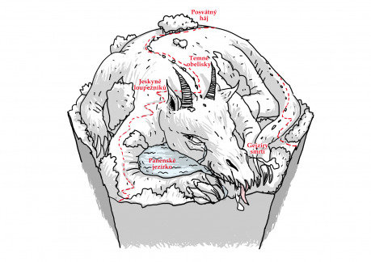

Tento hex je ve skutečnosti obří zvíře, kterému se říká Hexelion. Je hibernované, rostou na něm stromy a tráva. Může se ale začít probírat, viz problémy popsané níže. Potom je potřeba s tím něco dělat, například ho zase uklidnit, jinak se probudí a spase jiný hex. Urči náhodně hodem kostkou který: 1 – sever, 2 – severovýchod, 3 – jihovýchod, 4 – jih, 5 – jihozápad, 6 – severozápad. Poté, co sní daný hex a nacpe si břicho vším, co bylo na něm, uloží se na tomto novém hexu zase ke spánku, dokud ho zase nikdo nevzbudí.

## Hexelionovy rohy

Dvě ostré skály, tyčící se do oblak jako menhiry.

__Problém:__ Jednu z těch skal někdo v půlce ulomil. Byl to následek manželské hádky dvou obrů, kteří mají své doupě v rýze na Hexelionově hřbetě. Ulomený kus skály si obři vzali do svého brlohu a teď se s ním mlátí navzájem po hlavě.

## Hexelionovy nozdry

Dvě díry v zemi, jsou to výpustě horké páry. Vlézt dovnitř a vystavit se páře je smrtící.

__Problém:__ Parta dobrodruhů si sehnala ochranu proti horku a vlezla do jedné z nozder hledat poklady. Teď tam kopou do skály a rozdělávají si ohýnek. To Hexeliona šimrá.

__Kýchnutí:__ Dokud Hexeliona něco dráždí v nose, bude kýchat. Použijte v dramaticky vhodném okamžiku. Na hex dopadne:

1. Sprška kamení.
1. Lepivý hlen.
1. Sprška horkého deště.
1. Obsah batohu osoby, která se nacházela v nosních útrobách.
1. Vichřice.
1. Osoba, která se nacházela v nosních útrobách. Přežije to jen tak tak.

## Hexelionův ocas

Ježatý kopec, na kterém nerostou stromy, jen obří ostrá pevná tráva.

__Problém:__ Skupina radikálních druidů chce rozšířit les a zasadila na tomto kopci stromy, ty zapustily kořeny a tím přišpendlily ocas ke hřbetu Hexeliona.

## Hexelionovy uši

Dvě jeskyně, každá je ukryta pod skalním převisem.

__Problém:__ Do kraje přišly dvě znepřátelené lupičské bandy, každá zabrala jednu jeskyni. Dělají hluk ve dne i v noci, Hexeliona to budí ze spaní.

## Hexelionovy oči

Dvě jezírka, z každého vytéká malý vodopád.

__Problém:__ Do kraje se přistěhovala skupina krásných víl, chodí se koupat do jezírek nahé, Hexelion se na ně chce dívat.

## Náhodná událost – vrtění

Pokud se otálí s řešením problémů, Hexelion se může začít vrtět. Na začátku každého dne hoďte k6, co se ten den stane:

- 1, 2 Dnes se vrtět nebude.
- 3, 4 Zem se hýbe a otřásá, můžete žuchnout na zem.
- 5, 6 Pořádný třas, postavy mohou odletět o několik metrů pryč, pokud se něčeho nechytí.

Jak dlouho bude třas trvat je na vás, použijte v dramaticky vhodném momentu. Pokud jsou problémy neřešeny, vrtění zhoršujte, zvyšujte počet kostek.
