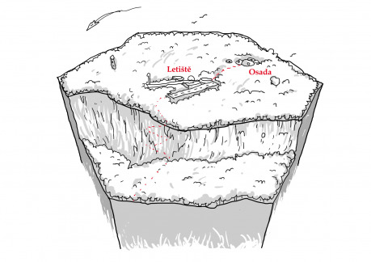

Letiště je jediným přímým spojem náhorní plošiny se zbytkem světa. Ne že by se nahoru nedalo dostat jinak, ale přiletět je zkrátka jednodušší než se drápat strmým svahem a jít kilometry nebezpečnou džunglí.

Letadla sem přilétají dvakrát týdně a přivážejí zásoby, co si místní objednají, ve výjimečných případech vozí zraněné nebo nemocné hledače do města.

Jediná osada se nachází asi kilometr od letiště. Hledači kamenů ji tu postavili ještě před letištěm. Většina jich ale žije osamoceně v chatkách na svých pozemcích, kde tráví dny hledáním drahých kamenů. Do osady přicházejí jen občas nakoupit zásoby a propít nějaký ten drahokam v hospodě.

## Co se může stát

- Letadla nepřilétají. Kdyby měl jeden z dopravců nějaký problém, přiletělo by letadlo toho druhého. Třeba jim vláda sebrala povolení nebo se ti zmetci prostě domluvili, sebrali zálohy na objednávky a zmizeli. Nebo se tam venku stalo něco daleko horšího?
- Každý den je nějaký hledač nalezen mrtev. Napadlo někoho, že bude lepší vzít si cizí drahokamy, než se celý den dřít? Chce hledače někdo vyhnat a ukořistit jejich pozemky? Nebo je to snad něčí pomsta?
- Někdo tu našel opravdu velký drahokam. Takový, kvůli kterému se vraždí. Jak se s ním ale dostane do města? Cesta džunglí je nebezpečná a pilot bude chtít vědět, proč veze pasažéra.
