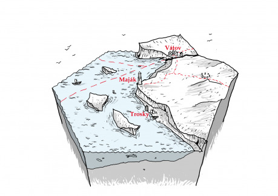

## Atmosféra

Z oparu nad mořem čnějí výběžky skal. Na jednom z nich se tyčí veliká kamenná věž. Jasné světlo na vršku prořezává okolní šero a ukazuje okolo plujícím lodím bezpečnou cestu.

## Obecný popis

V okolí majáku najdeme převážně travnaté roviny, na kterých místní lidé pasou ovce. Místy se nachází dubové háje. Na severu končí pevnina linií útesů a skal a dál už je jenom moře. Za odlivu však moře ustupuje a odhaluje písčité dno. Příliv a odliv řídí životy rybářů z Vátova – když je hladina vysoká vyjíždějí na moře lovit ryby, když je hladina nízká, sbírají mořské živočichy přímo z odkrytého dna. Asi hodinu chůze od vesnice se nachází maják, který ukazuje cestu projíždějícím lodím. Útesy na pobřeží připomínají díky svým četným jeskyním ementál. Typickým počasím pro tenhle kus světa je déšť a mlha.

## Místa – detail

### Maják

Veliká budova z kamene sedí na skalním výběžku. Most, který vedl k majáku, se zřítil, a tak jediná cesta dovnitř vede starou cestou podél skal. Za přílivu je cesta zaplavena, a tak je průchozí jen několik hodin denně. Hned u vchodu je vyhloubena ve skále jáma k uchování vody. Středem kruhové stavby vede schodiště ze starého dubového dřeva. Od vchodu by návštěvníka zavedlo až do prvního patra, které obsahuje mnoho velikých sudů s olejem pro udržování plamene. O patro výše se nachází skladiště nářadí a potravy. Jedny dveře sem ústí na ochoz, který je osazen jeřábem pro naskladnění zásob. Až třetí patro poskytuje strážci majáku skromné bydlení – postel, kamna, stůl, židle a skříň. Dál už vede schodiště až nahoru k obrovské olejové lampě. Vršek majáku je taktéž lemován ochozem.

- __Bang__ _– Když zkoumáte maják a jste už v jeho vrchní polovině, vejde do přízemí skupinka ozbrojených mužů. Co tu dělají, co chtějí a co mají v té těžké tajemné bedně?_
- __Bang__ _– Putujete po cestě, která vede kolem majáku. Ozval se křik a světlo náhle zhaslo. Co se děje?_
- __Bang__ _– Na skalách pod majákem sedí mořská panna a zpívá tesknou píseň o ztracené lásce._
- __Zápletka__ _– Světlo majáku bliká v nouzové sekvenci. V majáku straší. Strážce byl zavražděn a jeho tělo ukryto v jedné z jeskyní na pobřeží. Kdo to udělal a proč? Dokud nebude pochován, bude se duch zjevovat noc co noc na majáku a pokoušet se topit další lodě._

### Vátov

Tahle ospalá rybářská osada stojí stranou zájmu mocných. Většina lidí tu prostě rybaří a rádi své úlovky, jako ryby, mušle, chobotnice a jiné obyvatele moře, prodají. Silný pach rybích vnitřností je cítit z daleka, nicméně místní už jsou zvyklí, a tak ho ani nevnímají. Na druhou stranu tu sotva najdete nějakého zbrojíře či alchymistu. Zato pokud stojíte o udice, sítě a loďky, jste na správném místě.

- __Bang__ _– Z vln na obzoru se vynoří obrovská chapadla a omotají jednu z rybářských lodí. Asi se někomu povedlo vyrušit stvůru ze spánku._
- __Bang__ _– Moře ustoupilo a lidé z Vátova našli korunního prince. Bude žít? Co tu vlastně dělal? Kde je jeho družina? Kam s ním?_
- __Zápletka__ _– Chlapi z Vátova se hodlají vypravit na širé moře, aby ulovili tu obrovskou krakatici, co viděl Starej Pepek. Někdo jim ten bláznivý nápad přece musí rozmluvit._
- __Zápletka__ _– Obyvatelé Vátova se živí rabováním ztroskotaných lodí. Přeživší umlátí vesly, oberou je o jejich majetek a těla zahrabou do písku. Nicméně teď je přeživších mnoho a Vátované neví, co s nimi._
- __Zápletka__ _– Jeden z rybářů najde perlu velkou jako lidská pěst. Místo radosti ho dostala do potíží. Sousedi mu závidí, všichni po něm chtějí peníze a v noci za odlivu procházejí po odhaleném mořském dně podivné postavy – vypadají jako lidé, jenomže z nich trčí ploutve a ponocný Franc přísahá, že viděl ve světle petrolejky lesknout se šupiny._

### Trosky

Mezi skalami je už pár dní uvězněna veliká obchodní loď. Trup je proražený a v tomto stavu není schopná pohybu. Za odlivu se lze dostat suchou nohou až k lodi. Námořníci si zřídili provizorní tábor na útesu nad lodí, aby mohli hlídat svůj náklad. Námořníci se krátce po nehodě pustili do křížku s obyvateli Vátova a nyní jsou vztahy napjaté.

- __Bang__ _– „Křup!“ Vaše loď tu ztroskotala. Proč ten zatracený maják nefungoval? Co teď?_
- __Zápletka__ _– Ztroskotaná loď vezla vzácný náklad nebo důležité osoby. Bylo to zhasnutí majáku jenom náhoda? Je jenom otázkou času, než se někdo pokusí uvězněnou loď vykrást a přivlastnit si cokoli převážela. Vždyť za odlivu je to tak snadné!_
- __Zápletka__ _– Kapitán ztroskotané lodi šel prověřit okolí. Už dlouho se nevrací. Ukáže se, že se bezhlavě zamiloval do strážkyně majáku. Jde z ní jakýsi chlad a majáku se místní vyhýbají. O co tu jde?_
- __Zápletka__ _– Ztroskotaná loď se sice maskovala za obchodníky, ale ve skutečnosti se jednalo o pirátskou loď. Piráti mají v plánu vypálit Vátov._

### Jeskyně

Neúnavná síla větru a vody vyhlodala do útesů spoustu přírodních jeskyní. Některé z nich dále pokračují ve změť chodeb. Ani lidé z Vátova neznají všechny chodby a síně. Mnohé ze skalních síní jsou skryté pod mořskou hladinou a povídá se, že zatopený labyrint chodeb ve skalách skrývá poklad. Ale každé malé dítě ve Vátově ví, že není radno taková místa prozkoumávat. Může přijít příliv a člověk snadno zůstane v lepším případě uvězněn. Blázni, zoufalci a dobrodruzi, kteří se pokoušeli potopit do jeskyní ve snaze poklad najít, se už nevrátili. Jejich kosti budou někde na dně.

- __Bang__ _– Prozkoumáváte jeskyni, když v tom vám voda zmáčí boty. Ta hladina je výš, než byla. Zatracený příliv, tudy už se zpátky asi nedostanete. Co uděláte?_
- __Zápletka__ _– Rybářovic Anička se ztratila. Snad si nešla hrát do těch zakázaných jeskyní._
