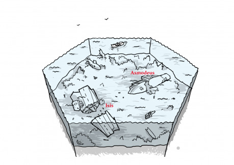

Během války se tu střetla dvě mocná loďstva a po pár dnech vyrovnaného boje z nich zbylo jen několik děravých lodí. Zbytek lodí i letadel klesl ke dnu. Vyprávění o tom, jak je tu na dně tolik vraků, že se vrší jeden přes druhý, jsou přehnaná. I když najdete místa, kde se pár lodí či letadel usadilo pohromadě, většinou jednotlivé vraky oddělují široké pásy celkem nezajímavého mořského dna.

Zatímco před lety našly uvnitř potopených plavidel smrt tisíce námořníků, dnes jsou jejich vraky místem, kde bují mořský život. Mnohé však zajímají z jiných důvodů. Na bitevní lodi Asmodeus měl být převážen náklad zlata a ukořistěných uměleckých předmětů nevyčíslitelné hodnoty. Letadlová loď Ísis zas možná v kapitánově sejfu skrývá dokumenty, které by měly vrhnout nové světlo na válečné události. A největší snílci věří, že jeden z bombardérů nesl nový typ elektrické bomby, kterou ale nestihl použít, protože byl sestřelen.

## Co se může stát

- Něco z bájných „pokladů“ se na některém vraku opravdu najde a z hledání se stane boj. Jsme na otevřeném moři a tak se těžko někdo dozví, co se tu stalo, a proto se někteří hledači nebudou štítit udělat cokoliv, aby poklad získali.
- Je tu dost bezohledná skupina hledačů, co sabotuje cizí ponorky. Pomůžete posádce v nouzi, nebo vám spíš přijde vhod, že je o jednoho konkurenta méně? Jak zajistíte, aby nesabotovali právě vaši ponorku? Nebo jim snad dáte ochutnat vlastní medicíny?
- Ve vraku žije opravdu obrovská krakatice. Nejenže by dokázala s ponorkou pěkně zamávat, ale nechce se z vraku hnout. A zrovna je to ten vrak, co by mohl skrývat to, proč jste tady.
