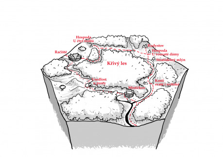

## Račiště

- Větší hradiště, patřící vojvodovi Šlavějovi, který ovšem v kraji nežije.
- Leží na kupecké stezce vedoucí do Rudysova skrze Křivý les.
- Kastelán Toman, který hradiště z pověření Šlavěje spravuje, je přísný, ale spravedlivý.
- Podaři se mu dostat Zrzavce, zbojníka, který žije kdesi v Křivém lese?
    - Dokáže najít shodu s knězi Kostiboha, kteří si začali přímo na hradišti se svolením Šlavěje budovat svatostánek?
    - Za mlada přislíbil Jiříkovi z Místečkova ruku své dcery pro jeho syna. Jenže z Jiříka se vyklubal pěkný prevít. Co s tím Toman udělá?

## Hospoda U Čtyř trollů

- Hospoda leží kus na západ od kupecké stezky a cesta od ukazatele není příliš udržovaná.
- Ukazatel u křižovatky však ukazuje na druhou stranu do hlubokého lesa.
    - Má to něco společného s tím, že Lída, Marušova žena, neustále kleje a nadává na „tu fousatou mrchu“?
    - Nebo je to dílo místních lapků, kteří tak lákají pocestné ze stezky?
- Už z dálky je vidět, že na dvoře hospody jsou čtyři trollové.
- Říkají si Jaro, Léto, Podzim a Zima a podle toho se i střídají – vždy jeden jen sedí na trůně a komanduje ostatní a ti mu slouží.
- Hostinský Maruš o nich odmítá mluvit, družina ale zahlédne, jak jim dává ovci nebo sele a děkuje za ochranu.
    - Drží ho trollové v šachu? Platí jim výpalné?
    - Nebo jim platí a oni jej chrání před lapky a vrrky z Křivého lesa?

## Rudysov

- Trpasličí osada na sever od kupecké stezky, zcela uzavřená netrpaslíkům.
- Místní rada, v čele s váženým trpaslíkem Krylssonem, nesnáší cizáky a nové pořádky. Obzvláště Krylsson je velmi nesnášenlivý.
- Krylsson byl do čela rady zvolen poté, co se jeho soupeř, rudovousý trpaslík Slabarsson, nedostavil v den voleb před místní radu. Slabarssona od té doby nikdo neviděl.
    - Je jen shodou náhod, že pár měsíců po zmizení váženého trpaslíka s rudými vousy začala v Křivém lese řádit banda lapků, které vede jakýsi Zrzavec?

## Hospoda U Fousaté Dámy

- Hospoda leží přímo na křižovatce kupecké cesty, odbočky do Rudysova a stezky do Místečkova.
    - V hospůdce (na rozdíl od města) nezáleží na tom, zda jste trpaslík, ale na tom, zda máte peníze.
- Hospodu vede hlučná trpaslice jménem Krylsdottir. Je to jen shoda jmen?
    - Krylsdottir každého, kdo by se chtěl po obědě vydat na západ, varuje, že cesta je špatná a přes les to do večera na Račiště nemá šanci stihnout. A po setmění není radno se toulat Křivým lesem.
- Jakéhokoliv cizince během chvíle osloví hobitka, která si říká Hilda. Prohlásí se za sestru bývalé majitelky, a tedy dědičku strašidelného mlýnu a požádá postavy o jeho vyčištění.

## Strašidelný mlýn

- Mlýn je v údolí potoka, tekoucího od Rudysova k Místičkovu. Stezka zjevně dřív vedla těsně kolem, ale dnes už novější pěšina mlýn širokým obloukem obchází. Kolem mlýna téměř pořád leží mlha.
- V mlýně straší duch Smělky – hobití léčitelky, která si kdysi vzala za muže Linderssona, trpasličího mlynáře. Lindersson však krátce po sňatku zemřel na zákeřnou nemoc. Smělka by­la Kryldottirem odsouzena za čarodějnic­tví, jednoho dne však zmizela z kobky, ve kte­ré byla po obvinění držena. Tělo se nikdy nenašlo.
    - Co před léty způsobilo Linderssonovu smrt? A jak to, že ho Smělka nedokázala vyléčit, přestože byla léčitelkou?
    - Kam se podělo Smělčino tělo a jaká síla tu drží její duši? Straší v mlýně za trest? Nebo její duše nebude mít pokoje, dokud nebude napravena křivda, kterou jí kdysi někdo způsobil?
    - Jakou roli v tom hraje Helga a její hamižnost? Nebo Krylsson a jeho nenávist k netrpaslíkům?

## Kosti svaté i světské

- Malebné údolíčko mezi lesy, jež protíná potok, tekoucí od Rudysova k Místičkovu.
- Na levém břehu potoka stojí podivně veliká chalupa s prostornou zahradou; již z dálky je cítit silný zápach. V chalupě žije zlobr, který si říká Kvalk a živí se jako pohodný.
- Pozve návštěvníky na polévku, jejíž pozření způsobí postavám otravu.
    - Udělal to zlobr úmyslně, něco tají a chce se návštěvníků zbavit?
    - Nebo je jen tak hloupý a nedošlo mu, že co je dobré pro něj, nemusí být snesitelné pro ostatní?
- Kromě Kvalka žije mezi tím vším ještě majestátní vrrk, cenící zuby na každého příchozího. Kvalka však na slovo poslouchá.
    - Neslyší snad vrrk volání smečky v nedalekém lese? Co ho tu drží?
- Na pravém břehu řeky je rozestavěný jakýsi chrám. Již postavené obvodové zdi dávají vědět, že v budoucnosti stavba získá tvar lebky Kostiboha. Staveniště chrámu je, jako téměř všechno poblíž Křivého lesa, obehnáno palisádou.
- Staveniště obývá asi tucet kněží, vedených otcem Hlívou, který je zapáleným věřícím v Kostiboha a od svých mnichů vyžaduje poslušnost, víru a asketismus.
    - Jaký je vztah Kvalka k novým příchozím do „jeho“ údolí?
    - Jak se dívá Hlíva na to, že jen kousek od jeho chrámu má chaloupku zlobr, zjevně uctívající nějaké divoké bůžky?
- V lese na severozápad od budoucího chrámu je podivný palouk s velkým pařezem. Čas od času se na tomto pařezu objeví lebka podivného netvora – pokaždé jiná.
    - Je to snad další znamení, že do tohoto údolí je nějakým způsobem přitahována Smrt?
    - Nebo si Kvalka dělá z mnichů legraci či je chce odehnat a po nocích z mršin zvířat vyrábí ony strašidelné lebky?
    - Nebo tak Zrzavcovi zbojnící odrazují mnichy od návštěvy lesa?

## Místečkov

- Menší hradiště, patřící Jiříkovi z Místečkova.
- Jiřík z Místečkova je zeman a dává svůj titul svému okolí okázale najevo.
- Taktéž je zapáleným věřícím v Kostiboha. Chrám v údolí na sever od města se staví s jeho svolením. A stejně tak přímo v Místečkově povolil stavbu malé modlitebny, na místě, kde dříve stávala svatyně ducha Račišťského potoka.
    - Co na to místní? Co na to duch Račišťského potoka?
- Palisáda chrání jen dóm jeho hradiště a několik nejbližších budov. Ostatní obyvatelé Místečkova se musí spokojit s hliněným valem, přirozenou ochranou, kterou jim dává koryto potoka, a zdmi, které si postavili kolem svých dvorů.
    - Platí místní Jiříkovi nějaké daně? A poskytuje jim alespoň nějakou ochranu před Zrzavcovými loupežníky?
- Do chrámu Jiřík nalil všechny svoje úspory a teď je v nepříjemné finanční situaci. Svého syna tedy nutí do již sjednaného sňatku s dcerou majetného kastelána Tomana. Syn se však o dívky vůbec nezajímá a místo toho tráví veškerý čas na dvoře se svým panošem, trénuje boj, zápas a lukostřelbu.
    - Touží mladý chlapec víc po dobrodružství než po ženách? Bude chtít po družině, aby jej vytáhla na zkušenou?
    - Nebo nedává ve skutečnosti Jiříkův syn přednost chlapcům? A není obliba v zápasech jen záminkou, jak skrýt vzájemnou touhu po tělesném kontaktu mezi mladým pánem a jeho pážetem?

## Usedlost U Pusty

- Osamělá usedlost na břehu potoka, tekoucího z Račiště k Místečkovu.
- Usedlost není nijak chráněna, nevede tu žádná kupecká stezka a potok je většinu roku nesjízdný. Přesto usedlost zjevně prosperuje.
    - Je v tom něco nadpřirozeného?
    - Proč to tu zatím nevyplenila Zrzavcova banda?
    - Jak je možné, že se na dvorku prohání husy a na loučce se pasou kozy a ovce, když okolní lesy obývají vrrci a vlci?
    - Jak vůbec jeden farmář stíhá obdělávat tak velkou usedlost?
    - Políčka jsou plná plodin, zvířata zdravá a sytá. Usedlost zjevně prosperuje. Jak a kam farmář vlastně prodává výsledky své práce? A kudy je tam dostává?

*Milý čtenáři, tuhle otázku můžeš pojmout dvojím způsobem:

- Buďto nechť ti slouží jako inspirace pro další záhadu, kterou budeš se svými spoluhráči řešit, když tento hex zapojíte do své hry – a pak je jakákoliv odpověď, kterou vymyslíš a která vaší skupině přinese zábavu, správná.
- Anebo ji můžeš pojmout jako soutěžní otázku a zkusit přijít na to, proč autor hexu les pojmenoval právě takhle. Prvního čtenáře, který odpoví správně na email redakce Drakkaru autor tohoto hexu odmění malým dárkem.

## Křivý les

- V Křivém lese žije velká smečka vrrků a vlků.
- V Křivém lese také má mít doupě skupina zbojníků či loupežníku, vedená tak řečeným Zrzavcem.
    - Je les tak velký, že dokáží tyto dvě skupiny v klidu existovat vedle sebe?
    - Žijí ve vzájemné symbióze?
    - Nebo je snad Zrzavec vlkodlakem, který ovládá dvě smečky – v lidské podobě zbojnickou, ve zvířecí tu vrrčí?

__A proč se vlastně ten les jmenuje Křivý?__*
