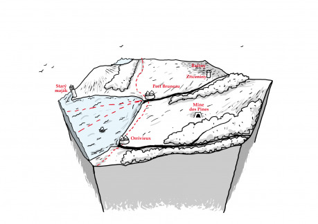
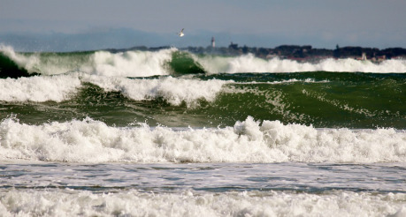

Těžký nákladní škuner se líně kolébal na příbřežních vlnách a sunul se s pomocí odpolední brízy k jihu, využívaje celé palety kosatek a gén. S trochou štěstí bude moci obeplout Point Dagan dost brzy před setměním, aby ještě dnes mohl přistát v Port Bruneau. K tomu však bylo daleko, když Daganovy skály byly stále ještě před přídí.

Pohlednou scenérii na levoboku hltal očima urostlý mladík, k němuž se teď připojil starší podsaditý muž. Že se jedná o vojáka, bylo poznat nejen z odění erathijské armády, ale i z toho, že zkoumal neméně pozorně horizont na pravoboku. Zjevně pamatoval doby, kdy se mohly plachty pirátů objevit odkudkoliv. Mladík nově příchozího pozdravil slušným kývnutím, voják však tak nemluvný nebyl: „Zdravím mladíče, copak tě přivádí do tohoto divokého kraje? Hledáš snad práci v Mine des Pines?“ Než stačil oslovený reagovat, veterán pokračoval: „A jak se vlastně jmenuješ? Já jsem Travis Trevent, starší seržant místní posádky.“

„Těší mne, starší seržante, já jsem Muir Buckinner. Máte pravdu, že si sem jedu vydělat, ale kam mne osud zanese, ještě nevím. Uvítám každý tip,“ dodal tázavě.

„No je fakt, že příležitostí je u nás víc než dost,“ pohled zase obkroužil celý horizont, než pokračoval, „jak už jsem říkal, v Borodolu využijí každou ruku, teď co tam našli další žíly zlata. V Port Bruneau je práce taky dost, protože řada dobrých chlapů odešla do hor. Felipe Phetien, starosta Orrivieux, taky shání schopné chlapy a o jeho radním Mestnikovovi se říká, že zase najme každého všehoschopného. Vztahy mezi oběma vesnicemi nejsou dobré, vůbec ne. No a my, vojsko, taky hledáme dobré lidi, ale neslyšel jsem o nikom, kdo by si v pravidelném vojsku vydělal, jo ty žoldácké bandy, to je jiná – ale kdyby ses chtěl přidat k nim, tak to tě raději hned tady shodím do moře.“ Ze seržantova hlasu bylo poznat, že příliš nežertuje. Když viděl strach v Muirových očích, tak raději pokračoval: „Situace se nezlepší, dokud Markham mezi oběma osadami nerozhodne. Chápej, nejde jen o sídlo nového zemana, jehož jmenování uložila vévodovi samotná královna. Jde vlastně o všechno, tam, kde se usídlí nový pán, tam bude pobočka Královské banky, poštovní stanice a jiné erární investice. Oba starostové chovají jistou naději, že by to mohlo jít obráceně – že když přesvědčí Markhama, že stanice nemůže být jinde než u nich, tak právě oni by se mohli dočkat šlechtického titulu. Možná nejsou bez šance a to je právě žene do střetu.“ Trochu zamyšleně pokračoval: „Snad o toto místo nevyhlásí podobně ztřeštěnou soutěž jako o harmondaleské zemanství. To prý sice nedopadlo nejhůř, ale tady potřebujeme někoho normálnějšího. Někoho, kdo srovná oba kohouty, udrží trolly na severu v bažinách a všechny ostatní potížisty v klidu.“

Mladík opatrně formuloval svou otázku: „A neměla by to být v podstatě práce královské posádky? Udržet klid a bezpečí v oblasti?“ Seržant odpověděl: „To tedy máš pravdu! Problém je, že náš velitel, poručík Mathew St. Pauli, se snaží chovat zcela nestranně, proto se mu taky říká Neutrál. Jde dokonce tak daleko, že vážně přemýšlí o vybudování tábora mimo Port Bruneau, aby to nevypadalo, že straní jednomu či druhému starostovi.“ Seržantovy oči daly jasně najevo, co si o počínání svého nadřízeného myslí.

Muir využil příležitosti a kladl otázky dál: „A nemůže jim to vyfouknout Mine des Pines?“ Travis se zasmál: „To by byl gól! Ale to se nestane, v dolech pracuje početná skupina trpaslíků. Dokonce prý jen díky nim zase vynáší a pochybuji, že by se nový zeman chtěl usídlit v blízkosti jejich předáka. To je dobrá figurka, jmenuje se Miro Rukavica a skoro bys nevěřil, že je trpaslík, dokud se nenaštve – nebo dokud nevezme do ruky krumpáč. Chodí dokonce hladce oholen a nechlastá, to za něj obstarají jeho lidé. Pracují jak ďasi a pijí neméně. Jsou vcelku v pohodě, pokud je necháš být. Nicméně většina našinců se s nima vůbec nemusí, takže dost pochybuji o tom, že by se tam nový zeman usídlil, navíc klíčem k oblasti je lodní doprava, tedy alespoň dokud se zase nezhorší situace na moři.“ S tím opět zkontroloval obzor.

„Vlastně jediný, kdo dělá, že se Mira neštítí, je kapitán žoldáckého oddílu, ten zpropadený půlelf Ken Woods, má málo chlapů, protože s ním chce dělat málokdo, a ne proto, že je to smíšenec, ale proto, že i mezi žoldáky patří k tý největší chamradi. Proto taky uvízl tady, kde si moc nevydělá. Vyžívá se v krutosti a násilí, ale nepodceňuj ho, ví za který konec uchopit meč. Pokud by jeden nebo druhý starosta dokázal konečně uspořádat arénu, jak slibují, tak si vsadím nejspíš na něj. Ale proti trollům se mu vytáhnout nechce, dokud mu Neutrál nepředá svoje oddíly a toho se snad nedožiju.“

„Trollové, už podruhé jste je zmínil. Je to s nimi zlé?“ otázal se mladík, napůl zkoumavě, napůl s obavami. „Ale ne, pokud se nepřiblížíš k bažinám, tak o nich ani nevíš, už hodně dlouho neudělali výpad, ale když se někdo zatoulá příliš blízko, tak ho sežerou, to jo. Ale teď dají snad chvíli pokoj, Mirovi hoši jich pár ulovili na řemení do dolů. Jejich kůže je fakt odolná a pevná. No, anebo se půjdou mstít...“ Seržant pobaveně sledoval, jak se Muir při jeho posledních slovech lekl. Rozhodl se ještě trochu pokračovat v jeho pokoušení: „Ale nepochybuj o tom, že Ken Woods je horší, mnohem horší než kterýkoliv troll. A přesto nosí odznak s gryfem a korunou. Tak mne napadá, že bych vlastně věděl o práci pro vojsko, při níž by sis mohl vydělat. Už dlouho sháníme někoho, kdo by se na oko přidal k žoldákům, aby nás informoval o tom, co má Woods za lubem, odměna je 15 zlatých měsíčně a všechna kořist, kterou si získáš u něj.“

Bylo vidět, jak usilovně Muir přemýšlí nad svou odpovědí, za to získal u starého vojáka body navíc: „Odměna pěkná, i když vzhledem k riziku možná ne dost pěkná, ale tuhle nabídku určitě zvážím. Nějaké jiné méně obvyklé práce by tam nebyly?“

Travis se zamyslel: „No, Emiliont stále shání lidi na ostrahu jeho obchodních vozů při cestách do Brakady. V horách jsou ještě pořád skřeti, takže o přepadení není nouze a málokdo mu vydrží dost dlouho. Buď dostanou na budku, nebo odejdou za lepším, když se něco naučí. Jo, kdybychom si tak mohli oficiálně přivydělat výcvikem jeho strážných, to by se nám žilo lépe. Emiliont je dobrý chlap, dá se na něj spolehnout, jen musíš mít na paměti, že jako rodilý občan Orrivieux fandí Philantovi. Dokonce víc než jeho vlastní bratr Felixe, který je knězem v Port Bruneau a zasazuje se hodně o to, aby bratr neuspěl. Nevím a raději nechci vědět, co mezi nimi je. Ale je fakt, že kostelní okrsek sídlí v Port Bruneau, v Orrivieux ani pořádný kostel nemají... Jo, kdybys byl stavitel svatostánků, tak tě přijmou s otevřenou náručí u nich. Otec Felix by ale pro ostatní profese práci našel spíš – organizuje lecjakou charitu a mimo to pátrá po nějakých svatých předmětech, co byly nedávno ukradeny církvi. Na takovou díru to není málo nabídek, ne? A to jsem ještě nezmínil místního podivína Richarda Lepoira, tvrdí o sobě, že je alchymista. Pokud to znamená člověk, co se musí každé dva měsíce stěhovat, protože dům, v němž žije, vybuchne, shoří nebo je zaplaven smradem, tak je to pravda.“

Seržant se zasmál vlastnímu vtipu a cosi soustředěn hledal na skalách, jež pomalu klouzaly podél levoboku: „Támhle, vidíš?“ Jeho ruka ukazovala na větrem ošlehanou věž na vrcholu útesu: „To je Starý maják, ne že by tu byl nějaký nový, na to je moře příliš divoké a zájem námořního lorda příliš malý, ale říká se mu tak, protože je opuštěný. Samotný maják není až tak zajímavý, krom toho, že když tam nikdo není, tak se tam sakra špatně a nebezpečně přistává, ale pod ním je cosi divného. Když jsme za války zkoušeli jej znovu osadit protipirátskou hlídkou, tak jsme zjistili, že pod majákem je jakýsi prostor, kam se dá dostat studnou v přízemí. Kdybys chtěl podnikat na vlastní pěst, tak je to docela dobrý začátek. My až dolů nešli, na to bylo málo času a zdálo se to tam nedotčené, nějaké poklady se tam třeba najdou.“ Kdyby seržant věděl, že se jedná o svatyni ne zrovna laskavého rybího boha, tak by si podobné ponoukání možná rozmyslel, takhle byl akorát spokojený, když mladíkovy oči zaplály zájmem.

Muir se myšlenky pokladohledačství evidentně chytil: „A jsou tady nějaké další zajímavé cíle k průzkumu?“ Travis se pousmál, když odpovídal: „Nejméně dva další, o kterých vím. A že já toho vím dost. Ale je to nebezpečné řemeslo a má spíš dno než zlato.“ Ačkoliv měl pochopení pro mladické nadšení, měl i své zkušenosti.

Mladíka však zvědavost neopouštěla: „A vy jste rodák, nebo jak to, že tak dobře znáte zdejší kraj?“ Otázka se přímo nabízela. Vojákova tvář se při vzpomínkách roztáhla úsměvem. „Ne tak docela, narodil jsem se na Markhamově panství na severu. Ale jako mladík, možná tak starý jako ty, jsem sem přišel s vojskem a už tady zůstal. Sloužil jsem zde celou Válku uzurpátorů a řeknu ti, že ač boje s piráty byly hodně tvrdé, tak to nebyla špatná služba. Tatálie stála jednotně za Horským Gryfem a pak, když byla odhalena jeho smrt, tak za pravou královnou. Oddíly Lidny Fay sem nikdy nepronikly, ani erathijští spojenci Uzurpátora Nicolase, takže k vraždění našinců našinci nemuselo dojít. Ale vsadil bych se, že někteří z poválečných přistěhovalců čisté ruce určitě nemají. No, po válce jsem se tu oženil a už tu zůstal. Vlastě Vlajkový záliv opouštím jen výjimečně, jako třeba teď, na pohřeb našeho seržanta z války. Dobrý člověk...“

Muir musel několikrát přešlápnout, aby na zadumaném seržantovi nevyzvídal dál. Ten si však jeho zaujetí všiml a (snad aby sám přišel na jiné myšlenky) pokračoval: „Na samém okraji bažin, daleko na východ od Port Bruneau, je zřícenina malé osady, či snad větší tvrze, údajně z dvanáctého století. Má jít o poslední útočiště tatalijského knížete Luise Chanoira, když byl celý civilizovaný západ zaplaven skřety. Záhy po válce však bylo opuštěno. Teď tam občas pátrá Woods se svými lidmi. Ale člověk musí být sakra opatrný, i když nenarazí na žoldáky. To místo si oblíbili i trollí šamani a z budovy, v níž byly kdysi stáje, mají cosi jako svatyni. Ale jinak je to místo alespoň obecně známé a divil bych se, kdyby nebylo mockrát prohledané. To Jeskyně malého piráta slibuje větší prospěch, jenže tu už všichni marně hledají přes tři sta let. Nenech se zmást jeho jménem, Malý pirát bylo spíš žertovné označení. Měl v sobě možná čtvrtinu trollí krve a měřil vícnež 7 stop. Ale hlavně šlo o možná největšího piráta, který kdy nesloužil Regně, a určitě o největšího místního rodáka. Právě on dal tomuto místu jméno Vlajkový záliv. Jeho loďstvo mělo signál, vlajku, na nějž se mělo shromáždit právě v tomto zálivu. No a tento pirát měl kdesi v horách poblíž jižní části zálivu svou jeskyni, kam si nosil svůj podíl na kořisti. A podle povídaček ani kořist, ani podíl nebyly zrovna malé.“

Seržant nechal mladého muže chvíli snít o tom, kolik zlata asi tak znamená nemalý podíl z nemalé kořisti a pak pokračoval: „Všichni hledají jeho skrýš ve skalách hned u moře, jak se sluší na piráta. Ale pokud by ses ji vydal hledat, nezapomínej, že to byl taky troll a v tomhle zálivu se usídlil proto, že zde bylo dost dřeva na stavbu a opravy lodí. Já bych ji hledal, kdybych byl mladší, blíž k lesu. A asi i níž, jako blíž k hladině. A rozhodně bych si při tom dal pozor na skřety. No a nakonec tu samozřejmě máme Starý důl. Tam nic nenajdeš zaručeně, ten už prošmejdilo hromada lidí, naposledy snad Mirovi hoši docela nedávno. Tam je dokonale čisto. Leží u Mine des Pines, jo a prosím tě, dej si pozor a vyslovuj to správně, na tu vaši severskou zkomoleninu Mindespindes jsou místní opravdu alergičtí.“

Mladý muž přemýšlel, na co by se ještě zeptal, ale zdálo se mu, že na tak malý kraj je toho až až, takže raději uctivě poděkoval. Pak ho ale přeci jen jedna otázka napadla: „A pane seržante, kdože je vlastně starostou v Port Bruneau?“ Seržant se zasmál: „Jo hochu, tak to nevím. Za chvíli máme volby... Ale tak vysoko bych, být tebou, hned nemířil.“
