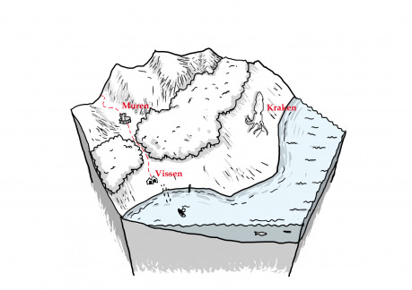
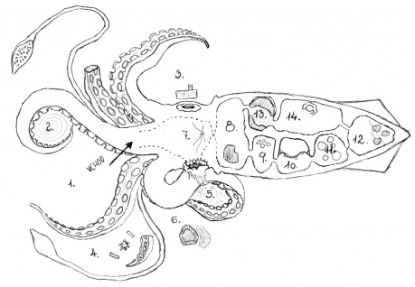

## Náhodná setkání (k6)

### 1. 2k6 lidí

- Zubožení rybáři z Vissenu. Vlečou pytle bahnem, nemají v nich nic příliš cenného. Pokud postavy vypadají bohatě a jsou raněné nebo přečíslené, v zoufalství se na ně vrhnou.
- Žoldnéři z Muren. Nesou si truhlu vyplaveného pokladu. Jsou podezřívaví a pokusí se vyhnout konfliktu. Varují postavy před mutanty podél pobřeží –děsivými věcmi, lidmi s žábrami, šedýma očima a bledou pletí.
- Skupina ztroskotaných námořníků. Potřebují se dostat do civilizace. Jsou to piráti a žoldnéři a pro startovní peníze nebo vybavení na cestu udělají kde co.

### 2. 2k8 následovníků Gargantua

- Veselí lidé, drobné mutace skrývají pod vrstvami šatů a barevnými přívěsky z perel a korálu. Pokusí se s postavami sblížit a odvést je ke krakenu pro požehnání.
- Zšedivělí křiví lidé. Vlečou několik vězňů ke krakenu pro požehnání. Díky občasnému kvílení nebo volání o pomoc je uslyšíte dříve než oni vás.
- Plíživí mutanti. Chapadla, ploutve, žraločí zuby, pokroucené kosti a páteře. Budou postavy sledovat, dokud nebude vhodná příležitost k přepadu. Snaží se všechny zajmout a odvléct.

### 3. 1k3+1 obřích krabů

- Dobývají se do pobořené chajdy, kde se před nimi schovává Flog a Vilmen, rybář a jeho syn. Flogova matka je kořenářka ve Vissenu a jejich záchranu štědře odmění (lektvar neviditelnosti, lektvar léčení a lektvar proměny ve vodního elementála).
- Skryti v bahně, dokonale splývají s okolím jako šedé placaté balvany. Zaútočí při bližším zvuku nebo otřesech.

### 4. Želatina

- Tři metry široký shluk živoucí kyseliny se sune po bahně i troskách, průhledný a téměř bez lesku. Těsně nad povrchem se v něm vznáší několik rezivých zbraní a lesklá magická dýka (vrací se po hodu).
- Černé jezírko živého oleje. Kdykoli se někdo přiblíží, vystřelí po něm lesklým chapadlem a stáhne ho pod černokožnatou hladinu. Každých několik minut se na povrchu napne bublina, praskne a vypustí do větru volání o pomoc.

### 5. Mršina

- Na pevninu vyvržená kosatka. Nadouvá se v iluzi života. Uvnitř je líheň mořských pavouků. Každé kousnutí vytvoří v oběti další líheň.
- Obří bílý žralok. Okusují jej promočení psi. V nitru má natrávená těla pirátů včetně jejich cenností, dekorovaného rapíru a mapy pokladu (náhodně vyber jiný hex z tohoto čísla a udělej X čtvrtinu šířky směrem na západ od středu).

### 6. Mořská panna

- V lidské podobě se prochází po pustině a hledá, koho by svedla do hlubin. Ploutev svlékla na pláži. Musí se s ní znovu spojit, než bude moci vstoupit do moře. Pokud by její „kůži“ někdo ukradl, mohl by ji ovládat jako plně odevzdaného otroka.

## Lokace

### Muren

Kruhová palisáda okolo lovecké osady v jediném údolí, kterým se dají překročit kopce bezpečně směrem k moři. Po nedávné tsunami plná uprchlíků z pobřeží.

- Vyhnaní osadníci se dožadují jídla a ubytování. Je jich dost na to, aby mohlo dojít k násilnostem.
- Obchodník nabízí cestu po moři do hlavního města. Jako platbu přijímá cokoli lidem zbylo. Je to otrokář a má se se svou lodí setkat za čtyři dny ve Vissenu.

### Vissen

Smetená rybářská osada plná rozlámaných lodí, prken, těl, ryb a řas. Z budov a mol stojí jen základové kůly.

- V narychlo spravené chatrči se skrývá pomstychtivá babice Varga. Vaří jedy a lektvary. Preferuje výměnný obchod a shání kusy těl i vybavení mořských potvor, jež pak i s jejich rodokmeny proklíná.
- Pohozená mušle tlumeně hučí. Po vysypání hlíny je z ní slyšet volání z druhé mušle a je možno s nimi komunikovat jako vysílačkou. Mají ji děti, které byly i se svou chatrčí odneseny na moře. Bdí nad nimi bohyně soucitu, a kdo je zachrání, se v budoucnu jedenkrát zázračně vyhne smrti.

### Kraken

Vyplavená mršina oceánského titána se ve jméně Gargantua, pána hlubin, mění v hnízdo rybích mutantů.

1. Naga. Obrovský čtyřruký strážce, spodní polovina jeho těla je tělem šupinatého ha­da. Ozbrojen dvěma páry kostěných šavlí.
1. Věznice. Vysílení lidé, lapeni v bazénku ztuhlého slizu.
1. Rybí prorok z podia nahlíží do temné budoucnosti v krakenově oku a hučícímu davu rybolidí hlásá triumf nekonečného moře a pohlcení pevniny.
1. Tlustý kuchař s tuctem chapadel místo nohou obsluhuje kotel a připravuje jídlo z kusů krakena a rozporcovaných otroků.
1. Chapadlem objatá hromada mrtvol a splašek. Prasklým okem nad chapadlem lze obejít nagu a vlézt dovnitř.
1. Otroci svázaní chaluhovými lany kopou díru. Přestože jsou znavení a zubožení, neustále se předhání v práci, aby je naga vybrala k mutaci uvnitř krakena namísto smrti na hromadě.
1. Vykotlaná hlava. Nervové spletence před sevřeným jícnem tvoří mělkou mísu. V ní jsou nehty, šupiny a chomáč vlasů. Pro otevření jícnu je třeba obětovat kus sebe sama.
1. Prostorná dutina s kalnou louží, která slouží jako portál do podmořského světa.
1. Všechny cennosti, které nebyly dostatečně třpytivé pro korálový trůn. Obraz, mahagonová socha, truhla plná kvalitních zámků a další.
1. Cela z pevné růžové blány, pokryté zelenými vředy. Vězeň je zčernalý a zjizvený rybák s vytrženým jazykem a zašitou tlamou. Může komunikovat jen posunky a chce se mstít na rybolidech za to, co mu provedli. Ví, který vřed blánu otevírá a které vředy jsou zamaskované jedovaté pasti.
1. Pětice vznášejících se kožnatých koulí o rozměrech mezi míčem a sudem. Jsou nekonečným zdrojem vzduchu, lze je využít třeba k potápění do hlubin. Průchodem do 12. je třeba se protlačit.
1. Krakenova srdce. Slepý mutant odřezává kusy a krmí jimi svázané otroky, kteří v němé křeči za vlnění kůže a praskání chrupavek pomalu mutují.
1. Masité, svalnaté stěny, strop i podlaha. Nechá projít jen jednu osobu. Pokud vstoupí více než jeden, sevře se a začne je drtit.
1. Korálový trůn obložený zlaťáky, šperky a drahokamy. Korunovaný vyslanec hlubin, humanoid s bodci a šupinami, právě vyjednává spojenectví s poradcem místodržícího z Muren. Osobní stráž mu dělají dva mutanti s oštěpy. On sám je vyzbrojen magickým trojzubcem (extraprůrazné hroty a ve snech vidiny od Gargantua).
