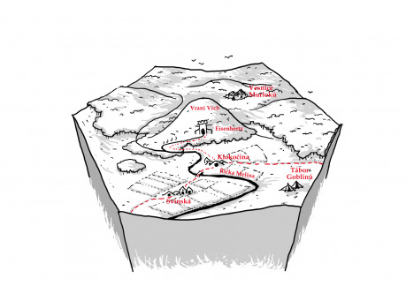
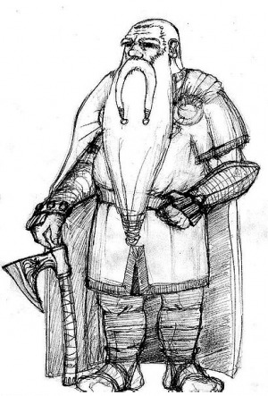

## Prostredie

Tento hex sa nachádza v miernom pásme a väčsinu hexu tvorí mierne zvlnená krajina plná pastvín a lesov. V strede hexu sa nachádza Vraní vrch, najvyššia hora v okolí. V podhorí sa zlievajú horské potoky a tvoria riečku Melinu, ktorá v údoliach medzi kopcami vytvára pokojné meandre.

## Fauna a flóra

Lesy v okolí Vranieho vrchu sú tvorené primárne dubmi a bukmi, ktorých listy vytvárajú prítmie a cez zimu vždy zabezpečia úrodnú pôdu pre podrast. Obývajú ich rôzne tvory, hlavne divé svine a vysoká zver, ale teritórium si tu delia aj dravce, na juhu v oblasti nížin obyvatelstvo terorizuje svorka vlkov, sever obýva rodina kludných owlbearov, ktorí sa civilizácii vyhýbajú. Na Vraňom vrchu paradoxne už roky nevidno žiadne vrany, pretože sa tu usídlil majestátny orol, ktorý udržuje aj populácie svišťov na stabilnej úrovni.

Pastviny sú väčšinou prílis príkre na premenu v ornú pôdu, a tak tu hobiti väčšinou pasú svoje ovce a prasatá. V okolí riečky nájdeme lužné háje plné života.

## Obyvatelia

Majoritnú populáci tohoto hexu tvoria hobiti. Tí sa zdrzujú v dvoch väčsích dedinách – v Klokočine na severe okolo riečky Meliny a na juhozápade v dedine Svinská.

Vo Vraňom vrchu nájdeme kedysi prosperujúcu trpasličiu baňu Eisenhertz, dnes už obývanú len pár desiatkami starnúcich trpaslíkov, ktorí udržujú banské mestečko v použiteľnom stave. Baňu samotnú už dávno opustili. Medzi ľudmi sa povráva, ze už celé desaťročia sa tu nenarodilo jediné dieťa. Niektorí si šepkajú, akú kliatbu na seba mohli zoslať.

Na juho-východe nájdeme tábor goblinov, ktorí podnikajú občasné nájazdy na Svinskú a občas si trúfnu aj na Eisenhertz. Hlavne v zime. Už tu žijú niekolko rokov, avšak trpaslíci sú už príliš starí a zaneprázdnení údržbou mesta, než aby im zatočili krkmi, a hobiti sa do boja nemajú.

Na severe v lužných lesoch žije komunita murlokov. Ich kmeň číta na tridsať hláv. Komunita je na úrovni doby kamennej, ale aj napriek tomu dokáže využiť svoje výhody a podniká nočné nájazdy na Klokočinu. Striehnu na neopatrných hobitov a občas dokonca vzrabujú aj nejakú osamelú noru.

## Miesta

__Klokočina__ – Hobitia dedina na severe v údolí Meliny. Asi dve stovky obyvateľov. Väčššinou rybárov.

__Svinské__ – Hobitia dedina na juhozápade. Väčšinou pastieri svíň a oviec.

__Eisenhertz__ – Trpasličie mesto duchov a opustené bane plné koboldov a ďalších škodcov.

__Goblinia osada__ – Rozkladá sa na juhovýchode a potýka sa s množstvom problémov. Počnúc nedostatkom zásob a absenciou obchodu, až po útoky vlčej svorky. Všetky tieto problémy naviac vyostrujú konflikt medzi šamanom a náčelníkom.

__Temná veža__ – Na kopci nad Klokočinou sa týči veža temného mága. Hobiti k nej s bázňou vzhliadajú, avšak o mága nikto nikdy nevidel.

__Osada murlokov__ – Tieto nežné jednoduché stvorenia sú priťahované lesklými predmetmi. Ktovie, čo všetko nahromadili počas svojich útokov?

## Osoby

__Arokaš, gobliní šaman.__ Konzervatívny starý goblin, ktorý zastáva starý, agresívny spôsob života goblinov a nábožednskou cestou podnecuje útoky na susedov.

__Kroma, mladý gobliní náčelník.__ Náčelníkom sa stal v mladom veku piatich rokov, po tom ako v boji porazil predchádzajúceho náčelníka v spore o to, či bezdôvodne napadnúť svinské. Kroma je pokrokový mladý muž a túži urovnať vztahy so susedmi a žiť v mieri.

__Flip Trojnožka.__ Mladý ambiciózny hobit zo Svinského. Miluje dobroodružnú literatúru a myslí si, že vie bojovať, ale živí sa ako pastier prasiat. Tiež tajne buduje medzi mladými zo Svojského malú armádu, s ktorou chcú vyraziť na východ a vyriešiť problém goblinov nadobro.

__Olaf Eisenhertz z Eisenhertzu.__ Posledný dedic trpasličieho mesta Eisenhertz. Jeho snom je prilákať obyvatelov do Eisenhertzu a znova priniesť do mesta jeho slávu.

__Stará Milada.__ Milada je bylinkárkou v Klokočine a je najstarsím obyvateľom tejto dediny. Naviac je tiež najodvážnejším obyvateľom. Stará Milada trávi celé dni v divočine, kde zbiera bylinky a hríby, alebo doma pripravuje tajomné lektvary.

__Agrathorix, temný mág.__ Už je to tak dávno, čo temnému mágovi ukázalo hobitie dievča krásu smrteľnosti a on sa vzdal svojej magickej moci. Teraz žije v tichosti vo svojej veži a teší sa na každú návštevu Milady.

## Zápletky

__Trpazličia sluj__ – Trpazlík Sven Rothammer by rád získal nejaké vybavenie z opustených baní. Usídlila sa tu však veľká svorka koboldov, ktorá si svoje novonabýté bohatstvo bude brániť zubami, nechtami i pascami.

__Občianska vojna__ – Rozbroje medzi náčelníkom a šamanom v orkskom tábore takmer dosiahli bod zlomu. Stačí trocha zaťahať za nitky a konfrontácia medzi nimi bude nevyhnutná. Aká budúcnosť čaká zúbožený kmeň goblinov?

__Problémy v Svinskom__ – Dedina Svinské je čím ďalej pod väčším tlakom zo strany goblinov. Podarí sa im vyriešiť problém raz a navždy? Dôjde k boju alebo úplne inému riešeniu?

__Stratené v preklade__ – Klokočina prišla o svoju zlatom vykladanú kroniku. Ukradli ju murloci alebo niekto úplne iný? Ako sa ju podarí postavám získať späť?

__Stará láska nehrdzavie__ – Stará Milada si zlomila na výlete nohu a niet nikoho, komu by zverila jedlo pre jej milého. Urobia to hrdinovia inkognito, alebo je čas aby sa i Miladinom vzťahu dozvedeli aj ostatní? Mágova veža je opustená, je dobrý nápad ju preskúmať?

__Owlbear sa hnevá__ – Zvyčajne kľudný starý owlbear sa začal správať agresívne k obyvateľom Klokočiny, obyvatelia našli aj owlbearom zabitého murloka v luhoch. Agresívneho owlbeara sledujú aj trpaslíci z Eisenhertzu.

__Nové ložiská__ – Trpasličí prospektor objavil v sluji potenciálnu žilu zlata. Starí trpaslíci si však nemôžu dovoliť ťažbu, lebo sa im mesto zrúti na hlavu. Olaf Eisenhertz je ochotný prijať do svojho mesta kohokoľvek, kto udrži lopatu, aj keby to mali byť tí špinaví goblini.
