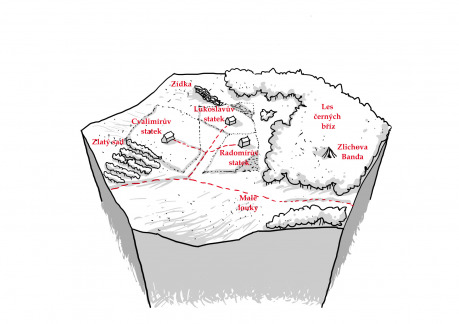

Toto prostředí popisuje rozlehlou rovinu, na které se nachází pole a grunty trojice statkářů. Před nedávnou dobou proběhl na polích dvou statkářů požár a hráčské postavy by měly vyšetřit, kdo (nebo co) za tím vězí…

## Geografie

__Cesta ze Zlatého sadu do Malých luk__ – Solidní, udržovaná cesta. Jedna z důležitých spojnic v zemi. Poslední dobou však v okolí Lesa černých bříz není úplně bezpečná.

__Les černých bříz__ – Jméno nelže. Opravdu v něm rostou břízy s černou kůrou. Nedaleko cesty se v něm usadila Zlichova banda loupežníků, kteří přepadají pocestné. Ve Zlatém sadu je na ně už vypsaná odměna.

__Pšeničná pole__ – Pole statkářů Lukoslava, Radomíra a Cvalimíra. Jejich hranice jsou vyznačeny silnými kůly. Lukoslavovo pole postihl v minulém týdnu požár. Radomírovo o dva dny později.

__Radomírův statek__ – Na statku vše funguje velmi svižně. Práce jde čeledínům dobře od ruky. V souvislosti s požáry se ale šíří zvěsti o možném žháři. Že by lupiči z lesa?

__Lukoslavův statek__ – Na statku vás pozorují páry nedůvěřivých očí a všimnete si, že statek je téměř v bojové pohotovosti. Lukoslavovi synové jsou horké hlavy a všechny na statku popohání kopanci. Sice nikdo u vzniku požárů nebyl, ale hlavním podezřelým je Cvalimír. („Tomu totiž taky nikdy nic nechytlo, že jo.“)

__Cvalimírův statek__ – Statek zámožného hobita je vybaven mnoha vymoženostmi, které se jinde jen tak nenajdou (obrovská stodola mluví za své). O požárech se tu ví. Že by lupiči z lesa?

__Zídka na severu__ – Pozůstatek po jakémsi obydlí z dávné minulosti. Může však skrývat nejednu čertovinu.

## Postavy

__Radomír__ – Je to rozumný, přemýšlivý dobrák. Ukvapená rozhodnutí jdou mimo něj. Při vyšetřování se bude snažit jakkoli pomoci. Má dva syny – Radovana a Radka – a pěknou dceru – Jahodku. Ta se do jedné z hráčských postav zamiluje. Ale pozor! Na Jahodku má spadeno Bojan.

__Lukoslav__ – I Lukoslav je ve své podstatě přímý a rovný chlap, jenom nad svými dvěma syny – Bojanem a Borkem – již ztrácí pevnou ruku. Budou-li hráčské postavy vlídné, bude se také snažit pomoci.

__Cvalimír Žitorád__ – Je to starý skrblík a pro groš by si nechal koleno vrtat. Vina ale není na jeho straně a i on se ve skrytu duše obává, že by červený kohout mohl příště zaplápolat i u něj. Má syna Bilba, který je někde ve světě na cestách. To víte. Hobiti…

__Zlichova banda__ – Tvoří ji lupič Zlich, střelkyně Tříska, kouzelník Anor a bojovníci Gog a Kull. Není radno s nimi bojovat, protože nejsou žádní zelenáči. Ale ani oni žádná pole nezapálili. Ve skutečnosti však vědí, jak se to celé má. Na ohnivého vraníka mají spadeno, protože z toho kápne tučný zisk. Už ho jednou naháněli, ale neúspěšně. (Gog má z toho spálené ruce omotané provizorními obvazy.)

__Drgvaš__ – Postavy jej mohou potkat, jak táboří u zídky na severu. Vypadá jako zarostlý chlap v lesnickém oděvu (na hlavě nosí klobouk, skrývající jeho rohy). Představí se jako královský lesník, který má nějakou práci v Lese černých bříz („Prý se tam usadila nějaká škodná.“) a pak poputuje na sever. O žháři ví jenom z doslechu a ohnivé koně neviděl („Vážně? Ale co vás nemá…“), ale kdyby se ho podařilo chytit, tak by ho za nějakých 150 zlatých koupil… (Pravda je taková, že Drgvaš je ve skutečnosti čert a postavy by to neměly alespoň zpočátku uhodnout.)

## Jak to celé bylo?

Zlichova banda před týdnem prohrabávala kamení v zídce na severu a tím probudila čerta Drgvaše a jeho ohnivého vraníka ze spánku. Ten se splašil a v kruzích brázdí krajinou. Drgvaš ho na lidi neposílá úmyslně. Sám ale ještě není úplně při síle, aby jej zkrotil (to víte – když vás probudí po stoletém spánku…). Pomoc postav by se mu tedy i hodila. Pokud mu jej ale postavy nebudou chtít prodat, za pár dní si pro vraníka přijde, nasedne na něj a s hromy, blesky, smradlavým kouřem a hlasitým chechotem se propadne do země. Zůstane po něm jenom jeden zlatý dukát…

## Tipy pro hraní dobrodružství

- Postavy lze motivovat například tak, že v hospodě ve Zlatém sadu narazí na mlynáře Bodřicha Práška, který si postěžuje, že jeho tři dodavatele obilí sužuje nějaký žhář. Bodřich postavám za vyšetření slíbí odměnu…
- Při hraní samotném mají postavy velký prostor s kým spolupracovat a s kým nikoliv. Mohou spolupracovat nejenom se statkáři, jejich syny a čeledíny, ale i se Zlichovou bandou či Drgvašem (který se ale ostatních lidí bude snažit spíše stranit a na den vždy někam zmizí…).
- Budou-li postavy příliš dlouho otálet, objeví se na scéně královští strážní či lakomí alchymisté – Enšude a Etuxbert. Ti sice mohou připravit zásob lektvaru chladných vod dost, ale vraníka si budou snažit ukořistit pro sebe…
- A samozřejmě se postavy zúčastní „nájezdu“ ohnivého vraníka na pole v „přímém přenosu“…
- A jak se takový ohnivý vraník nahání a chytá? To zjistíte nejlépe sami při hře! Bavte se.
