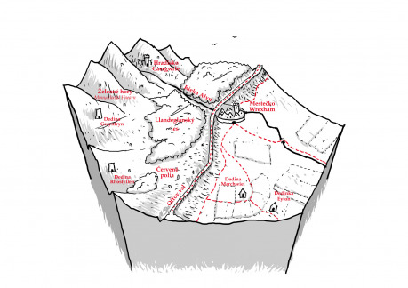

## Rieka Alyn

Dravá rieka, ktorá naberá vodu v Mynyddoedd Haearn, Železných horách. Tvorí severnú hranicu mestečka Wrexham, pri mestečku má šírku približne 30 metrov. Je to obchodná tepna, po ktorej sa obomi smermi plavia lode naložené rôznym tovarom.

### Zápletky

__Nočný prepad__ – Obchodnú bárku, ktorú strážite na ceste do Wexhamu, v noci prepadli riečni piráti. Ale sú to naozaj piráti? A prečo bol kapitán Esmund taký nezhovorčivý, keď prišla reč na náklad?

__Povedeň__ – Po náhlom jarnom oteplení sa Alyn rozvodnila, a z hôr priniesla bahno, kríky a kmene stromov, ktoré vytvorili hrádzu pri riečnej mreži. Zatopila veľké územie pred valom, a odrezala baróna Gladwina Blytheho a jeho lovecký sprievod za valom. Aj keby sa pri obchádzaní zaplaveného územia niekde zdržali, mali sa z lovu vrátiť už pred niekoľkými dňami. Kam zmizli?

__Krvavá rieka__ – Chladné ráno po splne mesiaca prinieslo obyvateľom Wrexhamu nečakané prekvapenie. Voda v rieke bola krvavo červená. Čo sa stalo? Prečo sa rieka nečistí a ostáva krvavo červená?

__Nemé pozdravy__ – Keď sa o mreže v rieke zachytila mŕtvola elfa, nikto sa veľmi neprekvapil, občas sa to stáva. Keď na druhý deň priplávali dve včelárky, bolo to nezvyčajné. Na tretí deň priplávali tri mŕtvoly trpasličích drevorubačov. Na štvrtý deň mŕtva škretia samica a tri mláďatá. Na piaty deň priplávalo pať mŕtvol zvedov z pohraničnej stráže. Čo sa deje? A kde je zvyšok patroly zvedov, ktorí z Wrexhamu vyrazili na rutinnú patrolu len pred niekoľkými dňami? Budú sa počty mŕtvol ďalej stupňovať? Čo znamená podivná runa, ktorú majú všetky mŕtvoly vyrezanú na hrudi?

## Offov val

Obrovský zemný val, ktorý sa tiahne krajinou zo severu na juh a oddeľuje škretie klanové územia od kráľovstva Mercia. Začína aj končí v mori, je dlhý vyše 240 kilometrov.

Samotný val je široký asi 20 metrov, a vysoký asi tri metre. Polovicu šírky valu tvorí štyri metre hlboká priekopa. Na vrchole valu je dvojitá drevená palisáda, medzi ktorou je udupaná hlina a kamene, a prejdú po nej vedľa seba traja bojovníci. Každých niekoľko stoviek metrov sa nachádza drevená strážna veža s malým prístreškom pre hliadku. Na vrchole každej veže sa nachádza pripravené suché drevo na signálny oheň.

Val dal pred desiatkami rokov postaviť kráľ Offa na východnej hranici svojho kráľovstva, aby ochránil Merciu pred nájazdami škretov zo Železných hôr a elfov z Llandegladského lesa.

Hliadka v každej veži má štyroch členov – veliteľa, psovoda a dvoch vojakov. Zvyčajne sa striedajú po dvojiciach v dvanásť hodinových intervaloch. Majú kožené prešívanice, sekery, tesáky, štíty, kopie, helmy, kuše a signálne rohy. Psovod má zvyčajne tri-štyri obrovské psy cvičené na stopovanie, stráženie a boj s ľuďmi. V strážnej veži majú zásoby jedla na niekoľko týždňov, pravidelne im ich dopĺňa posádkový zásobovač. Hliadky sa striedajú nepravidelne, presný rozpis striedania pozná len veliteľ hliadky a jeho seržanti.

### Zápletky

__Pašeráci__ – Vraciate sa z výpravy do Železných hôr, a nesiete niečo, čo nemôžu vidieť oči mestkej stráže kontrolujúci pri Východnej bráne všetkých pútnikov prichádzajúcich spoza valu. Ako prekonáte val tak, aby vás nikto nechytil?

__Stratená hliadka__ – Keď prišli strážnici vymeniť svojich druhov, našli prázdnu strážnicu. Nikde žiadne stopy boja, popol v krbe bol ešte teplý, a cestovné zásoby, ktoré si strážnici berú na pochôdzky, boli nachystané, ale nikto si ich zo sebou nezobral. Veliteľ stráže vypísal po niekoľkých dňoch od zmiznutia odmenu za nájdenie hliadky, ale ešte sa nikto neprihlásil.

__Signálny oheň__ – Chladný jesenný večer. Zrazu sa v diaľke na juh od Wrexhamu rozhorel signálny oheň na jednej z veží. A ďalší. A ďalší. A ďalší… Po chvíli blčalo plameňom viac ako tucet signálnych veží oznamujúcich nebezpečenstvo. Čo sa deje?

## Mestečko Wrexham

Mestečko má asi 1500 prevažne ľudských obyvateľov, žije tu aj niekoľko desiatok trpaslíkov a podrobených elfov. Ľudia vystavali Wrexham na troskách staršieho elfského mesta, ktoré obsadili počas rozpínania Mercie.

Staré elfské mesto obohnali ľudia kamennými hradbami, okolo ktorých vzniklo drevenou palisádou chránené nové mesto. Súčasťou starého mesta, v ktorom žije približne 300 ľudí, je opevnený elfský dom, niekoľko kamenných domov miestnej šľachty a tvŕdza Glyndŵr, ktorú obýva Sigeweard, člen čarodejného Konventu, niekoľko jeho učedníkov a sluhov. Trpaslíci a podrobení elfovia žijú v novom meste neďaleko prístavu, kde sa nachádza aj malá pobočka trpasličej banky Silberdorn & Messerchmied.

Na severe mesta sa nachádza malý riečny prístav, ktorý plynule prechádza do trhoviska. Na východnej strane mesta, ktorú chráni Offov val, je rieka prehradená zdvýhateľnou mrežou, ktorá chráni mesto pred útokom po rieke.

V meste má sídlo pohraničná stráž, nazývaná Modrí psi podľa zlatej psej hlavy na modrom pozadí vo svojom znaku. Opevnená ubytovňa Modrých psov sa nachádza pri Východnej bráne smerujúcej do Železných hôr. Posádka má zhruba veletucet (144) členov. Veliteľ posádky, kapitán Sigeberth Morton, má pod sebov piatich seržantov, hlavného zveda, tucet desiatnikov, posádkového felčiara, kuchára a niekoľko ich pomocníkov. Prevažná časť posádky sa väčšinu času zdržuje v strážnych vežiach alebo na patrolách za valom, v meste je len zhruba tretina posádky.

Škreti do mesta prístup nemajú. Ak chcú obchodovať, môžu tak urobiť na takzvanom škreťom trhu pred východnou bránou, spolu s lovcami kožušín a osadníkmi z usadlostí za valom.

Mestskú radu tvoria barón Osmund Perry, starosta mesta a správca prístavu, Leofric Blackwood, obchodník s drevom, Irwin Rowley, obchodník so železom, Rainer Engilram, zástupca trpasličích remeselníkov, kapitán Sigeberth Morton, veliteľ pohraničnej stráže, kapitán Ewart Holton, veliteľ mestskej stráže, a čarodej Sigeweard, zástupca Konventu.

### Zápletky

__Druhý úsmev__ – Filiberta Čierneho, trpasličieho kováča a zbrojára, našiel ráno jeho učeň s podrezaným hrdlom priamo vo vyhni. Kto ho zabil a prečo?

__Horiaca Wilburga__ – Noc rozjasnil obrovský oheň v prístave. Obchodná bárka Wilburga, ktorá sa niekoľko krát do roka objavila vo Wrexhame, blčí jasným plameňom. Posádky susediacich lodí v panike polievajú paluby a plachty vodou a snažia sa so svojim loďami dostať čo najďalej od horiacej Wilburgy. Kde je Wilburgyna posádka? Prečo nikto nehasí požiar? Čo sa stalo? Wilburgyn kapitán bol večer v hostinci nezvyčajne tichý, pochudnutý, a od poslednej návštevy Wrexhamu značne zošedivel.

__Neznámi útočníci__ – Príjemný večer v prístavnom hostinci zrazu narušila hromadná bitka lodníkov. Kým sú všetky oči upreté na bitku pred výčapom, k vašemu stolu sa sťahuje polkruh takmer tuctu podozrivých indivíduí s tesákmi, obuškami alebo harpúnami v rukách. Kto sú a čo chcú?

__Lynčovanie elfov__ – Uprostred rušného ranného trhu sa z davu zrazu vynoria ozbrojenci, ktorí k šibenici vedú rodinu elfského rezbára v putách. Okolo nich silnie dav vykrikujúcich ľudí, ktorí na elfov hádžu lajná, blato, vajcia a kamene. Niekoľko ľudí chystá slučky a kruto sa smeje. Kde sú mestskí strážnici? Prečo ľudia útočia na elfskú rodinu? Má to niečo spoločné s nedávnym úmrtím manželky jedného z bohatších obchodníkov zo starého mesta, ktorá umrela pri pôrode, a o ktorej bolo známe, že rada zbierala elfské umenie?

## Dedina Marchwiel

Väčšia dedina neďaleko Wrexhamu. Žije tu zhruba 100 sedliakov, ktorí sa živia predajom zeleniny a ovocia v meste.

### Zápletky

__Smrť v stodole__ – Kto zabil v stodole na okraji dediny mladé dievča, Leofflaed a prečo? Krvavá elfia dýka pohodená vedľa tela je veľmi okatá stopa.

__Záhadný cudzinec__ – Čo skrýva zjazvený sedliak, ktorý vyzerá, ako keby ho požul a vypľul ohnivý drak? Čo znamenajú runy vyryté do čepele meča, ktorý ukrýva v chalupe pod podlahou?

## Dedinka Eyton

Menšia dedina neďaleko Wrexhamu. Žije tu zhruba 70 pastierov, ktorí chovajú ovce, kravy, ošípané a hydinu, a predávajú mäso, mlieko a vlnu v meste.

### Zápletky

__Horiace salaše__ – Ktosi podpálil niekoľko salašov v okolí dediny. Kto a prečo?

__Krvavý biftek__ – Keď ste prišli na čistinu, uvideli ste niekoľko mŕtvych kráv a volov, roztrhaných na kusy, a rozhádzaných po celej čistine. Z dvoch pastierov, ktorí tu mali byť, ste našli len jednu nohu. Čo sa tu stalo?

## Červené polia

Červené polia dostali svoje pomenovanie po legende, ktorá hovorí, že po obrovskej bitke medzi elfami na jedne strane, a mercijskými vojakmi a ich trpasličími žoldnierskymi spojencami na strane druhej, sa zelené polia pod nánosom preliatej krvi zmenili na červené. Momentálne je to územie nikoho, keďže ľudia sa tam boja usadiť sa, a zmluva medzi porazenými elfami a mercijským kráľom tam zakazuje elfom usadiť sa. Po Červených poliach sa túlajú stáda divých koní, zubrov a mamutov. Desiatky rokov po veľkej bitke túto udalosť pripomínajú iba roztrúsené menhiry a niekoľko mohýl, ktoré boli elfom dovolené vybudovať na pamiatku elfských mŕtvych. Vrcholky mohýl zdobia mohutné duby. Elfí divotvorci svojou mágiou vytvarovali na kmeňoch dubov podoby zabitých elfích kniežat a rytierov, a ľudia sa im vyhýbajú, veria, že sa tam zjavujú duchovia mŕtvych elfov hľadajúci pomstu.

### Zápletky

__Splašené mamuty__ – Červenými poliami sa ženie obrovské splašené stádo mamutov rovno na vás. Čo ich vyplašilo?

__Nebezpečný omyl__ – Váš tábor za zvuku rohov znenazdajky obkľúči približne tucet po zuby ozbrojených jazdcov Pohraničnej stráže, a v mene zákona vás vyzve odhodiť zbrane a vzdať sa. Čo sa deje? Prečo vás chcú zatknúť?

__Vlčí strážci__ – Na ceste vás dobehne sedem ozbrojencov, štyria muži a tri ženy. Všetci majú elfské meče, tesáky, kopie a na chrbte dlhé elfské luky. Na tak dobre vyzbrojenú skupinu je prekvapujúce, že nikto z nich nemá žiadne brnenie. Erb, obrovský čierny vlk s vycerenými zubami pod košatým zeleným dubom na striebornom pozadí, neprítomnosť brnenia okamžite objasní – práve ste sa stretli s Vlčími strážcami. Sú to vlkodlaci v elfských službách chrániaci elfov na potulkách mimo Llandegladského lesa. Veliteľka oddielu sa vás pýta, či ste náhodov nevideli skupinu severanov, ktorí unieslí niekoľko elfiek a elfích detí.

__Moirinina mohyla__ – Najväčšia elfská mohyla na červených poliach, ktorá stojí uprostred kruhu dvoch tuctov obrovských menhirov pokrytých elfskými runami. Moirin bola elfská vojvodkyňa, ktorá padla spolu so svojou elitnou gardou dvoch tuctov najlepších elfích a vlkodlačích bojovníkov. V noci vás prebudilo hlasné vlčie zavýjanie a nad mohylou ste videli čudné svetlá. Čo sa tam dialo?

## Llandegladský les

Llandegladský les je útočiskom elfov, ktorých pred desiatkami rokov vyhnali mercijské vojská kráľa Offa za líniu, ktorú dnes označuje Offov val. Je tu niekoľko malých elfských dedín a pomerne veľa samôt. Celkovo v Llandegladskom lese žije niekoľko stoviek elfov, zvyšky štyroch veľkých elfích domov.

Elfovia z Llandegladského lesa sa živia prevažne ako uhliari, včelári a rezbári. Ľudia sem chodia ťažiť drevo, za ktoré musia elfom platiť. Riskujú pri tom občasné útoky nespokojných, prevažne mladých, elfov, a časté útoky škretov, ktorí s elfami súperia o drevo.

### Zápletky

__Knieža Coinneach (Iarla Coinneach)__ – Celým menom Iarla Coinneach aep Siobhan aep Jarlath ó Mordha de Teach an Dearg Beithe je jedným z elfských kniežat, ktoré stratili svoj domov v boji s mercijskými vojakmi. Po strate rodového sídla sa túla po celom Llandegladskom lese v nádhernej elfskej krúžkovej zbroji, s mečom na chrbte a kopiou v ruke. Snaží sa chrániť elfské usadlosti a samoty pred škretmi, ľuďmi aj divou zverou. Coinneacha sprevádza jeho veliteľ stáže, šľachovitý starý vlkodlak s obrovským obojručným mečom, vlkodlakova jediná dcéra, ktorá prežila vypálenie elfského sídla, ozbrojená elfím lukom, jej priateľka, polelfka – divotvorkyňa, a Coinneachove elfské páža – synovec, ktorého knieža učí staré elfské zvyky, piesne a spôsob boja. Coinneachov erb je strieborný strom na cervenom pozadí. Po vyhnaní a vyvraždení takmer celého rodu Coinneach erb upravil, korene sú oddelené od zvyšku stromu.

__Stratená berň__ – Voz s barónovým pokladníkom, šiestimi po zuby ozbrojenými zbrojnošmi a vybranými daňami od drevorubačov, uhliarov a včelárov niekto prepadol. Na mieste ostal len napoly zhorený voz a telá zbrojnošov. Kde je telo pokladníka? Kto prepadol voz? A kam zmizlo vyzbierané striebro?

__Elfí poklad__ – Hovorí sa, že niekde v Llandegladskom lese sa nachádza stará elfská hrobka, v ktorej utekajúci elfovia ukryli šperky, zlato a striebro pred postupujúcimi mercijskými vojakmi. Nik však nevie, kde sa nachádza, a či vôbec existuje, čo však nebráni rôznym hrdlorezom a dobrodruhom brázdiť elfský les, unášať, mučiť a vydierať elfov, o ktorých sa domnievajú, že by mohli poznať cestu k hrobke.

__Mŕtvi drevorubači__ – Niekto vyvraždil tábor drevorubačov neďaleko rieky. Pri bližšom skúmaní si všimnete, že škretie šípy majú kvalitné oceľové hroty, aké škreti nedokážu vyrobiť. Jeden alebo dva by boli náhoda, ale všetky? Čo to znamená?

## Mynyddoedd Haearn, Železné hory

V Železných Horách žijú tri škretie kmene. Škretov, pôvodných obyvateľov Albionu, do hôr zahnali elfovia, ktorých na oplátku z úrodných planín a šírych lesov južného Albionu vyhnali rozpíjanúci sa ľudia s pomocou trpasličích žoldnierov.

Železné Hory vyrastajú z mora, vysoké snehom pokryté štíty oddeľujú hlboké údolia. Je to posledné útočisko škretov, ktorých sem zahnali elfovia svojimi oceľovými zbraňami, voči ktorým boli škretie bronzové a železné zbrane nerovnomernými súpermi. Po objavení bohatých rudných nálezísk sa elfovia a po nich aj ľudia snažili vyhnať škretov z hôr, ale nikomu sa to nepodarilo. Škreti, hrdí bojovníci, poznajú hory ako nikto iný a už nemajú kam ustúpiť, čo ich robí v horách neporaziteľnými.

Železné hory sú posiate brochmi – tradičnými škretími obrovskými kammenými vežami stavanými bez použitia malty. Broch má dve steny, vonkajšiu a vnútornú, a dve alebo tri poschodia. Do brochu vedie len jeden vstup, ktorí škreti v prípade nebezpečenstva zavalia skalami. Na vrchu brochu vždy bdie hliadka. V každom brochu žije zvyčajne jeden až dva tucty škretov patriacich k jednej rodine.

V Železných horách sú tri veľké škretie sídla a množstvo menších, žije tu niekoľko tisíc škretov.

### Zápletky

__Prepadnutie v horách__ – Sprevádzate kupca Eadbertha a jeho pomocníkov, ktorí na niekoľkých vozoch vezú náradie, múku, korenie a striebro, ktoré plánujú vymeniť za železnú rudu od škretov. Keď sa vynoríte z kľukatej sútesky, narazíte na zátarasu z obrovských kameňov, spoza ktorej vás pozoruje niekoľko ozbrojených škretov. Za vami sa zjaví ďalšia tlupa, a pohľad hore odhalí škretov po oboch okrajoch sútesky. Čo urobíte?

__Rodinný obed__ – Vyšli ste z porastu kosodreviny na malú čistinu, kde ste narazili na obrovskú samicu horského trolla a tri jej mláďatá. Vyzerá to, že hodujú na mŕtvole trpasličieho kupca a jeho dvoch zbrojnošov. Samica trhá krúžkové zbroje pazúrmi a zubami a hádže kusy mäsa mladým. Keď vás zbadá, jedným švihnutím mohutnej tlapy zmetie všetky mladé za seba, zdrapí obrovský hrdzavý obojručný meč, ku ktorému kto vie ako prišla, výhražne zavrčí a vycerí na vás obrovské krvavé tesáky. Zrazu sa jedna z domnelých mŕtvol pohla a kričí o pomoc. Čo urobíte?

__Lavína__ – V noci padla kamenná lavína a zasypala Havraní priesmyk. Uviazli ste v horách spolu s unesenými elfskými deťmi, ktoré ste oslobodili z rúk severských otrokárov. Ako utečiete zo škretích klanových území? Bola lavína náhoda, alebo ju spustilo vytrvalé dunenie škretích bubnov, ktoré sa v horách ozývalo od západu slnka?

__Medvedia ochranka__ – Lovci, ktorí sa pokúšali vystopovať a uloviť údajného medveďa ľudožrúta, ktorý zliezol z hôr a zaútočil na uhliarov, sa v horách stretli s nezvyčajným odporom – z temtoty lesa na nich lietajú kamene z praku, elfské aj škretie šípi, a dokonca raz na nich niekto vystrelil niekoľko šipiek z trpasličích kuší. Kto chráni medveďa?

## Hradisko Caergwrle

Hradisko je najväčšie škretie sídlo Železných horách, je to pôvodne elfská železná baňa s malou tvŕdzou. Žije tu okolo tristo škretov klanu Železnej ruky, ktorí spod zeme dolujú železnú rudu a predávajú ju ľuďom. Okolo tvŕdze je postavených asi tucet brochov.

### Zápletky

__Nákaza__ – Na hradisku sa objavila neznáma nákaza, ktorej už podľahli tri tucty škretov. Poslovia, ktorých náčelník vyslal poprosiť o pomoc elfských divotvorcov, zistili, že rovnaká nemoc postihla aj elfov v lese. Keď ste stretli nepravdepodobnú skupinku elfov a škretov, už boli na žive len dvaja škreti a jeden elf. Odnesiete ich prosbu čarodejovi Sigeweardovi?

## Dedina Gwynfryn

V dedine, ktorú tvorí deväť brochov, žije asi stoosemdesiat škretov klanu Tancujúceho orla. Živia sa ťažbou medi a uhlia.

### Zápletky

__Medzi kladivom a kovadlinou__ – Do dediny ste prišli z poverenia trpasličieho klanu šperkárov dojednať dodávky medi. Uprostred vyjednávania s náčelníkom Meuricom Červeným orlom na čistine medzi smrekovým lesom a brochmi sa na okraji lesa objaví početná skupina ľudských ozbrojencov s vytasenými zbraňami. Nemajú žiadne zástavy ani erby, na základe ktorých by ste ich identifikovali. Čo chcú a skade sa tu zjavili? Škreti zavrčali, vyskočili na nohy a tiež vytiahli zbrane. Je ich oveľa menej, len náčelník, jeho štyria elitní bojovníci a šaman. Zrazu ste sa ocitli medzi útočníkmi a škretmi, ktorí sú ďaleko od bezpečia svojich brochov. Čo urobíte?

## Dedina Rhostyllen

Najmenšie z troch veľkých škretích sídiel, Rhostyllen tvorí sedem brochov, a žije tu asi stopäťdesiat škretov. Rhostyllenskí škreti ťažia v podzemí kamennú soľ.

### Zápletky

__Dračí kult__ – V okolí sídla rhostzllenských škretov sa vraj začal potulovať tajomný škret s drakom vytetovaným na hrudi, a láka osamelých škretov, aby sa pridali k dračiemu kultu. Z dediny už zmizli šiesti mladí bojovníci, a nikto ich, ani tajomného škreta nevie nájsť. Našli sa len dve zohavené mŕtvoly, ktorým niekto spálil tvár a do hrude vyrezal draka. Náčelník nemôže nikoho uvoľniť zo soľných baní, lebo by nenarúbali dostatok soli na nákup zásob na blížiacu sa zimu. Pomôžete mu?
