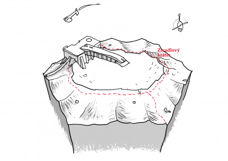

Zrcadlový kráter vznikl dopadem křemičitého asteroidu na povrch planety. Při dopadu byla odhalena ložiska stříbra a materiál byl vymrštěn do okolí. Stěny kráteru tak z velké části pokryla vysoce reflexní vrstva.

Když přišli kolonisté, využili toho, jak zrcadlový kráter odráží sluneční svit, zaměřili ohnisko a během noci (která tu trvá 108 pozemských dní) do něj vystavěli věž, která sluneční paprsky zachycuje a převádí do nitra komplexu. Ten využívá sílu slunce k výrobě energie i k tavení rud a obecně zpracování materiálů.

V následujících letech byl povrch kráteru uměle vylepšován, stejně jako věž, která se posouvá spolu s ohniskem, aby lépe zachycovala odražené paprsky i v pozdějších fázích dne.

## Co se může stát

- Při úpravách kráteru tam někdo schoval něco cenného. Třeba pár cihel zlata, platiny, iridia nebo jiného cenného kovu. Nebo to mohou být optické hranoly, s jejichž pomocí se dá solární věž přestavět na zbraň. Jenže se tam dá dostat až po západu slunce, až povrch kráteru vychladne.
- Solární věž byla upravena na zbraň. Je to teď (přes den) velmi výkonné laserové dělo. Kdo ho má pod kontrolou, drží celou kolonii v šachu.
- Přímo do kráteru přistála kosmická loď. Za hodinu svítá. Jestli tam zůstane, posádka se nejspíš upeče. Proč tam vlastně přistáli? Chtějí vyzvednout něco z kráteru? Nebo snad do svítání obsadit solární věž?
