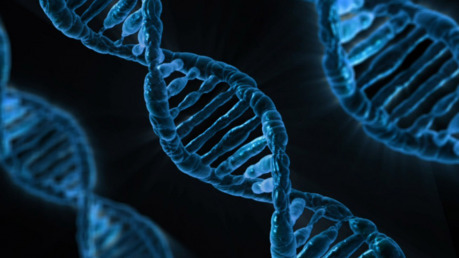

## Editujeme geny

V prvních prosincových dnech proběhl ve Washingtonu mezinárodní summit o editování lidského genomu. Na pořadu dne bylo jak jeho vědecko-technické pozadí, tak možné dopady na společnost. Možnosti genetických modifikací se rozvíjejí opravdu rapidně a některé techniky už se stávají i komerčně dostupnějšími.

Jedním z nejúspěšnějších a zároveň finančně nejdostupnějších systémů genového editování je CRISPR/Cas. Jde o součást prokaryotního „imunitního systému“, který bakteriím a archeím dodává odolnost vůči virovým infekcím bakteriofágy. Za pomoci malých RNA, tzv. guide RNA, umí najít a vystřihnout specifický úsek DNA. To jsme sice uměli už dříve, ale starší metody vyžadovaly náročnější přípravu než využití CRISPR/Cas. Ten byl poprvé laboratorně použit k editování DNA v roce 2012 a rychle se stal velmi rozšířenou metodou.

Čínští vědci ze Sunjatsenovy univerzity v Kantonu letos na jaře publikovali výsledky snahy opravit škodlivou alelu pro beta-talasémii (typ anémie) v lidských embryích. Úspěšnost nebyla stoprocentní, nastaly i změny mimo cílovou oblast a autoři výzkumu došli k závěru, že technologie CRISPR/Cas není dosud připravena pro použití na životaschopných lidských embryích. Ta doba však nejspíš není příliš daleko...

## Děti na objednávku?

Nabízí se tu široké spektrum aplikací. Když se teď budeme soustředit jen na člověka, bylo by relativně snadné z embryonálních buněk odstranit škodlivé alely pro monogenně (jedním genem) podmíněné choroby jako cystickou fibrózu, řadu typů anémie či různé formy svalové dystrofie – a to je stále jen zlomek všech poruch, které by se podobně daly odstranit. Kdybyste měli podobné škodlivé alely v rodině, nechtěli byste zajistit, že vaše děti budou zdravé a neponesou je ani do další generace?

Většina z nás by pravděpodobně souhlasila s podobným využitím modifikací. Ale když už se začnou využívat, zastaví se tam? To je obtížně uvěřitelné. Už dnes se o „designovaných dětech“ nejen spekuluje, ale probíhá pololegální sekvenování a výběr z více embryí při umělém oplodnění a legální výběr dárců spermatu podle pravděpodobnosti požadovaných vlastností a „kompatibility“ s genotypem matky. Zatím jsou podobné praktiky přinejmenším pochybné, a to zejména díky znakům podmíněným více geny, vzájemným interakcím různých genů a alel genů, vícenásobným vlivům jediného genu a epigenetické dědičnosti. Asi nejlépe se dá na náš genom pohlížet jako na složitou síť, kde jsou jednotlivé uzly silně propojené – a velmi často různě v závislosti na tom, o jakou konkrétní alelu určitého genu právě jde.

Nejde navíc o síť s jedinou úrovní, to by byl příliš zjednodušený pohled. Do výsledného fenotypu (vlastností organismu) zasahují vývoj, prostředí, výchova… Interakce mohou být opět různé v závislosti na konkrétním vyladění podmínek. Ačkoli bychom tedy uměli opravit jediný gen způsobující určitou chorobu nebo dokázali změnit něco jednoduše podmíněného jako barvu očí, od nalezení „nastavení“ pro vysokou inteligenci, psychickou stabilitu, kreativitu, skvělé zdraví, fyzickou sílu a výdrž a další potenciálně žádané vlastnosti jsme velice daleko. Je také velmi pravděpodobné, že extrémy některých z těchto vlastností se budou vzájemně vylučovat nebo že s sebou ponesou nežádoucí efekty, které nepůjde ještě dlouho odstranit. Znalost těchto vztahů a závislostí se ovšem rychle posunuje kupředu, a tak není nepředstavitelné, že v dohledné době na „dítka dle návrháře“ v určité míře dojde. Například co do vysoké inteligence je díky zkoumání velkého vzorku populace už vytipována řada alel mnoha genů, které by se na ní mohly podílet.

## Čeká nás katastrofa?

Řada sci-fi se věnuje sociálním důsledkům rozmachu genového inženýrství. Většinou skýtá nelichotivý obrázek silně rozvrstvené společnosti, v níž si ti nejbohatší mohou dovolit náročné modifikace, díky nimž jsou chytří, krásní a silní, a o „obyčejné“ ani pohledem nezavadí. Hrozí nám něco takového? Do značné míry asi ano. Už dnes v řadě států platí, že jen ti nejbohatší mají přístup ke špičkovému vzdělání, medicíně či pracovním příležitostem. Možnost „GMO dětí“ by mohla tuto propast ještě zvětšit. Existuje nějaký způsob, jak se takové větší či menší dystopii vyhnout?

Naštěstí ano, podobná jako se vzděláním či lékařskou péčí – učiňme tu možnost přístupnou pro všechny. V případě výrazného zlevnění příslušných technologií to není nepředstavitelné, minimálně ve státech, které se snaží propast neprohlubovat. Masové rozšíření genetických modifikací člověka ale možná povede k jinému často zmiňovanému problému… Dá se očekávat, že všichni budou chtít chytré, krásné, zdravé a silné děti. Co když se společností začnou masově šířit módní trendy a v určité generaci skončí většina lidí jako zelenoocí zrzci s absolutním sluchem? Podobné trendy by mohly výrazně snížit lidskou diverzitu. Problém s vlastnostmi další generace by pak nemusel nastat, pokud i ona bude více dílem designérů než gamet „rodičů“, ale co když se ustálí preference třeba pro bílou pleť nebo vysokou tělesnou výšku? A jak možnost volby ovlivní poměr pohlaví? Viděli jsme jeho vychýlení v Číně…

Zpočátku by se někteří rodiče mohli k podobné homogenizaci uchýlit z pragmatických důvodů. Pokud má na trhu práce nejvyšší šanci vysoký muž světlé pleti, hnědých očí a symetrických rysů, proč si pořizovat dítě, které by mělo horší šance na společenský úspěch? Doveden do krajnosti je tento scénář zřejmě ještě děsivější než první. Zpočátku by zřejmě nebylo jiné cesty než modifikace regulovat a nedopustit, aby se v generaci nacházelo mnoho jedinců jako „přes kopírák“. Jaké vlastnosti ale regulovat? Jen fyzický vzhled a pohlaví, nebo i osobnostní dispozice, inteligenci, zdravotní předpoklady…? Kde končí rozumná omezení? Zřejmě naším jediným štěstím je, že design skutečně „na míru“ patrně velmi dlouho zůstane v říši science fiction a v reálu půjde hlavně o jednoduché úpravy, zatímco složitěji podmíněné vlastnosti ještě dlouho nepůjde spolehlivě odhadnout.

Zatím jsme se pohybovali jen v oblasti manipulací s existujícím lidským genomem. Ale proč nevytvořit transgenního člověka? Je libo rozlišovat více barev, lépe vidět ve tmě, zařídit si výkonnější metabolismus svalů…? Představa vnášení genů jiných druhů do lidského genomu leckoho děsí. Přinejmenším zpočátku by ale nejspíše nebylo povoleno jejich zanášení do zárodečné linie buněk, takže přenosu na další generaci by se zamezilo. Také by se nejspíše velmi dlouho jednalo jen o jednoduché, monogenně podmíněné znaky – a jejich dopad umíme předvídat docela dobře. Katastrofa globálních rozměrů se nezdá být na pořadu dne. Časem by se však hranice mezi druhy mohla rozmazat ještě více než nyní. (Co je druh? Definice, že sestává z jedinců schopných spolu počít plodné potomstvo, má až příliš mnoho výjimek…)

Nečekaných vedlejších efektů se můžeme obávat vždy, troufám si však říci, že nejvíce u rozsáhlých zásahů do našeho vlastního genomu – vůbec sem nemusíme tahat jiné druhy. Stačí, že neúmyslně snížíme lidskou variabilitu v určitém ohledu, zvýšíme tendenci k nějaké poruše, odstraněním schizofrenie snížíme kreativitu… Dosaďte si, co chcete. Nejhorší je, že podobných nevítaných změn bychom si nejspíše všimli až na populační úrovni třeba až po několika generacích. Udržování důkladných záznamů a databází a možnost opětovného vložení ztracené variability by však měly nejhoršímu zabránit.

Neuváženým manipulacím dost možná zabrání prostá skutečnost, že bude daleko jednodušší, levnější a bezpečnější si pořídit kybernetická či biotechnologická vylepšení bez jakýchkoli zásahů do genomu. Implantace oční čočky či magnetoreceptorů, transkraniální stimulace, „chytré drogy“ či látky podporující růst svalů, exoskelety a jiné vymoženosti zajistí mnohé možnosti, na jaké by genové inženýrství patrně bylo krátké ještě dost dlouho.

## Máme GMO člověka zakázat?

Chcete si zahrát sci-fi RPG z blízké či vzdálené budoucnosti? GMO lidé by neměli chybět… anebo bude jejich absence sama o sobě silným dějotvorným prvkem. Nakolik bude váš svět ohledně GMO lidí názorově polarizovaný? Kdo bude mít k modifikacím přístup? Nakolik veřejně dostupné budou příslušné databáze? Jak přísně se budou hlídat regulace a trestat jejich porušení? Možností se nabízí bezpočet…

Znamená výčet rizik a problémů, že jsem proti genetickým modifikacím člověka? Vůbec ne! Nesou v sobě obrovský potenciál zbavení se nejprve jednoduše geneticky podmíněných chorob, později i složitěji podmíněných onemocnění – a časem zřejmě nejen „oprav“, ale i „vylepšení“. Bude to riskantní a někteří se nepochybně do úprav z různých důvodů pustí ještě předtím, než budeme mít dostatečné znalosti (kde ta hranice leží?), ale potenciální přínos je obrovský. Stejně tak i potenciální negativní dopady – ale to už nezáleží na technologii, ale na nás; na tom, jak ji využijeme. Zákazy samy o sobě nic nevyřeší. Diskuse, informovanost, otevřenost, vzdělávání a hodnoty ano.

Je to příliš naivní? Možná. Ale ještě naivnější je předpokládat, že k žádným modifikacím nikdy nedojde. Nejspíš se jejich relativního rozšíření dočkáme ještě za svých životů.

Jak se k nim postavíte vy?
