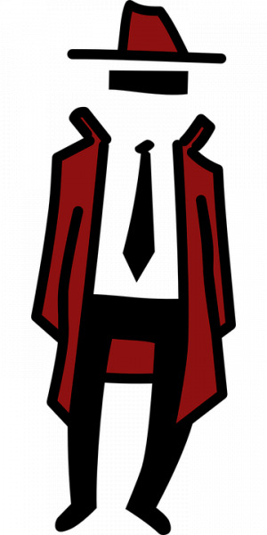
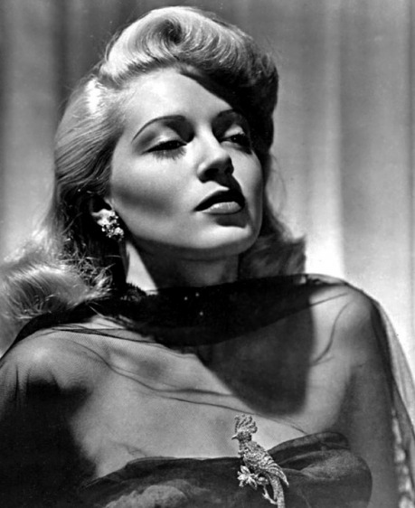

## Dílek třetí: Interpretace

Během hraní většiny RPG se hráči neustále pohybují mezi dvěma rovinami – uvažováním v rovině herního světa a uvažováním v úrovni pravidel a herní mechaniky. Jakmile ve hře přijde na řadu vyhodnocení, je potřeba tyto dvě roviny dostat do souladu. Při tom můžeme pracovat dvěma směry:

- __Převod z fikce do mechaniky__ je částí vyhodnocení, při které převádí hráči skutečnosti a události v herním světě na konkrétní aplikaci pravidel, mechanické operace či hodnoty. Pro tento převod také občas v internetových diskusích najdete termín __redukce__ (__reduction__).

- __Převod z mechaniky do fikce__ je částí vyhodnocení, při které hráči získané úplné či dílčí výsledky vyhodnocení převádí zpět do herního světa. V internetových diskusích pro tento převod také najdete termín __vyjádření__ (__representation__) nebo __interpretace výsledku__.

Mnoho her používá při vyhodnocení následující schéma:

- _Rozhodnutí vyhodnocovat > Převod fikce do mechaniky > Mechanické vyhodnocení > Interpretace výsledků zpět do fikce_

Neméně časté zvláště v dramaticky orientovaných hrách je pak uspořádání, kdy se hráči dohodnou na interpretaci před vyhodnocením:

- _Rozhodnutí vyhodnocovat > Interpretace možných výsledků v herním světě > Převod situace v herním světě do fikce > Mechanické vyhodnocení a rozhodnutí, který výsledek nastal_

Nezřídka to však během hry hráči provádí během hraní v rámci jednoho vyhodnocení vícekrát či v jiném pořadí. A některé hry dokonce mají svou herní mechaniku založenou na tom, že záměrně opakovaně v rámci jednoho vyhodnocení přechází mezi fikcí a mechanikou.

## Kdo má právo interpretovat výsledek?

Jedno z nejdůležitějších rozhodnutí, které skupina hrající RPG dělá, je určení, kdo bude mít pravomoc rozhodnout, jakým způsobem se výsledek vyhodnocování zapíše do příběhu. V některých hrách konkrétní interpretaci výsledků přímo diktují pravidla – např. ve fantasy hrách se objevují výčty kouzel, které zároveň obsahují konkrétní popis efektu i následků použití daného kouzla. Ve většině her ovšem znění pravidel spíše vymezuje okrajové podmínky a samotný popis, ať už úspěchu, nebo neúspěchu, vkládá na bedra některého hráče – např. výstupem z vyhodnocení je, kolik životů nepříteli ubral zásah zbraní, avšak někdo musí popsat, jak se tato číselná hodna projeví ve fikci. Nejčastěji to bývá buďto osoba Vypravěče nebo hráč, který akci provádí, občas to ale může být např. zraněný nebo i celá skupina.

Hráč, který výsledky interpretuje a „zapisuje“ jejich podobu do příběhu, má vůči ostatním hráčům velkou zodpovědnost. Musí být ve svém vyhodnocení spravedlivý, musí zároveň respektovat jak výsledek vyhodnocení, tak pravidla. Občas navíc bývá ve střetu zájmů – hráči mohou mít tendenci popisovat své úspěchy silněji a neúspěchy oslabovat. Vypravěč naopak může cítit potřebu „protežovat“ cizí postavy či manipulovat s výsledky tak, aby se příběh odvíjel jím zamýšleným směrem.

## Nejčastější třecí plochy

Velmi častým důvodem ke sporu je, že hráč, kterého se akce týká, a hráč, který výsledek interpretuje, mají rozdílnou představu o tom, jak se vlastně výsledek akce do příběhu zapíše. Nejprve si na několika příkladech představme některé z častých třecích ploch. V každém příkladu vždy uvedeme, jak by chtěl výstup z mechaniky interpretovat Marek jako hráč agenta Mrkviče a jak by situaci mohl interpretovat vypravěč Petr.

- Nesoulad v síle následku v herním světě:

> Agent Mrkvič se snaží dostat na ilegální zápasy v boxu. Sleduje jej ale soukromé očko. Mrkvič se jej pokusí zastrašit a uspěje s velmi kvalitním hodem. Marek má představu, že takový hod by měl soukromé očko okamžitě obrátit na útěk. Vypravěč Petr si sice v poznámkách proškrtne číselnou hodnotu psychického „zranění“, které jeho postavě Mrkvič způsobil, avšak situaci popíše tak, že detektiv se pouze lekl a ustoupil pár kroků.

- Nesoulad v přesahu důsledků vyhodnocované situace nad její rámec:

> Agent Mrkvič se podruhé pokouší zastrašit soukromé očko, které jej už delší dobu sleduje, a uspěje s velmi kvalitním hodem. Marek má představu, že po úspěšném hodu bude mít detektiv respekt k jeho postavě i v pozdějších setkáních. Vypravěč Petr respektuje výsledek a v tomto boji určitě nechá očko zbaběle utéct. Zároveň si ovšem myslí, že stačí, aby příští setkání místo v temné uličce proběhlo na rušném náměstí a bude po strachu.

- Nesoulad v popisu vyhodnocované akce:

> Potřetí už Agent Mrkvič detektiva nezastrašuje, ale rovnou po něm vystřelí. Opět uspěje a výstupem z mechaniky je určitá hodnota „zranění“. Pokud by situaci popisoval Marek, chtěl by, aby jeho výstřel zasáhl detektiva do nohy. Vypravěč Petr stejný výsledek může popsat jako průstřel ramene – a navíc k popisu ještě přidá, že kulka krom ramene zasáhla výlohu za očkem a ta se vysypala.

## Déjà vu?

Pozornému čtenáři naší série jistě neuniklo, že problémy, které vznikají při interpretaci výsledků, se velmi podobají problémům, které jsme řešili v prvním díle našeho seriálu – tedy nesoulad v tom, co je vyhodnocováno. Přesto nejde o totéž a u interpretace výsledku případné třecí plochy vznikají z jiných důvodů a jejich snadná vzájemná záměna způsobuje při diskusích na toto téma často zmatky. To však neznamená, že by nám již známé pojmy __vyhodnocování úspěšnosti činnosti__ a __vyhodnocování naplnění záměru__ nemohly pomoci – oba dva způsoby totiž podporují převod z mechaniky do fikce odlišným způsobem.

Výhodou her používajících __vyhodnocení úspěšnosti činnosti__ je, že výsledkem vyhodnocení je absolutní hodnota, vyjadřující kvalitu nebo např. rozdíl mezi kvalitou akce a její opozice. Vypravěč nebo hráč popisující úspěch má tedy poměrně jasně stanovené mantinely, ze kterých by měl při interpretaci vycházet. Nevýhodou tohoto přístupu je, že jediný způsob, jakým má hráč garantováno naplnění svého záměru, je skrze úspěšné provedení činnosti, která k naplnění záměru vede. Jestliže tedy vyhodnocujeme činnost, kterou není možné jednoznačně kvantifikovat, např. sociální konflikt nebo umělecké vystoupení, pak ten, kdo popisuje výsledek, nemá žádné vodítko či vymezení pro svůj popis. Pokud takový výsledek popisuje vypravěč, může tak nevědomky (a občas i vědomě) oddalovat naplnění hráčova záměru. A naopak pokud výsledek popisuje hráč, mechanika neobsahuje žádný nástroj, který by ho v jeho rozmachu omezil.

Příklad:

> Agent Mrkvič se konečně dostal do pěstního souboje ve staré garáži. Jeho hráč chce ukázat, že je dobrý bojovník, a přilákat tak pozornost jedné z dam, která stojí v obecenstvu. Pokud však hraje hru, která vyhodnocuje úspěšnost jeho činnosti, jediná odpověď, kterou od pravidel dostane, je zda a jak rychle své protivníky porazí, případně zda u toho bude zraněn. Rozhodnutí o tom, jestli je výsledek dostatečné zajímavý na to, aby přilákal pozornost zmiňované dámy, bude čistě záležitost interpretace výsledku. Tu však může při hře dělat kdokoliv – Vypravěč, Marek anebo i nějaký třetí, do tohoto konfliktu nezapojený hráč. Hráči se také mohou dohodnout dopředu na nějakých objektivních podmínkách nad rámec mechaniky (např. musí porazit všechny soupeře nejpozději ve třetím kole).

Hrajete-li hru, která __vyhodnocuje naplnění záměru__, tento problém není přítomen tak silně. Hráč vždy bude mít prostor deklarovat dostatečně, čeho chce svou akcí dosáhnout, a tím do značné míry automaticky získává alespoň částečnou pravomoc rozhodovat o tom, jak se výsledek v příběhu zapíše. Ten, kdo výsledek popisuje, by měl jeho přání respektovat a nehrozí tedy tolik, že by naplnění záměru oddálil. Pokud se rozhodnete, že svá vítězství a úspěchy si hráči popisují úplně sami, problém zcela odpadne a hráči mají úplně garantováno, že jejich záměr bude naplněn. S tímto přístupem ale vystoupí jiný problém – pravomoc stanovit si libovolný záměr a mít garantováno i jeho naplnění je velmi silná. Proto tyto hry zpravidla obsahují nějaký nástroj, který tuto pravomoc nějakým způsobem omezuje nebo vyvažuje. Může jít například o příběhové sázky, postupné licitace záměrů či např. možnost v případě prohry naplnění záměru protihráče za určitou cenu odmítnout či jej oddálit. Další nevýhodou tohoto přístupu je, že výsledný hod nemusí dávat představu o kvalitě prováděné činnosti a tentokrát je právě kvalita či způsob provádění činnosti, který je velmi silně závislý na tom, kdo bude výsledek vyhodnocení interpretovat.

Příklad:

> Agent Mrkvič, posilněn intenzivním zážitkem s tajemnou dámou, opět boxuje v garážích. Jeho hráč chce tentokrát přilákat pozornost šéfa zločinecké bandy, kterou se chystá infiltrovat. Marek s Petrem tentokrát hrají hru, která vyhodnocuje naplnění záměru. Od začátku tedy bude zřejmé, že hody budou rozhodovat o tom, zda a jak moc se mu podařilo získat pozornost zločince, přestože akce, které popisuje, budou bojového charakteru. Výsledek hodu mu ovšem nemusí nutně dávat i informaci o tom, jak silně svým soupeřům ublížil, byť může dát např. obecné vodítko, o kolik byl lepší. Stejně jako v předchozím případě může výsledek popisovat Marek, Petr či někdo další.

Na základě výše uvedeného textu by se mohlo zdát, že ať už vyhodnocujete __úspěšnost činnosti__ nebo __naplnění záměru__, nic nebrání tomu, aby pravomoc interpretovat úspěšný výsledek svého snažení měl vždy hráč. Tím bude zajištěno, že vždy dostane přesně to, co chce, a nebudou hrozit neshody z prvního dílku našeho seriálu.

 Není to ovšem tak jednoduché. Jednak jsme si již výše řekli, že ten, kdo má pravomoc interpretovat, má velkou zodpovědnost vůči ostatním, a pokud jde o hráče, nesmí chtít „moc“, protože tím sám sebe i spoluhráče může okrádat o zábavu. No a kromě toho navíc v RPG existují i situace, kdy zkrátka hráč nemůže do příběhu vložit správný popis, prostě nemá dostatek informací. To si ukážeme na dvou dalších příkladech neshod, které mohou nastat kvůli interpretaci:

- Zásah do pravomoci ovládat postavu:

> Po úspěšných zápasech v garážích si Marek uvědomí, že postřelený detektiv by jej mohl poznat a obvinit. Proto se Agent Mrkvič vydá do nemocnice, navštíví očko v jeho pokoji, Marek zkusí znovu zastrašovat a opět vítězí. Chce si popsat, jak se vystrašený a zraněný detektiv pomočil strachy a začal žadonit o život. To je však v příkrém rozporu s charakterem, který této postavě Petr jako vypravěč vtisknul, a proto by rád prohru detektiva popsal jinak.

- Nesoulad mezi informacemi, které má hráč a které má Průvodce v uzavřené hře:

> Marek už toho má plné zuby, a tak se rozhodne, že agent Mrkvič dá detektivovi ránu z milosti a tak se ho nadobro zbaví. Marek ovšem neví, že detektiv je ve skutečnosti upír, kterého obyčejná kulka zabít nedokáže, a tak zcela jistě v případě vítězství bude chtít vyprávět něco jiného než Petr.

O tom, jak se takovéto problémy řeší, si však popovídáme v příštím dílku našeho seriálu.
