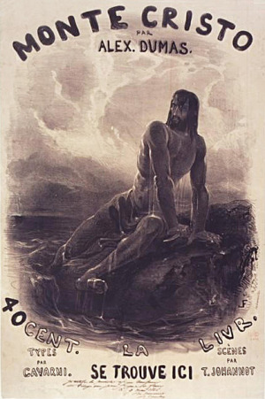
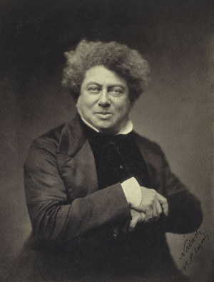
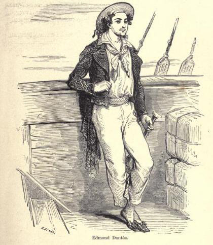
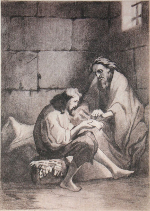
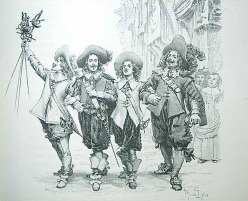
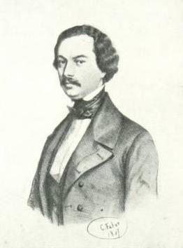

## I.

Mám ve svém počítači sklad všeho možného, co jsem kde v životě četl, viděl nebo potkal. Je to solidní výpis obsahu mé hlavy asi čtvrt století dozadu. Navazují na to ještě starší ručně psané poznámky, kterých je už jen nepatrné množství, neb zbytek byl incerován. Takto se lze prokopat až do roku 1982. Ale ani v této úplně nejstarší propasti není Monte Christo zmíněn. Leží ještě hlouběji, ve vrstvách, o kterých už záznamy mlčí. Ale, jak známo, _nezemřelo to, co věčně odpočívá a dlouhý věků běh i smrtí smrti bývá._

V minulém roce to celé vyvolala z hrobu inscenace [o Dumasovi](http://www.csfd.cz/film/154811-alexandr-dumas-starsi/) s Menšíkem v hlavní roli, levým okem zahlédnutá v televizi. Důležitý je na ní prehistorický rok vzniku 1970. S ohledem na věk jsem to nejspíš viděl až o pár let později a i tak jsem to chápal jen z malé části. Přesto mne to nějak zaujalo; možná se totiž trefilo právě do okamžiku, kdy jsem se [rozhodl stát spisovatelem](http://drakkar.sk/30/confessio-cili-jak-jsem-se-chtel-stat-spisovatelem.html). Můj Hrabě Monte Christo nese věnování z roku 1978. Zdá se, že jsem ho tedy dostal přesně v ten okamžik, kdy jsem ho dostat měl. Říci, že to byl úspěch, je jen velmi opatrné konstatování.

Do té doby jsem totiž četl literaturu o stupeň nebo o dva jednodušší a naivnější; kilometry Verna, Foglara a Ransoma; a taky různé detektivky. Prostě takové typické mladistvé čtivo; dobrodružné, akční, přehledné a totálně asexuální.

Monte Christo byl možná moje úplně první vážná a dospělá kniha. Elegantně navázal na předchozí témata a velmi nenápadně mi podsunul některá nová, která v předchozích knihách úplně chyběla. Otevřel různé dospělácké světy daleko šťastnějším způsobem, než se o to pokoušela oficiální školní literatura. Ani jsem nepostřehl, že se od napínavého příběhu ve vězení ocitám uprostřed konverzačního románu 19. století, který je najednou také třeba o manželství a o penězích. Nicméně, základní napínavá linka příběhu se tím rozhodně nepokazila; stále ještě stihneme pár bezva vražd a sem tam i nějaké to pohřbení zaživa.

Zdá se, že takové spojení vypadá na první pohled hodně neřešitelně a nepravděpodobně. Ale přesně tak to v románu Hrabě Monte Christo funguje.

## II.

Nejprve tedy letmé hodnocení z rychlíku. Můj exemplář knihy je z Mladé fronty z roku 1957, přeložili ho Jan Vladislav a Milena Tomášková. Netroufám si zkoumat, jak dobře; o francouzštině vím houby. Jen poznamenám, že Jan Vladislav byl tehdy docela známý spisovatel.

Překladatelé připojili ke knize nesmírně zajímavý čtyřstránkový doslov. K jeho čtení přistupují obezřetně, neb vznikl v dystopickém roce 1957 a takový autor doslovu nikdy netušil, čím může probudit rudého krakena. Povinnou kritiku díla je proto možno číst jako opatrnou obhajobu, psanou mezi řádky:

> Položíme-li si otázku, jaké osobité myšlenky a jaké umělecké výboje přináší Dumasův román ve srovnání s romány svých současníků Balzaca, Huga, Stendhala, Mériméa, odpověď je celkem jasná; Dumas není znatelem a zkoumatelem společenských poměrů – k tomu neměl čas ani chuť, není analytikem doby jako Balzac, není psychologem jako Stendhal, není básníkem-myslitelem jako Hugo, je „jen“ jedním – králem dobrodružného románu.

Především stojí za povšimnutí ti mistři, se kterými je Dumas srovnáván. Školním okem mých dob jednoznačné velikáni světové literatury; zakladatelé určité formy realistického románu. K francouzskému realistickému románu šlo tehdy přirovnávat snad jedině román ruský, vnímaný samozřejmě jako nejdůležitější (Tolstoj! Dostojevskij!), a pak snad osamělého Angličana Dickense. Všichni ostatní byli proti nim saláti a břídilové, jen stěží hodní označení „spisovatel“. Zejména na předcházející romantismus bylo všeobecně shlíženo okem lehce posměšným a dosti skeptickým. Omluvenku měl snad jedině Puškin, neb byl Rusák.

Pokud vám dnes už není moc jasné, co je na romantismu špatně, pak je to tím, že na věc nehledíte třídně, soudruzi. Romantismus neodhaloval antagonistické rozpory kapitalismu a přehlížel je, ba dokonce je přímo zakrýval, odváděje pozornost k nějakým smyšleným a naivním nesmyslům, jako jsou strašidla, láska a podobně. Přece všichni víme, že společenské bytí předchází společenské vědomí! To takový soudruh Balzac nebo Dickens, ti zjevně pochopili znamení doby, vycházeli z materiální podstaty a nemilosrdně nastavovali zrcadlo soudobé buržoazní společnosti!

Čili, přeloženo do dnešní řeči; psali hlavně o penězích a o sociálních poměrech. Kriticky, samozřejmě. Následkem čehož z nich byli typičtí dodavatelé obézních špalků povinné a příšerně nudné školní četby. Jak my jsme je nenáviděli!

Oku dnešnímu neujde paradox, že se tito realističtí maxivelikáni už moc nečtou. A pokud ano, pak jsou jejich nejživější věci pravidelně kontaminovány romantismem. Takoví Hugovi _Bídníci_ či _Chrám Matky Boží v Paříži_ nebo Mériméova _Carmen_ jsou jasné případy, až překvapivě podobné _Monte Christovi_. Vypořádání s romantismem se v nich tak nějak moc nepovedlo.

Platí to až podivuhodně důsledně. O dvě trochy realističtější „špalky“ jmenovaných velikánů, jako třeba Stendhalův román _Červený a černý_, jsou také o dvě trochy mrtvější. Zdá se, že to, nad čím jásaly minulé doby, se dnes už moc necení. A naopak, to, co bylo tehdy třeba omlouvat, drží podobné romány při životě i dnes.

## III.

Všimněme si tedy té údajně „dobrodružné“ linky Monte Christa.

Pojem „dobrodružný“ mi dodnes není úplně jasný. Mám podezření, že znamená ve skutečnosti vůbec přítomnost nějakého příběhu. Totiž, že na hrdinu tlačí nějaká zajímavá situace, odlišná od berního úřadu nebo společenského opovržení. Z definice by se zdálo, že se nějaká obtížná situace asi vyskytne úplně ve všech epických románech, od Robinsona až po Harryho Pottera. Kupodivu, moderní velikáni chápali často i samotný napínavý příběh jako něco podezřelého a hodného omluvy. Takový Flaubert – v té čtveřici francouzských velikánů neprávem vynechaný – proslul myšlenkou, že by chtěl napsat román „úplně o ničem“. Z toho letmého nahlédnutí do jeho díla mi zbyl dojem, že se mu to dost dařilo.

V případě, že bylo možné dílo označit trochu politováníhodným slovem „dobrodružný“, spojeným většinou s exotickými reáliemi a cestováním, pasovalo v podivných dobách komunismu skoro automaticky do dětské literatury. Pak už se to smělo. I nejdrsnější marxista tušil, že děti moc neocení, že je autor _znatelem a zkoumatelem společenských poměrů_ a spíš si dají nějaké piráty a indiány. Takto se v dětské literatuře na léta ocitl třeba Jules Verne, který to zaručeně neměl v úmyslu. Nebo právě Dumasovi _Tři mušketýři_, ve školní četbě sice chybějící, nicméně znal je naprosto každý, přinejmenším z filmu.

Řekl bych, že celá tato stopa je slepá. Hledat „dobrodružný“ román v roce 1844–1845, kdy Monte Christo vznikal, je podle mne čirý nesmysl. Takový žánr v té době neexistoval a neměl jasný vzor. I ten Verne vydal svůj první román _Pět neděl v balonu_ až v roce 1863. Pokud jde o anglické největší dobrodružné vypravěče jako Stevenson nebo Kipling, ti se v té době dokonce ještě ani nenarodili.

Co naopak u Monte Christa rozeznáme jasně a co možná Milena Tomášková a Jan Vladislav tušili, ale báli se vyslovit, je jasný vliv _gotického románu_. A tedy přímo vulgárního romantismu. K vidění jsou tu:

- zradou zmařená svatba
- děsivá vězeňská kobka
- tajemné lektvary a jedy
- tajemný cizinec s falešným jménem
- častá přestrojení
- špeh za knihovnou
- dopis, skrývající hrůzné tajemství
- italský bandita, co probodne dívku, aby se nestala hříčkou celé bandy
- pohřbení zaživa (v románu použito dokonce tříkrát!)

A tak dále a tak podobně. Je to jako seznam Karla Čapka z pojednání o románech pro služky. Všechno to jsou populární klišé z baterie gotických románů, velmi úspěšného žánru, který rozebral sám H. P. Lovecraft v traktátu _Nadpřirozená hrůza v literatuře_ do té míry, že je zbytečno dodávat cokoli dalšího. Snad jen to, že taková literatura byla náramně živá i ve Francii. Například znamenitý pan [Théophile Gautier](https://cs.wikipedia.org/wiki/Théophile_Gautier) byl Dumasův současník.

Celá dějová linka, týkající se rodiny Villefortů, je čistým gotickým románem. Právě tady se nejčastěji pohřbívá zaživa, vraždí, hyne láskou a vedou přepjaté řeči.

A úplně nejromantičtější je zamilovaná dvojice Valentina Villefortová a Maxmilián Morrel. Na první pohled do románu moc nepatří, neb ten by měl být o Monte Christovi a jeho strašlivé pomstě. Při bližším pohledu ovšem je tato dvojice zásadní; napravuje Monte Christovu pomstu, aby vůbec hrdina mohl zůstat bezpečně na té kladné straně. Čtyři lidi úplně zničil, ale dva zachránil, tím se to dost vyvažuje. A tou záchranou vlastně také román končí.

V době, kdy jsem to četl, byl pro mne tento druh literatury naprostý objev. Jako opravdu, nesmějte se. Foglar nebo Ransome jsou o dětech, a tedy zcela asexuální záležitost. A ten Verne to moc nevytrhne; pan Phileas Fogg coby chladný Angličan řekne své vyvolené asi tak dvě vřelejší věty, pokud se pamatuji.

Ne tak Maxmilián Morrel:

> „Valentino! Nemohu vám říci, že na celém světě miluji jen vás, protože rovněž miluji svoji sestru a svého švagra, ale ty mám rád láskou klidnou a mírnou. Tato láska se v ničem nepodobá citu, který chovám k vám. Když na vás myslím, krev mi vře, prsa se mi dmou, srdce mi překypuje! Ale tato síla, ten žár, ta nadlidská moc ponesou mou lásku jen do chvíle, kdy mi řeknete, abych vám jimi sloužil. Pan Franz d’Epinay zůstane prý ještě rok v cizině. Kolik příznivých náhod nám může během roku přispět, kolik událostí nám může pomoci! Nepřestávejme tedy doufat, naděje je tak krásná a sladká!
>
> Ale řekněte sama, Valentino, když mi takto vyčítáte sobectví, čím jste mi až doposud byla? Krásnou a chladnou sochou cudné Venuše. Co jste mi slíbila za mou oddanost, poslušnost a zdrženlivost? Nic! Co jste mi dovolila? Velice málo.“

Ach, probůh, dosti již té citace! Máte nejspíš jen jedny nervy a jsme přitom sotva v polovině Maxmiliánovy repliky. Věřte nebo ne, na počátku 19. století se takto přepjatě lidé opravdu vyjadřovali. A to i tehdy, kdy se vlastně nic neděje, právě jako v této Maxmiliánově řeči. (A pokud někoho zajímá, zda dostane na konci projevu alespoň polibek, tak nikoli.)

Pokud bychom tomuto strašlivému stylu chtěli přiznat nějakou výhodu, pak je to jednoznačnost. Hrdinové nám bez vytáček přiznávají, že s nimi láska příšerně mlátí a že nejsou pomalu schopni vnímat nic jiného. V příslušném věku mne tohle oslovovalo, asi jako má dnes svoje čtenáře takové _Stmívání_.

Měl jsem ale veliké štěstí, že jsem tehdy všem variacím na čistou lovestory unikl a narazil rovnou na tento starší model. Vzor gotického románu, ze kterého Monte Christo vychází, je přes nemožný sloh rozmluv přece jenom o několik tahů dál. S trvale zamilovanými postavami, kde už není v ději nic jiného, není totiž možno vydržet po 200 stran. Musíte do lásky vnést ještě nějakou situaci, rozpor, problém; jinak budou stát na místě a nyvě lkát jako ten Maxmilián. Alexandre Dumas, jak už jsem prozradil, nepustil tuto dvojici do úplně hlavní role. Lovestory je pro něho jen vedlejší příběhová linie. Tušil dobře, že láska sama o sobě jinak moc konstruktivní téma není a vydrží vám tak na povídku. A i v té příběhové linii není dovoleno Maxmiliánovi tlachat dlouho; záhy bude Valentina Villefortová ohrožována, zrazována a dokonce vražděna a nakonec končí důmyslnou variací na finále Romea a Julie. Což je bezva.

Na tuhle dávnou lekci jsem nikdy nezapomněl a mnohokrát se mi to vyplatilo.

## IV.

Jděme ale dále. Monte Christo nevypadá jako gotický román všude. Často se ocitneme někde úplně jinde:

> „Drahá hraběnko, ptal jsem se vás, jestli znáte tu Řekyni. Teď se vás chci zeptat, jestli neznáte toho muže.“
>
> „Právě tak málo, jako ji.“
>
> „Nikdy jste si ho nevšimla?“
>
> „Tohle je typicky francouzská otázka! Víte, že pro nás Italky neexistuje na světě jiný muž kromě toho, kterého milujeme!“

Proměna je tak dokonalá, že se kromě tématu úplně změnil i jazyk. Gotický román je zapomenut, tady najednou břitce konverzujeme v nějakém pařížském salonu. Že by za tím byl třeba pan Laclose? [Nebezpečné známosti](https://cs.wikipedia.org/wiki/Nebezpečné_známosti)? Je to docela možné.

A jinde zase vedeme rozmluvu přímo dickensovskou. Monte Christo si přišel u barona Danglarse otevřít úvěr a vznikly nejasnosti, kolik peněz vlastně potřebuje:

> „Pane hrabě, nebojte se vyslovit svoje požadavky. Uvidíte, že cifry firmy Danglars, přes to, že jsou omezené, uspokojí i ty nejnáročnější, a i kdybyste žádal milion…“
>
> „Prosím?“ zeptal se Monte Christo.
>
> „Říkám milion,“ opakoval Danglars s hloupým sebevědomím.
>
> „A co bych dělal s milionem?“ zvolal hrabě. „Kriste pane, kdybych byl potřeboval jenom milion, pane barone, nebyl bych si kvůli takové maličkosti otevíral úvěr. Milion? Ten mám vždycky buď v náprsní tašce, nebo v cestovním kufříku.“

Mění se délka replik, mění se sloh, mění se všechno. Není to jen odlišnou postavou na scéně. Rozervaný Maxmilián je ve společnosti svých mužských přátel najednou stejně uměřený a praktický jako ostatní. Naopak sám hrabě Monte Christo, v předchozí scénce zábavně praktický a hovořící skoro úplně moderně, pronese v jiné situaci citově rozervanou promluvu hodnou Maxmiliána.

Spíše se tedy zdá, že celé rozmluvy jsou vyrobeny jako celek v určitém stylu, do kterého se autor právě přepnul, a tomu stylu se přizpůsobují všechny přítomné postavy. Kdybyste vzali kusy _Nebezpečných známostí_, _Záhad Udolfa_ a _Kroniku Pickwickova klubu_ a sestříhali tuhle nepravděpodobnou směs dohromady, může vzniknout něco na způsob Monte Christa.

Román Hrabě Monte Christo je plný až nepochopitelných kontrastů. Dumas, jak ho pěkně vykreslila ta televizní minisérie, byl zejména umný konstruktér příběhů. Nikoli dobrodružný vypravěč, jak věřili překladatelé, ale vypravěč vůbec. Byl ochoten navázat vyprávění prakticky čímkoli a v jakémkoli stylu, který se nabízel a který šel právě okolo. Právě tohle činí výsledek tak nenapodobitelný.

## V.

Pan Dumas navíc psal rychlostí přímo pekelnou. _Hrabě Monte Christo_ vznikl za dva roky… a to _stejné_ dva roky, kdy zároveň napsal _Tři mušketýry_, _Tři mušketýry po dvaceti letech_ a několik dalších věcí.

Pročež asi není překvapením, že kniha je také plná chyb. Postavy záhadně mládnou a stárnou. Sám hrabě byl na počátku děje, v roce 1815, „osmnácti až dvaadvacetiletý“ a v době vrcholu románové pomsty (1833) byl napřed v Itálii „nejméně čtyřicetiletý“ a po pár dalších měsících v Paříži „vypadá na pětatřicet“, takže jeho původní partnerka právem volá, že „to je nemožné! Tak mladý!“.

S Fernandem Mondegem, který vypadá rovnou na padesát, ač začal o dva roky starší než Monte Christo, se autor taky moc nemaže. To má zato, lump jeden.

A vrcholem je krásná Haydée, kde jsem si dal práci a rozluštil arabské datum, abych zjistil, že ji prodali ve věku 11 let. Proč ne, řeknete si. Jenže, ta oslnivá mladá žena, jak ji vidíme po většinu románu, je na scéně jen o dva roky později. Je jí tedy třináct!

V takto uspěchaných podmínkách se podobné lapsy samozřejmě podepisují i na hlavním hrdinovi. Romantický mladistvý námořník se nám proměnil v zahořklého vězně. To je samozřejmě ještě možné. V roce 1829 z vězení vyjde, po čtrnácti letech. Ještě chviličku ho sledujeme, jak najde poklad na ostrově a postaví si loď.

A pak najednou je zvláštní čtyřletý střih, kdy najednou navazujeme v roce 1833. Hrdina je – když necháme stranou záhadu jeho věku – někým naprosto jiným, než jak jsme ho opustili. Zázračné zbohatnutí bylo vysvětleno, ale horší je to s jeho naprostou změnou chování, kdy je najednou „velký šlechtic všech zemí“, ač ještě nedávno námořník. Stejně neuvěřitelné jsou jeho znalosti, získané za pouhé čtyři roky. Tady občas román vzbuzuje shovívavý úsměv. Třeba, když hrabě s vážnou tváří vysvětluje Villefortovi, že „studoval právo všech národů“. Proč to vlastně dělal, to se nedozvíme. Hrabě také vysvětlí, že mladý Morcef, syn jeho nepřítele rybáře, je určitě šlechticem ze starého rodu – a Morcef tomu kupodivu věří. Občas na sebe hrabě „bere zvláštní naivní výraz, dodávající mu převahy“. Trefuje se pistolí do značek na kartách, zcela bez problémů. Nosí v náprsní tašce milion na drobné výdaje, jak jsme viděli. Kdokoli se s ním setká, obdivuje ho a žasne.

Jsme ve světě zjevné sebeprojekce autora; takový by pan Dumas chtěl být ve svých snech. Tento Monte Christo, hrdina většiny děje, je dokonalý konstrukt z říše Howardova barbara Conana nebo pozdějšího Old Shatterhanda od Karla Maye. Má plno naprosto úžasných vlastností, i když je třeba v ději k ničemu nepotřebuje. Všechno, co dělá, umí skvěle, aniž se to někde musel učit.

Hrabě Monte Christo je totiž také praotec všech superhrdinů.

## VI.

Tím se pomalu dostáváme k dalším větvím této podivné chobotnice, směřujícím daleko do budoucna. Zatím jsme zkoumali to, co si autor povypůjčoval z dob starších. I superhrdinu mohl najít někde v řeckých bájích nebo v rytířských románech. Ale nějak si už nevzpomínám na takto modernizovaného superhrdinu v 19. století, který má milion na drobné výdaje v kapse u vesty. Stín tohoto nápadu je podivuhodně dlouhý. Bruce Wayne nebo Tony Stark, že.

Jiné zjevení je Monte Christův spoluvězeň abbé Faria. Ne snad tím, jak je vzdělaný a že Monte Christa naučí všechno možné právě jako Mistr Paj Mej. Daleko zajímavější je způsob, jak odhalí Monte Christovy zrádce. Nikdy je při tom neviděl, nezná je, nevyleze ze své cely. Úvaha, vycházející z motivu, je elegantní jako od samotného Sherlocka Holmese. Detektivka, řeknete. Jenže se stále ještě píše rok 1844 a tohle Dumas moc neměl kde okopírovat. Baltimorského současníka za oceánem nejspíš vůbec nezaznamenal.

Nedosti na tom. Kapitola jménem _Nauka o jedech_, která je vlastně základem celé větve pomsty na Vilefortově rodině, obsahuje důmyslné úvahy o tom, že některým jedům lze přivyknout. Takže si vrah může připít s obětí, kdy jsou otrávené _oba_ poháry! Tato varianta detektivky byla znovu nalezena ve třicátých letech v románu Dorothy Lucy Sayersové jménem _Strong Poison_, přičemž nápad byl vysoce ceněn. Netuším, zda si někdo uvědomil, že je to Dumasův patent skoro sto let starý. Monte Christo sám poukazuje na to, že to byla věc známá už v antice.

Další podobná perla je kapitola _Jak zbavit zahradníka plchů, kteří mu ožírají broskve_. Fungovalo by to docela slušně jako samostatná povídka. Pokud někdo netuší, o čem je řeč, potom jde o ovlivnění ceny akcií na burze falešnou zprávou. Jasně; v našem věku běžná rekvizita příběhů jako _Firma_ nebo _Vlk z Wall street_. Jenže, připomínám, je stále rok 1844 a burza v literatuře je poměrně nový vynález.

Krátce si všimněme ještě samotné pomsty. Monte Christo je především román o pomstě; ta zabírá čtyři díly z šesti. To byste určitě z [hesla na wikipedii](https://cs.wikipedia.org/wiki/Hrab%C4%9B_Monte-Christo) těžko uhádli; ten vyřešil pomstu jediným odstavcem (a ještě přeházel děj). A navzdory úpornému přesvědčení všech, co zkoušeli Monte Christa zfilmovat, Monte Christo vůbec nikdy nepoužije proti svým nepřátelům zbraň. Několikrát zdůrazňuje, že zbraň a rychlá smrt je pro jeho nepřátele _málo_; chce je nechat ošklivě a dlouho trpět. Jeho pomsta je velice důmyslná, jemná, intrikářská, tak nějak ženská. Bylo trefně řečeno, že takové věci provádějí daleko častěji padouši než kladní hrdinové. Třeba _Zmizelá_ od Gillian Flynnové v době zcela současné, která za to opět sklízí potlesk. A přesto důmysl některých Monte Christových triků není nijak menší; kromě zmíněného plcha jsou to třeba geniální grošáci paní Danglarsové, během jediného dne koupení, zapůjčení, zadržení a opět prodaní; a to vše jen jako přípravný tah k získání určitého společenského postavení. Postavy, které předvídají vždycky všechno a daleko dál než všichni ostatní, jako třeba pan Hannibal Lecter nebo Joker, jsou další nečekaní Monte Christovi dědici.

Naproti tomu nelze přehlédnout něco, co bychom sice na scéně očekávali a v románu to až překvapivě chybí. 19. století coby století páry, steampunk. Kulisy, bez kterých je takový Verne těžko myslitelný. Hrabě Monte Christo nikdy ani na okamžik neusedne do vlaku; mluví se jenom o možnosti investovat do železnice v Americe. Vlastní sice parník – což asi leckomu ušlo – ale nikdy ho nepoužije. Pokud je řeč o telegrafu, pak je to mechanický telegraf z Napoleonovy doby, nikoli ta elektrická věc, užívající morseovku.

## VII.

V době prvního čtení Monte Christa jsem už zkoušel psát své prvotní prehistorické výtvory, tesané kamennou sekerou. Měly někdy i přes deset stránek! Je jasné, že na tisícistránkového Monte Christa jsem hleděl s obdivem jako krtek na Mont Blanc. Jak může někdo vymyslet něco tak obrovského! A ještě mu to celé dohromady dává smysl!

Ano, vlastně je to hodně překvapující i dnes. Vedle tehdejší konkurence – a vlastně i lecjaké dnešní – je Monte Christo ohromující kompoziční skvost. Přes to, že putujeme od pohřbívání zaživa a italských banditů k homosexuální klavíristce a k otázce růstu cenných papírů, všechno to drží pohromadě naprosto přesvědčivě.

Hlavní jádro příběhu je totiž mocné a jasné jako den; zrazený námořník se dostane z vězení, zázračně zbohatne a svým zrádcům se strašlivě pomstí. A ta pomsta se ještě dělí do tří hlavních linií, výrazně stylově odlišných. Pomsta vojákovi a šlechticovi Morcefovi se týká jeho cti, pomsta bankéřovi Danglarsovi se týká jeho peněz a pomsta prokurátorovi Villefortovi se týká jeho zločinů. Navíc jsou ty tři pomsty srovnané tak, aby gradovaly od té nejméně výrazné k těm dramaticky zdařilejším; a finále, kdy Monte Christo Danglarsovi vlastně odpustí, je přímo biblické. A ta velká láska je tam důmyslně úhlopříčně nalepena díky té zásadní romantické dvojici, pro kterou to dobře dopadne po velkých protivenstvích, konec.

Musím říci, že pokud jsem občas zahlédl – díky školnímu teroru zejména – tu údajně velkou literaturu 19. století, třebas Balzaca nebo Dickense, tak kompozičně na Monte Christa nemají v drtivé většině případů. Jsou to sice velikánské kusy mramoru, ale tak nějak nahrubo naházené lopatou, začátek a konec to často nemá vůbec žádný.

Ještě tvrdší bych byl v hodnocení samotného Dumase a jeho ostatních děl. I když se děj třeba řítí jako kočárek ze schodů, mohl by se snadno řítit někam úplně jinam a nevadilo by to. To platí o zejména _Třech mušketýrech_, románu, který se ke srovnání nabízí asi nejlákavěji. I tady jsou spousty úžasných samostatných historek; místo plcha na broskvích tu je třeba odposlouchávací roura od kamen nebo snídaně v pevnosti pod útokem. Potíž je v tom, že to jsou historky náhodně sebrané, které klidně mohly být přeházené zcela jinak. Samo hlavní jádro Třech mušketýrů, veselá salónní historka o nevěrné královně a závěscích, které je třeba vrátit, je materiál tak na povídku, s velkým nadšením na jednoduchý román.

Odlišnost je i v samotném charakteru vyprávění. Tři mušketýři jsou akční šermovačka, kde jednotlivé souboje vlastně ani moc navazovat nemusí; jejich zkrácení nebo přehození nekazí nijak efekt. V Monte Christovi se nešermuje, v Monte Christovi se jemně konverzuje a šachové tahy přesně navazují jeden na druhý, takže je naopak velmi důležité, kde se co děje.

Vlastně je docela překvapující, že _Monte Christa_ a _Tři mušketýry_ napsal ten samý člověk.

Jiná záhada se skrývá v místech, která právě moc kompozičně perfektní nejsou a navazují dost podivně.

Kritické místo je již zmíněná fáze mezi koncem zrady, po vyjití z vězení v roce 1829 a následující italské mezihře v roce 1833. Jsou tu čtyři roky vynechány, bez nějakých jasných důvodů. A Monte Christo, který se objevuje v Itálii, se nejenom jinak jmenuje, ale prostě to je úplně jiná postava, jak už bylo odhaleno.

Záhadou je vlastně i smysl celé té italské mezihry. Monte Christo se tu úmyslně seznámí s Albertem Morcefem a žádá ho, aby ho doprovázel Paříží. Proč tak komplikovaně? K čemu vlastně Alberta potřebuje a co mu brání zamířit do Paříže rovnou, když zná svoje nepřátele a ví, kde jsou? A proč vlastně Monte Christo čekal s pomstou ty čtyři roky?

Zmíněný doslov Jana Vladislava a Mileny Tomáškové mi do toho vnesl trochu jasna. Překvapivá odpověď zní totiž tak, že _Monte Christa_ a _Tři mušketýry_ nenapsal tak úplně stejný člověk.

V té době spolupracoval s Alexandrem Dumasem jistý Auguste Maquet, který sháněl náměty a příběhy. Při enormní výkonnosti pana Dumase to bylo velmi moudré řešení, navíc Maquet měl šťastnou ruku a poznal dobrý nápad. Vládne shoda, že právě v té době napsal Dumas nikoli náhodou svoje nejlepší věci a bez Maqueta už to později nebylo ono. Takže Tomášková a Vladislav vyprávějí, že:

> Postavu Monte Christa si Dumas vymyslel sám. Plán a první rozvržení je však od Augusta Maqueta. Dvě základní myšlenky, myšlenku pomsty a myšlenku Monte Christova pokladu, objevil Dumas náhodou. V objemné Peuchelově knize „Policie bez masky“ četl dvacetistránkový anekdotický příběh „Diamant a pomsta“, odehrávající se za Druhé restaurace. Bohatý šlechtic prokáže v Římě velkou službu mladému spisovateli a za odměnu žádá, aby ho mladý Francouz provázel Paříží, až ji navštíví. Účelem této návštěvy je zdánlivě jen zvědavost, ve skutečnosti pomsta. Hrabě chce v Paříži odhalit své nepřátele, kteří ho v mládí uvrhli na deset let do vězení, a potrestat je. Tak, jak to bylo napsáno, to bylo prostě hloupé, ale Dumasova fantasie vytvořila z této anekdoty mohutnou románovou konstrukci, která spolehlivě udržela husté předivo zápletek a intrik, vyplňujících šest dílů románu.

Taková je pravda. Ta zdánlivě zbytečná a trochu záhadná italská epizoda je ve skutečnosti jádro původního nápadu, je z povídky _Diamant a pomsta_ a je starší než všechno ostatní! Vlastně jen díky tomuto vzoru se námořník převtělil do hraběte, i když pro to vlastně není žádný důvod.

## VIII.

To nejdůležitější naučení z Monte Christa leží podle mne právě v kompozici.

Ukazuje totiž, že existuje způsob, jak vyřešit i velmi složitý žánrový hybrid, kdy smísíte součásti, které k sobě nijak nepatří a které spolu na první pohled nemohou fungovat. Ten zázračný trik je v tom, že musíte objevit hodně mocný příběhový nápad, který vám všechno spojí, a tomu všechno důsledně podřídit. Téma _zrady a pomsty_ pro velký úspěch využil kdekdo; třeba Tarantino v _Kill Billovi_ a před ním asi milion čínských tradičních příběhů. A také westernů. A superhrdinských příběhů.

Není to jediná možnost; jiné osvědčené téma je iniciační román, pátrání po spravedlnosti, road movie, válka mezi dvěma světy a spousta dalších. Podstatné je, aby váš nápad byl na jednu stranu dost silný, aby unesl velký příběh, a na druhou stranu natolik slohově jednoznačně určující, aby dokázal přebít žánrové odlišnosti postav nebo situací, které hodláte spojit.

V okamžiku, kdy bude publikum váš výtvor považovat za _stylový_, ač byla na jeho počátku neuvěřitelná změť trosek všeho druhu, pak budete vítězové. K tomu vám dopomáhej Alexandre Dumas i George Lucas.
