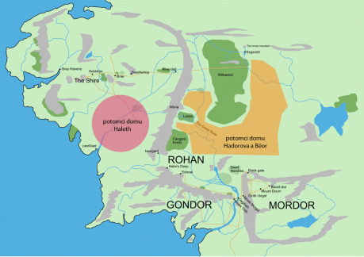
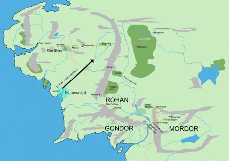
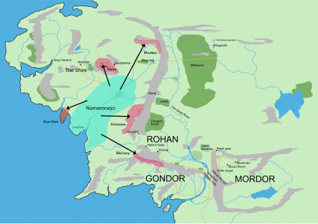
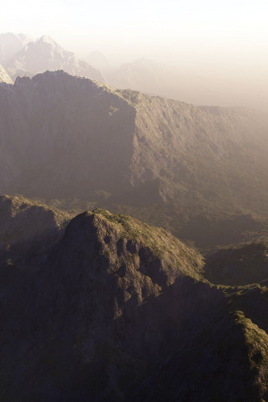

> „(…) Rhudaur nároku odporoval. Tam bylo Dúnadanů málo a moc uchvátil zlý kníže Horalů, který byl v tajném spojení s Angmarem.“ (_Návrat krále_, J. R. R. Tolkien)

My ale hrajeme právě v období válek Arnoru proti Angmaru a Rhudauru, a tím pádem je to pro nás aktuální. Jedna z postav měla být rhudaurským Dúnadanem a navíc se v naší hře objevují i jako nepřátelé, proto jsem potřeboval najít nějaké ucelené řešení, aby pro naše hraní měli nějakou vnitřní logiku. Chtěl jsem zároveň, aby byli jednak nějakým způsobem zajímaví pro hraní a jednak dávali smysl v Tolkienově světě.

Tolkien obecně o tomto období dějin Středozemě neposkytl mnoho informací a v tomto bodě mlčí úplně. Pokusil jsem se projít zdroje, které existují, a z nich něco sestavit – dopředu ale varuji, že nejde o kánon (který zde neexistuje, protože Tolkien téma nijak nerozváděl v žádném z objevených textů, které po sobě zanechal), ale jen o moje vývody a dohady.

## Potomci Domu Haleth?

Začal jsem tím, že jsem si stanovil, že by dávalo smysl, kdyby horalé, stejně jako lidé z Vrchoviny (Vrchovci), byli potomky Domu Haleth (druhého domu přátel elfů), kteří neodešli po zničení Beleriandu na Númenor, ale rozhodli se zůstat ve Středozemi. To, že Vrchovci jsou potomky lidí z druhého domu přátel elfů, je údaj kanonický, to, že by jimi mohli být i rhudaurští horalé, pak můj předpoklad. Už tady je kámen úrazu, protože někdo může říci, že určitě byli potomky Východňanů, kteří se do podhůří Mlžných hor ukryli po Válce hněvu, přičemž všechny následující úvahy nedávají smysl. V tomto bodě Tolkien ale nikdy nerozhodl, takže obě řešení nejdou proti kánonu. Mně možnost Východňanů nepřišla tolik zajímavá, protože by to byli prostí „nepřátelé“ podobně jako Černí Númenorejci. Spřízněnost právě s Vrchovci (vždyť Vrchovina je podobný kus území jako rhudaurské oblasti, kde horalé žili, jen leží jižněji) mně osobně dává větší smysl … a přináší více možností pro hraní, protože pak to znamená, že horalé nemusí být „zase až tak zlí“ a v příběhu mohou mít i jiné role než jen nepřátelské. Oproti prostým nepřátelům mi to připadalo zajímavější, a protože někde jsem začít musel, vzal jsem to proto za své první východisko.

Tolkien píše, že lidé z Domu Haleth pocházeli z jiného druhu lidí než ostatní Edain, kteří přišli na západ (Hadorův a Bëornův dům), drželi se stranou od ostatních a lišili se od nich v mnoha ohledech. Bylo jich méně, měli černé vlasy a byli většinou menšího vzrůstu než ti z ostatních domů Edain. Měli také vlastní řeč, která se ostatním nepodobala. Dávali přednost ústraní a nebojovali po boku elfů ve velkých bitvách proti Velkému nepříteli. Nesnášeli nad sebou jakoukoli cizí nadvládu a v bitvách se oháněli sekerami. Jejich příbuznými byli kromě Vrchovců také lidé z Hůrky (kánon), Křivopřísežníci z Bílých hor (viz níže) a také tajnůstkářský národ, který žil v lesích Eryn Vorn, kam je vytlačili Númenorejci (kánon). Pokud se podíváme na mapu Středozemě, uvidíme, že tyto různé skupiny, byť jsou si příbuzné, sídlí daleko od sebe a mezi nimi není žádné spojení. Předpokládám proto, že po začátku Druhého věku (v období mezi začátkem Druhého věku a příchodem Númenorejců se o tom, co se dělo ve Středozemi, neví skoro nic) osídlili Eriador a oblasti na západ od Mlžných hor právě potomci Domu Haleth (kteří byli vždy izolacionističtí a zřejmě jich na Númenor odešlo jen málo) a další nově příchozí z východu. Je také možné, že členové Domu Haleth odešli téměř všichni a ti, kteří osídlili tyto kraje, byli jejich příbuzní z východu, ale to nehraje takovou roli (šlo rozhodně o lidi podobného druhu, na které lze vztáhnout stejné charakteristiky).

> „Většina lidí ze severních oblastí Západních zemí pocházela z Edain Prvního věku nebo z jejich blízkých příbuzných. Jejich jazyky proto měly vztah k adûnajštině a některé si dosud uchovaly podobnost s Obecnou řečí. Takoví byli lidé z horních údolí Anduiny: Meddědovci a lesní lidé ze západního Temného hvozdu, a dál na sever a na východ lidé od Dlouhého jezera a z Dolu. Ze zemí mezi Kosatcovou řekou a Skalnatým brodem pocházel lid známý v Gondoru jako Rohirové, Páni koní.“ (_Návrat krále, Dodatek F – jazyky a národy Třetího věku,_ J. R. R. Tolkien)

Zde se nemluví o potomcích Domu Haleth (protože ti měli jiný jazyk), ale o příbuzných ostatních dvou Domů Edain. Ti žili podle všeho na východní straně Mlžných hor – to byli světlovlasí Seveřané, kteří později obývali království Rhovanion a vytvořili Éothéod (z toho národa se pak stali Rohirové). Při velkém zjednodušení tak lze říct, že zatímco na západní straně hor obývali rozlehlé hvozdy tmavovlasí potomci a příbuzní Domu Haleth, na východ od nich žili světlovlasí potomci a příbuzní domu Hadorova a tmavovlasí příbuzní rodu Bëorova (který byl nejvíce blízký Noldor a jehož přeživší příslušníci zřejmě v drtivé většině využili pozvání Západu a odešli na Númenor). To je mé východisko druhé, se kterým samozřejmě nemusí mnozí souhlasit.

## Eriador ve Druhém věku

Jak Eriador, kde žili tito potomci Domu Haleth, v té době vypadal? Našel jsem několik citací, které se k tomu vztahují:

> „Avšak v ranějších dobách, v čase prvních průzkumných výprav Númenorejců, byla situace docela jiná. Minhiriath a Enedwaith byly zarostlé obřími a téměř souvislými lesy; jen uprostřed byl kraj Velké bažiny.“ (_Nedokončené příběhy, Dodatek D – Přístav Lond Daer_, J. R. R. Tolkien / Christopher Tolkien)

> „(…) o Starém hvozdu se vypráví mnoho příběhů; dnes z něho zbývá jenom výběžek jeho severní rozlohy. Byly časy, kdy mohla veverka skákat ze stromu na strom z dnešního Kraje až do Vrchoviny západně od Železného pasu. Těmi zeměmi jsem kdysi putoval a poznal jsem spoustu divokých a zvláštních tvorů.“ (_Společenstvo Prstenu_, J. R. R. Tolkien)

> „‚Ano, je [Fangorn, pozn. autora] starý,‘ řekl Aragorn, ‚tak starý jako hvozd u Mohylových vrchů, a je mnohem větší. Elrond říká, že ty dva jsou spřízněné, poslední bašty mocných stromů ze Starých časů, v nichž bloudívali Prvorození, zatímco lidé ještě spali...‘“ (Dvě věže, J. R. R. Tolkien)

> „(…) když dostala své jméno od statečných objevitelů z Tar-Aldarionovy lodi, kteří se odvážili plout proti proudu na malých loďkách. Jakmile se dostali z přímořského kraje slaného vzduchu a silných větrů, hvozdy se stáhly až k břehům řeky, a přestože vody byly široké, obří stromy vrhaly velké stíny na řeku a lodi odvážlivců se jimi tiše sunuly do neznámé země.“ (_Nedokončené příběhy, Dodatek D – Přístav Lond Daer_, J. R. R. Tolkien / Christopher Tolkien)

Šlo tedy o hustý hvozd z dávných dob, který byl příliš hustý a divoký na to, aby se tam usadili ostatní lidé (potomci a příbuzní dalších Domů lidí a potomci nově příchozích z východu). Ti osidlovali údolí řek a nížiny na druhé straně Mlžných hor. Jak jsme se ale už dočetli, lidé z Domu Haleth byli v lese doma a sídlili v něm. Proto zřejmě osídlili právě oblasti lesů na západ od Mlžných hor, o které nikdo jiný nestál, a žili tam zapomenuti okolním světem.

V tomto hustém pralese tak žil roztroušeně národ lidí, kteří zřejmě neměli jednoho krále (viz citace níže), ale sdíleli společnou kulturu a jazyk (odlišný od adûnajštiny a pozdější západštiny). Našel jsem označení _Gwathrim_ (tedy „Lidé žijící ve stínu řeky Gwathló“), které jim dali Númenorejci – budu je tedy používat pro tuto původní přednúmenorejskou „civilizaci“. K elfům zřejmě tito Gwathrim nebyli otevřeně nepřátelští, ale ani je neměli nijak v lásce a nejspíš se jich báli. Bylo tomu tak dle Tolkiena u pozdějších Vrchovců, lze hádat, že šlo snad o zděděnou tradici.

## Příchod Númenorejců a vyhnání Gwathrim

Když přišli Númenorejci a začali kácet lesy, aby měli dřevo pro stavbu svých lodí, zakládat přístavy a vybírat daně od původních obyvatel, tito lidé se jim vzepřeli a s Númenorejci bojovali. Ti v nich (jak Tolkien píše) nerozpoznali své vzdálené příbuzné (právě protože vypadali jinak a měli cizí jazyk, nepodobný adûnajštině, kterou tito mluvili) a měli je za Lidi stínu. Nemilosrdně je proto pronásledovali, vypalovali jejich vesnice a vyháněli je.

> „Domorodci byli dost četní a bojovní, sídlili však v lese v rozptýlených obcích bez ústředního vedení. Númenorejců se báli, ale nechovali se nepřátelsky, dokud nezačaly být pustošeny lesy. Pak Númenorejce napadali otevřeně i ze zálohy, kde mohli, Númenorejci se k nim chovali jako k nepřátelům a začali kácet nemilosrdně a vůbec se o lesy nestarali ani nevysazovali nové. Zprvu se kácelo po obou březích Gwathló a dříví se plavilo po proudu k přístavu (Lond Daer), ale nyní Númenorejci prorazili do lesů na sever i na jih od Gwathló široké cesty a silnice a domorodci, kteří přežili, prchli z Minhiriathu do temných lesů na velkém mysu Eryn Vorn jižně od ústí Baranduiny, kterou se neodvažovali překročit, i když mohli, ze strachu před elfy. Z Enedwaithu se uchýlili do hor na východě, kde byla později Vrchovina; nepřekročili Želíz ani se neuchýlili na velký mys mezi Želízí a Lefnui, jenž tvořil severní závěr Belfalaské zátoky kvůli ‚púkelům‘ …“ (_Nedokončené příběhy, Dodatek D – Přístav Lond Daer_, J. R. R. Tolkien / Christopher Tolkien)

Původní númenorejské osídlení Eriadoru se soustředilo k přístavu Lond Daer v ústí řeky Šeravy (Gwathló) a později podél jejího toku až k mokřadům a bažinám [Nîn-in-Eilph](http://henneth-annun.net/places_view.cfm?plid=335). Z těchto oblastí byli také tito původní obyvatelé vypuzeni – část se ukryla na západě v hlubokých lesích Eryn Vorn, část utekla na sever a později se usadila v okolí Hůrky (a začlenila se pak do pozdějšího království Arnor), zatímco další se stáhli do nedostupných oblastí na východě – na Vrchovinu, zřejmě do Bílých hor, a předpokládám že (aby unikli vlivu nově příchozích) i daleko na sever – do podhůří Mlžných hor a Obrovišť v Rhudauru. Proč píšu do Bílých hor, když Tolkien říká, že nepřekročili Želíz (přičemž Bílé hory se nachází až za ní)? Pro sebe jej čtu tak, že „nepřekročili Želíz _směrem na východ_“ (řeka teče nejprve ze severu na jih a pak se na pláních stočí západním směrem). Jinak by totiž nemělo smysl zmiňovat ani onen mys mezi Želízí a Lefnui, protože ten je už _za Želízí_ ve směru na jih.

> „Cizí, nebo jen vzdáleně příbuzná byla také řeč Vrchovců. Ti byli pozůstatkem národů, které sídlily v údolích Bílých hor v minulých věcích. Mrtví z Šeré Brázdy byli jejich příbuzní. V Temných rocích se však někteří přestěhovali do jižních údolí Mlžných hor, odtud část pronikla do pustých zemí na sever až k Mohylovým vrchům. Z nich pocházeli Hůrečtí, ti se však už dávno předtím stali poddanými Severního království Arnoru a přejali západský jazyk. Jen ve Vrchovině si lidé toho plemene podrželi starou řeč a zvyky. Byl to skrývavý lid, nepřátelský vůči Dúnadanům, nenávidící Rohiry.“ (_Návrat krále, Dodatek F – jazyky a národy Třetího věku_, J. R. R. Tolkien)

Tento text je v jasném rozporu s výše zmíněnou citací (a mým výkladem středozemské historie), když udává opačný směr migrace. Co s tím? Je možné, že oba platí najednou, když byli „Gwathrim“ a „lidé z Bílých hor“ příbuzní a vzájemně se smísili (migrací do obou směrů) do jednoho národa... ale domnívám se, že vznikly v jinou dobu a Tolkien pak už neměl čas je opravit tak, aby si vzájemně odpovídaly. Více textů podporuje spíše směr migrace od řeky Gwathló směrem k Bílým horám, proto se této verze držím – ale co je na této citaci zajímavé, je Tolkienův úmysl, aby byli „lidé z Bílých hor“ Vrchovcům a Hůreckým příbuzní. Ten vypadá promyšleně a zřejmě by v textu zůstal i po případných opravách. Z poslední citace tak nebudu přihlížet k onomu opačnému směru migrace, ale využiju příbuznosti s „Gwathrim“. V mé verzi budou lidé z Bílých hor tedy potomci Gwathrim, kteří utekli před Númenorejci, neusadili se na Vrchovině, ale pokračovali dál na jih a usadili se v Bílých horách. Tady máme východisko třetí.

Tam se později dostali pod vliv Gondoru, a zatímco Křivopřísežníci od kamene Erech nové království zradili a zmizeli z dějin, předpokládám, že někteří se prokázali jako věrní a splynuli s obyvateli Gondoru (stejně jako Hůrečtí splynuli s obyvateli Arnoru). V Návratu krále se píše o posilách, které do Minas Tirith dorazily z Lamedonu před obležením.

> „Z Lamedonu hrstka sveřepých horalů bez kapitána.“ (_Návrat krále_, J. R. R. Tolkien)

Jméno Lamedon samo není sindarské ani adûnajské, pochází zřejmě ještě z přednúmenorské doby. Mohli by tak tito „zachmuření horalé“ být potomky Gwathrim a původních obyvatel Bílých hor, příbuzní Vrchovců a rhudaurských horalů? Už to trochu přesahuje rámec článku, ale možné to rozhodně je a připadá mi to zajímavé, takže pro mou hru s tím počítám.

## Rhudaurští horalé

Na internetu jsem v diskuzi pak četl názor, že oni „zlí rhudaurští horalé“ mohli být Tolkienem vnímáni jako „zlí a rebelující“ skotští horalé z pozice Angličana, a ten nápad se mi opravdu líbí (rád bych zde uvedl zdroj, ale debatu už se mi nepodařilo dohledat a dost možná už ani neexistuje). V mé představě jsou proto horalé z Rhudauru potomci původních Gwathirim, blízce spříznění s Vrchovci, kterým jsou také velmi podobní. Jejich předobrazem v našem světě tak mohou být Piktové nebo právě nezávislí Skoti. Rhudaurští horalé původně určitě nebyli zlí – měli vlastní starou kulturu (pro moje potřeby podobnou keltské) a jazyk, který si zachovali. Byli hrdí a nezávislí, přičemž žili rozděleni na samostatné klany (širší rodiny, podobné skotským klanům) a neměli nad sebou jednotného vládce (naslouchali jen náčelníkovi toho kterého klanu). Klany spolu zřejmě také bojovaly a vznikla mezi nimi tradiční spojenectví a nepřátelství. Horalé žili v drsných podmínkách a byli otužilí. Vůči elfům byli horalé nedůvěřiví a vůči Dúnedain nepřátelští, protože se nechtěli podřídit jejich nadvládě a drželi se svých starých pořádků. V Nedokončených příbězích se píše, že na Vrchovině byli až do příchodu Sarumana nepřátelští k těm, kteří měli skřetí krev, a také ke skřetům obecně. Předpokládám, že to samé platilo i pro mé rhudaurské horaly.

Poté, co byl Númenor zničen a Vyhnanci si založili svá království Arnor a Gondor ve Středozemi, ovládli arnorští Dúnedain také Rhudaur a zdejší klany se musely podřídit cizímu králi. Tolkien píše, že v Rhudauru bylo vždycky málo Dúnedain a ti tak zřejmě tvořili jen úzkou vládnoucí vrstvu, přičemž většinu obyvatel země tvořili stále rhudaurští horalé. Některé z klanů mohly tvrdohlavě cizí nadvládě vzdorovat a v Rhudauru tak zřejmě čas od času propukala povstání, které museli Dúnedain potlačovat.

> „Za dnů Malvegilova syna Argeleba králové Arthedainu opět vznesli nárok na celé panství Arnor, protože v druhých královstvích nezůstali žádní Isildurovi potomci. Rhudaur nároku odporoval. Tam bylo Dúnadanů málo a moc uchvátil zlý kníže horalů, který byl v tajném spojení s Angmarem.“ (_Návrat krále_, J. R. R. Tolkien)

Černokněžný král v srdcích horalů zřejmě rozdmýchal nenávist proti „cizákům“, kteří „uzmuli jejich zem“, a slíbil jim pomoc. Horalům zřejmě dodal zbraně a vojáky. Díky tomu se rhudaurským kolem roku 1350 Třetího věku podařilo uskutečnit převrat, zmocnit se vlády v Rhudauru a vyhnat nebo pobít větší část Dúnedain, kteří stále zůstávali věrní a byli nepřáteli Angmaru. Na rhudaurský královský stolec nastoupil nejmocnější z náčelníků horalů a Rhudaur byl na chvíli samostatným královstvím a spojencem Angmaru (kterému vděčil za pomoc) v boji proti Dúnedain. Skřety horalé ve skrytu duše pohrdali a málo jim záleželo na válce, kterou spolu Arnor a Angmar vedli, ale drželi dané slovo a bojovali, aby splnili daný slib.

Brzy nicméně horalé zjistili, že Černokněžný král jim lhal – angmarské oddíly, které pomáhaly svrhnout Dúnedain, nikdy neodešly, ale zůstaly v Rhudauru. Krůček po krůčku se země dostávala do podruží Angmaru, aby o několik let poté zůstala v zásadě jen angmarskou provincií, kde vládnou dosazení angmarští správci.

> „V roce 1409 (…) Rhudaur byl obsazen zlými lidmi podřízenými Angmaru a Dúnadani, kteří tam zůstali, byli pobiti nebo uprchli na západ.“ (_Návrat krále_, J. R. R. Tolkien)

Tehdy zřejmě dokončily angmarské oddíly vyhlazení zbytku rhudaurských Dúnedain a převzaly kompletně moc nad zemí. Jednu cizí nadvládu tak nahradila druhá, mnohem krutější a nelidštější. Některé klany se proto určitě bouřily proti nové nadvládě, jako se bouřily proti staré. Černokněžný král pak zkrotil povstalce železnou pěstí a skřeti odvetou za odboj vyhladili celé vesnice, vraždili, pálili a zotročili přeživší. Angmarští vyslanci navíc určitě mezi horaly zaseli podobné lži jako později Sarumanovi mezi Vrchovci, takže mnohé klany pochodovaly pod angmarskými prapory dobrovolně, další se přidaly z touhy po kořisti a zbytek prostě držel na uzdě strach z angmarské odvety. Tak skončili rhudaurští horalé na špatné straně a ta se jim stala osudnou, protože roku 1973/4 Třetího věku byl Angmar (a Rhudaur, který byl součástí jeho království) poražen a zničen.

## Konec rhudaurských horalů

> „Tehdy byl Angmar poražen tak dokonale, že na západ od Hor nezůstal jediný muž a jediný skřet z té říše.“ (_Návrat krále_, J. R. R. Tolkien)

Z vojska, které rhudaurští horalé poslali do pole, se tak zřejmě nevrátil ani jediný a elfové a Dúnadani pak vyvrátili hlavní angmarské pevnosti a města, takže Angmar byl zničen a zcela zanikl. Je otázka, nakolik to platilo o sídlech horalů, po této válce už nicméně do příběhů Středozemě napříště nevstupují. O tom, co se s nimi stalo, lze jen spekulovat.

Možná byli vyhlazeni spolu s angmarskými nebo byla ztráta většiny mužské populace příliš velkou ranou, ze které se už nevzpamatovali. Možná před postupujícími nepřáteli uprchli ze svých sídel na východní stranu hor (přičemž hlad, sněhové bouře a skřetí marodéři by si na prchajících určitě vybrali svou krutou daň) a zde se přeživší smísili s jinými národy v údolí Anduiny a jejich potomci mohli být částí pozdějších „lesních lidí“ ze Třetího věku. Možná, že po této porážce zmizeli ze stránek historie, ale přesto v pozdějších letech postavy mohou narazit vysoko v horách na malé vesnice a usedlosti, kde místní mluví nesrozumitelným jazykem, prchají před elfy a arnorskými erby a šeptem si vypráví příběhy o velkém hněvu Západu. Vyberte si sami, co se vám pro vaše hry bude hodit.

## Zdroje:

Tolkien, J. R. R. _Společenstvo Prstenu_. Praha: Argo 2006.

Tolkien, J. R. R. _Dvě věže_. Praha: Argo 2006.

Tolkien, J. R. R. _Návrat krále_. Praha: Argo 2007.

Tolkien, J. R. R. _Nedokončené_ _příběhy_. Ed. Ch. Tolkien, Praha: Argo 2008.

Podkladem map je mapa převzatá ze serveru [lotr.wikia.com](http://lotr.wikia.com), kterou tam vložil uživatel _Gimli_.

Další zdroje, které na téma rhudaurských

horalů můžete nalézt na internetu:

- [Analýza od Michaela Martineze](http://middle-earth.xenite.org/2011/11/21/what-was-the-origin-of-tolkiens-hill-men-of-rhudaur/), autora několika knih o Středozemi, kde pěkně shrnuje vše, co je o horalech známo.
- [Další podobná analýza](http://askmiddlearth.tumblr.com/post/65088663739/the-hill-men-of-rhudaur) na „Ask about Middle-Earth“, která rozebírá další možnosti původu horalů.
- [Obecné informace](http://tolkiengateway.net/wiki/Hill-men) na tolkiengateway.net.
- [Obecné informace](http://lotr.wikia.com/wiki/Men_of_Rhudaur) na lotr.wikia.com.
- [Jiný návrh řešení horalů](http://merp.wikia.com/wiki/Hillmen_of_Rhudaur), který byl použit pro příběhovou hru MERP.
