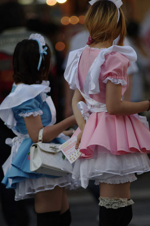
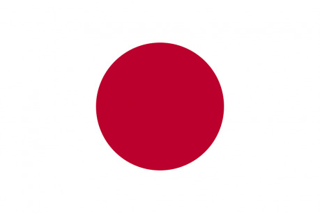

## Drogy

V Japonsku se vede tvrdý a nelítostný boj proti drogám. Tento boj ale není jen deklarovaný jako v některých evropských zemích, kde politici dělají prohlášení, policie vede razie na oko a obyvatelé pokyvují, jak je to strašné, ale přitom si všichni čas od času dají nějaký koláček. Drogy tu jsou na všech úrovních odmítané a vnímané jako tabu. Pokud by se zjistilo, že člověk užívá drogy, by byl (u většiny profesí) okamžitě propuštěn, případně by přišel o veškerou klientelu.

Japonci rozlišují tvrdé a měkké drogy, ale de facto postihy jsou u obou kategorií tak přísné, že se to rozlišovat ani nevyplatí. Postihy jsou v rozmezích od pěti (marihuana) do deseti (amfetamin) let vězení. A teď začíná zábava: vězení vám nehrozí pouze za držení nebo prodání drog, jako je tomu u nás, ale i za to, že jste pod vlivem drog! V souvislosti s tím mají všechny státní nemocnice a kliniky zákonem danou povinnost jakýkoliv nález drog v systému okamžitě hlásit policii.¹ Zapomeňte na nějaké lékařské tajemství (nebo anglicky doctor-patient confidentiality), chcete-li se vyhnout problémům, budete muset navštívit nějaké soukromé instituce.

¹ Vaše parta runnerů si příležitostně dává? Doufejte, že nebudou zranění a neocitnou se ve špitále. Mohlo by se to snadno proměnit v honičku.

² Klubová zóna Tokya

³ Ale zase jak pozná parta, že v očekávaném balíčku od Mr. Jonese není výplata, ale něco problematického?

A jak tedy policie narazí na drogy u vás? Pokud to nebude tou nešťastnou návštěvou nemocnice, mají pořád v záloze jiné triky. Asi první možnost, která nás napadne, je, že vás chytí při činu. Policista v utajení se vydává za dealera, a jakmile si od něj něco koupíte, tak vás na místě zatkne. Myslíte si, že okamžité zatčení je trochu silné kafe? Když vás zatknou, vezmou vám telefon, projdou si vaše kontakty a každému napíšou SMSku jako „Čau, jsem v Roppongi², chceš něco vzít?“. Následující den se každému, kdo na SMSku odpoví, objeví před bytem policisté a zadrží jej.

Pokud se vám zdá nepředstavitelné, že by vám policie procházela telefon, tak vězte, že jsou ochotni vám třeba kontrolovat i zásilky. A pokud najdou něco podezřelého, tak ne že by to rovnou zabavili, ale nechají poštu, aby vám zásilku doručila, a jakmile si ji vyzvednete, tak krátce na to můžete očekávat návštěvu a zatčení za držení. Proto převzít si balík od neznámého odesilatele se opravdu nedoporučuje.³

## Vězení

A co na tom, že vás zatknou? Nic hrozného se z toho nakonec nevyklube, že ne? No vězte, že procedura, tak jak ji známe z amerických seriálů, tady opravdu neplatí. Policie vás může zadržet po dobu osmačtyřiceti hodin bez práva na telefonát nebo jinou komunikaci s okolním světem. Někdy během této doby (ale třeba na konci, že?) jsou povinni vás informovat o trestném činu, ze kterého jste podezřelí, a o vašem právu na to nevypovídat, právu na najmutí právníka na vlastní náklady (ty se pohybují okolo 4000 až 6000 dolarů za případ)⁴ a právu informovat vlastní ambasádu o zadržení. Pokud policie věří, že má dostatek důkazů pro vaše zatčení, musí je prezentovat státnímu zástupci, který pak má 24 hodin, aby získal soudní příkaz (a během té doby budete pořád ve vazbě).

Pokud soudce uzná, že je pravděpodobné, že jste spáchal trestný čin, může vás nechat zadržet na dobu až 20 dnů, aby mezitím mohlo proběhnout policejní šetření. Život v japonském vězení není žádné peříčko. U drogových případů platí zákaz veškeré komunikace mimo právníka. Vězeň má k dispozici individuální celu, jeho denní život je řízen dle striktního denního plánu s osmihodinovou povinnou pracovní dobu (viz graf) a dozorci se neštítí používat fyzické násilí, pokud se vězeň odmítne režimu podřídit. Pokud chce provést cokoli mimo plán (navštívit doktora, objednat si nějaké jídlo, napsat dopis …), musí si o to nejdřív písemně zažádat a čekat na povolení.

Na druhé straně se nedá říci, že by se s vězni zacházelo špatně. Striktní režim a oddělení zajišťuje, že nedochází k vnitřním násilnostem nebo vzniku gangů. Celkově nejčastější stížnost je nuda.

⁴ V některých případech vám může být právník přidělen, pokud si ho nemůžete dovolit, ale většinou se toto děje až po obžalobě, takže není nikdo, kdo by vám pomáhal v úvodních fázích celého řízení.

⁵ Pro cestu do Japonska si normálně není potřeba zařídit vízum, ale po přistání na letišti a pasové kontrole je tam vystaveno turistické vízum s platností 90 dnů. Pokud by si někdo přál zůstat déle, potřebuje si zařídit předem jiné vízum (pracovní, studijní...). Vzhledem k tomu, že turistické vízum má takto krátkou platnost, reálně hrozí, že do konce stíhání vyprší.

Když už dojde k soudu, tak soudy s cizinci u závažnějších trestních činů většinou končí deportací na vlastní náklady odsouzeného. Pokud je trestný čin méně závažný (méně než 3 roky vězení nebo pokuta menší než 200 000 jenů – cca 41 tisíc korun) a odsouzený má platné vízum⁵ a japonského sponzora (nebo ručitele), který za něj bude ručit (typicky manžel/ka), je možné, že mu bude povoleno, aby v Japonsku zůstal. Jestli odsouzený nemá dost peněz, aby si zaplatil náklady za deportaci, je možné si odsedět 6–8 týdnů navíc a nechat se deportovat na náklady státu.

## Akihabara

Jak už jsme si řekli v kapitole o podobě vs. esenci, snažit se něco naučit o Japonsku na základě mang, anime a populárních internetových stránek je hodně scestné. Většina Japonců ve skutečnosti neví o všech těch zvláštních rituálech, perverzních obchodech a jiných „typicky japonských“ věcech, které s oblibou kolují na internetu. Pokud však budete na obyčejného Japonce naléhat, aby vám o tomhle něco řekl, určitě zmíní Akihabaru.

Akihabara je tokijská čtvrť, známá jako elektronické centrum země, kde se spousta zdejších firem v minulosti specializovala na domácí elektroniku a počítače. Postupem času se však díky počítačům a konzolím toto místo stalo atraktivní pro nerdy a tzv. „otaku“ (japonské označení pro nerda, většinou člověka s obsesí pro mangu nebo anime). V současnosti je to hlavní oblast animovaného merchandisingu, konzolí a počítačových her.

Při návštěvě Akihabary můžete očekávat vysoké budovy plné reklam na obrovských plakátech a monitorech, to celé často osvětlené neony, celé budovy věnované arkádovým hrám od Segy, několikapatrové obchody s komiksy a merchandisingem a mnohým dalším.

Pro mě osobně nebyly největším šokem ani animované náctileté dívky na plakátech ve velice sugestivních polohách, ani merchandisingové figurky hrdinek z anime s nesmyslnými proporcemi hrudi, ale daleko spíše fakt, že v komiksových obchodech vůbec neoddělují komiksy určené pro čtenáře 18+ od těch ostatních. Člověk tam narazí na typický teenagerovský komiks hned vedle jiného, který má na obálce nahou ženu s roztaženýma nohama.

Neodmyslitelnou součástí Akihabary jsou tzv. „maid cafés“, což jsou kavárny, kde vás obslouží slečny v roztomilých šatičkách francouzských služebnic. Za touto na první pohled neškodnou zábavou se ale skrývá fakt, že tato zařízení jsou vnímána de facto jako „light-nevěstinec“. U vchodu vás přivítají se slovy „Vítej doma, miláčku“ a během celého pobytu se vám bude jedna slečna věnovat tak, že se s vámi bude bavit, jako byste byl její přítel. Pokud vám zvědavost nedá a budete si chtít ten zážitek vyzkoušet, vězte, že budete velice zklamaní. Slečny málokdy umí anglicky, jídlo a pití je předražené a ani moc nechutná.

## Kabukičó

Nemohu zmínit maid café, aniž bych se nerozepsal o kultuře nejstaršího řemesla v Japonsku. Stejně jako je tomu u drog, také jakákoliv prostituce je zakázaná a tvrdě potlačovaná (a na rozdíl od Západu to zase vypadá, že to funguje). Místo toho tu vesele fungují pro nás nepochopitelné zařízení, ze kterých bych zmínil převážně „inuendo salon“, „pink salon“ a „hostess club“.

Ten první typ zařízení jsou kluby, u kterých nevím, jak se oficiálně jmenují, ale dají se výstižně pojmenovat jako „inuendo“ salon (využil jsem pro to anglické slovo „inuendo“ které znamená něco jako „říct něco, co mezi řádky naznačuje sexuální podtext“). U nich dochází mezi ženskou obsluhou a mužskou klientelou k různým hrátkám. Jeden příklad je obdoba hry „na babu“, kdy muž honí ženu a snaží se jí dotknout pomoci gumové hračky. V další hře se muž snaží zasunout ženě banán za pás, a když se mu to povede, žena vezme banán a sní ho, zatímco se na něho dívá. Všechno velice sugestivní hry, které se ale drží přísného pravidla, že nesmí dojít k fyzickému kontaktu mezi obsluhou a klientelou.

„Pink salon“ je opačným extrémem. Jsou to místa, kde si zákazník může zcela legálně objednat praktiky nezahrnující koitus (třeba takové, kde je klient uspokojen pomocí rukou nebo úst). To všechno díky legální definici sexu pouze jako koitu.⁶

{:.sidebar}
⁶ Z jiného soudku tohle je zase problematické u sexuálního obtěžování, neboť kvůli té definici japonské právo nezná sexuální obtěžování ve formě osahávání nebo obhroublé mluvy, a ani homosexuální obtěžování.

Výše zmíněné „hostess clubs“ jsou bary, kde vám během celé doby dělá společnost hosteska (případně hostes, pokud navštívíte tzv. „host club“ s mužským personálem), povídají si s vámi, nabízí vám emocionální podporu a vybízí vás k nákupu dalšího alkoholu, ze kterého mají provize. Během týdne vám pak píší SMSky („jak se máš?“, „stýská se mi po tobě“, „pojď mne navštívit“ atd.). Nejúspěšnější hostesky vydělávají docela velké peníze, ty málo úspěšné naopak často v zoufalství nabídnou sexuální služby pod pultem, aby si udržely zákazníka nebo si vydělaly na další měsíc.

Tato a další zařízení naleznete v tokijské čtvrti Kabukičó u jedné s největších vlakových stanic Šindžuku. Tato čtvrť dostala název po tradičním japonském divadle (tzv. kabuki), které se tam mělo po Druhé světové válce stavět. Kvůli finančním problémům země se nakonec tento projekt nerealizoval, ale název zůstal. Místo toho do čtvrti investovali místní Číňané, kteří z ní udělali to, co známe dnes. Traduje se, že celou oblast nepřímo kontroluje jakuza, která zajišťuje bezpečnost vlastních zařízení a která se přes své lidi snaží navigovat cizince do nejaponských zařízení, kde je obslouží dámy většinou filipínského původu. Ano, je to tak, neradi vidí nějaké „míšení“ Japonců a cizinců a může se stát, že se vás budou snažit nějakým způsobem usměrnit, ale zase by při tom nemělo dojít k použití hrubé síly z jejich strany.

Vzato kolem a kolem, přiznám se, že netuším, kde se celý ten japonský boj proti prostituci bere. Křesťanské puritánství v tom očividně prsty mít nemůže (historicky byla v době největšího rozmachu pouze 2 % populace křesťanská a stejně byli pak krutě pronásledováni). Podle toho, co jsem se dočetl, byla situace ve dvacátém století a dříve volnější a bylo mi rovněž řečeno, že japonské ženy jsou poměrně otevřené, pokud jde o vztahy na jednu noc. Jak to u těchto věcí ale bývá, často se mění a kdo ví, jestli za pár let nebude situace opět úplně jiná.
