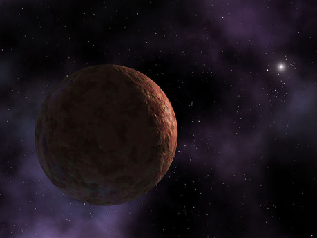

## Honba za osmou a devátou planetou

Něco bylo v nepořádku s Uranem. Pohyb planety vykazoval nepravidelnosti, které se zřejmě daly vysvětlit jedině gravitačním působením dalšího, dosud neznámého světa. Astronomy záležitost trápila už od přelomu 18. a 19. století. Ovšem teprve těsně před polovinou 19. století byla záhada vyřešena. Britský astronom John Couch Adams ve 40. letech podnikl sérii výpočtů s cílem neznámou planetu nalézt … jeho výsledky na to však nestačily. Závod vyhrál černý kůň z druhého břehu La Manche, který o Adamsových (nezveřejňovaných) snahách ani nevěděl.

Léto 1846. Francouzský matematik Urbain Le Verrier opět usedá ke svým výpočtům vycházejícím z nepravidelností pohybu Uranu na obloze. Dochází k předpovědi pozice tělesa, které jej ovlivňuje, a v dopisu poprosí o ověření předpovědi berlínského astronoma Johanna Gott­frieda Galla. Dopis dorazí 23. září. Galle na rozdíl od francouzských astronomů nelení a ještě té noci se chopí ovládání jednoho z nejlepších teleskopů světa v kupoli Nové berlínské observatoře, kde pracuje. A ještě téže noci také za pomoci svého studenta a pečlivého porovnávání hvězdných map objeví objekt, který není hvězdou – jde o hledanou planetu, na sklonku toho roku oficiálně nazvanou Neptun (byť proces jejího pojmenovávání byl bezmála tak dramatický jako samotné pátrání).

Dnes je objev Neptunu učebnicovým příkladem vědecké práce. Názorně ukazuje, jak se pozorování s teorií mohou snoubit ve formulování nových hypotéz, které můžeme testovat a posouvají hranice našich znalostí kupředu (a jak může být bez patřičných teorií a opakování pozorování něco přehlédnuto – Neptun pozoroval už Galileo, jen jej nepovažoval za planetu). Nicméně záhy po objevu Neptunu nadešla éra hledání další „planety X“, která pro změnu ukazuje, že nepřesná pozorování nás mohou zavést do slepé uličky.

Zdálo se totiž, že oběh Uranu vykazuje další drobné nepravidelnosti, které může vysvětlit jedině přítomnost další velké planety. Šlo o nepravidelnosti zhruba stokrát slabší než ty přičítané Neptunu, a tak se už tehdy někteří astronomové domnívali, že může jít o chybu pozorování a nikoli vliv jiného tělesa – bylo by však chybou tuto možnost neprověřit. Další astronomové zase vyvozovali existenci dalších planet z drah tehdy známých komet. Někteří předpokládali až sedm dalších planet.

Nejznámější a nejintenzivnější snahou nalézt „planetu X“ byla činnost Lowellovy observatoře v Arizoně. Bohatý americký matematik a astronom Percival Lowell se proslavil zejména dvěma věcmi: Vírou v existenci kanálů na Marsu postavených mimozemskou civilizací a pátráním po deváté planetě. Ač Lowell sám zemřel v roce 1916, činnost jím založené observatoře pokračovala a v roce 1930 mladý astronom Clyde Tombaugh skutečně objevil novou planetu – Pluto – nedaleko od jedné z lokalit předpovězených Lowellovými výpočty.

Nějakou dobu se zdálo, že Lowellova kontroverzní reputace v tomto bodě dojde uznání. Nalezené těleso však bylo i pomocí silného teleskopu vidět jen jako nepatrná tečka, což naznačovalo malé rozměry nebo nízkou odrazivost povrchu. Zpočátku se běžně přijímaný názor ustálil na rozměrech o něco menších než Země a hmotnosti zhruba odpovídající Zemi, i když ne všichni s ním souhlasili. Už tehdy se řada astronomů domnívala, že k nalezení planety došlo spíše náhodou než na základě Lowellových propočtů a že půjde o menší těleso.

Jak se postupně odhady na základě pozorování zpřesňovaly, daly jim za pravdu a Pluto se smrsklo z hmotnosti Země na desetinu, setinu … a nakonec přibližně pětsetinu. Nejvíce pomohlo jeho hmotnost stanovit objevení jeho měsíce Charonu roku 1978. Díky jejich vzájemnému pohybu už nebylo nejmenších pochyb, že Pluto má daleko menší hmotnost, než se předpokládalo původně. Rozhodně nemohlo být zodpovědné za nepravidelnosti v oběhu Uranu.

Na nějaký čas hledání Planety X opět trochu ožilo, ale po průletu _Voyageru 2_ kolem Neptunu se ukázalo, že dřívější odhad jeho hmotnosti a tím pádem i gravitačního vlivu na Uran byl trochu nepřesný. Vysvětlení oběhu ledových obrů už žádnou Planetu X nevyžadovalo.

## Konec samoty Pluta

Postupně jsme začali objevovat další vzdálená tělesa: V roce 1978 Plutův velký měsíc Charon, od počátku 90. let další ledové planetoidy v oblasti, jež vešla ve známost jako Kuiperův pás. Počátkem našeho tisíciletí začalo být zřejmé, že Pluto není ojedinělé těleso. Dnes v těchto vzdálených výspách naší soustavy známe jednu hmotnější (byť o chlup menší) trpasličí planetu, Eris, a více než deset těles alespoň polovičních rozměrů Pluta. Celkový počet známých transneptunických těles je výrazně vyšší, neboť jde i o řadu menších planetek, asteroidů či kometárních jader.

V roce 2003 byla objevena trpasličí planeta zhruba poloviční velikosti Pluta a vskutku podivného ražení. Její dráha je velice excentrická, s periheliem okolo 76 AU a aféliem bezmála 950 AU* daleko. Jeden oběh jí trvá zhruba něco přes jedenáct tisíc let. Toto skandální těleso bylo pojmenováno Sedna a donedávna zůstávalo jediným objektem svého druhu – dokud nebyl před dvěma lety ohlášen objev tělesa s názvem 2012 VP113, další trpasličí planety na velmi excentrické dráze.

{:.sidebar}
*&#9;1 AU neboli astronomická jednotka je rovna vzdáleností mezi Zemí a Sluncem (cca 150 milionů km). Pro srovnání: Neptun obíhá přibližně 30 AU daleko od Slunce, Pluto má perihelium přes 29 AUa afélium přes 49 AU od Slunce.

Objev Sedny rozvířil spekulace o tom, co ji mohlo postrčit na tak výstřednou dráhu. Byl to snad průchod jiné hvězdy v relativní blízkosti Slunce (kolem 800 AU či dál), což je zejména v dobách krátce po zrodu Slunce v jeho zárodečné mlhovině s dalšími „sourozenci“ dobře představitelný scénář? Mohlo jít o pošťouchnutí více hvězdami? Mohla by Sedna dokonce být zachyceným tělesem, které se zformovalo u jiné hvězdy? Nebo jde o gravitační vliv dosud neznámého většího tělesa v naší soustavě?

Objevitelé 2012 VP113, Chad Trujillo a Scott Sheppard, navrhli na základě matematických simulací možnou existenci superzemě (zjednodušeně řečeno planety s hmotností mezi Zemí a Neptunem) s velkou poloosou dráhy více než 200 AU jako vysvětlení dráhy těchto těles. V exoplanetárních systémech jsou superzemě poměrně běžnou záležitostí, v naší soustavě však žádnou takovou planetu nemáme – nebo o ní alespoň zatím nevíme. Modely vzniku soustavy naznačují, že se taková mohla zformovat a být gravitací plynných a ledových obrů vyvržena buď na periferii soustavy, nebo zcela mimo ni.

V nedávné době vzbudil rozruch článek Konstantina Batygina a Mika Browna, jejichž model vysvětluje shluknutí perihelií šesti excentrických transneptunických těles, podivnou dráhu Sedny i 2012 VP113, a dokonce (což původně neočekávali) přítomnost známých excentrických těles s vysokou inklinací (velkým úhlem své dráhy vůči rovině soustavy). Vysvětlením by mohla být planeta o hmotnosti zhruba deseti Zemí s výstřednou drahou a periheliem přes 200 AU, aféliem až okolo 1200 AU. Jejich model předpovídá i existenci objektů, jejichž vysvětlení autoři původně neočekávali, bral v úvahu řadu možností a klade poměrně jasné meze na dráhu hypotetické planety.

Pak tu jsou samozřejmě i dnes již nevědecké hypotézy o tom, co ještě může ležet v dálavách naší soustavy. Proponenti obří plynné planety Nibiru (někdy dokonce tvrdící, že je na dráze procházející v blízkosti Země, což je o to větší nesmysl) i hvězdného souputníka Nemesis (který byl původně vážně navržen jako možná příčina periodicity vymíráníˣ a pak se toho chytili příznivci konspiračních teorií) jsou stále celkem početní, ale plynné obry ani další hvězdy už v našem nejbližším sousedství čekat nemůžeme. Jak to můžeme vědět, ptáte se?

{:.sidebar}
ˣ Není ale jasné, zda se ve vymírání vůbec nějaká reálná periodicita vyskytuje nebo jde o statistický artefakt.

Odpovědí je plošný průzkum oblohy sondou WISE v infračerveném spektru. Ten vyloučil přítomnost plynných obrů o hmotnosti Saturnu do 10 000 AU a o hmotnosti Jupiteru do 26 000 AU (a jak už jistě tušíte, případnou hvězdu nebo třeba hnědého trpaslíka by našel tím spíše – a nové hnědé trpaslíky sonda skutečně našla … ve vzdálenostech od šesti světelných let dál) a to jsou ještě konzervativní odhady. Novější práce Kevina Luhmana je rozšiřuje na 28 000, resp. 82 000 AU. Pro srovnání, jeden světelný rok je něco přes 63 000 AU.

Pseudovědci i milovníci konspiračních teorií tedy mají smůlu – Nibiru ani Nemesis se nedočkáme. Ač přítomnost plynných planet ve větších než uvedených vzdálenostech není zcela vyloučena, jejich gravitační působení by rozhodně nevedlo ke kataklyzmatům, jaká proponenti těchto konspiračních teorií prosazují. Asi si budou muset vymyslet nový konec světa. A nebo taky ne; navzdory vyvrácení reálnými daty jim pořád dost lidí věří.

Vraťme se ale k vědě a k novému modelu Batygina a Browna. Obrovským plus jejich práce je relativně „snadná“ testovatelnost – víme přibližně, kde hypotetickou planetu hledat, a pokud ji ani dostatečně silnými teleskopy nenalezneme, budeme se muset poohlédnout po jiném vysvětlení než deváté planetě. I pokud je planeta momentálně blízko afélia, tedy nejvzdálenějšího bodu své dráhy vůči Slunci, mohly by ji potenciálně zachytit silné teleskopy jako Keck a Subaru (jehož výhodou je i široké pole pozorování). Část potenciálních lokalit už je i vyloučena předchozími pozorováními. V roce 2023 by také měl být spuštěn provoz LSST (Large Synoptic Survey Telescope), který by měl být schopen i detekce planet o velikosti Země ve vzdálenosti do cca 500 AU. Pokud předpokládanou planetu nenalezneme zhruba do počátku 30. let, bude nanejvýš pravděpodobné, že žádná taková neexistuje.

## Můžeme čekat leccos

Musím přiznat, že doufám, že se existence planety předpovězené Batyginem a Brownem potvrdí. Kdo by si také nepřál, abychom objevili zcela nový zajímavý svět takříkajíc za humny? Stovky astronomických jednotek jsou na naše poměry obrovská vzdálenost, ale v blízké budoucnosti nikoli nepřekonatelná pro naše sondy, i když bychom na jejich pozorování čekali alespoň několik desetiletí. Zatím můžeme nechat pracovat naši fantazii, jak by taková planeta mohla vypadat…

Při hmotnosti okolo deseti Zemí by podle svých rozměrů mohla mít nižší i vyšší povrchovou gravitaci než Země, takže procházka na tomto exotickém světě není do budoucna vyloučena (alespoň pokud existuje). Bylo by tam ale pořádně mrazivo, co myslíte? Bez atmosféry by se tam teplota i poblíž perihelia mohla pohybovat kolem dvaceti stupňů nad absolutní nulou.

Ale povšimněte si klíčové fráze „bez atmosféry“. S hustou atmosférou s dostatečným podílem skleníkových plynů by si i tak vzdálený svět mohl potenciálně udržet na povrchu podmínky přijatelné pro procházku v běžném oblečení (za předpokladu, že by pro nás tamní podmínky nebyly smrtící jiným z mnoha možných způsobů). U superzemě zformované ve vzdálenější části oblasti, kde vznikaly planety a v raných dobách soustavy vyvržené gravitačním pošťouchnutím od ledových obrů na periferii, bychom vcelku realisticky mohli očekávat i hustou, převážně vodíkovou atmosféru nabranou z plynu primordiálního disku kolem Slunce. A molekulární vodík je velmi účinným skleníkovým plynem …

Protože nechci přepisovat, co již hezky shrnuli jiní, doporučím na tomto místě článek Tomáše Petráska o bludných planetách ([anglicky v Clarkesworldu](http://clarkesworldmagazine.com/petrasek_10_15/)) a jeho chystaný článek o světech s vodíkovou atmosférou pro časopis Vesmír. Shrňme jen, že dokonce i pro planetu bez jakékoli hvězdy je za předpokladu vhodné atmosféry představitelné mít na povrchu podmínky pro existenci kapalné vody. Ani autorům hard SF tedy nic nebrání posadit takový svět na periferii naší vlastní soustavy.

## Co na to tedy autoři SF?

Dálavy sluneční soustavy nejsou autorům nijak cizí. Starší, dnes již vyvrácené a pseudovědecké hypotézy jako Nibiru nebo Nemesis bývaly svého času v literatuře, filmu i hrách celkem populární a i u nás například známý autor komiksů i beletrie Vlastislav Toman použil Nibiru ve své povídce Projekt MISE, vydané v Rodokapsu a později autorově sbírce Třetí výprava.

Známá kuiperovská a vzdálenější tělesa už stihla posloužit řadě spisovatelů SF, a to samozřejmě zejména Pluto, které v tom mělo hezkých pár desetiletí náskok. Eris se ale například objevila v románu Charlieho Strosse _Saturn’s Children_. Stross tam i lehce reflektoval problémy spojené s umístěním základny vydávající nezanedbatelné množství odpadního tepla na vzdálené ledové těleso. Sama jsem neodolala fiktivnímu zpracování Sedny, což dalo vzniknout povídce [The Symphony of Ice and Dust](http://clarkesworldmagazine.com/novakova_10_13/) (česky jako _Symfonie prachu a ledu_ v XB-1 2015/12).

Jiní autoři, od Julese Vernea přes A. C. Clarkea až po Douglase Adamse, umístili na výspu soustavy zcela nové fiktivní těleso, typicky plynného obra. Trochu jiné řešení zvolil Peter Watts ve svém románu _Slepozrakost_. Hnědý trpaslík v hlubinách vnitřního Oortu je tu místem bravurně popsaného a originálního prvního kontaktu. _Slepozrakost_ je brilantní science fiction ve všech ohledech a místy až poetické líčení extrémního prostředí silného magnetického pole hnědého trpaslíka tomu jedině napomáhá.

Po zveřejnění Batyginova a Brownova modelu a ohlasu, který vyvolal, se dá očekávat příliv prací reflektujících jejich zjištění. A ač nebývá dobré se připojovat k dočasné módní vlně (editoři opravdu nechtějí zaplnit celé číslo časopisu variacemi na jediné téma), jsem sama v pokušení takovou napsat. I kdyby se v průběhu příštích let ukázalo, že Batyginova a Brownova předpověď neodpovídá realitě, jejich článek přinejmenším znovu rozvířil vody toho, co o naší sluneční soustavě zatím nevíme. Ukázka hranice našich dosavadních znalostí i známých omezení toho, co by mohlo být, je jednou z nejlepších služeb, jakou může věda science fiction poskytnout. Právě podobné práce nás vedou k pokládání všetečné otázky: _Co kdyby?_

Odpovědět už si na ni můžete sami. Alespoň dokud vám věda neposkytne potravu pro navazující otázky.
