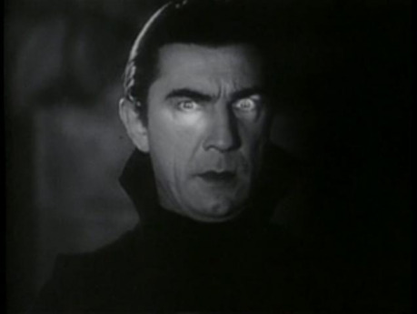
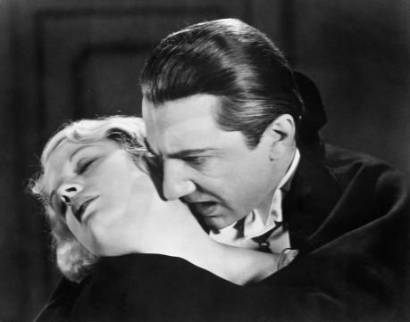
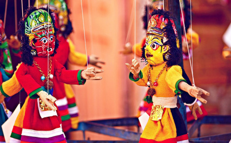

## Dílek třetí a kousek – Sdílení pravomoci interpretovat…

### Uzavřená a otevřená hra

V __otevřené hře__ všichni hráči sdílí informace o tom, co se děje, a tak mají všichni stejný přehled o tom, čeho lze jednotlivými akcemi dosáhnout. Pro hráče by tedy neměl být problém svěřit pravomoc popsat si své vítězství libovolnému hráči. V __uzavřené hře__ je to o něco složitější. Ve světě se mohou vyskytovat informace, které hráči neví a které mohou ovlivnit popis výsledku vyhodnocení v příběhu. Někdy je hráčům zřejmé, že tyto informace zatím nemají (např. výslech či prohledávání neznámé místnosti), a je tedy nasnadě, že i když jindy by měli plnou pravomoc vyprávět, tentokráte budou muset řešit situaci jinak:

- Pokud již daná informace existuje, pak se budou muset zeptat svého Vypravěče a ten jim chybějící informaci doplní.
- Pokud daná informace ještě neexistuje či je neúplná, pak může klidně Vypravěč ještě část interpretační pravomoci s hráčem sdílet – a doplnit sám jen kousek.

> Anežka a Bětka se rozhodly si zahrát fantastickou detektivku. Anežka je Vypravěčka a Bětka hraje postavu hraničářky Břislavy, která se vydala do starého mlýna vyšetřit záhadnou vraždu. Anežka si ve svém příběhu připravila zápletku, ve které mlýn přepadla banda lapků pod vedením loupežníka Lavoje. Když Břislava dorazila na místo, Bětka Anežce oznámila, že její postava se pokusí prohledat stopy v okolí chaty. Bětka o Lavojově bandě zatím nic neví, a proto nemůže případný výsledek úspěšného hodu na stopování popisovat úplně sama. Proto se po úspěšném hodu Anežky zeptá, co Břislava nalezla.

Pokud má Anežka již připravené složení celé tlupy, či dokonce v odehraném příběhu již zaznělo např. kolik má tlupa členů, potom Anežka sama odpoví na celou Bětčinu otázku. Popíše, kolik stop Břislava nalezla, a zmíní i nějaké další zvláštnosti, které ze stop vyplývají.

Pokud ale vše zatím není úplně jasné, Anežka se může přece jen s Bětkou o pravomoc vykládat výsledek podělit. Může jí třeba sdělit, že u domku byla pětičlenná tlupa (což je předem daná, ale doposud tajná informace), ale nechá Bětku samotnou dál doplnit, např. jak byli obutí, zda se kolem stop otiskly zbraně či zda byl někdo z tlupy raněn.

- Může se stát, že v takovém případě Bětka vloží do hry něco naprosto neočekávaného, např. prohlásí, že na místě našla hroty skřetích šípů. Jestliže Vypravěčka Anežka jednou přenechala pravomoc interpretace Bětce, už by měla informace, které Bětka vložila do příběhu, respektovat. Neznamená to ale, že by nutně musela zahodit celý připravený příběh. Možná bude stačit, když si od teď poznamená, že nejméně jeden člen Lavojovy bandy je skřet a lukostřelec.

Občas se ale stane, že přítomnost tajné či uzavřené informace ve hře není na první pohled zřejmá. Hráči mohou například chtít provést konkrétní akci, která je s ohledem na okolnosti nemožná. Kvůli __uzavřené hře__ to ale hráči zatím netuší. Předmětem neshody mezi hráči pak může být skutečnost, že hráč nedostane ve svém vyhodnocení to, co očekával, a neví proč.

> Anežka s Bětkou pokračují ve své hře a Břislava se konečně poprvé utká s Lavojem. Bětka (ani Břislava) ovšem netuší, že Lavoj je ve skutečnosti upír, běžnou zbraní nezranitelná bytost.

Pokud hráči používají __vyhodnocení úspěšnosti činnosti__, je řešení jednodušší. Vyhodnocení nám totiž dává informaci o kvalitě provedení a to je také podkladem k interpretaci. Jestliže ve hře vždy výsledky interpretuje Vypravěč, pak vůbec k problému nedojde a rovnou popíše, co se stalo, byť je to neočekávané. Jestliže si ve hře své výsledky popisují hráči, pak čas od času při konfrontaci s takovouto skrytou informací Vypravěč oznámí, že tentokrát musí způsob, jakým se výsledek zapsal do příběhu, popsat sám.

> Bětka se rozhodne, že střelí Lavoje lukem. Zachřestí kostky a výsledkem hodu je velmi dobrý zásah. Vypravěčka Anežka si vezme slovo a popíše Bětce, že přestože její výstřel byl naprosto přesný a běžného člověka by možná i skolil, Lavoj si ze zásahu šípem vůbec nic nedělá a vypadá, jako by ho zranění nebolelo a neoslabovalo.

Všimněme si, že i v tomto případě klidně může Vypravěč přece jen část pravomoci stále přenechat hráči – Anežka může třeba Bětku nechat popsat, kam se vlastně trefila, a teprve potom si vzít slovo.

Jak jsme si popsali výše, Bětka může být zklamaná z toho, že výsledek akce neodpovídá očekávání. Anežka se tomu v našem příkladu snaží předcházet následujícími kroky:

- Protože výstupem z vyhodnocení je kvalita provedené akce, zohledňuje tuto kvalitu ve svém popisu.
- Nedrží hráče ani postavu v nejistotě a nebere jí úspěch. Potvrzuje očekávaný výsledek a dává najevo, že do hry vstoupila nějaká dosud utajovaná okolnost.
- V případě, že nemůže hráče odměnit očekávaným mechanickým vítězstvím (např. počtem odečtených životů), alespoň mu poskytne odměnu v podobě získané informace.

Někteří hráči preferují, když mohou hru porazit svým intelektem – rádi luští připravené hádanky a lámou si hlavu nad na první pohled nevysvětlitelnými situacemi. Pro ně nejenže takováto situace obsahující rozpor mezi výsledkem vyhodnocení a popisem tohoto výsledku není zklamáním, ale naopak je vítaným herním prvkem, který dá hráči materiál k přemýšlení. Aby to tak opravdu fungovalo, musí ale Vypravěč opravdu hráče za jeho úspěchy odměňovat, nikoliv je hráči odepírat.

O něco složitější je, když hráči v __uzavřené hře__ používají __vyhodnocování naplnění záměru__. Hráč, který deklaruje, že chtěl dotyčného zranit, by se mohl cítit právem ošizen, že jeho záměr nebyl naplněn, ačkoliv v hodu uspěl.

- Jedno možné řešení je nabídnout hráči alternativu k jeho úspěchu (např. získání informace, že jeho záměr nebyl naplněn, protože cíl je nemrtvý, nebo že dobře mířená rána sice neznámého nezranila, ale odmrštila). Tento přístup je velmi podobný tomu, který jsme si uvedli u vyhodnocení úspěšnosti činnosti. Jeho výhodou je, že hra zůstává do posledního okamžiku uzavřená. Nevýhodou je, že hráč se i tak může cítit podveden – svůj záměr přece hlásil právě proto, aby byl v případě úspěchu naplněn.
- Druhým řešením je dopředu před hodem hráči oznámit, že jeho záměr pravděpodobně nejde naplnit, a požádat ho, aby jej přeformuloval. Výhodou tohoto přístupu je, že hráči zachovává jeho pravomoci popsat si výsledek a nehrozí zklamání. Nevýhodou tohoto přístupu je, že odkrývá některé informace předčasně, před vyhodnocením, a hra přestává být uzavřenou.
- Třetí variantou je nechat hráče naplnit jeho záměr, ale pozměnit popis toho, jakým způsobem hráč svého úspěchu dosáhl – v případě upíra tedy např. hráči nabídnout popis, ve kterém se rána zbraní sice mine účinkem, ale upír se při obraně dotkne růžence na hráčově hrudi a ten jej spálí. Tento přístup je vhodný hlavně pro silně příběhově orientované hry, kde tolik nezáleží na přesném použití té které dovednosti a pravidla spíše rozhodují o tom, kdo bude zrovna vyprávět dál. Výhodou je, že hráč nakonec dostane to, co chtěl. Nevýhodou je, že občas bývá obtížné vymyslet smysluplné zdůvodnění a může dojít i k tomu, že hráči budou mít pocit, že mechanicky používají úplně jiné dovednosti či vlastnosti, než popisují.

## Mohu popsat, jak reagují ostatní postavy?

Do obdobné kategorie jako rozhodnutí, zda hrát otevřeně či uzavřeně, patří i rozhodnutí, zda smí hráč, který má pravomoci interpretovat, popisovat reakce ostatních postav. Toto je obzvláště citlivé téma, kde se hráčské preference mohou velmi silně lišit. Zatímco někteří hráči investují do svých postav velké množství tvůrčí energie, či si s nimi dokonce budují osobní pouto, takže zásah do svobodné vůle své postavy pak považují za krajně nežádoucí, jiní hráči zase mohou přistupovat k postavám jako k loutkám a bavit se tím, jak jsou jejich avataři zmítáni osudem.

Řešení této situace je velmi podobné řešení situace s tajnými informacemi v uzavřené hře – ostatně to, jak bude ta která hráčská postava reagovat v určitých situacích, ví nejlépe pouze její hráč. Proto je vhodné opět se podělit o pravomoc interpretovat výsledek, tentokráte ale s hráčem, jehož postava je vyhodnocovanou akcí či konfliktem ovlivněna.

> V krátké potyčce upír Lavoj Břislavu přemůže a unese na svůj hrad. Tam se o ni však začne starat, dvořit se jí, přináší ji květiny, opíjí ji vínem, chová se jako pravý rytíř. Jednoho večera Anežka Bětce oznámí, že Lavoj chce Břislavu svést a následně hodí na kostkách úspěch.
>
> Přestože by bylo lákavé rovnou popsat, že Břislava upírovým svodům podlehla a zcela se mu oddala, Bětce by takové vyznění scény mohlo být nepříjemné. Proto Anežka raději Bětce jen oznámí, že upír byl ve své snaze úspěšný. Pro Bětku pak může být mnohem přijatelnější, když si scénu popíše tak, že Lavoj Břislavu vlastně omámil a ona mu podlehla proti své vůli.

Náš příklad se záměrně týká velmi kontroverzního tématu. Ve většině her totiž hráči velmi snadno přijmou důsledky pro svou postavu, pokud je cílem zastrašení či magie. Jakmile ale přijde na otázku, zda je možné si ve hře vynutit nějaké konkrétní jednání, sex či dokonce vznik vztahu mezi postavami jen s pomocí herní mechaniky a kostek, tak už se odpovědi velmi různí. Možná se Bětce v našem příkladu vůbec nechce hrát milostnou scénu. Nebo je její postava naprosto věrná svému milému a nikdy by jej nezradila. Případně žije v celibátu. Může Bětka výsledek takového hodu odmítnout? A pokud ano, nestane se naopak prohlášení „to by moje postava nikdy neudělala“ univerzální výmluvou, kdykoliv se hráči nebude líbit výsledek vyhodnocení?

Přimět postavu jednat proti vůli hráče totiž je pro hráče srovnatelné se smrtí postavy, ne-li horší. Protože hráč bude muset se šrámem, který jeho postava obdrží, hrát dál. Proto pokud už vaše hra přece jen dovoluje mechanicky odehrávat i sociální konflikty, je vhodné ty nejvážnější důsledky akcí, jako jsou zrady, sex či manipulace se vztahy, zařazovat do hry se stejnou vážností, rizikem a vědomím důsledků, s jakým se ve hře vyskytuje právě smrt hráčských postav.

Trochu jiné to je u bezejmenných cizích postav. U těch je naopak žádoucí, aby s nimi hráči ve hře mohli manipulovat a dosahovat tak svých cílů. Za poznámku ovšem stojí, že ač u bezejmenných cizích postav přebírání kontroly nad jejich reakcemi nikomu nemusí vadit, popisování reakcí významnějších cizích postav může být pro Vypravěče stejně závažný zásah do hry jako popisování reakcí hráčských postav. Vypravěč k nim může mít vytvořenou obdobnou citovou vazbu jako hráči ke svým postavám, případně může hrozit i prozrazení nebo rozbití části zápletky.

Závěrem tohoto dílu našeho článku se tentokrát nedobereme k žádnému univerzálnímu řešení, jak s vynucenými reakcemi postav jiných hráčů zacházet, protože žádné takové neexistuje. Různí hráči mají různé preference a také různé herní systémy dávají sociálním mechanikám různou vážnost. Přesto si dovolím nabídnout alespoň tři základní rady:

- Interpretace jednání cizích postav jsou velmi úzce spjaté s popisováním naplněných záměrů. Pokud je ve své hře nechcete, domluvte se klidně se spoluhráči na tom, že sociální konflikty či interakce se budou vždy odehrávat pouze jako vyhodnocení akcí, a to i tehdy, pokud jinde ve své hře záměry používáte. Popis reakce na takový úspěch potom můžete nechat na poraženém hráči.
- Pokud přece jen interpretace reakcí ostatních postav ve hře chcete, zamyslete se, kdykoliv se vám ve hře naskytne příležitost ovládat určité jednání postavy jiného hráče nebo si ho vynutit, chvíli nad tím, jak byste situaci vnímali, kdyby se role obrátily. A to nejen role postav, ale i role hráčů. Zejména při odehrávání citlivých témat, jakými jsou milostné vztahy, přátelství či naopak zrada, ať už na osobě, či principu.
- V neposlední řadě, i když se se spoluhráči domluvíte, že půjdete až na hranu a vzájemné zásahy do chování postav si dovolíte, vždy mějte po ruce záchrannou brzdu a dovolte hráči, o jehož postavu se jedná, aby měl poslední slovo. Možná, že herní mechanika určila, že zradí svého přítele. Možná, že jste jako vítězové konfliktu rozhodli, že ho k tomu přimělo kouzlo či přesvědčivý rozhovor. Ale nevnucujte takovému poraženému hráči svůj vlastní popis plný radosti a bujarého veselí – přece jen se jedná o jeho postavu a on bude nejlépe vědět, jakým způsobem se na ní taková zrada podepsala.
