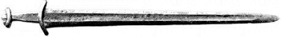
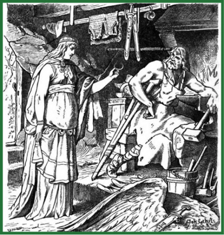
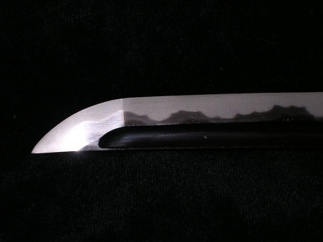
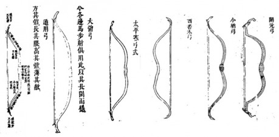
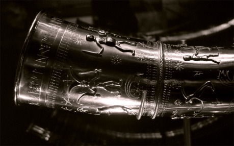

## Rekapitulace úvodem

Pravidla Dračího doupěte znají kromě základní tabulky zbraně vylepšené buď theurgií, nebo ukutím v žáru salamandřího ohně. Zatímco salamandří oheň vedl k prosté +1 k síle zbraně, theurgie krom dalšího posílení uměla staty zbraně až zdvojnásobit. Přestože tak mohly vzniknout skutečně mocné kousky, jako dlouhý luk 10 + 2, případně 11 + 2, pokud by měl kovové lučiště, které lze též vykovat u salamandra, byly výsledky spíš přesílené než zajímavé. Nakonec nelze zapomínat ani na artefakty, kdy theurg mohl za život vytvořit tři mistrovská díla mimořádných vlastností. Obecně dostupná theurgie této úrovně však znamená, že i její další projevy by měly být dosažitelné. To však vede k podobě světa, jehož uvěřitelnost či konzistence je na pováženou.

Proč by však nemohl nadprůměrné dílo vytvořit i prostý kovář? I mezi kováři jsou přeci značné rozdíly, jak ve specializaci, tak v dovednostech a zkušenostech. Zkrátka sekera od královského mistra zbrojíře je lepší (a to i „pravidlově“) než výrobek od vesnického kováře, který většinu času opravuje pluhy a dotáhl to jen na tovaryše. Stejně tak z jiných her a příběhů známe další způsoby očarování zbraní – runami, vsazováním kouzlených kamenů, požehnáním knězem, silami přírody a mnoha dalšími způsoby.

Je tedy mnoho způsobů, jak učinit zbraň silnější, proto je taky třeba dát pozor na to, jaké kombinace (tedy sčítání bonusů) připustíme, například v mých světech se prakticky nevyskytují démoni posilující parametry zbraní, ale k tomu více v příštím pokračování. Posílená zbraň je jistě výhoda v boji, ale mimořádně kvalitní zbraň má sama o sobě hodnotu menšího pokladu, a proto přitahuje pozornost mnoha očí a nenechavých rukou. Vlastnictví takové zbraně, které je třeba pořád dokola obhajovat ve střetech s lupiči, se pak snadno může stát spíše prokletím, a to zvlášť tehdy, když po zbrani zatouží třeba některý z místních mocipánů. Navíc pro mimořádnou zbraň je třeba zajistit mimořádný servis. Přestože „jen“ opravit ostří je jistě snazší než jej vykovat, zbraň může kvůli nedostatečně odborně provedené opravě ztratit dost ze své výjimečnosti.

Z mnoha výše zmíněných možností se v tomto článku budeme věnovat zlepšování zbraní skrze jejich konstrukci, tedy vylepšení nemagické povahy, a pak tomu, co dokáží nabídnout runy.

## Konstrukční vylepšení

Konstrukční vylepšení zbraní jsou obzvláště cenná proto, že zvyšují základní parametry zbraní, které pak lze třeba theurgickými technikami zdvojnásobit, ale je možné je kombinovat prakticky se všemi dalšími magickými způsoby vylepšení. Nemenší výhoda pak vyplývá z obvyklých pravidel Arény, kde (většinou) platí omezení na jeden magický předmět, případně jsou magické předměty vůbec zakázány. Pak snadno může být právě kvalita zbraně tím, co rozhodne o vítězství.

V silách vynikajícího kováře nebo jiného výrobce zbraní s přístupem k dostatečnému množství vhodného materiálu je vyrobit či ve výjimečných případech zlepšit již existující zbraň. Samozřejmě, ne každý kovář ovládá každou z dále uvedených technik a disponuje vším potřebným pro jejich aplikaci. Zejména překování již existujících zbraní může vyžadovat nástroje, suroviny nebo celé kovárny neméně výjimečné než samotná zbraň, jež má vzniknout.

### Infookénko: Aréna

Aréna je instituce více než pravděpodobná ve světech, kde se vyskytují davy ozbrojených a dobrodružstvím zocelených jedinců, kteří si s její pomocí vyplňují čas mezi jednotlivými akcemi kvalifikovanou a zábavnou formou tréninku. Nejčastěji spočívá v tom, že se spolu ve vyřazovacím systému zápasů (takový vidíme například na tenisových turnajích) utkávají dvojice soupeřů bojujících na plocho a s dalšími omezeními, která mají za cíl generovat napínavé, ale bezpečné zápasy. S arénou se samozřejmě pojí možnost sázení, což může být zdrojem zajímavé zápletky ve stylu Dicka Francise, v níž se bude odhalovat kdo a jak manipuluje s výsledky. V aréně se dají rovněž zjistit zajímavé informace, je možné vybudovat si reputaci pro získání zakázek či využít arénu k nalákání jinak nepolapitelného nepřítele. Odměnou za vítězství ve velké výroční aréně pak může být třeba poukázka na zbraň zhotovenou mistrovským kovářem na míru vítězi-budoucímu nositeli.

Existuje, přesněji řečeno autor ve svých světech rozlišuje, celkem pět technik, které mohou poskytnout bonus k síle zbraně jako tomu nejzákladnějšímu statistickému atributu:

1. Zbraň kovaná v žáru salamandřího ohně tak, jak ji znají i pravidla DrD .
1. Zbraň vytvořená na míru nositeli.
1. Zbraň využívající lepších konstrukčních řešení.
1. Mistrovský řemeslný výrobek.
1. Velmi kvalitní či mimořádné materiály.

První varianta je dána přímo pravidly Dračího doupěte, salamandr zvýší teplotu ve výhni a lépe vykované zbraně tak poskytnou svým nositelům lepší službu. Na rozdíl od textu pravidel však nepovažuji za nezbytné pro aplikaci této výhody zároveň do zbraně zaklínat útočného démona. Nicméně z povahy věci je to možné aplikovat pouze na zbraně kovové. Na druhou stranu z kovu může být i lučiště nebo samotná bojová hůl. Tato technika, tak jako ostatní (vyjma speciálních materiálů), zvyšuje sílu zbraně o jedna. Její cena bude dána dostupností salamandrů, které obvykle vyvolává kdo jiný než theurg, ale lze si představit i jejich přirozený výskyt (sopečné krátery, žhavé pouště, chrámy ohně). Pokud salamandr působí převážně svým vyšším žárem, měl by stejného efektu docílit i dračí dech nebo pomoc jiných stvoření ohně (fénix, ohnivec). Tyto bytosti samozřejmě musí chtít spolupracovat a své schopnosti uplatnit vhodným způsobem – zbrkle použitý dračí dech by meč moc nevylepšil, spíše by přivodil zkázu celé kovárně. Sehnat takového živočicha či zpracovanou ingredienci z něj může být zajímavým úkolem pro družinku na různých úrovních a také jistou možností, jak se dostat ke zbrani, na kterou by zatím postava finance neměla.

Dokonce i dva barbarští šermíři se stejnými numerickými parametry se liší výškou, délkou paží a preferovanými šermířskými figurami. Proto jeden z nich ocení o palec delší čepel, druhý zase preferuje mírně klenutou záštitu. Pokud s výrobcem zbraně spolupracuje nějaký mistr boje s tou kterou zbraní, může všechny tyto dílčí preference a specifika propojit ve zbrani vytvořené na míru, která se projeví o jedničku vyšší silou zbraně. Při výrobě zbraně „na míru“ nebo vůbec přímo na objednávku pro konkrétního nositele lze zažít spoustu pamětihodných momentů a vyplatí se tomu věnovat nějakou pozornost, zbraň pojmenovat či alespoň stručně naznačit její design. Postava na šestnácté a vyšší úrovni dokáže své požadavky definovat sama, méně zkušení jedinci potřebují pomoci a za tu pomoc je třeba zaplatit. Cenu pak ovlivní především to, zda jde o úpravu parametrů nově zhotovované zbraně (tady může stačit příplatek pár desítek zlatých) nebo předělávku již existující zbraně. U některých opravdu zajímavých kousků, takřka relikvií, to nemusí být za běžných podmínek ani možné, každopádně to bude hodně drahé a vyžádá si to nejen mistra kováře, ale i dobře vybavenou kovárnu. Pokud by se někomu zdál bonus +1 příliš silný, lze jej nahradit zvýšením maximální možné přesnosti s touto zbraní o jedna.

Přijít s něčím lepším u chladných zbraní není tak časté jako u soudobé techniky, ale rozhodně to není nemožné. Zvláště proto, že i drobná změna se může projevit v hodnocení zbraně, třeba proto, že soupeři jsou zvyklí na široké meče určitých tvarů a rozměrů. Nejsnazší cesta, jak získat nějakou takovou technologii, je zmocnit se zbraně, na niž již byla aplikována. Tu lze například vydobýt na nepřátelích či ji vyhrát na tajemném cizinci z daleka nebo třeba najít v hrobce prastarých. Nositelem žádané informace může být i zbraň poškozená, v některých případech postačí i jen obrázek nebo detailní popis zbraně. Lepší konstrukční prvek pak může být zajímavou odměnou za poražení mocného nepřítele, kdy bude uvěřitelnější, že nepřítel bojuje zbraní sobě blízkou než kusem zrovna, jistě náhodou, vhodným pro někoho z družinky. Příkladem z reálného světa mohou být damascénské čepele proslulé nejen svým úchvatným vzhledem, ale i neobyčejnou ostrostí a výdrží. Po jejich tajemství toužili křižáci mnoho dlouhých let. Alternativně je možné prostý bonus +1 nahradit dočasnou (než se úprava stane známou) výhodou proti soupeřům užívajícím zbraně, takový bonus by pak ale mohl být i vyšší. Též je možné díky těmto poznatkům vyrobit zbraň, která bude zvláště vhodná proti vybrané skupině zbraní (např. jednoruční meče +3 SZ), ale proti všem ostatním bude slabší (−1 SZ).

Mistrovská práce snad mluví sama za sebe. Žádná zbraň by asi dlouho neobstála, kdyby byla vyrobena mizerně, neb námaha boje je důkladnou prověrkou, ale přeci jen mezi zbraní vyhotovenou průměrně a prvotřídně je docela rozdíl, byť se zdá, že v detailech. Už vědomí toho, že postava třímá ve svých dlaních mimořádně dobrý výrobek, může posílit její výkon v boji. Samozřejmě, za takovou zbraň si kovář zaslouží trochu lepší peníze, takže zbraň bude o nějakou tu zlatku dražší (a spíš o víc), protože zlepšení o jedničku vyžaduje opravdu hodně práce té nejvyšší kvality, nicméně v boji nejde o nic menšího než o život, takže za co jiného by měli hrdinové utratit své poklady?

Poslední v seznamu (ale určitě nikoliv významem) jsou nejrůznější materiály. V řadě světů se vyskytují zvláštní suroviny, především kovy, které mohou samy o sobě přinést lepší vlastnosti různým věcem, tedy i zbraním. Neméně významným přínosem je navýšení možného vylepšení pomocí všelijakých magických praktik. Zvláštní materiály mohou být řešeny různě, uveďme příklad prosté oceli odlišené podle místa kalení (urzemská ocel), barvy (černá ocel) či původce (trpasličí či elfí ocel). Ve Středozemi to byl proslulý mitril, pravostříbro, ve světě Forgotten Realms je to třeba adamantium nebo drowí ocel, která se na Povrchu rozpadá. Ostatně adamantium a mitril se vyskytují v mnoha inkarnacích, včetně třeba populární filmové série X-men. Ze světa WoW je potom vzácných rud známo přehršel – včetně dvojí inkarnace již zmíněného mitrilu – těch kovů je tolik, že si z nich lze vybrat pro inspiraci ty, které se vám líbí, jen pozor na ne zcela vhodné užívání názvů reálně existujících kovů (například Cobalt nebo Titan či ze série Elder Scrolls ebonit a sopečné sklo – obsidián).

### Infookénko: Ztráta akce

Runa zlodějka akcí – tato runa reaguje na neoficiální, leč podle mne velmi vhodné pravidlo pro ztrátu akce při silných zásazích. Jedná se o past na odolnost, kde velikost pasti je rovna životům ubraným jediným úderem (či třeba jediným kouzlem) sníženým o 10. Je-li past podhozena o více než 10, přichází zasažený o další akci za každou celou desítku. Např. Při útoku za 18 životů si zasažený hází proti pasti 8, hodil 4 a bonus za odolnost má +2, výsledek je 6, což je méně než 8 a zasažený přichází o jednu akci. Když je zasažený černým bleskem za 47 životů, čelí pasti 37, hod 8 s bonusem za odolnost činí 11, past je podhozena o 26 a zasažený přichází o 3 akce.

Podobně inspirativní je pak svět Might and Magic, kde lze nalézt krom běžného železa taky rudu phyltovou, siertalovou, kergarovou, erudinovou a staltovou. Jejich množství pak automaticky nabízí otázku, zda jsou všechny stejně kvalitní nebo nikoliv. Ze systému tohoto světa pak lze extrapolovat, že phylt je jen o trochu lepší než běžné kroky a jeho použití tak usnadní dosažení bonusů jinými způsoby nebo zvýší například počet run, které lze na zbraň aplikovat. Siertalová ocel je dobrá jak na výrobu zbrojí, tak zbraní, sama o sobě dodá +1 k síle zbraně, případně kvalitě zbroje. Kergar a erudine jsou zhruba stejně dobré, namodralý kergar je však odolnější, houževnatější, takže obvykle se používá na zbroje, jimž přidá +2 KZ, ale i na zbraně drtivé, kdežto erudine je i přes své nafialovělé zbarvení nejlepší na čepele a ostří (+2 SZ). Obě rudy pak samozřejmě „udrží“ větší množství očarování. V tom se však nemohou rovnat zdaleka nejvzácnější staltové rudě, její bonus +3 není tak podstatný jako schopnost očarování nejen přijímat, ale i zesilovat. Samozřejmě prémiové materiály stojí patřičné částky zlatých a staltová ruda je velevzácná surovina, běžně nedostupná. I pro středně pokročilou družinku tak bude nelehkou výzvou sehnat dostatečné množství staltu na výrobu byť jediné dýky.

Pokud jde o útočnost, platí výše uvedené víceméně podobně, jen je třeba přihlédnout ke konkrétním případům. Sečné a bodné zbraně lze udělat útočnější tím, že budou nadprůměrně ostré, což je ovšem vlastnost, která jen stěží souvisí s tím, zda je zbraň udělaná na míru konkrétního uživatele. Naopak nadprůměrně silný kroll může mít jistě vyšší útočnost díky tomu, že přiměřeně jeho postavě udělají těžší kyj, na druhou stranu v tom se těžko uplatní nějaké nové či lepší techniky. Lze ještě doplnit, že je o trochu snazší (rozuměj levnější) zlepšovat záporné útočnosti směrem k nule než zvyšovat kladné hodnoty.

Nejinak je tomu s obranou zbraně, u hole si lze představit, že kvalitnější, pevnější dřevo umožní efektivněji se touto holí chránit, neboť ji zbraň nepřítele nepřesekne. Ale třeba u mečů se obrana zbraně spíše zvýší novými technikami – jinak tvarovanou záštitou či zvláštní úpravou čepele. Celkově kvalitnější zbraň vydrží déle, i když je používána k obraně. Nicméně nelze než poznamenat, že nejlepší obranou zbraně je její schopnost útoku.

### Infookénko: Unacella

Při útoku na Akademii mladý talentovaný mág, z jehož jména se dochovaly jen iniciály P. S., s pomocí mistry Petronelly odvrátil smrtící kletbu, ovšem jen za cenu toho, že byl, mimochodem zcela nahý, odmrštěn mezi světy na holou pustou skálu kdesi v moři. Jeho magie stačila tak tak na to, aby na nehostinném místě přežil. To však jeho ambicióznímu mládí nestačilo. Na zvrácení své situace však potřeboval našetřit více magů a jediná možnost, jak toho dosáhnout, bylo opatřit si hůl. Na skále se však nenacházela žádná rostlina, ani ta nejmenší. Bez rostliny, která by dodala svůj stonek, nemělo být možné hůl vyrobit. P. S. však tušil či možná jen doufal, že ve vodě budou nějaké řasy, i když je neviděl. Proto náhodně nabral do dlaně vodu a začal zaklínat. Několikrát neuspěl, ale to jej neodradilo, ani když kvůli každému neúspěšnému pokusu trpěl hladem a zimou. Nakonec se úspěch dostavil a jakýsi organismus zahájil svou transformaci v magickou hůl, než ta však dorostla do použitelné velikosti, musel ji krmit vlastní krví. Na otázku, zda P. S. uspěl ve své pomstě, hůl sama sebe nazývající Unacella neodpovídá. Ví se však, že po smrti svého nositele se sama přemístí mezi světy. Unacella vypadá jako vyschlý tenký proutek tmavohnědého dřeva, který vyplavilo moře. Díky svému zvláštnímu původu může opakovaně sloužit různým mágům nebo jinak magicky nadaným osobám a leccos si pamatuje, méně však již prozradí. Její základní parametry jsou vcelku obyčejné (SZ 4, útočnost 0, obrana zbraně 0, dosah 1–2), ale je-li svým nositelem krmena krví nepřátel a užívána se ctí, roste její síla a obnovují se původní schopnosti – mění velikost a tvar a je svému nositeli oporou řadou dalších způsobů. Aby uplatnila své zvláštní vlastnosti, musí být v držení magicky nadaného jedince – kouzelníka nebo druida (nemůže být chodeckou zbraní). Od počátku se umí složit v ozdobný prvek na ruku, za vysátou krev se pak postupně zlepšuje. Krev může pocházet ze zraněných tělesných nepřátel nebo může být poskytnuta nositelem dobrovolně. Postup zlepšování je uveden v následující tabulce:

Pak zbývají ještě dva číselné parametry, o jejichž modifikaci by šlo uvažovat. Prvním z nich je dosah zbraně, kde ovšem jeho změna v konstrukčním řešení vede, alespoň u zbraní pro boj tváří v tvář, nejspíš ke vzniku nového druhu zbraně. U střelných zbraní je možné si představit zvýšení všech tří druhů dosahů všemi případnými uvedenými technikami. Naopak rychlost zbraně, možná nejdůležitější atribut vůbec, je sice možné zvýšit, ale vyžaduje to spojení všech dostupných technik a metod – dostatečně kvalitní materiály, mistra kováře, znalost toho, komu je zbraň určena, a možná především znalost postupu, kterým toho lze u dané zbraně dosáhnout. Je to samozřejmě mimořádně drahé vylepšení, byť i zde lze konstatovat, že snížení postihu za těžkou obouruční zbraň je o něco málo snazší než vytvoření nového bonusu. Nezřídka je pak ke skutečnému využití takového vylepšení potřeba absolvovat i výcvik či alespoň nabrat zkušenosti s jejím užíváním.

## Runy

Runy patří mezi nejtradičnější metody magického posilování zbraní, přičemž lze odhadnout, že inspirací byla severská tradice vypisovat na zbraně jejich jména a dedikace bohům. Jak může vypadat taková výroba runy, předvádí například Bruenor při výrobě Aegisova tesáku pro svého adoptivního syna Wulfgara (v trilogii z Planiny ledového větru, součást ságy o Drizz­tovi od R. A. Salvatora). Vzhledem k tomu, že vytepané symboly se vyplňují (nebo mohou vyplňovat) směsí látek obsahujících mimo jiné prach z drahých kamenů, ektoplazmu a další vzácné ingredience, nejedná se ani v případě run o levnou záležitost.

Runu lze aplikovat na takovou zbraň, která tuto aplikaci vydrží, tedy je alespoň průměrná z hlediska kvality a opotřebení. Výhodou runy je, že poté, co je zhotovena, není náročná na nic dalšího. Je trvanlivá a od druhé úrovně chrání zbraň proti běžnému opotřebení, tak jako jiné formy magie (vyjma hvězdných kamenů). Obvykle mají runy pět úrovní, stupňů síly, a pokud je runotepec ovládá, nic nebrání tomu si rovnou zaplatit třeba právě pátou úroveň. Je však otázkou, zda se vyplatí runu za skoro třicet tisíc zlatých instalovat na obyčejnější zbraně, a nelze vyloučit, že zbraň, která bude dost dobrá pro runu druhé úrovně, nepojme runu úrovně páté. Úroveň runy lze postupně opakovaně navyšovat. Nelze však runu po dokončení (aktivaci) změnit. Pokud runa ztratí svou sílu (například opakovaným střetáváním se s obrannou magií), nelze na zbraň vytepat jinou runu.

Runa je samozřejmě nepřenositelná, ale schopný runotepec ovládající druh runy (tzn. umí vytepat alespoň první úroveň dotyčného druhu runy) může opsat runu vyšší úrovně. Na zbrani zpravidla může být jen jedna jediná runa, více runami mohou být opatřeny jen mimořádné zbraně vyrobené ze zvláštních materiálů nebo je možné vyššího počtu run na jedné zbrani dosáhnout s pomocí technik, které to umožňují (legování oceli drahými kovy a promagickými substancemi). I tak více než tři runy pojmou jen zbraně z kategorie artefaktů, vyrobené z těch nejvhodnějších a tedy nejspíš i nejvzácnějších surovin. Runy nemají vlastní vědomí a s výjimkou run určených k ochraně, což je podle některých zdrojů původní účel runové magie, slouží bez ohledu na osobnost nositele.

Přehled run nejčastěji používaných na zbraních je uveden v tabulce, včetně jejich výchozí ceny. Ne každý runotepec musí umět všechny runy a páté úrovně ovládá jen zlomek těch nejlepších.

Na pomezí mezi konstrukcí zbraní a runovou magií je záhadná technika runovlnek, ale tou se spolu s dalšími metodami – theurgií, hvězdnými kameny, nekromantskými, šamanskými, kněžskými praktikami, parciálním přístupem a možná ještě něčím dalším – budeme zabývat až někdy příště.

---

|10&nbsp;žt&nbsp;&nbsp;&nbsp;&nbsp; | 10 | +1 k SZ
|20 | 30 | +1 k OZ
|30 | 60 | +1 k út
|40 | 100 | +1 k Ini
|50 | 150 | Léčí nositele jako runa léčení 5. úrovně
|60 | 210 | +1 k SZ
|70 | 280 | +1 k OZ
|80 | 360 | +1 k út
|90 | 450 | +1 k Ini
|100 | 550 | Odzbrojování – látkou à la kopřivy, jen na tělesné tvory (buď past, nebo magy)
|110 | 660 | +1 k SZ
|120 | 780 | +1 k OZ
|130 | 910 | +1 k út (hodnota více než +3 není možná)
|140 | 1050 | +1 k Ini (max. 1/3 úrovně nositele)
|150 | 1200 | Spoutání – blokuje kouzlení a další schopnosti cíle
|160 | 1360 | +1 k SZ
|170 | 1530 | +1 k OZ
|180 | 1710 | +1 Ini (nezlepší se více, dokud nositel nedosáhne 12. úrovně)
|190 | 1900 | Dovednost je třeba hůl naučit, musí se jí líbit
|200 | 2100&nbsp;&nbsp;&nbsp;&nbsp;&nbsp; | +1 k SZ
