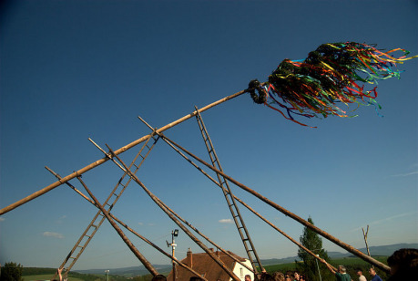

Víska Malyhor leží v podhůří vysokých hor. Je obklopená zalesněnými kopci, rozprostírá se na dně údolí poblíž nevelké říčky, která však umí na jaře pěkně zabouřit. Obyvatelé se zde živí jako dřevorubci, pastýři, brtníci nebo uhlíři. Kolem vsi je pár kamenitých políček, na kterých pěstují pohanku a len. Obývají nízká ubohá stavení, polozemnice z kamení a proutí obaleného jílem, bez oken a komínů, jen s dírami ve střechách. Z jednotvárnosti náročného údělu je vytrhne několik málo svátků v roce, kdy je možné se zaradovat a připomenout si, že bohové myslí i na tento kout světa. Jedním z nich je první letní úplněk v roce. Letos připadající shodou okolností přímo na den letního slunovratu. V tento čas obvykle dorazí některý z potulných kněží, kteří se do tohoto kraje stáhli před pronásledováním ze strany chrámových hodnostářů, jejichž moc se upevňuje čím dál tím víc. Jeho prací je požehnat úrodě, vyčistit posvátnou studánku, oběťmi udobřit duchy lesa a z vnitřností zabitého kohouta věštit, co lid po zbytek roku čeká.

## Pověst o obřím kameni

Ústředním motivem dobrodružství je následující pověst o obřím kameni:

> Jednou se nad horami strhla ukrutná bouře, která trvala několik dní. Hromy a blesky létaly na všechny strany a déšť málem vylil říčku z koryta. To se totiž obři hádali, jak si rozdělí poklad, který se jim právě podařilo ukrást trpaslíkům. Nakonec jeden z nich využil toho, že ostatní nedávají pozor, popadl vak s pokladem a dal se na útěk do údolí. Když si toho konečně ostatní všimli, strašlivě zařvali a horem pádem utíkali za ním. Zloděj mezitím seběhl do Podhůří a hledal, kde by se s pokladem schoval. Vylezl právě až na Obří kopec a uviděl, že ostatní jsou mu v patách a s nimi i bouře, kterou přivolali. Protože obři se umí proměňovat na kámen a číhat v podobě skál na pocestné, rozhodl se zloděj, že se posadí na kopec a promění se na skálu, aby ho ostatní nepoznali. A tak se také stalo. Obři přišli po jeho stopách, ale kromě vysokého balvanu na vrcholu kopce nenašli nic. Zloděj totiž napřed truhlu s pokladem zakopal a před zkameněním se na to místo posadil. A tak obři s další salvou blesků a hromů odtáhli pryč. Jenže zlodějíček se mezitím tak moc bál, že ho ostatní obři najdou, že se strachy scvrknul tak, že nebyl větší než obyčejný skřítek. A od té doby na tom místě žije obr ze strachu proměněný v raracha. Ve dne dlí v duté skále ze svého bývalého těla a v noci vylézá ven a pečuje o záhony se zlatými borůvkami. Tomu, kdo by ho dokázal proměnit zpátky na obra, dá celý poklad, který je zakopaný pod skálou. A pokud by chtěl někdo ochutnat borůvky z jeho zahrádky, ať počítá s tím, že se mu zle povede.

## Slavnost

Dobrodružství nechť začne během slavnosti prvního letního úplňku. Oslavy vesničané započnou po obědě, kdy se na návsi sejde průvod tvořený hochy a dívkami. Dívky nesou vpředu ze zelených ratolestí spleteného panáka, oblečeného do ženských šatů, se kterým obchází jednotlivé chalupy, vnáší ho dovnitř, aby jeho prostřednictvím potulný kněz požehnal domácnostem a přinesl rodinám zdraví. Jedná se o bohyni Porutu. Dívky mají na hlavách věnce a ty se snaží tajně ukrýt do domu chlapce, na kterého si myslí.

Hoši jdou svlečení do půli těla, oblečení jen ve žlutých vlněných kalhotách s černým vyšívaným vzorem. Na ramenou nesou borovou májku. Když průvod obejde ves, vrátí se zpátky na náves se starou lípou. Tam je již vykopaná díra, do které se májka při vztyčení usadí.

Pak kněz pod májem provede oběti a věštby a po nich začne zábava. Na druhý, nízký máj se zavěsí ovčí kůže a v ní zabalená láhev borovičky a věnec klobás. Jsou právě v takové výšce, aby nebylo možné na ně vyskočit, ale ne výš. Starší obce vybere tři nejmladší pastýře ze vsi, kteří budou mít za úkol ubránit ovci před vlky. Jejich úkolem bude hlídat ovčí kůži před kýmkoli, kdo by ji chtěl ukrást. Pokud někoho přistihnou a podaří se jim ho zastavit, mají právo vsadit ho do dřevěné klece a vystavit veřejně ostatním obyvatelům k posměchu. Naopak, pokud budou pastýři neúspěšní, stanou se terčem vtipů oni. Je proto výzvou pro veškerou ostatní chasu nejen kůži ukrást, ale udělat to tak, aby se na to ještě dlouho vzpomínalo.

Dále už oslava probíhá tak, jak by se dalo čekat. Zpívá se a hraje na gusle a píšťaly, tančí se, děvčata se prohání dokola, děti běhají všude kolem a výskají, chlapi pijí jako o závod, ženské spřádají pomluvy, babky vzpomínají na mládí a dědci přemýšlí, jak zmizet, aby se mohli věnovat oblíbené hazardní hře. Během slavnosti se mohou postavy věnovat například následujícím činnostem:

__Přetlačování__ – Na zemi je vyrytý kruh. Do něj se postaví dva soupeři, zaklesnou se do sebe za ramena a snaží se jeden druhého vytlačit. Zábava spíš pro chlapy, většina holek by byla radši, kdyby si s nimi někdo zatancoval. Kdo prohraje, zve na kořalku.

__Věnečky__ – Ne každé z dívek se podaří nenápadně zanechat věneček v domě svého milého. Buďto byly málo šikovné, anebo jsou prostě nezadané a ještě se pro žádného nerozhodly. Ideální příležitost pro toho, kdo má zájem o věneček zabojovat. Je však třeba jednat rychle. Největší šanci má samozřejmě nejlepší tanečník, protože jedině u tance se vám podaří dívku odlákat z hloučku ostatních a získat možnost si s ní nerušeně popovídat. Nenápadný pohled do tváře matky, která svou dceru bedlivě celý večer z lavice sleduje, pak prozradí, zda máte nárok na to být vyvoleným anebo je lepší dát ruce pryč, protože rodiče by vaší lásce moc nepřáli.

__Kráska__ – Nejhezčí dívka vesnice, Stázina, to je ovšem výzva. Je trochu domýšlivá, přezíravá a má své rozmary. Zrovna jako teď. Dnes je ale přítulná. Při tanci prozradí, že chce náhrdelník ze zlatých borůvek, co rostou na Obřím vrchu.

__Fazole__ – Pár chlapů a dědků už mělo dost hlučné zábavy a nenápadně se vytratili bokem mezi chalupy, aby se věnovali své oblíbené hazardní hře – Fazolím. Ve středu půlkružnice s poloměrem desetikroků je malý důlek. Hráči postupně hází fazole do důlku. Kdo se trefí doprostřed, bere všechny fazole, co jsou na zemi. Kdo má po třech kolech nejvíc fazolí, vyhrává a dostane od každého haléř. Kdyby je tu ale načapaly ženské! Hned by je odtáhly k muzice a museli by je vzít do kola. Během hry dědci stočí řeč na pověst o obrovi. Jeden z nich slyšel, že ve městě žije jakýsi učený doktor, který by prý dobře zaplatil, pokud by mu někdo donesl šťávu z těch zlatých borůvek, co je opatruje rarach v hoře. Potíž je v tom, že ty borůvky prý během této jediné noci ve svitu úplňku vykvetou, urodí plody a ty do rána dozrají, takže je skřet před úsvitem sklidí a zavře se zase do skály. A koho by nachytal ve své zahrádce, toho prý promění v kámen.

__Krádež ovce__ – samozřejmě „největší“ výzvou dne je ukradení ovčí kůže zavěšené na májce. Ovčáci kolem ní ale krouží jako vosy před bouřkou a odlákat je nebude snadné. Navíc mají v rukou dřevěné čagany a pro ránu, která zjedná respekt, nepůjdou daleko. Navíc jsou sehraní z nočního hlídání ovcí a budou používat různé finty. Zatímco Janek sedí pod májkou a předstírá spánek, ostatní stojí opodál a jakoby si ničeho nevšímají. Jenže jak se někdo začne šplhat na májku, Janek vyskočí, chytne dotyčného za nohu a pískne na ostatní, aby mu přišli na pomoc.

__Veršovánky__ – Jak se setmí, přichází část večera, kdy se může projevit ostrovtip každého z dědiny. Kapela utichne, předstupují před ni jednotliví hoši a předříkávají vtipné, leckdy i přisprostlé říkanky s nápěvem na motivy toho, co se za poslední dobu ve vesnici a jejím okolí odehrálo. Po dozpívání kapela přehraje melodii a zpěvák tančí a vyskakuje do vzduchu. Ostatní obyvatelé bedlivě poslouchají a nejlepšího odmění bouřlivým smíchem, potleskem a uznáním. Pokud to samozřejmě nepřepískne a svojí rýmovačkou někoho příliš neurazí. Pak by mohla nastat klidně i menší bitka. Nechte někoho z obyvatel zarecitovat následující básničku: _Jacek, Francek, když byla tma, vydali sa na kameň, jak tam na nich húkla sova, vyběhli hned z lesa ven._ Ta popisuje loňskou výpravu dvou chasníků na Obří vrch, která však skončila už po pár krocích lesem.

Tak a nyní už by mělo být postavám naprosto jasné, co se po nich chce, a měly by mít i motivaci, proč to udělat. Pokud se k výpravě do lesa nemají, je možné předložit ještě jednu poslední vějičku.

Opilý dědek, jehož žena se před několika lety ztratila v lese, se připotácí k některé z postav. Manželka ho tehdy donutila, aby šli hledat poklad, protože toužila po bohatství. Našli zahrádku se zlatými borůvkami a potkali tam malého skřeta. Bába mu mazala med kolem huby a hlavně vykládala, jak jsou s dědkem chudí a jaký vedou nuzný život. Pořád se ho vyptávala na poklad, který tam měli obři nechat. Skřet jim však řekl, že je to zlým kouzlem zakleté zlato. Rarachovi se jich nakonec zželelo a každému daroval jednu borůvku na přilepšenou. Řekl jim, že šťáva z ní je léčivá. Jenže stará Maruna měla spadeno na zlato a pořád na skřeta dotírala, až se dopálil a řekl, že jí ho teda ukáže. Skála se rozestoupila a v měsíčním světle se něco zalesklo ve vzniklé průrvě. Hloupá ženská do jeskyně vlezla a skála se za ní zavřela. Dědka pak nechal skřet jít, ale řekl mu, ať už se na vrch víckrát žádný zloděj neopováží a ať raději nikomu nevykládá, že tam kdy byl. „Radši jsem všem řekl, že šla ráno do lesa a už se nevrátila. Bylo to tak pro mě lepší, aspoň jsem se té fúrie zbavil.“ Dědek proto nakonec postavy varuje, aby na Obří vrch nechodily. Pokud se ho postavy zeptají, co udělal s borůvkou, řekne jim, že ji snědl, když se pak jednou ztratil v noci v lese po cestě z města.

## Cesta lesem

> Lepší bude vytratit se ale z vesnice nepozorovaně. Co kdyby se někdo ptal, kam se to v noci vydáváme? Takže nenápadně zmizet za chalupou, proplížit se kolem kurníku a plotu. Počkat, až začne muzika hrá,t a sadem proběhnout k potoku. Přeskočit po kamenech a už jsme v lese.

Postavy se mohou rozhodnout, že odejdou ze vsi nenápadně. Vytracení se z vesnice by mělo být pro postavy zkouškou. V případě neúspěchu si někdo všimne, že se pokusili odejít, dovtípí se, co se děje, a na postavy si počíhá. To stejné se může stát, pokud postavy dají veřejně najevo, kam jdou. Alkoholem posilnění hejsci se rádi zmocní cizího výdělku.

> Měsíční světlo proniká na mýtiny a světliny, ale v bučině je jinak tma jako v pytli. Zprvu se dá jít po stezce, která vede na pastvinu, jenže ta se stáčí brzo na severovýchod, zatímco Obří vrch je na severozápad.

Postavy se můžou vydat oklikou přes pastvinu, odkud se dá také na Obří vrch dostat, ale může je to stát dost času. Záleží na jejich rozhodnutí. Cesta lesem bude velmi náročná činnost a její absolvování bude stát postavy dva zdroje z těla. Cesta po pastýřské stezce pouze jeden zdroj těla. Ohrožení nastav postavám na hodnotu 3.

> V lese se ozývají všelijaké zvuky, které mohou postavy postrašit – dupání ježka, houkání sovy, štěkání srnců – to všechno přiživuje pověsti o lešijovi, harpyjích nebo ohnivých psech.

Během cesty lesem působí na postavy akce prostředí – zastrašování – která jim dále zvedá ohrožení.

> „Hej!“ ozvalo se šeptem za zády. „Můžeš mi říct, kde teď jsme?“

Postavy se plouží tmavým lesem, a pokud nejdou po pastýřské stezce, hrozí, že se ztratí. Proto by pro ně mělo být zkouškou, zda se dokáží zorientovat a jít rovnou na Obří vrch. V případě neúspěchu dorazí na pastvinu. Vyčerpání je možné odehrát jako delší bloudění, které je připraví o čas a na Obří vrch dorazí až po půlnoci. Pokud chceš být drsný PH, zvaž opakování hodu na odolávání strašidelným zvukům lesa.

## Pastvina

> Šlapete travou a proplétáte se mezi kapradím a ostružinami. Už byste měli být u Obřího vrchu. I když vám nepřipadá, že byste vyšli až tak vysoko. Ale co to!? Louka? A slyším správně pískání na píšťalku? A nějaké holky se tam smějí…

Na pastvině stojí salaš. Všichni pastýři až na jednoho šli do vesnice na slavnost. Starý Barděj vždycky zůstává na pastvině a na svátek prvního letního úplňku nikdy do vsi nechodí. A teď postavy uvidí proč. Přichází za ním v noci lesní víly a tráví s ním při měsíčku noc plnou kratochvil. Tančí na jeho pískání ve svitu měsíce a vyzvídají od něj, co se děje ve světě lidí. Ovčáci mají na salaši smečku velkých psů, kteří jsou přítomností víl ukolébaní k polospánku, ale jakmile se postavy přiblíží k salaši nebo k ovčákovi na vzdálenost, co by kamenem dohodil, začnou se probouzet a štěkat.

Pokud postavy rej víl přeruší, ty se rozprchnou do lesa. Družina však může celou věc pozorovat ve skrytu a kochat se pohledem na něžné lesní panny (zkouška na ukrývání). V rozhovoru mohou zaslechnout, že letos nemůžou víly ovčáka pořádně pohostit, protože rarach z hory ukradl vílám nějaký džbán, do kterého sbíraly lesní rosu k pití.

## Pod Obřím vrchem

> Vyšplhali po prudkém svahu až pod temeno Obřího vrchu. Stojíte na kraji lesa. Před vámi se k nebi tyčí černá skála osvětlená paprsky měsíce, který je teď na obloze nejvýš. Do vašich lehce propocených halen se zakousl chladný vítr, který tady na kopci vane. Pod skálou je kamenné pole tvořené velkými odloučenými balvany, které bude třeba přejít, abyste se dostali až na vrchol. Šplhání v krpcích¹ po nich není vůbec příjemné. Hrany balvanů přes tenkou podrážku tlačí do chodidel, nohy kloužou.

{:.sidebar}
¹ Jedná se o šitou koženou obuv. Součást lidových krojů. Viz [heslo na Wikipedii](https://cs.wikipedia.org/wiki/Krpce).

Šplhání po balvanech bude další činnost, u které postavám hrozí zranění – naražená kolena, vymknuté kotníky, které uvízly ve spárách mezi kameny. Překonání kamenného pole bude pro postavy zkouškou.

Je samozřejmě možné přes kamenné pole nejít a zkusit najít lepší cestu. Buď zadem po severním svahu kolem pramene, anebo lesem pod rarachovou zahrádkou. V tom případě se postavy nejspíše vyhnou setkání s výrem.

V opačném případě se zeptejte hráčů, zda se jejich postavy snaží pohybovat potichu. A pokud ano, nechte je podstoupit střet se sovou schovanou ve skalách, zda je uslyší. Použitá dovednost bude nejspíše lovecká dovednost Přežití v divočině.

> V tom se ze skály zvedne jakýsi stín, roztáhne křídla, neslyšně nad vámi zakrouží a usadí se na velikou jedli poblíž. Temná silueta se rýsuje proti měsícem rozjasněnému nebi. Ozve se zlověstné zahoukání. Vzpomínáte na historku, jak se tehdy ve vsi objevil sokolník, který se chtěl vydat do skal pro výří vajíčka a vrátil se s obličejem rozdrásaným od jejich pařátů a zobáků?

Pokud postavy přijdou až přímo ke skále k místu označenému jako hnízdiště výrů, výr se z jedle zvedne a na postavy zaútočí ve snaze je odehnat. Protože je sova v letu tichá, nech postavy hodit na výzvu, zda si útoku všimnou. Sova nalétne ze shora se zlověstným syčením na někoho z družiny a pokusí se ho klovnout zobákem nebo mu zatnout pařáty do obličeje. Pokud se bude družina bránit či snad začne po sově střílet, ta raději odletí směrem k rarachově zahrádce.

Případně je možné do boje zapojit výrů více.

## Rarachova zahrádka

> Na západním svahu kamenné pole ustupuje. Les tu dorůstá skoro až ke skále a před ní leží menší plošina, ze všech stran obrostlá ostružiním a maliním. Ve skále je tmavá zející průrva, široká tak akorát pro jednoho člověka. Vidíte kamennou zídku, kolem ní pár úzkých balvanů velikosti lidské postavy, náhodně rozesetých kolem dokola, vztyčených nebo povalených na zem bez ladu a skladu. Za zídkou je navršená homole hlíny a kamení, porostlá borůvčím a jeřabinami. V borůvčí se něco zlatě leskne.

Dalším krokem družiny bude nejspíše prohledávání skal a hledání rarachovy zahrádky, která se nachází na západním úbočí. Je potřeba se k ní prodrat skrze ostružiní a maliní, a tak zkuste popsat postavám, jak se po trmácení do kopce musí ještě potýkat s trny a šlahouny. Skoro to vypadá, jako by je tam někdo nastražil schválně. Cesta to bude náročná a bude stát postavy jeden tělesný zdroj.

Pokud budou postavy ve skrytu pozorovat plošinu, než se na ni vydají, uvidí malou postavičku, jak vychází ze skalní průrvy, vejde do zděné zahrádky a pečuje o své záhony. Pleje, zalévá, zalamuje přebytečné větévky a pozoruje noční motýly, kterak opylují květy. Pokud budou čekat o něco déle, uvidí, že za rarachem přiletí sova a začne si s ním povídat. V té chvíli se rarach o družině od sovy dozví, pokud už ji neodhalil dříve kvůli tomu, že se postavy prozradily. Rarach vládne magií kamene a rostlin a v případě nejvyššího ohrožení bude umět někoho proměnit v kámen. Tuto schopnost ale použije, jen pokud ho postavy nějak podvedou nebo zradí. Spíše se pokusí postavy zajmout a zjistit, co jsou zač. Kamenná zídka je označená obrazcem se znakem skalnika s 10 surovinami.

Pokud začnou postavy rovnou krást, zaútočí na ně rarach kouzly, nejprve skrze obrazec, poté vyběhne z jeskyně a použije na ně kouzla magie rostlin a kamene.

V zahrádce postavy uvidí, že borůvčí ještě není zralé. Zatím se na něm lesknou jen zlaté kvítky.

Pokud postavy počkají nebo začnou zjišťovat, zda je někdo v okolí, rarach se za chvíli objeví (přijde z jeskyně nebo od pramene se džbánem plným vody), přivítá je a dá se s nimi do řeči. Představí se jako pan Obr. Bude ho zajímat, odkud postavy přišly na obří vrch a proč.

Pokud se řeč stočí na borůvky, řekne, že by jim mohl nějaké darovat, když mu postavy pomůžou. Borůvky prospívají dobře, ale mohly by být ještě větší, pokud by mu postavy přinesly to pravé hnojivo. Tím je netopýří trus z nedaleké jeskyně. Není na tom nic nebezpečného, jen je v jeskyni trochu tma. Ale pan Obr se bojí vzdálit od svého záhonu dál než k prameni, aby mu ho někdo nezničil.

O sobě pan Obr řekne, že se tu usadil před mnoha a mnoha lety a založil tu svůj záhon, o který se stará. Vadí mu, že když je sucho jako toto jaro, musí chodit pro vodu až k prameni, který je pod skalou. S krátkýma nohama se dost nachodí.

O pokladu se příliš nebude chtít bavit, ale jestliže budou postavy naléhat, legendu o obrech potvrdí. Dále z něj mohou vytáhnout, že monolity kolem zahrádky nejsou zkamenělé osoby, ale jen nastražené balvany, které tak vypadají a mají odradit lidi. To je ale jeho velké tajemství, které prozradí jen pod nátlakem. O pokladu prozradí, že je zakopaný hluboko pod skálou. Pokud by došlo k tomu, že by postavy prostě donutily raracha, aby je k pokladu dovedl, otevře pomocí magie jeskyni, vejde s nimi dovnitř, jeskyni zavře a pomocí magie odejde. Družinu nechá za jejich opovážlivost zavřenou, dost možná na věky věků. Tenhle prvek ale zařaďte jedině tehdy, pokud se družina zachová k rarachovi opravdu nevybíravě.

## Rarachovo doupě

Rarachovo doupě ve skále je malá vlhká jeskyně. Má v ní spižírnu plnou ovoce, semen a lesních plodů, umístěných na miskách ze stromové kůry. Lůžko má vydlabané ve velikém kmeni stromu, který dost dobře mohl být kdysi obřím kyjem, je vystlané listím a suchou trávou. Ve výklenku stojí hliněný džbán zdobený jilmovým listem.

Pokud by postavy nějakým způsobem džbán použily, zjistí, že je kouzelný (viz níže). Pojme totiž třikrát víc vody, než by na první pohled měl, přitom se však dá pohodlně unést. Pokud se setkala družina na pastvinách s vílami, bude už o nádobě vědět. Každopádně se může pokusit jej panu Obrovi ukrást. Ovšem pozor. Jakmile přinese družina trus z netopýří jeskyně, bude chtít pan Obr nádobu použít na zalití záhonů a přijde na to, že mu ji družina vzala. Na to bude reagovat stejně podrážděně, jako by mu chtěli ukrást jeho výpěstky nebo jej nutit k tomu, aby jim ukázal poklad.

Pokud by postavy téma džbánu nadhodily a pokusily se vyjednat jeho odevzdání, musely by panu Obrovi nějak významně ulehčit do budoucna nošení vody, jinak nebude chtít džbán odevzdat. Pokud by postavy opět sáhly k násilí, rarach se vzdá a nabídne jim, že je zavede k pokladu, pokud mu džbán nechají (ve skutečnosti do pasti, viz výše).

## Netopýří jeskyně

> Z temného otvoru ve skále čiší chlad a vane nepříjemný puch. Kapradiny po pás vysoké jsou celé od rosy. Než se člověk dostane ke vchodu, je celý mokrý a naskočí mu husí kůže. Občas se ve vzduchu mihne netopýr, zakrouží a vletí do otvoru. Měsíc už se sklání nad obzor. Je třeba jednat rychle, jinak to do východu slunce nestihnete.

Leží nedaleko na severním úbočí kopce. Cesta k ní se dá zvládnout bez problému podle instrukcí pana Obra. Vchod do jeskyně leží v propasti, do které je nutné sešplhat; je možné to předložit postavám jako další zkoušku, pokud je žádoucí je obrat ještě o pár zdrojů.

Jeskyně je úzká, nízká a je v ní tma. Chodba je klikatá, ale krátká. Je v ní nános bahna a z něj trčí sem tam nějaký kámen nebo balvan. Některými částmi se člověk jen tak tak prodere, pokud má širší ramena nebo větší břicho.

Bez světla je cesta z jeskyně a do jeskyně nebezpečná, hrozí, že se člověk udeří do hlavy nebo si zhmoždí jinou část těla (náročná tělesná automatická akce). V cestě je širší průrva, do které lze při neopatrném pohybu spadnout (tělesná, případně duševní výzva). Zdolání cesty je při světle otázkou pár minut, bez světla i půl hodiny. Postavy může vyplašit netopýr vlétající do jeskyně, leknutím by mohli upustit pochodeň na zem do kaluže vody (Hod na výzvu, použitá vlasnost duše).

Na konci chodby se postavy dostanou do malého dómu. U stropu je zavěšené hejno netopýrů. Pokud přijdou postavy bez světla, nebudou si jich netopýři všímat a postavy uslyší maximálně pištivé zvuky odněkud shora. Přítomnost netopýrů jim prozradí puch jejich trusu, který tu leží všude na zemi jako mazlavý povlak. Pokud mají postavy rozsvíceno, případně pokud si nějaké světlo opatří, netopýry to vyplaší, ti se zvednou, vyletí ven z jeskyně, přičemž to vypadá, jako by se na postavy chystali vrhnout (akce zastrašování, manévr mocně).

Smrad z netopýřích výkalů je opravdu silný a i silným povahám se může udělat nevolno (tělesný jed, síla 5, mdloby/zvracení).

## Návrat k rarachovi

> Vycházíte ven z jeskyně a mžouráte, tmavá skála se jasně rýsuje proti světlajícímu nebi. Snad slunce ještě nevyšlo…

Pokud se postavy v jeskyni zdržely víc, než bylo potřeba, nechte je vyjít ven a sdělte jim, že již mají jen málo času na to se vrátit k panu Obrovi. Nechte je podstoupit zkoušku, zda to stihnou.

Pokud postavy stihnou návrat k jeskyni pana Obra před východem slunce, rarach si od nich vezme netopýří trus a pohnojí jím záhony. Pokud se mu některá z postav zvlášť zalíbí, může ji nechat, aby mu pomohla. Pak záhony zaleje (zde může odhalit, že postavy ukradly džbán). Poslední paprsky zapadajícího měsíce, který se sklání nad lesem, dopadnou na kuličky borůvek a ty se rychle zvětší, takže budou velké jako lískové ořechy. A jsou celé ze zlata. Pan Obr si jednu s radostí utrhne a slupne ji. Pak požádá některou z postav, aby mu přinesla z jeskyně ošatku z kůry, a natrhá do ní i zbytek plodů.

Ti členové družiny, kteří se k němu chovali s náležitou úctou, budou obdarovaní za pomoc jednou borůvkou.

Pokud se družina rozhodne vzít úrodu násilím, pan Obr se bude bránit a snažit se utéct do jeskyně, zavřít za sebou pomocí kouzel vchod. Pár borůvek mu u toho samozřejmě může upadnout na zem. Je ovšem otázka, zda kradené, budou mít stejný účinek jako darované.

## Závěr dobrodružství

Postavy se mohou nyní vrátit do vsi. Po noci strávené v lese už budou členové družiny asi dost unavení. Můžou si zdřímnout v lese nebo se stavit po cestě na salaši. Pokud získali džbán, můžou si ho nechat nebo jej předat ovčákovi, který ho vílám odevzdá.

Pokud toho ještě postavy či hráči nemají dost, mohou na ně někde ve vsi nebo na cestě z lesa čekat opilí chasníci, které bude zajímat, co dělali v noci v lese. Zvlášť pokud se postavám nepodařilo opustit dědinu v noci nepozorovaně.

Po návratu do vesnice pak nezbývá než se rozhodnout, co se získanými borůvkami? Navštívit město a prodat je doktorovi, co o něm mluvil jeden z dědků? Nebo rychle zajít za Stázinou, která si borůvku ochotně vezme, vloží okamžitě do úst a pak hned vyplivne, že je kyselá? Nebo si ji nechat na památku? To už je námět na nějaké jiné dobrodružství.

***

## Cizí postavy a bestie

### Vesničané

Obyvatele vesnice zde nijak široce nepopisuji. Jedná se o běžné lidi a vesměs nedůležité cizí postavy. Tak tedy jen pár těch nejzajímavějších:

#### Potulný kněz Drobodar

Sudba: 6, Char: 3, T: 5, D: 5, V: 7, Dovednosti: Vše z mastičkáře a zaříkávače, Zvláštní schopnosti: Ostrý jazyk, Modlitby a uřknutí, Mystický kruh. Jakmile si odbude věštbu a obřad, přisedne si ke stolu stařešinů a začne s nimi rozebírat, jak znamení seslaná bohy vyložit. Vesměs se bude chovat nenápadně, občas za ním přijde někdo z vesnice požádat o zvláštní požehnání a daruje za něj knězi něco na přilepšenou.

#### Děda Struhár, zvaný Smraďoch

Sudba: 5, Char: 2, T: 4, D: 6, V: 4, Dovednosti: Pěší vrh proti lidem a zvířatům, Triky a kejkle, Ovlivňování pocitů. Zvláštní schopnosti: Házeč (mistrovství v hodu malých předmětů na cíl), Komediant. Léta tréninku mu umožnily dosáhnout téměř úplné dokonalosti ve hře Fazole. Je vdovec, a tak přemlouvá ostatní dědky z vesnice, aby si s ním šli zahrát. Ze hry většinou odchází se slušnou hromádkou luštěnin, které večer namočí a druhý den si z nich uvaří polévku. Odtud jeho přezdívka.

#### Stázina

Sudba: 5, Char: 1, T: 3, D: 4, V: 6. Dovednosti: Ovlivňování pocitů, Jednání s lidmi. ZS Idol žen a mužů, Vyjednavač. Nejhezčí holka ze vsi, která umí využívat svých předností k tomu, aby klukům pomotala hlavu.

### Ovčáci

#### Ovčák Janek

Sudba: 5, Char: 2, T: 5, D: 5, V: 4. Dovednosti: Akrobacie, Triky a kejkle, Pěší boj zblízka proti lidem a zvířatům. Zvláštní schopnosti: Šibal – zběhlost při plánování drobných léček (použijte např. na vyrábění výhody před konfliktem), Letící zbraň (dokáže hodit čaganem a nepříjemně zasáhnout). Nejstarší z ovčáků hlídajících ovci na májce. Jako zbraň používá čagan – střední nouzová.

#### Ovčák Marcin

Sudba: 4, Char: 1, T: 6, D: 4, V: 3. Dovednosti: Pěší boj zblízka proti lidem a zvířatům, Síla, Sebedůvěra. Zvláštní schopnosti: Zápasník. Urostlý mladík je obdivován dívkami pro svoji statečnost. Byl to on, kdo na jaře, když přišli na salaš hladoví vlci, jednou ranou zlomil jednomu z nich hřbet, což smečku zahnalo na útěk.

#### Ovčák Józa

Sudba: 4, Char: 1, T: 4, D: 6, V: 4. Dovednosti: Pěší střelba proti lidem a zvířatům, Přežití v divočině, Vedení zvířat. Zvláštní schopnosti: Dobrá muška (prak). Nejmladší z ovčáků. Synek rolníka, ale odešel na salaš, protože má rád práci se stádem a ta mu skutečně jde. Proti vlkům má vždy připravený prak a tobolku valounů. Umí trefit kmen stromu na padesát kroků.

### Lesní bytosti

#### Rarach – Pan Obr

Sudba 8, Char: 3, T: 3, D: 8, V: 5, Dovednosti: Mluvení se zvířaty, Magie kamene, Magie rostlin, Pohyb v divočině, Jednání se zvířaty. Zvláštní schopnosti: Talenty pana zahradníka (mistr při obraně své zahrádky), Znak skalnika, Hněv lesa.

Sotva po kolena vysoký mužíček. Má na sobě něco jako pončo sešité z kůží, listí, ptačích per a dalších přírodních materiálů. Má dvě vypoulené hnědé oči „navrch hlavy“, pod nosem rozčepýřený knír. Temeno je lysé. Za nehty má špínu a vůbec je umolousaný od hlíny a bláta. Mluví překvapivě hlubokým hlasem, působí přemýšlivě, ale snadno se dopálí, pokud mu někdo začne škodit.

Zajímá ho pouze jeho zahrádka, vzdaluje se od ní jenom tehdy, když potřebuje v lese nasbírat něco k snědku anebo když musí jít pro vodu. Jinak tráví veškerý čas v okolí své skály. Pokud jej někdo napadne, bude se bránit kouzly.

Legenda o tom, že dokáže pohledem někoho proměnit v kámen, není pravdivá. Balvany kolem zahrádky nastražil schválně, aby se tam lidi báli chodit a nerušili ho. V případě, že budou postavy drzé, může se pokusit jim zkameněním vyhrožovat.

Z hlediska pravidel se jedná o člověka.

#### Příklad kouzel pana Obra:

> „Třesky plesky, třesky plesk, ať tě balvan sevře v pěst.“

Kámen, na kterém stojí postava, se rozpukne, sevře nohu nebo jinou končetinu postavy, způsobí bolestivou pohmožděninu. Navíc bude postava uvězněná. Uvolnění ze sevření bude zkouškou. Kouzlo způsobí cíli tělesnou jizvu 1. úrovně – pohmožděný kotník.

> „Abych lapky chytil snáz, povolávám zimostráz.“

Šlahouny popínavé rostliny rostoucí po skále se začnou stáčet k postavě a omotávat ji jako pevné provazy. Kromě znehybnění jí způsobí také modřiny a oděrky. Manévr mocně, zvýšení ohrožení.

> „Od zlodějské neřesti, kopřivy vás očistí.“

Kolem kamenné zídky vyrostou do pasu vysoké kopřivy, co pálí jako čert. Manévr rozsáhle, zvýšení ohrožení. Kdo do kopřiv vejde, je zasažen tělesným jedem: síla 2, silné opuchnutí zasažené části / pálení a svědění – postih k některým duševním akcím – nepřesně.

#### Sova – Výr

Sudba: 6, Char: 3, T: 4, D: 3, V: 3, Dovednosti: Létání, Postřeh, Lov drobných živočichů, Tichý let, Zvláštní schopnosti: Talenty létavce – mistr, když je ve vzduchu, Přirozené zbraně (pařáty – krátká bodná), Noční oči.

Sova je tajemný noční pták, o kterém koluje spousta legend a jemuž jsou přisuzovány mystické atributy moudrosti, ale také role posla špatných zpráv (smrti). Sova má výborný sluch i zrak (vidí však dobře jen na dálku). Výr je jedna z největších sov s rozpětím křídel až dva metry. Své hnízdo mívá ukryté ve skalách uprostřed lesů a bedlivě si jej střeží před vetřelci. Pokud se někdo přiblíží k hnízdu, samice na něj bude nejprve varovně syčet, poté na něj klidně vyrazí a bude se snažit zasáhnout jej pařáty nebo odlákat od hnízda.

#### Netopýří hejno

Sudba: 4, Char: 2, T: 4, D: 2, V: 3, Dovednosti: Létání, Letecká akrobacie, Sluch, Orientace, Šplhání, Zvláštní schopnosti: Netopýří sluch, Talenty malého létavce (zběhlost ve vzduchu), Velké hejno (zdarma rozsáhle, nezapočítává se do manévrů – viz Bestiář DrD II str. 73).

Popis netopýra lze najít v Bestiáři DrD II.

### Kouzelné předměty

#### Zlatá borůvka

Pozřená syrová působí jako elixír, který poskytne postavě vyhrazenou dovednost Změna velikosti. Postava se po pozření borůvky může rozhodnout, zda se oproti své běžné velikosti zmenší, nebo zvětší. Člověk se zvětší na velikost obra nebo zmenší na velikost krysy. Díky tomu se pro něj některé akce stanou nemožnými a jiné zase možnými.

Vylisovaná šťáva z jedné borůvky se dá užít vnitřně jako lék na tělesné jizvy způsobené nemocemi trávicího traktu.

#### Vílí džbán

Hliněná nádoba, do které by vešly tak čtyři korbele piva. Je ale očarovaný, a tak pojme třikrát víc tekutiny, než se zdá. A přitom neváží nic navíc. Na pevné a plynné látky však jeho magie nefunguje.
