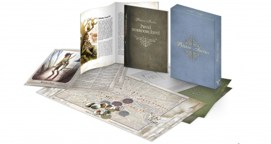
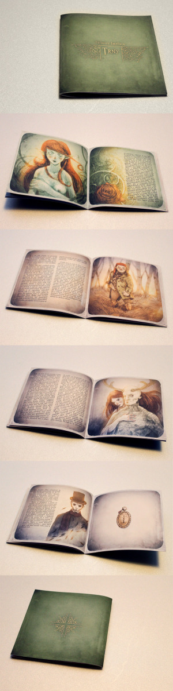
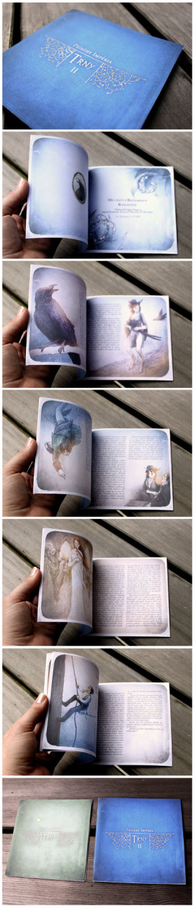
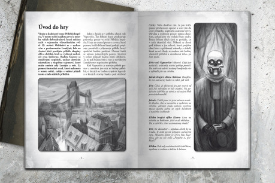
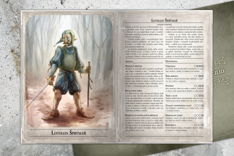
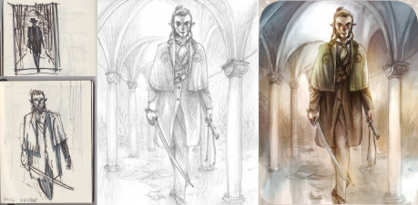
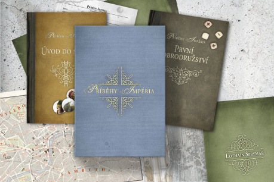
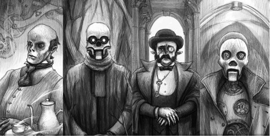

Součástí článku jsou také technické poznámky o tom, jaké nástroje a programy jsme použili. Takže pokud vás zajímá i tento aspekt tvorby, dozvíte se o něm něco málo také.

Co od článku nečekejte, je nějaký univerzálně platný návod, či rady, jak to bude fungovat vám. Je to jen článek o tom, jak jsme to dělali my. Ale pokud se sami zabýváte tvorbou her, dobrodružství, či jiných doplňků RPG, může vám tento náš „deníček“ být k něčemu užitečný.

## Výchozí situace / Počátek projektu / Další rozpracované a paralelní projekty

Od té doby, co roku 2009 vyšla základní kniha Příběhů Impéria, jsme na nich dál průběžně pracovali a ke hře tak vznikly (a vyšly) dvě rozšiřující příručky, doplněné o pár čistě internetových produktů. Několik povídek ve sbornících (dvě knihy ze série Hry s příběhem, přičemž třetí se připravuje). První z rozšiřujících příruček – _Rukověť mága_ – vyšla hned roku 2010 asi po šesti měsících intenzivní práce. _Kniha dobrodružství_ pak vyšla v roce 2012 po dvou dalších letech práce.

S myšlenkou krabicového vydání původně přišel vydavatel Příběhů, Skaven. První maily na toto téma jsme si vyměnili na přelomu let 2012 a 2013. Tedy v době krátce po vydání Knihy dobrodružství, kdy jsme se zamýšleli nad tím, co dál.

## Spousta poznámek

U každého projektu je to nejdůležitější vytyčit si cíl. Vymyslet koncept produktu, tedy o čem to celé bude, a sestavit si hrubý to-do list. V případě krabice šlo tedy hlavně o to vymyslet, k čemu má krabice sloužit a hlavně určit, jaké prvky bude obsahovat. V téhle fázi jsme si docela intenzivně mailovali se Skvenem a vizi precizovali. A i když jsme pak úvahu o tom, jak má krabice fungovat, několikrát převrátili, samotný obsah krabice přestál víceméně beze změny. Vlastně, když si procházím ty původní poznámky, tak mě překvapuje, jak přesně jsme to trefili, a že jsme za tři roky vývoje udrželi směr.

V této fázi jsme si také několikrát sestavili i časový plán prací. Tak nějak jsme si představovali, že to celé bude záležitost nekomplikovaná a že budeme za rok hotoví. Samozřejmě jsme se mýlili. A to pořádně. Proč ten vývoj trval nakonec tak dlouho, se dozvíte v následující kapitolce.

> Na začátku vývoje jsme hojně experimentovali s psaním poznámek v Evernote. To se celkem osvědčilo (hlavně díky schopnosti sdílet poznámky a zobrazovat je na nejrůznějších zařízeních), ale nakonec jsme to opustili a čmárali poznámky všude možně.

## Proč to trvalo tak dlouho?

Poté, co jsme jakž takž dali dohromady první rozpracovaný nástřel obsahu, sestavili jsme první koncept postav. Posbírali jsme na hromadu první materiály, ze kterých se měla knížka skládat. Napsali jsme první nástřel dobrodružství.

A pak jsme celou krabici nechali na víc než rok ležet. Přišly jiné projekty. A věc, která spočívala jen v posbírání a dopilování již hotových materiálů… se neukázala jako takový tahák, aby nás bavilo na ní intenzivně pracovat a dotáhnout ji. Podobně ležela na dlouhou dobu krabice v šuplíku ještě několikrát, ale už nikdy ne tak hluboko v klinické smrti.

## Vznik settingové části

Přes to přese všechno začala později pomalu v konkrétních rysech vznikat první ze dvou příruček v krabici. A to sešitek představující úvod do světa Příběhů Impéria. Ten je pojat jako výpravná barevná příručka s velkými barevnými dvoustránkovými ilustracemi. To je zároveň jediné místo, kam se nakonec dostaly již existující či starší ilustrace. Objevila se v nich jak obálka Knihy dobrodružství, tak obálka kartovky _Příběhy Impéria: Mocnosti._ Ta vyšla v roce 2014 a až do letoška jde o poslední vydaný příspěvek do skládačky Příběhů Impéria. Kromě těchto dvou ilustrací vznikal zbytek settingových obrázků od podzimu 2013 až do léta 2014. Společně s nimi vznikaly i korespondující texty.

Tato příručka byla vůbec první hotová, včetně korektur i layoutu. Jen se u ní relativně dlouho řešilo, zda bude vytištěná barevně, či černobíle, protože barva se kvůli malému nákladu výrazně promítla do ceny. Chtěli jsme samozřejmě udržet kvůli fanouškům co nejníže, ale nakonec jsme se rozhodli pro exkluzivitu a zvolili barvu. Ale toto patří do jiné kapitolky. O výrobě někde jinde.

## Vývoj příběhu / Komiks / Testování

Jak jsme se nakonec nořili do tvorby krabice hlouběji a hlouběji, myšlenka toho, že jen posbíráme něco, co máme, jen to trochu uhladíme a vydáme, vzala rychle za své. Brzy nám došlo, že pokud to má mít hlavu a patu, mít nějaký smysl… musíme to napsat znovu. Konečně jsme došli k myšlence startovací krabice – tedy produktu, který když otevře nováček jen s matnou představou o RPG, tak mu bude stačit chvilka listování a může začít hrát.

Jedna ze základních otázek byla, které úvodní dobrodružství použijeme. Zvažovali jsme nějaké z dobrodružství, která jsme již odehráli, ať již soukromě, či jako otevřené hraní na některém z Gameconů. Ta se nabízela zvláště proto, že byla dobře otestovaná a existovaly pro ně již hotové postavy. Ale nakonec jsme v prvním konceptu vycházeli z toho, že jako dobrodružství použijeme příběh, který se jmenoval Trny. Drobný pohádkový ilustrovaný příběh o londýnském gentlemanovi, který se vydává do Férie, aby tam zachránil svou lásku, která byla uvězněna v sídhském zámku za hradbou tvořenou trnitými keři. Tento příběh, ač nikdy nebyl publikován a nevyšel, byl velmi výpravně zpracován. Dokonce jsme měli doma vytisknutý jeho prototyp. Jak Trny vypadaly, se můžete podívat na okolních obrázcích.

Mezitím jsme ale od léta 2013 začali pracovat na zcela novém komiksovém příběhu. Různé komiksy jsme dělali vždy, ale nikdy jsme ještě žádný nepublikovali. Z našich prvních komiksových pokusů vlastně vzešly Příběhy Impéria. Ale komiks je královská, velmi náročná disciplína, o které je nám jasné, že ji nikdy nedokážeme zvládnout. Ale to neznamená, že se o to nebudeme pokoušet. Takže jsme pomalu začali kreslit panely k příběhu o londýnských skřítcích, jejichž královna je unesena neznámými silami. Tento příběh vznikal jen tak do šuplíku, velmi pomalu, možná jen po pěti stránkách ročně.

Potom nastal další zlom ve směřování vývoje krabice, když jsme se začali připravovat na Čaj o páté v pražském Mephitu, k příležitosti vydání karetní hry _Mocnosti_ Příběhů Impéria (tato akce proběhla na konci října 2013). Součástí této akce bylo i otevřené hraní. Plán byl, konečně k hraní nachystat příběh Trnů, abychom ho konečně posunuli do hratelné podoby a navíc hraní použili k otestování příběhu. Nakonec jsme zjistili, že volba Trnů nebyla nejšťastnější a příběh se pro RPG moc nehodil.

Ale příběh komiksu se ukázal být pro RPG mnohem vhodnější a k hraní v Mephitu jsme použili právě ten. Základní rysy příběhu jsme dali dohromady v dlouhé cestě vlakem mezi Řeznem a Prahou (práce ve vlaku vlastně vždy posunula krabici o nějaké mílové kroky vpřed, ještě o tom bude řeč).

Od té doby jsme už měli jasno, co s příběhem, a začali jsme konkretizovat postavy. Součástí krabice se mělo stát 9 předpřipravených postav, které si můžou hráči vzít a bez přípravy začít hrát. Původně jsme počet postavili na 8 – tedy 4 mužské a 4 ženské postavy, ale nakonec jsme přidali ještě postavu ukecaného havrana.

I když jsme nakonec Trny nechali ležet, přece jen jsme do sestavy postav v Krabici použili některé charaktery z tohoto příběhu. Za všechny onen zmíněný havran Edgar, mluvící pták – spisovatel, který byl v Trnech vlastně vypravěčem příběhu postav.

Když jsme měli jasno v konečné sestavě postav, začali jsme kreslit jejich ilustrace. Pro každou postavu jsme nachystali layout dvoulistu s její ilustrací. Některé ilustrace jsme již měli předpřipravené (ať již z komiksu či z Trnů), ale nakonec jsme je stejně výrazně přepracovali.

Poté, co byly všechny ilustrace hotové, bylo potřeba postavy popsat mechanicky. Příběhový FATE má jednoduchou a rychlou tvorbu postavy – stačí postavě vymyslet pár aspektů a pár dovedností a je hotovo. Pokud si dopředu dobře promyslíte koncept postavy, tak to jde vlastně úplně samo. Pokud ovšem neděláte 9 hotových postav najednou, u nichž kladete velké nároky na hratelnost a vyváženost postav mezi sebou. V tu chvíli se z toho stává peklo na kolečkách s obrovskými nároky na kreativitu a mozkové závity. Ve spoustě systémů je tvorba postavy jednoduchým zaškrtáváním v seznamech. V Příbězích máte vlastně neomezené možnosti volby. Pro nás to znamenalo vymyslet 27 aspektů a 63 dovedností tak, aby tvořily nějaký smysluplný celek a při hře se doplňovaly. Všechny postavy měly mít možnost nějakých základních věcí, přičemž ve zvláštnostech se měly doplňovat. Zpočátku jsme si práci zkoušeli rozdělit a po kouskách je zpracovávat, ale zjistili jsme, že se taková práce míjí účinkem a jediný způsob, jak to dát dohromady, je udělat to na jeden zátah. Což se nám taky podařilo a všechny postavy jsme dali ve vlaku dohromady. Dlužno poznamenat, náročnější tvůrčí šichtu nepamatujeme.

Pak zbývalo už jen sestavit konkrétní texty popisů postav. Ty jsme sepsali až poté, co byly postavy kompletně hotové z hlediska mechanik. Tohle už byla celkem rychlá záležitost, protože všechny díly skládačky – koncepty a příběh postavy – byly už připravené. Zbývalo je už jen zformovat do finálního textu.

> Většina textů vznikala v MS Word. Na některých počítačích jsme sice používali i LibreOffice a OpenOffice, ale ve finále se nám stejně nejsnáze pracovalo v Microsoftí verzi. Ne, že by to byl technicky nějaký velký rozdíl (minimálně pro naši práci to nemělo valný význam), ale tak nějak šlo o feeling a v tom novém podivném modrém rozhraní se nám psalo lépe. Extrémně jsme používali revizní nástroje, když jsme si texty mezi sebou přehazovali.

## Ilustrace

Výše popsaný postup vzniku předpřipravených postav byl vlastně praktickou ukázkou našeho procesu při psaní celé krabice. Všemu předcházely hojné diskuze, probírali jsme nápady, možnosti a sestavovali koncepty. Jakmile jsme byli s nápady spokojení, přešlo se ke skicákům a papírům a začaly vznikat ilustrace. Obvykle až potom, co byly ilustrace hotové, tak kolem nich vznikaly finální texty.

Tohle samozřejmě mělo také své výjimky, zejména doplňkové ilustrace a materiály k dobrodružství, vznikaly až v době, kdy se dobrodružství už sázelo. Stejně tak PDFkové rozšíření Fuller street, které jsme dělali po dokončení krabice, vzniklo úplně obráceně – a vlastně klasicky – nejdříve vznikaly texty, a až poté byl hotový text oilustrován.

I když jsme si na začátku řekli, že nebudeme příliš ilustrovat a že vezmeme hotové ilustrace z komiksu a dalších hotových a nepublikovaných projektů, tento nápad vzal rychle za své. Jednak vyvstala potřeba nových ilustrací, druhak mě přepadla velká nespokojenost s těmi starými ilustracemi. Takže jsem se pustil do jejich upravování, opravování a přemalovávání. Nakonec jediné dvě ilustrace, které jsme přebrali, jsou dvě malované dvojstránky v settingovém sešitu (první se objevila jako obálka knihy dobrodružství, druhá jako obálka kartovky). O obou případech už byla koneckonců řeč.

Stejný osud nakonec potkal i ilustrace, které jsem dělal na začátku vývoje. Tři roky jsou dlouhá doba a zjistil jsem, že jsem se za ně kresebně dost posunul. Takže jsem všechny ilustrace vlastně pořád průběžně předělával.

S tím souvisí i další specifikum krabice oproti všem ostatním příběhovým produktům – a to je přítomnost různých ilustračních stylů. Všechny ostatní projekty jsou vždy pojaty nějakou jednotnou technikou. V krabici se těch přístupů potkává víc – barevné malované dvoustránky, kolorované portréty postav, černobílé ilustrace v dobrodružství a pravidlech, mapky a schémata a dekorativní ilustrace k mapě Londýna. Ty všechny jsou trochu jinak kreslené a vypadají trochu jinak. Ale snažili jsme se, aby i přesto dávaly dohromady harmonický celek. Na vás je posoudit, nakolik se to povedlo.

> Všechny ilustrace jsem nejdřív kreslil tužkou na papír. Poté se skenovaly do počítače a kolorovaly ve Photoshopu CS5. Množství úprav v počítači se různí, výpravnější dvojstránky ze sešitku o světě byly ve Photoshopu přemalované kompletně a původní kreslená vrstva zůstává neviditelná. Ostatní si zanechaly výrazný kresebný ráz.

## Dokončování I.

Poslední velká přestávka probíhala přes léto 2015. Na krabici se zase nic nedělo, ale velmi intenzivně se o ní mluvilo. A čas od času se o ní někdo na Facebooku připomněl. Na nás se opět začaly hrnout další povinnosti.

V té době byla krabice již ve velmi dobrém stavu. Většina ilustrací byla hotová. Postavy byly sestavené a vybrané. Dobrodružství bylo nahrubo sepsané. Layout připraven. Ale pořád se to nějak nehýbalo. Až jsme si při nějaké zářijové procházce řekli, že pokud to chceme na Vánoční trh, tak se listopad (poslední jakž takž smysluplná doba, do které má smysl data do tiskárny posílat, aby se to před těmi Vánocemi stihlo) nezadržitelně blíží. A že s tím tempem prošvihneme další rok.

To, že jsme si vytyčili šibeniční termín, se ukázalo záhy. Potíž je v tom, že i když máte všechno hotové a nachystané, tak je to dotahování pořád setsakramentsky dost práce. A to i když si nemusíte dělat sami sazbu, jako si ji děláme my.

Nejdříve bylo potřeba dotáhnout všechny texty do jejich finální podoby. Ty jsme také postupně posílali na okomentování a peer review síti spolupracovníků, kteří nám byli ochotní věnovat trochu času. U každého produktu platí, že víc očí víc vidí a ty oči, které nejsou hluboce zainteresované v projektu, vidí nejvíc. Každý další podnět k vývoji je k nezaplacení. Ale tohle všechno předpisování a kontrolování stojí čas. Navíc celou situaci komplikoval fakt, že jsme se pořád pohybovali mezi více příručkami a prvky krabice. Paralelně na tom pracovat a udržet všechno v hlavě bylo dost náročné. Ukončit jednu věc a jít k další se ukázalo jako nerealistické, protože změny na jednom místě si vyžádaly změny ve dvou dalších prvcích. Navíc formulace pravidel tak, aby byla co nejjednodušeji a nejkompaktněji napsaná, ale zároveň jasná… nejsou tou nejjednodušší věcí. Stejně tak vypilovat dobrodružství logicky, tak aby bylo pro začínajícího Vypravěče snadné na uchopení, se ukázalo časově hodně náročné.

Ale my bychom to nakonec do těch Vánoc stihli. Texty jsme na korektury odeslali včas na to, abychom ještě stihli vysázet a odeslat do tiskárny. Bylo by to trochu hektičtější, ale zvládli bychom to. Nebylo nám to nicméně přáno. Těsně předtím, než jsme začali s finální sazbou, se z počítačové skříně pod stolem ozval zlověstný chroustavný zvuk.

## Intermezzo

Byl to zvuk disku, jehož mechanika selže tak šikovně, že při každém dalším pokusu o čtení dále nekontrolovaně kmitá a mění jedničky a nuly zapsané v magneticky citlivé vrstvě v digitální gulášovku.

Nutno poznamenat, že pokud bychom pravidelně zálohovali, šlo by vlastně o téměř šťastnou událost. Byl by to jen důvod udělat si radost a konečně upgradovat dokumentový disk na SSD. Bohužel, jak správně tušíte, zdálo se, že zálohy jsou nejméně rok staré. To bylo extrémně moc práce (nehledě na ostatní projekty). Nezbývalo než se obrátit na profesionální řešení obnovy dat. Pokud s tím nemáte zkušenosti, pak vězte, že pokud máte disk opravdu na fašírku, trvá to proklatě dlouho a je to proklatě drahé. A bohužel oboje najednou. První poučení tak zní – zálohujte. Opravdu.

Naštěstí jsem musel (kvůli jiným projektům) vstoupit do chaosu externích disků se starými daty, které mám na stole, a zjistil jsem, že jsem si aktuální zálohy vytvořit zvládl. Nebylo to úplně kompletní a bylo to tři měsíce staré, ale bylo toho dost.

Druhé poučení tedy zní, když už zálohujete, tak na to radši nezapomeňte.

Každopádně nakonec jsme se na zachraňování dat vykašlali. Zbylá data za ty chybějící měsíce jsme dali dohromady z různých mailů, dalších záloh a dropboxů. Bylo jen minimum věcí, které se musely dělat znovu. Ale i tak se časovou ztrátu nepodařilo vykompenzovat a listopad (i s prosincem) proletěl, aniž bychom měli hotovo.

Ztráta dat byla pro projekt velkou katastrofou a způsobila nám jednak velký stres, ale hlavně výrazně odsunula datum vydání. Musíme ale ve zpětném pohledu poznamenat, že odsun data vydání a to, že jsme najednou získali víc času, celému projektu jen prospělo. Do příručky přibyly další ilustrace. Dobrodružství jsme ještě trochu rozšířili a přidali jsme další zápletky.

Přesto je morální ponaučení jasné – zálohovat. Je to rozhodně dobré na psychiku. My jsme konečně zavedli systematický a pravidelný systém záloh. Jestli se osvědčí, uvidíme při dalším crashi dat. Jako poslední dovětek k této záležitosti dodám jen to, že jsem se nedávno dočetl, že v Americe se chystá hromadná žaloba na společnost Seagate s tím, že jedna konkrétní řada disků byla mnohem poruchovější, než měla být ... schválně hádejte, jaký disk jsme měli.

## Dokončování II. aneb mnoho prvků, autorova smrt

Jednou z posledních fází projektu byla jazyková redakce. Náš (troufnu si říct dvorní) korektor tentokrát nestíhal a přesunul se pouze do pozice feedbackáře a kibice, museli jsme se proto spolehnout na korektorku Kateřinu Churou, přes Skavenovo Mytago. I když jsme s ní neměli žádné předchozí zkušenosti, spolupráce s ní dopadla výborně a dokonce nám v textu vychytala pár faktických chyb a nelogičností, které jsme sami neobjevili. Tahle fáze zabrala asi něco málo pod měsíc.

Jak se nám postupně vracely jednotlivé texty zkorigované, začali jsme s finální sazbou. Ta proběhla celkem hladce bez dalších katastrof a problémů. Nutno podotknout, že tohle je asi nejzábavnější část procesu. Máte všechny části pohromadě a jen je slepujete dohromady a tvoříte výsledné dílo. Přesto patří krabice k asi nejtěžším projektům, které jsme připravovali pro tisk. Množství prvků, které bylo potřeba upravit, zasázet, nachystat a odeslat bylo opravdu velké. A udržet to všechno v hlavě, kontrolovat, že všechno prošlo korekturami a že někde nezůstává nějaká bota, byla práce pro chobotnici. Příště raději budeme psát normální knihu.

> Konečnou sazbu jsme již tradičně dělali v programu Adobe InDesign CS5. Abychom s vydavatelem měli přehled o jednotlivých prvcích a jejich stádiích rozpracování, měli jsme jeden online spreadsheet v Google Docs.

## Trička, trailer, web a propagace

Poté co jsme odeslali tisková PDF do tiskárny, tak jsme měli volné ruce k tomu, abychom zpracovali na přidružených materiálech a projektech k propagaci krabice. I tohle to si vyžádalo velké množství času.

První z nich byl animovaný trailer. Práce na něm začaly už někdy v zimě 2014, kdy jsem si trochu vymyslel koncept. Do bloku načmáral jednoduchý storyboard, připravil pár scén a pak celou záležitost zase na dlouho odložil. Na jaře 2015 jsem ho během několika víkendů načal, aby pak zůstal u mě na disku přes půl roku ležet, než jsme se k němu na podzim znovu dostali, abychom ho dokončili. Krátce po tom, co jsme ho zveřejnili, se nám přes RPGForum ozval uživatel s přezdívkou [eerieBaatezu](http://rpgforum.cz/forum/memberlist.php?mode=viewprofile&u=2260) (nebo také corona.spars) s tím, že pro trailer vytvořil hudební soundtrack (netřeba dodávat, že takto vypadal ten trailer mnohem lépe než s pouhými zvukovými efekty, které jsme tam měli my). Takže jsme o dva měsíce zveřejňovali trailer znovu. Lehce opravený a s novou hudbou. Na finální trailer se můžete podívat tady:

[https://vimeo.com/155321523](https://vimeo.com/155321523)

> Jednotlivé scény jsem animoval v Anime Studio Pro, střih pak proběhl ve VSDC Free Video Editor. V čem dělal Eerie hudbu, byste se museli zeptat jeho.

Druhým velkým projektem, který souvisí s propagací, byla tvorba prezentačního webu. Stávající web, který běží na adrese imperium.mytago.cz, je tak 3 roky starý web, postavený na wordpressu. Vcelku nám vyhovuje jako novinkový web – snadno se upravuje a spravuje. Ale rozhodně to není vhodná prezentace pro začátečníky či „nové zákazníky“.

Proto jsme se rozhodli vytvořit novou prezentační stránku přímo pro krabicovou verzi. Měla být vstupním představením světa Příběhů Impéria a RPG, která by běžela přímo na doméně pribehyimperia.cz. Tvorbě webu předcházela tvorba prezentačních mockupů (v počítači složených náhledů (či prototypů) na výsledný produkt) obsahu krabice, aby bylo co atraktivního ukázat. A když byla tato prezentace hotová, tak jsem kolem této galerie celý web vystavěl. Celá stránka je vyrobená jako jednoduchá scrollovací prezentace. Snažili jsme se ji udělat co nejjednodušeji a nejsrozumitelněji, zároveň ale moderně a efektně.

> Technicky se jedná o statické html vygenerované z WYSIWYG editoru Adobe Muse CC. Celá tvorba stránky zabrala asi tři týdny.

Web není úplně optimální – i když se korektně zobrazuje na mobilních zařízeních, není to dynamický web. Stejně tak by opět chtělo aktualizovat vzhled novinkového webu, či jej přesunout na novou doménu (stále ještě se nachází pod imperium.mytago.cz).

Výsledek snažení můžete snadno posoudit zde: [http://pribehyimperia.cz](http://pribehyimperia.cz)

A kromě webu a traileru jsme konečně stihli udělat příběhová trička.

I přes vše výše zmíněné zůstává propagace naší velkou slabinou. Obesílat weby a aktualizovat novinky nás příliš neuspokojuje, takže máme tendence to dlouhodobě flákat. Zkrátka na to nemáme ten správný naturel. Uvidíme, zda to v případě krabice bude přece jen lepší. Materiál k rozesílání snad máme.

## Vydání a technická stránka krabice

V době kdy píšeme tyto řádky, už je krabice zkompletována a byla rozeslána lidem, kteří si ji předobjednali. Bohužel kvůli souhře náhod (vydavatelova dlouhá dovolená a náš dlouhodobý pobyt mimo kompetence české pošty), ještě nemáme možnost osobně posoudit kvalitu dílů a výroby a výsledný efekt krabice.

Stejně tak je tato kapitola spíše záležitostí vydavatele nežli autora. Přesto sem napíšeme pár stručných poznámek k několika rozhodnutím, která jsme udělali.

Konečné určení nákladů, konkrétních počtů jednotlivých komponentů a volba jejich materiálu byly na Skavenovi. Celou dobu jsme válčili s relativně malým nákladem. Kdyby byla RPGčka větším trhem a my věděli, že větší množství krabic prodáme, byla by situace jednodušší. S rostoucím nákladem klesá cena jednotlivých prvků a pro výrobu se situace výrazně zjednodušuje.

Asi největší díru v rozpočtu udělala celobarevná příručka o světě. Barevný tisk je stále i v dobách digitálního tisku násobně dražší než černobílý tisk. Takže celou dobu ve hře byla možnost nakonec settingovou příručku udělat černobíle. To by ale byl z našeho pohledu promarněný potenciál. Nakonec to Skaven dokázal narozpočtovat tak, že se nám luxusní barevnou verzi podařilo protlačit.

Další z rozhodnutí byla vazba příruček. Na výběr jsme měli klasickou lepenou (jako dosud všechny příběhové příručky), se kterou jsme počítali, nebo jednodušší sešitovou vazbu, kterou navrhla tiskárna. Problém byl, že obě příručky byly relativně tenké, a ačkoliv by byla lepená vazba technicky možná, nebyla by příliš pevná a hrozilo by, že listy začnou rychle vypadávat. Na druhou stranu je lepená vazba mnohem efektnější. Zde jsme nakonec zvolili vazbu sešitovou. Tedy řešení praktičtější oproti řešení efektnějšímu.

Jedna z prvních poznámek, která přišla od hráčů, byla k velikosti mapy, která by dle jejich názoru mohla být i větší. I my jsme ji komponovali jako větší, ale tisk větších barevných posterů je tak velký, že by to bylo rozpočtově neúnosné. Proto jsme se rozhodli pro menší mapu. I pro to, že menší mapa snad bude praktičtější a na stůl se při hraní vejde snáz.

U všech rozhodnutí šlo o kompromis mezi cenou a efektem. Jednak pro zákazníka, jednak pro vydavatele. Všechna tato rozhodnutí se promítla do konečné ceny, která činí 899 Kč.

## Co dál další projekty / Závěr

Dopsáním tohoto dokumentu se vlastně uzavírá práce na krabici Příběhů Impéria. A tak, stejně jako v roce 2012, po dokončení Knihy dobrodružství vyvstává otázka – co dál?

Mimo jiné by měl ještě letos vyjít třetí sborník Her s příběhem, jehož součástí bude již tradičně nová povídka ze světa Příběhů Impéria. Ta tentokrát představí svět Příběhů Impéria z jiného úhlu a možná naznačí, kam se bude svět Příběhů Impéria ubírat dál.

Kromě toho máme v poznámkových bločcích a na hard disku počítače stále několik projektů. Mimo jiné další regulérní rozšiřující příručku. Uvidíme, co budoucnost přinese. Při troše štěstí nebudeme muset čekat dlouhé čtyři roky.

Držte nám palce.
