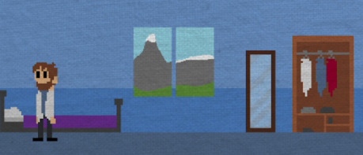

Ale to není všechno. Důležitým aspektem hry je taky vaše rodina a rozhodování se, zda se budete v posledních chvílích před koncem světa věnovat jí, nebo se budete ze všech sil snažit onen konec světa odvrátit. Hra před vás bude klást mnohá morální rozhodnutí a podle toho, jakou možnost zvolíte, se bude hra odvíjet dál a vyústí v jeden z několika emotivních konců. A emotivní nebudou pouze konce, nýbrž celá, ale úplně celá hra.

Hra se ovládá poměrně jednoduše, pouze ovládáte vědce šipkami a občas zmáčknete i nějakou jinou klávesu. To ale jen výjimečně.

Stejně jako ovládání je i grafika jednoduchá. Jednoduchou klasickou indie pixelovou grafiku místy doplňují ne tak úplně pixelové části. Těmi jsou (alespoň pokud si to pamatuji správně) třeba výhledy z oken a domy ve městě.

Ale grafika ani ovládání nejsou ty nejdůležitější, přiznejme si to. To příběh, příběh je to, co nás zajímá. Co o něm tak říct, abych nic důležitého neprozradil? Je dobrý. Je emotivní, dramatický, mnohdy deprimující a často budete muset máchat rukama kolem obličeje, abyste se nerozbrečeli. Mnohem lépe jde zhodnotit atmosféričnost. Ta je skvělá! Hra na vás dýchá tím správným preapokalyptickým pocitem a vy prostě víte, že konec se blíží. Každý den je stav světa horší, postupně všechno skomírá a umírá a mírá.

Atmosféru krásně dokresluje i soundtrack. Přes svou jednoduchost je úplně dostačující. Ale zároveň je skvělý. Je takový... skvěle dostačující. Sice je složen jen z několika skladeb, ale všechny se do hry prostě hodí. A hlavní téma autorovi až podezřele připomíná skladbu z Plague Inc. To vůbec nevadí, vždyť v obou hrách jste vlastně způsobili pandemii. Byť v recenzovaném případě to bylo spíše omylem.

{:.sidebar}
Autor recenze si před nedávnem založil [kanál na YouTube](https://m.youtube.com/channel/UClbY3bNBJJQPn5PTGw1nERw), kam mimo jiné nahrával komentovaný pohled na recenzovanou hru. Takže pokud vám nevadí nízká kvalita videa, amatérský komentář a idiotský hlas, určitě se tam mrkněte. Jestliže tak, i přes všechny nástrahy, které kliknutí na onen odkaz skýtá, uděláte, silně bych vám nedoporučoval shlédnout jakýkoliv díl ze série Darkest Dungeon. Všechny totiž byly natáčeny na úplném začátku a jejich kvalita je tedy o to nižší než u ostatních videí.

Paradoxem, když pohlédneme na název hry, je její vysoká znovuhratelnost. Nepovedlo se vám zachránit svět? Můžete to zkusit znova. A znova. A znova, znova a znova, znova, znova...

Takže jak zní verdikt? Kdyby hra nebyla zdarma, asi by neměla tak dobré hodnocení. I přes velkou znovuhratelnost je hra krátká a jde dohrát během pár minut. Ale ona je zdarma. A dostupná na internetu. Jenom tak. To musím rozhodně zohlednit a v mých očích je (hlavně díky tomu) dost vysoko. Ale to je jedno, můžete ji posoudit sami, stačí si vygooglit její název a kliknout na nějaký z odkazů.

Takže, jak využijete svou Jednu šanci?
