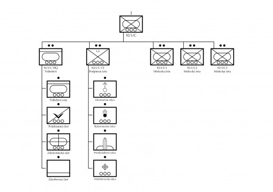
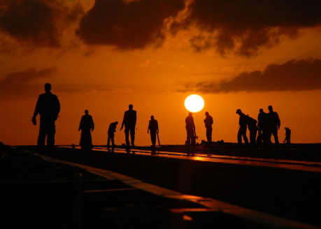
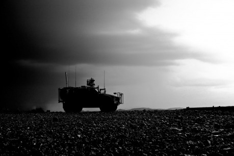
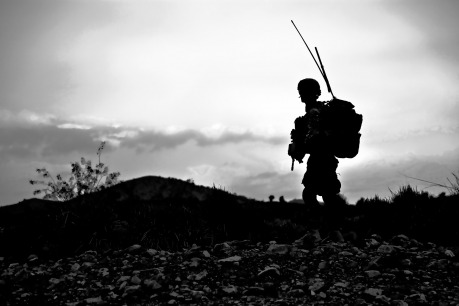
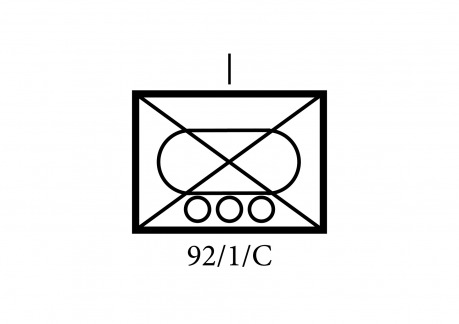

V minulém článku byla popsána 1. střelecká četa roty C (rota Charlie) a v tomto díle je podrobněji rozebrána právě struktura této mechanizované roty. Ta je složena z _velitelství roty_, _podpůrné čety_ (vybavené zbraněmi palebné podpory) a hlavní síly, kterou představují _tři střelecké čety_ (které jsou vybavené obrněnými transportéry a útočnými drony).

Záměrem článku je, abyste mohli tuto jednotku vzít a použít pro vaše hraní, pokud budete potřebovat, aby se někde takový vojenský oddíl objevil, ale nebude se vám s ním chtít vymýšlet.

Historicky se oddíly o síle okolo 100 až 120 mužů objevovaly ve všech armádách dějin (takovýmto oddílem byla kupříkladu centurie římské říše, která sestávala ze 100 mužů). Díky tomu, že boje probíhaly zblízka nebo v těsně semknutých řadách, představovalo sto mužů největší možný oddíl, kterému šlo ještě v bitvě přímo velet hlasem nebo za pomoci hudebních nástrojů. Je to také počet, který ještě umožňuje, aby se všichni v rámci jednotky znali a vytvořili si vzájemné společenské vazby. S takovými počty, které tvoří zpravidla násobky desítek nebo dvanáctek, se pak také snadno operuje v rámci vyšších vojenských struktur. Moderní věda navíc prokázala, že je tu souvislost s Dunbarovým číslem, které ukazuje, že člověk dokáže udržet stálé společenské vztahy jen s omezeným množstvím lidí (díky fyzickým omezením mozkové kůry, která jich více prostě neudrží v paměti). Toto číslo je mezi 100–250, přičemž běžně se používá střední hodnota 150 lidí. V moderních armádách, které mají k dispozici lepší možnosti komunikace a mnohem větší mobilitu, čítá rota většinou mezi 80 a 250 vojáky.

V případě zde popisované roty fiktivní námořní pěchoty je to 193 mužů. Jedná se o rotu mechanizované pěchoty, která využívá k přepravě bojová vozidla pěchoty (zde označované jako bojové transportéry), které jsou pevnou součástí struktury jednotky. Vozidla disponují vlastními zbraněmi palebné podpory, kterými jsou kanony a protitankové rakety. Oproti běžné pěchotě se tak vyznačuje velkou mobilitou, která jí pomáhá udržet iniciativu v bitvě, a větší palebnou silou proti pěchotě, lehce obrněným cílům i tankům. Správně využitá a vedená rota námořní pěchoty dokáže nadělat hodně škody a může na bojišti hrát rozhodující úlohu. Do přímého boje může nasadit úctyhodnou sílu 14 bojových transportérů Avenger, 9 střeleckých družstev a 9 útočných dronů. Má k dispozici palebnou podporu minometů, vícehlavňových raketometů a protiletecké krytí. Má k dispozici také vlastní průzkumné drony, které jí umožňují udržovat si přehled o bojišti, a podporu bojových létajících dronů, které jí dodávají další bojové schopnosti.

Roty jsou v rámci pluku označovány pomocí písmen (zatímco podřízené čety pomocí čísel – 1. četu roty C lze tak snadno označit jako „četa C1“), přičemž každý pluk se sestává ze tří praporů o síle tří pěších rot a jedné roty podpůrné. Pěší roty prvního praporu jsou tradičně označeny jako A, B a C (Alfa, Bravo a Charlie), pro podpůrnou rotu je vyhrazeno D (Delta). Druhý prapor má pěší roty E, F a G (Echo, Foxtrot a Golf) a podpůrnou rotu H (Hotel) a třetí prapor má pěší roty I, K a L (India, Kilo a Lima) a podpůrnou rotu M (Mike). Písmeno J se nepoužívá, protože velké I je příliš snadno zaměnitelné s velkým J. Zjednodušený zápis roty C, 1. praporu 92. pluku pak bude vypadat „92/1/C“ (kde první pozice představuje pluk, druhá prapor a třetí rotu).

Vylodění na planetě je realizováno za pomoci vyloďovacích člunů X2. Každý z nich unese 4 bojové transportéry Avenger s naloděnou posádkou (případně dvojnásobek jeepů, které zabírají méně místa, nebo polovinu nákladních vozidel, které jsou větší). Čluny X2 se dokážou pohybovat mezi oběžnou dráhou a povrchem, stejně jako v atmosféře planety, ale nedokážou se přesouvat mezi planetami, nebo dokonce hvězdnými systémy. Na tyto velké vzdálenosti je vždy přepravuje nějaká vesmírná loď, která je pak vysadí na oběžné dráze nebo s nimi přistane na planetě a teprve pak odstartují. Jednu četu (a tedy jeden člun X2) dokáže nést upravená fregata, rotu pak musí nést větší vyloďovací útočné plavidlo (velikost transportéru). Celkem rota potřebuje k vylodění sedm člunů X2 – tři X2 nesou po jedné pěchotní četě; jeden X2 nese transportéry minometné a raketometné sekce; další X2 transportéry protiletadlové sekce, zdravotnický transportér a dva jeepy odstřelovačské sekce; následující X2 dva velitelské transportéry, dva jeepy velitelství a průzkumný transportér; zatímco poslední X2 nese dvě nákladní vozidla se zásobami a municí.

Čluny X2, které dokážou jednotlivé čety přepravovat v rámci atmosféry planety, přidávají mechanizované pěchotě také aeromobilní kapacitu a možnost se rychle přesouvat a rozmístit na velké vzdálenosti. Doplňují tak již nezanedbatelnou mobilitu roty a kvality pěchoty vyzbrojené bojovými transportéry. Čluny samy nejsou ozbrojené, a přestože jsou chráněné pancířem a systémy proti protiletadlovým zbraním, zpravidla se neriskuje jejich nasazení blízko nepřátelským pozicím a k přistávání pod palbou. Za normálních okolností vyloží rotu v blízkosti pozic protivníka, ale rozhodně mimo nepřátelský účinný dostřel. Vysazená mechanizovaná pěchota má totiž na rozdíl od běžné pěchoty dostatečnou mobilitu, aby rychle dosáhla nepřátelských pozic po vlastní ose a bez ohrožení vlastních vyloďovacích člunů.

## Struktura roty

Součástí mechanizované roty je 7 důstojníků, 187 členů mužstva a 4 entity virtuální inteligence (3× VI ORCA a 1× VI AITE). Rota kromě toho disponuje 14 bojovými transportéry Avenger, 8 zvláštními verzemi transportéru Avenger (které jsou určeny pro bojovou podporu), 4 terénními vozidly a 2 tahači s nákladními přívěsy. Rota sama je rozdělena na pět částí – _velitelství_, _podpůrná četa_ a _tři střelecké čety._

### Velitelství (3 důstojníci, 31 mužů, VI AITE)

Sestává ze 3 důstojníků, virtuální inteligence AITE a 31 mužů rozdělených do tří sekcí – _velitelství roty_, _průzkumné sekce_ a _zdravotnické sekce_.

__Velitelství roty__ (2 důstojníci, 16 mužů, VI AITE, 2× Avenger HQ (velitelská verze), 2× jeep, 2× nákladní vozidlo): Tato sekce se sestává z velitele roty, virtuální inteligence AITE, zástupce velitele, seržanta roty, zásobovacího poddůstojníka (v hodnosti seržanta) a 14 mužů.

__Zařazení oddílu:__

92/1/C – rota C (Charlie), 1. prapor 92. pluku („Pohraniční rváči“)

__Velitel pluku:__

plukovník H. J. „Pirát“ Roberts (výrazné rysy: Agresivní, Inspirativní, Nehledí na ztráty)

__Velitel roty C:__

kapitán E. Baldwine III. (výrazné rysy: Všechno podle příručky, Přímo z důstojnické školy, Nezkušený)

__Zástupce velitele:__

nadporučík T. „Toby“ Watson (výrazné rysy: Smíšek, Palič půlnočních lamp, Z vojenské rodiny)

__Doktor roty:__

poručík A. „Doc“ Kilroy (výrazné rysy: Už jsem na to starý, Dneska tady nikdo nebude umírat, Chladnokrevnost)

__Seržant roty:__

první seržant R. McAlister (výrazné rysy: Doutník, Zvýšený hlas, Ostřílený veterán)

__Velitel podpůrné čety:__

poručík A. L. Redwood (výrazné rysy: Krátkozraký, Hlava na výpočty, Krásný den na destrukci!)

__Velitel první čety:__

poručík J. Williams (výrazné rysy: Výkonný, Pružný, Sběratel metálů/Ambiciózní)

__Velitel druhé čety:__

poručík Irirangi Te Mohere (výrazné rysy: Maorská tetování, Obezřetný, Odvaha pod palbou)

__Velitel třetí čety:__

poručík A. W. Rodriguez (výrazné rysy: Agresivní, Impulzivní, Smrt nebo sláva!)

- _Avenger HQ:_ První Avenger ve velitelské verzi (nákladní prostor je nahrazen dodatečným komunikačním a zobrazovacím vybavením, jinak je ale plně bojeschopný) má k dispozici velitel roty (v hodnosti kapitána), který velí celé jednotce. Jako mají velitelé čet k dispozici virtuální inteligenci ORCA, má velitel roty k dispozici pokročilou virtuální inteligenci AITE, která pomáhá veliteli roty s řízením bitvy, komunikací s velením i podřízenými jednotkami a vyhodnocováním situace na bojišti. Podobně jako ORCA není AITE umělá inteligence v pravém smyslu slova (neuvědomuje si samu sebe), ale soustava programů, která vytváří jediný nástroj. Ten slouží jako pomocník velitele, když vyhodnocuje rizika, sleduje komunikaci a informuje jej o změnách a novinkách na bojišti, vykonává rutinní úkoly a předává rozkazy dál, aby měl velitel volné ruce k vedení bitvy. AITE také propojuje virtuální inteligence ORCA v rámci roty a má přístup k jejich informacím, přičemž rozkazy a data může posílat přímo podřízeným VI, které je následně přímo využijí a předají svým velitelům.
- _Avenger HQ:_ Druhý Avenger ve velitelské verzi má k dispozici zástupce velitele (v hodnosti nadporučíka), který pomáhá veliteli s taktickým plánováním, velí zpravidla vyčleněným samostatným částem jednotky a v případě, že je velitel mimo dosah nebo je vyřazen, převezme velení. Jinak má na starosti běžnou administrativu, čímž uvolňuje veliteli ruce k tomu, aby velel své rotě.
- _2× jeep:_ Jeep je k dispozici pro seržanta roty (v hodnosti prvního seržanta), což je v mnoha ohledech nejzkušenější voják z jednotky (má zpravidla nejvíce odsloužených bojových misí). Pomáhá veliteli svými zkušenostmi a vhledem do fungování jednotky, zástupci velitele s logistickým plánováním, dohlíží také na plnění rozkazů a běžnou disciplínu. V bitvě pak většinou dohlíží na kritické úseky bojiště. Druhý jeep je k dispozici pro velitele, pokud potřebuje rychle zkontrolovat jednotky, provést průzkum nebo se pohybovat v týlu. Jinak slouží nezřídka jako rychlý transport a kurýr.

__Průzkumná část__ (5 mužů, 1× Avenger RE – průzkumná verze)

- _Avenger RE:_ Avenger v průzkumné verzi veze osm malých průzkumných dronů, které zjišťují informace pro velitele roty a společně s průzkumnými drony jednotlivých čet poskytují přehled o situaci na bojišti. Osádkou vozidla je řidič, velitel vozidla, 2 operátoři dronů a operátor pro elektronický boj. Průzkumný Avenger bývá často zaparkován vedle velitelského vozidla, s nímž bývá propojen kabely pro rychlejší přenos dat. Na korbě veze také skládací ultralehký letoun s velkým rozpětím, který vždy před začátkem operace (a v dostatečné vzdálenosti od nebezpečí) vypustí do vzduchu. Ten létá ve velkých výškách na rozhraní kosmického prostoru a slouží pro přenos komunikace a snímkování z velké výšky. Díky solárním panelům a energetickému článku, který jej pohání, dokáže létat bez dobití několik dní. Operátor pro elektronický boj má na starosti sledování frekvencí protivníkových komunikačních kanálů, zachycování a analýzu jeho zpráv a případně rušení nepřátelských spojení.

__Zdravotnická část__ (1 důstojník, 4 muži, 1× Avenger ME – zdravotnická verze, 2× evakuační dron)

- _Avenger ME:_ Transportér ve zdravotnické verzi může v případě nouze sloužit k rychlé evakuaci zraněných pod palbou (protože je pancéřovaný), ale především slouží jako mobilní základna pro doktora roty v hodnosti poručíka, který má k dispozici dva mediky a případně také mediky jednotlivých čet. Posádku kromě toho tvoří řidič a velitel vozidla. Na korbě veze transportér dvojici transportních dronů (velkých dost na to, aby se na ně vešel ležící voják), které jsou určené k evakuaci mužů z boje a jejich dopravení k centrálnímu obvazišti.

__Zásobovací část__ (6 mužů, 2× nákladní vozidla)

- _2× nákladní vozidlo:_ Každé vozidlo sestává z výkonného tahače a nákladního přívěsu a dokáže uvézt až dvanáct tun zásob. Každý tahač řídí řidič, v prvním pak jede zásobovací seržant se zbrojířem (první má na starosti zásobování celé roty, druhý se stará o munici, údržbu zbraní a jejich náhrady), ve druhém pak technický seržant (má na starosti údržbu a opravu vozů v jednotce) s dalším technikem. Rota potřebuje velké množství zásob – každý den potřebuje okolo ¾ tuny jídla (v podobě vakuově balených vysokoenergetických přídělů, které se nemusí ohřívat, ale lze je konzumovat nejvýše tři týdny bez doplnění jiným jídlem) a vody. Díky zásobám, které oba nákladní vozy převážejí, dokáže rota zůstat v poli a plném bojovém nasazení deset dní bez další pomoci a dodávek (častěji i déle, protože zásob jídla veze do zásoby více, a pokud vozidla během této doby nemanévrují, zbude jim dost energie ještě na několik dalších dní; nicméně deset dní je považováno za normu). Jídlo, voda, munice a další zásoby včetně náhradních dílů a zásoby náhradních energetických článků, které pohánějí vozidla, jsou rozděleny mezi obě vozidla, aby zničení jednoho neznamenalo ztrátu všech zásob některého druhu. Každé z vozidel veze také 3D tiskárnu, která dokáže v polních podmínkách vytisknout potřebné náhradní díly pro vozidla. V případě převážení článků není limitujícím faktorem jejich váha, ale spíš jejich větší rozměry – musí být převáženy v pancéřovaných schránkách, protože přímý zásah může způsobit velkou explozi. Obě vozidla se zásobami musí být za všech okolností udržovány v bezpečí, protože jejich ztráta může být pro rotu katastrofická.

### Podpůrná četa (1 důstojník, 33 mužů)

Sestává ze čtyř částí zajišťujících palebnou podporu střeleckým četám – _minometné sekce_, _raketometné sekce_, _protiletadlové sekce_ a _odstřelovačské sekce_. První tři využívají různé verze transportéru Avenger, které nepřevážejí vojáky, ale byly modifikovány k různým úkolům palebné podpory a protiletadlové obrany. Díky tomu, že jsou postavené na stejném podvozku jako zbytek vozidel v rotě, využívají stejné náhradní díly, což zjednodušuje logistiku.

__Minometná sekce__ (10 mužů, 2× Avenger MR – minometná verze): Sekce obsahuje dva transportéry Avenger v minometné verzi. Každý z nich má namontovaný těžký minomet, který obsluhuje tříčlenná obsluha (mimo nich je ve vozidle řidič a velitel vozidla). V případě, že musí posádka vystoupit a fungovat bez vozidla (například v nepřehledném terénu), nese obsluha s sebou na misi dva mobilní lehké minomety (které jinak veze transportér na palubě). Úkolem minometné sekce je poskytovat nepřímou palebnou podporu střeleckým četám.

__Raketometná sekce__ (8 mužů, 2× Avenger RL – raketometná verze): Sekce obsahuje dva transportéry Avenger v raketometné verzi. Každý z nich nese dvanáctihlavňový raketomet, který může střílet neřízené nebo řízené rakety až do vzdálenosti 90 km. V každém voze je řidič, velitel vozidla a dva operátoři. Raketomet dokáže pálit rakety po jedné nebo v sadě po třech. Všechny rakety dokáže vystřílet za méně než minutu a pak se rychle přesunout, aby se vyhnul odvetné palbě nepřátelského dělostřelectva. Může používat různé druhy raket a hlavic – včetně řízených, které zasahují přesně cíle na velké vzdálenosti; řízených protitankových, které ničí obrněné cíle protivníka údery do nejslabšího pancíře shora; elektromagnetických, které vystřelují EMP pulz, jenž vyřadí elektroniku nepřátelských strojů, nebo termobarických, účinných nejen proti živé síle na velké ploše. Dodává tak rotě podporu dalekonosného raketového dělostřelectva.

__Protiletadlová sekce__ (8 mužů, 2× Avenger AA – protiletadlová verze): Sekce obsahuje dva transportéry Avenger v protiletadlové verzi. Každé z vozidel má rychlopalný vícehlavňový kanon na ničení leteckých cílů a nese také protiletadlové rakety k ničení cílů ve větších výškách a vzdálenostech. Každé vozidlo veze s sebou také další dvě automatické raketové věžové stanoviště, které lze rozmístit a všech šest jednotek pak propojit do jedné obranné sítě, propojené s virtuální inteligencí AITE. Každé vozidlo má posádku řidiče, velitele vozidla a dvou operátorů.

__Odstřelovačská sekce__ (8 mužů, 2× Jeep): Sekce obsahuje dva jeepy, přičemž každý má posádku řidiče (který ovládá vozidla) a tříčlenného odstřelovačského týmu (odstřelovač; spotter, který pomáhá se sledováním cílů, atmosférických podmínek, stará se o komunikaci a situaci na bojišti okolo; flanker, který se stará o bezpečnost týmu a hlídá jim záda). Všichni tři mají na sobě osobní maskovací obleky, které je činí prostým okem prakticky neviditelné.

### 3× střelecká četa (v každé četě 1 důstojník, 43 mužů, VI ORCA)

{:.sidebar}
Pozn. – V Drakkaru 51 bylo uvedeno, že 1. četa je zařazena v rámci 2. praporu pluku. To byla z mé strany chyba – jak je uvedeno v tomto článku, je součástí 1. praporu.

Součástí každé čety je jeden důstojník, virtuální inteligence ORCA a 43 členů mužstva. Každá četa sestává ze tří střeleckých družstev po deseti mužích a má k dispozici čtyři bojové transportéry Avenger (po jednom pro každé družstvo a jeden ve verzi HQ pro velitele čety) a tři bojové drony (které vezou transportéry). Bližší popis střelecké čety najdete v [Drakkaru 51](http://drakkar.sk/51/).
