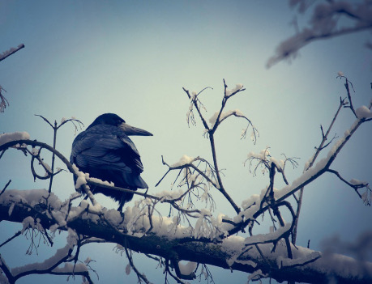
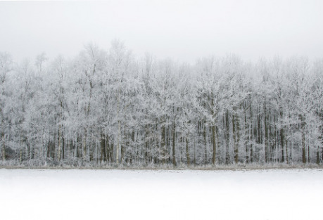

Zimní démoni, Ľadová čarodejnica Cailleach, a jej šampión, Ľadový obor Bláinn, prišli do krajiny Aes Sídhe, elfov, a zahalili ju Večnou zimou. Áine, bohyňa leta, vyslyšala prosby elfov, a vysla svoje dcéry, letné víly, aby zimných démonov vyhnali. Každá víla dostala dva dary.

Faoladh, _Vlčica_, dostala Fragarach, Vzdušný meč, a schopnosť meniť sa na vlčicu.

Beanna, _Vrana_, dostala Bogha Gréine, Slnečný luk, a schopnosť meniť sa na vranu.

Arthwen, _Medvedica_, dostala Areadbhair a Svalinn, Ohnivú kopiu a Ľadový štít, a schopnosť meniť sa na medvedicu.

Sionnach, _Líška_, dostala Draíochta, magickú moc, a schopnosť meniť sa na líšku.

Letné víly musia prejsť cez štyri panstvá, ktoré strážia kapitáni Ľadovej čarodejnice a ich otroci, aby sa mohli postaviť zimným démonom v Ľadovej veži a vyhnať ich z krajiny elfov.

## Letné víly

### Faoladh, Vlčica

__Aspekty:__ Vlkodlačica, Šermiarka, Pevná vôľa, Fragarach (Vzdušný meč)

__Prístupy:__ Pečlivě +1, Chytře +2, Oslnivě +3, Rázně +1, Rychle +2, Lstivě +0

__Triky:__

> +2 keď pátra po ukrytých skutočnostiach a má pri sebe Fragarach
>
> +2 keď rýchlo útočí mečom

### Beanna, Vrana

__Aspekty:__ Vranodlačica, Lukostrelkyňa, Prchká, Bogha Gréine (Slnečný luk)

__Prístupy:__ Pečlivě +2, Chytře +1, Oslnivě +0, Rázně +1, Rychle +3, Lstivě +2

__Triky:__

> Slnečný luk raz za herné sedenie vystrelí mračno šípov namiesto jedného na všetkých protívníkov.
>
> +2 keď Pečlivě útočí na pohybujúci sa cieľ lukom

### Arthwen, Medvedica

__Aspekty:__ Medveďodlačica, Berserker, Silná, Areadbhair (Ohnivá kopija)

__Prístupy:__ Pečlivě +0, Chytře +1, Oslnivě +2, Rázně +3, Rychle +2, Lstivě +1

__Triky:__

> +2 keď Rázne útočí kopiou, obnažený hrot Ohnivej kopie popáli svojím dotykom všetko, čoho sa dotkne.
>
> Raz za herné sedenie, Svalinn vytvorí ochranné pole okolo víl, ktoré odrazí akýkoľvek útok.

### Sionnach, Líška

__Aspekty:__ Líškodlačica, Čarodejka, Prefíkaná, Draíochta (magická moc)

__Prístupy:__ Pečlivě +0, Chytře +3, Oslnivě +2, Rázně +1, Rychle +1, Lstivě +2

__Triky:__

> +2 keď Chytře vytvára výhodu proti zimným stvoreniam pomocou mágie.
>
> Raz za herné sedenie dokáže svojím dotykom vyliečiť všetky zranenia spôsobené chladom (odstrániť všetky následky a obnoviť Stres).

## Zimní démoni a ich služobníci

### Cailleach, Ľadová čarodejnica

__Aspekty:__ Krutá, Čarodejka, Draíochta (magická moc)

__Prístupy:__ Pečlivě +1, Chytře +5, Oslnivě +4, Rázně +3, Rychle +2, Lstivě +2

__Triky:__

> +2 keď Oslnivě vytvára výhodu pomocou ilúzií.
>
> Raz za herné sedenie pomocou mágie uväzní jedného tvora do ľadového bloku.

### Bláinne, Ľadový obor

__Aspekty:__ Obrovský, Silný, Skofnung (claymore, veľký obojručný meč)

__Prístupy:__ Pečlivě +1, Chytře +2, Oslnivě +2, Rázně +5, Rychle +4, Lstivě +3

__Triky:__

> Ľadový vír - raz za herné sedenie sa prudko roztočí a jedným švihom zaútočí na každého tvora v dosahu.
>
> +2 keď sa Rázně bráni fyzickým zraneniam.

### Kapitáni Ľadovej čarodejnice a ich otroci

- Ohnivý drak Eldur a piktovia v Železných horách.
- Obrovský Kraken Hafgufa a severskí piráti na Zimných ostrovoch.
- Nemŕtvy rytier Glámr a divokí umrlci v Krajine tieňov
- Zákerný čarodej Sluagh a strašidelné bánší v Šepkajúcom lese.

Pri tvorbe kapitánov rozdeľte +4, +3, +3, +2, +2, +1 medzi Prístupy.
