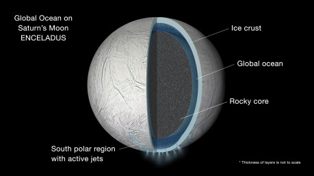
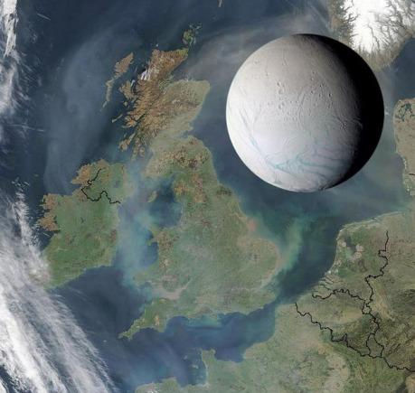

## Enceladus nadějný

Enceladus je vedle Europy dalším geologicky velmi aktivním tělesem hostícím vnitřní oceán kapalné vody. Zatímco podpovrchové oceány budou v naší soustavě výrazně rozšířenější a například Ganymed, Callisto, Titan a dost možná i Pluto a další vzdálená tělesa je mají také, není nám to moc platné, když jsou ukryty pod příliš silnou slupkou ledu nebo když jsou navíc ještě uzavřené mezi vysokotlakým ledem vespodu, který je odděluje od kamenného jádra, a silnou svrchní ledovou kůrou. Oceán na Europě i Enceladu je však v kontaktu s horninovým jádrem, což umožňuje geochemické cykly nezbytné pro případný život, a od povrchu jej odděluje vrstva ledu v řádu jednotek (lokálně) či několika desítek kilometrů.

Enceladus je však našemu zkoumání mnohem přístupnější. Ani několika kilometry ledu bychom zatím a také ani v nejbližší budoucnosti proniknout nedokázali, takže přímé zkoumání těchto oceánů je ještě nadlouho prakticky vyloučené. V případě Enceladu se však nemusíme dostávat skrz ledovou kůru, abychom získali vzorky oceánské vody. Gejzíry poblíž jeho jižního pólu totiž pravidelně chrlí zamrzající vodu. Tyto drobné částečky ledu dokonce tvoří Saturnův tenký E prstenec. Sonda Cassini, která bude u Saturnu působit až do podzimu 2017, dokonce složení gejzírů analyzovala. Přístroje na její palubě však nejsou natolik citlivé, aby rozlišily například různé složitější organické látky. Víme, že ledové částečky z gejzírů obsahují soli, rozličné organické sloučeniny a další příměsi, ale na výrazně podrobnější popis si budeme muset počkat do budoucna na citlivější spektrometry.

Nedávno se opět začalo jednat o možnosti vyslání mise k Enceladu, případně spojené mise k Enceladu a Titanu, největšímu měsíci Saturnu zajímavému svou hustou atmosférou a fascinujícím povrchem s jezery, pláněmi a dunami, složenými z celé řady jednoduchých i složitějších organických látek. Oba měsíce si zaslouží misi schopnou komplexnějších chemických analýz. Kdyby však hypoteticky existoval život na povrchu Titanu, byl by nepodobný pozemskému životu a používal organická rozpouštědla místo vody a musel mít odlišnou chemickou strukturu. Zato v oceánu Enceladu by patrně mohly přežít i organismy založené na stejných biochemických principech jako pozemský život, které bychom tím pádem dokázali snáz zachytit a popsat. Aktuálně probíhají pokusy testující schopnost vybraných pozemských mikroorganismů přežít v podmínkách analogických těm na Enceladu. NASA také momentálně uvažuje o přidání průletové mise k Enceladu mezi kandidáty ve třídě misí Discovery nebo mise k Titanu a Enceladu ve třídě New Frontiers. Přidávání misí do již probíhajícího výběru ale není zvykem, a tak to nepotěšilo obzvlášť vědecké týmy za již vybranými kandidátními misemi.

## Enceladus záhadný

Aktivita Enceladu a skutečnost, že si dokázal udržet vnitřní kapalný oceán, však představují vědeckou záhadu. V porovnání s Europou, která je jen o něco menší než náš Měsíc, je Enceladus titěrný. Jeho průměr 500 kilometrů zhruba odpovídá délce České republiky od západu na východ. Tak malé těleso má od dob svého zrodu jen minimální akreční teplo a rychle jej ztratí. S maličkým kamenným jádrem není ani rozpad radioaktivních prvků dostatečným zdrojem tepla na jakoukoli významnou aktivitu. Zbývají tedy slapové síly – vliv gravitace jiných těles. Na Zemi slapy (způsobované naším Měsícem) zažíváme velmi viditelně jako příliv a odliv.

Na Enceladus však planeta Saturn momentálně působí příliš slabými slapy, a tak se uvažovalo o dřívější rezonanci Enceladu s Dione, která by vedla ke zvýšenému slapovému ohřevu. Intenzita ohřevu však také závisí na vnitřní struktuře měsíce a právě přítomnost oceánu – tím spíše celoplanetárního, umístěného nejen pod ledovou slupkou aktivního jižního pólu – ji podporuje. V blízké době by navíc měla být publikována práce vedená profesorem Čadkem z Katedry geofyziky MFF, založená na datech z gravitačních měření, librace i topografie měsíce. Výsledky modelu naznačují globální podpovrchový oceán a poměrně slabou ledovou slupku – v řádu několika kilometrů v oblasti jižního pólu, okolo 20 km v rovníkových oblastech. Více si můžete poslechnout v záznamu nedávné [přednášky profesora Čadka o Enceladu](https://www.youtube.com/watch?v=n41JloyIiEA).

## Enceladus mladý?

Všechny Saturnovy vnitřní měsíce spolu s prstenci planety představují také určitou záhadu. Jak to, že má každý jiný podíl hornin vůči ledu a jejich kráterový záznam se počtem i rozložením kráterů liší od očekávaného – při stáří kolem 4,5 miliardy let? Kdy a jak vznikly prstence Saturnu, na rozdíl od prstenců ostatních plynných planet velmi masivní a složené téměř z čistého ledu? Již dříve proto byla vyslovena domněnka, že by vnitřní měsíce Mimas, Enceladus, Dione, Tethys a Rhea mohly být nedávnějšího původu nežli samotná sluneční soustava. Mohly se zformovat později z materiálu uvolněného zánikem původního měsíce či měsíců v důsledku katastrofální kolize s jiným tělesem či kolize vzájemné. Předchozí modely udávaly načasování této události přinejmenším před 2,5 miliardami let – pro člověka pořád nepředstavitelně dávno.

Nová práce vydaná v _The Astrophysical Journal_ (Cuk et al., 2016) ji však posouvá mnohem blíž k současnosti… Její autoři včetně českého astronoma sídlícího v USA Davida Nesvorného se podívali na vývoj oběžných drah měsíců a na základě řady simulací došli k závěru, že pozorované vnitřní měsíce mohou být staré jen 1,1 miliardy až 100 milionů let. Na základě míry slapového ohřevu potřebného k vyvolání vysoké geologické aktivity Enceladu se přiklánějí k nižší hranici tohoto rozpětí. Co by ale stáří pouhých 100 milionů let znamenalo pro šance na nalezení života v oceánu Enceladu?

Kupodivu možná velmi málo. Je prakticky nemožné odhadnout, jak dlouho trvá, než se někde s příhodnými podmínkami vyvine život (ostatně stejně jako to, jaké tyto příhodné podmínky vlastně jsou). Na Zemi máme první nepřímé doklady jeho přítomnosti z doby před necelými 4 miliardami let – půlmiliardu let po vzniku naší soustavy. První spolehlivé fosilie pochází z doby ještě o půl miliardy let později. Řekněme tedy, že na Zemi došlo ke vzniku života velmi přibližně půl miliardy let po jejím zformování. Tehdy byly podmínky na Zemi zřejmě ještě poměrně extrémní. U Enceladu, malého ledového měsíce, toto ovšem neplatí. O akrečním teplu ani není třeba hovořit, oceán je od počátku chráněn před slunečním a kosmickým zářením, velmi výrazné výkyvy podmínek tu nečekejme. „Připraven na život“ mohl být měsíc relativně brzy. Pokud navíc v jeho nitru probíhá hydrotermální aktivita, čemuž nasvědčuje složení výtrysků, teplotní a geochemické gradienty pro život se tam patrně neschází. Ale je tam, jak doufají vědci i autoři science fiction? To nám snad prozradí budoucí mise určené k analýze vzorků z gejzírů Enceladu. Zatím o tom můžeme alespoň psát…
