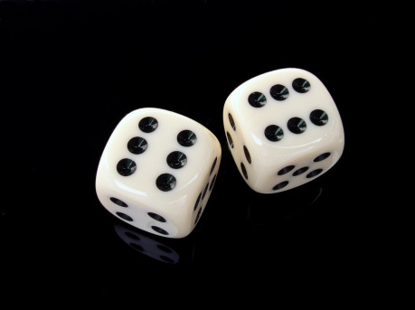

## Dílek pátý – postupně nebo najednou?

Předtím než se pustíme do rozboru herní mechaniky, zastavíme se na malý moment u slůvka _konflikt_. Táhne se s námi v nadpisu celým seriálem, ale přitom jsme ho doposud více nepoužili. Teď nastal ten pravý čas. Co tedy v tomto článku nazýváme _konfliktem_?

Čas od času se hra dostane do bodu, kdy nás zajímá, nejen zda postoupíme dál v příběhu, ale potřebujeme zjistit, kterým směrem se příběh, situace či scéna ve hře posune. Pokud se ve hře nabízí více rozuzlení, budeme takové situaci říkat _konflikt_. Může to tedy být rvačka, ve které se rozhoduje, kdo vyhraje, může se jednat o pronásledování či stopování a rozhodujeme se, zda se někomu podaří utéct či naopak zda a za jakých okolností bude chycen, vyjednávání o ukončení táhlého obléhání hradu, vydírání politického oponenta. Důležité je, že v _konfliktu_ jsou vždy přítomné nejméně dvě strany a každá z nich má zájem na tom, aby se příběh odvíjel nějak jinak. Stranami konfliktu mohou být postavy ve hře, mohou to ale také být hráči anebo hra samotná. Pokud bychom by byl přítomný pouze jediný zájem a vyhodnocování by například řešilo pouze, za jakou cenu bude tohoto zájmu dosaženo, o _konflikt_ by se nejednalo.

Konflikt je tedy nějaký obecnější blok v našem příběhu – někdy může být vyřešen jediným vyhodnocením, ale častěji se může stát, že konflikt rozhodne až série několika různých vyhodnocení. Vlastnosti obou nejrozšířenějších způsobů, jimiž mechanika o takových konfliktech rozhoduje, _postupné vyhodnocování akcí_ a _souhrnné vyhodnocování sporů_, si tedy ukážeme na scéně s nepodařenou loupeží.

> Adam s Boženou a psem Punťou doma načapali neznámou zlodějku. Punťa se pokusí zlodějku kousnout do lýtka, Božena ji zkusí zastřelit a zlodějka se pokusí jim utéct. Adam chce zavolat policii, ale zjistí, že jim zlodějka před vloupáním přestřihla drát od telefonu. Proto vyběhne co nejrychleji k sousedům a chce od nich zavolat policii.

_Postupné vyhodnocování akcí_ předpokládá, že jednotliví účastníci konfliktu postupně, jeden za druhým, dostanou příležitost pokusit se o provedení nějaké _akce_. Každá z těchto _akcí_ se vyhodnocuje _samostatně_, bez ohledu na to, zda na scéně existuje nějaký spor. Ostatní se mohou snažit za určitých okolností (většinou popsaných v pravidlech) provedení akce _zabránit_. Jejich obrana vždy vychází z hlášené akce a je s ní nějakým způsobem (který také často určují pravidla) svázaná. Nemohou si během obrany prosazovat vlastní úmysl, od toho mají svou vlastní akci. Kdyby se jednalo o deskovou hru, tak bychom si mohli představit, že se jednotliví hráči střídají jeden po druhém, každý vždy odehraje celý svůj tah a ostatní mu v tom mohou pouze bránit. Výsledkem _postupného vyhodnocování akcí_ je pro každou dílčí akci absolutní výsledek, který se může pohybovat na škále od plného úspěchu až po úplný neúspěch, přičemž neúspěchem zde rozumíme i výsledek horší, než jaký by nastal, kdyby akce neproběhla.

Příklad:

> Při postupném vyhodnocování akcí postupně přijdou na řadu jednotliví účastníci a jejich akce se tak také budou vyhodnocovat.

- _Punťa bude vyhodnocovat, zda se mu podařilo zakousnout se zlodějce do lýtka. Zlodějka se bude takové akci moct bránit – a v rámci své obrany může být i agresivní. Plný úspěch může znamenat Punťovo zakousnutí se do nohy a úplný neúspěch může znamenat, že zlodějka se nejen ubránila, ale ještě Punťu bolestivě nakopla._
- _Božena bude vyhodnocovat, zda a jak se jí podaří zlodějku trefit. Zlodějka se může pokusit střele například uhnout. Plný úspěch Boženy bude znamenat, že Zuzanu trefí, nebo dokonce zastřelí. Neúspěch může znamenat minutí nebo např. i zaseknutí uzávěru pistole._
- _Zlodějka bude vyhodnocovat, zda a případně jak daleko se jí podařilo utéct. Případný neúspěch může znamenat to, že běží příliš pomalu, nebo dokonce i to, že např. při běhu upadla._
- _Adam bude vyhodnocovat, zda a jak rychle doběhl k sousedům a i u něj může (a nemusí) nastat nějaký obdobně nepříjemný neúspěch._

_Souhrnné vyhodnocování sporů_ sdružuje vzájemně se vylučující akce do jednoho společného vyhodnocení, které rozhodne o tom, jakým způsobem se bude spor mezi těmito akcemi vyvíjet. Každá ze stran sporu při tom v rámci tohoto vyhodnocení prosazuje svůj zájem. Vzájemně sporné akce se vyhodnocují _najednou_ a výsledkem vyhodnocení každého sporu je uspořádání výsledků, které určuje, jakým směrem se spor vyvíjí. V analogii s deskovou hrou to odpovídá hrám, ve kterých hráči nejprve naplánují své tahy a teprve potom vyhodnocují, zda jsou tyto tahy konfliktní, jak se vzájemně ovlivní, případně který z nich se opravdu uskuteční zcela a který jen částečně nebo vůbec. Protože výsledkem je vždy další směřování nebo úplné rozhodnutí sporu, souhrnné vyhodnocování sporů nezná „nepříjemný“ neúspěch – namísto vlastního neúspěchu se při vyhodnocení příběh posune směrem, který zamýšlel oponent – vítěz sporu. Výjimkou je, pokud je potřeba vyhodnotit osamocenou akci, která nemá opozici, a tedy k ní neexistuje sporná akce. V takovém případě je nutné umělou opozici vymyslet a vytvořit tak spor i tam, kde není. Úspěch takovéto umělé opozice pak bývá ekvivalentem „nepříjemného“ neúspěchu původní akce.

Příklad:

> Při souhrnném vyhodnocování sporů se nám ukázková scéna rozdělí na dvě vyhodnocení.
>
> Společně vyhodnotíme Punťu, Boženu i Zuzanu. Pořadí jejich hodů rozhodne o tom, kterým směrem se bude scéna posouvat. Např.:

- _Výsledek Punťa > Božena > Zuzana je možné popsat tak, že Punťa se úspěšně zakousl do lýtka a Zuzaně se tak nepodařilo utéct. Božena nedokázala trefit pistolí Zuzanu, která se psem zápasí._
- _Výsledek Zuzana > Božena > Punťa se popíše tak, že Božena i Punťa minuli a Zuzana se úspěšně vzdaluje_
- _Výsledek Zuzana > Punťa > Božena můžeme popsat tak, že Zuzana vybíhá úspěšně na ulici, zatímco jí na noze visí úspěšně zakousnutý pes, a Božena se bála vystřelit, aby Punťu nestrefila._

> Pokud budeme chtít vyhodnotit Adamův běh k sousedům, musíme vytvořit umělou opozici – např. plot, na kterém by mohl Adam zůstat viset v případě svého neúspěchu.

Jak už jste si zcela jistě všimli, tento dílek skládačky si ve velké většině případů nemůžete zvolit sami. Výrazná většina herních vývojářů provedla tuto volbu již za vás a hra již má konkrétní přístup obsažený ve své mechanice. V následujícím textu si tedy spíše zrekapitulujeme, jaký dopad na vaši hru bude mít volba hry používající jednu či druhou metodu vyhodnocování. Výjimkou v tomto směru je druhá edice Fate, které umožňuje hráčům zvolit si jednu z těchto variant. Existují také hry, které se ani jednoho z uvedených způsobů nedrží, ale z každého z nich si půjčují něco.

Výhodou _postupného vyhodnocování akcí_ je, že jednotlivé akce se vyhodnocují samostatně a výstup z vyhodnocení je možné jednoznačně převést na „kvalitu“, ať už se jedná úspěšnost vyhodnocované činnosti nebo míru naplnění záměru. Nevýhodou je, že neúspěch akce často znamená, že se ve hře nic nestalo. Hra pak může trpět „zasekáváním se“ na obtížných místech a odehrávání „hluchých“ akcí, které nijak neposouvají scénu v případě neúspěchu. Při _postupném vyhodnocování akcí_ také záleží na pořadí, v jakém jsou akce odehrávány. Hry, které ho využívají, tedy většinou obsahují nějakou mechaniku iniciativy či střídání jednotlivých postav. Ta může být výhodou (zajišťuje, že na každou z postav se dostane), ale i nevýhodou – pokud nejste zrovna na řadě, nemůžete ve hře víc než pasivně bránit někomu jinému v tom, o co se snaží, i když by mnohem větší smysl mělo pokusit se o úplně něco jiného.

_Postupné vyhodnocování akcí_ si velmi dobře rozumí s _vyhodnocováním úspěšnosti činnosti_ a na této kombinaci staví velké množství klasických i moderních her. Pokud zůstaneme u toho, že záměr je něco, čeho se snaží dosáhnout postava, můžeme úspěšně _postupné vyhodnocování akcí_ spojit i s _vyhodnocením naplnění záměru_. Toto spojení začne skřípat teprve ve chvíli, kdy bychom zkusili hrát hru, ve které hráč může deklarovat zájem na určitém směřování příběhu, aniž by při vyhodnocení šlo o test dovedností či schopností postav.

Výhodou _souhrnného vyhodnocování sporů_ je, že se snaží pro každé vyhodnocení garantovat posun scény. Ať už se rozhoduje mezi spornými variantami vývoje, nebo nás zajímá vynucený umělý spor, který oponuje osamělé akci, výsledek by vždy měl směřovat k posunu scény. Tento jev je ovšem zároveň i nevýhodou – občas se stává, že nutnost posunout scénu, a tedy vymyslet oponenta „za každou cenu“ ve skutečnosti odrazuje hráče od zkoušení akcí, kde jediné riziko je, že se akce nepodaří. Pokud je _souhrnné vyhodnocování sporů_ ve hře přítomno ve své ryzí formě – tedy každý nahlásí, o co se jeho postava pokouší či na co reaguje, poté se vyhledají jednotlivé spory a ty se vyhodnotí, nedochází vůbec k problémům s návazností jednotlivých akcí či nemožností některých hráčů reagovat na své protivníky. Ve větším počtu postav je ale velmi obtížné takové vyhodnocení provést. Proto si většinou hry používající _souhrnné vyhodnocování sporů_ pomáhají určitou formalizací. Ta má za úkol pomoci hráčům s vyhodnocením, avšak většinou za cenu některých omezení. Jedním z nejčastěji používaných nástrojů je technika příběhové sázky mezi dvěma stranami, kdy se větší konflikty vždy rozkládají na dílčí spory mezi právě dvěma vyústěními příběhu.

_Souhrnné vyhodnocování sporů_ si velmi dobře rozumí s _vyhodnocením naplnění záměru_. Je to dáno hlavně tím, že právě rozdílné záměry (co se pokračování příběhu týká) jsou zdrojem sporů, které je vhodné řešit současně. Pokud zkusíte ve hře používající _souhrnné vyhodnocování sporů_ používat _vyhodnocování úspěšnosti činnosti_, po několika konfliktech zjistíte, že aby tato kombinace fungovala, je potřeba alespoň implicitně přiřazovat každé činnosti nějaký minimální záměr, který se bude považovat za naplněný, aby činnost byla považována za úspěšnou.

Jak bylo již zmíněno výše, _postupné vyhodnocování akcí_ a _souhrnné vyhodnocování sporů_ nejsou jedinými způsoby, jak mechanika může ve hře pracovat. Patří však k těm nejrozšířenějším a porozuměním rozdílu mezi nimi je pak možné odhadnout, zda vám bude, či nebude vyhovovat i nějaký zcela odlišný systém – například dnes oblíbený systém PoweredByTheApocalypse se snaží vyhodnocovat určité typizované situace, které ve hře nastávají. Z postupného vyhodnocování akcí si bere tu vlastnost, že vždy vyhodnocuje situaci právě jednoho hráče a ostatní mu mohou nejvýše pomáhat či bránit. Zároveň si však ze souhrnného vyhodnocování sporů bere myšlenku, že každé vyhodnocení je vlastně sporem o to, kterým směrem se bude příběh posouvat.

## Co říci závěrem?

Série pěti článků o vyhodnocování konfliktů a zároveň konfliktech ve vyhodnocování si kladla za cíl nastínit čtenáři různé příčiny problémů a sporů, se kterými se při hře může setkávat. Záměrem bylo hráči objasnit, z čeho mohou případné neshody plynout. Pokud zde mluvíme o neshodách či problémech, je potřeba závěrem znovu zopakovat, že žádná z popisovaných možností není lékem na všechny bolístky, které hraní her na hrdiny provází. Seznámení se s těmito problémy však může pomoct hráčům identifikovat, co je vlastně předmětem jejich sporů, a nalézt tak hru či herní styl, který bude jejich osobní preferenci vyhovovat více.
