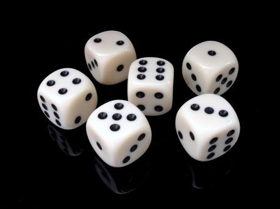

## Technológie

Píšem v [Google Docs](http://docs.google.com/), automatické ukladanie a záloha mimo môjho [notebooku](https://pixel.google.com/chromebook-pixel/) znamená, že o napísaný text neprídem, komentáre využívam, keď chcem niečo rozpracovať alebo ešte premyslieť. Výsledný produkt exportujem do PDF. Na prípadnú úpravu obrázkov používam [pixlr.com](http://pixlr.com/). Na hľadanie textov [Google](http://google.com/) a [Wikipédiu](http://en.wikipedia.org/), na obrázky [Google Images](http://images.google.com/), [deviantart.com ](http://deviantart.com/)alebo [pinterest.com](http://pinterest.com/).

Bez Wikipédie si svoju tvorbu vôbec neviem predstaviť, to je neoceniteľný zdroj inšpirácie. Od osôb, predmetov, historických udalostí až po teórie o kolonizácii vesmíru a zoznamov mien a rodov. Ak chcem vytvoriť napríklad vesmírnu loď tak, aby bola trochu uveriteľná, nájdem si nejakú existujúcu korešpondujúcu loď a jej popis mierne upravím a súčasné technológie nahradím budúcimi.

## Ingrediencie

Ingrediencie sú zvyčajne kombináciou niekoľkých slov, mechanických obmedzení prípadne obrázkov, z ktorých si súťažiaci musia niekoľko vybrať, a zapracovať ich do hry. Vždy je určené, koľko ingrediencií musia autori zapracovať. Počty sú navrhnuté tak, aby sa každé dve hry prekrývali v aspoň jednej ingrediencii. Keď si ingrediencie prečítam, nechám ich v hlave uležať deň, dva, kým pristúpim k brainstormingu.

## Brainstorming

V tejto fáze ide o vygenerovanie čo najväčšieho množstva nápadov, nie o ich kvalitu.

Ku každej ingrediencii si napíšem pár stručných nápadov, potom internetovať, a hľadám, či na mňa vybehne niečo zaujímavé. Začnem stránkami, potom prejdem na obrázky, a všetko, čo považujem za zaujímavé, si pripisujem k jednotlivým ingredienciám.

## Kombinovanie nápadov

Keď mám ku každej ingrediencii aspoň päť-šesť nápadov, pozerám, čo by sa dalo zaujímavo skombinovať, či je tam nejaký zaujímavý motív.

Okrem toho sa (občas :-)) snažím neopakovať motívy z predošlých ročníkov. Výstupom kombinovania nápadov je niekoľko krátkych settingov, z ktorých si nakoniec jeden vyberiem a rozpracujem.

## Štruktúra hry

Keďže som už hier napísal niekoľko, postupne sa mi ustálila štruktúra pravidiel na nasledujúcej šablóne:

1. __Jednostranový úvod do settingu__ – text, ktorý má v krátkosti navnadiť hráčov na hru
1. __Pomôcky k hre__ – čo hráči potrebujú k hre
1. __Tvorba postavy__ – aké postavy si hráči môžu vytvoriť, ako, príklady mien, schopnosti
1. __Herné mechaniky__ – mechanické pravidlá, ako hra funguje. K tomuto bodu napíšem viac detailov nižšie.
1. __Detailnejší popis settingu__ – pár miest, situácia a pár ďalších drobností, ktoré môžu hráči využiť pri hre
1. __Protivníci__ – niekoľko vzorových protivníkov, či už ľudí, zvery alebo netvory
1. __Poznámky dizajnéra__ – pár viet o tom, ktoré ingrediencie som si vybral, a ako som ich zapracoval do hry
1. __Prílohy__ – obrázky, mapky, prázdna karta postavy atď.

## Herné mechaniky

Keď mám setting rozpísaný na jednu stranu, snažím sa vymyslieť herné mechaniky tak, aby podporovali tému a náladu hry, ktorú chcem dosiahnuť. Využívam k tomu dve metódy:

1. Tematické prvky premením na mechanické pojmy
1. Využívanie odmeňujem buď väčšou šancou postavy na úspech (v podobe bonusov, alebo extra kociek) alebo úplatkom pre hráča (ak robí, čo chcem, aby robil, dostane pre svoju postavu body na zlepšenie).

> __Príklad:__ Ak chcem napísať hru o malej vojenskej jednotke s dôrazom na spoluprácu, v mechanikách sa to prejaví množstvom schopností zameranými na boj, prepracovanejším súbojovým systémom, rôznym vybavením, a extra odmenami (bonusy atď) za spoluprácu postáv.

## Záverečné učesanie

Keď mám hru dopísanú, ešte si ju prejdem, snažím sa vychytať nelogické veci, pozostatky z rôznych verzií pravidiel, preklepy. Skracujem vety, pretože mám tendenciu písať dlhé a zložité súvetia, čo je často menej zrozumiteľné. Sústredím sa na to, aby som čo najlepšie “previedol myšlienky na papier” v podobe zrozumiteľnej pre ľudí, ktorí budú pravidlá čítať prvý krát.

Dúfam, že vám tento krátky článok pomôže a inšpiruje vás pri vašich autorských pokusoch, či už v RPG Kuchyni, alebo mimo nej.
